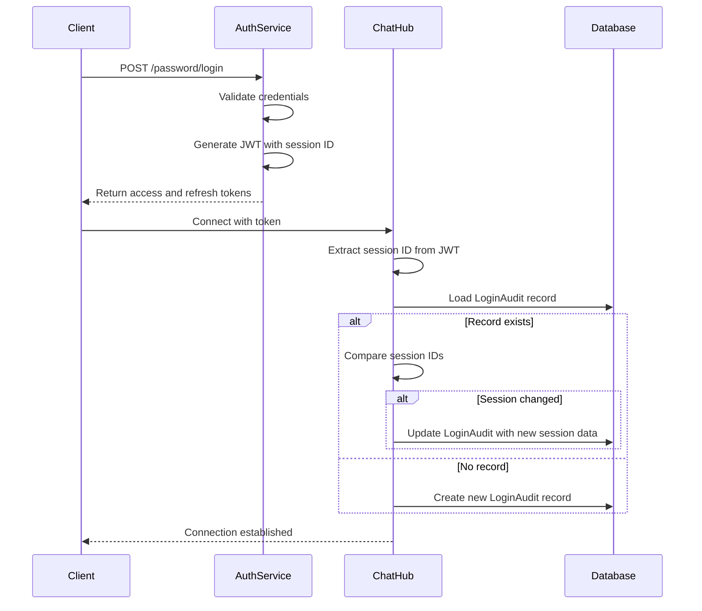
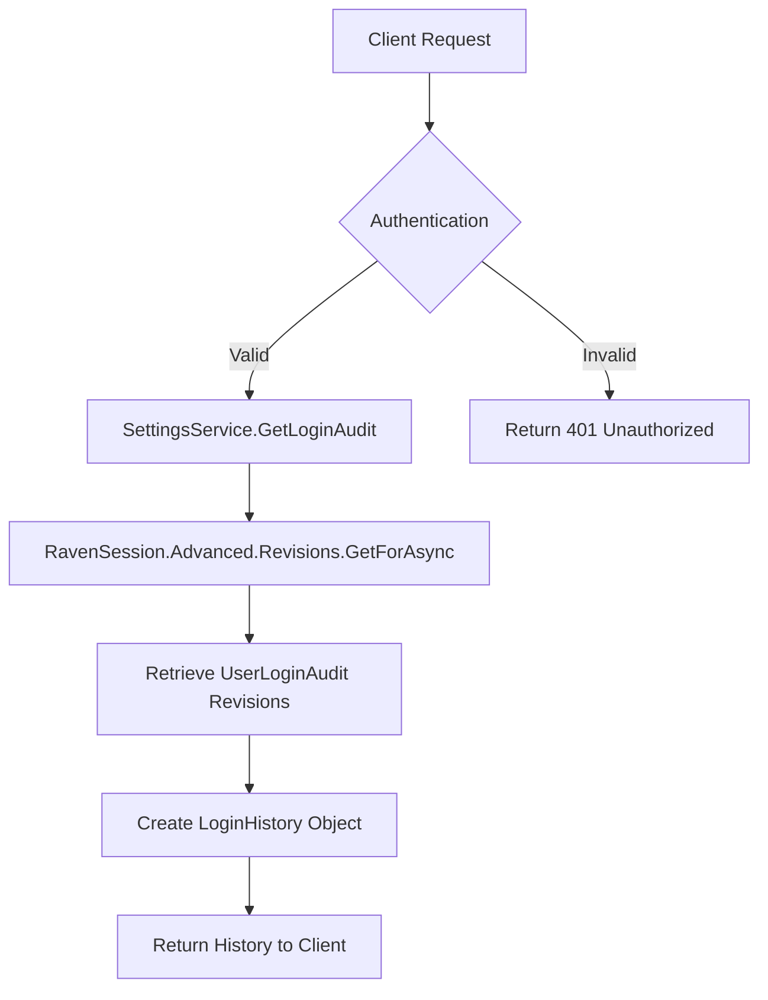
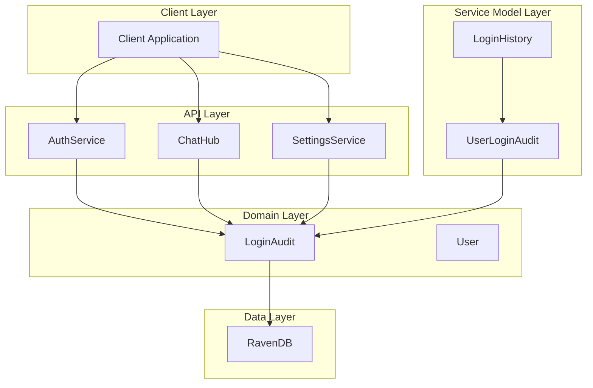

# Authentication System

<cite>
**Referenced Files in This Document**   
- [IProfile.cs](file://src/Unlimotion.Interface/IProfile.cs)
- [LoginAudit.cs](file://src/Unlimotion.Domain/LoginAudit.cs)
- [UserLoginAudit.cs](file://src/Unlimotion.Server.ServiceModel/Molds/UserLoginAudit.cs)
- [LoginHistory.cs](file://src/Unlimotion.Server.ServiceModel/Molds/LoginHistory.cs)
- [AuthService.cs](file://src/Unlimotion.Server.ServiceInterface/AuthService.cs)
- [SettingsService.cs](file://src/Unlimotion.Server.ServiceInterface/SettingsService.cs)
- [ChatHub.cs](file://src/Unlimotion.Server/hubs/ChatHub.cs)
- [AppHost.cs](file://src/Unlimotion.Server/AppHost.cs)
- [Auth.cs](file://src/Unlimotion.Server.ServiceModel/Auth.cs)
</cite>

## Table of Contents
1. [Introduction](#introduction)
2. [IProfile Interface and Session Management](#iprofile-interface-and-session-management)
3. [LoginAudit Entity and Authentication Tracking](#loginaudit-entity-and-authentication-tracking)
4. [UserLoginAudit Service Model and API Serialization](#userloginaudit-service-model-and-api-serialization)
5. [Authentication Flow and User Session Relationship](#authentication-flow-and-user-session-relationship)
6. [Login History Access and Maintenance](#login-history-access-and-maintenance)
7. [Security Monitoring and User Activity Tracking](#security-monitoring-and-user-activity-tracking)
8. [Authentication Architecture Overview](#authentication-architecture-overview)
9. [Conclusion](#conclusion)

## Introduction
The Unlimotion authentication system provides secure user authentication, session management, and comprehensive login auditing capabilities. This documentation details the core components of the authentication system, focusing on the IProfile interface for profile operations, the LoginAudit entity for tracking authentication events, and the UserLoginAudit service model for API transmission of login data. The system implements JWT-based authentication with refresh tokens, maintains detailed login history, and provides mechanisms for security monitoring and user activity tracking.

## IProfile Interface and Session Management
The IProfile interface defines the contract for profile operations within the Unlimotion application. It specifies a single method, Open, which initiates the loading of a user session. This interface serves as an abstraction layer for profile-related functionality, allowing different implementations to handle user profile operations while maintaining a consistent contract. The Open method takes a userId parameter and returns a Task, indicating that the session loading operation is performed asynchronously. This design enables non-blocking profile initialization and supports integration with various client applications.

**Section sources**
- [IProfile.cs](file://src/Unlimotion.Interface/IProfile.cs#L9-L11)

## LoginAudit Entity and Authentication Tracking
The LoginAudit entity in the domain layer captures comprehensive information about user authentication events. It contains properties that track critical security and diagnostic information, including the user's IP address, session identifier, client application version, operating system, and the exact timestamp of the login attempt. The entity is designed to maintain a persistent record of authentication events in the database, with each record uniquely identified by an Id property. This information is essential for security monitoring, anomaly detection, and forensic analysis of user access patterns.

**Section sources**
- [LoginAudit.cs](file://src/Unlimotion.Domain/LoginAudit.cs#L5-L13)

## UserLoginAudit Service Model and API Serialization
The UserLoginAudit class in the service model layer serves as the data transfer object for authentication audit information transmitted through the API. It mirrors the properties of the domain-level LoginAudit entity but includes descriptive attributes for API documentation and client interpretation. The class is annotated with Description attributes that provide human-readable labels for each property, facilitating proper rendering in API documentation and client applications. This service model is serialized and transmitted to clients when retrieving login history, ensuring consistent data representation across the system.

**Section sources**
- [UserLoginAudit.cs](file://src/Unlimotion.Server.ServiceModel/Molds/UserLoginAudit.cs#L7-L21)

## Authentication Flow and User Session Relationship
The authentication system establishes a direct relationship between authentication events and user sessions through the JWT token generation process. When a user successfully authenticates, the system generates a JWT token containing a unique session identifier stored in the token's payload under the "session" claim. This session ID is then used to associate all subsequent requests with the specific authentication event. The ChatHub component processes incoming connections by validating the JWT token and updating the LoginAudit record with current connection details, including IP address, operating system, and client version. If the session ID in the token differs from the one stored in the audit record, the system updates the audit information to reflect the new session characteristics.

**Diagram sources**
- [AuthService.cs](file://src/Unlimotion.Server.ServiceInterface/AuthService.cs#L157-L185)
- [ChatHub.cs](file://src/Unlimotion.Server/hubs/ChatHub.cs#L131-L162)
- [ChatHub.cs](file://src/Unlimotion.Server/hubs/ChatHub.cs#L191-L220)

**Section sources**
- [AuthService.cs](file://src/Unlimotion.Server.ServiceInterface/AuthService.cs#L157-L217)
- [ChatHub.cs](file://src/Unlimotion.Server/hubs/ChatHub.cs#L131-L237)

## Login History Access and Maintenance
Login history is maintained through RavenDB's revision system, which automatically preserves historical versions of documents. The SettingsService implements the GetLoginAudit endpoint that retrieves the complete login history for the authenticated user by accessing document revisions. The service constructs a LoginHistory response object containing a list of UserLoginAudit records representing past authentication events. This approach provides a complete audit trail of user logins without requiring explicit history management code. The current session identifier is also included in the response, allowing clients to distinguish between the active session and historical login events.

**Diagram sources**
- [SettingsService.cs](file://src/Unlimotion.Server.ServiceInterface/SettingsService.cs#L15-L30)
- [LoginHistory.cs](file://src/Unlimotion.Server.ServiceModel/Molds/LoginHistory.cs#L7-L13)

**Section sources**
- [SettingsService.cs](file://src/Unlimotion.Server.ServiceInterface/SettingsService.cs#L15-L30)
- [LoginHistory.cs](file://src/Unlimotion.Server.ServiceModel/Molds/LoginHistory.cs#L7-L13)

## Security Monitoring and User Activity Tracking
The authentication data collected by the system serves multiple security and monitoring purposes. By tracking IP addresses, client versions, and operating systems across login events, the system enables detection of suspicious activity such as logins from unusual locations or unrecognized devices. The timestamp information allows for analysis of user behavior patterns and identification of potential account sharing or unauthorized access. Security teams can use this data to investigate security incidents, verify user identities during support interactions, and implement adaptive security measures based on risk assessment of login patterns. The separation of the LoginAudit domain entity from the UserLoginAudit service model ensures that sensitive audit data can be filtered or transformed before transmission to clients, maintaining appropriate security boundaries.

**Section sources**
- [LoginAudit.cs](file://src/Unlimotion.Domain/LoginAudit.cs#L5-L13)
- [UserLoginAudit.cs](file://src/Unlimotion.Server.ServiceModel/Molds/UserLoginAudit.cs#L7-L21)
- [ChatHub.cs](file://src/Unlimotion.Server/hubs/ChatHub.cs#L191-L237)

## Authentication Architecture Overview
The authentication system in Unlimotion follows a layered architecture with clear separation of concerns between domain entities, service models, and implementation services. The system leverages JWT for stateless authentication while maintaining session context through token claims. RavenDB serves as the persistence layer for both user data and authentication audit records, utilizing its revision feature to automatically maintain login history. The integration between the AuthService, which handles credential validation and token generation, and the ChatHub, which manages connection authentication and audit updates, creates a comprehensive security framework that tracks user activity from initial login through ongoing session usage.

**Diagram sources**
- [AuthService.cs](file://src/Unlimotion.Server.ServiceInterface/AuthService.cs)
- [ChatHub.cs](file://src/Unlimotion.Server/hubs/ChatHub.cs)
- [SettingsService.cs](file://src/Unlimotion.Server.ServiceInterface/SettingsService.cs)
- [LoginAudit.cs](file://src/Unlimotion.Domain/LoginAudit.cs)
- [UserLoginAudit.cs](file://src/Unlimotion.Server.ServiceModel/Molds/UserLoginAudit.cs)
- [LoginHistory.cs](file://src/Unlimotion.Server.ServiceModel/Molds/LoginHistory.cs)

## Conclusion
The Unlimotion authentication system provides a robust framework for user authentication, session management, and security monitoring. By implementing a comprehensive audit trail of login events and maintaining clear relationships between authentication attempts and user sessions, the system enables both secure access control and detailed activity tracking. The separation of concerns between domain entities, service models, and implementation services ensures maintainability and extensibility, while the use of JWT tokens with embedded session information provides efficient session management. This architecture supports both immediate security requirements and long-term user behavior analysis, making it well-suited for applications with significant security and compliance considerations.