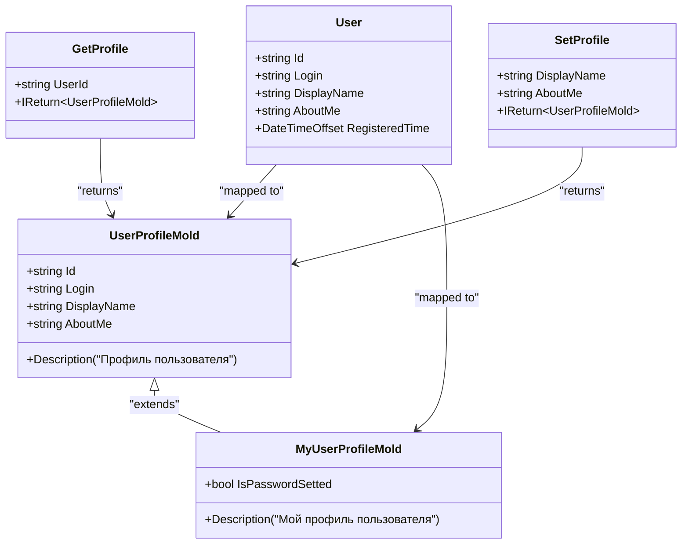
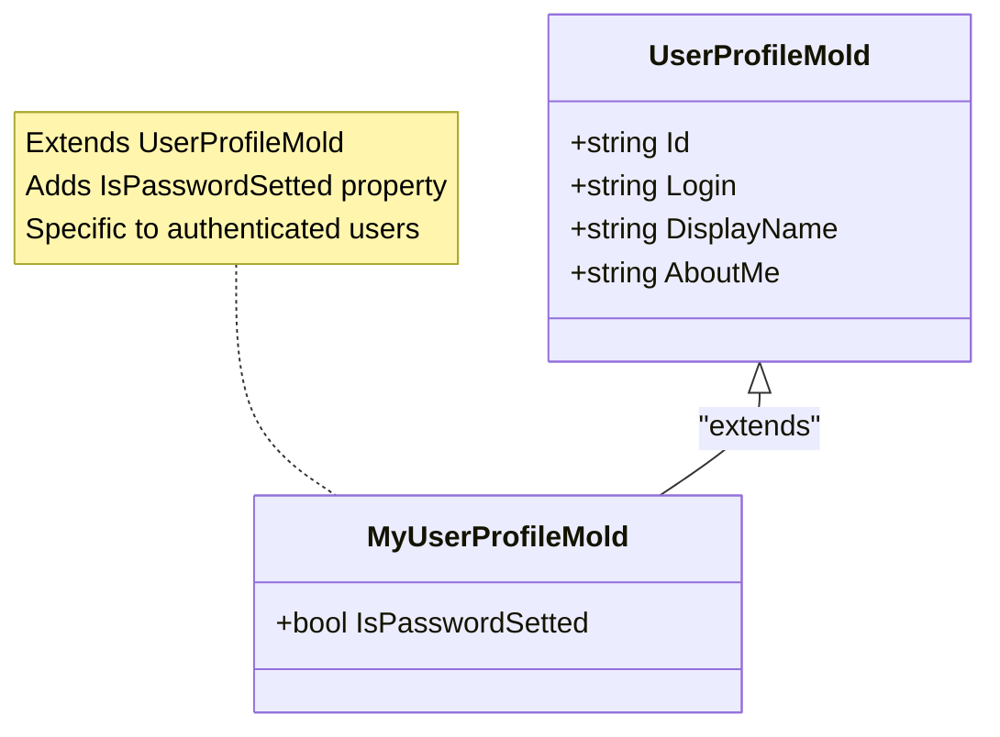
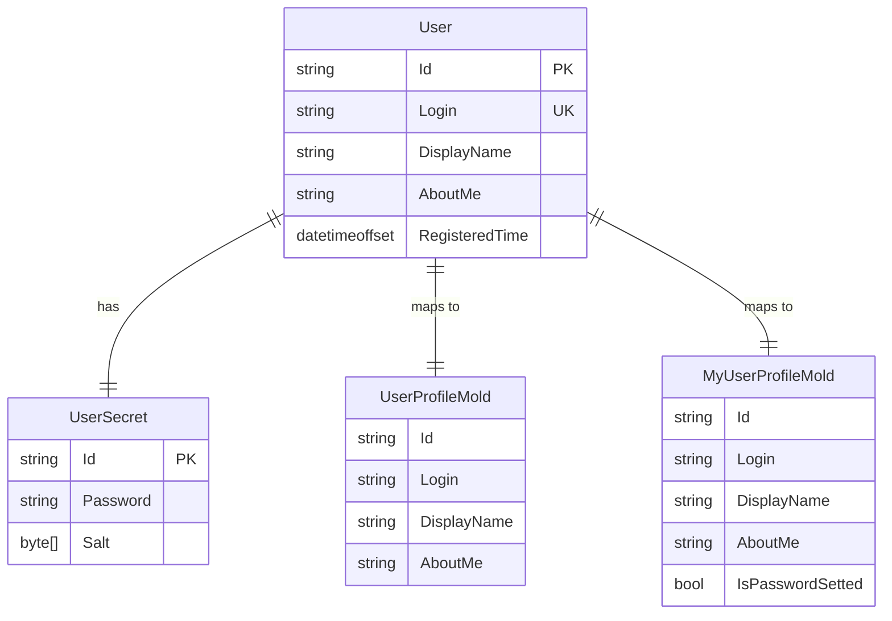
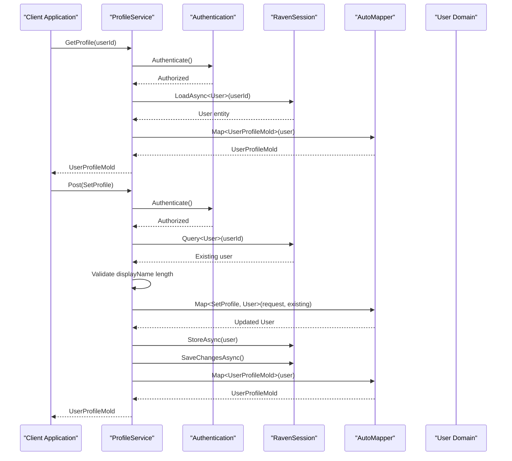
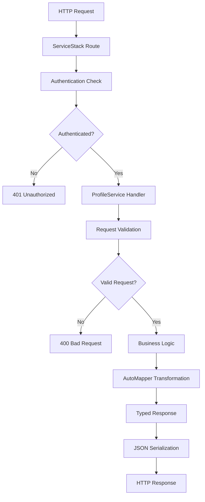

# Profile Service Models

<cite>
**Referenced Files in This Document**
- [UserProfileMold.cs](file://src/Unlimotion.Server.ServiceModel/Molds/UserProfileMold.cs)
- [MyUserProfileMold.cs](file://src/Unlimotion.Server.ServiceModel/Molds/MyUserProfileMold.cs)
- [User.cs](file://src/Unlimotion.Domain/User.cs)
- [ProfileService.cs](file://src/Unlimotion.Server.ServiceInterface/ProfileService.cs)
- [AuthService.cs](file://src/Unlimotion.Server.ServiceInterface/AuthService.cs)
- [Profile.cs](file://src/Unlimotion.Server.ServiceModel/Profile.cs)
- [AppModelMapping.cs](file://src/Unlimotion.Server/AppModelMapping.cs)
</cite>

## Table of Contents
1. [Introduction](#introduction)
2. [Core Model Architecture](#core-model-architecture)
3. [UserProfileMold Class](#userprofilemold-class)
4. [MyUserProfileMold Class](#myuserprofilemold-class)
5. [Domain Entity Relationship](#domain-entity-relationship)
6. [Service Layer Integration](#service-layer-integration)
7. [AutoMapper Configuration](#automapper-configuration)
8. [API Communication Patterns](#api-communication-patterns)
9. [Security Considerations](#security-considerations)
10. [Usage Examples](#usage-examples)
11. [Best Practices](#best-practices)

## Introduction

The Unlimotion profile service models represent a sophisticated data transfer object (DTO) architecture designed to facilitate secure and efficient communication between the client applications and the ServiceStack-based backend API. These models serve as standardized containers for user profile information, implementing a clear separation between domain entities and service layer contracts while maintaining comprehensive localization support through descriptive attributes.

The profile service architecture consists of two primary model classes: `UserProfileMold` for basic user profile data and `MyUserProfileMold` for enhanced profiles that include sensitive information such as password status. This design enables fine-grained control over data exposure while supporting both public and private profile access patterns.

## Core Model Architecture

The profile service models follow a hierarchical inheritance pattern that promotes code reuse and maintains consistency across different profile scenarios. The architecture emphasizes type safety, localization support, and clear separation of concerns between presentation and domain layers.

**Diagram sources**
- [UserProfileMold.cs](file://src/Unlimotion.Server.ServiceModel/Molds/UserProfileMold.cs#L1-L20)
- [MyUserProfileMold.cs](file://src/Unlimotion.Server.ServiceModel/Molds/MyUserProfileMold.cs#L1-L11)
- [User.cs](file://src/Unlimotion.Domain/User.cs#L1-L25)
- [Profile.cs](file://src/Unlimotion.Server.ServiceModel/Profile.cs#L1-L33)

## UserProfileMold Class

The `UserProfileMold` class serves as the foundational data transfer object for user profile information, encapsulating essential user metadata while maintaining strict adherence to localization principles through comprehensive description attributes.

### Class Structure and Properties

The `UserProfileMold` implements a clean, immutable property structure designed for optimal serialization and deserialization performance. Each property is decorated with localized description attributes that enable automatic internationalization support across the application ecosystem.

| Property | Type | Description | Localization |
|----------|------|-------------|--------------|
| Id | string | Unique user identifier | "Идентификатор пользователя" |
| Login | string | User alias or handle | "Псевдоним пользователя" |
| DisplayName | string | User-visible name | "Имя пользователя" |
| AboutMe | string | Personal description | "О себе" |

### Design Principles

The `UserProfileMold` follows several key design principles:

- **Localization First**: All properties include comprehensive description attributes for automatic translation support
- **Immutable Structure**: Properties are designed for efficient serialization without modification during transmission
- **Minimal Footprint**: Contains only essential user information for profile display scenarios
- **Type Safety**: Strongly typed properties prevent runtime errors during data binding

### Implementation Details

The class utilizes the `[Description]` attribute from `System.ComponentModel` namespace to provide metadata for localization systems. This approach enables automatic generation of user-friendly interface elements and error messages across different languages.

**Section sources**
- [UserProfileMold.cs](file://src/Unlimotion.Server.ServiceModel/Molds/UserProfileMold.cs#L1-L20)

## MyUserProfileMold Class

The `MyUserProfileMold` class extends `UserProfileMold` to provide enhanced profile information specifically designed for authenticated user contexts. This specialized model includes the `IsPasswordSetted` property, enabling clients to make informed decisions about password-related operations.

### Inheritance and Extension Pattern

The `MyUserProfileMold` demonstrates proper inheritance usage by extending `UserProfileMold` while adding domain-specific functionality. This approach maintains backward compatibility with existing consumers while providing additional capabilities for authenticated scenarios.

**Diagram sources**
- [MyUserProfileMold.cs](file://src/Unlimotion.Server.ServiceModel/Molds/MyUserProfileMold.cs#L1-L11)
- [UserProfileMold.cs](file://src/Unlimotion.Server.ServiceModel/Molds/UserProfileMold.cs#L1-L20)

### IsPasswordSetted Property

The `IsPasswordSetted` property serves as a critical indicator for password management operations. This boolean flag enables clients to conditionally render password-related UI elements and enforce appropriate security policies.

| Property | Type | Description | Purpose |
|----------|------|-------------|---------|
| IsPasswordSetted | bool | Indicates password configuration status | Enables conditional UI rendering |

### Security Implications

The inclusion of password status information in the profile model raises important security considerations. The property is populated through secure authentication mechanisms and validated against user session context to prevent unauthorized access to sensitive information.

**Section sources**
- [MyUserProfileMold.cs](file://src/Unlimotion.Server.ServiceModel/Molds/MyUserProfileMold.cs#L1-L11)

## Domain Entity Relationship

The profile service models maintain a clear separation from domain entities while establishing robust mapping relationships through AutoMapper configuration. This architectural decision ensures that service layer contracts remain decoupled from underlying persistence concerns.

### User Domain Entity

The domain `User` entity represents the authoritative source of user information within the application. Unlike service models, domain entities contain additional metadata and business logic that is not exposed through the API surface.

**Diagram sources**
- [User.cs](file://src/Unlimotion.Domain/User.cs#L1-L25)
- [UserProfileMold.cs](file://src/Unlimotion.Server.ServiceModel/Molds/UserProfileMold.cs#L1-L20)
- [MyUserProfileMold.cs](file://src/Unlimotion.Server.ServiceModel/Molds/MyUserProfileMold.cs#L1-L11)

### Separation of Concerns

The domain-service model separation provides several benefits:

- **Persistence Independence**: Service models remain unaffected by database schema changes
- **Security Boundaries**: Sensitive domain information remains hidden from external APIs
- **Version Compatibility**: Service models can evolve independently of domain entities
- **Performance Optimization**: Service models can be tailored for specific API scenarios

**Section sources**
- [User.cs](file://src/Unlimotion.Domain/User.cs#L1-L25)

## Service Layer Integration

The profile service layer demonstrates sophisticated integration patterns that leverage ServiceStack's authentication framework and AutoMapper for seamless data transformation. The integration ensures secure, efficient communication between client applications and the backend API.

### ProfileService Implementation

The `ProfileService` class exemplifies ServiceStack best practices by implementing strongly-typed request/response patterns and leveraging dependency injection for database access and mapping services.

**Diagram sources**
- [ProfileService.cs](file://src/Unlimotion.Server.ServiceInterface/ProfileService.cs#L1-L49)

### Authentication Integration

The service layer integrates seamlessly with ServiceStack's authentication system through the `[Authenticate]` attribute, ensuring that all profile operations require valid user sessions. This approach provides automatic session validation and user context resolution.

### Data Validation and Sanitization

The service implementation includes comprehensive data validation, particularly for the `DisplayName` property, which is constrained to 32 characters to maintain consistent display formatting across client applications.

**Section sources**
- [ProfileService.cs](file://src/Unlimotion.Server.ServiceInterface/ProfileService.cs#L1-L49)

## AutoMapper Configuration

The AutoMapper configuration establishes robust mapping relationships between domain entities and service models, ensuring consistent data transformation while maintaining performance optimization through compiled mappings.

### Mapping Configuration

The mapping configuration demonstrates advanced AutoMapper patterns including inheritance mapping and property-specific transformations. The configuration supports bidirectional mapping for certain entities while providing specialized transformations for others.

| Source Type | Target Type | Mapping Strategy | Notes |
|-------------|-------------|------------------|-------|
| User | UserProfileMold | Direct mapping | Basic profile properties |
| User | MyUserProfileMold | Base inheritance + custom property | Extends UserProfileMold |
| SetProfile | User | Property mapping with exclusions | Updates existing user |

### Advanced Mapping Features

The AutoMapper configuration includes several advanced features:

- **Inheritance Support**: Proper handling of `MyUserProfileMold` inheritance from `UserProfileMold`
- **Property Exclusions**: Ignoring domain-specific properties during mapping
- **Compiled Mappings**: Performance optimization through pre-compiled mapping expressions
- **Validation**: Configuration assertion to catch mapping errors early

### Mapping Performance

The configuration employs several performance optimization strategies:

- **Compiled Mappings**: Pre-compilation reduces runtime overhead
- **Assert Configuration**: Early detection of mapping issues
- **Selective Property Mapping**: Explicit property specification minimizes unnecessary transformations

**Section sources**
- [AppModelMapping.cs](file://src/Unlimotion.Server/AppModelMapping.cs#L1-L52)

## API Communication Patterns

The profile service models integrate with ServiceStack's routing and response patterns to provide consistent, type-safe API communication. The implementation demonstrates ServiceStack's best practices for RESTful service development.

### Request/Response Patterns

The API defines clear request/response contracts through strongly-typed DTOs that inherit from ServiceStack's base interfaces. This approach ensures type safety and enables automatic request validation.

**Diagram sources**
- [Profile.cs](file://src/Unlimotion.Server.ServiceModel/Profile.cs#L1-L33)

### ServiceStack Integration

The API leverages ServiceStack's built-in features:

- **Automatic Routing**: URL generation from route attributes
- **Request Validation**: Built-in parameter validation
- **Response Serialization**: Automatic JSON serialization
- **Error Handling**: Consistent error response formatting

### API Endpoint Specifications

| Endpoint | Method | Request Type | Response Type | Purpose |
|----------|--------|--------------|---------------|---------|
| `/getprofile` | GET | GetProfile | UserProfileMold | Retrieve user profile |
| `/setprofile` | POST | SetProfile | UserProfileMold | Update user profile |

**Section sources**
- [Profile.cs](file://src/Unlimotion.Server.ServiceModel/Profile.cs#L1-L33)

## Security Considerations

The profile service models implement comprehensive security measures to protect user information while enabling necessary functionality. The security architecture balances usability with protection against unauthorized access and data leakage.

### Authentication Requirements

All profile operations require authentication through ServiceStack's authentication framework. The `[Authenticate]` attribute ensures that:

- Only authorized users can access their own profile information
- Session validation prevents unauthorized requests
- User context is automatically resolved from the authentication token

### Data Exposure Control

The service model hierarchy provides fine-grained control over data exposure:

- **Public Profiles**: `UserProfileMold` exposes only non-sensitive information
- **Private Profiles**: `MyUserProfileMold` includes sensitive information for authenticated users
- **Conditional Information**: Password status is included only for the authenticated user

### Password Status Security

The `IsPasswordSetted` property requires special security consideration:

- **Context-Sensitive**: Property is populated only for the authenticated user
- **Session Validation**: Access is validated against current user session
- **No Cross-Contamination**: Password status cannot be accessed for other users

### Data Sanitization

The service implementation includes data sanitization measures:

- **DisplayName Length Limitation**: Enforced maximum length of 32 characters
- **Input Validation**: Comprehensive validation of all user-provided data
- **Output Sanitization**: Clean data transmission without sensitive information leakage

## Usage Examples

The profile service models demonstrate practical usage patterns across different scenarios, from basic profile retrieval to comprehensive profile updates with password management.

### Basic Profile Retrieval

Profile retrieval demonstrates the simplest usage pattern, where clients request user information using the `GetProfile` endpoint. The service resolves the user context from the authentication token and returns a sanitized `UserProfileMold`.

### Profile Update Operations

Profile update operations showcase the complete data transformation pipeline, from request validation through domain entity updates and response serialization. The process includes data sanitization, validation, and automatic mapping.

### Private Profile Access

The `GetMyProfile` operation in the `AuthService` demonstrates private profile access, where the service retrieves the authenticated user's complete profile including sensitive information like password status.

### Password Management Integration

The integration between profile models and password management illustrates how service models support complex business operations while maintaining security boundaries.

**Section sources**
- [AuthService.cs](file://src/Unlimotion.Server.ServiceInterface/AuthService.cs#L100-L130)
- [ProfileService.cs](file://src/Unlimotion.Server.ServiceInterface/ProfileService.cs#L18-L49)

## Best Practices

The profile service models implementation demonstrates several industry best practices for API design, data modeling, and security implementation. These practices ensure maintainable, scalable, and secure service architecture.

### Model Design Principles

- **Single Responsibility**: Each model serves a specific purpose in the data flow
- **Immutability**: Properties are designed for safe serialization without modification
- **Localization Support**: Comprehensive description attributes enable internationalization
- **Type Safety**: Strong typing prevents runtime errors and improves developer experience

### Security Best Practices

- **Defense in Depth**: Multiple layers of authentication and authorization
- **Principle of Least Privilege**: Minimal data exposure based on user context
- **Secure Defaults**: Default security settings prevent accidental data leakage
- **Context Awareness**: Security decisions based on user authentication state

### Performance Optimization

- **Compiled Mappings**: AutoMapper pre-compilation reduces runtime overhead
- **Selective Property Mapping**: Explicit property specification minimizes transformation costs
- **Lazy Loading**: Database queries optimized through selective loading patterns
- **Caching Considerations**: Model caching strategies for frequently accessed data

### Maintainability Guidelines

- **Clear Separation**: Distinct layers for domain, service, and presentation concerns
- **Consistent Naming**: Standardized naming conventions across all model types
- **Documentation**: Comprehensive inline documentation for all public members
- **Version Compatibility**: Backward-compatible model evolution strategies

### Testing Strategies

- **Unit Testing**: Individual model behavior testing
- **Integration Testing**: Service layer integration verification
- **Security Testing**: Authentication and authorization validation
- **Performance Testing**: Mapping and serialization performance validation