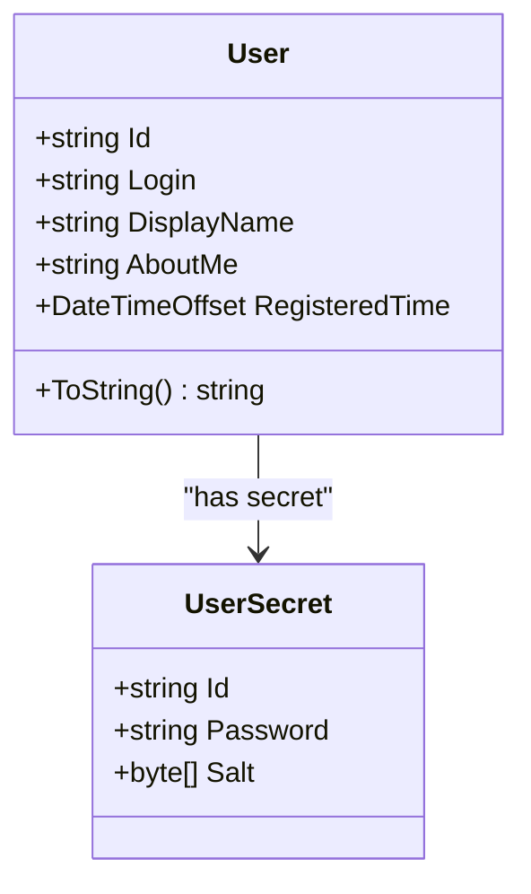
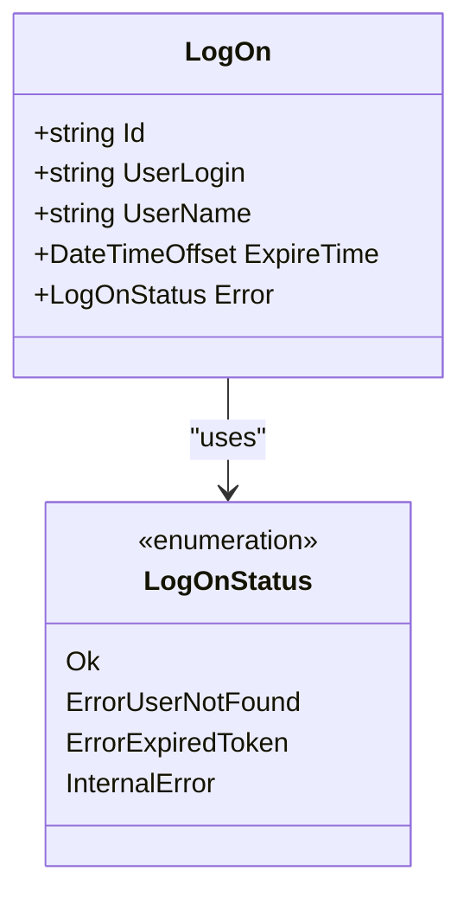
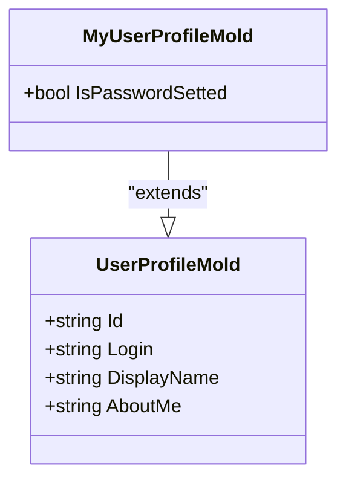
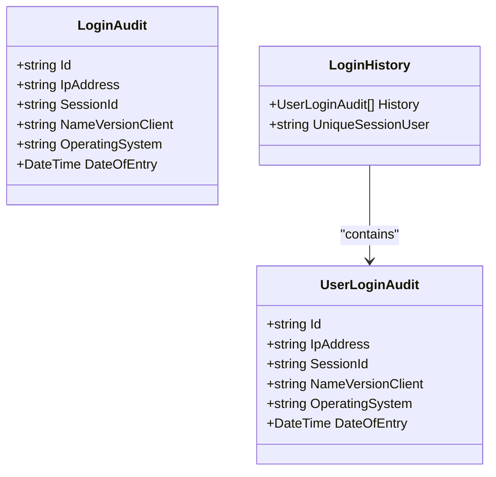
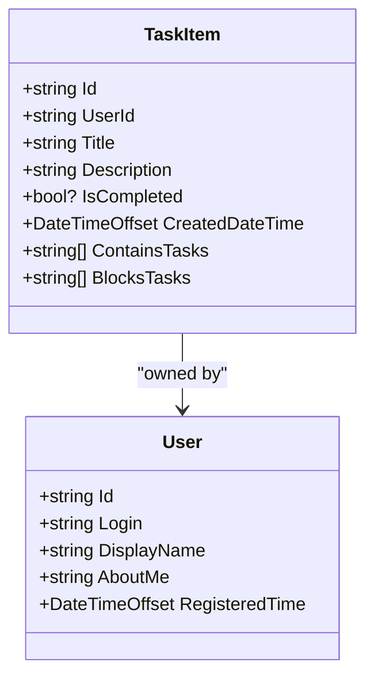
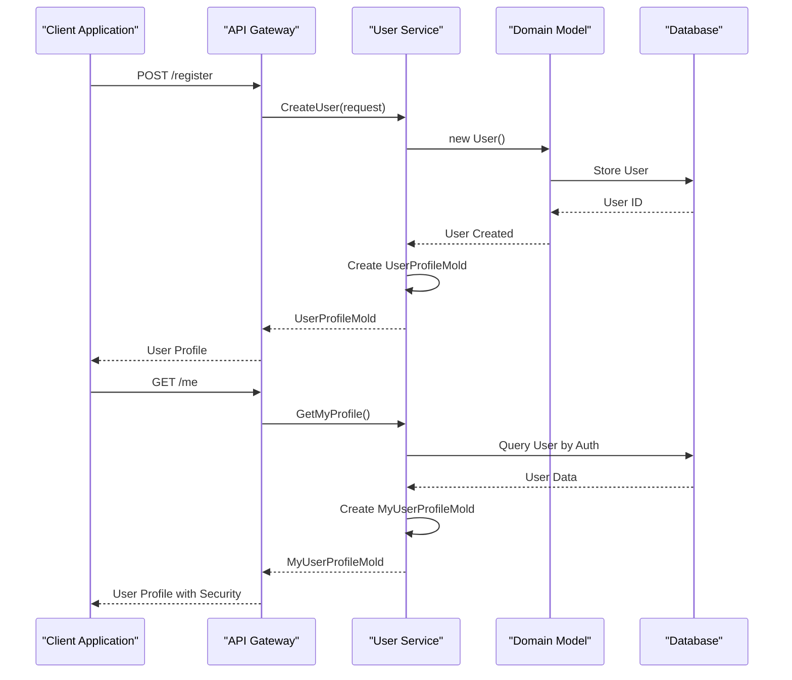
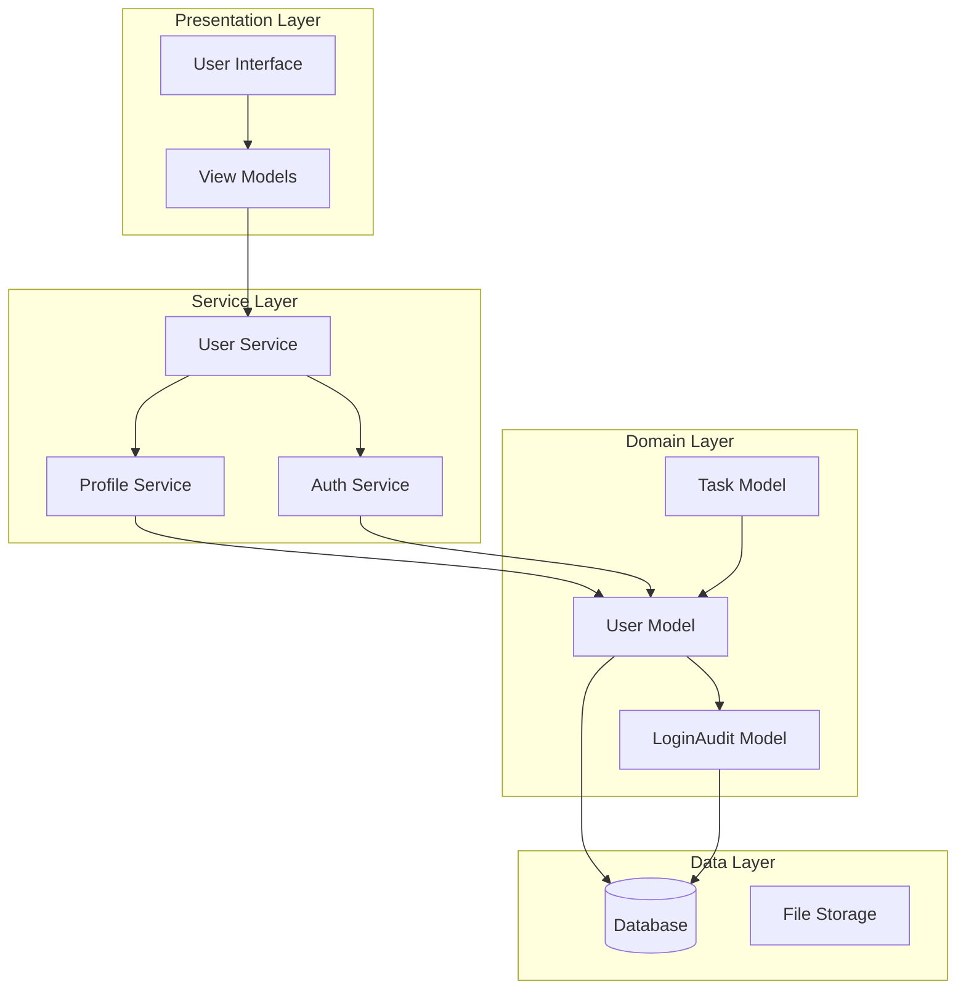

# User Model Documentation

<cite>
**Referenced Files in This Document**
- [User.cs](file://src/Unlimotion.Domain/User.cs)
- [LogOn.cs](file://src/Unlimotion.Interface/LogOn.cs)
- [LoginAudit.cs](file://src/Unlimotion.Domain/LoginAudit.cs)
- [UserProfileMold.cs](file://src/Unlimotion.Server.ServiceModel/Molds/UserProfileMold.cs)
- [MyUserProfileMold.cs](file://src/Unlimotion.Server.ServiceModel/Molds/MyUserProfileMold.cs)
- [IProfile.cs](file://src/Unlimotion.Interface/IProfile.cs)
- [Profile.cs](file://src/Unlimotion.Server.ServiceModel/Profile.cs)
- [Auth.cs](file://src/Unlimotion.Server.ServiceModel/Auth.cs)
- [TaskItem.cs](file://src/Unlimotion.Domain/TaskItem.cs)
- [ChatHub.cs](file://src/Unlimotion.Server\hubs\ChatHub.cs)
- [LoginHistory.cs](file://src/Unlimotion.Server.ServiceModel\Molds\LoginHistory.cs)
- [UserLoginAudit.cs](file://src/Unlimotion.Server.ServiceModel\Molds\UserLoginAudit.cs)
</cite>

## Table of Contents
1. [Introduction](#introduction)
2. [Core User Entity](#core-user-entity)
3. [Authentication System](#authentication-system)
4. [User Profile Models](#user-profile-models)
5. [Login Audit System](#login-audit-system)
6. [Task Ownership and Collaboration](#task-ownership-and-collaboration)
7. [API Communication Patterns](#api-communication-patterns)
8. [Data Flow Architecture](#data-flow-architecture)
9. [Security Considerations](#security-considerations)
10. [Best Practices](#best-practices)

## Introduction

The User model in Unlimotion serves as the foundational entity for authentication, user profiles, and task ownership within the application. This comprehensive system manages user identities, authentication states, profile information, and audit trails while supporting collaborative task management features.

The User model operates across multiple layers of the application architecture, from the domain layer containing core business logic to service models facilitating API communication, and authentication interfaces managing secure access control.

## Core User Entity

The fundamental User entity defines the basic structure for user accounts within the Unlimotion system, providing essential identification and profile information.

### User Entity Properties

**Diagram sources**
- [User.cs](file://src/Unlimotion.Domain/User.cs#L5-L24)

#### Id Property
The `Id` property serves as the unique identifier for each user account, functioning as the primary key in the database system. This property ensures global uniqueness across all user accounts and maintains referential integrity throughout the application.

**Purpose**: 
- Acts as the primary identifier for user records
- Used for internal database operations and indexing
- Essential for maintaining data consistency and relationships

#### Login Property
The `Login` property represents the user's unique login identifier, serving as the primary credential for authentication purposes.

**Purpose**:
- Functions as the main authentication identifier
- Used for user lookup during login processes
- Provides the primary means for user identification in API requests
- Must be unique across all user accounts

#### DisplayName Property
The `DisplayName` property stores the user's chosen display name, which appears throughout the application interface.

**Purpose**:
- Provides human-readable identification for user interactions
- Appears in task assignments, notifications, and collaborative features
- Supports privacy preferences by allowing users to choose their visible identity
- Used in user interface elements and communication contexts

#### AboutMe Property
The `AboutMe` property contains the user's personal biography or description field.

**Purpose**:
- Enables users to share personal information or professional background
- Supports team collaboration by providing context about user expertise
- Appears in user profile views and team member listings
- Facilitates social interaction and team building within the application

#### RegisteredTime Property
The `RegisteredTime` property tracks when the user account was created, providing temporal metadata for account lifecycle management.

**Purpose**:
- Establishes account creation timestamp for audit and compliance
- Supports account age calculations and feature eligibility
- Enables time-based filtering and reporting capabilities
- Assists in account activity analysis and user retention metrics

**Section sources**
- [User.cs](file://src/Unlimotion.Domain/User.cs#L5-L24)

## Authentication System

The authentication system in Unlimotion provides secure access control through multiple authentication mechanisms and comprehensive session management.

### LogOn Interface

The LogOn interface defines the contract for authentication responses and status management within the application.

**Diagram sources**
- [LogOn.cs](file://src/Unlimotion.Interface/LogOn.cs#L6-L21)

#### Authentication Status Management
The LogOn interface includes comprehensive status enumeration for handling various authentication scenarios:

- **Ok (200)**: Successful authentication with valid credentials
- **ErrorUserNotFound (404)**: Specified user does not exist in the system
- **ErrorExpiredToken (419)**: Authentication token has expired
- **InternalError (500)**: Server-side authentication failure

**Section sources**
- [LogOn.cs](file://src/Unlimotion.Interface/LogOn.cs#L6-L21)

### Authentication API Endpoints

The authentication system exposes multiple endpoints for different authentication scenarios:

| Endpoint | Method | Purpose | Authentication Required |
|----------|--------|---------|----------------------|
| `/password/login` | POST | Standard password-based authentication | No |
| `/token/refresh` | POST | Refresh expired authentication tokens | Yes |
| `/me` | GET | Retrieve current user profile information | Yes |
| `/register` | POST | Create new user account | No |

**Section sources**
- [Auth.cs](file://src/Unlimotion.Server.ServiceModel/Auth.cs#L8-L77)

## User Profile Models

The User Profile Model system provides structured data transfer objects for API communication, separating domain models from service layer representations.

### UserProfileMold

The UserProfileMold serves as the base model for user profile data in API communications, providing essential profile information for external systems.

**Diagram sources**
- [UserProfileMold.cs](file://src/Unlimotion.Server.ServiceModel/Molds/UserProfileMold.cs#L5-L19)
- [MyUserProfileMold.cs](file://src/Unlimotion.Server.ServiceModel/Molds/MyUserProfileMold.cs#L5-L10)

#### UserProfileMold Properties

**Id**: Unique identifier for the user account, used for profile retrieval and updates
**Login**: User's login identifier for authentication and identification
**DisplayName**: Human-readable name for user representation in interfaces
**AboutMe**: Personal biography or description field for user context

#### MyUserProfileMold Extension

The MyUserProfileMold extends the base UserProfileMold with additional security and administrative information:

**IsPasswordSetted**: Boolean flag indicating whether the user has established a password for their account, enabling password-based authentication features.

**Section sources**
- [UserProfileMold.cs](file://src/Unlimotion.Server.ServiceModel/Molds/UserProfileMold.cs#L5-L19)
- [MyUserProfileMold.cs](file://src/Unlimotion.Server.ServiceModel/Molds/MyUserProfileMold.cs#L5-L10)

### Profile Management APIs

The profile management system provides comprehensive endpoints for user profile operations:

| Operation | Endpoint | Method | Description |
|-----------|----------|--------|-------------|
| Get Profile | `/getprofile` | GET | Retrieve user profile by ID |
| Set Profile | `/setprofile` | POST | Update user profile information |
| Get My Profile | `/me` | GET | Retrieve current user's profile |

**Section sources**
- [Profile.cs](file://src/Unlimotion.Server.ServiceModel/Profile.cs#L10-L32)

## Login Audit System

The Login Audit system provides comprehensive tracking of user authentication events, supporting security monitoring and compliance requirements.

### LoginAudit Domain Model

**Diagram sources**
- [LoginAudit.cs](file://src/Unlimotion.Domain/LoginAudit.cs#L5-L13)
- [UserLoginAudit.cs](file://src/Unlimotion.Server.ServiceModel\Molds\UserLoginAudit.cs#L6-L21)
- [LoginHistory.cs](file://src/Unlimotion.Server.ServiceModel\Molds\LoginHistory.cs#L6-L13)

### Audit Trail Properties

#### IpAddress
Records the originating IP address of the authentication attempt, providing network location context for security analysis.

#### SessionId
Tracks the unique session identifier for the authentication session, enabling session correlation and lifecycle management.

#### NameVersionClient
Captures the client application name and version, supporting client identification and compatibility tracking.

#### OperatingSystem
Documents the operating system platform used for authentication, aiding in security analysis and client support.

#### DateOfEntry
Timestamp recording when the authentication event occurred, establishing temporal context for audit analysis.

### Login Audit API

The login audit system provides endpoints for retrieving authentication history:

| Endpoint | Method | Purpose | Access Level |
|----------|--------|---------|--------------|
| `/loginAudit` | GET | Retrieve user's login history | Authenticated |

**Section sources**
- [LoginAudit.cs](file://src/Unlimotion.Domain\LoginAudit.cs#L5-L13)
- [UserLoginAudit.cs](file://src/Unlimotion.Server.ServiceModel\Molds\UserLoginAudit.cs#L6-L21)
- [LoginHistory.cs](file://src/Unlimotion.Server.ServiceModel\Molds\LoginHistory.cs#L6-L13)

## Task Ownership and Collaboration

The User model integrates seamlessly with task management features, enabling user-centric task ownership and collaborative functionality.

### TaskItem User Relationship

**Diagram sources**
- [TaskItem.cs](file://src/Unlimotion.Domain\TaskItem.cs#L6-L31)
- [User.cs](file://src/Unlimotion.Domain\User.cs#L5-L24)

### User-Task Interactions

The User model supports various task management scenarios:

#### Task Assignment
Users are assigned to tasks through the UserId property, establishing ownership relationships that enable:
- Task delegation and responsibility assignment
- Progress tracking and accountability
- Notification routing for task updates

#### Collaborative Features
User profiles integrate with collaborative task features:
- Team member identification through DisplayName and AboutMe
- Task assignment visibility and communication
- Progress monitoring and team coordination

#### Permission Management
User authentication enables granular permission control:
- Task creation and modification permissions
- Access control for shared tasks and projects
- Audit trail maintenance for collaborative activities

**Section sources**
- [TaskItem.cs](file://src/Unlimotion.Domain\TaskItem.cs#L6-L31)

## API Communication Patterns

The User model follows established patterns for API communication, ensuring consistent data exchange between client and server components.

### Service Model Architecture

**Diagram sources**
- [Auth.cs](file://src/Unlimotion.Server.ServiceModel\Auth.cs#L58-L62)
- [Profile.cs](file://src/Unlimotion.Server.ServiceModel\Profile.cs#L20-L32)

### Data Transfer Patterns

#### Request Models
Authentication and profile operations use specialized request models:
- **AuthViaPassword**: Standard login with credentials
- **RegisterNewUser**: Account creation with login/password
- **SetProfile**: Profile update operations

#### Response Models
API responses utilize service models for controlled data exposure:
- **UserProfileMold**: Public profile information
- **MyUserProfileMold**: Private profile with security-sensitive data
- **TokenResult**: Authentication response with JWT tokens

**Section sources**
- [Auth.cs](file://src/Unlimotion.Server.ServiceModel\Auth.cs#L8-L77)
- [Profile.cs](file://src/Unlimotion.Server.ServiceModel\Profile.cs#L10-L32)

## Data Flow Architecture

The User model participates in a layered architecture that separates concerns and enables flexible data management.

### Layered Architecture

### Data Persistence Patterns

#### Domain Persistence
The User domain model persists core user information:
- Identity and authentication data
- Profile information
- Registration timestamps

#### Audit Persistence
Login audit data maintains separate persistence:
- Authentication events
- Session tracking
- Security monitoring data

#### Task Integration
User data integrates with task management:
- Task ownership relationships
- Collaborative features
- Permission enforcement

## Security Considerations

The User model incorporates multiple security measures to protect user data and maintain system integrity.

### Authentication Security

#### Password Management
- Secure password hashing with salt generation
- Separate UserSecret entity for sensitive data
- Protected password storage and transmission

#### Token-Based Authentication
- JWT token implementation for stateless authentication
- Configurable token expiration periods
- Refresh token mechanism for seamless sessions

#### Session Management
- Unique session identifiers for each authentication
- Session correlation for audit purposes
- Automatic session cleanup and expiration

### Data Protection

#### Privacy Controls
- Separation of public and private profile information
- Conditional data exposure based on user context
- Granular permission controls

#### Audit Security
- Immutable audit trail for authentication events
- Secure logging of sensitive operations
- Compliance-friendly audit data retention

## Best Practices

### Implementation Guidelines

#### User Model Usage
- Always validate user input for Login and DisplayName properties
- Implement proper sanitization for AboutMe content
- Use UUID format for Id properties to ensure uniqueness
- Maintain consistent timestamp formats across the system

#### Authentication Patterns
- Implement rate limiting for authentication attempts
- Use HTTPS for all authentication communications
- Regularly rotate session tokens
- Monitor authentication audit logs for suspicious activity

#### Profile Management
- Validate profile updates before persistence
- Implement soft deletion for user accounts
- Maintain backward compatibility for profile models
- Provide graceful degradation for missing profile data

### Performance Considerations

#### Caching Strategies
- Cache frequently accessed user profiles
- Implement session caching for active users
- Use appropriate cache invalidation policies

#### Database Optimization
- Index UserId properties for task queries
- Implement efficient user lookup mechanisms
- Use connection pooling for database operations

#### Memory Management
- Dispose of UserSecret data appropriately
- Implement proper resource cleanup
- Monitor memory usage in high-concurrency scenarios

### Monitoring and Maintenance

#### Logging Practices
- Log authentication events comprehensively
- Track user profile modifications
- Monitor system performance metrics

#### Error Handling
- Implement graceful error handling for user operations
- Provide meaningful error messages to clients
- Maintain audit trails for all user-related operations

#### Security Monitoring
- Monitor authentication failures and patterns
- Track unusual user activity
- Implement automated security alerting