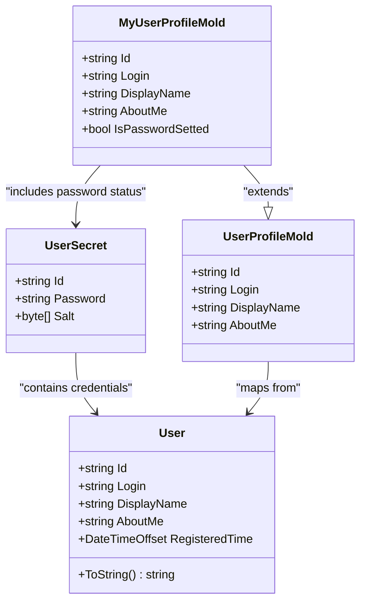
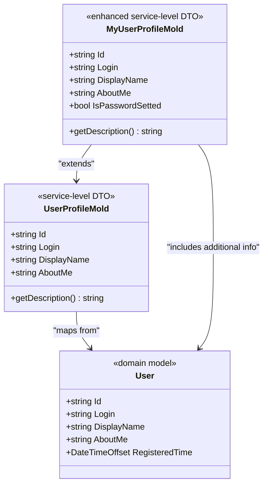
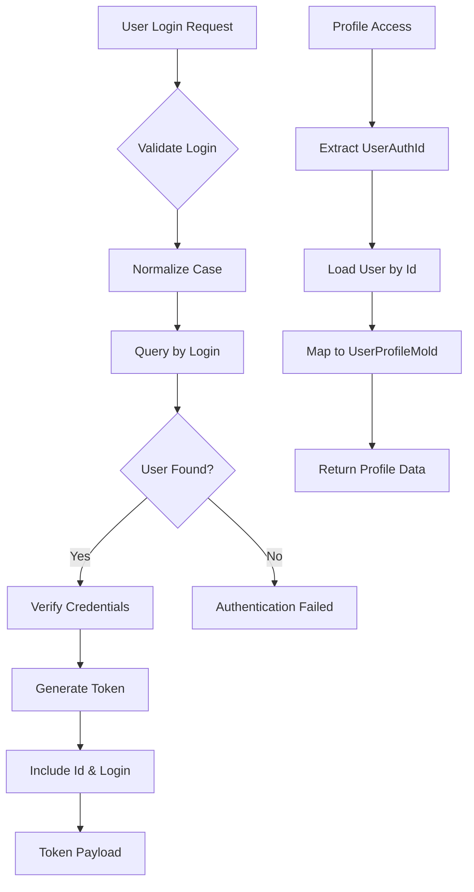
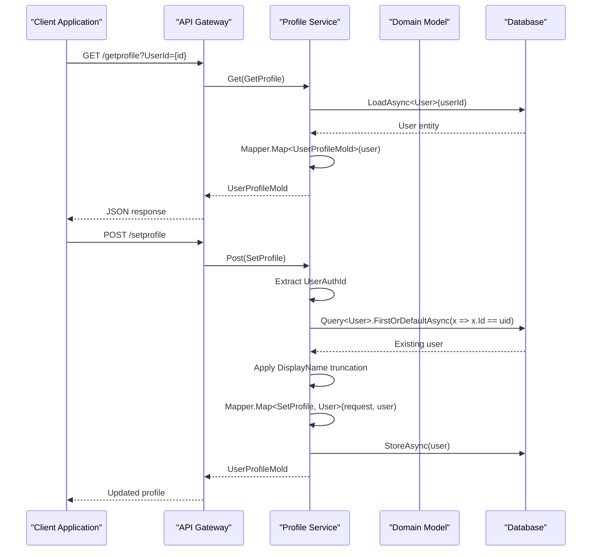

# User Properties Documentation

<cite>
**Referenced Files in This Document**
- [User.cs](file://src/Unlimotion.Domain/User.cs)
- [UserProfileMold.cs](file://src/Unlimotion.Server.ServiceModel/Molds/UserProfileMold.cs)
- [MyUserProfileMold.cs](file://src/Unlimotion.Server.ServiceModel/Molds/MyUserProfileMold.cs)
- [AuthService.cs](file://src/Unlimotion.Server.ServiceInterface/AuthService.cs)
- [ProfileService.cs](file://src/Unlimotion.Server.ServiceInterface/ProfileService.cs)
- [AppModelMapping.cs](file://src/Unlimotion.Server/AppModelMapping.cs)
- [Auth.cs](file://src/Unlimotion.Server.ServiceModel/Auth.cs)
- [Profile.cs](file://src/Unlimotion.Server.ServiceModel/Profile.cs)
</cite>

## Table of Contents
1. [Introduction](#introduction)
2. [User Entity Overview](#user-entity-overview)
3. [Core Properties Analysis](#core-properties-analysis)
4. [UserProfileMold Data Transfer](#userprofilemold-data-transfer)
5. [Property Usage Patterns](#property-usage-patterns)
6. [Authentication Context](#authentication-context)
7. [API Communication Flow](#api-communication-flow)
8. [Localization and Service-Level Design](#localization-and-service-level-design)
9. [Implementation Examples](#implementation-examples)
10. [Best Practices](#best-practices)

## Introduction

The User entity in Unlimotion represents the fundamental data model for user accounts within the system. This comprehensive documentation examines the five core properties that define user identity and profile information: Id, Login, DisplayName, AboutMe, and RegisteredTime. These properties serve distinct roles in user identification, authentication, profile management, and system operations while maintaining clear separation between domain models and service-level data transfer objects.

## User Entity Overview

The User class in the Unlimotion.Domain namespace serves as the foundational data structure for user account representation. It encapsulates essential user information required for system operations, authentication, and profile management.



**Diagram sources**
- [User.cs](file://src/Unlimotion.Domain/User.cs#L5-L17)
- [UserProfileMold.cs](file://src/Unlimotion.Server.ServiceModel/Molds/UserProfileMold.cs#L5-L18)
- [MyUserProfileMold.cs](file://src/Unlimotion.Server.ServiceModel/Molds/MyUserProfileMold.cs#L5-L10)

**Section sources**
- [User.cs](file://src/Unlimotion.Domain/User.cs#L1-L25)

## Core Properties Analysis

### Id Property

The Id property serves as the unique identifier for user accounts within the system. This property is automatically generated during user registration and follows a structured format that ensures uniqueness across the application.

**Key Characteristics:**
- **Type**: `string` - Provides flexibility for various identifier formats
- **Generation**: Automatically created using GUID-based structure (`UserPrefix + Guid.NewGuid()`)
- **Format**: `User/{guid}` where `{guid}` is a unique identifier
- **Purpose**: Primary key for database operations and user identification
- **Immutability**: Once assigned, the Id remains constant throughout the user's lifecycle

**Usage Contexts:**
- Database queries and lookups
- Authentication token payload inclusion
- Cross-system user identification
- Relationship establishment with other entities

### Login Property

The Login property functions as the primary authentication identifier and username for user accounts. This property serves dual purposes: user identification during authentication and as a displayable username.

**Key Characteristics:**
- **Type**: `string` - Supports various username formats
- **Normalization**: Converted to lowercase invariant during authentication
- **Uniqueness**: Enforced at the database level to prevent duplicate usernames
- **Validation**: Must be non-empty and unique across all users
- **Authentication Role**: Primary credential for user login operations

**Usage Contexts:**
- User authentication and login processes
- Token generation and validation
- User identification in system operations
- Display in authentication contexts

### DisplayName Property

The DisplayName property represents the user-visible name that appears in the application interface. This property provides flexibility in how users present themselves within the system.

**Key Characteristics:**
- **Type**: `string` - Allows for flexible naming conventions
- **Length Limitation**: Restricted to 32 characters during profile updates
- **Optional**: Can be null or empty if not specified
- **Presentation**: Used in user interface displays and notifications
- **Customization**: Allows users to choose their preferred display name

**Usage Contexts:**
- User interface presentations
- Notification systems
- Chat and messaging features
- Profile display operations

### AboutMe Property

The AboutMe property stores user biography or description information. This property enables users to provide personal information or context about themselves within the system.

**Key Characteristics:**
- **Type**: `string` - Supports rich text or descriptive content
- **Flexibility**: No strict limitations on content format
- **Optional**: Can be null or empty if not provided
- **Content**: May contain biographical information, interests, or personal descriptions
- **Privacy**: Subject to system privacy policies and user preferences

**Usage Contexts:**
- User profile pages
- Social features and user discovery
- Personal information display
- Community building features

### RegisteredTime Property

The RegisteredTime property tracks the timestamp when user accounts were created. This property provides temporal information essential for system operations and user lifecycle management.

**Key Characteristics:**
- **Type**: `DateTimeOffset` - Ensures timezone-aware timestamp storage
- **Precision**: UTC-based with timezone information preservation
- **Automatic Assignment**: Set during user creation process
- **Immutable**: Cannot be modified after account creation
- **System Operations**: Used for account age calculations and compliance

**Usage Contexts:**
- Account age verification
- Compliance and audit requirements
- User activity analysis
- Feature eligibility determination

**Section sources**
- [User.cs](file://src/Unlimotion.Domain/User.cs#L5-L17)
- [AuthService.cs](file://src/Unlimotion.Server.ServiceInterface/AuthService.cs#L180-L195)

## UserProfileMold Data Transfer

The UserProfileMold class serves as the service-level data transfer object responsible for communicating user profile information between system layers. This model is specifically designed for API communication and maintains descriptive attributes suitable for localization.



**Diagram sources**
- [UserProfileMold.cs](file://src/Unlimotion.Server.ServiceModel/Molds/UserProfileMold.cs#L5-L18)
- [MyUserProfileMold.cs](file://src/Unlimotion.Server.ServiceModel/Molds/MyUserProfileMold.cs#L5-L10)

### Mapping Strategy

The UserProfileMold employs a carefully designed mapping strategy that separates domain concerns from service-level requirements:

**Property Mapping Details:**
- **Id**: Direct mapping from User.Id - maintains unique identifier integrity
- **Login**: Direct mapping from User.Login - preserves authentication identifier
- **DisplayName**: Direct mapping from User.DisplayName - maintains user presentation
- **AboutMe**: Direct mapping from User.AboutMe - preserves user biography information

**Enhancement Features:**
- **Localization Support**: Descriptive attributes enable internationalization
- **Service-Specific Extensions**: MyUserProfileMold adds password status information
- **API-Friendly Design**: Optimized for RESTful API communication patterns

**Section sources**
- [UserProfileMold.cs](file://src/Unlimotion.Server.ServiceModel/Molds/UserProfileMold.cs#L1-L20)
- [MyUserProfileMold.cs](file://src/Unlimotion.Server.ServiceModel/Molds/MyUserProfileMold.cs#L1-L11)

## Property Usage Patterns

### User Identification Patterns

The User entity properties collaborate to establish comprehensive user identification across different system contexts:



**Diagram sources**
- [AuthService.cs](file://src/Unlimotion.Server.ServiceInterface/AuthService.cs#L40-L55)
- [ProfileService.cs](file://src/Unlimotion.Server.ServiceInterface/ProfileService.cs#L20-L25)

### Profile Management Patterns

User profile operations demonstrate the practical application of properties in real-world scenarios:

**Registration Process:**
- Id: Generated automatically using GUID structure
- Login: Normalized to lowercase invariant
- DisplayName: Truncated to 32 characters if necessary
- RegisteredTime: Set to current UTC timestamp
- AboutMe: Initialized as null or empty

**Profile Updates:**
- Validation of DisplayName length (32 character limit)
- Preservation of existing Id and RegisteredTime
- Optional updates to DisplayName and AboutMe

**Section sources**
- [AuthService.cs](file://src/Unlimotion.Server.ServiceInterface/AuthService.cs#L180-L200)
- [ProfileService.cs](file://src/Unlimotion.Server.ServiceInterface/ProfileService.cs#L30-L40)

## Authentication Context

The User properties play critical roles in authentication and security contexts throughout the system:

### Token Generation and Validation

During authentication, specific properties are utilized for token generation and validation:

**Token Payload Composition:**
- **UserAuthId**: Maps to User.Id for unique identification
- **DisplayName**: Maps to User.Login for authentication display
- **CreatedAt**: Current timestamp for token validity
- **Session**: Unique session identifier for session management

**Security Considerations:**
- Login normalization prevents case-sensitive authentication issues
- Id preservation ensures consistent user identification
- RegisteredTime provides account age verification
- Salted password storage protects credential security

### Session Management

User properties support comprehensive session management:

**Session Tracking:**
- Id: Primary identifier for session association
- Login: Username for session display and logging
- RegisteredTime: Account age verification for session policies

**Authentication Flow:**
1. Login validation with case normalization
2. User lookup by normalized login
3. Credential verification against stored secrets
4. Token generation with user properties inclusion
5. Session establishment with property persistence

**Section sources**
- [AuthService.cs](file://src/Unlimotion.Server.ServiceInterface/AuthService.cs#L120-L150)
- [AuthService.cs](file://src/Unlimotion.Server.ServiceInterface/AuthService.cs#L200-L220)

## API Communication Flow

The UserProfileMold facilitates structured API communication between client applications and server services:



**Diagram sources**
- [ProfileService.cs](file://src/Unlimotion.Server.ServiceInterface/ProfileService.cs#L20-L40)
- [Profile.cs](file://src/Unlimotion.Server.ServiceModel/Profile.cs#L12-L32)

### API Endpoint Specifications

**Get Profile Endpoint:**
- **Method**: GET
- **Endpoint**: `/getprofile`
- **Parameters**: UserId (required)
- **Response**: UserProfileMold containing user profile information
- **Authentication**: Required (Authenticated user)

**Set Profile Endpoint:**
- **Method**: POST
- **Endpoint**: `/setprofile`
- **Parameters**: DisplayName (required), AboutMe (required)
- **Response**: UserProfileMold with updated information
- **Authentication**: Required (Authenticated user)
- **Processing**: DisplayName truncated to 32 characters

**Section sources**
- [Profile.cs](file://src/Unlimotion.Server.ServiceModel/Profile.cs#L12-L32)
- [ProfileService.cs](file://src/Unlimotion.Server.ServiceInterface/ProfileService.cs#L20-L40)

## Localization and Service-Level Design

The UserProfileMold incorporates localization-friendly design principles that support internationalization and multi-language user experiences:

### Descriptive Attributes

The UserProfileMold utilizes `[Description]` attributes that facilitate localization:

**Property Descriptions:**
- **Id**: "Идентификатор пользователя" (User Identifier)
- **Login**: "Псевдоним пользователя" (User Alias)
- **DisplayName**: "Имя пользователя" (User Name)
- **AboutMe**: "О себе" (About Me)

**Localization Benefits:**
- **Metadata Support**: Descriptive attributes enable automatic translation
- **UI Adaptation**: Service-level descriptions support dynamic UI generation
- **International Expansion**: Structured metadata facilitates global deployment
- **Developer Experience**: Clear property descriptions improve code maintainability

### Service-Level Abstraction

The UserProfileMold provides essential abstraction for service-layer operations:

**Abstraction Benefits:**
- **Decoupling**: Separates domain models from API contracts
- **Versioning**: Enables independent evolution of service interfaces
- **Security**: Controls exposure of sensitive domain information
- **Performance**: Optimizes data transfer for network efficiency

**Section sources**
- [UserProfileMold.cs](file://src/Unlimotion.Server.ServiceModel/Molds/UserProfileMold.cs#L5-L18)

## Implementation Examples

### User Registration Example

During user registration, the system demonstrates comprehensive property utilization:

```mermaid
flowchart TD
A[Registration Request] --> B[Validate Login Uniqueness]
B --> C[Normalize Login Case]
C --> D[Generate User Id]
D --> E[Create User Entity]
E --> F[Set RegisteredTime]
F --> G[Store User]
G --> H[Create UserSecret]
H --> I[Generate JWT Token]
I --> J[Return TokenResult]
E --> K[Id: User/{guid}]
E --> L[Login: normalized lowercase]
E --> M[DisplayName: trimmed to 32 chars]
E --> N[AboutMe: null]
E --> O[RegisteredTime: UTC now]
```

**Diagram sources**
- [AuthService.cs](file://src/Unlimotion.Server.ServiceInterface/AuthService.cs#L180-L200)

### Profile Update Example

Profile update operations showcase property validation and mapping:

**Processing Steps:**
1. **Authentication Verification**: Confirm user authorization
2. **User Lookup**: Retrieve existing user by Id
3. **Validation**: Apply DisplayName length restrictions
4. **Mapping**: Transform SetProfile to User entity
5. **Persistence**: Store updated user information
6. **Response**: Return mapped UserProfileMold

**Data Transformation:**
- **SetProfile.DisplayName**: Truncated to 32 characters
- **User.Id**: Preserved unchanged
- **User.RegisteredTime**: Immutable, preserved
- **User.Login**: Preserved unchanged
- **User.AboutMe**: Updated with new value

**Section sources**
- [AuthService.cs](file://src/Unlimotion.Server.ServiceInterface/AuthService.cs#L180-L200)
- [ProfileService.cs](file://src/Unlimotion.Server.ServiceInterface/ProfileService.cs#L30-L40)

## Best Practices

### Property Management Guidelines

**Id Management:**
- Always use GUID-based generation for uniqueness
- Maintain immutability after assignment
- Ensure proper indexing for database performance

**Login Management:**
- Implement case-insensitive uniqueness validation
- Normalize login values consistently
- Prevent special characters that could cause issues

**DisplayName Management:**
- Apply reasonable length limits (32 characters demonstrated)
- Consider cultural naming conventions
- Preserve user preference for display names

**AboutMe Management:**
- Allow rich text content when appropriate
- Implement content filtering for security
- Respect user privacy preferences

**RegisteredTime Management:**
- Use UTC timestamps for consistency
- Preserve timezone information when needed
- Implement proper validation for future dates

### Security Considerations

**Authentication Security:**
- Never expose raw passwords in logs or responses
- Implement proper salt and hash mechanisms
- Use secure token generation and validation
- Protect against timing attacks in authentication

**Data Protection:**
- Encrypt sensitive user information
- Implement proper access controls
- Audit user access and modifications
- Regular security assessments

### Performance Optimization

**Database Operations:**
- Index User.Id for fast lookups
- Use appropriate query patterns for authentication
- Implement caching for frequently accessed profiles
- Optimize bulk operations for user data

**API Efficiency:**
- Implement proper pagination for user lists
- Use selective field projection in queries
- Cache frequently accessed user information
- Implement rate limiting for authentication endpoints

**Section sources**
- [AuthService.cs](file://src/Unlimotion.Server.ServiceInterface/AuthService.cs#L40-L55)
- [ProfileService.cs](file://src/Unlimotion.Server.ServiceInterface/ProfileService.cs#L20-L40)