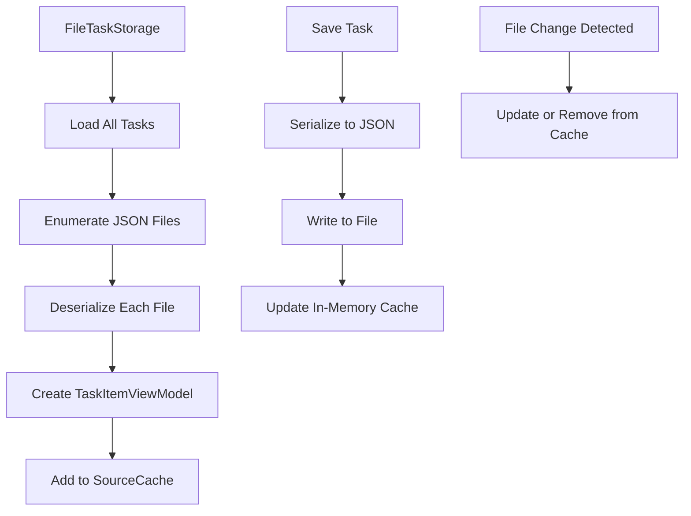
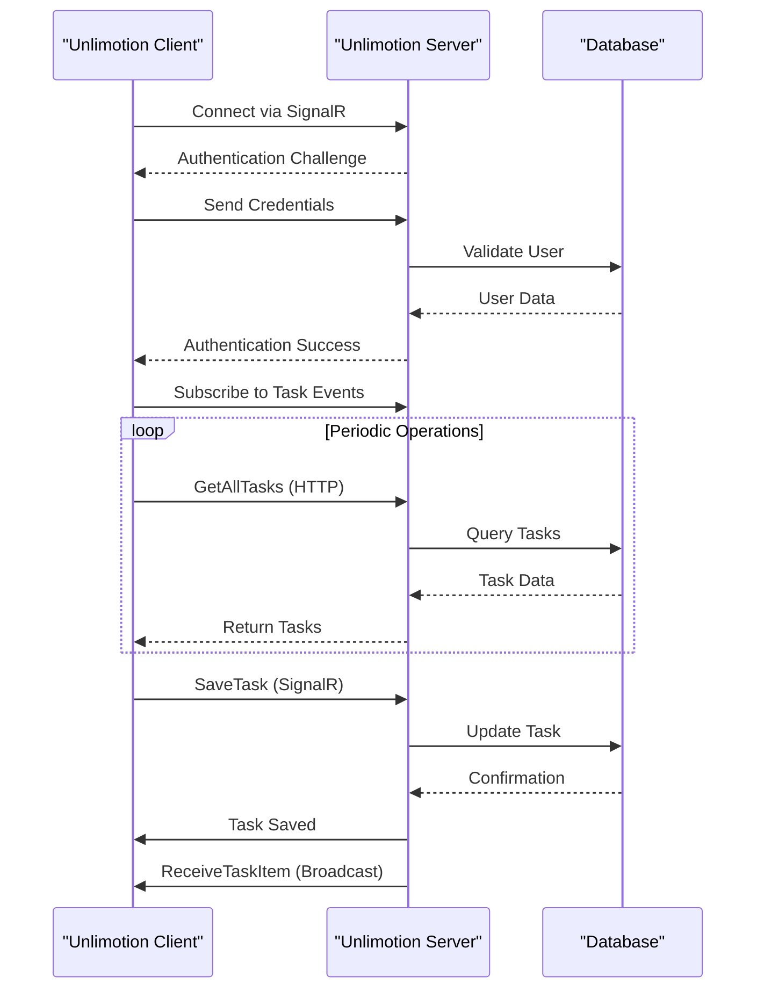
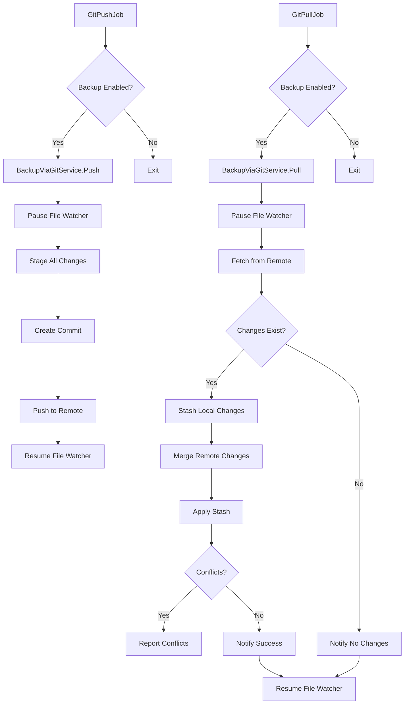
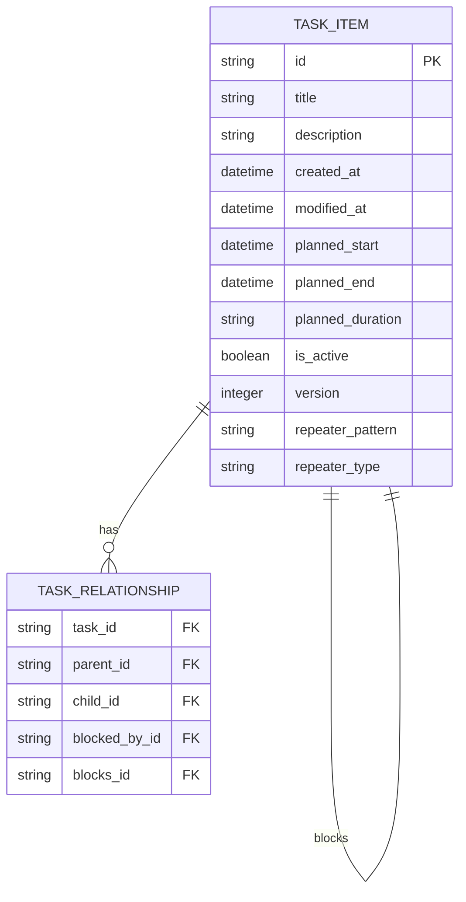
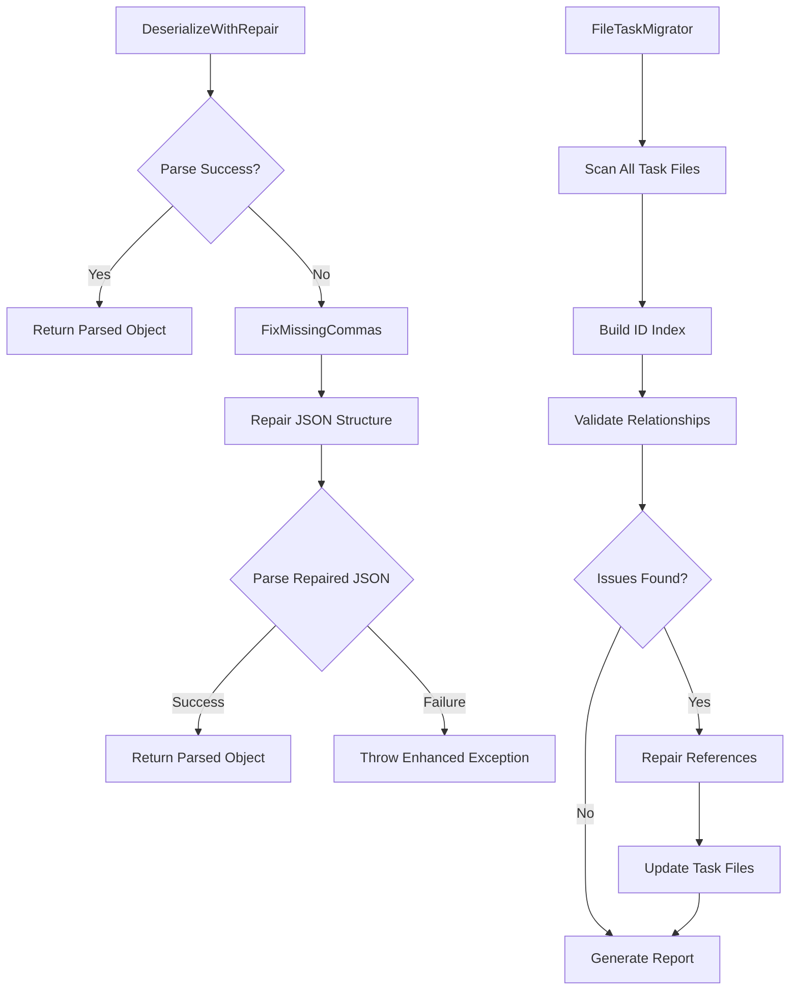
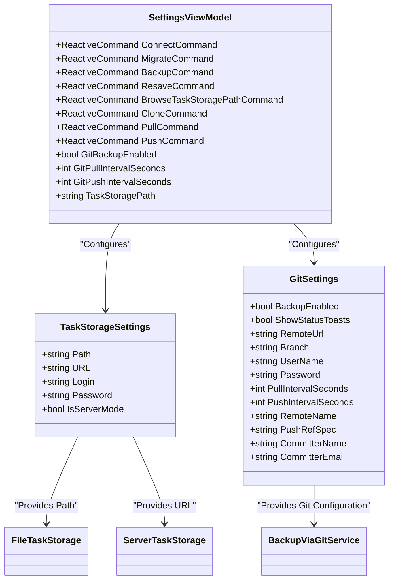
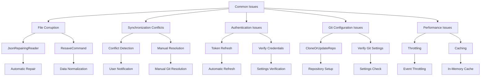

# Data Storage

<cite>
**Referenced Files in This Document**   
- [FileTaskStorage.cs](file://src/Unlimotion/FileTaskStorage.cs)
- [ServerTaskStorage.cs](file://src/Unlimotion/ServerTaskStorage.cs)
- [GitPullJob.cs](file://src/Unlimotion/Scheduling/Jobs/GitPullJob.cs)
- [GitPushJob.cs](file://src/Unlimotion/Scheduling/Jobs/GitPushJob.cs)
- [BackupViaGitService.cs](file://src/Unlimotion/Services/BackupViaGitService.cs)
- [JsonCommaFixer.cs](file://src/Unlimotion/JsonCommaFixer.cs)
- [FileTaskMigrator.cs](file://src/Unlimotion/FileTaskMigrator.cs)
- [TaskStorages.cs](file://src/Unlimotion/TaskStorages.cs)
- [TaskStorageSettings.cs](file://src/Unlimotion.ViewModel/TaskStorageSettings.cs)
- [FileDbWatcher.cs](file://src/Unlimotion.ViewModel/FileDbWatcher.cs)
</cite>

## Table of Contents
1. [Local File Storage](#local-file-storage)
2. [Server Synchronization](#server-synchronization)
3. [Git-Based Backup System](#git-based-backup-system)
4. [Data Persistence Format](#data-persistence-format)
5. [Recovery Mechanisms](#recovery-mechanisms)
6. [Configuration Options](#configuration-options)
7. [Common Issues and Troubleshooting](#common-issues-and-troubleshooting)

## Local File Storage

The local file storage mechanism in Unlimotion is implemented through the `FileTaskStorage` class, which provides a persistent JSON-based storage solution for task data. This implementation stores each task as a separate JSON file in a designated directory, enabling efficient file-level operations and easy manual inspection of data.

The `FileTaskStorage` class implements the `ITaskStorage` interface and manages a `SourceCache<TaskItemViewModel, string>` to maintain an in-memory representation of all tasks, indexed by their unique identifiers. During initialization, the system scans the storage directory and loads all JSON files, creating corresponding `TaskItemViewModel` instances. The storage path is configurable and defaults to a user-specified location.

File operations are designed to be atomic and thread-safe, with the `Save` method creating or updating individual task files with formatted JSON content. The serialization process uses `Newtonsoft.Json` with ISO 8601 date formatting to ensure consistent timestamp representation. When saving a task, if no ID is present, a new GUID is generated automatically.

The system integrates with `FileDbWatcher` to monitor the storage directory for external changes, allowing the application to respond to file modifications that occur outside the normal application flow (such as those from Git operations). This ensures data consistency across different modification vectors.

**Diagram sources**
- [FileTaskStorage.cs](file://src/Unlimotion/FileTaskStorage.cs#L1-L419)
- [FileDbWatcher.cs](file://src/Unlimotion.ViewModel/FileDbWatcher.cs#L1-L153)

**Section sources**
- [FileTaskStorage.cs](file://src/Unlimotion/FileTaskStorage.cs#L1-L419)
- [FileDbWatcher.cs](file://src/Unlimotion.ViewModel/FileDbWatcher.cs#L1-L153)

## Server Synchronization

Server synchronization is handled by the `ServerTaskStorage` class, which implements remote data operations through HTTP and SignalR protocols. This storage mechanism connects to a backend server (Unlimotion.Server) to persist task data in a centralized database, enabling multi-device synchronization and collaborative features.

The `ServerTaskStorage` establishes a connection to the server using a URL specified in the configuration. It uses `JsonServiceClient` from ServiceStack for REST API operations and SignalR for real-time updates. The authentication system employs JWT tokens with refresh capabilities, storing credentials in `ClientSettings` which are automatically applied to service requests.

Connection management is robust, with automatic reconnection logic that attempts to restore connectivity when lost. The `Connect` method is protected by a `SemaphoreSlim` to prevent race conditions during connection establishment. When the connection is lost, the system implements exponential backoff with random jitter to prevent thundering herd problems.

The class subscribes to several SignalR events to receive real-time updates from the server:
- `LogOn`: Handles authentication status and token refresh
- `ReceiveTaskItem`: Processes incoming task updates from other clients
- `DeleteTaskItem`: Handles task deletions from other clients

These subscriptions enable a collaborative editing experience where changes made by one user are immediately propagated to all connected clients. The `TaskTreeManager` is used to maintain hierarchical relationships between tasks, ensuring that parent-child and blocking relationships are properly synchronized.

**Diagram sources**
- [ServerTaskStorage.cs](file://src/Unlimotion/ServerTaskStorage.cs#L1-L716)

**Section sources**
- [ServerTaskStorage.cs](file://src/Unlimotion/ServerTaskStorage.cs#L1-L716)

## Git-Based Backup System

The Git-based backup system provides automated version control for local task storage, enabling point-in-time recovery and offline backup capabilities. This system is implemented through Quartz.NET scheduled jobs (`GitPullJob` and `GitPushJob`) that execute at configurable intervals, and the `BackupViaGitService` class that performs the actual Git operations.

The scheduling system is configured through `TaskStorages.SetSettingsCommands()`, which sets up reactive commands and subscriptions to manage the backup scheduler. When Git backup is enabled, the scheduler is resumed; when disabled, it is paused. The pull and push intervals are dynamically configurable, with default values of 30 seconds for pull operations and 60 seconds for push operations.

The `BackupViaGitService` implements the core Git functionality using LibGit2Sharp. The `Push` method commits all changes to the local repository with a timestamped message, while the `Pull` method synchronizes changes from the remote repository. Both operations include comprehensive error handling and user notifications through the `INotificationManagerWrapper`.

The pull operation includes sophisticated conflict resolution logic:
1. Changes are fetched from the remote repository
2. If the local and remote branches differ, a stash is created of local changes
3. The remote branch is merged into the local branch
4. The stash is applied back to preserve local changes
5. Conflicts are detected and reported to the user

During Git operations, the system temporarily pauses the `FileDbWatcher` and `FileTaskStorage` to prevent race conditions between file system monitoring and Git operations. This ensures data consistency during synchronization.

**Diagram sources**
- [GitPullJob.cs](file://src/Unlimotion/Scheduling/Jobs/GitPullJob.cs#L1-L20)
- [GitPushJob.cs](file://src/Unlimotion/Scheduling/Jobs/GitPushJob.cs#L1-L21)
- [BackupViaGitService.cs](file://src/Unlimotion/Services/BackupViaGitService.cs#L1-L357)

**Section sources**
- [GitPullJob.cs](file://src/Unlimotion/Scheduling/Jobs/GitPullJob.cs#L1-L20)
- [GitPushJob.cs](file://src/Unlimotion/Scheduling/Jobs/GitPushJob.cs#L1-L21)
- [BackupViaGitService.cs](file://src/Unlimotion/Services/BackupViaGitService.cs#L1-L357)

## Data Persistence Format

The data persistence format in Unlimotion is based on JSON serialization of the `TaskItem` domain model. Each task is stored as a separate JSON file in the local storage directory, with the filename corresponding to the task's unique identifier (GUID). This file-per-task approach enables efficient partial loading and reduces the risk of complete data loss due to file corruption.

The JSON structure includes all task properties with proper type serialization:
- Basic properties: ID, title, description, creation and modification timestamps
- Temporal properties: planned duration, start and end times with timezone information
- Hierarchical relationships: parent tasks, contained tasks, and blocked tasks as string collections
- Repeating patterns: recurrence rules with pattern type and parameters
- Metadata: version number, active status, and custom fields

The serialization process uses `Newtonsoft.Json` with custom `IsoDateTimeConverter` to ensure consistent date formatting in ISO 8601 format (yyyy-MM-dd'T'HH:mm:ss.fffzzz). This format preserves timezone information and enables proper sorting and comparison of timestamps.

For server communication, the system uses ServiceStack's JSON serialization with model transformation through AutoMapper. The `TaskItem` domain model is mapped to `TaskItemHubMold` and `TaskItemMold` DTOs for transmission over SignalR and HTTP respectively. This separation allows for API evolution independent of the internal data model.

The file-per-task approach has several advantages:
- Atomic operations on individual tasks
- Efficient partial loading of data
- Easy manual inspection and editing
- Natural compatibility with version control systems like Git
- Reduced impact of file corruption (affects only one task)

**Diagram sources**
- [FileTaskStorage.cs](file://src/Unlimotion/FileTaskStorage.cs#L1-L419)
- [ServerTaskStorage.cs](file://src/Unlimotion/ServerTaskStorage.cs#L1-L716)

**Section sources**
- [FileTaskStorage.cs](file://src/Unlimotion/FileTaskStorage.cs#L1-L419)
- [ServerTaskStorage.cs](file://src/Unlimotion/ServerTaskStorage.cs#L1-L716)

## Recovery Mechanisms

Unlimotion implements several recovery mechanisms to handle data corruption and ensure data integrity. The primary recovery component is `JsonRepairingReader`, which provides fault-tolerant JSON deserialization with automatic repair capabilities.

The `JsonRepairingReader.DeserializeWithRepair<T>` method implements a two-phase deserialization process:
1. First, it attempts standard JSON parsing using `JsonTextReader`
2. If parsing fails with `JsonReaderException`, it activates the repair mechanism

The repair mechanism, implemented in `JsonCommaFixer.FixMissingCommas`, analyzes the JSON text and automatically inserts missing commas between array elements and object properties. The algorithm uses a state machine to track the parsing context (object or array) and determines where commas should be inserted based on the structure of the JSON.

The repair algorithm handles several common JSON syntax errors:
- Missing commas between array elements
- Missing commas between object properties
- Improperly terminated strings
- Malformed literals (true, false, null)

The repair process is context-aware, distinguishing between commas that are part of string values and those that are structural separators. It also handles escaped characters within strings to avoid false positives.

For more comprehensive data recovery, the system includes `FileTaskMigrator`, which performs data integrity checks and repairs on the entire task collection. This migrator:
1. Indexes all task files and their relationships
2. Identifies dangling references (child tasks that don't exist)
3. Detects self-references (tasks that reference themselves as parents or children)
4. Normalizes relationship lists by removing duplicates and invalid references
5. Generates a migration report with statistics and issues

The migration process is versioned, with a `migration.report` file stored in the task directory to prevent redundant processing. This ensures that migration operations are idempotent and can be safely repeated.

**Diagram sources**
- [JsonCommaFixer.cs](file://src/Unlimotion/JsonCommaFixer.cs#L1-L245)
- [FileTaskMigrator.cs](file://src/Unlimotion/FileTaskMigrator.cs#L1-L195)

**Section sources**
- [JsonCommaFixer.cs](file://src/Unlimotion/JsonCommaFixer.cs#L1-L245)
- [FileTaskMigrator.cs](file://src/Unlimotion/FileTaskMigrator.cs#L1-L195)

## Configuration Options

The data storage system in Unlimotion is highly configurable through the `TaskStorageSettings` and `GitSettings` classes. These settings are managed through the application's configuration system and can be modified through the user interface.

The `TaskStorageSettings` class defines the following configuration options:
- `Path`: The file system path for local task storage (can be absolute or relative)
- `URL`: The server URL for remote storage when using server mode
- `Login` and `Password`: Credentials for server authentication
- `IsServerMode`: Boolean flag to switch between local file storage and server storage

The `GitSettings` class provides comprehensive configuration for the Git-based backup system:
- `BackupEnabled`: Enables or disables automatic Git backup
- `ShowStatusToasts`: Controls whether success notifications are displayed
- `RemoteUrl`: The URL of the remote Git repository
- `Branch`: The branch name to work with (default: master)
- `UserName` and `Password`: Credentials for Git operations (typically email and personal access token)
- `PullIntervalSeconds` and `PushIntervalSeconds`: Frequency of pull and push operations
- `RemoteName`: The name of the remote (default: origin)
- `PushRefSpec`: The reference specification for push operations
- `CommitterName` and `CommitterEmail`: Identity used for Git commits

These settings are integrated with the application's reactive architecture through `SettingsViewModel`, which exposes observable properties and commands. Changes to settings are automatically reflected in the storage system:
- Switching `IsServerMode` triggers re-registration of the appropriate storage implementation
- Changing Git intervals reschedules the corresponding Quartz jobs
- Enabling/disabling backup pauses or resumes the scheduler

The system also provides UI commands for manual Git operations:
- `CloneCommand`: Clones or updates the Git repository
- `PullCommand`: Manually pulls changes from the remote
- `PushCommand`: Manually pushes changes to the remote
- `BrowseTaskStoragePathCommand`: Allows the user to select a custom storage path

**Diagram sources**
- [TaskStorageSettings.cs](file://src/Unlimotion.ViewModel/TaskStorageSettings.cs#L1-L35)
- [TaskStorages.cs](file://src/Unlimotion/TaskStorages.cs#L1-L224)

**Section sources**
- [TaskStorageSettings.cs](file://src/Unlimotion.ViewModel/TaskStorageSettings.cs#L1-L35)
- [TaskStorages.cs](file://src/Unlimotion/TaskStorages.cs#L1-L224)

## Common Issues and Troubleshooting

Several common issues can arise with Unlimotion's data storage system, primarily related to file corruption, synchronization conflicts, and configuration problems. The system includes several mechanisms to detect, prevent, and resolve these issues.

**File Corruption**: The most common cause of file corruption is improper application shutdown or disk errors. The `JsonRepairingReader` mitigates this by automatically repairing missing commas and other common JSON syntax errors. For more severe corruption, the system logs detailed error messages including the first 200 characters of the corrupted file to aid diagnosis. Users can also run the `ResaveCommand` to re-serialize all tasks, which can fix subtle corruption issues.

**Synchronization Conflicts**: When using Git-based backup, merge conflicts can occur when the same task is modified on different systems. The system detects conflicts through `repo.Index.Conflicts.Any()` and displays an error message instructing the user to resolve conflicts manually. To minimize conflicts, the system uses fine-grained file-per-task storage rather than a monolithic database file.

**Authentication Issues**: When connecting to the server, authentication can fail due to invalid credentials or expired tokens. The system automatically attempts token refresh when a 419 (authentication expired) error is received. Users can resolve persistent authentication issues by verifying their login credentials in the settings.

**Git Configuration Issues**: Common Git problems include incorrect repository URLs, invalid credentials, or network connectivity issues. The `BackupViaGitService` provides detailed error messages for these cases, and the `CloneOrUpdateRepo` method handles both initial cloning and subsequent updates. Users should verify that their Git credentials are correct, particularly ensuring that a personal access token is used rather than a password for GitHub repositories.

**Performance Issues**: With large task collections, performance can degrade due to the file-per-task approach. The system mitigates this through caching in `FileTaskStorage.Tasks` and throttling of file system events in `FileDbWatcher`. For extremely large collections, switching to server mode may provide better performance.

**Migration Issues**: When upgrading from older versions, the `FileTaskMigrator` handles data schema changes and relationship normalization. The migration report provides detailed information about any issues encountered, such as dangling references or self-links. Users should review this report after upgrading to ensure data integrity.

The system provides several troubleshooting commands in the settings interface:
- `ResaveCommand`: Re-saves all tasks, which can fix subtle corruption
- `MigrateCommand`: Forces re-execution of the migration process
- `BackupCommand`: Exports all tasks to file storage as a backup
- Manual Git operations (clone, pull, push) for resolving synchronization issues

**Diagram sources**
- [JsonCommaFixer.cs](file://src/Unlimotion/JsonCommaFixer.cs#L1-L245)
- [BackupViaGitService.cs](file://src/Unlimotion/Services/BackupViaGitService.cs#L1-L357)
- [FileTaskMigrator.cs](file://src/Unlimotion/FileTaskMigrator.cs#L1-L195)
- [TaskStorages.cs](file://src/Unlimotion/TaskStorages.cs#L1-L224)

**Section sources**
- [JsonCommaFixer.cs](file://src/Unlimotion/JsonCommaFixer.cs#L1-L245)
- [BackupViaGitService.cs](file://src/Unlimotion/Services/BackupViaGitService.cs#L1-L357)
- [FileTaskMigrator.cs](file://src/Unlimotion/FileTaskMigrator.cs#L1-L195)
- [TaskStorages.cs](file://src/Unlimotion/TaskStorages.cs#L1-L224)