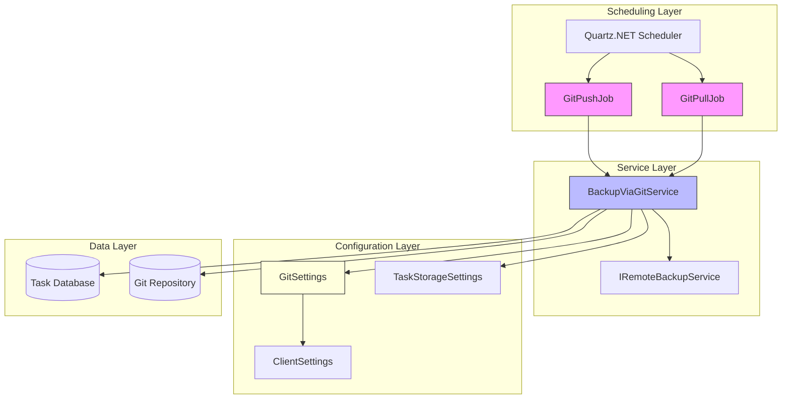
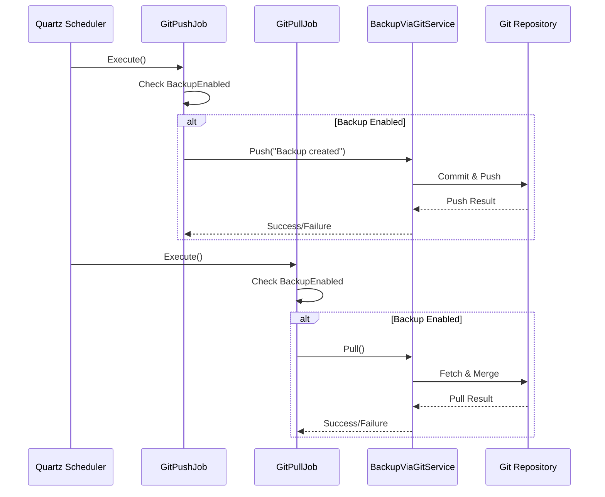
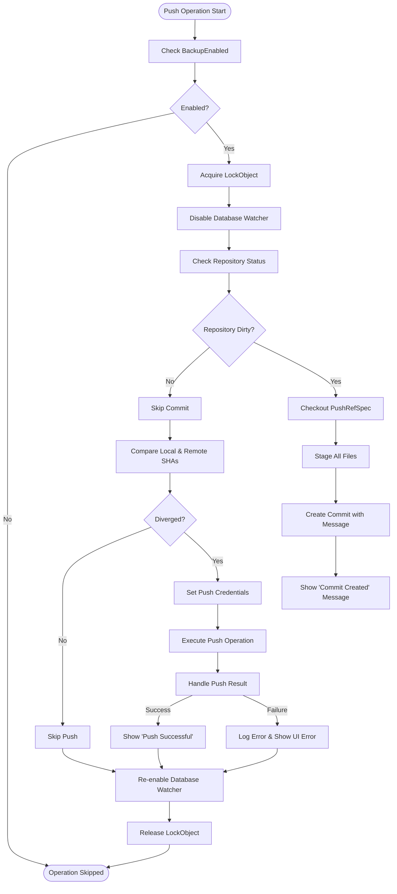
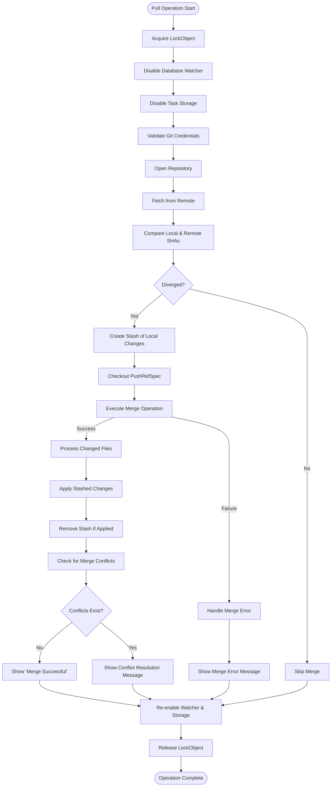

# Git Backup

<cite>
**Referenced Files in This Document**   
- [GitPullJob.cs](file://src/Unlimotion/Scheduling/Jobs/GitPullJob.cs)
- [GitPushJob.cs](file://src/Unlimotion/Scheduling/Jobs/GitPushJob.cs)
- [BackupViaGitService.cs](file://src/Unlimotion/Services/BackupViaGitService.cs)
- [GitSettings.cs](file://src/Unlimotion/ViewModel/GitSettings.cs)
- [IRemoteBackupService.cs](file://src/Unlimotion/ViewModel/IRemoteBackupService.cs)
- [TaskStorageSettings.cs](file://src/Unlimotion/ViewModel/TaskStorageSettings.cs)
- [GitService.cs](file://src/Unlimotion.TelegramBot/GitService.cs)
- [Program.cs](file://src/Unlimotion/Desktop/Program.cs)
</cite>

## Table of Contents
1. [Introduction](#introduction)
2. [Core Components](#core-components)
3. [Architecture Overview](#architecture-overview)
4. [Detailed Component Analysis](#detailed-component-analysis)
5. [Configuration and Settings](#configuration-and-settings)
6. [Workflow and Execution Flow](#workflow-and-execution-flow)
7. [Error Handling and Conflict Resolution](#error-handling-and-conflict-resolution)
8. [Security Considerations](#security-considerations)
9. [Performance Implications](#performance-implications)
10. [Troubleshooting Guide](#troubleshooting-guide)
11. [Best Practices for Repository Management](#best-practices-for-repository-management)

## Introduction
The Git-based backup functionality in Unlimotion provides automated synchronization of task data with a remote Git repository using scheduled jobs. This system leverages Quartz.NET for job scheduling and LibGit2Sharp for Git operations, enabling reliable offsite backups of user task data. The implementation supports both push and pull operations, handles merge conflicts, and integrates with the application's notification system to report status. This document details the architecture, configuration, and operational aspects of this backup system.

## Core Components

The Git backup system consists of several key components that work together to provide reliable data synchronization. These include scheduled jobs for automated execution, a service layer for Git operations, configuration models, and interfaces that define the contract between components.

**Section sources**
- [GitPullJob.cs](file://src/Unlimotion/Scheduling/Jobs/GitPullJob.cs)
- [GitPushJob.cs](file://src/Unlimotion/Scheduling/Jobs/GitPushJob.cs)
- [BackupViaGitService.cs](file://src/Unlimotion/Services/BackupViaGitService.cs)
- [GitSettings.cs](file://src/Unlimotion/ViewModel/GitSettings.cs)

## Architecture Overview

The Git backup system follows a layered architecture with clear separation of concerns between scheduling, service logic, and configuration management.



**Diagram sources**
- [GitPullJob.cs](file://src/Unlimotion/Scheduling/Jobs/GitPullJob.cs)
- [GitPushJob.cs](file://src/Unlimotion/Scheduling/Jobs/GitPushJob.cs)
- [BackupViaGitService.cs](file://src/Unlimotion/Services/BackupViaGitService.cs)
- [GitSettings.cs](file://src/Unlimotion/ViewModel/GitSettings.cs)

## Detailed Component Analysis

### Git Job Scheduling Components

The GitPullJob and GitPushJob classes implement the IJob interface from Quartz.NET, enabling them to be executed as scheduled tasks. These jobs check if Git backup is enabled in the configuration before executing their respective operations.



**Diagram sources**
- [GitPullJob.cs](file://src/Unlimotion/Scheduling/Jobs/GitPullJob.cs#L1-L20)
- [GitPushJob.cs](file://src/Unlimotion/Scheduling/Jobs/GitPushJob.cs#L1-L21)

**Section sources**
- [GitPullJob.cs](file://src/Unlimotion/Scheduling/Jobs/GitPullJob.cs)
- [GitPushJob.cs](file://src/Unlimotion/Scheduling/Jobs/GitPushJob.cs)

### BackupViaGitService Implementation

The BackupViaGitService class provides the core functionality for Git operations, implementing the IRemoteBackupService interface. It handles cloning, pulling, pushing, and repository state management.

```mermaid
classDiagram
class IRemoteBackupService {
<<interface>>
+List<string> Remotes()
+List<string> Refs()
+void Push(string msg)
+void Pull()
+void CloneOrUpdateRepo()
}
class BackupViaGitService {
-static object LockObject
+List<string> Remotes()
+List<string> Refs()
+void Push(string msg)
+void Pull()
+void CloneOrUpdateRepo()
-CredentialsHandler GetCredentials(GitSettings)
-string GetRepositoryPath(string)
-void CheckGitSettings(string, string)
-void ShowUiError(string)
-void ShowUiMessage(string)
}
class GitSettings {
+bool BackupEnabled
+bool ShowStatusToasts
+string RemoteUrl
+string Branch
+string UserName
+string Password
+int PullIntervalSeconds
+int PushIntervalSeconds
+string RemoteName
+string PushRefSpec
+string CommitterName
+string CommitterEmail
}
IRemoteBackupService <|.. BackupViaGitService
BackupViaGitService --> GitSettings
BackupViaGitService --> "LibGit2Sharp.Repository"
BackupViaGitService --> "IDatabaseWatcher"
BackupViaGitService --> "INotificationManagerWrapper"
```

**Diagram sources**
- [BackupViaGitService.cs](file://src/Unlimotion/Services/BackupViaGitService.cs#L1-L357)
- [IRemoteBackupService.cs](file://src/Unlimotion/ViewModel/IRemoteBackupService.cs#L4-L11)
- [GitSettings.cs](file://src/Unlimotion/ViewModel/GitSettings.cs#L4-L34)

**Section sources**
- [BackupViaGitService.cs](file://src/Unlimotion/Services/BackupViaGitService.cs)
- [IRemoteBackupService.cs](file://src/Unlimotion/ViewModel/IRemoteBackupService.cs)

## Configuration and Settings

The Git backup functionality is configured through the GitSettings class, which contains various properties for controlling the behavior of the backup system.

### Git Settings Configuration

| Property | Default Value | Description |
|--------|---------------|-------------|
| BackupEnabled | false | Enables or disables Git backup functionality |
| ShowStatusToasts | true | Controls whether UI notifications are shown for backup operations |
| RemoteUrl | null | URL of the remote Git repository |
| Branch | "master" | Branch name to work with |
| UserName | "YourEmail" | Username for authentication |
| Password | "YourToken" | Password or personal access token for authentication |
| PullIntervalSeconds | 30 | Interval between pull operations in seconds |
| PushIntervalSeconds | 60 | Interval between push operations in seconds |
| RemoteName | "origin" | Name of the remote repository |
| PushRefSpec | "refs/heads/master" | Reference specification for push operations |
| CommitterName | "Backuper" | Name used in Git commits |
| CommitterEmail | "Backuper@unlimotion.ru" | Email used in Git commits |

**Section sources**
- [GitSettings.cs](file://src/Unlimotion/ViewModel/GitSettings.cs#L4-L34)
- [TaskStorageSettings.cs](file://src/Unlimotion/ViewModel/TaskStorageSettings.cs#L16-L34)

## Workflow and Execution Flow

### Push Operation Workflow

The push operation follows a specific sequence to ensure data consistency and prevent conflicts during backup.



**Diagram sources**
- [BackupViaGitService.cs](file://src/Unlimotion/Services/BackupViaGitService.cs#L100-L180)

### Pull Operation Workflow

The pull operation includes additional steps to handle potential merge conflicts and ensure data integrity.



**Diagram sources**
- [BackupViaGitService.cs](file://src/Unlimotion/Services/BackupViaGitService.cs#L182-L320)

## Error Handling and Conflict Resolution

The Git backup system implements comprehensive error handling to manage various failure scenarios that may occur during Git operations.

### Error Recovery Mechanisms

When a push operation fails, the system logs the error and displays a UI notification, but retains the local commit. This allows the user to resolve the issue (such as network connectivity problems or authentication issues) and retry the push operation later. The local repository maintains the commit, ensuring that no data is lost.

For pull operations, the system uses a stashing mechanism to preserve local changes before attempting a merge. If the merge fails due to conflicts, the stashed changes are reapplied, and the user is notified to resolve the conflicts manually. This approach prevents data loss from incomplete merges.

Merge conflicts are detected by checking the repository index for conflicts after a merge attempt. When conflicts are detected, the system displays an error message instructing the user to resolve the conflicts and commit the result manually.

**Section sources**
- [BackupViaGitService.cs](file://src/Unlimotion/Services/BackupViaGitService.cs#L100-L357)

## Security Considerations

The Git backup system handles sensitive information such as repository credentials, requiring careful consideration of security practices.

Credentials are stored in the GitSettings configuration object in plain text, which presents a security risk. The system uses basic authentication with username and password (or personal access token), which should be protected accordingly. Users are advised to use personal access tokens rather than passwords for enhanced security.

The implementation includes a check for empty credentials, which logs a warning but does not prevent the operation from proceeding. This could potentially lead to failed operations if credentials are not properly configured.

File system permissions should be configured to restrict access to the configuration files containing credentials. Additionally, the use of SSH keys instead of username/password authentication would provide a more secure alternative, though this is not currently implemented in the system.

**Section sources**
- [BackupViaGitService.cs](file://src/Unlimotion/Services/BackupViaGitService.cs#L280-L285)
- [GitSettings.cs](file://src/Unlimotion/ViewModel/GitSettings.cs#L4-L34)

## Performance Implications

The Git backup system has several performance considerations that affect both the application and the user experience.

### Performance Impact Analysis

| Factor | Impact | Mitigation Strategy |
|-------|--------|-------------------|
| Frequent Commits | High disk I/O and CPU usage during commit operations | Configure appropriate push intervals based on usage patterns |
| Large Repositories | Increased memory usage and longer operation times | Regular repository maintenance and optimization |
| Network Latency | Delayed backup operations and potential timeouts | Implement exponential backoff for retry logic |
| File Watching Overhead | Performance impact when disabling/enabling watchers | Minimize the duration of watcher disablement |
| Lock Contention | Potential blocking of other operations | Keep critical sections as short as possible |

The system uses a global lock (LockObject) to prevent concurrent Git operations, which ensures data consistency but may impact performance under high load. The database watcher is temporarily disabled during Git operations to prevent conflicts between file system changes from Git and application modifications.

The default configuration pushes every 60 seconds and pulls every 30 seconds, which provides frequent backups but may be excessive for some use cases. Users can adjust these intervals based on their specific requirements and performance constraints.

**Section sources**
- [BackupViaGitService.cs](file://src/Unlimotion/Services/BackupViaGitService.cs#L100-L357)
- [GitSettings.cs](file://src/Unlimotion/ViewModel/GitSettings.cs#L4-L34)

## Troubleshooting Guide

This section provides guidance for diagnosing and resolving common issues with the Git backup functionality.

### Common Issues and Solutions

**Authentication Failures**
- **Symptoms**: "Can't push the remote repository" or "Can't merge remote branch" errors
- **Causes**: Incorrect username/password, expired personal access token, or network restrictions
- **Solutions**: Verify credentials in settings, regenerate personal access token, check network connectivity

**Merge Conflicts**
- **Symptoms**: "Fix conflicts and then commit the result" error message
- **Causes**: Concurrent modifications to the same files from different clients
- **Solutions**: Manually resolve conflicts in the Git repository, commit the resolved changes

**Repository Not Found**
- **Symptoms**: "Клонирование репозитория из..." message followed by failure
- **Causes**: Invalid remote URL, repository permissions, or network issues
- **Solutions**: Verify remote URL, check repository accessibility, ensure proper permissions

**Permission Denied Errors**
- **Symptoms**: Operations fail with permission-related messages
- **Causes**: Insufficient file system permissions or read-only repository
- **Solutions**: Check file system permissions, verify repository write access

**Network Connectivity Issues**
- **Symptoms**: Timeouts or connection failures during push/pull operations
- **Causes**: Intermittent network connectivity or firewall restrictions
- **Solutions**: Check network connection, verify firewall rules, consider increasing timeout values

**Section sources**
- [BackupViaGitService.cs](file://src/Unlimotion/Services/BackupViaGitService.cs#L100-L357)

## Best Practices for Repository Management

To ensure reliable and efficient operation of the Git backup system, follow these best practices:

1. **Repository Initialization**: Initialize the remote repository before enabling Git backup in the application to avoid initialization errors.

2. **Branch Strategy**: Use a dedicated branch for backups rather than the main development branch to prevent conflicts with other workflows.

3. **Credential Management**: Use personal access tokens with limited permissions rather than account passwords for enhanced security.

4. **Backup Frequency**: Adjust the push and pull intervals based on your data change frequency and network conditions.

5. **Repository Maintenance**: Regularly clean up the repository with operations like garbage collection to maintain performance.

6. **Monitoring**: Implement monitoring of backup operations to detect and address failures promptly.

7. **Access Control**: Ensure appropriate access controls are in place for the remote repository to prevent unauthorized access.

8. **Testing**: Test the backup and restore process regularly to verify data integrity and recovery procedures.

**Section sources**
- [GitSettings.cs](file://src/Unlimotion/ViewModel/GitSettings.cs#L4-L34)
- [BackupViaGitService.cs](file://src/Unlimotion/Services/BackupViaGitService.cs#L1-L357)