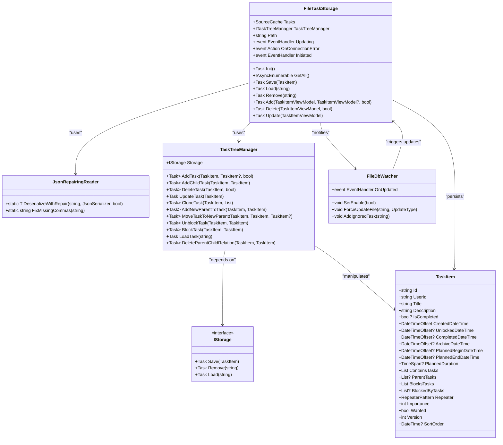
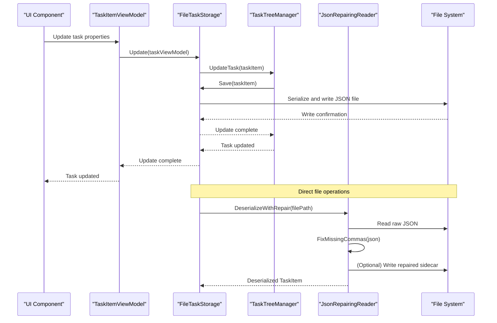
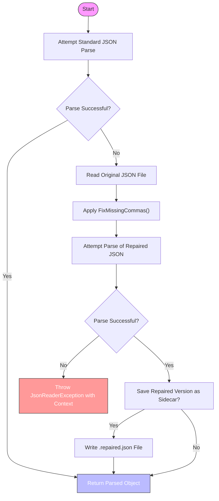
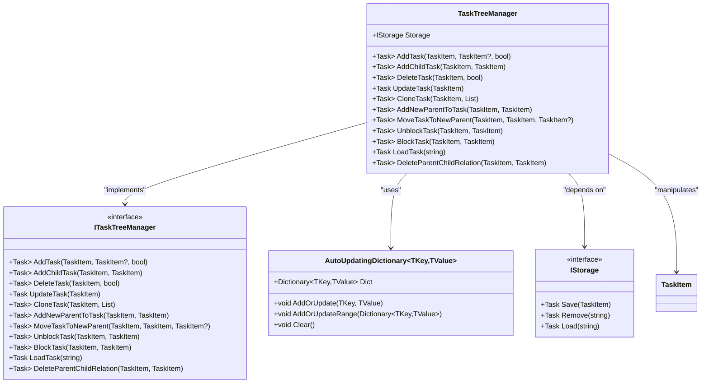
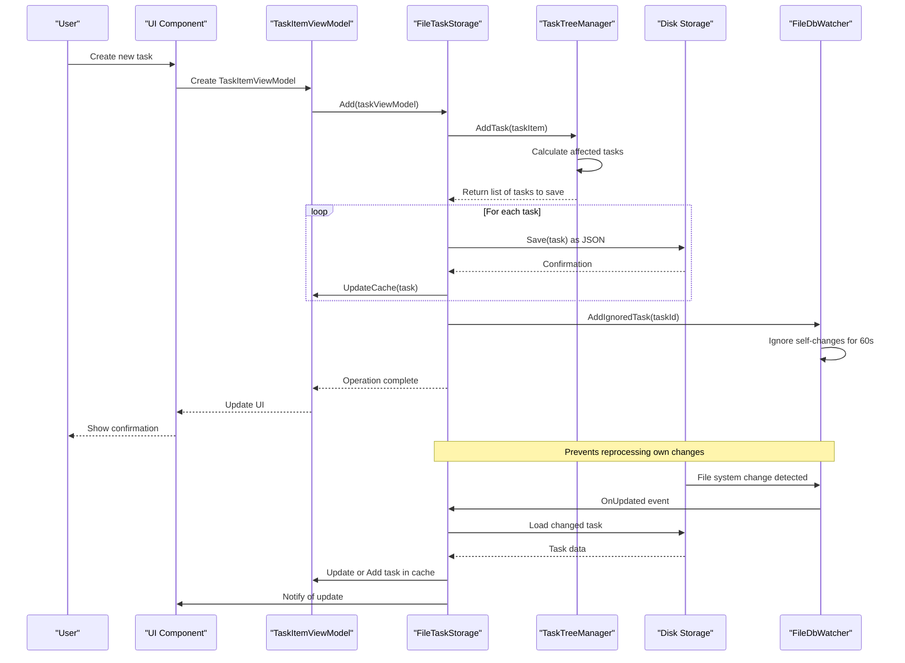
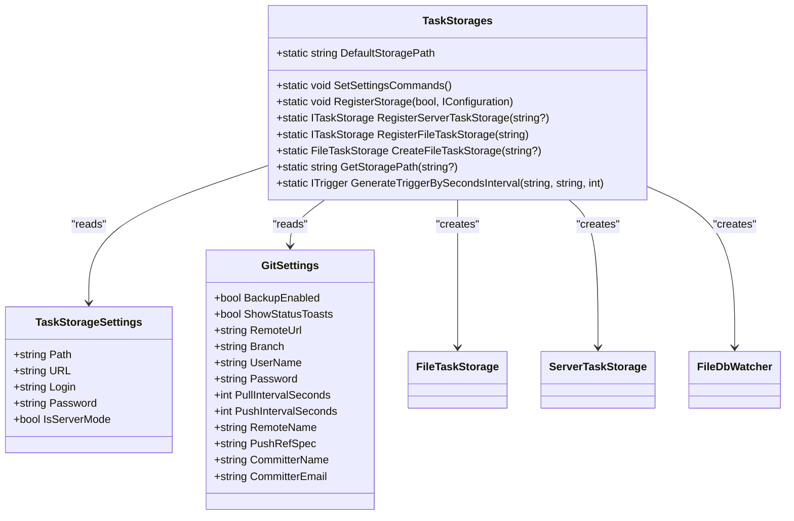
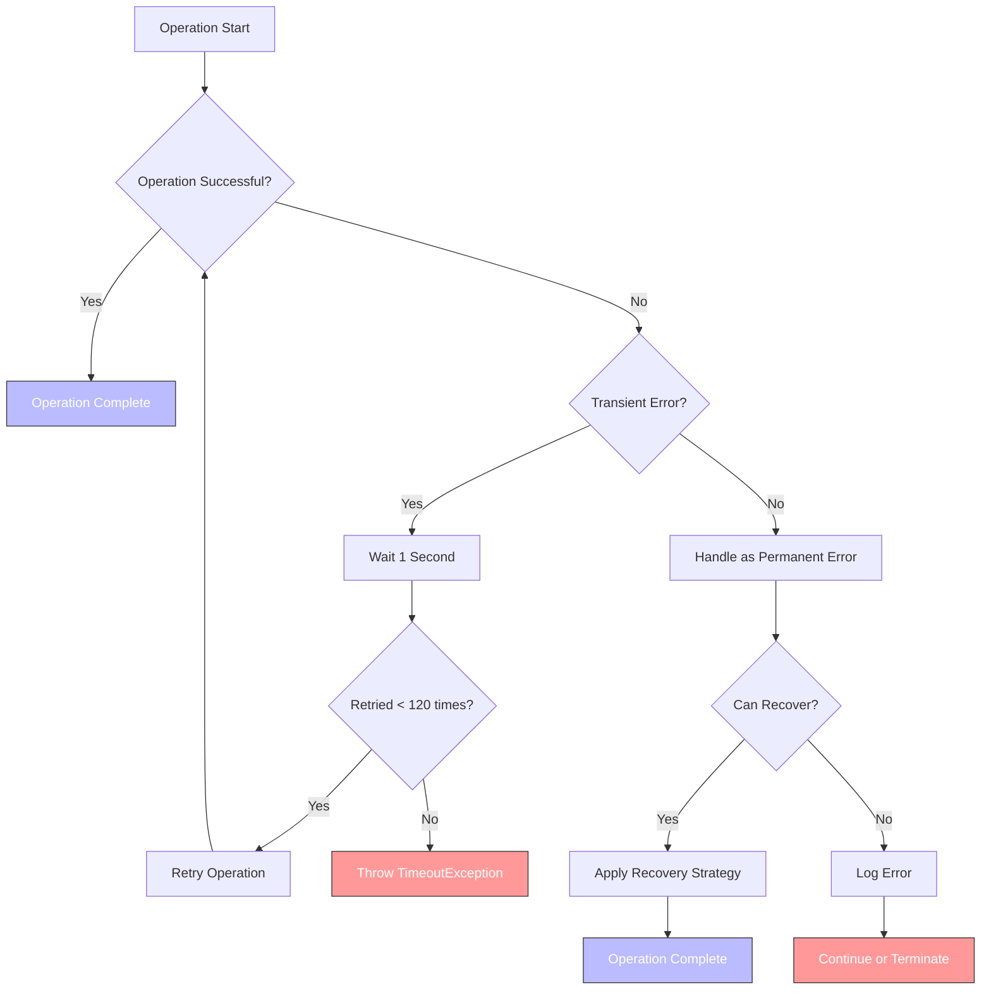
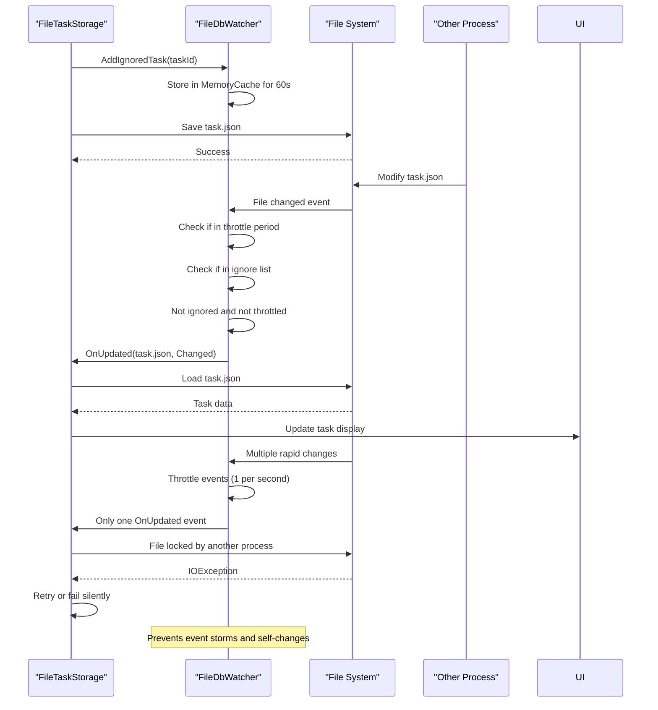

# Local Storage

<cite>
**Referenced Files in This Document**   
- [FileTaskStorage.cs](file://src/Unlimotion/FileTaskStorage.cs)
- [JsonCommaFixer.cs](file://src/Unlimotion/JsonCommaFixer.cs)
- [TaskTreeManager.cs](file://src/Unlimotion.TaskTreeManager/TaskTreeManager.cs)
- [IStorage.cs](file://src/Unlimotion.TaskTreeManager/IStorage.cs)
- [TaskItem.cs](file://src/Unlimotion.Domain/TaskItem.cs)
- [TaskStorages.cs](file://src/Unlimotion/TaskStorages.cs)
- [FileDbWatcher.cs](file://src/Unlimotion.ViewModel/FileDbWatcher.cs)
- [TaskStorageSettings.cs](file://src/Unlimotion.ViewModel/TaskStorageSettings.cs)
</cite>

## Table of Contents
1. [Introduction](#introduction)
2. [Core Components](#core-components)
3. [FileTaskStorage: JSON File Operations](#filetaskstorage-json-file-operations)
4. [JsonCommaFixer: Malformed JSON Repair](#jsoncommafixer-malformed-json-repair)
5. [TaskTreeManager: In-Memory Hierarchy Management](#tasktreemanager-in-memory-hierarchy-management)
6. [Data Lifecycle from UI to Persistence](#data-lifecycle-from-ui-to-persistence)
7. [Configuration Options](#configuration-options)
8. [Error Handling and Recovery Strategies](#error-handling-and-recovery-strategies)
9. [Concurrency and File System Considerations](#concurrency-and-file-system-considerations)
10. [Performance Implications](#performance-implications)

## Introduction

Unlimotion implements a local storage mechanism that persists task data as individual JSON files on the user's filesystem. This document details the architecture and implementation of this storage system, focusing on the interaction between `FileTaskStorage`, `JsonCommaFixer`, and `TaskTreeManager`. The system is designed to provide reliable persistence while handling common file system issues such as malformed JSON, concurrent access, and data corruption. The storage mechanism supports both standalone file-based storage and server-based storage modes, with the file-based approach being the default for local operation.

**Section sources**
- [FileTaskStorage.cs](file://src/Unlimotion/FileTaskStorage.cs#L1-L50)
- [TaskStorages.cs](file://src/Unlimotion/TaskStorages.cs#L1-L20)

## Core Components

The local storage system in Unlimotion consists of several key components that work together to manage task persistence:

- **FileTaskStorage**: Implements `ITaskStorage` and `IStorage` interfaces, responsible for reading and writing task data to JSON files on disk
- **JsonCommaFixer**: Provides JSON repair functionality through the `JsonRepairingReader` class to handle malformed JSON files
- **TaskTreeManager**: Maintains an in-memory representation of the task hierarchy and coordinates changes across related tasks
- **FileDbWatcher**: Monitors the storage directory for file system changes and notifies the application of updates
- **TaskItem**: The domain model that represents a task and its relationships with other tasks

These components work in concert to provide a robust local storage solution that handles both normal operations and edge cases such as file corruption or incomplete writes.

**Diagram sources**
- [FileTaskStorage.cs](file://src/Unlimotion/FileTaskStorage.cs#L1-L50)
- [JsonCommaFixer.cs](file://src/Unlimotion/JsonCommaFixer.cs#L1-L20)
- [TaskTreeManager.cs](file://src/Unlimotion.TaskTreeManager/TaskTreeManager.cs#L1-L30)
- [IStorage.cs](file://src/Unlimotion.TaskTreeManager/IStorage.cs#L1-L10)
- [TaskItem.cs](file://src/Unlimotion.Domain/TaskItem.cs#L1-L15)
- [FileDbWatcher.cs](file://src/Unlimotion.ViewModel/FileDbWatcher.cs#L1-L20)

## FileTaskStorage: JSON File Operations

The `FileTaskStorage` class serves as the primary interface for local task persistence, implementing both `ITaskStorage` and `IStorage` interfaces. It stores each task as a separate JSON file in a designated directory, with the filename corresponding to the task's unique identifier. During initialization, `FileTaskStorage` enumerates all JSON files in the storage directory and loads them into memory using the `GetAll()` method, which yields tasks in creation order.

The `Save()` method writes a `TaskItem` object to disk by serializing it to JSON format with indented formatting for readability. The serialization uses `IsoDateTimeConverter` to ensure consistent date-time formatting across all stored tasks. Before writing, the method checks if the storage is paused and waits if necessary, providing a mechanism to temporarily suspend persistence operations.

The `Load()` method delegates to `JsonRepairingReader.DeserializeWithRepair()`, which first attempts standard JSON deserialization and falls back to JSON repair if parsing fails. This two-phase approach ensures that tasks can be recovered even when their JSON representation is malformed. When a task cannot be loaded (even after repair attempts), the file is deleted to prevent repeated loading failures.

**Diagram sources**
- [FileTaskStorage.cs](file://src/Unlimotion/FileTaskStorage.cs#L150-L250)
- [JsonCommaFixer.cs](file://src/Unlimotion/JsonCommaFixer.cs#L10-L50)

**Section sources**
- [FileTaskStorage.cs](file://src/Unlimotion/FileTaskStorage.cs#L1-L419)

## JsonCommaFixer: Malformed JSON Repair

The `JsonCommaFixer` class, implemented as `JsonRepairingReader`, provides critical resilience against data corruption by repairing malformed JSON files that result from incomplete writes or other I/O errors. The repair process follows a two-phase strategy: first attempting standard JSON parsing, and if that fails, applying automated repairs before retrying.

The `FixMissingCommas()` method implements a state machine that parses JSON text character by character, tracking the context (object or array) and identifying missing commas between properties or array elements. It handles string literals and escaped characters correctly, ensuring that commas within strings are not mistakenly added. The algorithm detects when a value ends and the next value begins without an intervening comma, inserting the missing punctuation.

The repair process considers various JSON value types, including strings, objects, arrays, and literals (true, false, null), and inserts commas appropriately based on the syntactic context. For example, after a closing brace `}` or bracket `]`, if another value follows, a comma is inserted. Similarly, after a string value, if another quoted string follows, a comma is added.

**Diagram sources**
- [JsonCommaFixer.cs](file://src/Unlimotion/JsonCommaFixer.cs#L50-L245)

**Section sources**
- [JsonCommaFixer.cs](file://src/Unlimotion/JsonCommaFixer.cs#L1-L245)
- [JsonRepairingReaderTests.cs](file://src/Unlimotion.Test/JsonRepairingReaderTests.cs#L1-L120)

## TaskTreeManager: In-Memory Hierarchy Management

The `TaskTreeManager` class maintains an in-memory representation of the task hierarchy and ensures consistency when operations affect multiple related tasks. It implements the `ITaskTreeManager` interface and operates on the `TaskItem` domain model, coordinating changes across parent-child, blocking, and blocked-by relationships.

When a task operation is performed (such as adding a child task or creating a blocking relationship), `TaskTreeManager` returns a list of all affected tasks that need to be synchronized with storage. This includes both the primary task being modified and any related tasks whose properties change as a result of the operation. For example, when adding a child task, both the parent's `ContainsTasks` collection and the child's `ParentTasks` collection are updated.

The `AutoUpdatingDictionary` class is used internally to collect all tasks that are affected by an operation, ensuring that each task is only processed once even if it's modified multiple times during a single operation. This prevents redundant I/O operations and maintains data consistency.

All operations in `TaskTreeManager` are wrapped in retry policies using the Polly library, with a default timeout of two minutes. This provides resilience against transient I/O failures by automatically retrying operations that fail due to temporary issues.

**Diagram sources**
- [TaskTreeManager.cs](file://src/Unlimotion.TaskTreeManager/TaskTreeManager.cs#L1-L459)
- [ITaskTreeManager.cs](file://src/Unlimotion.TaskTreeManager/ITaskTreeManager.cs#L1-L32)
- [AutoUpdatingDictionary.cs](file://src/Unlimotion.TaskTreeManager/AutoUpdatingDictionary.cs#L1-L26)
- [IStorage.cs](file://src/Unlimotion.TaskTreeManager/IStorage.cs#L1-L10)

**Section sources**
- [TaskTreeManager.cs](file://src/Unlimotion.TaskTreeManager/TaskTreeManager.cs#L1-L459)
- [AutoUpdatingDictionary.cs](file://src/Unlimotion.TaskTreeManager/AutoUpdatingDictionary.cs#L1-L26)

## Data Lifecycle from UI to Persistence

The data lifecycle in Unlimotion begins with user interaction in the UI and ends with persistent storage on disk. When a user creates or modifies a task, the change is first applied to a `TaskItemViewModel` in memory. This view model then communicates the change to `FileTaskStorage` through the appropriate method call (Add, Update, Delete, etc.).

`FileTaskStorage` delegates hierarchical operations to `TaskTreeManager`, which determines all tasks affected by the operation and returns them as a list. `FileTaskStorage` then saves each affected task to disk, updating its in-memory cache (`Tasks` SourceCache) to reflect the changes. The `UpdateCache()` method ensures that the view model's state remains synchronized with the persisted data.

The `FileDbWatcher` monitors the storage directory for changes, including those made by other processes or instances. When a file is created, modified, or deleted, the watcher triggers the `OnUpdated` event, which `FileTaskStorage` handles by reloading the affected task and updating its cache. This mechanism ensures that the application remains consistent even when changes occur outside the normal UI flow.

During application startup, `FileTaskStorage.Init()` loads all tasks from disk, reconstructs the task hierarchy, and establishes the file watcher. The initialization process also handles migration of older task formats to the current schema, ensuring backward compatibility.

**Diagram sources**
- [FileTaskStorage.cs](file://src/Unlimotion/FileTaskStorage.cs#L1-L419)
- [TaskTreeManager.cs](file://src/Unlimotion.TaskTreeManager/TaskTreeManager.cs#L1-L459)
- [FileDbWatcher.cs](file://src/Unlimotion.ViewModel/FileDbWatcher.cs#L1-L153)

**Section sources**
- [FileTaskStorage.cs](file://src/Unlimotion/FileTaskStorage.cs#L1-L419)
- [TaskTreeManager.cs](file://src/Unlimotion.TaskTreeManager/TaskTreeManager.cs#L1-L459)
- [FileDbWatcher.cs](file://src/Unlimotion.ViewModel/FileDbWatcher.cs#L1-L153)

## Configuration Options

Unlimotion's local storage behavior is configurable through the `TaskStorageSettings` class, which defines key parameters for storage operation. The primary configuration option is the storage path, which specifies the directory where task JSON files are stored. This path can be set through the application settings interface or programmatically.

The storage system supports two modes: file-based (local) and server-based. The `IsServerMode` property in `TaskStorageSettings` determines which mode is active. In file-based mode, `FileTaskStorage` is registered as the active storage provider, while in server mode, `ServerTaskStorage` is used instead.

Additional configuration options related to storage include Git backup settings, which control automatic synchronization of the task directory with a remote Git repository. These settings include pull and push intervals (in seconds), repository URL, authentication credentials, and branch information. The Git backup functionality provides an additional layer of data protection by maintaining off-site copies of the task data.

The `TaskStorages` static class manages the registration and configuration of storage providers, handling the transition between different storage modes and ensuring that the appropriate services are registered with the dependency injection container.

**Diagram sources**
- [TaskStorageSettings.cs](file://src/Unlimotion.ViewModel/TaskStorageSettings.cs#L1-L35)
- [TaskStorages.cs](file://src/Unlimotion/TaskStorages.cs#L1-L224)

**Section sources**
- [TaskStorageSettings.cs](file://src/Unlimotion.ViewModel/TaskStorageSettings.cs#L1-L35)
- [TaskStorages.cs](file://src/Unlimotion/TaskStorages.cs#L1-L224)

## Error Handling and Recovery Strategies

Unlimotion employs multiple strategies to handle errors and ensure data recovery in the local storage system. The primary defense against data corruption is the `JsonRepairingReader`, which automatically attempts to repair malformed JSON files by inserting missing commas and other structural elements. This allows the application to recover from incomplete writes or other I/O errors that might otherwise render task data inaccessible.

For transient I/O failures, `TaskTreeManager` implements retry policies using the Polly library. Operations that involve saving or loading tasks are automatically retried for up to two minutes, with one-second intervals between attempts. This provides resilience against temporary file system issues, such as network drive latency or antivirus software interference.

When a task cannot be loaded (even after repair attempts), `FileTaskStorage` deletes the problematic file to prevent repeated loading failures. This prevents the application from entering a degraded state where corrupted files continuously cause errors during startup or operation.

The `FileDbWatcher` includes error handling for file system monitoring issues, logging errors and displaying notifications to the user when problems occur. It also implements throttling to prevent event storms when multiple file changes occur in rapid succession.

**Diagram sources**
- [TaskTreeManager.cs](file://src/Unlimotion.TaskTreeManager/TaskTreeManager.cs#L400-L459)
- [JsonCommaFixer.cs](file://src/Unlimotion/JsonCommaFixer.cs#L1-L245)
- [FileDbWatcher.cs](file://src/Unlimotion.ViewModel/FileDbWatcher.cs#L1-L153)

**Section sources**
- [TaskTreeManager.cs](file://src/Unlimotion.TaskTreeManager/TaskTreeManager.cs#L400-L459)
- [JsonCommaFixer.cs](file://src/Unlimotion/JsonCommaFixer.cs#L1-L245)
- [FileDbWatcher.cs](file://src/Unlimotion.ViewModel/FileDbWatcher.cs#L1-L153)

## Concurrency and File System Considerations

The local storage system in Unlimotion addresses several concurrency and file system challenges to ensure data integrity. The `FileTaskStorage` class includes a pause mechanism (`SetPause()`) that temporarily suspends persistence operations, preventing I/O during critical operations or when the application is in a transitional state.

The `FileDbWatcher` implements change throttling using `MemoryCache` to prevent event storms when multiple file changes occur in rapid succession. Each file system event is throttled to a maximum of one notification per second, preventing the application from being overwhelmed by rapid-fire updates. The watcher also ignores changes to Git-related files (those in `.git` directory or ending with `.lock` or `.orig`) to avoid processing temporary files created during Git operations.

To prevent reprocessing its own changes, `FileTaskStorage` registers task IDs with `FileDbWatcher` via `AddIgnoredTask()` when saving files. The watcher then ignores file system events for these tasks for 60 seconds, preventing infinite loops where a save operation triggers a reload that triggers another save.

The system handles file locking by relying on the underlying .NET file I/O operations, which throw exceptions when files are locked by other processes. These exceptions are caught and handled gracefully, with operations failing silently or being retried based on the context.

**Diagram sources**
- [FileTaskStorage.cs](file://src/Unlimotion/FileTaskStorage.cs#L1-L419)
- [FileDbWatcher.cs](file://src/Unlimotion.ViewModel/FileDbWatcher.cs#L1-L153)

**Section sources**
- [FileTaskStorage.cs](file://src/Unlimotion/FileTaskStorage.cs#L1-L419)
- [FileDbWatcher.cs](file://src/Unlimotion.ViewModel/FileDbWatcher.cs#L1-L153)

## Performance Implications

The local storage architecture in Unlimotion has several performance implications, particularly as the number of tasks grows. The file-per-task approach provides excellent scalability for individual operations, as accessing a single task requires reading only one small JSON file rather than parsing a large monolithic database file.

However, operations that affect multiple tasks (such as deleting a parent task with many children) can generate numerous I/O operations, as each affected task is saved individually. The `TaskTreeManager` mitigates this by batching related changes and ensuring each task is only written once per operation, but the fundamental file-per-task model means that complex operations scale linearly with the number of affected tasks.

Startup performance depends on the total number of tasks, as each task file must be enumerated and loaded during initialization. The `GetAll()` method processes files in creation order, which may impact startup time for large task collections. The use of `SourceCache` from DynamicData provides efficient in-memory querying and filtering once tasks are loaded.

The file system watcher adds minimal overhead during normal operation but can generate significant events during bulk operations (such as Git synchronization). The throttling mechanism helps control this, but users with very large task collections may experience UI lag during intensive file operations.

For optimal performance, users should ensure their task storage directory is on a fast local drive rather than a network share or cloud-synced folder, as each task operation involves multiple file system calls.

**Section sources**
- [FileTaskStorage.cs](file://src/Unlimotion/FileTaskStorage.cs#L1-L419)
- [TaskTreeManager.cs](file://src/Unlimotion.TaskTreeManager/TaskTreeManager.cs#L1-L459)
- [FileDbWatcher.cs](file://src/Unlimotion.ViewModel/FileDbWatcher.cs#L1-L153)