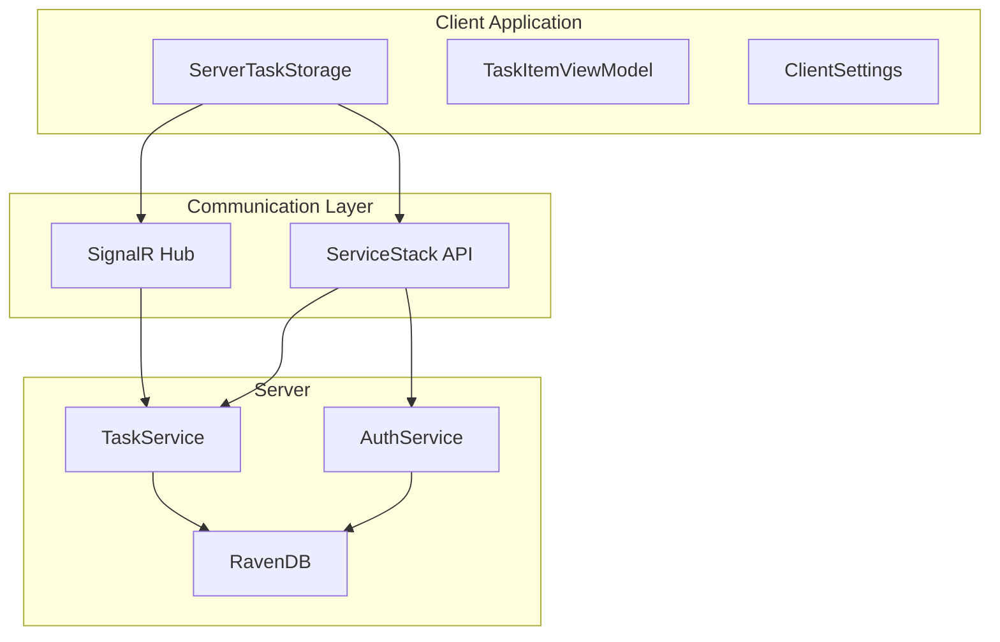
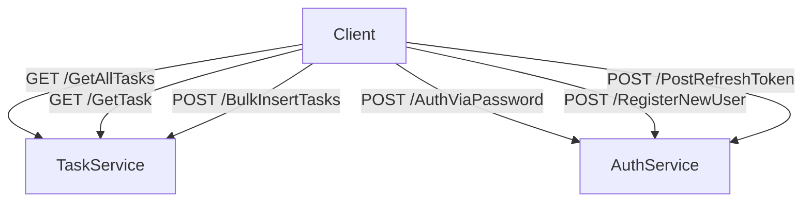
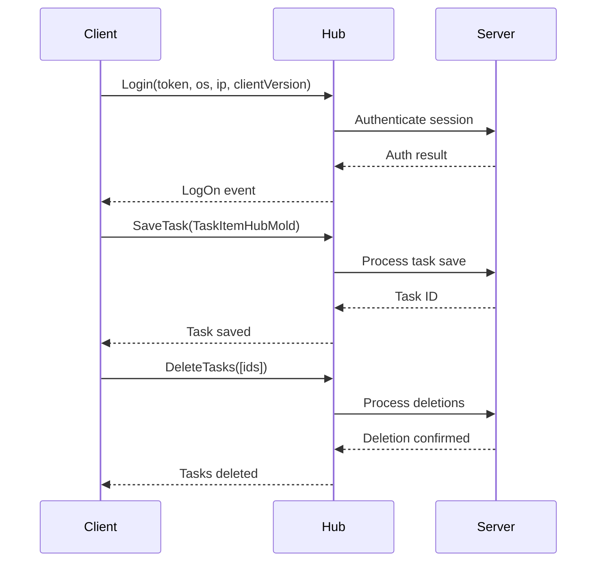
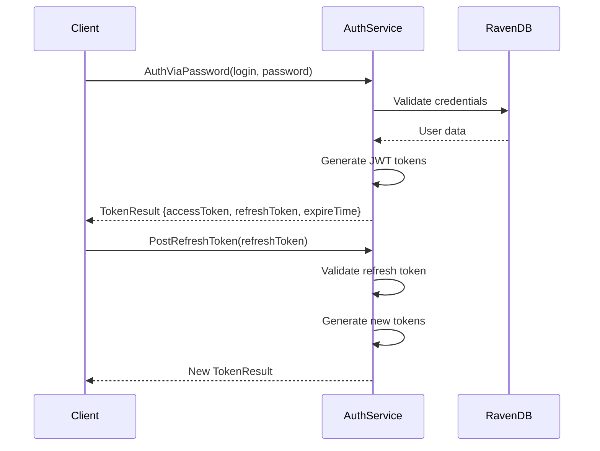
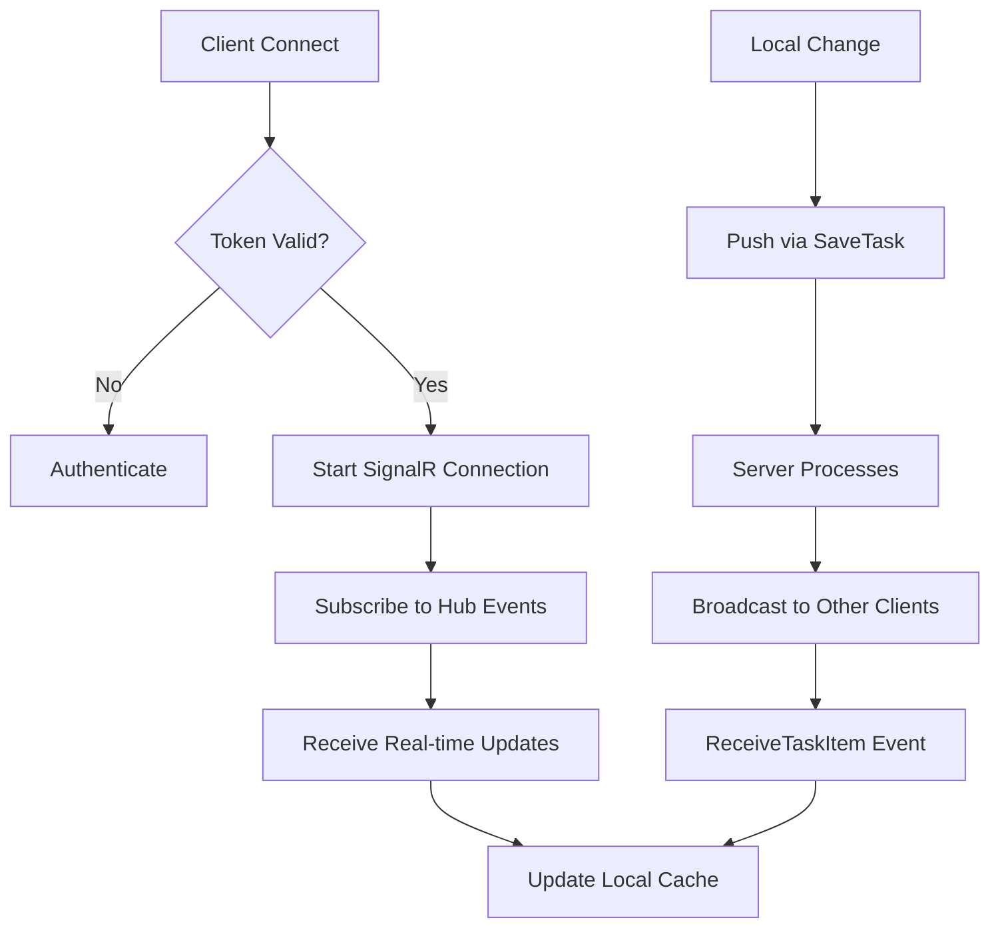
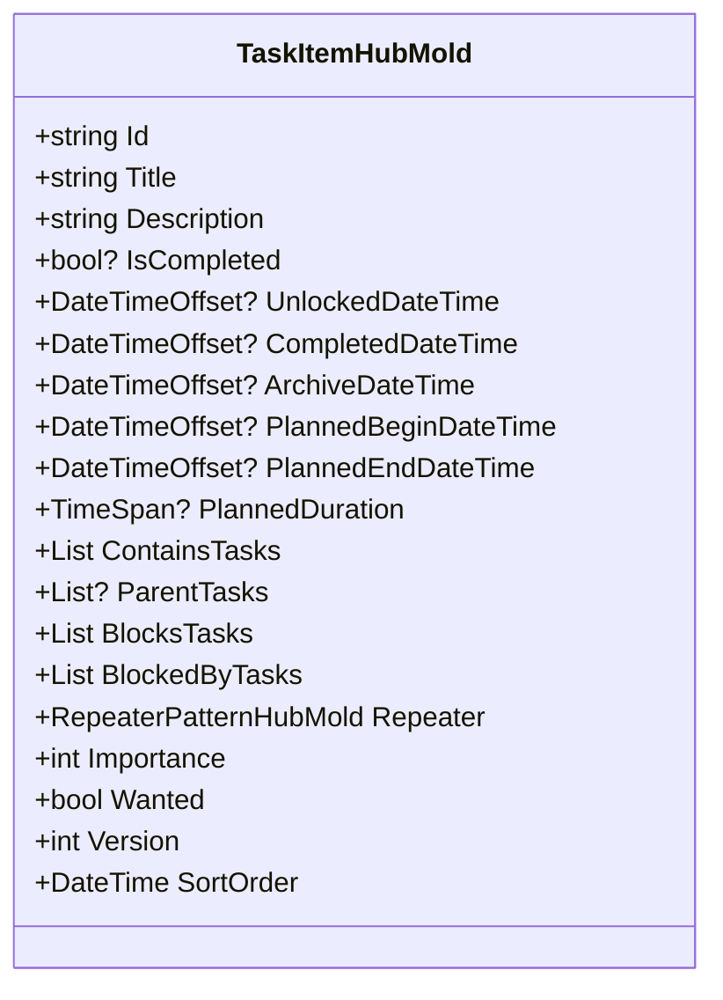
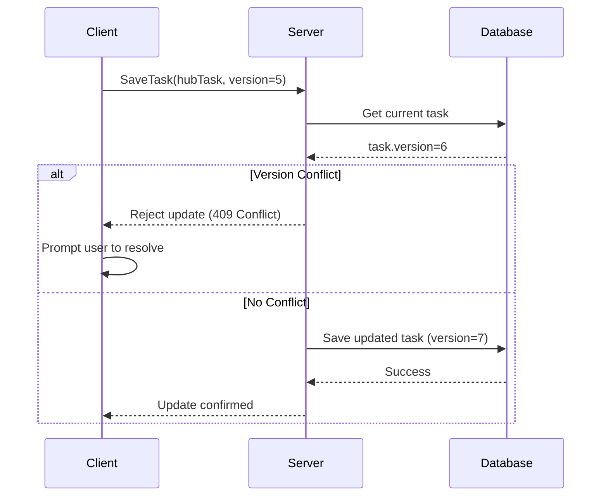
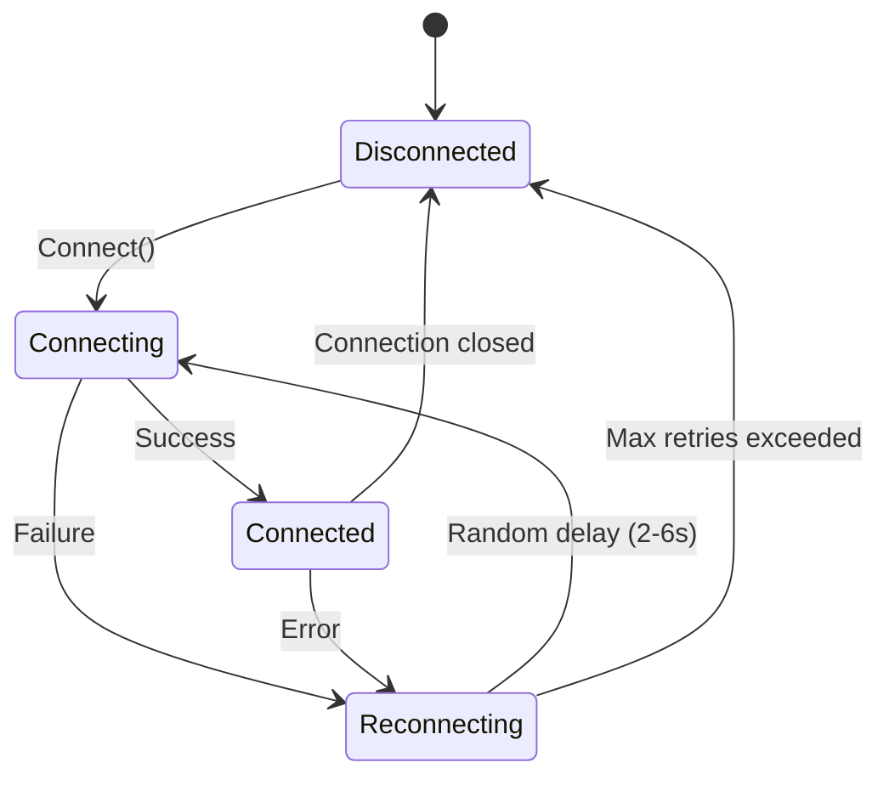
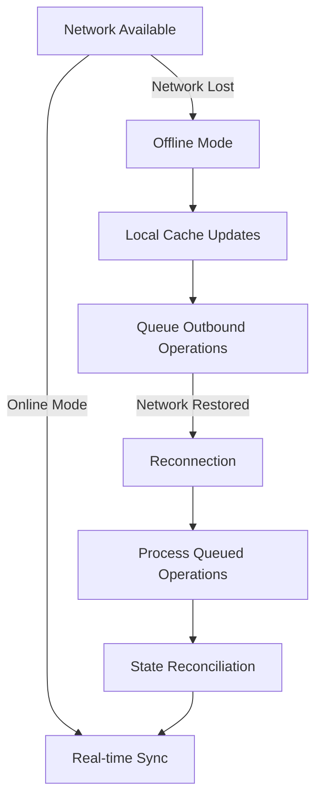
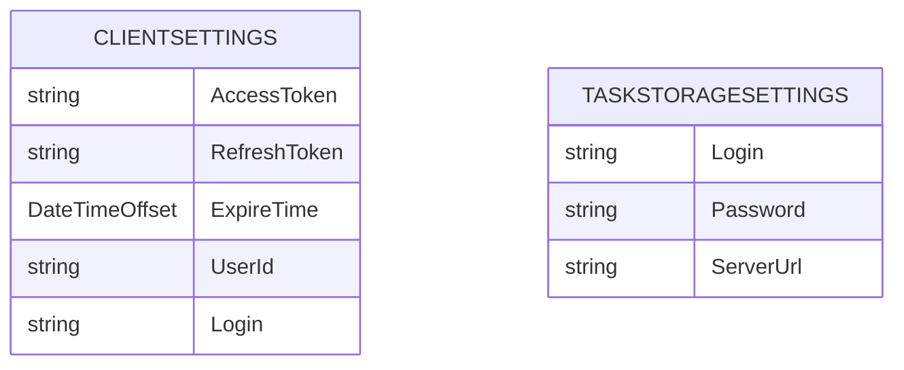

# Server Synchronization

<cite>
**Referenced Files in This Document**  
- [ServerTaskStorage.cs](file://src/Unlimotion/ServerTaskStorage.cs)
- [TaskItemHubMold.cs](file://src/Unlimotion.Interface/TaskItemHubMold.cs)
- [ClientSettings.cs](file://src/Unlimotion/ClientSettings.cs)
- [IChatHub.cs](file://src/Unlimotion.Interface/IChatHub.cs)
- [TaskService.cs](file://src/Unlimotion.Server.ServiceInterface/TaskService.cs)
- [AuthService.cs](file://src/Unlimotion.Server.ServiceInterface/AuthService.cs)
</cite>

## Table of Contents
1. [Introduction](#introduction)
2. [Architecture Overview](#architecture-overview)
3. [Communication Protocol](#communication-protocol)
4. [Authentication and Security](#authentication-and-security)
5. [Data Synchronization](#data-synchronization)
6. [Conflict Resolution and State Reconciliation](#conflict-resolution-and-state-reconciliation)
7. [Error Handling and Retry Logic](#error-handling-and-retry-logic)
8. [Offline Operation Support](#offline-operation-support)
9. [Performance Considerations](#performance-considerations)
10. [Configuration and Endpoints](#configuration-and-endpoints)
11. [Troubleshooting Guide](#troubleshooting-guide)

## Introduction

The server synchronization system in Unlimotion enables bidirectional data exchange between client applications and the backend server using ServiceStack and SignalR technologies. This document details the implementation of the `ServerTaskStorage` component, which manages task data synchronization, including authentication, conflict resolution, delta updates, and offline operation support. The system is designed to provide reliable, secure, and efficient synchronization of task data across multiple devices while maintaining data integrity and consistency.

**Section sources**
- [ServerTaskStorage.cs](file://src/Unlimotion/ServerTaskStorage.cs#L1-L50)

## Architecture Overview

The synchronization system follows a client-server architecture with the following key components:

**Diagram sources**
- [ServerTaskStorage.cs](file://src/Unlimotion/ServerTaskStorage.cs#L1-L100)
- [TaskService.cs](file://src/Unlimotion.Server.ServiceInterface/TaskService.cs#L1-L20)
- [AuthService.cs](file://src/Unlimotion.Server.ServiceInterface/AuthService.cs#L1-L20)

**Section sources**
- [ServerTaskStorage.cs](file://src/Unlimotion/ServerTaskStorage.cs#L1-L100)

## Communication Protocol

The synchronization system uses a dual-channel communication approach combining HTTP REST APIs and WebSocket-based SignalR for real-time updates.

### REST API Endpoints

### SignalR Hub Methods

**Diagram sources**
- [ServerTaskStorage.cs](file://src/Unlimotion/ServerTaskStorage.cs#L200-L300)
- [IChatHub.cs](file://src/Unlimotion.Interface/IChatHub.cs#L1-L15)
- [TaskService.cs](file://src/Unlimotion.Server.ServiceInterface/TaskService.cs#L30-L50)

**Section sources**
- [ServerTaskStorage.cs](file://src/Unlimotion/ServerTaskStorage.cs#L200-L300)
- [IChatHub.cs](file://src/Unlimotion.Interface/IChatHub.cs#L1-L15)

## Authentication and Security

The system implements a JWT-based authentication mechanism with access and refresh tokens for secure communication.

The client stores authentication tokens in `ClientSettings` and automatically handles token refresh when expired. The system uses bearer token authentication with ServiceStack's JWT provider, ensuring secure transmission of credentials and session data.

**Diagram sources**
- [AuthService.cs](file://src/Unlimotion.Server.ServiceInterface/AuthService.cs#L50-L150)
- [ClientSettings.cs](file://src/Unlimotion/ClientSettings.cs#L1-L15)
- [ServerTaskStorage.cs](file://src/Unlimotion/ServerTaskStorage.cs#L150-L200)

**Section sources**
- [AuthService.cs](file://src/Unlimotion.Server.ServiceInterface/AuthService.cs#L50-L150)
- [ClientSettings.cs](file://src/Unlimotion/ClientSettings.cs#L1-L15)

## Data Synchronization

The synchronization system uses a hybrid approach combining initial full sync with delta updates for ongoing changes.

### Data Flow

### Serialization Format
The `TaskItemHubMold` class defines the serialization format used for task data transmission:

This model serves as the DTO (Data Transfer Object) for task data, enabling efficient mapping between client and server representations through AutoMapper.

**Diagram sources**
- [TaskItemHubMold.cs](file://src/Unlimotion.Interface/TaskItemHubMold.cs#L1-L30)
- [ServerTaskStorage.cs](file://src/Unlimotion/ServerTaskStorage.cs#L300-L400)
- [TaskService.cs](file://src/Unlimotion.Server.ServiceInterface/TaskService.cs#L30-L50)

**Section sources**
- [TaskItemHubMold.cs](file://src/Unlimotion.Interface/TaskItemHubMold.cs#L1-L30)
- [ServerTaskStorage.cs](file://src/Unlimotion/ServerTaskStorage.cs#L300-L400)

## Conflict Resolution and State Reconciliation

The synchronization system implements optimistic concurrency control with version-based conflict detection.

### Version Management
Each `TaskItemHubMold` contains a `Version` property that increments with each modification. When a client attempts to save a task, the server compares the incoming version with the current version in the database:

Upon reconnection after offline operation, the client performs a full sync to reconcile state differences. The `GetAllTasks` endpoint retrieves all tasks from the server, allowing the client to identify and resolve any discrepancies between local and remote data.

**Section sources**
- [TaskItemHubMold.cs](file://src/Unlimotion.Interface/TaskItemHubMold.cs#L1-L30)
- [ServerTaskStorage.cs](file://src/Unlimotion/ServerTaskStorage.cs#L400-L500)

## Error Handling and Retry Logic

The system implements robust error handling and automatic retry mechanisms to ensure reliable operation under network instability.

### Connection Management

The `ServerTaskStorage` class uses a `SemaphoreSlim` to prevent concurrent connection attempts and implements exponential backoff with jitter for reconnection attempts. When a connection fails, the system waits for a random interval between 2-6 seconds before retrying, preventing thundering herd problems.

### Error Propagation
The system exposes several events for error handling:
- `OnConnectionError`: Fired when connection or authentication fails
- `OnConnected`: Fired when successfully connected
- `OnDisconnected`: Fired when disconnected

These events allow the UI layer to respond appropriately to connectivity changes and display relevant messages to users.

**Section sources**
- [ServerTaskStorage.cs](file://src/Unlimotion/ServerTaskStorage.cs#L500-L600)

## Offline Operation Support

The system provides comprehensive offline operation capabilities through local caching and queued operations.

### Offline Workflow

When operating offline, all task modifications are stored in the local `SourceCache<TaskItemViewModel, string>` and outbound operations are queued. Upon reconnection, the system automatically processes queued operations and performs state reconciliation to ensure data consistency.

The `IsActive` flag in `ServerTaskStorage` controls whether the synchronization loop continues, allowing graceful shutdown and preventing unnecessary connection attempts when the application is closing.

**Section sources**
- [ServerTaskStorage.cs](file://src/Unlimotion/ServerTaskStorage.cs#L600-L700)

## Performance Considerations

The synchronization system includes several optimizations for handling large datasets and minimizing bandwidth usage.

### Bulk Operations
For efficiency with multiple tasks, the system supports bulk operations:
- `BulkInsertTasks`: Allows inserting multiple tasks in a single request
- `DeleteTasks`: Enables deletion of multiple tasks via SignalR

### Delta Updates
The system uses delta updates rather than full dataset transfers for individual task modifications, reducing bandwidth consumption. Only changed tasks are transmitted, and the `TaskItemHubMold` format is optimized for minimal payload size.

### Connection Optimization
The dual-channel approach separates initial data loading (HTTP) from real-time updates (SignalR), optimizing connection usage. HTTP connections are stateless and can be load-balanced, while SignalR maintains a persistent connection for immediate push notifications.

**Section sources**
- [ServerTaskStorage.cs](file://src/Unlimotion/ServerTaskStorage.cs#L300-L400)
- [TaskService.cs](file://src/Unlimotion.Server.ServiceInterface/TaskService.cs#L50-L70)

## Configuration and Endpoints

The synchronization system is configured through client settings and environment variables.

### Configuration Parameters

The `ClientSettings` class stores authentication tokens and user information, while `TaskStorageSettings` contains login credentials and server URL configuration. These settings are managed through the `IConfiguration` service and persisted across application restarts.

### Endpoint Configuration
The system uses the following endpoints:
- `/ChatHub`: SignalR hub for real-time communication
- `/json/reply/`: ServiceStack endpoint for REST API calls
- Authentication endpoints: `/AuthViaPassword`, `/RegisterNewUser`, `/PostRefreshToken`
- Task endpoints: `/GetAllTasks`, `/GetTask`, `/BulkInsertTasks`

**Section sources**
- [ClientSettings.cs](file://src/Unlimotion/ClientSettings.cs#L1-L15)
- [ServerTaskStorage.cs](file://src/Unlimotion/ServerTaskStorage.cs#L100-L150)

## Troubleshooting Guide

This section provides guidance for diagnosing and resolving common synchronization issues.

### Common Issues and Solutions
| Issue | Possible Cause | Solution |
|------|---------------|----------|
| Authentication failures | Invalid credentials or expired tokens | Verify login credentials; check token expiration |
| Connection timeouts | Network issues or server unavailability | Check network connectivity; verify server status |
| Sync conflicts | Concurrent modifications | Implement conflict resolution UI; use version control |
| Data loss | Improper shutdown or cache corruption | Ensure proper disposal; implement data validation |
| High bandwidth usage | Frequent updates or large datasets | Optimize update frequency; use bulk operations |

### Monitoring Synchronization Status
The system provides several indicators for monitoring synchronization:
- `IsConnected`: Boolean property indicating current connection status
- `IsSignedIn`: Boolean property indicating authentication status
- Events: `OnConnected`, `OnDisconnected`, `OnConnectionError` for real-time status updates

Developers can subscribe to these events to monitor synchronization status and provide feedback to users.

**Section sources**
- [ServerTaskStorage.cs](file://src/Unlimotion/ServerTaskStorage.cs#L600-L715)
- [ClientSettings.cs](file://src/Unlimotion/ClientSettings.cs#L1-L15)