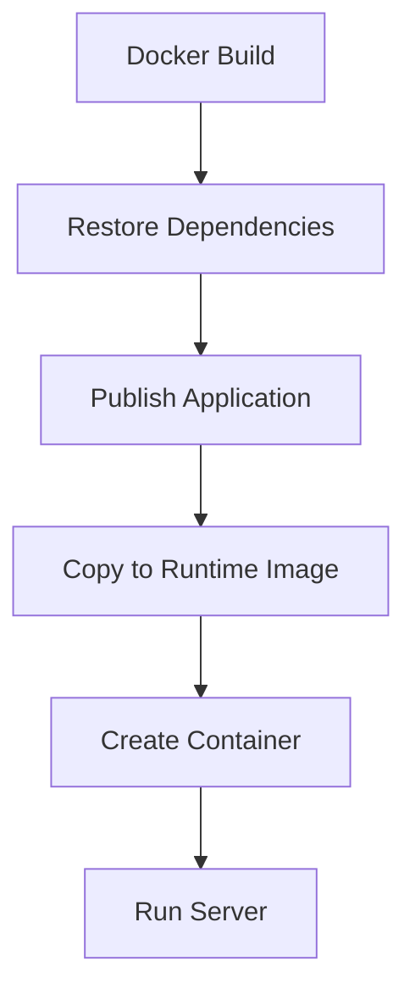
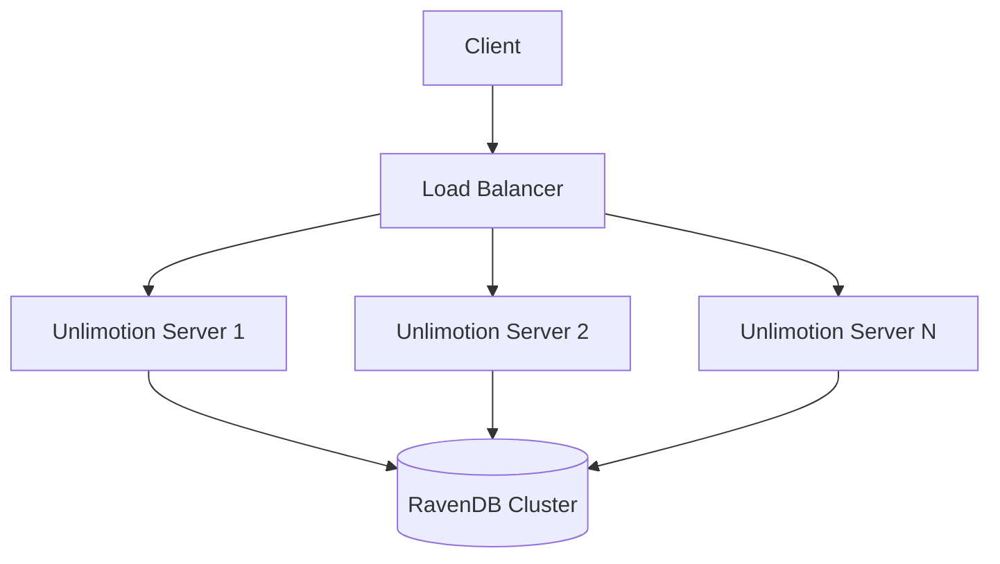

# Deployment

<cite>
**Referenced Files in This Document**   
- [Dockerfile](file://src/Unlimotion.Server/Dockerfile)
- [docker-compose.yml](file://src/docker-compose.yml)
- [docker-compose.override.yml](file://src/docker-compose.override.yml)
- [.env](file://src/.env)
- [generate-deb-pkg.sh](file://src/Unlimotion.Desktop/ci/deb/generate-deb-pkg.sh)
- [create-symlink.sh](file://src/Unlimotion.Desktop/ci/deb/create-symlink.sh)
- [generate-osx-publish.sh](file://src/Unlimotion.Desktop/ci/osx/generate-osx-publish.sh)
- [generate-osx-app.sh](file://src/Unlimotion.Desktop/ci/osx/generate-osx-app.sh)
- [generate-osx-pkg.sh](file://src/Unlimotion.Desktop/ci/osx/generate-osx-pkg.sh)
- [start-server.cmd](file://src/start-server.cmd)
- [start-server-in-docker.cmd](file://src/start-server-in-docker.cmd)
- [stop-server-in-docker.cmd](file://src/stop-server-in-docker.cmd)
- [run.linux.sh](file://run.linux.sh)
- [run.macos.sh](file://run.macos.sh)
- [Unlimotion.Browser](file://src/Unlimotion.Browser)
</cite>

## Table of Contents
1. [Introduction](#introduction)
2. [Desktop Application Packaging](#desktop-application-packaging)
3. [Server Deployment Options](#server-deployment-options)
4. [Web Application Hosting](#web-application-hosting)
5. [Mobile App Distribution](#mobile-app-distribution)
6. [Production Configuration Guidelines](#production-configuration-guidelines)
7. [Scaling and High Availability](#scaling-and-high-availability)
8. [Data Migration and Rollback Procedures](#data-migration-and-rollback-procedures)
9. [Environment Variables and Configuration](#environment-variables-and-configuration)

## Introduction
This document provides comprehensive deployment guidance for Unlimotion across all supported platforms. It covers desktop, server, web, and mobile deployment strategies, along with production configuration, scaling, and maintenance procedures. The documentation is based on the deployment scripts and configuration files present in the Unlimotion repository.

## Desktop Application Packaging

Unlimotion supports desktop application packaging for Windows, macOS, and Linux through dedicated build scripts located in the `Unlimotion.Desktop/ci` directory. These scripts automate the creation of platform-specific installers and packages.

### Linux .deb Package Generation
The Linux packaging process generates .deb packages for Debian-based distributions using the `generate-deb-pkg.sh` script. This script utilizes the `dotnet-deb` tool to create distributable packages from the `Unlimotion.Desktop.ForDebianBuild.csproj` project.

The build process includes:
- Installing the global `dotnet-deb` tool
- Restoring dependencies for the linux-x64 runtime
- Publishing a single-file, self-contained application
- Creating the .deb package with version specification

The script accepts a version parameter to tag the generated package appropriately.

**Section sources**
- [generate-deb-pkg.sh](file://src/Unlimotion.Desktop/ci/deb/generate-deb-pkg.sh#L1-L12)
- [create-symlink.sh](file://src/Unlimotion.Desktop/ci/deb/create-symlink.sh#L1-L3)

### macOS Application and Installer Packaging
For macOS, Unlimotion provides a multi-step packaging process that first publishes the application and then creates both an application bundle and a .pkg installer.

The `generate-osx-publish.sh` script handles the initial publishing phase, restoring dependencies and publishing a single-file, self-contained application for the osx-x64 runtime with the specified version.

The `generate-osx-app.sh` script (not fully shown in context) would typically handle the creation of the .app bundle, while `generate-osx-pkg.sh` uses the `productbuild` command to create a signed installer package that places the application in the /Applications directory.

**Section sources**
- [generate-osx-publish.sh](file://src/Unlimotion.Desktop/ci/osx/generate-osx-publish.sh#L1-L8)
- [generate-osx-pkg.sh](file://src/Unlimotion.Desktop/ci/osx/generate-osx-pkg.sh#L1-L5)

## Server Deployment Options

Unlimotion Server can be deployed through multiple methods, ranging from standalone execution to containerized orchestration.

### Standalone Execution
The server can be run directly using the .NET CLI with the provided `start-server.cmd` script, which executes `dotnet run` against the `Unlimotion.Server.csproj` project file. This method is suitable for development and testing environments.

**Section sources**
- [start-server.cmd](file://src/start-server.cmd#L1)

### Docker Containerization
The server includes a Dockerfile that defines a multi-stage build process for creating a production-ready container image. The Dockerfile:
- Uses the official .NET 8.0 ASP.NET runtime as the base image
- Restores dependencies in a build stage
- Publishes the application in a dedicated publish stage
- Copies the published artifacts to the final runtime image
- Sets the entry point to execute the server DLL

The container exposes ports 5004 (HTTP), 5005 (HTTPS), and 5006 (additional service) and is configured to run as a non-root user for security.

**Diagram sources**
- [Dockerfile](file://src/Unlimotion.Server/Dockerfile#L1-L28)

### Docker Compose Orchestration
For multi-container environments, Unlimotion provides `docker-compose.yml` and `docker-compose.override.yml` files that define the complete application stack.

The main compose file defines the unlimotion.server service with:
- Dynamic image naming using DOCKER_REGISTRY variable
- Volume mounts for persistent data (RavenDB and Logs)
- Environment configuration allowing unsecured public network access to RavenDB
- Port mappings for all required endpoints
- Restart policy to ensure service availability

The override file provides development-specific configuration, including environment variables and additional volume mounts for development certificates and user secrets.

**Section sources**
- [docker-compose.yml](file://src/docker-compose.yml#L1-L19)
- [docker-compose.override.yml](file://src/docker-compose.override.yml#L1-L16)

## Web Application Hosting

The Blazor-based browser version of Unlimotion is implemented in the `Unlimotion.Browser` project. This client-side application is built using WebAssembly technology and requires static file hosting.

The web application consists of standard Blazor components including:
- index.html as the entry point
- main.js for JavaScript interop
- app.css for styling
- WebAssembly runtime files

Hosting requirements include:
- Static file server capable of serving the published output
- Proper MIME type configuration for .wasm files
- HTTPS support for production deployments
- Caching configuration for static assets

The application can be published using standard .NET Blazor publishing commands and deployed to any static hosting service, including cloud storage buckets, CDN networks, or traditional web servers.

**Section sources**
- [Unlimotion.Browser](file://src/Unlimotion.Browser)

## Mobile App Distribution

Unlimotion provides mobile applications for both Android and iOS platforms through the `Unlimotion.Android` and `Unlimotion.iOS` projects. Distribution to mobile app stores follows standard procedures for each platform.

### Google Play Store
The Android application requires:
- Proper signing with a release keystore
- Generation of an APK or AAB (Android App Bundle) file
- Compliance with Google Play's content policies
- App bundle optimization for different device configurations
- Privacy policy disclosure

The build process uses standard .NET MAUI/Android tooling to generate the distributable package.

### Apple App Store
The iOS application requires:
- Apple Developer Program membership
- Proper code signing with distribution certificates
- App Store provisioning profile
- Compliance with App Store Review Guidelines
- App Store Connect metadata and screenshots
- Notarization process for macOS applications

The build process integrates with Xcode tooling through the .NET build system to generate the IPA file for submission.

**Section sources**
- [Unlimotion.Android](file://src/Unlimotion.Android)
- [Unlimotion.iOS](file://src/Unlimotion.iOS)

## Production Configuration Guidelines

### Security Hardening
Production deployments should implement the following security measures:
- Use HTTPS with valid certificates
- Remove the `RAVEN_Security_UnsecuredAccessAllowed=PublicNetwork` setting
- Implement proper authentication and authorization
- Regularly update dependencies and runtime
- Use environment-specific configuration files

### Backup Strategies
The system generates data in the RavenDB directory and logs in the Logs directory. Backup strategies should include:
- Regular snapshots of the RavenDB directory
- Log rotation and archival
- Off-site backup storage
- Testing of restore procedures

### Monitoring Setup
Essential monitoring includes:
- Application health checks
- Resource utilization (CPU, memory, disk)
- Error logging and alerting
- Database performance monitoring
- Request rate and response times

**Section sources**
- [appsettings.json](file://src/Unlimotion.Server/appsettings.json)
- [Dockerfile](file://src/Unlimotion.Server/Dockerfile)
- [docker-compose.yml](file://src/docker-compose.yml)

## Scaling and High Availability

### RavenDB Server Scaling
The RavenDB component can be scaled by:
- Increasing allocated memory and CPU resources
- Configuring replication for high availability
- Implementing sharding for large datasets
- Using RavenDB clustering for production environments
- Optimizing indexes and queries

### Load Balancing
For high-availability deployments, multiple server instances can be deployed behind a load balancer with:
- Session affinity if required
- Health checks to detect failed instances
- SSL termination at the load balancer
- DNS-based or IP-based routing

The stateless nature of the application server allows for horizontal scaling, while RavenDB provides the distributed data layer.

**Diagram sources**
- [docker-compose.yml](file://src/docker-compose.yml)
- [Dockerfile](file://src/Unlimotion.Server/Dockerfile)

## Data Migration and Rollback Procedures

### Version Upgrade Migration
When upgrading between versions:
- Backup the current RavenDB directory
- Stop the running instance
- Deploy the new version
- Start the new instance and verify functionality
- Monitor for any data migration tasks that may run automatically

The system may automatically handle schema migrations for the RavenDB storage, but backups are essential before any upgrade.

### Failed Deployment Rollback
Rollback strategies include:
- Maintaining the previous version's backup
- Reverting to the previous Docker image tag
- Restoring the RavenDB directory from backup
- Using the `stop-server-in-docker.cmd` and redeploying the previous version

The docker-compose system allows for quick rollback by changing the image tag and redeploying.

**Section sources**
- [stop-server-in-docker.cmd](file://src/stop-server-in-docker.cmd#L1)
- [start-server-in-docker.cmd](file://src/start-server-in-docker.cmd#L1)
- [docker-compose.yml](file://src/docker-compose.yml)

## Environment Variables and Configuration

The system uses environment variables and configuration files to control behavior across different environments.

### .env File Configuration
The root `.env` file contains:
- `COMPOSE_PROJECT_NAME=unlimotion` - Sets the Docker Compose project name

This variable affects container naming and network isolation when using Docker Compose.

### Docker Environment Variables
The docker-compose files define several environment variables:
- `ASPNETCORE_URLS` - Configures the server to listen on multiple ports for HTTP and HTTPS
- `RAVEN_Security_UnsecuredAccessAllowed` - Allows public network access to RavenDB (should be removed in production)

### Runtime Configuration
Additional configuration can be managed through:
- `appsettings.json` for application settings
- `appsettings.Development.json` for development overrides
- Docker environment variables for container-specific settings
- Command-line arguments for temporary overrides

The configuration system follows the standard .NET configuration hierarchy, allowing settings to be overridden at different levels.

**Section sources**
- [.env](file://src/.env#L1)
- [docker-compose.yml](file://src/docker-compose.yml)
- [appsettings.json](file://src/Unlimotion.Server/appsettings.json)