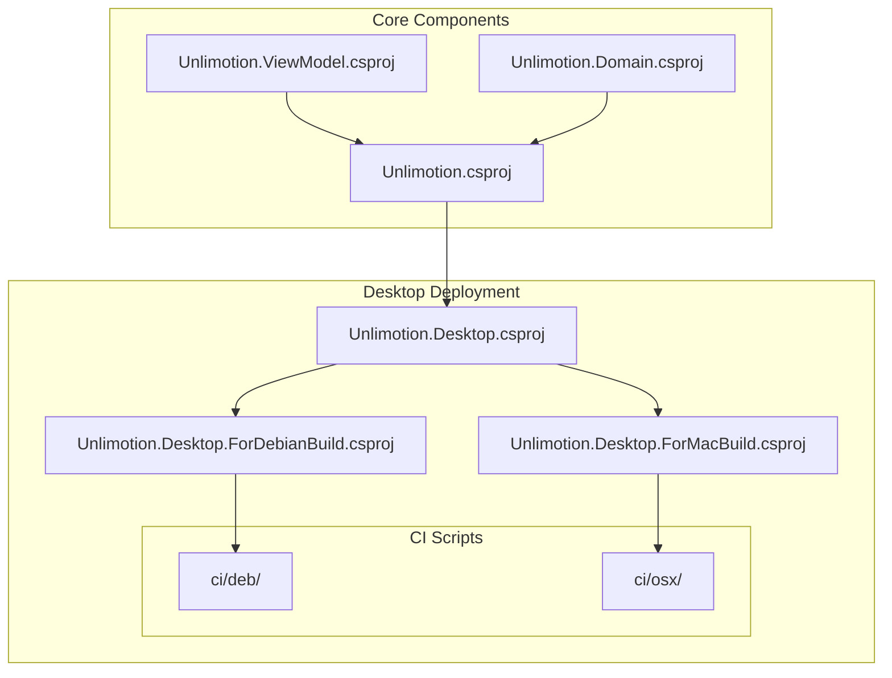
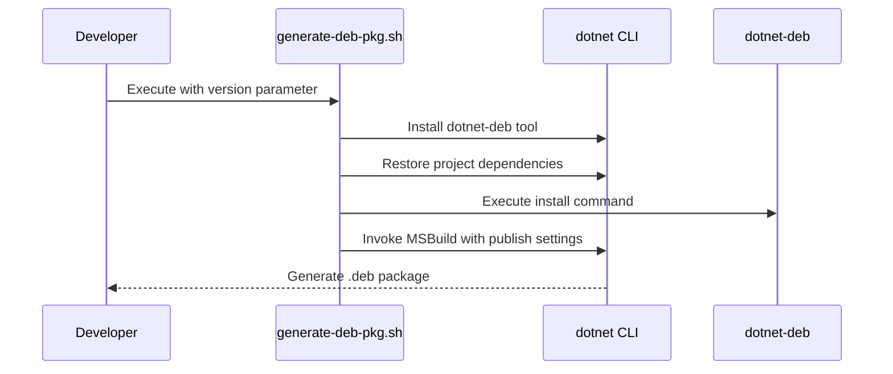
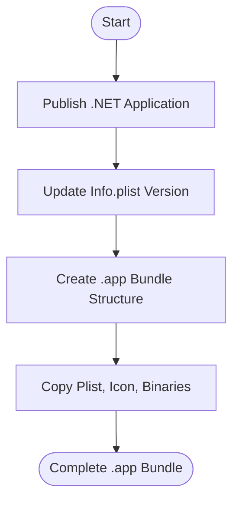
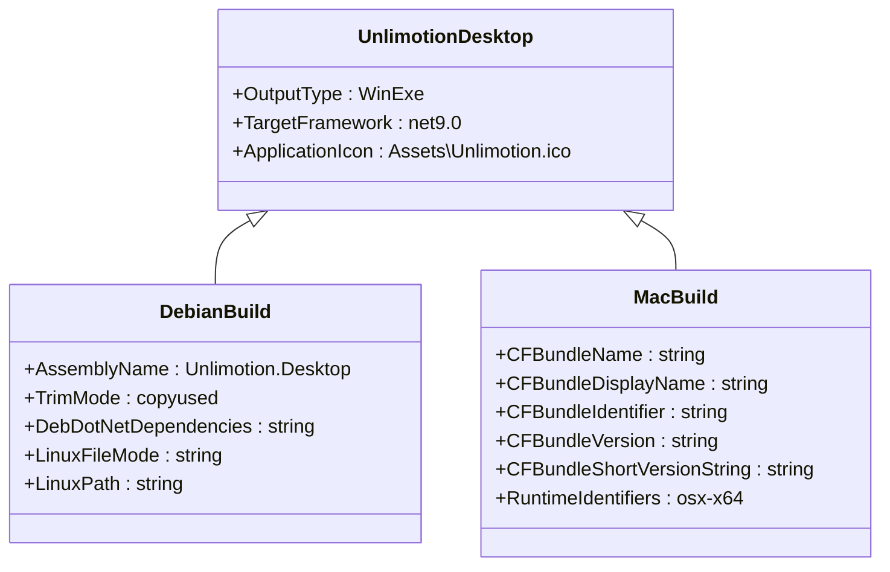

# Desktop Application Deployment

<cite>
**Referenced Files in This Document**   
- [generate-deb-pkg.sh](file://src/Unlimotion.Desktop/ci/deb/generate-deb-pkg.sh)
- [create-symlink.sh](file://src/Unlimotion.Desktop/ci/deb/create-symlink.sh)
- [unlimotion.desktop](file://src/Unlimotion.Desktop/ci/deb/unlimotion.desktop)
- [Unlimotion.Desktop.ForDebianBuild.csproj](file://src/Unlimotion.Desktop/Unlimotion.Desktop.ForDebianBuild.csproj)
- [generate-osx-app.sh](file://src/Unlimotion.Desktop/ci/osx/generate-osx-app.sh)
- [generate-osx-pkg.sh](file://src/Unlimotion.Desktop/ci/osx/generate-osx-pkg.sh)
- [generate-osx-publish.sh](file://src/Unlimotion.Desktop/ci/osx/generate-osx-publish.sh)
- [Info.plist](file://src/Unlimotion.Desktop/ci/osx/Info.plist)
- [Unlimotion.Desktop.ForMacBuild.csproj](file://src/Unlimotion.Desktop/Unlimotion.Desktop.ForMacBuild.csproj)
- [Unlimotion.Desktop.csproj](file://src/Unlimotion.Desktop/Unlimotion.Desktop.csproj)
- [app.manifest](file://src/Unlimotion.Desktop/app.manifest)
- [run.linux.sh](file://run.linux.sh)
- [run.macos.sh](file://run.macos.sh)
</cite>

## Table of Contents
1. [Introduction](#introduction)
2. [Project Structure](#project-structure)
3. [Linux Deployment](#linux-deployment)
4. [macOS Deployment](#macos-deployment)
5. [Windows Deployment](#windows-deployment)
6. [Cross-Platform Packaging Configuration](#cross-platform-packaging-configuration)
7. [Post-Installation Setup](#post-installation-setup)
8. [Troubleshooting Common Issues](#troubleshooting-common-issues)
9. [Conclusion](#conclusion)

## Introduction
This document provides comprehensive guidance for deploying the Unlimotion desktop application across Windows, macOS, and Linux platforms. It details the build and packaging processes using CI scripts located in the `Unlimotion.Desktop/ci` directory. The documentation covers platform-specific deployment workflows, including Debian package creation for Linux, application bundle and installer generation for macOS, and standard .NET publishing for Windows. It also addresses post-installation integration, code signing requirements, and common troubleshooting scenarios.

## Project Structure
The Unlimotion project follows a modular structure with platform-specific configurations for desktop deployment. The core desktop application resides in the `src/Unlimotion.Desktop` directory, which contains multiple project files for different target platforms and a `ci` directory with platform-specific build scripts. The application uses Avalonia UI framework and .NET 9.0, with separate project files optimized for each operating system's deployment requirements.



**Diagram sources**
- [Unlimotion.Desktop.csproj](file://src/Unlimotion.Desktop/Unlimotion.Desktop.csproj)
- [Unlimotion.Desktop.ForDebianBuild.csproj](file://src/Unlimotion.Desktop/Unlimotion.Desktop.ForDebianBuild.csproj)
- [Unlimotion.Desktop.ForMacBuild.csproj](file://src/Unlimotion.Desktop/Unlimotion.Desktop.ForMacBuild.csproj)

**Section sources**
- [Unlimotion.Desktop.csproj](file://src/Unlimotion.Desktop/Unlimotion.Desktop.csproj)
- [Unlimotion.Desktop.ForDebianBuild.csproj](file://src/Unlimotion.Desktop/Unlimotion.Desktop.ForDebianBuild.csproj)
- [Unlimotion.Desktop.ForMacBuild.csproj](file://src/Unlimotion.Desktop/Unlimotion.Desktop.ForMacBuild.csproj)

## Linux Deployment
The Linux deployment process creates .deb packages for Debian-based distributions using the `dotnet-deb` tool and MSBuild. The workflow is orchestrated through scripts in the `ci/deb` directory and a specialized project file configured for Linux deployment.

### Debian Package Creation
The `generate-deb-pkg.sh` script automates the creation of .deb packages by:
1. Installing the global `dotnet-deb` tool
2. Restoring project dependencies for the `linux-x64` runtime
3. Executing the `dotnet-deb` command to prepare the package
4. Invoking MSBuild with specific publish settings to generate the final package

The build process uses several optimization flags:
- `PublishSingleFile=true`: Bundles the application into a single executable file
- `SelfContained=true`: Includes the .NET runtime, enabling execution without pre-installed .NET
- `IncludeNativeLibrariesForSelfExtract=true`: Optimizes extraction of native libraries
- `DebugType=None` and `DebugSymbols=false`: Reduces package size by excluding debug information



**Diagram sources**
- [generate-deb-pkg.sh](file://src/Unlimotion.Desktop/ci/deb/generate-deb-pkg.sh)
- [Unlimotion.Desktop.ForDebianBuild.csproj](file://src/Unlimotion.Desktop/Unlimotion.Desktop.ForDebianBuild.csproj)

**Section sources**
- [generate-deb-pkg.sh](file://src/Unlimotion.Desktop/ci/deb/generate-deb-pkg.sh)
- [Unlimotion.Desktop.ForDebianBuild.csproj](file://src/Unlimotion.Desktop/Unlimotion.Desktop.ForDebianBuild.csproj)

### Desktop Integration
The deployment process includes desktop integration through:
- A `.desktop` file installed to `/usr/share/applications/` for application menu integration
- An icon file placed in `/usr/share/icons/hicolor/48x48/apps/` for visual identification
- A symlink script that enables launching the application from the command line

The `unlimotion.desktop` file defines application metadata including name, comment, icon path, and execution command, ensuring proper integration with desktop environments.

**Section sources**
- [unlimotion.desktop](file://src/Unlimotion.Desktop/ci/deb/unlimotion.desktop)
- [create-symlink.sh](file://src/Unlimotion.Desktop/ci/deb/create-symlink.sh)
- [Unlimotion.Desktop.ForDebianBuild.csproj](file://src/Unlimotion.Desktop/Unlimotion.Desktop.ForDebianBuild.csproj)

## macOS Deployment
The macOS deployment workflow creates both application bundles (.app) and signed installer packages (.pkg) using a multi-step process involving .NET publishing, bundle creation, and product building.

### Application Bundle Creation
The `generate-osx-app.sh` script creates a macOS application bundle by:
1. Setting version information in the Info.plist file using sed
2. Creating the standard .app bundle directory structure
3. Copying the Info.plist configuration file
4. Copying the application icon
5. Copying published application binaries to the bundle's MacOS directory

The script takes a version parameter that updates the CFBundleVersion and CFBundleShortVersionString keys in the Info.plist file, ensuring version consistency across the application.



**Diagram sources**
- [generate-osx-app.sh](file://src/Unlimotion.Desktop/ci/osx/generate-osx-app.sh)
- [Info.plist](file://src/Unlimotion.Desktop/ci/osx/Info.plist)

**Section sources**
- [generate-osx-app.sh](file://src/Unlimotion.Desktop/ci/osx/generate-osx-app.sh)
- [Info.plist](file://src/Unlimotion.Desktop/ci/osx/Info.plist)

### Installer Package Generation
The `generate-osx-pkg.sh` script creates a signed installer package using Apple's `productbuild` tool. It takes the generated .app bundle and packages it for distribution, installing to the /Applications directory. The script requires code signing certificates to be properly configured in the build environment.

The `generate-osx-publish.sh` script handles the initial .NET publishing step, restoring dependencies and publishing the application with optimization settings similar to the Linux build (single file, self-contained, size optimization).

**Section sources**
- [generate-osx-pkg.sh](file://src/Unlimotion.Desktop/ci/osx/generate-osx-pkg.sh)
- [generate-osx-publish.sh](file://src/Unlimotion.Desktop/ci/osx/generate-osx-publish.sh)
- [Unlimotion.Desktop.ForMacBuild.csproj](file://src/Unlimotion.Desktop/Unlimotion.Desktop.ForMacBuild.csproj)

## Windows Deployment
Windows deployment uses standard .NET publishing through the main `Unlimotion.Desktop.csproj` file. The application can be deployed in either framework-dependent or self-contained modes, with the project configured for Windows executable output.

The project includes Windows-specific configurations such as:
- `OutputType` set to WinExe for Windows application behavior
- Application manifest for Windows security and compatibility settings
- Icon integration for Windows application identification
- Built-in COM interop support for Windows API integration

While no dedicated CI scripts are provided for Windows in the repository, the standard .NET CLI commands can be used for publishing:
```bash
dotnet publish src/Unlimotion.Desktop/Unlimotion.Desktop.csproj -c Release -f net9.0 -r win-x64
```

Code signing is required for Windows deployment to avoid security warnings, which can be accomplished using tools like signtool with a valid certificate.

**Section sources**
- [Unlimotion.Desktop.csproj](file://src/Unlimotion.Desktop/Unlimotion.Desktop.csproj)
- [app.manifest](file://src/Unlimotion.Desktop/app.manifest)

## Cross-Platform Packaging Configuration
The Unlimotion desktop application uses specialized project files for different deployment targets, each optimized for the specific platform's requirements.

### Project File Configuration
The `Unlimotion.Desktop.ForDebianBuild.csproj` file includes Linux-specific packaging directives:
- Debian package dependencies declaration via `DebDotNetDependencies`
- Linux file mode settings for executables and desktop files
- Linux path specifications for desktop integration files

The `Unlimotion.Desktop.ForMacBuild.csproj` file contains macOS-specific bundle settings:
- CFBundle properties for application identification and versioning
- Runtime identifier for osx-x64
- Integration with the Dotnet.Bundle package for macOS packaging

Both specialized project files include trimming configuration to reduce application size by excluding unused assemblies from the Avalonia themes.



**Diagram sources**
- [Unlimotion.Desktop.csproj](file://src/Unlimotion.Desktop/Unlimotion.Desktop.csproj)
- [Unlimotion.Desktop.ForDebianBuild.csproj](file://src/Unlimotion.Desktop/Unlimotion.Desktop.ForDebianBuild.csproj)
- [Unlimotion.Desktop.ForMacBuild.csproj](file://src/Unlimotion.Desktop/Unlimotion.Desktop.ForMacBuild.csproj)

**Section sources**
- [Unlimotion.Desktop.ForDebianBuild.csproj](file://src/Unlimotion.Desktop/Unlimotion.Desktop.ForDebianBuild.csproj)
- [Unlimotion.Desktop.ForMacBuild.csproj](file://src/Unlimotion.Desktop/Unlimotion.Desktop.ForMacBuild.csproj)

## Post-Installation Setup
The deployment process includes several post-installation integration steps to ensure a seamless user experience across platforms.

### Linux Desktop Integration
On Linux systems, the installation process automatically sets up:
- Desktop menu integration via the .desktop file
- Application icon in the system icon theme
- Command-line accessibility through the /usr/local/bin symlink
- File associations (if configured in the .desktop file)

### macOS Code Signing
For macOS, proper code signing is essential for:
- Gatekeeper approval and avoiding "unidentified developer" warnings
- Notarization requirements for distribution outside the App Store
- Entitlements for specific system capabilities

The build environment must have appropriate signing certificates configured for both the application and installer packages.

### Auto-Update Mechanisms
While not explicitly configured in the provided scripts, the application architecture supports potential auto-update mechanisms through:
- Version parameterization in build scripts
- Standardized release artifact naming
- Cross-platform deployment patterns that could integrate with update frameworks

**Section sources**
- [unlimotion.desktop](file://src/Unlimotion.Desktop/ci/deb/unlimotion.desktop)
- [create-symlink.sh](file://src/Unlimotion.Desktop/ci/deb/create-symlink.sh)
- [Info.plist](file://src/Unlimotion.Desktop/ci/osx/Info.plist)

## Troubleshooting Common Issues
This section addresses common problems encountered during the deployment process and their solutions.

### Missing Dependencies
**Issue**: Application fails to launch due to missing system libraries
**Solution**: Ensure all dependencies listed in `DebDotNetDependencies` are available on the target system, particularly libicu and libssl variants

### Code Signing Errors
**Issue**: macOS installer creation fails with code signing errors
**Solution**: Verify that signing identities are properly configured in the keychain and that the `productbuild` command has access to the necessary certificates

### Version Parameter Issues
**Issue**: Version string not properly updated in Info.plist
**Solution**: Ensure the version parameter is passed correctly to the generate-osx-app.sh script and that sed commands execute properly

### File Permissions
**Issue**: Executable files lack proper permissions after installation
**Solution**: Verify LinuxFileMode settings in the project file and ensure the packaging process preserves executable bits

### Path Configuration
**Issue**: Application cannot locate published binaries
**Solution**: Verify the PUBLISH_OUTPUT_DIRECTORY path in generate-osx-app.sh matches the actual publish output location

**Section sources**
- [generate-deb-pkg.sh](file://src/Unlimotion.Desktop/ci/deb/generate-deb-pkg.sh)
- [generate-osx-app.sh](file://src/Unlimotion.Desktop/ci/osx/generate-osx-app.sh)
- [generate-osx-pkg.sh](file://src/Unlimotion.Desktop/ci/osx/generate-osx-pkg.sh)
- [Unlimotion.Desktop.ForDebianBuild.csproj](file://src/Unlimotion.Desktop/Unlimotion.Desktop.ForDebianBuild.csproj)

## Conclusion
The Unlimotion desktop application deployment system provides a comprehensive cross-platform packaging solution using specialized CI scripts and project configurations. The Linux workflow creates Debian packages with proper desktop integration, the macOS process generates signed application bundles and installers, and Windows deployment leverages standard .NET publishing. Each platform-specific workflow includes size optimization through single-file publishing, self-contained deployment, and trimming. The system is designed for extensibility and can be adapted to additional deployment scenarios as needed. Proper code signing and desktop integration ensure a professional user experience across all supported operating systems.