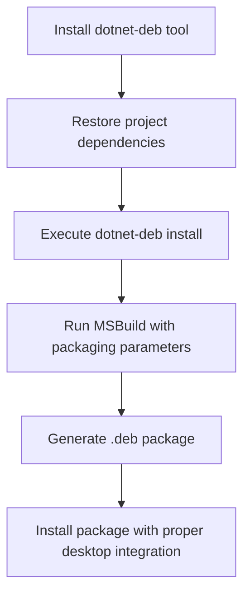
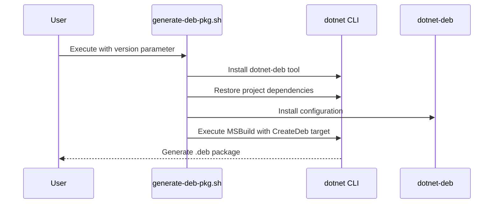
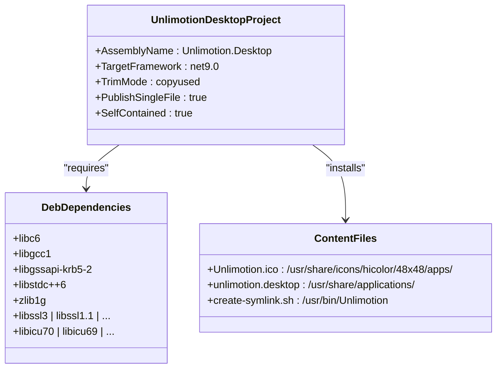

# Linux Deployment

<cite>
**Referenced Files in This Document**   
- [generate-deb-pkg.sh](file://src/Unlimotion.Desktop/ci/deb/generate-deb-pkg.sh)
- [create-symlink.sh](file://src/Unlimotion.Desktop/ci/deb/create-symlink.sh)
- [Unlimotion.Desktop.ForDebianBuild.csproj](file://src/Unlimotion.Desktop/Unlimotion.Desktop.ForDebianBuild.csproj)
- [unlimotion.desktop](file://src/Unlimotion.Desktop/ci/deb/unlimotion.desktop)
- [run.linux.sh](file://run.linux.sh)
</cite>

## Table of Contents
1. [Introduction](#introduction)
2. [Prerequisites for Linux Deployment](#prerequisites-for-linux-deployment)
3. [Build Process Overview](#build-process-overview)
4. [MSBuild Parameters and Optimization](#msbuild-parameters-and-optimization)
5. [Package Generation Script Analysis](#package-generation-script-analysis)
6. [Desktop Integration and Post-Installation Setup](#desktop-integration-and-post-installation-setup)
7. [Symlink Configuration](#symlink-configuration)
8. [Project Configuration for Linux Packaging](#project-configuration-for-linux-packaging)
9. [Step-by-Step Build Instructions](#step-by-step-build-instructions)
10. [Troubleshooting Common Issues](#troubleshooting-common-issues)

## Introduction
This document provides comprehensive guidance on deploying the Unlimotion desktop application on Linux systems, specifically focusing on Debian-based distributions. It details the automated packaging process using the `dotnet-deb` tool, explains the integration of MSBuild parameters for size optimization, and covers desktop integration elements such as application launchers and MIME type associations. The documentation also includes prerequisites, step-by-step build instructions, and troubleshooting guidance for common deployment issues.

## Prerequisites for Linux Deployment
Before building the Unlimotion .deb package, several prerequisites must be installed on the target system:

- **dpkg**: The Debian package management system, required for creating and managing .deb packages
- **dotnet-deb**: A .NET global tool that enables .NET projects to generate Debian packages
- **.NET SDK 9.0**: The correct version of the .NET SDK must be installed to ensure compatibility with the project configuration
- **AvaloniaUI dependencies**: Required runtime libraries for the Avalonia framework used by the application

These dependencies ensure that the build environment can properly compile, package, and deploy the Unlimotion application on Debian-based Linux distributions.

**Section sources**
- [generate-deb-pkg.sh](file://src/Unlimotion.Desktop/ci/deb/generate-deb-pkg.sh#L4)
- [Unlimotion.Desktop.ForDebianBuild.csproj](file://src/Unlimotion.Desktop/Unlimotion.Desktop.ForDebianBuild.csproj#L6)

## Build Process Overview
The Linux deployment process for Unlimotion follows a structured workflow that automates the creation of distributable .deb packages. The process begins with restoring project dependencies for the Linux-x64 runtime, followed by the installation of the `dotnet-deb` tool. The core build process then executes MSBuild with specific parameters to create a single-file, self-contained application optimized for Linux deployment.

The build pipeline is designed to produce a complete Debian package that includes not only the application binary but also desktop integration components such as icons, application launchers, and proper executable paths. This ensures that once installed, the application appears in the system menu and can be launched like any native Linux application.



**Diagram sources**
- [generate-deb-pkg.sh](file://src/Unlimotion.Desktop/ci/deb/generate-deb-pkg.sh#L4-L11)

**Section sources**
- [generate-deb-pkg.sh](file://src/Unlimotion.Desktop/ci/deb/generate-deb-pkg.sh#L1-L11)

## MSBuild Parameters and Optimization
The Unlimotion build process utilizes several MSBuild parameters to optimize the application package for Linux deployment:

- **PublishSingleFile=true**: Bundles the application and all its dependencies into a single executable file, simplifying distribution and installation
- **SelfContained=true**: Ensures the application includes all necessary .NET runtime components, making it independent of system-installed .NET versions
- **IncludeNativeLibrariesForSelfExtract=true**: Includes native libraries required for self-extraction of the single-file application
- **TrimMode=copyused**: Enables assembly trimming to reduce application size by removing unused code from dependencies
- **DebugType=None** and **DebugSymbols=false**: Removes debugging information to further reduce package size

These optimization parameters are crucial for creating a compact, efficient .deb package that maintains full functionality while minimizing disk space usage and improving startup performance.

**Section sources**
- [generate-deb-pkg.sh](file://src/Unlimotion.Desktop/ci/deb/generate-deb-pkg.sh#L11)
- [Unlimotion.Desktop.ForDebianBuild.csproj](file://src/Unlimotion.Desktop/Unlimotion.Desktop.ForDebianBuild.csproj#L10)

## Package Generation Script Analysis
The `generate-deb-pkg.sh` script automates the entire .deb package creation process. It begins by installing the `dotnet-deb` global tool, which provides the necessary functionality for generating Debian packages from .NET projects. The script then navigates to the project directory and adds the .NET tools directory to the system PATH to ensure the `dotnet-deb` command is accessible.

The script executes a series of commands in sequence:
1. Restores project dependencies specifically for the linux-x64 runtime
2. Installs the `dotnet-deb` tool configuration
3. Invokes MSBuild with the CreateDeb target and various packaging parameters

The script accepts a version parameter ($1) that is injected into the package metadata, allowing for version-controlled builds. This automation eliminates manual steps and ensures consistent package generation across different build environments.



**Diagram sources**
- [generate-deb-pkg.sh](file://src/Unlimotion.Desktop/ci/deb/generate-deb-pkg.sh#L1-L11)

**Section sources**
- [generate-deb-pkg.sh](file://src/Unlimotion.Desktop/ci/deb/generate-deb-pkg.sh#L1-L11)

## Desktop Integration and Post-Installation Setup
The Unlimotion package includes comprehensive desktop integration that ensures the application is properly integrated into the Linux desktop environment after installation. This integration is achieved through several components specified in the project file:

- **Application launcher**: A desktop entry file (`unlimotion.desktop`) is installed to `/usr/share/applications/`, making the application discoverable in the system menu
- **Icon registration**: The application icon is placed in the standard hicolor icon directory at `/usr/share/icons/hicolor/48x48/apps/`
- **MIME type associations**: The desktop file registers the application with appropriate categories for proper classification in application menus

The desktop entry specifies the application name, comment, icon path, and execution command, ensuring that users can launch Unlimotion from their desktop environment just like any other native application. The Categories field includes "Tags;Describing;Application" to help desktop environments categorize the application appropriately.

**Section sources**
- [Unlimotion.Desktop.ForDebianBuild.csproj](file://src/Unlimotion.Desktop/Unlimotion.Desktop.ForDebianBuild.csproj#L37-L39)
- [unlimotion.desktop](file://src/Unlimotion.Desktop/ci/deb/unlimotion.desktop#L1-L9)

## Symlink Configuration
The `create-symlink.sh` script plays a crucial role in establishing the proper executable path for the Unlimotion application. This script creates a symbolic link that points to the actual application binary located at `/usr/local/bin/Unlimotion.Desktop`.

When executed, the script uses the `exec` command to transparently redirect execution to the main application binary while preserving all command-line arguments. This approach provides several benefits:
- Creates a clean, user-friendly command (`Unlimotion`) for launching the application from the terminal
- Maintains separation between the executable interface and the actual binary location
- Allows for easy updates to the underlying binary without changing the user-facing command

The script is installed with executable permissions (755) and placed in `/usr/bin/`, ensuring it's available in the system PATH and can be executed by all users.

**Section sources**
- [create-symlink.sh](file://src/Unlimotion.Desktop/ci/deb/create-symlink.sh#L1-L3)
- [Unlimotion.Desktop.ForDebianBuild.csproj](file://src/Unlimotion.Desktop/Unlimotion.Desktop.ForDebianBuild.csproj#L40-L42)

## Project Configuration for Linux Packaging
The `Unlimotion.Desktop.ForDebianBuild.csproj` project file contains specific configurations that enable proper Linux packaging and deployment. Unlike the standard desktop project, this build-specific project includes Debian packaging directives and Linux-specific settings.

Key configuration elements include:
- **DebDotNetDependencies**: Specifies the native Linux dependencies required by the .NET runtime, including system libraries like libc6, libgcc1, and various SSL and ICU libraries
- **Content items with LinuxPath**: Defines the installation paths for desktop integration components such as the application icon, desktop entry file, and symlink script
- **LinuxFileMode attributes**: Specifies the file permissions for installed components (744 for the icon, 544 for the desktop file, and 755 for the executable script)

The project also configures assembly trimming by marking Avalonia theme assemblies as trimmable, which helps reduce the final package size by removing unused theme resources based on the application's actual usage.



**Diagram sources**
- [Unlimotion.Desktop.ForDebianBuild.csproj](file://src/Unlimotion.Desktop/Unlimotion.Desktop.ForDebianBuild.csproj#L1-L44)

**Section sources**
- [Unlimotion.Desktop.ForDebianBuild.csproj](file://src/Unlimotion.Desktop/Unlimotion.Desktop.ForDebianBuild.csproj#L1-L44)

## Step-by-Step Build Instructions
To build the Unlimotion .deb package for Linux deployment, follow these steps:

1. Ensure the .NET 9.0 SDK is installed on your system
2. Navigate to the project root directory
3. Execute the generate-deb-pkg.sh script with a version parameter:
   ```bash
   ./src/Unlimotion.Desktop/ci/deb/generate-deb-pkg.sh 1.0.0
   ```
4. The script will automatically:
   - Install the dotnet-deb tool if not already present
   - Restore project dependencies for linux-x64
   - Generate the .deb package with the specified version
5. Locate the generated .deb file in the output directory
6. Install the package using dpkg:
   ```bash
   sudo dpkg -i unlimotion-desktop_1.0.0_amd64.deb
   ```

After installation, the Unlimotion application will be available in the system application menu and can be launched either from the menu or by typing `Unlimotion` in the terminal.

**Section sources**
- [generate-deb-pkg.sh](file://src/Unlimotion.Desktop/ci/deb/generate-deb-pkg.sh#L1-L11)
- [run.linux.sh](file://run.linux.sh#L0)

## Troubleshooting Common Issues
Several common issues may arise during the Linux deployment process:

**Missing Dependencies**: If the installation fails due to missing dependencies, resolve them by running:
```bash
sudo apt-get install -f
```
This command installs any missing dependencies required by the package.

**Permission Errors**: If you encounter permission issues when running the application, ensure the executable permissions are correctly set:
```bash
sudo chmod 755 /usr/local/bin/Unlimotion.Desktop
```

**Broken Symlinks**: If the application fails to launch from the terminal, verify the symlink exists and points to the correct location:
```bash
ls -la /usr/bin/Unlimotion
```

**Desktop Entry Not Appearing**: If the application doesn't appear in the application menu, refresh the desktop database:
```bash
sudo update-desktop-database
```

**.NET Runtime Issues**: If you encounter .NET-specific errors, verify the correct version of the .NET SDK is installed and that the runtime dependencies listed in the project file are available on the system.

**Section sources**
- [generate-deb-pkg.sh](file://src/Unlimotion.Desktop/ci/deb/generate-deb-pkg.sh#L9-L10)
- [create-symlink.sh](file://src/Unlimotion.Desktop/ci/deb/create-symlink.sh#L2)
- [Unlimotion.Desktop.ForDebianBuild.csproj](file://src/Unlimotion.Desktop/Unlimotion.Desktop.ForDebianBuild.csproj#L34-L42)