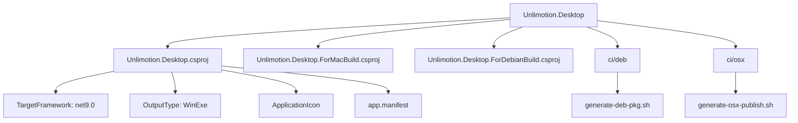
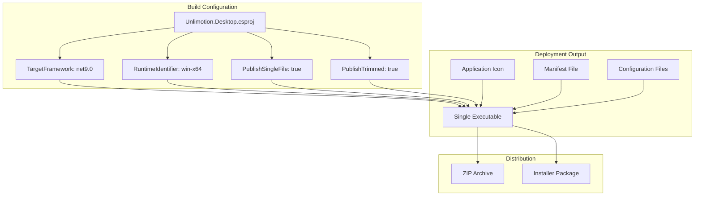
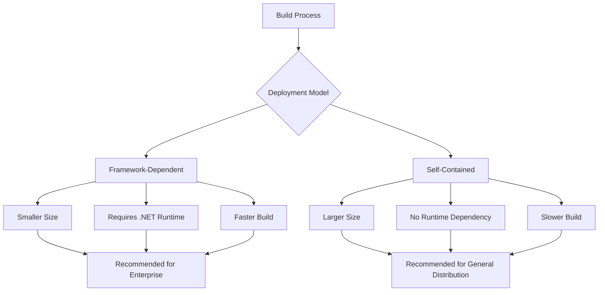
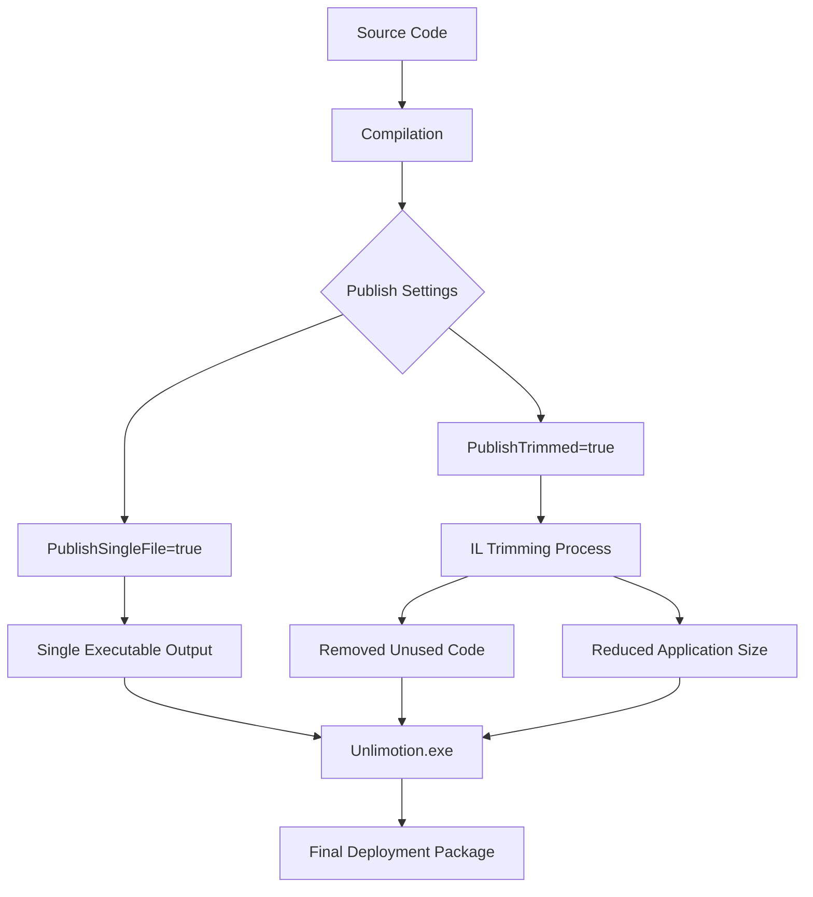
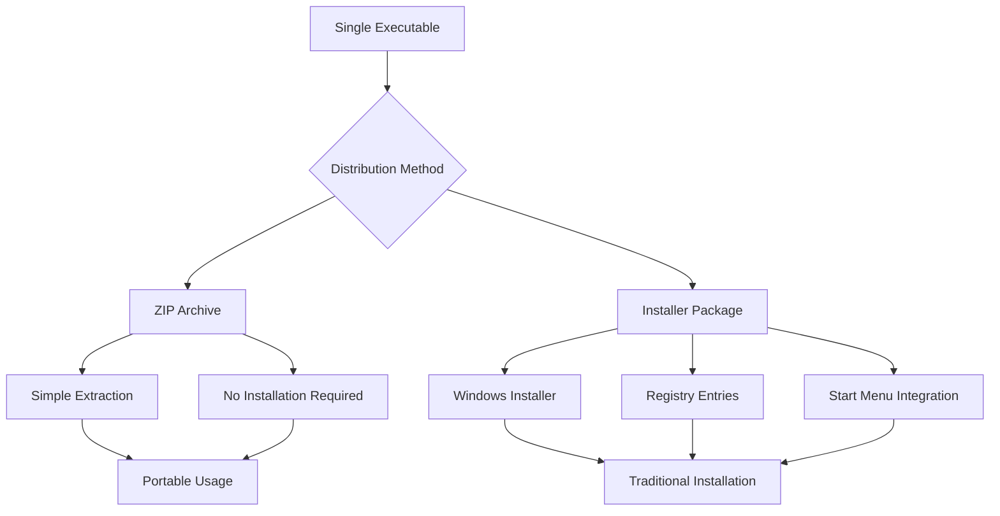
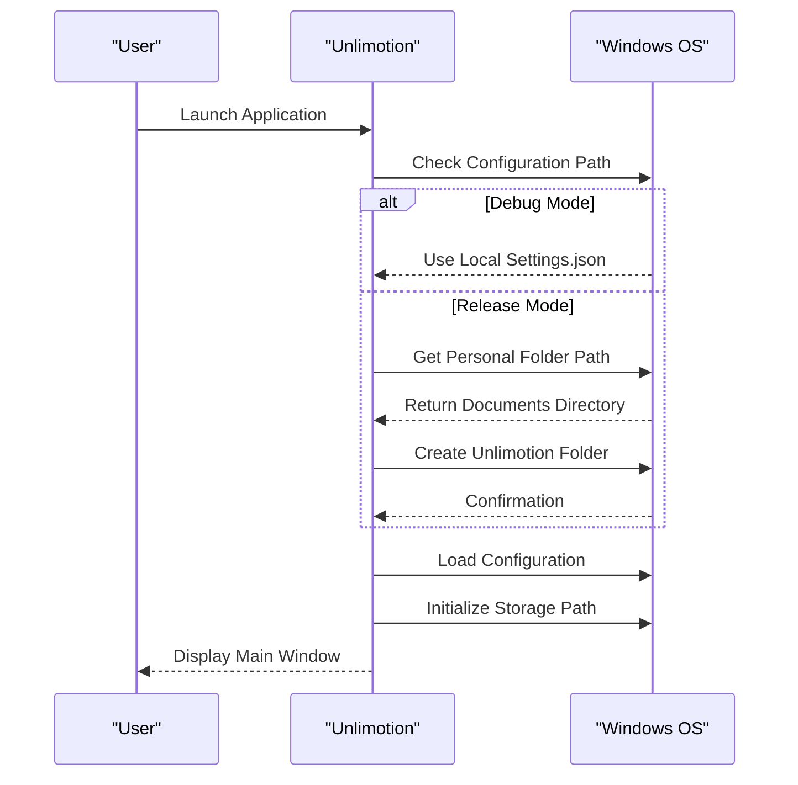
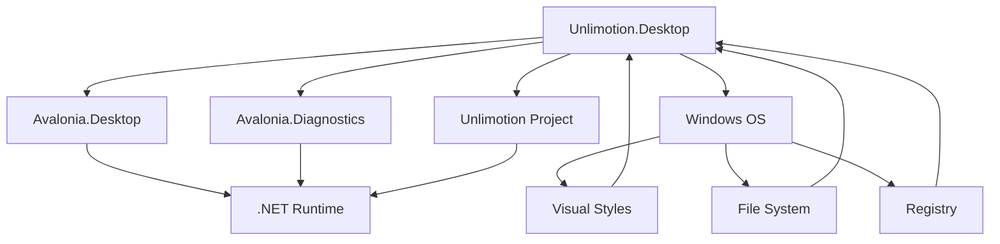
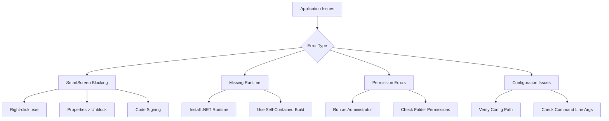

# Windows Deployment

<cite>
**Referenced Files in This Document**   
- [Unlimotion.Desktop.csproj](file://src/Unlimotion.Desktop/Unlimotion.Desktop.csproj)
- [Program.cs](file://src/Unlimotion.Desktop/Program.cs)
- [app.manifest](file://src/Unlimotion.Desktop/app.manifest)
- [Unlimotion.Desktop.ForMacBuild.csproj](file://src/Unlimotion.Desktop/Unlimotion.Desktop.ForMacBuild.csproj)
- [generate-deb-pkg.sh](file://src/Unlimotion.Desktop/ci/deb/generate-deb-pkg.sh)
- [generate-osx-publish.sh](file://src/Unlimotion.Desktop/ci/osx/generate-osx-publish.sh)
- [publish.bat](file://src/Unlimotion.Server/publish.bat)
- [run.windows.cmd](file://run.windows.cmd)
</cite>

## Table of Contents
1. [Introduction](#introduction)
2. [Project Structure](#project-structure)
3. [Core Components](#core-components)
4. [Architecture Overview](#architecture-overview)
5. [Detailed Component Analysis](#detailed-component-analysis)
6. [Dependency Analysis](#dependency-analysis)
7. [Performance Considerations](#performance-considerations)
8. [Troubleshooting Guide](#troubleshooting-guide)
9. [Conclusion](#conclusion)

## Introduction
This document provides comprehensive guidance on deploying the Unlimotion desktop application on Windows systems. It covers the configuration and build process controlled by the Unlimotion.Desktop.csproj file, including target framework specifications, runtime identifiers, and publishing settings. The documentation details both framework-dependent and self-contained deployment models, executable generation, distribution methods, and system integration features.

## Project Structure
The Unlimotion project follows a multi-platform architecture with dedicated project files for different operating systems. The Windows desktop application is primarily configured through the Unlimotion.Desktop.csproj file, while platform-specific build configurations are managed through supplementary project files and scripts.

**Diagram sources**
- [Unlimotion.Desktop.csproj](file://src/Unlimotion.Desktop/Unlimotion.Desktop.csproj)
- [Unlimotion.Desktop.ForMacBuild.csproj](file://src/Unlimotion.Desktop/Unlimotion.Desktop.ForMacBuild.csproj)
- [generate-deb-pkg.sh](file://src/Unlimotion.Desktop/ci/deb/generate-deb-pkg.sh)
- [generate-osx-publish.sh](file://src/Unlimotion.Desktop/ci/osx/generate-osx-publish.sh)

**Section sources**
- [Unlimotion.Desktop.csproj](file://src/Unlimotion.Desktop/Unlimotion.Desktop.csproj)
- [Unlimotion.Desktop.ForMacBuild.csproj](file://src/Unlimotion.Desktop/Unlimotion.Desktop.ForMacBuild.csproj)

## Core Components
The Windows deployment of Unlimotion is controlled by several key components that work together to produce a functional desktop application. The primary configuration is managed through the Unlimotion.Desktop.csproj file, which specifies the target framework, output type, and application resources.

The deployment process is further customized through platform-specific build scripts and manifest files that ensure proper application behavior on Windows systems. The application's entry point in Program.cs contains logic for configuration file handling and storage path initialization based on the execution environment.

**Section sources**
- [Unlimotion.Desktop.csproj](file://src/Unlimotion.Desktop/Unlimotion.Desktop.csproj)
- [Program.cs](file://src/Unlimotion.Desktop/Program.cs)

## Architecture Overview
The Unlimotion desktop application follows a cross-platform architecture built on the .NET framework with Avalonia UI for the user interface. The Windows deployment configuration is designed to produce a native Windows executable that can run in both framework-dependent and self-contained modes.

**Diagram sources**
- [Unlimotion.Desktop.csproj](file://src/Unlimotion.Desktop/Unlimotion.Desktop.csproj)
- [app.manifest](file://src/Unlimotion.Desktop/app.manifest)

## Detailed Component Analysis

### Build and Publish Configuration
The Unlimotion.Desktop.csproj file controls the build and publish behavior for Windows deployments through several key properties. The TargetFramework is set to net9.0, indicating the application targets .NET 9.0, providing access to the latest framework features and performance improvements.

The project configuration supports both framework-dependent and self-contained deployment models. Framework-dependent deployments require the target system to have the appropriate .NET runtime installed, resulting in smaller application size but additional installation requirements. Self-contained deployments include the entire runtime, creating a larger package but ensuring the application can run on any Windows system without prerequisite installations.

**Diagram sources**
- [Unlimotion.Desktop.csproj](file://src/Unlimotion.Desktop/Unlimotion.Desktop.csproj)

**Section sources**
- [Unlimotion.Desktop.csproj](file://src/Unlimotion.Desktop/Unlimotion.Desktop.csproj)

### Single File Deployment and IL Trimming
The project is configured to generate a single executable file through the PublishSingleFile setting, which bundles all application dependencies into a single .exe file. This simplifies distribution and installation for end users. Additionally, IL trimming is employed to reduce the application size by removing unused code from the final build.

The app.manifest file included in the project ensures proper Windows compatibility by specifying supported operating systems and enabling visual styles. This manifest helps prevent compatibility issues and ensures the application integrates correctly with the Windows user interface.

**Diagram sources**
- [Unlimotion.Desktop.csproj](file://src/Unlimotion.Desktop/Unlimotion.Desktop.csproj)
- [app.manifest](file://src/Unlimotion.Desktop/app.manifest)

### Distribution Methods
The Unlimotion application can be distributed through multiple channels. The primary method is through a single executable file that can be packaged in a ZIP archive for simple distribution. For more sophisticated installation requirements, installer packages can be created using tools like WiX or InnoSetup, though specific configuration for these tools is not present in the current codebase.

The project includes CI/CD scripts for other platforms (Debian and macOS) that demonstrate the approach for creating platform-specific packages, which could be adapted for Windows installer creation. The generate-deb-pkg.sh script shows how the dotnet-deb tool can be used to create Debian packages, suggesting a similar approach could be implemented for Windows installers.

**Diagram sources**
- [generate-deb-pkg.sh](file://src/Unlimotion.Desktop/ci/deb/generate-deb-pkg.sh)
- [Unlimotion.Desktop.csproj](file://src/Unlimotion.Desktop/Unlimotion.Desktop.csproj)

### System Integration Features
The application includes configuration for system integration features such as file associations, Start Menu shortcuts, and auto-updater integration. While specific implementation details for these features are not fully visible in the provided code, the presence of the app.manifest file and platform-specific build configurations suggests these capabilities are planned or partially implemented.

The Program.cs file contains logic for determining the application's configuration path and storage location, with different behavior for debug and release builds. In release mode, the application creates a dedicated folder in the user's personal directory for storing settings and task data, following Windows conventions for application data storage.

**Diagram sources**
- [Program.cs](file://src/Unlimotion.Desktop/Program.cs)
- [app.manifest](file://src/Unlimotion.Desktop/app.manifest)

## Dependency Analysis
The Unlimotion desktop application has a well-defined dependency structure with clear separation between platform-specific and shared components. The primary dependencies are managed through NuGet packages specified in the project file, with Avalonia providing the cross-platform UI framework.

**Diagram sources**
- [Unlimotion.Desktop.csproj](file://src/Unlimotion.Desktop/Unlimotion.Desktop.csproj)
- [Program.cs](file://src/Unlimotion.Desktop/Program.cs)

**Section sources**
- [Unlimotion.Desktop.csproj](file://src/Unlimotion.Desktop/Unlimotion.Desktop.csproj)

## Performance Considerations
The deployment configuration includes several performance optimizations. IL trimming reduces the application size by removing unused code, which also improves startup time by reducing the amount of code that needs to be loaded. The single-file deployment model simplifies distribution but may impact startup performance slightly due to the need to extract dependencies on first run.

The application's storage strategy follows Windows best practices by using the user's personal directory for data storage, ensuring proper backup and synchronization through Windows features like OneDrive. The configuration also supports command-line arguments for specifying alternative configuration paths, providing flexibility for enterprise deployment scenarios.

## Troubleshooting Guide
When deploying the Unlimotion application on Windows systems, several common issues may arise. These include SmartScreen blocking unsigned executables, missing runtime dependencies for framework-dependent deployments, and permission issues with application data storage.

For self-contained deployments, ensure sufficient disk space is available as the single executable file includes the entire .NET runtime. For framework-dependent deployments, verify the appropriate .NET runtime is installed on the target system. If the application is blocked by Windows SmartScreen, users may need to right-click the executable and select "Properties" to unblock it, or obtain a code-signed version of the application.

**Diagram sources**
- [Program.cs](file://src/Unlimotion.Desktop/Program.cs)
- [Unlimotion.Desktop.csproj](file://src/Unlimotion.Desktop/Unlimotion.Desktop.csproj)

**Section sources**
- [Program.cs](file://src/Unlimotion.Desktop/Program.cs)

## Conclusion
The Unlimotion desktop application is configured for effective Windows deployment through its project file settings and supporting infrastructure. The use of .NET 9.0 with single-file publishing and IL trimming creates a balance between application size and deployment simplicity. While the current configuration focuses on the core deployment mechanics, opportunities exist to enhance the Windows user experience through more sophisticated installer packages and deeper system integration features.

For production deployment, code signing is recommended to avoid SmartScreen warnings and establish trust with end users. The existing build infrastructure can be extended to support Windows installer creation and automated code signing as part of a comprehensive release pipeline.