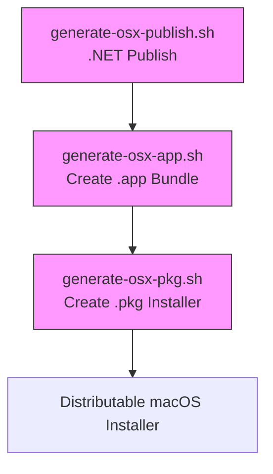
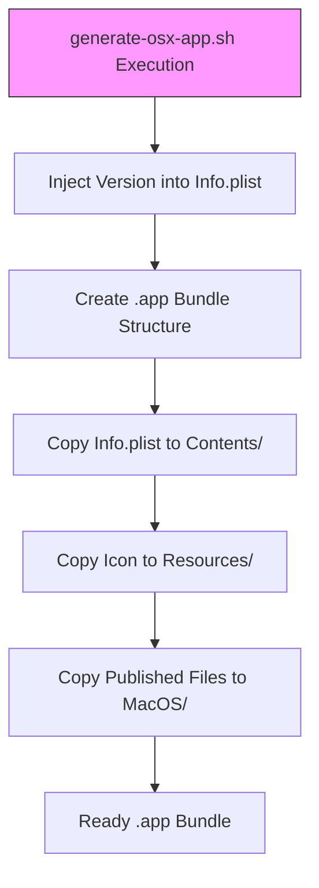

# macOS Deployment

<cite>
**Referenced Files in This Document**   
- [generate-osx-publish.sh](file://src/Unlimotion.Desktop/ci/osx/generate-osx-publish.sh)
- [generate-osx-app.sh](file://src/Unlimotion.Desktop/ci/osx/generate-osx-app.sh)
- [generate-osx-pkg.sh](file://src/Unlimotion.Desktop/ci/osx/generate-osx-pkg.sh)
- [Unlimotion.Desktop.ForMacBuild.csproj](file://src/Unlimotion.Desktop/Unlimotion.Desktop.ForMacBuild.csproj)
- [Unlimotion.Desktop.csproj](file://src/Unlimotion.Desktop/Unlimotion.Desktop.csproj)
- [Info.plist](file://src/Unlimotion.Desktop/ci/osx/Info.plist)
</cite>

## Table of Contents
1. [Introduction](#introduction)
2. [Deployment Workflow Overview](#deployment-workflow-overview)
3. [.NET Publish Configuration](#net-publish-configuration)
4. [.app Bundle Creation](#app-bundle-creation)
5. .pkg Installer Generation
6. Code Signing and Notarization
7. Bundle Configuration and Versioning
8. macOS Integration Features
9. Troubleshooting Common Issues
10. Project Configuration Influence

## Introduction
This document provides comprehensive guidance for deploying the Unlimotion desktop application on macOS. It details the three-stage deployment process: initial .NET publishing, .app bundle creation, and .pkg installer generation. The documentation covers the specific scripts and configuration files used in the build process, code signing requirements, and integration with macOS system features.

**Section sources**
- [README.md](file://README.md#L0-L186)

## Deployment Workflow Overview
The macOS deployment process for Unlimotion consists of three distinct stages executed through shell scripts located in the `ci/osx` directory:

1. **.NET Publish**: Using `generate-osx-publish.sh` to compile and publish the application for macOS
2. **.app Bundle Creation**: Using `generate-osx-app.sh` to create a signed macOS application bundle
3. **.pkg Installer Generation**: Using `generate-osx-pkg.sh` to wrap the .app bundle into a distributable installer package

This staged approach ensures proper code signing, resource embedding, and compatibility with macOS security requirements.

**Diagram sources**
- [generate-osx-publish.sh](file://src/Unlimotion.Desktop/ci/osx/generate-osx-publish.sh#L0-L7)
- [generate-osx-app.sh](file://src/Unlimotion.Desktop/ci/osx/generate-osx-app.sh#L0-L29)
- [generate-osx-pkg.sh](file://src/Unlimotion.Desktop/ci/osx/generate-osx-pkg.sh#L0-L4)

## .NET Publish Configuration
The initial stage of deployment uses `generate-osx-publish.sh` to publish the application using .NET's publish functionality. This script targets the `Unlimotion.Desktop.ForMacBuild.csproj` project with specific configuration for macOS:

- **Target Framework**: net9.0
- **Runtime Identifier**: osx-x64
- **Build Configuration**: Release
- **Publishing Options**: 
  - Single-file executable (`PublishSingleFile=true`)
  - Self-contained deployment (`--self-contained true`)
  - Native libraries included for self-extraction (`IncludeNativeLibrariesForSelfExtract=true`)
  - Debug symbols excluded (`DebugType=None`, `DebugSymbols=false`)

The script accepts a version parameter that is passed to the build process, ensuring proper versioning in the final application.

**Section sources**
- [generate-osx-publish.sh](file://src/Unlimotion.Desktop/ci/osx/generate-osx-publish.sh#L0-L7)
- [Unlimotion.Desktop.ForMacBuild.csproj](file://src/Unlimotion.Desktop/Unlimotion.Desktop.ForMacBuild.csproj#L0-L46)

## .app Bundle Creation
The second stage, executed by `generate-osx-app.sh`, creates a properly structured macOS application bundle (.app) from the published .NET output. This process involves:

1. **Version Injection**: The script uses `sed` to replace placeholder version strings in the Info.plist file with the provided version parameter
2. **Bundle Structure Creation**: Establishing the standard macOS application bundle directory structure with Contents, MacOS, and Resources directories
3. **Resource Copying**: 
   - Copying the configured Info.plist file
   - Copying the application icon (Unlimotion.icns)
   - Copying the published .NET application files to the MacOS directory

The script ensures the .app bundle follows macOS conventions and contains all necessary resources for proper operation.

**Diagram sources**
- [generate-osx-app.sh](file://src/Unlimotion.Desktop/ci/osx/generate-osx-app.sh#L0-L29)
- [Info.plist](file://src/Unlimotion.Desktop/ci/osx/Info.plist#L0-L28)

## .pkg Installer Generation
The final stage uses `generate-osx-pkg.sh` to create a distributable .pkg installer from the signed .app bundle. This script leverages Apple's `productbuild` command-line tool to:

- Package the .app bundle as a component installer
- Specify the installation target directory as `/Applications`
- Create a versioned installer package (Unlimotion-[version].pkg)

The resulting .pkg file provides a standard macOS installation experience, allowing users to easily install the application in the Applications folder with proper permissions and integration.

**Section sources**
- [generate-osx-pkg.sh](file://src/Unlimotion.Desktop/ci/osx/generate-osx-pkg.sh#L0-L4)

## Code Signing and Notarization
Proper code signing is essential for macOS deployment to satisfy Gatekeeper security requirements. While the provided scripts don't include explicit signing commands, the following requirements must be addressed:

1. **Developer ID Certificate**: Obtain an Apple Developer ID certificate for signing the application
2. **Entitlements**: Configure appropriate entitlements for the application's capabilities
3. **Code Signing Process**: Use `codesign` to sign the application bundle before creating the installer
4. **Notarization**: Submit the signed application to Apple's notarization service for additional trust

The application should be signed with the Developer ID Application certificate before packaging into the .pkg installer to ensure smooth installation and execution on end-user systems.

## Bundle Configuration and Versioning
The application bundle configuration is managed through both the project file and Info.plist template:

- **Bundle Identifier**: `com.Unlimotion` (defined in both .csproj and Info.plist)
- **Bundle Name**: `Unlimotion` (displayed to users)
- **Version Management**: Version is passed as a parameter to the scripts and injected into both the build process and Info.plist
- **Bundle Type**: APPL (standard application)

The Info.plist file serves as a template with placeholder values (`CFBundleVersionExample`, `CFBundleShortVersionStringExample`) that are replaced during the build process with the actual version number.

**Section sources**
- [Unlimotion.Desktop.ForMacBuild.csproj](file://src/Unlimotion.Desktop/Unlimotion.Desktop.ForMacBuild.csproj#L25-L35)
- [Info.plist](file://src/Unlimotion.Desktop/ci/osx/Info.plist#L0-L28)

## macOS Integration Features
The application bundle configuration includes several macOS-specific integration features:

- **High Resolution Capable**: `NSHighResolutionCapable` is set to true, ensuring proper display on Retina displays
- **Application Class**: `NSPrincipalClass` is set to NSApplication, the standard macOS application class
- **Icon Support**: The .icns format is used for the application icon, providing multiple resolutions for different display scenarios
- **Spotlight Integration**: Proper bundle configuration enables indexing by Spotlight for easy application discovery
- **Recent Items**: The application will appear in the system's recent applications list

These settings ensure the application integrates seamlessly with the macOS user experience and follows platform conventions.

**Section sources**
- [Unlimotion.Desktop.ForMacBuild.csproj](file://src/Unlimotion.Desktop/Unlimotion.Desktop.ForMacBuild.csproj#L32-L35)
- [Info.plist](file://src/Unlimotion.Desktop/ci/osx/Info.plist#L0-L28)

## Troubleshooting Common Issues
Common issues during macOS deployment and their solutions:

1. **Gatekeeper Rejections**: Ensure proper code signing with a valid Developer ID certificate and consider notarization
2. **Signing Failures**: Verify certificate validity, proper entitlements configuration, and correct signing order
3. **Launch Issues**: Check that all dependencies are included and the executable path in Info.plist matches the actual binary
4. **Permission Problems**: The README notes that on macOS, users may need to run `sudo chmod -R 755 /Applications/Unlimotion.app` after installation due to security policies
5. **Version Mismatch**: Ensure version consistency between the build parameter, Info.plist, and project file properties

**Section sources**
- [README.md](file://README.md#L10-L16)

## Project Configuration Influence
The `Unlimotion.Desktop.csproj` and `Unlimotion.Desktop.ForMacBuild.csproj` files play crucial roles in the deployment process:

- **Base Configuration**: The main .csproj file defines core project settings, dependencies, and resources
- **MacOS-Specific Configuration**: The ForMacBuild.csproj file extends the base configuration with macOS-specific properties including bundle identifiers, display names, and icons
- **Resource Inclusion**: Both projects ensure proper inclusion of assets like the application icon
- **Package References**: Include Avalonia.Desktop and Dotnet.Bundle packages essential for desktop application functionality

The separation of concerns between these project files allows for targeted configuration while maintaining code sharing across platforms.

**Section sources**
- [Unlimotion.Desktop.csproj](file://src/Unlimotion.Desktop/Unlimotion.Desktop.csproj#L0-L33)
- [Unlimotion.Desktop.ForMacBuild.csproj](file://src/Unlimotion.Desktop/Unlimotion.Desktop.ForMacBuild.csproj#L0-L46)