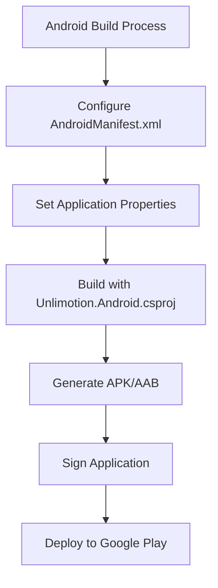
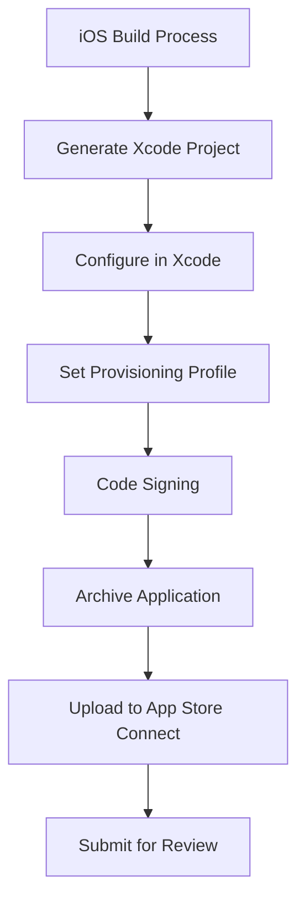
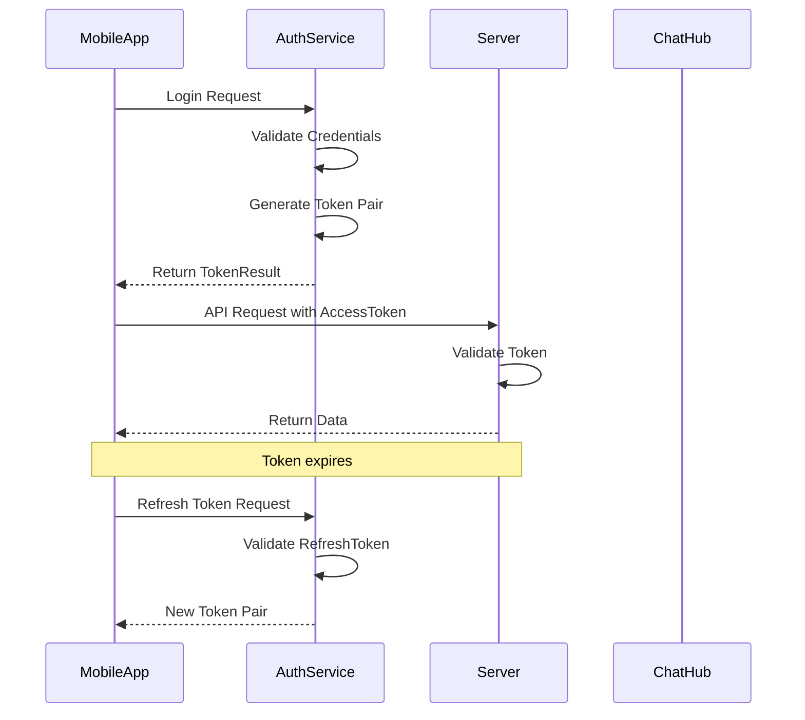
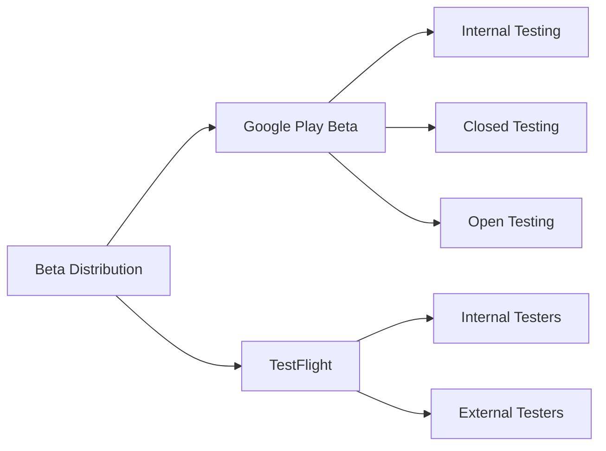

# Mobile App Distribution

<cite>
**Referenced Files in This Document**   
- [AndroidManifest.xml](file://src/Unlimotion.Android/Properties/AndroidManifest.xml)
- [Unlimotion.Android.csproj](file://src/Unlimotion.Android/Unlimotion.Android.csproj)
- [Unlimotion.iOS.csproj](file://src/Unlimotion.iOS/Unlimotion.iOS.csproj)
- [MainActivity.cs](file://src/Unlimotion.Android/MainActivity.cs)
- [AppDelegate.cs](file://src/Unlimotion.iOS/AppDelegate.cs)
- [AuthService.cs](file://src/Unlimotion.Server.ServiceInterface/AuthService.cs)
- [TokenResult.cs](file://src/Unlimotion.Server.ServiceModel/Molds/TokenResult.cs)
- [ChatHub.cs](file://src/Unlimotion.Server/hubs/ChatHub.cs)
- [AppHost.cs](file://src/Unlimotion.Server/AppHost.cs)
- [ServerTaskStorage.cs](file://src/Unlimotion/ServerTaskStorage.cs)
</cite>

## Table of Contents
1. [Introduction](#introduction)
2. [Android App Distribution](#android-app-distribution)
3. [iOS App Distribution](#ios-app-distribution)
4. [Authentication and Token Management](#authentication-and-token-management)
5. [App Store Compliance and Guidelines](#app-store-compliance-and-guidelines)
6. [Beta Distribution](#beta-distribution)
7. [Conclusion](#conclusion)

## Introduction
This document provides comprehensive guidance for distributing Unlimotion mobile applications through official app stores. The Unlimotion application is built using Avalonia UI framework, supporting cross-platform development for Android and iOS platforms. The distribution process involves platform-specific configurations, build processes, signing requirements, and compliance with app store guidelines. This documentation covers the complete workflow from build configuration to app store submission, including security considerations for authentication tokens and user data.

## Android App Distribution

### Build Process and Configuration
The Android application is configured through the Unlimotion.Android.csproj project file and AndroidManifest.xml configuration. The build process targets net9.0-android framework with a minimum supported OS version of 21 (Android 5.0 Lollipop).

The AndroidManifest.xml file declares essential permissions for the application:
- INTERNET: Required for connecting to the Unlimotion server
- READ_EXTERNAL_STORAGE and WRITE_EXTERNAL_STORAGE: Required for accessing external storage for task data and configuration files

**Diagram sources**
- [AndroidManifest.xml](file://src/Unlimotion.Android/Properties/AndroidManifest.xml)
- [Unlimotion.Android.csproj](file://src/Unlimotion.Android/Unlimotion.Android.csproj)

**Section sources**
- [AndroidManifest.xml](file://src/Unlimotion.Android/Properties/AndroidManifest.xml#L1-L7)
- [Unlimotion.Android.csproj](file://src/Unlimotion.Android/Unlimotion.Android.csproj#L1-L30)

### Version Management
Version management in the Android application is handled through two key properties in the Unlimotion.Android.csproj file:
- ApplicationVersion: Integer value representing the internal version code (currently set to 1)
- ApplicationDisplayVersion: String value representing the user-visible version name (currently set to 1.0)

The ApplicationId is set to com.Kibnet.Unlimotion, which serves as the unique package identifier in Google Play Store.

### APK and AAB Generation
The Android package format is configured in the project file with the AndroidPackageFormat property. Currently, the configuration specifies APK format, but can be changed to AAB (Android App Bundle) for Google Play distribution, which is recommended for its size optimization and dynamic delivery capabilities.

### Signing Requirements
While the current configuration does not explicitly show keystore settings in the project file, Android applications require signing before distribution. For Google Play, developers can use Google Play App Signing, which manages the app signing key on Google's servers. This allows developers to upload unsigned APKs/AABs or use a upload key while Google manages the app signing key.

Security best practices for storing credentials include:
- Using environment variables or secure storage for keystore passwords
- Never committing keystore files or passwords to version control
- Using Google Play App Signing to reduce the risk of keystore loss

### Runtime Permissions
The MainActivity.cs implementation includes runtime permission handling for external storage access. The application checks for WRITE_EXTERNAL_STORAGE permission at startup and requests it if not granted. This follows Android's runtime permission model introduced in Android 6.0 (API level 23).

The application handles both scenarios:
- When permission is granted: Uses external files directory for data storage
- When permission is denied: Falls back to internal files directory

This ensures the application functions regardless of storage permission status while maximizing storage capacity when permitted.

**Section sources**
- [Unlimotion.Android.csproj](file://src/Unlimotion.Android/Unlimotion.Android.csproj#L1-L30)
- [MainActivity.cs](file://src/Unlimotion.Android/MainActivity.cs#L40-L69)

## iOS App Distribution

### Xcode Project Generation
The iOS application is configured through the Unlimotion.iOS.csproj project file, which targets net9.0-ios framework with a minimum supported OS version of 13.0. When building with .NET MAUI or similar frameworks, the build process automatically generates an Xcode project that can be opened and further configured in Xcode.

The AppDelegate.cs file serves as the entry point for the iOS application, inheriting from AvaloniaAppDelegate<App> and customizing the app builder with custom fonts and ReactiveUI support.

### Provisioning Profiles and Code Signing
For iOS distribution, provisioning profiles and code signing identities are managed through Apple Developer Portal and Xcode. The build process requires:
- Apple Developer account with appropriate certificates
- Development and distribution provisioning profiles
- Code signing identity configuration in Xcode

While these configurations are not visible in the source code, they are essential for building and distributing iOS applications. The generated Xcode project must be configured with the appropriate team, bundle identifier, and signing settings.

### App Store Connect Submission
Submission to App Store Connect requires:
1. Archiving the application through Xcode
2. Validating the archive against App Store guidelines
3. Uploading to App Store Connect
4. Completing app metadata, screenshots, and review information
5. Submitting for review

The bundle identifier is derived from the project configuration, though it's not explicitly defined in the iOS project file shown. It would typically follow a reverse domain name pattern (e.g., com.kibnet.unlimotion).

**Diagram sources**
- [Unlimotion.iOS.csproj](file://src/Unlimotion.iOS/Unlimotion.iOS.csproj)
- [AppDelegate.cs](file://src/Unlimotion.iOS/AppDelegate.cs)

**Section sources**
- [Unlimotion.iOS.csproj](file://src/Unlimotion.iOS/Unlimotion.iOS.csproj#L1-L17)
- [AppDelegate.cs](file://src/Unlimotion.iOS/AppDelegate.cs#L1-L26)

## Authentication and Token Management

### Server Authentication Architecture
The Unlimotion mobile apps connect to the Unlimotion server using JWT (JSON Web Token) based authentication. The authentication flow is implemented in the AuthService.cs file, which generates token pairs consisting of access and refresh tokens.

The TokenResult class defines the structure of the authentication response:
- AccessToken: Used for authenticated requests to protected endpoints
- RefreshToken: Used to obtain new access tokens when they expire
- ExpireTime: Indicates when the tokens expire

**Diagram sources**
- [AuthService.cs](file://src/Unlimotion.Server.ServiceInterface/AuthService.cs)
- [TokenResult.cs](file://src/Unlimotion.Server.ServiceModel/Molds/TokenResult.cs)
- [ChatHub.cs](file://src/Unlimotion.Server/hubs/ChatHub.cs)

**Section sources**
- [AuthService.cs](file://src/Unlimotion.Server.ServiceInterface/AuthService.cs#L124-L217)
- [TokenResult.cs](file://src/Unlimotion.Server.ServiceModel/Molds/TokenResult.cs#L1-L16)

### Token Security Implementation
The authentication system implements several security features:
- Encrypted JWT tokens using RS512 algorithm
- Token expiration (access tokens expire in 1 day, refresh tokens in 30 days)
- Session tracking with unique session IDs
- User agent validation to prevent token misuse
- Secure token storage requirements on the client side

The AppHost.cs configuration shows that tokens are encrypted and have defined expiration periods. The system also tracks login sessions with IP addresses, operating systems, and client versions for security auditing.

### Mobile Token Storage
For mobile environments, authentication tokens should be stored securely using platform-specific secure storage:
- Android: Use Android Keystore System with EncryptedSharedPreferences
- iOS: Use Keychain Services

The ServerTaskStorage.cs implementation shows that the service client stores the bearer token, indicating that proper secure storage mechanisms should be implemented in the mobile clients to protect these credentials from unauthorized access.

**Section sources**
- [AppHost.cs](file://src/Unlimotion.Server/AppHost.cs#L80-L102)
- [ServerTaskStorage.cs](file://src/Unlimotion/ServerTaskStorage.cs#L38-L86)
- [ChatHub.cs](file://src/Unlimotion.Server/hubs/ChatHub.cs#L131-L237)

## App Store Compliance and Guidelines

### Data Privacy Requirements
The Unlimotion application must comply with data privacy regulations and app store guidelines, particularly regarding user data handling. Key considerations include:
- Clearly disclosing what data is collected and how it's used
- Implementing proper consent mechanisms for data collection
- Providing users with the ability to export or delete their data
- Securing all data transmissions with encryption

The application's strength of storing data on the user's device aligns with privacy best practices, minimizing cloud storage of personal information.

### User Tracking Disclosure
If the application includes any analytics or tracking features, it must comply with Apple's App Tracking Transparency framework and Google's user data policies. This requires:
- Displaying an authorization request before tracking user activity
- Providing a clear description of what data is tracked and why
- Allowing users to revoke tracking permission at any time

Based on the current codebase, there is no indication of third-party analytics or advertising SDKs, which simplifies compliance with tracking guidelines.

### Platform-Specific Capabilities
The application declares specific capabilities in its configuration files:
- Android: Internet access and external storage permissions
- iOS: These would be declared in the Info.plist file (not shown)

App stores require justification for requested permissions, so the application should provide clear explanations for why each permission is necessary for core functionality.

## Beta Distribution

### Google Play Beta
For Android beta distribution, Google Play Console provides a beta testing track that allows developers to:
- Upload beta versions of the application
- Define tester groups (open, closed, or internal)
- Collect feedback from testers
- Monitor crash reports and analytics

The process involves building and signing the application as described in the Android distribution section, then uploading it to the beta track in Google Play Console instead of the production track.

### TestFlight for iOS
For iOS beta distribution, Apple's TestFlight service allows developers to:
- Invite up to 100 external testers
- Distribute builds for up to 90 days
- Collect feedback and crash reports
- Test on various iOS devices

The process requires:
1. Building and archiving the application in Xcode
2. Uploading to App Store Connect
3. Adding testers via email or public link
4. Distributing the build through TestFlight

Testers receive an invitation to install the TestFlight app and the beta version of Unlimotion.

**Diagram sources**
- [Unlimotion.Android.csproj](file://src/Unlimotion.Android/Unlimotion.Android.csproj)
- [Unlimotion.iOS.csproj](file://src/Unlimotion.iOS/Unlimotion.iOS.csproj)

## Conclusion
Distributing Unlimotion mobile applications through official app stores requires careful attention to platform-specific requirements, security practices, and compliance guidelines. The Android distribution process centers around the AndroidManifest.xml configuration and Unlimotion.Android.csproj build settings, with proper version management and signing procedures. For iOS, the process involves Xcode project generation and configuration through Apple Developer tools.

Authentication is securely implemented using JWT tokens with appropriate expiration and refresh mechanisms, though mobile clients must ensure secure storage of these tokens using platform-specific secure storage APIs. The application's architecture of storing data on the user's device aligns well with privacy best practices.

For both platforms, beta distribution through Google Play Beta and TestFlight provides effective channels for testing and gathering user feedback before public release. By following these documented procedures and maintaining compliance with app store guidelines, the Unlimotion application can be successfully distributed to users worldwide.