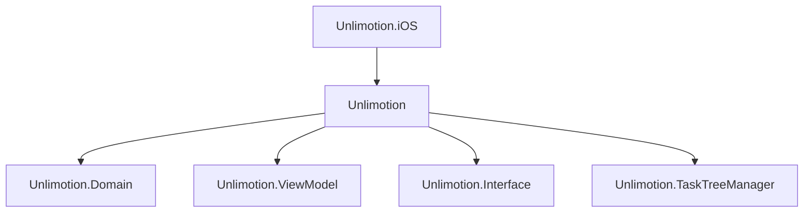

# iOS App Distribution

<cite>
**Referenced Files in This Document**   
- [Unlimotion.iOS.csproj](file://src/Unlimotion.iOS/Unlimotion.iOS.csproj)
- [Info.plist](file://src/Unlimotion.iOS/Info.plist)
- [Entitlements.plist](file://src/Unlimotion.iOS/Entitlements.plist)
- [AppDelegate.cs](file://src/Unlimotion.iOS/AppDelegate.cs)
- [Main.cs](file://src/Unlimotion.iOS/Main.cs)
- [Unlimotion.csproj](file://src/Unlimotion/Unlimotion.csproj)
- [AuthService.cs](file://src/Unlimotion.Server.ServiceInterface/AuthService.cs)
- [AppHost.cs](file://src/Unlimotion.Server/AppHost.cs)
</cite>

## Table of Contents
1. [Introduction](#introduction)
2. [Project Structure and Configuration](#project-structure-and-configuration)
3. [iOS Build Process](#ios-build-process)
4. [App Configuration and Metadata](#app-configuration-and-metadata)
5. [Code Signing and Provisioning](#code-signing-and-provisioning)
6. [Authentication and Secure Communication](#authentication-and-secure-communication)
7. [App Store Submission Process](#app-store-submission-process)
8. [TestFlight Beta Distribution](#testflight-beta-distribution)
9. [Troubleshooting Common Issues](#troubleshooting-common-issues)
10. [Conclusion](#conclusion)

## Introduction
This document provides comprehensive guidance for distributing the Unlimotion iOS application through the Apple App Store. It covers the complete process from building the application using the .NET MAUI framework to submitting the app through App Store Connect. The documentation details configuration requirements, code signing procedures, secure communication implementation, and compliance considerations necessary for successful App Store approval.

## Project Structure and Configuration

The Unlimotion iOS application is structured as a .NET MAUI project that leverages Avalonia UI framework for cross-platform development. The iOS-specific project is contained within the `Unlimotion.iOS` directory and references the core `Unlimotion` project.



**Diagram sources**
- [Unlimotion.iOS.csproj](file://src/Unlimotion.iOS/Unlimotion.iOS.csproj)
- [Unlimotion.csproj](file://src/Unlimotion/Unlimotion.csproj)

**Section sources**
- [Unlimotion.iOS.csproj](file://src/Unlimotion.iOS/Unlimotion.iOS.csproj)
- [Unlimotion.csproj](file://src/Unlimotion/Unlimotion.csproj)

## iOS Build Process

The iOS application is built using the .NET SDK with the target framework set to `net9.0-ios`. The build process compiles the application for iOS devices with a minimum supported OS version of 13.0.

The build configuration is defined in the `Unlimotion.iOS.csproj` file, which specifies the output type as an executable and includes the necessary Avalonia iOS package reference. The project references the core Unlimotion project, enabling shared business logic and UI components across platforms.

To build the application for release, use the following command:

```bash
dotnet build src/Unlimotion.iOS/Unlimotion.iOS.csproj -c Release -f net9.0-ios
```

This generates an iOS application package suitable for distribution through the Apple App Store.

**Section sources**
- [Unlimotion.iOS.csproj](file://src/Unlimotion.iOS/Unlimotion.iOS.csproj)

## App Configuration and Metadata

Application metadata is configured in the `Info.plist` file, which contains essential information required by iOS. The current configuration includes:

- **Bundle Identifier**: companyName.Unlimotion (should be updated with a valid Apple Developer account identifier)
- **Display Name**: Unlimotion
- **Version**: 1.0 (CFBundleShortVersionString)
- **Build Number**: 1.0 (CFBundleVersion)
- **Minimum OS Version**: 13.0
- **Supported Interface Orientations**: Portrait and Landscape for both iPhone and iPad

The application supports all device families (iPhone and iPad) and requires ARMv7 architecture. The launch storyboard is configured to use the "LaunchScreen" storyboard for the initial app loading experience.

To update version and build numbers for App Store submission, modify the `CFBundleShortVersionString` (marketing version) and `CFBundleVersion` (build version) in the `Info.plist` file. These values should follow semantic versioning and increment with each submission.

**Section sources**
- [Info.plist](file://src/Unlimotion.iOS/Info.plist)

## Code Signing and Provisioning

Code signing is essential for iOS app distribution and requires proper configuration of provisioning profiles and code signing identities. The `Entitlements.plist` file is currently empty, indicating that the application does not require special entitlements beyond the default capabilities.

To prepare for App Store distribution:

1. Register an App ID in the Apple Developer Portal with the bundle identifier `companyName.Unlimotion`
2. Create an App Store distribution provisioning profile associated with the App ID
3. Ensure the development team is configured in the project settings
4. Update the bundle identifier to use a unique reverse-domain name under your control

The application does not currently request any special permissions, as evidenced by the absence of usage description keys in the `Info.plist` file. If future versions require access to device features like camera, microphone, or location, the appropriate privacy keys must be added with corresponding descriptions.

For device provisioning during testing, register device UDIDs in the Apple Developer Portal and include them in a development or ad-hoc distribution provisioning profile.

**Section sources**
- [Info.plist](file://src/Unlimotion.iOS/Info.plist)
- [Entitlements.plist](file://src/Unlimotion.iOS/Entitlements.plist)

## Authentication and Secure Communication

The Unlimotion application implements secure authentication using JWT (JSON Web Tokens) with encrypted JWE (JSON Web Encryption) tokens. The authentication flow is managed by the backend server, which generates both access and refresh tokens with configurable expiration periods.

The server-side implementation in `AuthService.cs` creates encrypted JWT tokens using RS512 algorithm with payload encryption. Access tokens have a default expiration of 1 day, while refresh tokens expire after 30 days. The tokens include session information and user agent data for security tracking.

HTTPS enforcement is configured in the `AppHost.cs` file, where the `RequireSecureConnection` setting ensures that secure connections are required in production environments. This setting is automatically disabled in development mode for testing convenience.

The application securely stores authentication tokens on the device, with refresh tokens allowing for seamless re-authentication without requiring users to enter credentials repeatedly. Token validation and refresh logic is implemented to handle expired sessions gracefully.

**Section sources**
- [AuthService.cs](file://src/Unlimotion.Server.ServiceInterface/AuthService.cs)
- [AppHost.cs](file://src/Unlimotion.Server/AppHost.cs)

## App Store Submission Process

To submit the Unlimotion application to the App Store, follow these steps:

1. **Archive the Application**: Build the application in Release configuration for iOS devices using the .NET CLI or Visual Studio.
2. **Generate IPA File**: The build process will produce an IPA (iOS App Store Package) file containing the compiled application.
3. **Submit via App Store Connect**: Use Xcode Organizer or Transporter to upload the IPA file to App Store Connect.

In App Store Connect, configure the following:
- App information (name, subtitle, description, keywords)
- Pricing and availability
- Age rating
- Contact information
- Marketing and privacy URLs
- Screenshots for all supported device sizes

The application must comply with Apple's App Store Review Guidelines, including requirements for user privacy, data security, and functionality. Since the app communicates with a backend server, ensure that the privacy policy adequately describes data collection and usage practices.

For future versions, consider implementing App Tracking Transparency if any third-party analytics or advertising frameworks are integrated. Currently, there is no evidence of tracking capabilities in the codebase.

**Section sources**
- [Unlimotion.iOS.csproj](file://src/Unlimotion.iOS/Unlimotion.iOS.csproj)
- [Info.plist](file://src/Unlimotion.iOS/Info.plist)

## TestFlight Beta Distribution

The TestFlight beta distribution process allows for testing the application with internal and external testers before public release. To configure TestFlight distribution:

1. Upload the archived application to App Store Connect
2. Create a new test group for internal testers (team members with Apple Developer accounts)
3. Optionally create external test groups with up to 100 testers
4. Submit the build for beta app review (required for external testing)
5. Invite testers via email or public link

TestFlight builds expire after 90 days, after which testers must install an updated build. Internal testing builds are available immediately, while external testing requires Apple's beta app review, which typically takes a few days.

Collect feedback from testers through TestFlight's built-in feedback mechanism. Monitor crash reports and usage patterns to identify and fix issues before the public release. Testers can provide feedback directly through the TestFlight app, which helps prioritize bug fixes and improvements.

Ensure that all devices intended for testing are registered in the Apple Developer Portal and included in the appropriate provisioning profile before distributing the build.

**Section sources**
- [Info.plist](file://src/Unlimotion.iOS/Info.plist)

## Troubleshooting Common Issues

Common App Store submission rejections and their solutions:

**1. Metadata Issues**
- Ensure all app information is complete and accurate
- Verify that screenshots match the submitted app version
- Confirm that the app name and subtitle comply with guidelines
- Provide a functional privacy policy URL

**2. Functionality Issues**
- Test the app thoroughly on multiple device types and iOS versions
- Ensure all features work as described in the app metadata
- Verify that the app does not crash during normal usage
- Check for proper handling of network connectivity changes

**3. Technical Issues**
- Confirm that the app builds and runs with the correct provisioning profile
- Verify that the bundle identifier matches the App ID registered in the Developer Portal
- Ensure the app does not include debug symbols or logging in release builds
- Check that the app does not exceed size limits or use excessive battery

**4. Privacy Issues**
- Review all data collection practices and ensure proper disclosure
- Implement appropriate permission requests for any future device feature access
- Ensure secure storage and transmission of user data
- Comply with GDPR, CCPA, and other applicable privacy regulations

For build-related issues, verify that the .NET SDK and iOS development tools are up to date. Clean the build directory and rebuild the application if encountering compilation errors.

**Section sources**
- [Unlimotion.iOS.csproj](file://src/Unlimotion.iOS/Unlimotion.iOS.csproj)
- [Info.plist](file://src/Unlimotion.iOS/Info.plist)

## Conclusion
The Unlimotion iOS application is configured for distribution through the Apple App Store using the .NET MAUI framework with Avalonia UI. The current configuration provides a solid foundation for App Store submission, with secure authentication and responsive UI design. By following the guidelines outlined in this document, developers can successfully build, configure, and submit the application to reach users worldwide through the App Store ecosystem. Regular updates and adherence to Apple's evolving guidelines will ensure continued compliance and user satisfaction.