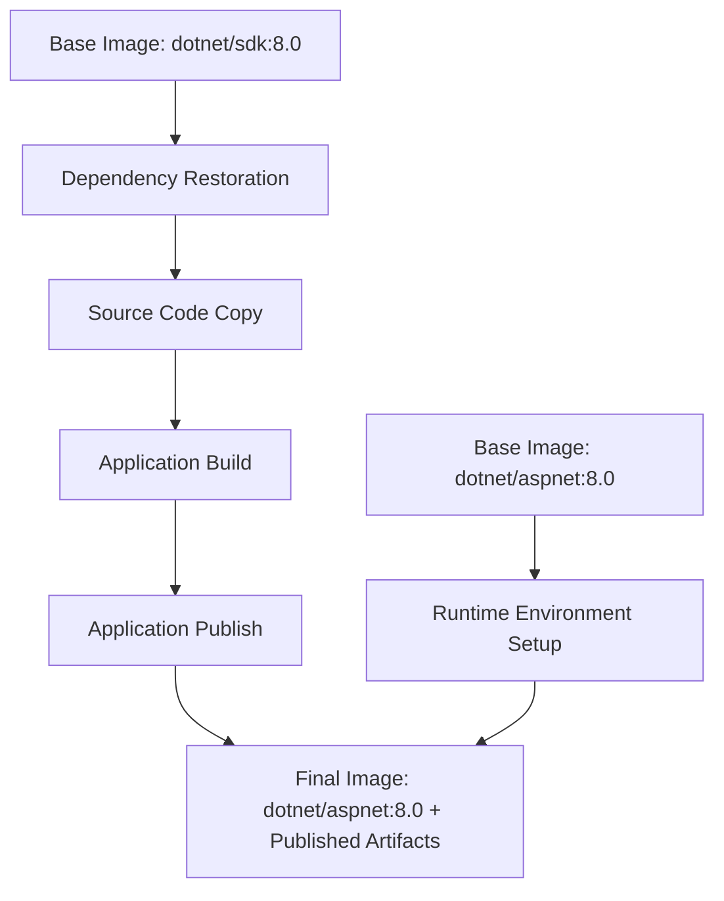
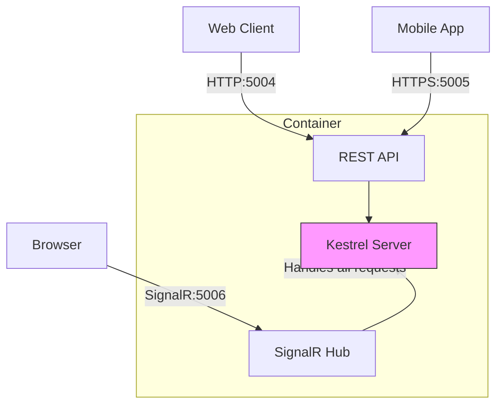
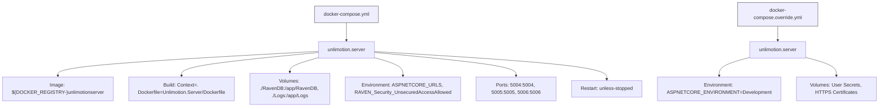

# Docker Deployment

<cite>
**Referenced Files in This Document**   
- [Dockerfile](file://src/Unlimotion.Server/Dockerfile)
- [docker-compose.yml](file://src/docker-compose.yml)
- [docker-compose.override.yml](file://src/docker-compose.override.yml)
- [appsettings.json](file://src/Unlimotion.Server/appsettings.json)
- [Program.cs](file://src/Unlimotion.Server/Program.cs)
- [Startup.cs](file://src/Unlimotion.Server/Startup.cs)
- [.env](file://src/.env)
- [start-server-in-docker.cmd](file://src/start-server-in-docker.cmd)
- [stop-server-in-docker.cmd](file://src/stop-server-in-docker.cmd)
</cite>

## Table of Contents
1. [Introduction](#introduction)
2. [Multi-Stage Docker Build Process](#multi-stage-docker-build-process)
3. [Docker Image Construction and Optimization](#docker-image-construction-and-optimization)
4. [Port Configuration and Kestrel Integration](#port-configuration-and-kestrel-integration)
5. [Building and Running the Docker Image](#building-and-running-the-docker-image)
6. [Container Management and Volume Mounting](#container-management-and-volume-mounting)
7. [docker-compose.yml Orchestration](#docker-composeyml-orchestration)
8. [Environment Variables and Configuration Override](#environment-variables-and-configuration-override)
9. [Best Practices for Production Deployment](#best-practices-for-production-deployment)
10. [Troubleshooting Guide](#troubleshooting-guide)

## Introduction
This document provides comprehensive guidance for deploying the Unlimotion server using Docker. It covers the complete containerization workflow, from multi-stage Dockerfile builds to production-ready deployment patterns. The documentation details how the Unlimotion server is packaged into a lightweight, portable container image using industry-standard practices, with specific attention to the integration of ASP.NET Core, RavenDB, and SignalR components in a containerized environment.

**Section sources**
- [Dockerfile](file://src/Unlimotion.Server/Dockerfile)
- [docker-compose.yml](file://src/docker-compose.yml)

## Multi-Stage Docker Build Process

The Unlimotion server employs a multi-stage Docker build process designed to optimize image size, build efficiency, and security. This approach separates the build environment from the runtime environment, ensuring that only necessary artifacts are included in the final container image.

The process begins with the `dotnet/sdk:8.0` base image, which provides the complete .NET SDK required for compiling and publishing the application. During this stage, all project dependencies are restored, and the solution is built in Release configuration. The build context includes all source files, with specific attention to the Unlimotion.Server and its dependent projects (Unlimotion.Interface, Unlimotion.Server.ServiceInterface, and Unlimotion.Server.ServiceModel).

After successful compilation, the application is published to a dedicated output directory. The final stage transitions to the `dotnet/aspnet:8.0` runtime image, which contains only the .NET runtime components necessary to execute the application. This significantly reduces the attack surface and image size compared to including the full SDK.



**Diagram sources**
- [Dockerfile](file://src/Unlimotion.Server/Dockerfile)

**Section sources**
- [Dockerfile](file://src/Unlimotion.Server/Dockerfile)

## Docker Image Construction and Optimization

The Docker image construction process is optimized for both development efficiency and production performance. The Dockerfile implements several best practices to ensure optimal layer caching and minimal rebuild times.

The build process carefully orders Docker instructions to maximize layer reuse. Dependency restoration occurs before copying the full source code, allowing Docker to cache the restored packages. This means that subsequent builds only need to restore packages when project files (csproj) change, rather than on every build.

The final image is constructed by copying only the published artifacts from the build stage, excluding development tools, source code, and intermediate build outputs. This results in a lean runtime image that contains only the executable application, its dependencies, and the .NET runtime.

The ENTRYPOINT instruction configures the container to execute the Unlimotion.Server.dll using the dotnet runtime, ensuring proper process management and signal handling within the container environment.

**Section sources**
- [Dockerfile](file://src/Unlimotion.Server/Dockerfile)

## Port Configuration and Kestrel Integration

The Unlimotion server exposes three distinct ports to support different communication protocols and services:

- **Port 5004**: HTTP endpoint for standard web traffic
- **Port 5005**: HTTPS endpoint for secure communications  
- **Port 5006**: Dedicated endpoint for SignalR real-time communication

These ports are configured through the ASPNETCORE_URLS environment variable, which instructs the Kestrel web server to listen on multiple endpoints simultaneously. The Kestrel server, embedded within the ASP.NET Core application, binds to these ports and handles incoming requests according to the specified protocols.

The multi-port configuration enables the Unlimotion server to support both traditional HTTP/HTTPS requests and real-time bidirectional communication via SignalR. This architecture allows clients to establish persistent connections for features like chat functionality while maintaining standard RESTful interactions for other operations.

The EXPOSE directives in the Dockerfile document these ports for informational purposes, but actual port mapping is controlled by the docker-compose configuration or command-line parameters when running the container.



**Diagram sources**
- [Dockerfile](file://src/Unlimotion.Server/Dockerfile)
- [Startup.cs](file://src/Unlimotion.Server/Startup.cs)

**Section sources**
- [Dockerfile](file://src/Unlimotion.Server/Dockerfile)
- [appsettings.json](file://src/Unlimotion.Server/appsettings.json)
- [Startup.cs](file://src/Unlimotion.Server/Startup.cs)

## Building and Running the Docker Image

To build the Unlimotion server Docker image, execute the following command from the repository root directory:

```bash
docker build -f src/Unlimotion.Server/Dockerfile -t unlimotionserver .
```

This command builds the image using the specified Dockerfile path and tags it as "unlimotionserver". The build context is set to the current directory, ensuring all necessary files are available during the build process.

To run the container with proper port mappings and environment configuration:

```bash
docker run -d \
  --name unlimotion \
  -p 5004:5004 \
  -p 5005:5005 \
  -p 5006:5006 \
  -e ASPNETCORE_URLS="https://+:5005;http://+:5004" \
  -v ./RavenDB:/app/RavenDB \
  -v ./Logs:/app/Logs \
  unlimotionserver
```

The container can also be managed using the provided batch scripts:
- `start-server-in-docker.cmd` - Starts the service via docker-compose
- `stop-server-in-docker.cmd` - Stops and removes the container

**Section sources**
- [Dockerfile](file://src/Unlimotion.Server/Dockerfile)
- [start-server-in-docker.cmd](file://src/start-server-in-docker.cmd)
- [stop-server-in-docker.cmd](file://src/stop-server-in-docker.cmd)

## Container Management and Volume Mounting

Effective container management requires proper configuration of persistent storage and health monitoring. The Unlimotion server uses volume mounting to ensure data persistence across container restarts and updates.

Two critical volumes are mounted:
- **RavenDB storage**: Maps the local ./RavenDB directory to /app/RavenDB in the container, preserving database files
- **Log storage**: Maps the local ./Logs directory to /app/Logs in the container, maintaining log files

These volumes prevent data loss when containers are recreated and allow for easy backup and migration of application data.

For production deployments, consider implementing health checks to monitor container status:

```bash
docker run -d \
  --name unlimotion \
  --health-cmd="curl -f http://localhost:5004/health || exit 1" \
  --health-interval=30s \
  --health-timeout=10s \
  --health-retries=3 \
  unlimotionserver
```

Additional management commands:
```bash
# View container logs
docker logs unlimotion

# Monitor resource usage
docker stats unlimotion

# Execute commands in running container
docker exec -it unlimotion sh
```

**Section sources**
- [docker-compose.yml](file://src/docker-compose.yml)
- [appsettings.json](file://src/Unlimotion.Server/appsettings.json)

## docker-compose.yml Orchestration

The docker-compose.yml file orchestrates the Unlimotion server deployment, defining service configuration, network settings, and volume mappings. The compose file uses variable substitution for flexible image naming through the DOCKER_REGISTRY environment variable.

The service configuration includes:
- **Image naming**: '${DOCKER_REGISTRY-}unlimotionserver' allows for private registry specification
- **Build context**: Points to the repository root with explicit Dockerfile path
- **Volume mounts**: Persistent storage for RavenDB data and application logs
- **Environment variables**: Configuration of ASP.NET Core URLs and RavenDB security settings
- **Port mappings**: Exposure of HTTP, HTTPS, and SignalR endpoints
- **Restart policy**: 'unless-stopped' ensures service resilience

The docker-compose.override.yml file extends the base configuration for development environments, adding mounts for user secrets and HTTPS certificates while maintaining the same port mappings.



**Diagram sources**
- [docker-compose.yml](file://src/docker-compose.yml)
- [docker-compose.override.yml](file://src/docker-compose.override.yml)

**Section sources**
- [docker-compose.yml](file://src/docker-compose.yml)
- [docker-compose.override.yml](file://src/docker-compose.override.yml)

## Environment Variables and Configuration Override

The Unlimotion server employs a hierarchical configuration system where environment variables take precedence over settings in appsettings.json files. This pattern enables flexible configuration across different deployment environments without modifying configuration files.

The .env file in the repository root sets the COMPOSE_PROJECT_NAME to "unlimotion", which docker-compose uses to namespace containers, networks, and volumes. This prevents naming conflicts when multiple services are running on the same host.

Environment variables override specific settings in appsettings.json:
- **ASPNETCORE_URLS**: Overrides the Kestrel server endpoints defined in configuration
- **RAVEN_Security_UnsecuredAccessAllowed**: Configures RavenDB security settings, set to "PublicNetwork" for containerized operation
- **ASPNETCORE_ENVIRONMENT**: Controls the active configuration profile (Development, Production, etc.)

When the application starts, the configuration system merges settings from multiple sources in order of precedence:
1. Command-line arguments
2. Environment variables
3. appsettings.json and environment-specific appsettings files
4. Default values in code

This allows operators to customize behavior without modifying the container image, supporting the twelve-factor app methodology.

**Section sources**
- [.env](file://src/.env)
- [appsettings.json](file://src/Unlimotion.Server/appsettings.json)
- [docker-compose.yml](file://src/docker-compose.yml)

## Best Practices for Production Deployment

For production deployments of the Unlimotion server, adhere to the following best practices to ensure security, reliability, and maintainability:

**Image Tagging Strategy**
- Use semantic versioning for image tags (e.g., v1.2.0, latest)
- Avoid using only 'latest' tag in production
- Implement automated tagging in CI/CD pipelines

**Security Hardening**
- Run containers with non-root user where possible
- Minimize installed packages in the final image
- Regularly update base images to incorporate security patches
- Use private registries with authentication for production images

**Performance Optimization**
- Configure appropriate resource limits (CPU, memory)
- Implement health checks for container orchestration
- Use read-only filesystems where possible
- Optimize layer caching in Docker builds

**Monitoring and Logging**
- Centralize log collection from containerized applications
- Implement structured logging with Serilog
- Monitor container health and resource utilization
- Set up alerts for critical failures

**Deployment Patterns**
- Use rolling updates to minimize downtime
- Implement blue-green deployment strategies
- Maintain backup and restore procedures for RavenDB data
- Test disaster recovery scenarios regularly

**Section sources**
- [Dockerfile](file://src/Unlimotion.Server/Dockerfile)
- [appsettings.json](file://src/Unlimotion.Server/appsettings.json)
- [docker-compose.yml](file://src/docker-compose.yml)

## Troubleshooting Guide

When encountering issues with the Unlimotion server in Docker, follow this systematic troubleshooting approach:

**Container Fails to Start**
- Check Docker build output for compilation errors
- Verify sufficient disk space and memory
- Ensure port conflicts are resolved (5004, 5005, 5006)
- Validate Dockerfile syntax and paths

**Database Connection Issues**
- Verify RavenDB volume mount permissions
- Check that RavenDBLicense.json is accessible
- Ensure data directory has proper write permissions
- Validate ServerOptions in appsettings.json

**Configuration Problems**
- Confirm environment variables are properly set
- Check for typos in variable names
- Verify .env file is being loaded by docker-compose
- Test configuration overrides with docker run -e

**SignalR Connectivity Issues**
- Ensure port 5006 is properly exposed and mapped
- Verify firewall rules allow WebSocket connections
- Check browser console for JavaScript errors
- Validate CORS configuration if accessing from different domains

Use the following diagnostic commands:
```bash
# Check container logs
docker logs unlimotion

# Inspect container configuration
docker inspect unlimotion

# Monitor network activity
docker exec unlimotion netstat -tlnp

# Check disk usage
docker system df
```

**Section sources**
- [docker-compose.yml](file://src/docker-compose.yml)
- [appsettings.json](file://src/Unlimotion.Server/appsettings.json)
- [StartupExtensions.cs](file://src/Unlimotion.Server/StartupExtensions.cs)