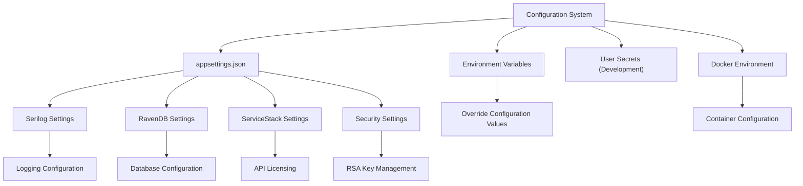
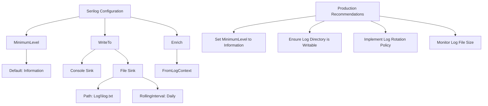
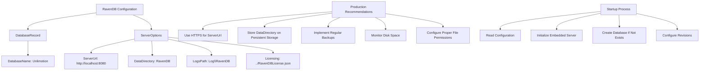
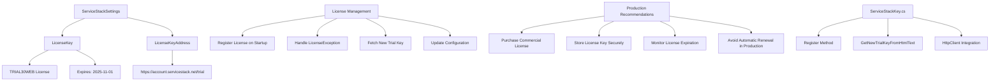
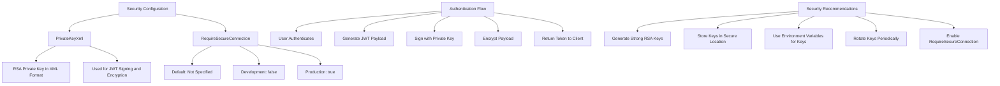

# Production Configuration

<cite>
**Referenced Files in This Document**   
- [appsettings.json](file://src/Unlimotion.Server/appsettings.json)
- [appsettings.Development.json](file://src/Unlimotion.Server/appsettings.Development.json)
- [AppSettings.cs](file://src/Unlimotion.Server/AppSettings.cs)
- [ServiceStackSettings.cs](file://src/Unlimotion.Server/ServiceStackSettings.cs)
- [ServiceStackKey.cs](file://src/Unlimotion.Server/ServiceStackKey.cs)
- [Startup.cs](file://src/Unlimotion.Server/Startup.cs)
- [AppHost.cs](file://src/Unlimotion.Server/AppHost.cs)
- [Program.cs](file://src/Unlimotion.Server/Program.cs)
- [StartupExtensions.cs](file://src/Unlimotion.Server/StartupExtensions.cs)
- [Dockerfile](file://src/Unlimotion.Server/Dockerfile)
- [docker-compose.yml](file://src/docker-compose.yml)
- [RavenDBLicense.json](file://src/Unlimotion.Server/RavenDBLicense.json)
</cite>

## Table of Contents
1. [Introduction](#introduction)
2. [Configuration Structure](#configuration-structure)
3. [Serilog Configuration](#serilog-configuration)
4. [RavenDB Configuration](#ravendb-configuration)
5. [ServiceStack Settings](#servicestack-settings)
6. [Security Configuration](#security-configuration)
7. [Environment Variable Overrides](#environment-variable-overrides)
8. [Production Deployment](#production-deployment)
9. [Security Hardening](#security-hardening)
10. [Configuration Examples](#configuration-examples)

## Introduction
This document provides comprehensive guidance for configuring the Unlimotion server in production environments. The configuration system is based on ASP.NET Core's configuration framework with JSON configuration files as the primary source. The server uses several key components that require specific configuration for production deployment: Serilog for structured logging, RavenDB for document database storage, ServiceStack for API services and authentication, and RSA-based security for token management. This documentation covers all aspects of production configuration, including environment-specific settings, security considerations, and deployment strategies.

**Section sources**
- [appsettings.json](file://src/Unlimotion.Server/appsettings.json)
- [Program.cs](file://src/Unlimotion.Server/Program.cs)
- [Startup.cs](file://src/Unlimotion.Server/Startup.cs)

## Configuration Structure
The Unlimotion server uses a hierarchical configuration system with `appsettings.json` as the primary configuration file. The configuration is strongly typed and injected into services through dependency injection. The main configuration sections include Serilog for logging, RavenDb for database connectivity, ServiceStackSettings for API licensing, and Security for RSA key management. The configuration system supports environment-specific overrides through ASP.NET Core's environment model, allowing different settings for development, staging, and production environments.

**Diagram sources**
- [appsettings.json](file://src/Unlimotion.Server/appsettings.json)
- [Program.cs](file://src/Unlimotion.Server/Program.cs)
- [AppSettings.cs](file://src/Unlimotion.Server/AppSettings.cs)

**Section sources**
- [appsettings.json](file://src/Unlimotion.Server/appsettings.json)
- [AppSettings.cs](file://src/Unlimotion.Server/AppSettings.cs)
- [Program.cs](file://src/Unlimotion.Server/Program.cs)

## Serilog Configuration
The Serilog configuration section in `appsettings.json` defines structured logging settings for the Unlimotion server. The configuration specifies the minimum logging level, output sinks, and enrichment settings. In production, the logging level should be set to "Information" or higher to avoid excessive log volume. The configuration includes both console and file output sinks, with the file sink configured to create rolling log files in the "Log" directory. The rolling interval is set to 4 (daily), which creates a new log file each day.

**Diagram sources**
- [appsettings.json](file://src/Unlimotion.Server/appsettings.json)
- [Program.cs](file://src/Unlimotion.Server/Program.cs)

**Section sources**
- [appsettings.json](file://src/Unlimotion.Server/appsettings.json)
- [Program.cs](file://src/Unlimotion.Server/Program.cs)

## RavenDB Configuration
The RavenDB configuration section defines settings for the embedded RavenDB document database used by Unlimotion. The configuration includes the database name, server URL, data directory, and logs path. In production environments, it's critical to ensure the data directory is on a reliable storage system with regular backups. The server URL should be configured to use HTTPS in production, and the data directory should be outside the application directory to prevent data loss during application updates. The configuration also includes licensing settings that point to the RavenDBLicense.json file.

**Diagram sources**
- [appsettings.json](file://src/Unlimotion.Server/appsettings.json)
- [StartupExtensions.cs](file://src/Unlimotion.Server/StartupExtensions.cs)
- [RavenDBLicense.json](file://src/Unlimotion.Server/RavenDBLicense.json)

**Section sources**
- [appsettings.json](file://src/Unlimotion.Server/appsettings.json)
- [StartupExtensions.cs](file://src/Unlimotion.Server/StartupExtensions.cs)
- [RavenDBLicense.json](file://src/Unlimotion.Server/RavenDBLicense.json)

## ServiceStack Settings
The ServiceStackSettings section contains the license key and license key address for the ServiceStack framework used by Unlimotion. ServiceStack requires a valid license for production use beyond the trial period. The configuration includes a trial license key that expires on November 1, 2025. For production environments, a valid commercial license should replace the trial key. The system includes automatic license renewal functionality that fetches a new trial key from the ServiceStack website when the current key expires, but this should not be relied upon in production.

**Diagram sources**
- [appsettings.json](file://src/Unlimotion.Server/appsettings.json)
- [ServiceStackSettings.cs](file://src/Unlimotion.Server/ServiceStackSettings.cs)
- [ServiceStackKey.cs](file://src/Unlimotion.Server/ServiceStackKey.cs)

**Section sources**
- [appsettings.json](file://src/Unlimotion.Server/appsettings.json)
- [ServiceStackSettings.cs](file://src/Unlimotion.Server/ServiceStackSettings.cs)
- [ServiceStackKey.cs](file://src/Unlimotion.Server/ServiceStackKey.cs)

## Security Configuration
The Security section of the configuration contains the RSA private key in XML format used for JWT token signing and encryption. The private key is stored directly in the appsettings.json file, which is not recommended for production environments. The RSA key is used by the JwtAuthProvider to sign authentication tokens and encrypt payloads. The configuration also includes the RequireSecureConnection setting, which controls whether HTTPS is required for authentication (disabled in development).

**Diagram sources**
- [appsettings.json](file://src/Unlimotion.Server/appsettings.json)
- [AppHost.cs](file://src/Unlimotion.Server/AppHost.cs)
- [ServiceStackKey.cs](file://src/Unlimotion.Server/ServiceStackKey.cs)

**Section sources**
- [appsettings.json](file://src/Unlimotion.Server/appsettings.json)
- [AppHost.cs](file://src/Unlimotion.Server/AppHost.cs)

## Environment Variable Overrides
The Unlimotion server supports configuration value overrides through environment variables, which is essential for containerized deployments. Environment variables can override any configuration value using the delimiter syntax (e.g., "Serilog__MinimumLevel__Default" to override the default minimum level). This feature enables environment-specific configuration without modifying configuration files. In Docker deployments, environment variables are used to set ASP.NET Core URLs and RavenDB security settings. The configuration system processes environment variables after JSON files, allowing them to override default settings.

```mermaid
flowchart TD
A["Configuration Hierarchy"] --> B["appsettings.json"]
A --> C["appsettings.Environment.json"]
A --> D["Environment Variables"]
A --> E["Command Line Arguments"]
F["Environment Variable Format"] --> G["Prefix__Section__Key"]
F --> H["Example: Serilog__MinimumLevel__Default"]
F --> I["Example: RavenDb__ServerOptions__ServerUrl"]
J["Docker Environment"] --> K["ASPNETCORE_URLS"]
J --> L["RAVEN_Security_UnsecuredAccessAllowed"]
J --> M["ASPNETCORE_ENVIRONMENT"]
N["Best Practices"] --> O["Use Environment Variables for Secrets"]
N --> P["Avoid Hardcoding Sensitive Values"]
N --> Q["Use Docker Secrets for Sensitive Data"]
N --> R["Document Required Environment Variables"]
```

**Diagram sources**
- [docker-compose.yml](file://src/docker-compose.yml)
- [Dockerfile](file://src/Unlimotion.Server/Dockerfile)
- [Program.cs](file://src/Unlimotion.Server/Program.cs)

**Section sources**
- [docker-compose.yml](file://src/docker-compose.yml)
- [Dockerfile](file://src/Unlimotion.Server/Dockerfile)
- [Program.cs](file://src/Unlimotion.Server/Program.cs)

## Production Deployment
The Unlimotion server is designed for containerized deployment using Docker and docker-compose. The production deployment configuration includes volume mappings for persistent data storage, environment variable configuration, and network port exposure. The docker-compose.yml file defines the service configuration, including volume mounts for the RavenDB data directory and logs, environment variables for ASP.NET Core and RavenDB settings, and port mappings for HTTP and HTTPS access. The Dockerfile specifies the multi-stage build process and runtime configuration.

```mermaid
flowchart TD
A["Docker Deployment"] --> B["Base Image: dotnet/aspnet:8.0"]
A --> C["Build Stage"]
A --> D["Publish Stage"]
A --> E["Final Stage"]
B --> F["Exposes Ports 5004, 5005, 5006"]
C --> G["Restore NuGet Packages"]
C --> H["Build Project"]
D --> I["Publish Application"]
E --> J["Copy Published Artifacts"]
E --> K["Set Entry Point"]
L["docker-compose.yml"] --> M["Service: unlimotion.server"]
L --> N["Image: unlimotionserver"]
L --> O["Volumes: RavenDB, Logs"]
L --> P["Environment Variables"]
L --> Q["Ports: 5004-5006"]
L --> R["Restart: unless-stopped"]
S["Production Considerations"] --> T["Use HTTPS in Production"]
S --> U["Implement Health Checks"]
S --> V["Configure Resource Limits"]
S --> W["Enable Logging to External System"]
S --> X["Implement Monitoring"]
```

**Diagram sources**
- [docker-compose.yml](file://src/docker-compose.yml)
- [Dockerfile](file://src/Unlimotion.Server/Dockerfile)
- [Unlimotion.Server.csproj](file://src/Unlimotion.Server/Unlimotion.Server.csproj)

**Section sources**
- [docker-compose.yml](file://src/docker-compose.yml)
- [Dockerfile](file://src/Unlimotion.Server/Dockerfile)
- [Unlimotion.Server.csproj](file://src/Unlimotion.Server/Unlimotion.Server.csproj)

## Security Hardening
For production environments, several security hardening measures should be implemented beyond the basic configuration. These include disabling debug endpoints, implementing rate limiting, configuring secure HTTP headers, and restricting access to sensitive endpoints. The current configuration already includes HSTS (HTTP Strict Transport Security) for production environments, which enforces HTTPS connections. Additional security measures should be implemented through middleware or reverse proxy configuration.

```mermaid
flowchart TD
A["Security Hardening"] --> B["Disable Debug Endpoints"]
A --> C["Implement Rate Limiting"]
A --> D["Configure Secure Headers"]
A --> E["Enable HTTPS"]
A --> F["Restrict API Access"]
A --> G["Implement Authentication"]
A --> H["Regular Security Updates"]
B --> I["Remove UseDeveloperExceptionPage"]
C --> J["Use Rate Limiting Middleware"]
C --> K["Limit API Requests per Client"]
D --> L["Content Security Policy"]
D --> M["X-Content-Type-Options"]
D --> N["X-Frame-Options"]
D --> O["X-XSS-Protection"]
E --> P["Use SSL/TLS Certificates"]
E --> Q["Redirect HTTP to HTTPS"]
F --> R["Use Authentication Filters"]
F --> S["Validate API Keys"]
T["Current Security Features"] --> U["HSTS Enabled in Production"]
T --> V["CORS Configuration"]
T --> W["JWT Authentication"]
T --> X["Encrypted Tokens"]
Y["Recommended Additions"] --> Z["Rate Limiting"]
Y --> AA["Input Validation"]
Y --> AB["Security Headers"]
Y --> AC["Regular Audits"]
```

**Diagram sources**
- [Startup.cs](file://src/Unlimotion.Server/Startup.cs)
- [AppHost.cs](file://src/Unlimotion.Server/AppHost.cs)
- [appsettings.json](file://src/Unlimotion.Server/appsettings.json)

**Section sources**
- [Startup.cs](file://src/Unlimotion.Server/Startup.cs)
- [AppHost.cs](file://src/Unlimotion.Server/AppHost.cs)

## Configuration Examples
This section provides example configurations for different environments: development, staging, and production. Each environment has specific configuration requirements based on security, logging, and operational considerations. The examples demonstrate how to override settings using environment variables and configuration files to achieve the appropriate configuration for each environment.

```mermaid
flowchart TD
A["Configuration Examples"] --> B["Development"]
A --> C["Staging"]
A --> D["Production"]
B --> E["Logging: Debug"]
B --> F["RequireSecureConnection: false"]
B --> G["Environment: Development"]
B --> H["Local Database"]
C --> I["Logging: Information"]
C --> J["RequireSecureConnection: true"]
C --> K["Environment: Staging"]
C --> L["Test Database"]
C --> M["Limited Access"]
D --> N["Logging: Warning"]
D --> O["RequireSecureConnection: true"]
D --> P["Environment: Production"]
D --> Q["Production Database"]
D --> R["HTTPS Required"]
D --> S["Rate Limiting"]
D --> T["Monitoring Enabled"]
U["Environment Variable Examples"] --> V["ASPNETCORE_ENVIRONMENT=Production"]
U --> W["ASPNETCORE_URLS=https://+:5005;http://+:5004"]
U --> X["RAVEN_Security_UnsecuredAccessAllowed=PublicNetwork"]
U --> Y["Serilog__MinimumLevel__Default=Warning"]
Z["Best Practices"] --> AA["Use Configuration Management"]
Z --> AB["Automate Deployment"]
Z --> AC["Test Configuration Changes"]
Z --> AD["Document Configuration"]
```

**Diagram sources**
- [appsettings.json](file://src/Unlimotion.Server/appsettings.json)
- [appsettings.Development.json](file://src/Unlimotion.Server/appsettings.Development.json)
- [docker-compose.yml](file://src/docker-compose.yml)

**Section sources**
- [appsettings.json](file://src/Unlimotion.Server/appsettings.json)
- [appsettings.Development.json](file://src/Unlimotion.Server/appsettings.Development.json)
- [docker-compose.yml](file://src/docker-compose.yml)