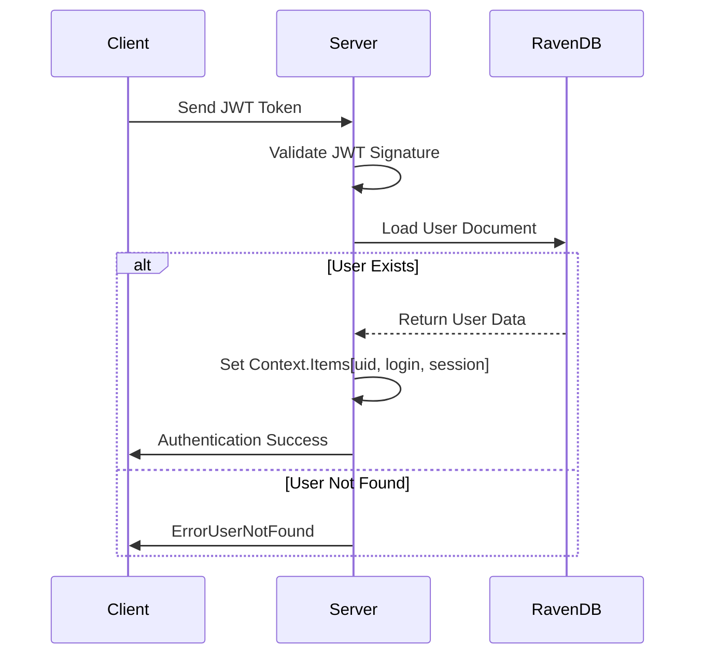
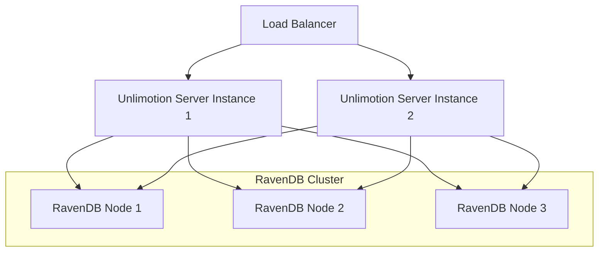
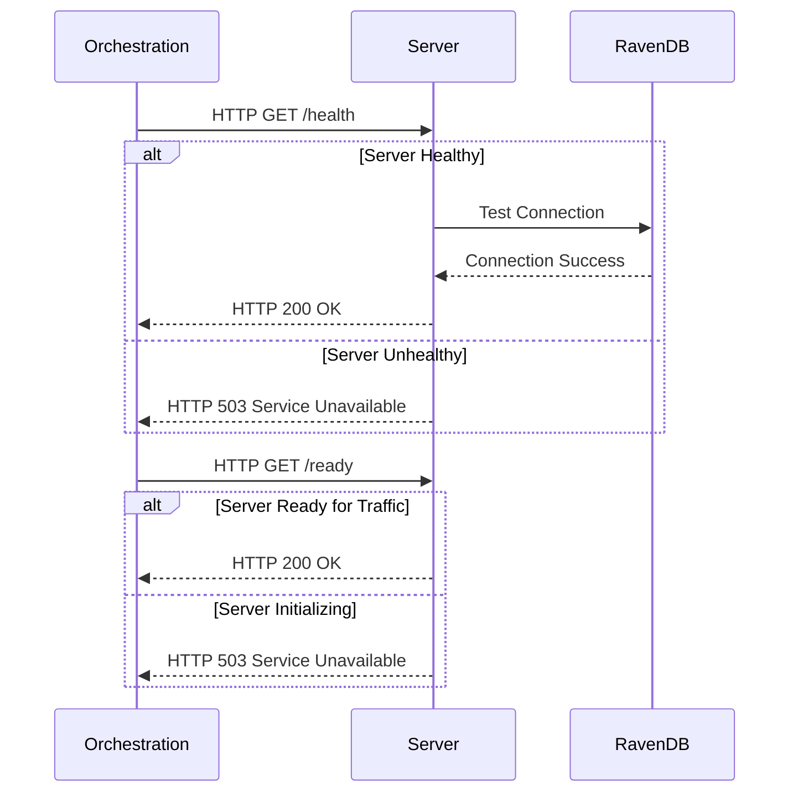
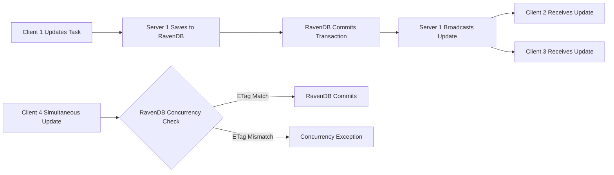
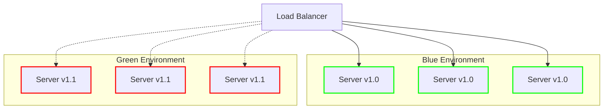

# Scaling and High Availability

<cite>
**Referenced Files in This Document**   
- [Program.cs](file://src/Unlimotion.Server/Program.cs)
- [AppHost.cs](file://src/Unlimotion.Server/AppHost.cs)
- [Startup.cs](file://src/Unlimotion.Server/Startup.cs)
- [appsettings.json](file://src/Unlimotion.Server/appsettings.json)
- [docker-compose.yml](file://src/docker-compose.yml)
- [Dockerfile](file://src/Unlimotion.Server/Dockerfile)
- [ChatHub.cs](file://src/Unlimotion.Server/Hubs/ChatHub.cs)
- [StartupExtensions.cs](file://src/Unlimotion.Server/StartupExtensions.cs)
</cite>

## Table of Contents
1. [Introduction](#introduction)
2. [Stateless Architecture and Session Management](#stateless-architecture-and-session-management)
3. [Horizontal Scaling with Docker and Orchestration](#horizontal-scaling-with-docker-and-orchestration)
4. [SignalR and Sticky Sessions](#signalr-and-sticky-sessions)
5. [RavenDB High Availability](#ravendb-high-availability)
6. [Health Checks and Orchestration Integration](#health-checks-and-orchestration-integration)
7. [Data Consistency in Distributed Deployments](#data-consistency-in-distributed-deployments)
8. [Zero-Downtime Deployment Strategies](#zero-downtime-deployment-strategies)
9. [Monitoring and Alerting Recommendations](#monitoring-and-alerting-recommendations)
10. [Conclusion](#conclusion)

## Introduction
This document provides comprehensive guidance on scaling the Unlimotion server application and configuring high availability setups. The Unlimotion server is designed as a stateless application that leverages RavenDB for persistent storage and session state management. The architecture supports horizontal scaling through containerization technologies like Docker Swarm and Kubernetes, with built-in mechanisms for handling real-time communication via SignalR. This documentation covers the technical implementation details, configuration requirements, and best practices for deploying Unlimotion in production environments with high availability and scalability requirements.

## Stateless Architecture and Session Management
The Unlimotion server application follows a stateless design pattern where server instances do not maintain session state locally. Instead, session information is managed through JWT tokens and persisted in RavenDB. Authentication is handled through JWT tokens with RS512 encryption, where the token payload contains user identification and session information. The server validates these tokens on each request without maintaining server-side session state.

User session data, including login audit information, is stored in RavenDB with each user's session tracked in a dedicated LoginAudit document. This approach enables true stateless operation, as any server instance can validate and process requests as long as it has access to the shared RavenDB instance. The ChatHub implementation stores connection-specific user information in the SignalR Context.Items dictionary during the login process, mapping JWT claims to user identifiers and display names.



**Diagram sources**
- [AppHost.cs](file://src/Unlimotion.Server/AppHost.cs#L42-L67)
- [ChatHub.cs](file://src/Unlimotion.Server/Hubs/ChatHub.cs#L131-L162)

**Section sources**
- [AppHost.cs](file://src/Unlimotion.Server/AppHost.cs#L42-L67)
- [ChatHub.cs](file://src/Unlimotion.Server/Hubs/ChatHub.cs#L131-L162)

## Horizontal Scaling with Docker and Orchestration
The Unlimotion server can be horizontally scaled using Docker-based orchestration platforms such as Docker Swarm or Kubernetes. The provided docker-compose.yml configuration demonstrates a multi-instance deployment setup with shared storage for RavenDB data and logs. Each server instance is configured to expose ports 5004 (HTTP), 5005 (HTTPS), and 5006 (additional service port) for load balancing.

The Dockerfile implements a multi-stage build process using .NET 8.0 base images, optimizing the final container size by separating build and runtime stages. The container configuration exposes the necessary ports and copies the published application artifacts to the final image. Volume mounts are configured to persist RavenDB data and logs outside the container, ensuring data durability across container restarts.

For Kubernetes deployments, the docker-compose configuration can be translated to Kubernetes manifests with appropriate service definitions, deployments, and persistent volume claims. The server instances can be replicated across multiple nodes, with a load balancer distributing traffic to the available instances.

```yaml
version: '3.4'
services:
  unlimotion.server:
    image: '${DOCKER_REGISTRY-}unlimotionserver'
    build:
      context: .
      dockerfile: Unlimotion.Server/Dockerfile
    volumes:
      - './RavenDB:/app/RavenDB'
      - './Logs:/app/Logs'
    environment:
      - 'ASPNETCORE_URLS=https://+:5005;http://+:5004'
      - RAVEN_Security_UnsecuredAccessAllowed=PublicNetwork
    ports:
      - '5004:5004'
      - '5005:5005'
      - '5006:5006'
    restart: unless-stopped
```

**Diagram sources**
- [docker-compose.yml](file://src/docker-compose.yml)
- [Dockerfile](file://src/Unlimotion.Server/Dockerfile)

**Section sources**
- [docker-compose.yml](file://src/docker-compose.yml)
- [Dockerfile](file://src/Unlimotion.Server/Dockerfile)

## SignalR and Sticky Sessions
The Unlimotion server implements real-time communication through SignalR with the ChatHub endpoint. Due to the nature of WebSocket connections and SignalR's requirement for connection affinity, sticky sessions (session persistence) are required when deploying multiple server instances behind a load balancer.

The ChatHub maintains user connection state by adding connections to user-specific groups (e.g., "User_{uid}") upon successful authentication. When a client sends a message to update their display name or save a task, the server broadcasts these updates to all other connections in the user's group except the sender. This pattern requires that subsequent requests from the same client connection are routed to the same server instance throughout the WebSocket session.

The login process establishes this connection affinity by storing user identification in the SignalR Context.Items dictionary and adding the connection to appropriate groups. The OnDisconnectedAsync method handles cleanup by removing the connection from user groups when the connection terminates. Load balancers must be configured to maintain connection affinity for the SignalR endpoint to ensure reliable message delivery.

```mermaid
flowchart TD
A[Client Connects] --> B[Send Login Request]
B --> C{Validate JWT Token}
C --> |Valid| D[Store User ID in Context.Items]
D --> E[Add Connection to User_{uid} Group]
E --> F[Add Connection to Logined Group]
F --> G[Send Login Confirmation]
G --> H[Real-time Communication]
H --> I[Handle Disconnection]
I --> J[Remove from Groups]
J --> K[Connection Closed]
```

**Diagram sources**
- [ChatHub.cs](file://src/Unlimotion.Server/Hubs/ChatHub.cs#L131-L162)
- [ChatHub.cs](file://src/Unlimotion.Server/Hubs/ChatHub.cs#L191-L220)

**Section sources**
- [ChatHub.cs](file://src/Unlimotion.Server/Hubs/ChatHub.cs#L131-L162)
- [ChatHub.cs](file://src/Unlimotion.Server/Hubs/ChatHub.cs#L191-L220)

## RavenDB High Availability
The Unlimotion server uses RavenDB as its primary data store, with configuration options for high availability deployments. The current implementation uses RavenDB in embedded mode with data persistence to a shared volume. For production high availability, RavenDB clustering should be implemented with multiple nodes in a database group.

The server configuration in appsettings.json specifies the RavenDB server URL, database name, and data directory paths. The StartupExtensions.cs file contains initialization logic that starts the embedded RavenDB server and creates the database if it doesn't exist. For high availability, this embedded configuration should be replaced with a connection to an external RavenDB cluster.

RavenDB clustering provides automatic failover, load balancing across nodes, and data replication. A minimum of three nodes is recommended for a production cluster to ensure fault tolerance. The server configuration would need to be updated to point to the RavenDB cluster endpoints rather than a single server URL. RavenDB's built-in replication features ensure data consistency across cluster nodes with configurable replication strategies.

The current implementation also configures document revisions with a minimum retention period of 7 days, providing a built-in audit trail and recovery mechanism for document changes. This feature should be maintained in clustered deployments to ensure data integrity and recovery capabilities.



**Diagram sources**
- [appsettings.json](file://src/Unlimotion.Server/appsettings.json)
- [StartupExtensions.cs](file://src/Unlimotion.Server/StartupExtensions.cs#L0-L33)

**Section sources**
- [appsettings.json](file://src/Unlimotion.Server/appsettings.json)
- [StartupExtensions.cs](file://src/Unlimotion.Server/StartupExtensions.cs#L0-L33)

## Health Checks and Orchestration Integration
The Unlimotion server implementation does not include explicit health check endpoints, but the architecture provides several indicators that can be used for health monitoring and orchestration integration. The server exposes standard HTTP/HTTPS endpoints that can be used for liveness and readiness probes.

For Docker Swarm and Kubernetes orchestration, the container's health can be determined by checking the availability of the server on ports 5004 and 5005. The server logs provide detailed information about startup progress, RavenDB initialization, and runtime operations, which can be monitored for health assessment.

The Program.cs file contains structured logging that records the server startup sequence, including building the web host, starting RavenDB, and running the host. These log entries can be used to determine the server's initialization status. The Serilog configuration in appsettings.json directs logs to both console and file outputs, enabling comprehensive monitoring.

For production deployments, additional health check endpoints should be implemented to provide detailed system status, including database connectivity, storage availability, and service dependencies. These endpoints would return HTTP 200 for healthy instances and appropriate error codes for unhealthy states, allowing orchestration platforms to make informed decisions about traffic routing and instance replacement.



**Section sources**
- [Program.cs](file://src/Unlimotion.Server/Program.cs#L0-L48)
- [appsettings.json](file://src/Unlimotion.Server/appsettings.json)

## Data Consistency in Distributed Deployments
In distributed deployments with multiple Unlimotion server instances, data consistency is maintained through RavenDB's ACID-compliant transactions and document locking mechanisms. All data modifications go through the shared RavenDB instance, ensuring a single source of truth for all server instances.

The server implementation uses RavenDB's async session pattern for database operations, with explicit SaveChangesAsync calls to commit transactions. This approach ensures that changes are properly persisted and visible to other instances. The ChatHub implementation demonstrates proper async/await patterns for database operations, preventing race conditions during concurrent access.

For scenarios involving concurrent modifications to the same task by multiple users, the application relies on RavenDB's optimistic concurrency control. When a document is loaded, RavenDB tracks its ETag, and subsequent save operations will fail if the document has been modified by another process. The application should implement retry logic or conflict resolution strategies to handle these scenarios gracefully.

The use of SignalR for real-time updates helps maintain consistency across clients by broadcasting changes immediately after they are committed to the database. When a task is saved or updated, the server notifies all other connected clients in the user's group, ensuring that all clients have the most current data.



**Section sources**
- [ChatHub.cs](file://src/Unlimotion.Server/Hubs/ChatHub.cs#L42-L130)
- [StartupExtensions.cs](file://src/Unlimotion.Server/StartupExtensions.cs#L74-L104)

## Zero-Downtime Deployment Strategies
Zero-downtime deployments for the Unlimotion server can be achieved through blue-green deployment or rolling update strategies using container orchestration platforms. The stateless nature of the application and shared RavenDB storage enable seamless instance replacement without service interruption.

For blue-green deployments, two identical environments (blue and green) are maintained. Traffic is routed to the active environment while the inactive environment is updated. After validation, traffic is switched to the updated environment using a load balancer or API gateway. This approach provides a quick rollback capability by simply switching traffic back to the previous environment.

Rolling updates can be implemented by gradually replacing server instances with new versions. The orchestration platform removes instances from the load balancer, updates them, performs health checks, and adds them back to the pool. This process continues until all instances are updated. The restart policy in the docker-compose configuration (restart: unless-stopped) ensures that instances are automatically recovered in case of failures.

Database schema changes require special consideration for zero-downtime deployments. RavenDB's schema-less design simplifies this process, as new fields can be added without database migrations. For structural changes, a compatibility layer should be maintained temporarily to support both old and new data formats during the transition period.



**Section sources**
- [docker-compose.yml](file://src/docker-compose.yml)
- [Dockerfile](file://src/Unlimotion.Server/Dockerfile)

## Monitoring and Alerting Recommendations
For production clusters, comprehensive monitoring and alerting should be implemented to ensure system reliability and performance. Key metrics should be collected at multiple levels: infrastructure, container, application, and database.

Infrastructure monitoring should track CPU, memory, disk I/O, and network utilization for all nodes hosting Unlimotion server instances and RavenDB. Container-level metrics should include instance count, restart frequency, and resource consumption per container.

Application-level monitoring should focus on request rates, response times, error rates (particularly 4xx and 5xx HTTP status codes), and SignalR connection counts. The structured logs generated by Serilog should be collected and analyzed for error patterns, authentication failures, and performance bottlenecks.

Database monitoring for RavenDB should include query performance, indexing times, storage utilization, and replication lag (in clustered configurations). Alerting thresholds should be established for critical metrics such as high error rates, low available disk space, or prolonged database query times.

Distributed tracing can be implemented to track requests across the system, particularly for complex operations involving multiple service calls. This enables identification of performance bottlenecks and failure points in the request processing pipeline.

Alerting should be configured for immediate notification of critical issues such as service outages, database connectivity problems, or security incidents. Warning-level alerts can be set for conditions that may lead to problems if not addressed, such as increasing error rates or resource utilization approaching capacity limits.

**Section sources**
- [appsettings.json](file://src/Unlimotion.Server/appsettings.json)
- [Program.cs](file://src/Unlimotion.Server/Program.cs#L0-L48)

## Conclusion
The Unlimotion server is designed with scalability and high availability in mind, leveraging a stateless architecture with externalized session management through RavenDB. The application can be effectively scaled horizontally using container orchestration platforms like Docker Swarm or Kubernetes, with proper configuration for sticky sessions when using SignalR for real-time communication.

For production deployments, RavenDB should be configured in a clustered mode to ensure high availability and data durability. The current embedded configuration is suitable for development and small-scale deployments but should be replaced with a dedicated RavenDB cluster for production use.

The combination of stateless server instances, shared database storage, and containerization enables flexible deployment strategies including zero-downtime updates and robust disaster recovery. With proper monitoring and alerting in place, the Unlimotion server can provide reliable service even under high load conditions.

Future enhancements could include explicit health check endpoints, enhanced metrics collection, and automated scaling based on load patterns. The existing architecture provides a solid foundation for these improvements while maintaining the core principles of scalability and reliability.