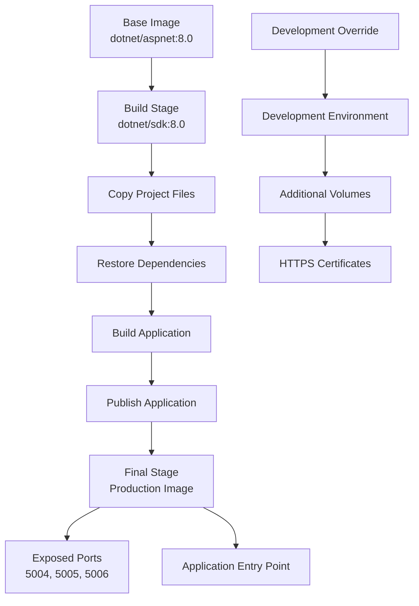
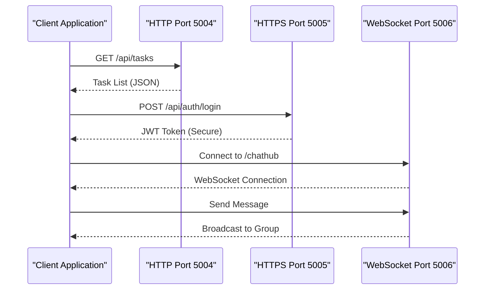
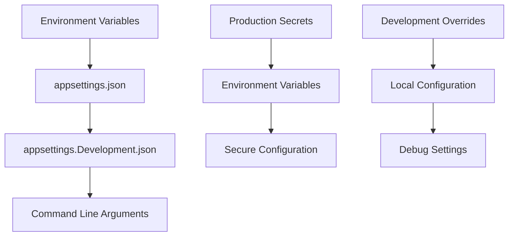
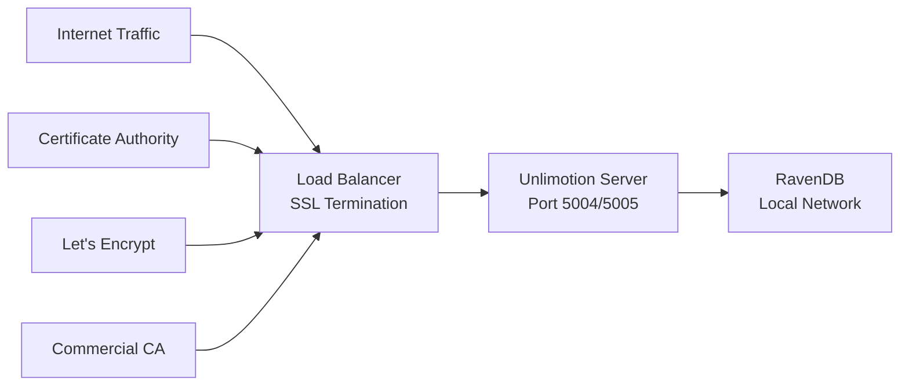
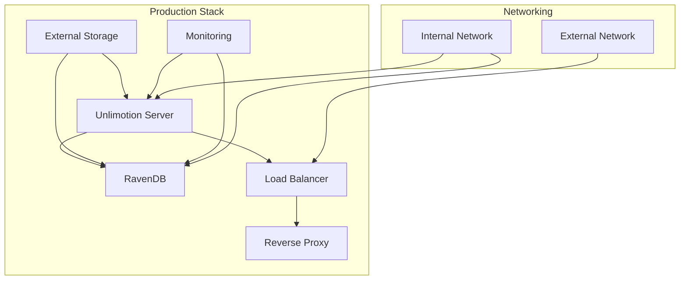
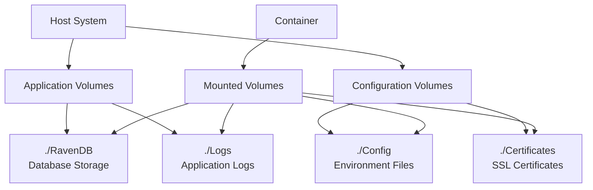
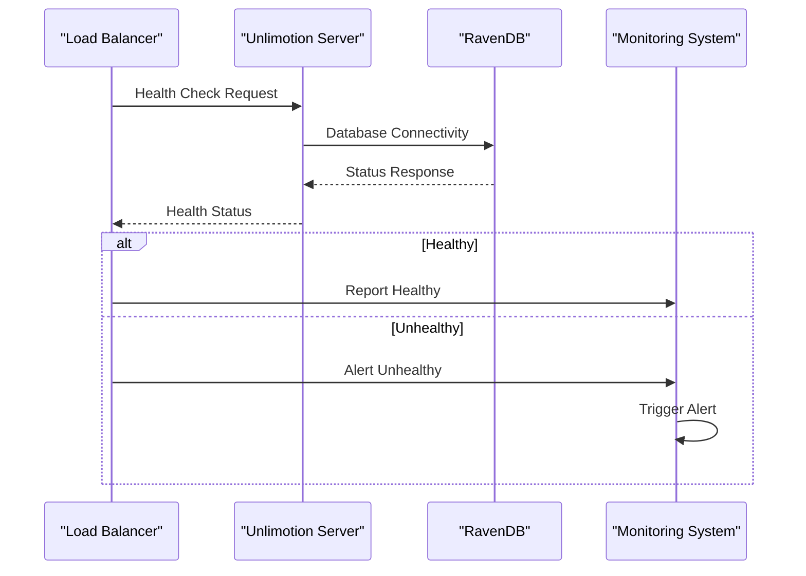
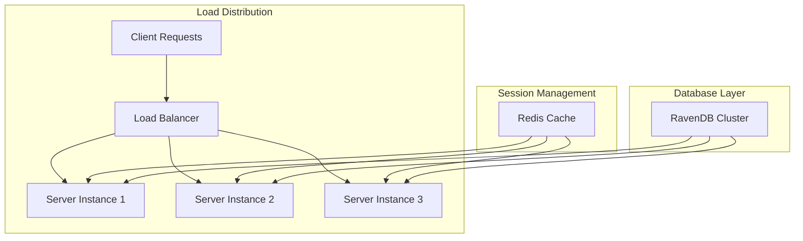
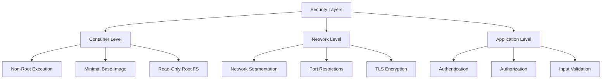

# Server Deployment

<cite>
**Referenced Files in This Document**
- [Dockerfile](file://src/Unlimotion.Server/Dockerfile)
- [docker-compose.yml](file://src/docker-compose.yml)
- [docker-compose.override.yml](file://src/docker-compose.override.yml)
- [.env](file://src/.env)
- [appsettings.json](file://src/Unlimotion.Server/appsettings.json)
- [appsettings.Development.json](file://src/Unlimotion.Server/appsettings.Development.json)
- [Program.cs](file://src/Unlimotion.Server/Program.cs)
- [Startup.cs](file://src/Unlimotion.Server/Startup.cs)
- [RavenDBLicense.json](file://src/Unlimotion.Server/RavenDBLicense.json)
- [start-server-in-docker.cmd](file://src/start-server-in-docker.cmd)
- [stop-server-in-docker.cmd](file://src/stop-server-in-docker.cmd)
- [publish.bat](file://src/Unlimotion.Server/publish.bat)
</cite>

## Table of Contents
1. [Introduction](#introduction)
2. [Docker Build Architecture](#docker-build-architecture)
3. [Port Configuration](#port-configuration)
4. [Environment Variables and Configuration](#environment-variables-and-configuration)
5. [Production Deployment Setup](#production-deployment-setup)
6. [Container Orchestration](#container-orchestration)
7. [Volume Management](#volume-management)
8. [Health Checks and Monitoring](#health-checks-and-monitoring)
9. [Scaling and Load Balancing](#scaling-and-load-balancing)
10. [Security Hardening](#security-hardening)
11. [Troubleshooting Guide](#troubleshooting-guide)
12. [Best Practices](#best-practices)

## Introduction

The Unlimotion server component is a .NET 8 application built with ASP.NET Core and SignalR, designed for production deployment in containerized environments. The server provides task management capabilities with real-time communication features through WebSocket connections. This documentation covers comprehensive deployment strategies, from single-instance setups to high-availability clustered deployments.

The server architecture utilizes RavenDB for data persistence and implements ServiceStack for API services, with SignalR enabling real-time chat functionality. The deployment process involves multi-stage Docker builds, environment-specific configurations, and orchestration through Docker Compose for seamless production deployments.

## Docker Build Architecture

The Unlimotion server employs a sophisticated multi-stage Docker build process optimized for production deployments. The build strategy separates development dependencies from runtime requirements while maintaining optimal image size and security.

### Multi-Stage Build Process



**Diagram sources**
- [Dockerfile](file://src/Unlimotion.Server/Dockerfile#L1-L28)

### Base Image Selection

The deployment uses the official Microsoft .NET 8.0 ASP.NET runtime image as the foundation for the production stage. This choice ensures:

- **Security**: Official Microsoft images receive regular security updates
- **Performance**: Optimized runtime for ASP.NET Core applications
- **Compatibility**: Full support for .NET 8.0 features and libraries
- **Size Efficiency**: Minimal base image with essential runtime components

### Build Optimization Stages

The multi-stage build process provides several advantages:

1. **Dependency Isolation**: SDK dependencies remain in the build stage only
2. **Image Size Reduction**: Final image contains only runtime requirements
3. **Security Enhancement**: Build tools and temporary files excluded from final image
4. **Build Speed**: Parallel dependency restoration and compilation

**Section sources**
- [Dockerfile](file://src/Unlimotion.Server/Dockerfile#L1-L28)

## Port Configuration

The Unlimotion server exposes three distinct ports, each serving specific communication protocols and use cases within the application architecture.

### Port Allocation Details

| Port | Protocol | Purpose | Security Level | Usage Pattern |
|------|----------|---------|----------------|---------------|
| 5004 | HTTP | Standard web requests | Basic | REST API endpoints, static content |
| 5005 | HTTPS | Secure web communications | TLS Encrypted | Authentication, sensitive data transfer |
| 5006 | WebSocket | Real-time communication | TLS Encrypted | SignalR chat functionality |

### Communication Protocols



**Diagram sources**
- [docker-compose.yml](file://src/docker-compose.yml#L10-L15)

### Production Security Considerations

For production deployments, it's crucial to implement proper SSL termination and secure communication channels:

- **HTTPS Termination**: Deploy reverse proxy (nginx, Apache, or cloud load balancer) for SSL termination
- **Certificate Management**: Use Let's Encrypt or commercial certificates for HTTPS port
- **Protocol Enforcement**: Configure HSTS headers and redirect HTTP to HTTPS
- **WebSocket Security**: Ensure WebSocket connections use wss:// protocol in production

**Section sources**
- [docker-compose.yml](file://src/docker-compose.yml#L10-L15)
- [appsettings.json](file://src/Unlimotion.Server/appsettings.json#L1-L45)

## Environment Variables and Configuration

The Unlimotion server utilizes a hierarchical configuration system combining environment variables, JSON configuration files, and command-line arguments. This approach enables flexible deployment across different environments while maintaining security best practices.

### Configuration Hierarchy



**Diagram sources**
- [appsettings.json](file://src/Unlimotion.Server/appsettings.json#L1-L45)
- [appsettings.Development.json](file://src/Unlimotion.Server/appsettings.Development.json#L1-L10)

### Key Environment Variables

#### Core Application Settings
- `ASPNETCORE_URLS`: Configures listening URLs (`https://+:5005;http://+:5004`)
- `ASPNETCORE_ENVIRONMENT`: Sets environment mode (Development/Production)
- `RAVEN_Security_UnsecuredAccessAllowed`: Controls RavenDB access permissions

#### Security Configuration
- `Security_PrivateKeyXml`: RSA private key for authentication
- `ServiceStackSettings_LicenseKey`: ServiceStack licensing information

#### Database Configuration
- `RavenDb_ServerOptions_ServerUrl`: RavenDB server endpoint
- `RavenDb_ServerOptions_DataDirectory`: Database storage location
- `RavenDb_ServerOptions_LogsPath`: Log file directory

### Environment-Specific Configuration

The deployment supports environment-specific overrides through Docker Compose:

```yaml
# Production environment
environment:
  - ASPNETCORE_ENVIRONMENT=Production
  - ASPNETCORE_URLS=https://+:5005;http://+:5004
  - RAVEN_Security_UnsecuredAccessAllowed=PublicNetwork

# Development environment
environment:
  - ASPNETCORE_ENVIRONMENT=Development
  - ASPNETCORE_URLS=https://+:5005;http://+:5004
```

**Section sources**
- [docker-compose.yml](file://src/docker-compose.yml#L8-L12)
- [docker-compose.override.yml](file://src/docker-compose.override.yml#L3-L8)
- [appsettings.json](file://src/Unlimotion.Server/appsettings.json#L1-L45)

## Production Deployment Setup

Production deployments require careful consideration of infrastructure components, security measures, and operational requirements. The following sections outline comprehensive deployment strategies for enterprise-grade environments.

### Infrastructure Requirements

#### Minimum Hardware Specifications
- **CPU**: 2 vCPUs minimum, 4 vCPUs recommended
- **Memory**: 4GB RAM minimum, 8GB recommended
- **Storage**: 10GB SSD minimum, 50GB recommended for logs and databases
- **Network**: Stable internet connection with firewall access

#### Network Configuration
- **Inbound Ports**: 5004 (HTTP), 5005 (HTTPS), 5006 (WebSocket)
- **Outbound Access**: Internet connectivity for updates and external services
- **Firewall Rules**: Allow traffic on designated ports from trusted networks

### SSL/TLS Configuration

Production deployments must implement proper SSL/TLS termination:



### Database Configuration

#### RavenDB Integration
The server integrates with RavenDB for data persistence with the following configuration:

- **Database Name**: `Unlimotion`
- **Data Directory**: `./RavenDB` (persistent volume)
- **Log Directory**: `./Logs/RavenDB` (persistent volume)
- **Server URL**: `http://localhost:8080` (internal communication)

#### High Availability Setup
For production environments, consider RavenDB clustering:

- **Cluster Nodes**: Minimum 3 nodes for quorum
- **Data Replication**: Enable automatic replication
- **Backup Strategy**: Implement automated backup procedures
- **Monitoring**: Set up health checks and alerting

**Section sources**
- [appsettings.json](file://src/Unlimotion.Server/appsettings.json#L30-L45)

## Container Orchestration

Docker Compose provides comprehensive orchestration capabilities for deploying the Unlimotion server alongside supporting services like RavenDB. The orchestration setup ensures proper service dependencies and networking.

### Docker Compose Architecture



**Diagram sources**
- [docker-compose.yml](file://src/docker-compose.yml#L1-L19)

### Service Configuration

The Docker Compose configuration defines the server service with comprehensive resource allocation and dependency management:

#### Resource Management
- **Restart Policy**: `unless-stopped` ensures automatic recovery
- **Memory Limits**: Configurable based on workload requirements
- **CPU Shares**: Balanced allocation for responsive performance

#### Health Monitoring
- **Readiness Probe**: Validates application startup completion
- **Liveness Check**: Monitors ongoing service health
- **Startup Delay**: Allows sufficient time for RavenDB initialization

### Scaling Considerations

For horizontal scaling scenarios:

```yaml
services:
  unlimotion.server:
    deploy:
      replicas: 3
      resources:
        limits:
          cpus: '2.0'
          memory: 4G
        reservations:
          cpus: '1.0'
          memory: 2G
```

**Section sources**
- [docker-compose.yml](file://src/docker-compose.yml#L1-L19)

## Volume Management

Persistent volume management is crucial for data durability and application continuity. The deployment strategy ensures proper separation of concerns between application data, logs, and configuration.

### Volume Structure



### Volume Mounting Strategy

#### Database Persistence
- **Mount Point**: `./RavenDB:/app/RavenDB`
- **Purpose**: Persistent database storage across container restarts
- **Permissions**: Read/write access for RavenDB process
- **Backup Integration**: Supports external backup solutions

#### Logging Management
- **Mount Point**: `./Logs:/app/Logs`
- **Purpose**: Centralized log collection and retention
- **Log Rotation**: Automatic rotation based on size and time
- **Monitoring Integration**: Compatible with log aggregation systems

#### Configuration Management
- **Environment Files**: External `.env` file for environment variables
- **Certificate Storage**: Secure certificate placement for HTTPS
- **Secret Management**: Integration with external secret management systems

### Backup Strategies

Implement comprehensive backup procedures:

1. **Database Backups**: Regular RavenDB backup scheduling
2. **Log Retention**: Automated log rotation and archival
3. **Configuration Snapshots**: Version control for configuration files
4. **Disaster Recovery**: Off-site backup storage and recovery testing

**Section sources**
- [docker-compose.yml](file://src/docker-compose.yml#L6-L11)

## Health Checks and Monitoring

Comprehensive monitoring and health checking ensure reliable operation and early detection of issues. The deployment strategy incorporates multiple layers of monitoring and alerting.

### Health Check Implementation



### Monitoring Metrics

#### Application Metrics
- **Response Time**: Average response time for API endpoints
- **Error Rate**: Percentage of failed requests
- **Active Connections**: Current WebSocket connections
- **Memory Usage**: Application memory consumption
- **CPU Utilization**: Processor usage patterns

#### Infrastructure Metrics
- **Database Health**: RavenDB connectivity and performance
- **Disk Space**: Available storage for logs and databases
- **Network Latency**: Inter-service communication delays
- **Container Health**: Docker container status and resource usage

### Alerting Configuration

Set up comprehensive alerting for critical events:

- **Service Down**: Immediate notification for server downtime
- **High Error Rate**: Alerts when error rate exceeds threshold
- **Resource Exhaustion**: Notifications for memory or disk pressure
- **Database Issues**: RavenDB connectivity and performance alerts

**Section sources**
- [docker-compose.yml](file://src/docker-compose.yml#L16-L17)

## Scaling and Load Balancing

Horizontal scaling and load balancing enable the Unlimotion server to handle increased user loads and provide high availability. The architecture supports both session-affinity and stateless scaling patterns.

### Load Balancer Configuration



### Scaling Strategies

#### Vertical Scaling
- **Memory Expansion**: Increase container memory limits
- **CPU Allocation**: Adjust CPU shares for better performance
- **Storage Optimization**: Use faster storage solutions

#### Horizontal Scaling
- **Replica Deployment**: Deploy multiple server instances
- **Session Affinity**: Configure sticky sessions for WebSocket connections
- **Database Sharding**: Distribute RavenDB data across multiple nodes

### High Availability Setup

For mission-critical deployments:

1. **Multi-Zone Deployment**: Distribute instances across availability zones
2. **Health Monitoring**: Comprehensive health checking across all instances
3. **Automatic Failover**: Load balancer automatically redirects traffic
4. **Graceful Degradation**: Continue serving cached content during failures

### WebSocket Considerations

SignalR WebSocket connections require special scaling considerations:

- **Session Affinity**: Ensure WebSocket connections remain with specific instances
- **Connection Pooling**: Manage connection lifecycle efficiently
- **Heartbeat Monitoring**: Detect and recover from dropped connections
- **Message Broadcasting**: Implement efficient group messaging across instances

## Security Hardening

Security hardening is essential for production deployments to protect against vulnerabilities and ensure data confidentiality. The deployment strategy implements multiple layers of security controls.

### Container Security



### Non-Root Container Execution

Implement security best practices for container execution:

#### User Privilege Management
- **Non-Root User**: Run containers with dedicated non-root user
- **Capability Dropping**: Remove unnecessary Linux capabilities
- **Read-Only Filesystem**: Mount root filesystem as read-only
- **Security Context**: Define security contexts in Kubernetes or Docker

#### Image Security
- **Minimal Images**: Use minimal base images with essential packages
- **Regular Updates**: Implement automated vulnerability scanning
- **Image Signing**: Verify container image integrity
- **Registry Security**: Use private registries with access controls

### Network Security

#### Firewall Configuration
- **Port Restriction**: Limit exposed ports to essential services
- **IP Whitelisting**: Restrict access to known IP ranges
- **Network Policies**: Implement network segmentation
- **VPN Access**: Require VPN for administrative access

#### TLS/SSL Implementation
- **Certificate Management**: Automated certificate renewal
- **Strong Ciphers**: Use modern encryption standards
- **HSTS Headers**: Enforce HTTPS enforcement
- **Certificate Transparency**: Monitor certificate issuance

### Application Security

#### Authentication and Authorization
- **JWT Tokens**: Secure token-based authentication
- **API Keys**: Secure API key management
- **Rate Limiting**: Prevent abuse and DoS attacks
- **Input Sanitization**: Validate and sanitize all user inputs

#### Data Protection
- **Encryption at Rest**: Encrypt sensitive data storage
- **Encryption in Transit**: TLS for all network communications
- **Key Management**: Secure key storage and rotation
- **Audit Logging**: Comprehensive audit trail

**Section sources**
- [appsettings.json](file://src/Unlimotion.Server/appsettings.json#L15-L30)

## Troubleshooting Guide

Common deployment issues and their resolution strategies help ensure smooth operations and quick problem resolution.

### Container Startup Issues

#### Problem: Container fails to start
**Symptoms**: Container exits immediately with error code
**Diagnosis Steps**:
1. Check container logs: `docker logs <container-id>`
2. Verify environment variables
3. Review volume mount permissions
4. Check resource availability

**Resolution**:
- Validate all required environment variables
- Ensure volume mounts have correct permissions
- Verify sufficient system resources
- Check RavenDB connectivity

#### Problem: RavenDB connection failures
**Symptoms**: Application starts but cannot connect to database
**Diagnosis Steps**:
1. Verify RavenDB service status
2. Check network connectivity between containers
3. Review RavenDB configuration
4. Examine firewall rules

**Resolution**:
- Restart RavenDB service if necessary
- Verify network configuration
- Check RavenDB logs for errors
- Validate connection string format

### Performance Issues

#### Problem: High response times
**Symptoms**: Slow API responses and WebSocket delays
**Diagnosis Steps**:
1. Monitor CPU and memory usage
2. Check database query performance
3. Analyze network latency
4. Review application logs

**Resolution**:
- Scale horizontally if needed
- Optimize database queries
- Implement caching strategies
- Upgrade hardware resources

#### Problem: Memory leaks
**Symptoms**: Gradually increasing memory usage
**Diagnosis Steps**:
1. Monitor memory consumption trends
2. Analyze garbage collection patterns
3. Review application code for leaks
4. Check RavenDB memory usage

**Resolution**:
- Implement proper resource disposal
- Configure garbage collection settings
- Monitor and restart periodically
- Upgrade to newer .NET runtime versions

### Network and Connectivity Issues

#### Problem: WebSocket connection drops
**Symptoms**: Intermittent SignalR disconnections
**Diagnosis Steps**:
1. Check load balancer configuration
2. Verify WebSocket upgrade headers
3. Review network stability
4. Monitor connection timeouts

**Resolution**:
- Configure load balancer for WebSocket support
- Adjust timeout settings
- Implement connection retry logic
- Use connection pooling

**Section sources**
- [Program.cs](file://src/Unlimotion.Server/Program.cs#L10-L35)

## Best Practices

Following established best practices ensures reliable, maintainable, and scalable deployments of the Unlimotion server component.

### Deployment Best Practices

#### Infrastructure Management
- **Infrastructure as Code**: Use Terraform or CloudFormation for reproducible deployments
- **Version Control**: Store all configuration files in version control systems
- **Automated Testing**: Implement CI/CD pipelines with automated testing
- **Blue-Green Deployment**: Use blue-green deployment for zero-downtime updates

#### Monitoring and Observability
- **Centralized Logging**: Implement structured logging with correlation IDs
- **Metrics Collection**: Collect comprehensive metrics for all services
- **Distributed Tracing**: Implement tracing for complex request flows
- **Alerting Strategy**: Set up intelligent alerting with escalation paths

#### Security Practices
- **Principle of Least Privilege**: Grant minimal necessary permissions
- **Regular Security Audits**: Conduct periodic security assessments
- **Patch Management**: Implement automated patch management
- **Incident Response**: Establish incident response procedures

### Operational Excellence

#### Maintenance Procedures
- **Scheduled Maintenance**: Plan maintenance windows carefully
- **Backup Verification**: Regularly test backup restoration procedures
- **Performance Tuning**: Monitor and optimize performance regularly
- **Capacity Planning**: Plan for growth and capacity requirements

#### Documentation Standards
- **Runbooks**: Maintain detailed operational runbooks
- **Architecture Documentation**: Keep architecture diagrams updated
- **Change Management**: Document all configuration changes
- **Knowledge Sharing**: Share lessons learned across teams

### Development and Testing

#### Quality Assurance
- **Code Reviews**: Implement mandatory code review processes
- **Testing Strategy**: Comprehensive testing including integration tests
- **Performance Testing**: Regular performance and load testing
- **Security Testing**: Include security testing in CI/CD pipeline

#### Continuous Improvement
- **Post-Mortem Analysis**: Conduct post-incident reviews
- **Metrics Analysis**: Analyze operational metrics continuously
- **Process Optimization**: Continuously improve deployment processes
- **Team Training**: Regular training and skill development