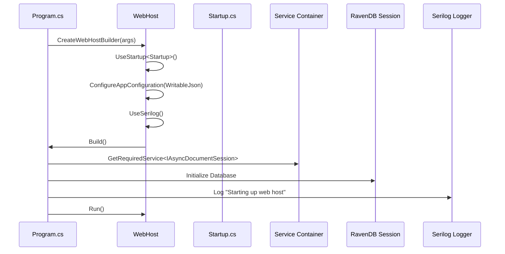

# Standalone Deployment

<cite>
**Referenced Files in This Document**   
- [Program.cs](file://src/Unlimotion.Server/Program.cs)
- [appsettings.json](file://src/Unlimotion.Server/appsettings.json)
- [Startup.cs](file://src/Unlimotion.Server/Startup.cs)
- [AppHost.cs](file://src/Unlimotion.Server/AppHost.cs)
- [ServiceStackSettings.cs](file://src/Unlimotion.Server/ServiceStackSettings.cs)
- [Unlimotion.Server.csproj](file://src/Unlimotion.Server/Unlimotion.Server.csproj)
- [run.windows.cmd](file://run.windows.cmd)
- [run.linux.sh](file://run.linux.sh)
- [run.macos.sh](file://run.macos.sh)
</cite>

## Table of Contents
1. [Introduction](#introduction)
2. [Runtime Dependencies](#runtime-dependencies)
3. [Program.cs Host Configuration](#programcs-host-configuration)
4. [AppSettings Configuration](#appsettings-configuration)
5. [Platform-Specific Deployment](#platform-specific-deployment)
6. [Service Integration](#service-integration)
7. [Reverse Proxy Configuration](#reverse-proxy-configuration)
8. [Performance and Monitoring](#performance-and-monitoring)

## Introduction
This document provides comprehensive guidance for deploying the Unlimotion server as a standalone application without Docker. The documentation covers the configuration of the ASP.NET Core host with Serilog, ServiceStack, and RavenDB integration, along with platform-specific deployment instructions for Windows, Linux, and macOS. It details the required runtime dependencies, configuration options, and operational considerations for production environments.

## Runtime Dependencies
The Unlimotion server requires the .NET 9.0 runtime for execution, as specified in the project file. The application is built as a self-contained executable with OutputType set to "Exe" in the Unlimotion.Server.csproj file. Key dependencies include:

- **RavenDB.Embedded**: Provides the embedded NoSQL database functionality
- **Serilog.AspNetCore**: Enables structured logging with console and file sinks
- **ServiceStack**: Powers the API framework with OpenAPI/Swagger support
- **SignalR.EasyUse.Server**: Facilitates real-time communication via WebSockets
- **WritableJsonConfiguration**: Allows runtime modification of configuration

The application must be deployed on systems with the .NET 9.0 runtime installed. For production deployments, it's recommended to install the .NET 9.0 Hosting Bundle on Windows or the appropriate .NET runtime packages on Linux and macOS systems.

**Section sources**
- [Unlimotion.Server.csproj](file://src/Unlimotion.Server/Unlimotion.Server.csproj#L1-L43)

## Program.cs Host Configuration
The Program.cs file configures the ASP.NET Core host with essential services for the Unlimotion server. The CreateWebHostBuilder method sets up the web host using WebHost.CreateDefaultBuilder, which configures standard web host defaults including Kestrel, IIS integration, and configuration providers.

The host configuration includes:
- **Startup class integration**: The UseStartup<Startup>() method connects the application to the Startup class for service configuration and request pipeline setup
- **Writable JSON configuration**: The application uses WritableJsonConfiguration to enable runtime modification of appsettings.json
- **Serilog integration**: The UseSerilog extension configures structured logging with settings read from the configuration system

The Main method implements a robust error handling strategy with try-catch-finally blocks that ensure proper logging initialization and cleanup. The host initializes the RavenDB document session through dependency injection before starting, ensuring the database is ready when the application begins processing requests.



**Diagram sources**
- [Program.cs](file://src/Unlimotion.Server/Program.cs#L15-L50)

**Section sources**
- [Program.cs](file://src/Unlimotion.Server/Program.cs#L1-L50)

## AppSettings Configuration
The appsettings.json file contains critical configuration settings for the Unlimotion server in production environments. The configuration is structured into several key sections:

### Serilog Configuration
The Serilog section configures structured logging with both console and file outputs. The logging level is set to "Information" by default, with logs written to Log\log.txt with daily rolling intervals. This configuration enables comprehensive monitoring of application behavior and troubleshooting.

### RavenDB Configuration
The RavenDB settings specify the database name ("Unlimotion"), server URL (http://localhost:8080), data directory ("RavenDB"), and logs path ("Log\RavenDB"). These settings determine the database storage location and accessibility. For production deployments, consider configuring SSL/TLS encryption and adjusting the server URL to bind to specific network interfaces.

### Security Settings
The Security section contains the RSA private key in XML format used for JWT token signing. This key must be protected and rotated periodically in production environments. The configuration also includes the ServiceStack license key, which is required for the trial period and must be renewed or replaced with a production license.

### File Storage
The FilesPath setting specifies the directory ("Files") where application files are stored. This directory should have appropriate permissions configured based on the deployment platform and security requirements.

For production use, create a copy of appsettings.json and modify the following:
- Update the ServiceStack license key to a valid production license
- Configure SSL certificates for secure communication
- Adjust logging levels based on monitoring requirements
- Modify RavenDB settings for performance and security
- Ensure the private key is securely stored and rotated regularly

**Section sources**
- [appsettings.json](file://src/Unlimotion.Server/appsettings.json#L1-L45)

## Platform-Specific Deployment
The Unlimotion server can be deployed on Windows, Linux, and macOS using the provided startup scripts. These scripts are designed to launch the desktop application, which includes the server component.

### Windows Deployment
The run.windows.cmd script uses the dotnet CLI to execute the Unlimotion.Desktop project:
```
dotnet run --project src\Unlimotion.Desktop\Unlimotion.Desktop.csproj
```
This command compiles and runs the application from source. For production deployments, it's recommended to publish the application first using `dotnet publish` and then execute the compiled assembly directly.

### Linux Deployment
The run.linux.sh script targets the Debian-specific build configuration:
```
dotnet run --project src/Unlimotion.Desktop/Unlimotion.Desktop.ForDebianBuild.csproj
```
On Linux systems, ensure the .NET runtime is installed via the package manager (apt, yum, etc.) and that the application has appropriate file system permissions for the data directories.

### macOS Deployment
The run.macos.sh script uses the macOS-specific build configuration:
```
dotnet run --project src/Unlimotion.Desktop/Unlimotion.Desktop.ForMacBuild.csproj
```
macOS deployments require the .NET runtime to be installed via Homebrew, the official installer, or another package manager. The application may require permission to access certain directories.

For all platforms, consider creating dedicated user accounts for running the application and setting appropriate file permissions for the data directories (RavenDB, Log, Files).

**Section sources**
- [run.windows.cmd](file://run.windows.cmd#L1)
- [run.linux.sh](file://run.linux.sh#L1)
- [run.macos.sh](file://run.macos.sh#L1)

## Service Integration
To run the Unlimotion server as a background service or daemon, platform-specific service managers should be configured.

### Linux (systemd)
Create a systemd service file (/etc/systemd/system/unlimotion.service):
```ini
[Unit]
Description=Unlimotion Server
After=network.target

[Service]
Type=exec
User=unlimotion
WorkingDirectory=/opt/unlimotion
ExecStart=/usr/bin/dotnet /opt/unlimotion/Unlimotion.Server.dll
Restart=always
RestartSec=10
KillSignal=SIGINT
SyslogIdentifier=unlimotion-server

[Install]
WantedBy=multi-user.target
```

### macOS (launchd)
Create a launch daemon plist file (/Library/LaunchDaemons/com.unlimotion.server.plist):
```xml
<?xml version="1.0" encoding="UTF-8"?>
<!DOCTYPE plist PUBLIC "-//Apple//DTD PLIST 1.0//EN" "http://www.apple.com/DTDs/PropertyList-1.0.dtd">
<plist version="1.0">
<dict>
    <key>Label</key>
    <string>com.unlimotion.server</string>
    <key>ProgramArguments</key>
    <array>
        <string>/usr/local/bin/dotnet</string>
        <string>/Applications/Unlimotion/Unlimotion.Server.dll</string>
    </array>
    <key>RunAtLoad</key>
    <true/>
    <key>KeepAlive</key>
    <true/>
    <key>WorkingDirectory</key>
    <string>/Applications/Unlimotion</string>
</dict>
</plist>
```

### Windows (Windows Services)
Use the sc command to create a Windows Service:
```
sc create UnlimotionServer binPath= "C:\Program Files\dotnet\dotnet.exe C:\Unlimotion\Unlimotion.Server.dll" start= auto
```

Ensure proper permissions are granted to the service accounts and that the application directories are accessible.

**Section sources**
- [Unlimotion.Server.csproj](file://src/Unlimotion.Server/Unlimotion.Server.csproj#L1-L43)
- [Program.cs](file://src/Unlimotion.Server/Program.cs#L1-L50)

## Reverse Proxy Configuration
For production deployments, configure a reverse proxy to handle SSL termination and load balancing.

### nginx Configuration
```nginx
server {
    listen 443 ssl;
    server_name unlimotion.example.com;
    
    ssl_certificate /path/to/certificate.crt;
    ssl_certificate_key /path/to/private.key;
    
    location / {
        proxy_pass http://localhost:5000;
        proxy_http_version 1.1;
        proxy_set_header Upgrade $http_upgrade;
        proxy_set_header Connection "upgrade";
        proxy_set_header Host $host;
        proxy_set_header X-Real-IP $remote_addr;
        proxy_set_header X-Forwarded-For $proxy_add_x_forwarded_for;
        proxy_set_header X-Forwarded-Proto $scheme;
    }
}
```

### Apache Configuration
```apache
<VirtualHost *:443>
    ServerName unlimotion.example.com
    
    SSLEngine on
    SSLCertificateFile /path/to/certificate.crt
    SSLCertificateKeyFile /path/to/private.key
    
    ProxyPreserveHost On
    ProxyPass / http://localhost:5000/
    ProxyPassReverse / http://localhost:5000/
    
    RewriteEngine On
    RewriteCond %{HTTP:Upgrade} =websocket [NC]
    RewriteRule /(.*) ws://localhost:5000/$1 [P,L]
</VirtualHost>
```

The reverse proxy should be configured to forward WebSocket connections for SignalR functionality and preserve original request headers for proper URL generation.

**Section sources**
- [Startup.cs](file://src/Unlimotion.Server/Startup.cs#L1-L63)
- [AppHost.cs](file://src/Unlimotion.Server/AppHost.cs#L1-L122)

## Performance and Monitoring
For optimal performance in native deployments, consider the following tuning recommendations:

### Memory Configuration
Configure the .NET runtime for server workloads by setting environment variables:
- COMPlus_gcServer=1 (enable server GC)
- COMPlus_gcConcurrent=1 (enable concurrent GC)
- DOTNET_gcHeapCount (set based on CPU cores)

### Monitoring Considerations
The Serilog configuration writes logs to both console and file outputs, enabling comprehensive monitoring. Integrate with centralized logging solutions by adding additional Serilog sinks (e.g., Elasticsearch, Seq, or Splunk).

Monitor the following metrics:
- RavenDB performance and storage usage
- Memory consumption of the .NET process
- Request rates and response times
- Error rates and exception patterns

The application includes OpenAPI/Swagger integration through the OpenApiFeature plugin, providing API documentation at the /swagger-ui path. This can be used for monitoring API usage and testing endpoints.

For production environments, disable the developer exception page by ensuring the ASPNETCORE_ENVIRONMENT variable is not set to "Development".

**Section sources**
- [Program.cs](file://src/Unlimotion.Server/Program.cs#L1-L50)
- [appsettings.json](file://src/Unlimotion.Server/appsettings.json#L1-L45)
- [AppHost.cs](file://src/Unlimotion.Server/AppHost.cs#L1-L122)