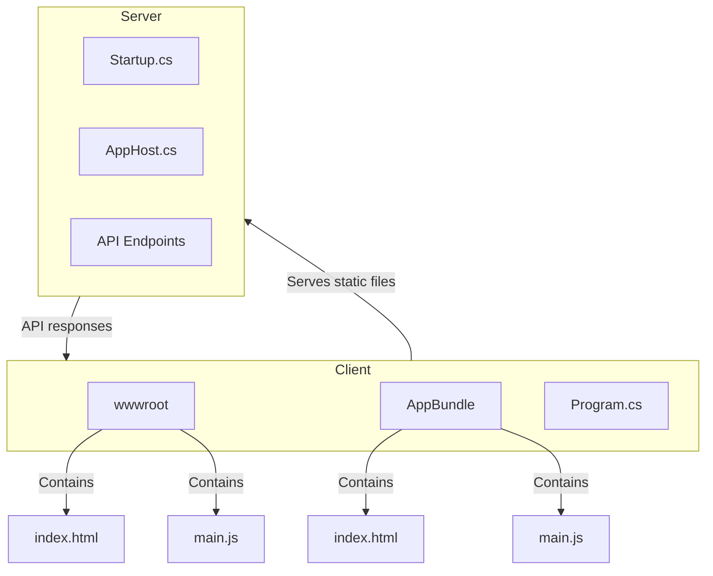
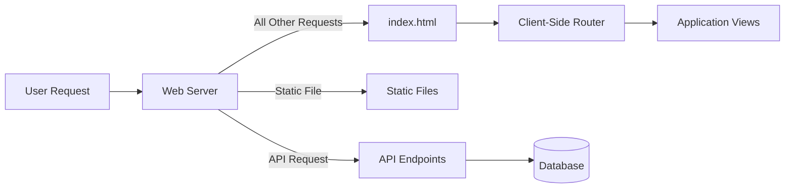
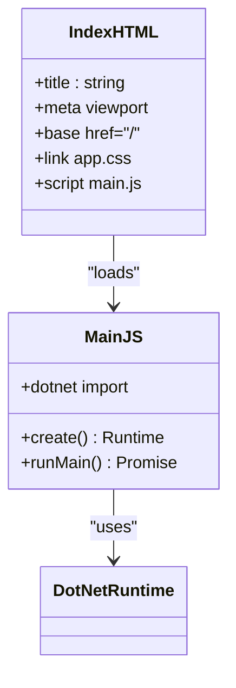
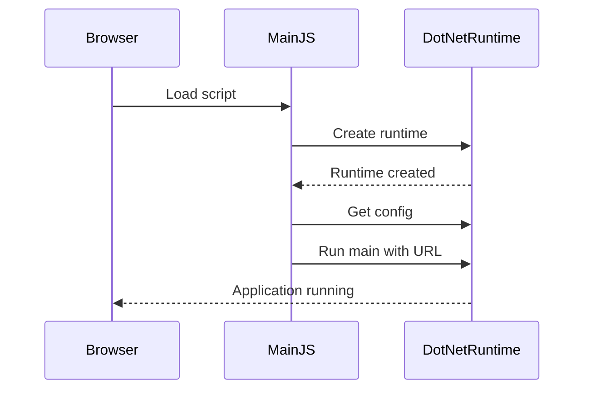
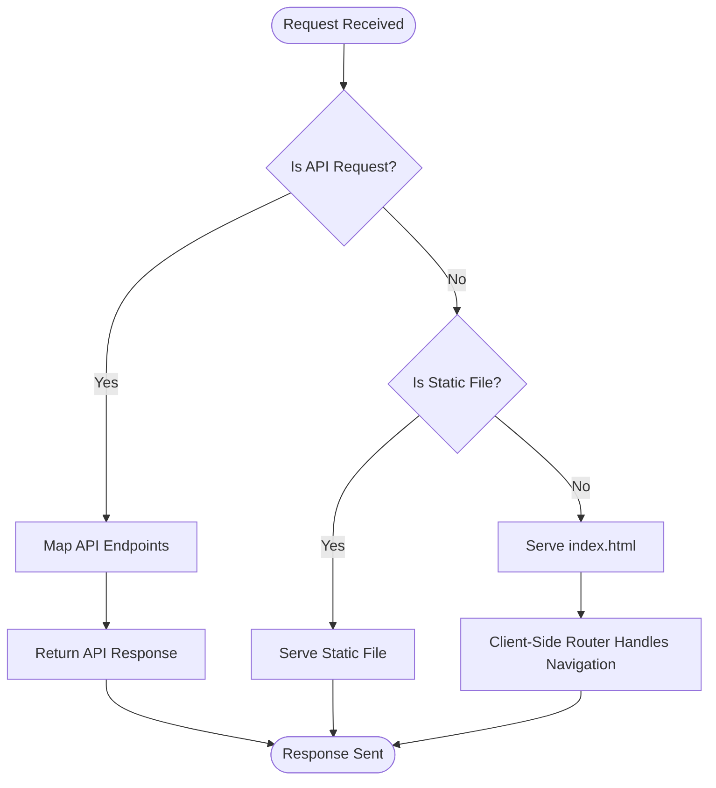
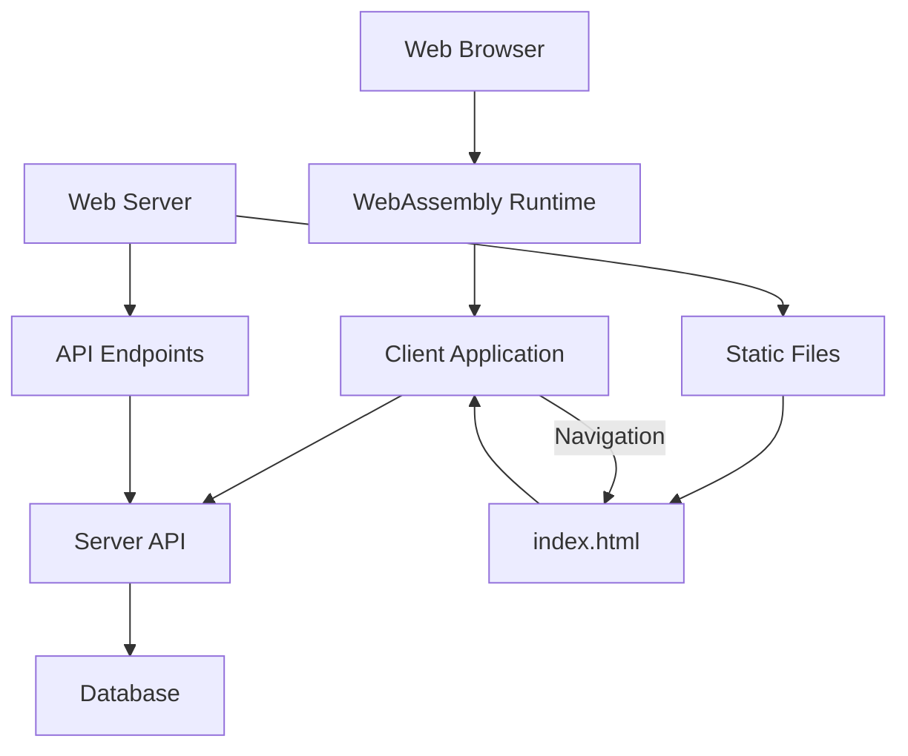

# Client-Side Routing Setup

<cite>
**Referenced Files in This Document**   
- [index.html](file://src/Unlimotion.Browser/wwwroot/index.html)
- [index.html](file://src/Unlimotion.Browser/AppBundle/index.html)
- [main.js](file://src/Unlimotion.Browser/wwwroot/main.js)
- [main.js](file://src/Unlimotion.Browser/AppBundle/main.js)
- [Program.cs](file://src/Unlimotion.Browser/Program.cs)
- [App.axaml.cs](file://src/Unlimotion/App.axaml.cs)
- [Startup.cs](file://src/Unlimotion.Server/Startup.cs)
- [AppHost.cs](file://src/Unlimotion.Server/AppHost.cs)
- [Unlimotion.Browser.csproj](file://src/Unlimotion.Browser/Unlimotion.Browser.csproj)
</cite>

## Table of Contents
1. [Introduction](#introduction)
2. [Project Structure](#project-structure)
3. [Core Components](#core-components)
4. [Architecture Overview](#architecture-overview)
5. [Detailed Component Analysis](#detailed-component-analysis)
6. [Dependency Analysis](#dependency-analysis)
7. [Performance Considerations](#performance-considerations)
8. [Troubleshooting Guide](#troubleshooting-guide)
9. [Conclusion](#conclusion)

## Introduction
This document provides comprehensive guidance for configuring client-side routing in the Unlimotion web application to support deep linking and Single Page Application (SPA) navigation. The Unlimotion application is built using Avalonia UI with WebAssembly, implementing a client-server architecture where the client-side application handles navigation through Blazor-style routing. This documentation explains the fallback routing mechanism that redirects all non-file requests to index.html, allowing the Blazor router to handle navigation internally. It provides implementation examples for various web servers and cloud platforms, addresses common issues, and explains how the application's internal routing interacts with server-level configuration.

## Project Structure
The Unlimotion application follows a modular structure with distinct components for client and server functionality. The client-side routing is primarily handled in the Unlimotion.Browser project, which contains the web assets and WebAssembly application. The server-side component (Unlimotion.Server) provides API endpoints and serves the static files for the client application. The project structure shows a clear separation between the browser client, server API, domain models, and shared components.



**Diagram sources**
- [index.html](file://src/Unlimotion.Browser/wwwroot/index.html)
- [index.html](file://src/Unlimotion.Browser/AppBundle/index.html)
- [Startup.cs](file://src/Unlimotion.Server/Startup.cs)
- [Program.cs](file://src/Unlimotion.Browser/Program.cs)

**Section sources**
- [index.html](file://src/Unlimotion.Browser/wwwroot/index.html)
- [index.html](file://src/Unlimotion.Browser/AppBundle/index.html)
- [Startup.cs](file://src/Unlimotion.Server/Startup.cs)
- [Unlimotion.Browser.csproj](file://src/Unlimotion.Browser/Unlimotion.Browser.csproj)

## Core Components
The core components for client-side routing in Unlimotion include the index.html files that serve as entry points, the main.js files that bootstrap the WebAssembly application, and the server configuration that handles routing. The application uses Avalonia UI's browser hosting capabilities to run a desktop-style application in the browser, which requires specific routing configuration to ensure all navigation requests are handled by the client-side router rather than resulting in 404 errors.

**Section sources**
- [index.html](file://src/Unlimotion.Browser/wwwroot/index.html)
- [main.js](file://src/Unlimotion.Browser/wwwroot/main.js)
- [Program.cs](file://src/Unlimotion.Browser/Program.cs)
- [App.axaml.cs](file://src/Unlimotion/App.axaml.cs)

## Architecture Overview
The Unlimotion application follows a client-server architecture where the server primarily serves static files and API endpoints, while the client handles all UI rendering and navigation. The routing architecture is designed to support deep linking by implementing a fallback mechanism that redirects all non-API and non-static file requests to the index.html file, allowing the client-side Blazor router to handle the navigation.



**Diagram sources**
- [Startup.cs](file://src/Unlimotion.Server/Startup.cs)
- [AppHost.cs](file://src/Unlimotion.Server/AppHost.cs)
- [index.html](file://src/Unlimotion.Browser/wwwroot/index.html)

## Detailed Component Analysis

### Client-Side Routing Implementation
The client-side routing in Unlimotion is implemented through the combination of HTML entry points, JavaScript bootstrapping, and server-side configuration. The application uses two index.html files - one in the wwwroot directory and another in the AppBundle directory - both serving as entry points for the WebAssembly application.

#### HTML Entry Points
The index.html files contain the necessary structure to load the WebAssembly application and include the base href="/" directive which is crucial for proper routing. The main difference between the two index.html files is in their styling and splash screen presentation, but both serve the same fundamental purpose of bootstrapping the application.



**Diagram sources**
- [index.html](file://src/Unlimotion.Browser/wwwroot/index.html)
- [index.html](file://src/Unlimotion.Browser/AppBundle/index.html)
- [main.js](file://src/Unlimotion.Browser/wwwroot/main.js)
- [main.js](file://src/Unlimotion.Browser/AppBundle/main.js)

#### JavaScript Bootstrapping
The main.js files are responsible for initializing the WebAssembly runtime and starting the application. They import the dotnet.js module and configure the runtime with diagnostic tracing disabled. The key difference between the two main.js files is in how they handle the application arguments - one passes the full URL while the other passes only the query string.



**Diagram sources**
- [main.js](file://src/Unlimotion.Browser/wwwroot/main.js)
- [main.js](file://src/Unlimotion.Browser/AppBundle/main.js)
- [Program.cs](file://src/Unlimotion.Browser/Program.cs)

#### Server-Side Configuration
The server-side configuration in Startup.cs sets up the routing middleware and endpoint mapping. The Configure method in Startup.cs handles the application pipeline, including routing and endpoint configuration. The server is configured to serve static files and handle API endpoints, with all other requests falling through to the static files middleware which will serve the index.html file for client-side routing.



**Diagram sources**
- [Startup.cs](file://src/Unlimotion.Server/Startup.cs)
- [AppHost.cs](file://src/Unlimotion.Server/AppHost.cs)
- [Program.cs](file://src/Unlimotion.Browser/Program.cs)

### Server Configuration for Client-Side Routing
To properly support client-side routing in Unlimotion, the web server must be configured to redirect all non-API and non-static file requests to index.html. This section provides configuration examples for common web servers and cloud platforms.

#### Nginx Configuration
```nginx
server {
    listen 80;
    server_name unlimotion.example.com;
    root /var/www/unlimotion;
    index index.html;

    location / {
        try_files $uri $uri/ /index.html;
    }

    location /api/ {
        proxy_pass http://localhost:5000;
        proxy_http_version 1.1;
        proxy_set_header Upgrade $http_upgrade;
        proxy_set_header Connection 'upgrade';
        proxy_set_header Host $host;
        proxy_cache_bypass $http_upgrade;
    }

    location /chathub/ {
        proxy_pass http://localhost:5000;
        proxy_http_version 1.1;
        proxy_set_header Upgrade $http_upgrade;
        proxy_set_header Connection 'upgrade';
        proxy_set_header Host $host;
        proxy_cache_bypass $http_upgrade;
    }
}
```

#### Apache Configuration
```apache
<VirtualHost *:80>
    ServerName unlimotion.example.com
    DocumentRoot /var/www/unlimotion

    <Directory "/var/www/unlimotion">
        RewriteEngine On
        # Don't redirect API requests
        RewriteCond %{REQUEST_URI} !^/api/
        # Don't redirect SignalR hub requests
        RewriteCond %{REQUEST_URI} !^/chathub/
        # Don't redirect static files
        RewriteCond %{REQUEST_FILENAME} !-f
        RewriteCond %{REQUEST_FILENAME} !-d
        # Redirect all other requests to index.html
        RewriteRule ^ index.html [L]
    </Directory>

    # Proxy API requests to backend
    ProxyPass /api/ http://localhost:5000/api/
    ProxyPassReverse /api/ http://localhost:5000/api/
    
    # Proxy SignalR hub requests
    ProxyPass /chathub/ ws://localhost:5000/chathub/
    ProxyPassReverse /chathub/ ws://localhost:5000/chathub/
</VirtualHost>
```

#### IIS Configuration
```xml
<configuration>
  <system.webServer>
    <rewrite>
      <rules>
        <rule name="API Routes" stopProcessing="true">
          <match url="^api/(.*)" />
          <action type="None" />
        </rule>
        <rule name="SignalR Hub" stopProcessing="true">
          <match url="^chathub/(.*)" />
          <action type="None" />
        </rule>
        <rule name="SPA Routes" stopProcessing="true">
          <match url=".*" />
          <conditions logicalGrouping="MatchAll">
            <add input="{REQUEST_FILENAME}" matchType="IsFile" negate="true" />
            <add input="{REQUEST_FILENAME}" matchType="IsDirectory" negate="true" />
          </conditions>
          <action type="Rewrite" url="/index.html" />
        </rule>
      </rules>
    </rewrite>
  </system.webServer>
</configuration>
```

#### Cloud Platform Configurations

##### Netlify
```toml
[[redirects]]
  from = "/api/*"
  to = "https://api.unlimotion.com/:splat"
  status = 200
  force = false

[[redirects]]
  from = "/chathub/*"
  to = "https://api.unlimotion.com/:splat"
  status = 200
  force = false

[[redirects]]
  from = "/*"
  to = "/index.html"
  status = 200
  force = false
```

##### Vercel
```json
{
  "rewrites": [
    { "source": "/api/:path*", "destination": "https://api.unlimotion.com/api/:path*" },
    { "source": "/chathub/:path*", "destination": "https://api.unlimotion.com/chathub/:path*" },
    { "source": "/((?!api|chathub).*)", "destination": "/index.html" }
  ]
}
```

##### Firebase
```json
{
  "hosting": {
    "public": "dist",
    "ignore": [
      "firebase.json",
      "**/.*",
      "**/node_modules/**"
    ],
    "rewrites": [
      {
        "source": "api/{path,/**}",
        "function": "api"
      },
      {
        "source": "chathub/{path,/**}",
        "function": "chathub"
      },
      {
        "source": "!{api,api/**,chathub,chathub/**,*.*,*/*/}",
        "destination": "/index.html"
      }
    ]
  }
}
```

**Section sources**
- [Startup.cs](file://src/Unlimotion.Server/Startup.cs)
- [AppHost.cs](file://src/Unlimotion.Server/AppHost.cs)
- [index.html](file://src/Unlimotion.Browser/wwwroot/index.html)

## Dependency Analysis
The client-side routing in Unlimotion depends on several key components working together: the WebAssembly runtime, the server-side routing configuration, and the client-side application structure. The dependencies are relatively straightforward, with the client application depending on the server to serve static files correctly, and the server depending on the client application's structure for proper routing.



**Diagram sources**
- [Startup.cs](file://src/Unlimotion.Server/Startup.cs)
- [Program.cs](file://src/Unlimotion.Browser/Program.cs)
- [App.axaml.cs](file://src/Unlimotion/App.axaml.cs)

**Section sources**
- [Startup.cs](file://src/Unlimotion.Server/Startup.cs)
- [Program.cs](file://src/Unlimotion.Browser/Program.cs)
- [App.axaml.cs](file://src/Unlimotion/App.axaml.cs)

## Performance Considerations
Client-side routing in Unlimotion has several performance implications that should be considered. The initial load time includes downloading the WebAssembly runtime and application code, which can be mitigated through proper caching and compression. Subsequent navigation is fast as it occurs entirely on the client side without server round-trips. However, deep linking requires the server to serve the index.html file for all routes, which adds a small overhead compared to direct static file serving.

To optimize performance:
- Enable GZIP or Brotli compression on the web server
- Configure proper caching headers for static assets
- Minimize the size of the WebAssembly payload
- Use lazy loading for application components when possible
- Implement service workers for offline support and faster subsequent loads

## Troubleshooting Guide
When client-side routing is not working correctly in Unlimotion, several common issues may occur. This section provides troubleshooting steps for the most frequent problems.

### 404 Errors on Direct Navigation
If navigating directly to a route (e.g., /tasks/completed) results in a 404 error, the server-side fallback routing is not configured correctly. Verify that:
- The server is configured to redirect all non-API and non-static file requests to index.html
- The routing rules exclude API endpoints (/api/) and SignalR hubs (/chathub/)
- Static files (CSS, JS, images) are served correctly and not redirected
- The base href in index.html is set to "/" or the appropriate subdirectory

### API Routes Not Accessible
If API routes are not accessible, check that:
- API routes are excluded from the fallback routing rules
- The proxy configuration (if used) is correctly forwarding requests to the backend server
- CORS is properly configured on the server to allow requests from the client origin
- Authentication headers are being properly passed through

### Query Parameters Not Preserved
If query parameters are lost during navigation:
- Verify that the client-side router is configured to handle query strings
- Check that the server-side routing doesn't strip query parameters when redirecting
- Ensure that the main.js file passes the full URL (including query parameters) to the WebAssembly application

### Mixed Content Issues
If the application loads but functionality is broken:
- Ensure that all resources are loaded over the same protocol (HTTP or HTTPS)
- Check that the server is not redirecting HTTP to HTTPS in a way that breaks routing
- Verify that the base href matches the actual deployment path

**Section sources**
- [Startup.cs](file://src/Unlimotion.Server/Startup.cs)
- [AppHost.cs](file://src/Unlimotion.Server/AppHost.cs)
- [main.js](file://src/Unlimotion.Browser/wwwroot/main.js)

## Conclusion
Proper client-side routing configuration is essential for the Unlimotion web application to support deep linking and SPA navigation. The key requirement is implementing a fallback routing mechanism that redirects all non-API and non-static file requests to index.html, allowing the Blazor router to handle navigation. This document has provided detailed configuration examples for various web servers and cloud platforms, addressed common issues, and explained how the application's internal routing interacts with server-level configuration. By following these guidelines, developers can ensure that Unlimotion's client-side routing works correctly across different deployment environments.