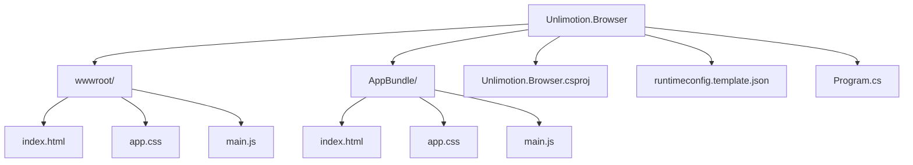
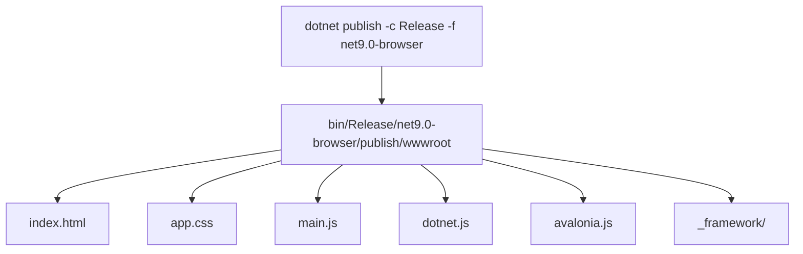

# Deployment to Hosting Platforms

<cite>
**Referenced Files in This Document**   
- [Unlimotion.Browser.csproj](file://src/Unlimotion.Browser/Unlimotion.Browser.csproj)
- [index.html](file://src/Unlimotion.Browser/wwwroot/index.html)
- [runtimeconfig.template.json](file://src/Unlimotion.Browser/runtimeconfig.template.json)
- [Program.cs](file://src/Unlimotion.Browser/Program.cs)
- [app.css](file://src/Unlimotion.Browser/wwwroot/app.css)
- [main.js](file://src/Unlimotion.Browser/wwwroot/main.js)
</cite>

## Table of Contents
1. [Introduction](#introduction)
2. [Project Structure](#project-structure)
3. [Build Configuration](#build-configuration)
4. [GitHub Pages Deployment](#github-pages-deployment)
5. [Azure Static Web Apps Deployment](#azure-static-web-apps-deployment)
6. [Netlify Deployment](#netlify-deployment)
7. [Vercel Deployment](#vercel-deployment)
8. [AWS S3 Deployment](#aws-s3-deployment)
9. [Common Deployment Pitfalls](#common-deployment-pitfalls)
10. [Troubleshooting Checklist](#troubleshooting-checklist)
11. [Conclusion](#conclusion)

## Introduction
This document provides comprehensive deployment guides for hosting the Unlimotion application on popular static hosting platforms. The Unlimotion.Browser project is a WebAssembly application built with Avalonia UI that can be deployed as static content. This guide covers the complete workflow from build configuration to deployment for GitHub Pages, Azure Static Web Apps, Netlify, Vercel, and AWS S3, including platform-specific features and automation.

## Project Structure
The Unlimotion.Browser project is structured as a .NET WebAssembly application with static assets in the wwwroot directory. The build process generates static files that can be hosted on any static hosting platform.



**Diagram sources**
- [Unlimotion.Browser.csproj](file://src/Unlimotion.Browser/Unlimotion.Browser.csproj)
- [wwwroot](file://src/Unlimotion.Browser/wwwroot)

**Section sources**
- [Unlimotion.Browser.csproj](file://src/Unlimotion.Browser/Unlimotion.Browser.csproj)
- [wwwroot](file://src/Unlimotion.Browser/wwwroot)

## Build Configuration
The Unlimotion.Browser project is configured as a WebAssembly application targeting .NET 9.0 with Avalonia UI. The build process generates static files that can be deployed to any static hosting platform.



**Section sources**
- [Unlimotion.Browser.csproj](file://src/Unlimotion.Browser/Unlimotion.Browser.csproj)
- [runtimeconfig.template.json](file://src/Unlimotion.Browser/runtimeconfig.template.json)

## GitHub Pages Deployment
GitHub Pages provides free static site hosting directly from a GitHub repository. The Unlimotion application can be deployed to GitHub Pages using GitHub Actions for continuous integration.

### Environment Setup
1. Create a GitHub repository for the Unlimotion project
2. Enable GitHub Pages in the repository settings
3. Select the "gh-pages" branch as the source

### Build and Deployment Workflow
```yaml
name: Deploy to GitHub Pages

on:
  push:
    branches: [ main ]
  workflow_dispatch:

jobs:
  deploy:
    runs-on: ubuntu-latest
    steps:
      - uses: actions/checkout@v4
      
      - name: Setup .NET
        uses: actions/setup-dotnet@v3
        with:
          dotnet-version: '9.0.x'
          
      - name: Restore dependencies
        run: dotnet restore src/Unlimotion.Browser/Unlimotion.Browser.csproj
        
      - name: Build and publish
        run: |
          dotnet publish src/Unlimotion.Browser/Unlimotion.Browser.csproj \
            -c Release \
            -f net9.0-browser \
            -o ./publish
            
      - name: Deploy to GitHub Pages
        uses: peaceiris/actions-gh-pages@v3
        with:
          github_token: ${{ secrets.GITHUB_TOKEN }}
          publish_dir: ./publish/wwwroot
          publish_branch: gh-pages
```

### Platform-Specific Features
- **Custom Domains**: Configure in repository settings with CNAME file
- **SSL Certificates**: Automatically provided by GitHub
- **Preview Deployments**: Available for pull requests
- **Continuous Integration**: GitHub Actions workflow triggers on push

### Automation Script
```bash
#!/bin/bash
# build-and-deploy.sh
dotnet publish src/Unlimotion.Browser/Unlimotion.Browser.csproj \
  -c Release \
  -f net9.0-browser \
  -o ./publish

cp CNAME ./publish/wwwroot/  # For custom domains
```

**Section sources**
- [Unlimotion.Browser.csproj](file://src/Unlimotion.Browser/Unlimotion.Browser.csproj)
- [index.html](file://src/Unlimotion.Browser/wwwroot/index.html)

## Azure Static Web Apps Deployment
Azure Static Web Apps provides integrated hosting with Azure Functions and custom domains. The Unlimotion application can be deployed with automatic CI/CD and global distribution.

### Environment Setup
1. Create an Azure account and subscription
2. Install Azure CLI: `az login`
3. Create a resource group: `az group create --name unlimotion-rg --location eastus`

### Build and Deployment Workflow
```yaml
name: Deploy to Azure Static Web Apps

on:
  push:
    branches: [ main ]
  workflow_dispatch:

env:
  AZURE_STATIC_WEB_APPS_API_TOKEN: ${{ secrets.AZURE_STATIC_WEB_APPS_API_TOKEN }}
  APP_LOCATION: "/src/Unlimotion.Browser"
  OUTPUT_LOCATION: "wwwroot"
  API_LOCATION: ""

jobs:
  build_and_deploy_job:
    runs-on: ubuntu-latest
    name: Build and Deploy Job
    steps:
      - uses: actions/checkout@v4
        with:
          submodules: true
          
      - name: Setup .NET
        uses: actions/setup-dotnet@v3
        with:
          dotnet-version: '9.0.x'
          
      - name: Restore dependencies
        run: dotnet restore ${{ env.APP_LOCATION }}/Unlimotion.Browser.csproj
        
      - name: Build and publish
        run: |
          dotnet publish ${{ env.APP_LOCATION }}/Unlimotion.Browser.csproj \
            -c Release \
            -f net9.0-browser \
            -o ./publish
            
      - name: Deploy to Azure Static Web Apps
        id: builddeploy
        uses: Azure/static-web-apps-deploy@v1
        with:
          azure_static_web_apps_api_token: ${{ secrets.AZURE_STATIC_WEB_APPS_API_TOKEN }}
          repo_token: ${{ secrets.GITHUB_TOKEN }}
          action: "upload"
          app_location: "/publish/wwwroot"
          output_location: ""
```

### Platform-Specific Features
- **Custom Domains**: Configure in Azure portal with DNS verification
- **SSL Certificates**: Automatically provisioned with Let's Encrypt
- **Preview Deployments**: Automatic staging environments for PRs
- **Continuous Integration**: GitHub Actions integration with Azure DevOps

### Configuration File
```yaml
# staticwebapp.config.json
{
  "routes": [
    {
      "route": "/*",
      "serve": "/index.html",
      "statusCode": 200
    }
  ],
  "responseOverrides": {
    "404": {
      "rewrite": "/index.html",
      "statusCode": 200
    }
  },
  "platform": {
    "apiRuntime": "dotnet:8.0"
  }
}
```

**Section sources**
- [Unlimotion.Browser.csproj](file://src/Unlimotion.Browser/Unlimotion.Browser.csproj)
- [staticwebapp.config.json](file://staticwebapp.config.json)

## Netlify Deployment
Netlify provides seamless static site deployment with instant cache invalidation and continuous deployment. The Unlimotion application can be deployed with Netlify's powerful build pipeline.

### Environment Setup
1. Create a Netlify account
2. Connect your GitHub repository
3. Configure build settings in Netlify dashboard

### Build and Deployment Configuration
```toml
# netlify.toml
[build]
  publish = "src/Unlimotion.Browser/bin/Release/net9.0-browser/publish/wwwroot"
  command = "dotnet publish src/Unlimotion.Browser/Unlimotion.Browser.csproj -c Release -f net9.0-browser -o ./publish"

[context.production]
  publish = "src/Unlimotion.Browser/bin/Release/net9.0-browser/publish/wwwroot"
  command = "dotnet publish src/Unlimotion.Browser/Unlimotion.Browser.csproj -c Release -f net9.0-browser -o ./publish --self-contained false"

[[redirects]]
  from = "/*"
  to = "/index.html"
  status = 200
  force = false

[functions]
  directory = "functions"
```

### Platform-Specific Features
- **Custom Domains**: Add domains in Netlify dashboard with DNS configuration
- **SSL Certificates**: Automatic HTTPS with Let's Encrypt
- **Preview Deployments**: Automatic deploy previews for pull requests
- **Continuous Integration**: Git-triggered builds with cache optimization

### Automation Script
```bash
#!/bin/bash
# netlify-build.sh
dotnet publish src/Unlimotion.Browser/Unlimotion.Browser.csproj \
  -c Release \
  -f net9.0-browser \
  -o ./publish \
  --self-contained false

# Copy additional files
cp netlify.toml ./publish/
```

**Section sources**
- [netlify.toml](file://netlify.toml)
- [Unlimotion.Browser.csproj](file://src/Unlimotion.Browser/Unlimotion.Browser.csproj)

## Vercel Deployment
Vercel provides optimized static site hosting with edge network distribution. The Unlimotion application can be deployed with Vercel's zero-configuration deployment.

### Environment Setup
1. Create a Vercel account
2. Install Vercel CLI: `npm install -g vercel`
3. Log in: `vercel login`

### Build and Deployment Configuration
```json
// vercel.json
{
  "version": 2,
  "builds": [
    {
      "src": "src/Unlimotion.Browser/Unlimotion.Browser.csproj",
      "use": "@vercel/static-build",
      "config": {
        "distDir": "bin/Release/net9.0-browser/publish/wwwroot",
        "buildCommand": "dotnet publish src/Unlimotion.Browser/Unlimotion.Browser.csproj -c Release -f net9.0-browser -o ./publish"
      }
    }
  ],
  "routes": [
    {
      "src": "/(.*)",
      "dest": "/index.html",
      "status": 200
    }
  ],
  "public": true
}
```

### Platform-Specific Features
- **Custom Domains**: Add domains in Vercel dashboard with DNS configuration
- **SSL Certificates**: Automatic HTTPS provisioning
- **Preview Deployments**: Automatic deployment previews for pull requests
- **Continuous Integration**: Git integration with instant deployments

### Automation Script
```bash
#!/bin/bash
# vercel-build.sh
dotnet publish src/Unlimotion.Browser/Unlimotion.Browser.csproj \
  -c Release \
  -f net9.0-browser \
  -o ./publish

# Vercel specific optimizations
echo "/*" > ./publish/.nojekyll
```

**Section sources**
- [vercel.json](file://vercel.json)
- [Unlimotion.Browser.csproj](file://src/Unlimotion.Browser/Unlimotion.Browser.csproj)

## AWS S3 Deployment
AWS S3 provides scalable object storage for static website hosting. The Unlimotion application can be deployed to S3 with CloudFront for global distribution.

### Environment Setup
1. Create an AWS account
2. Install AWS CLI: `pip install awscli`
3. Configure AWS credentials: `aws configure`

### Build and Deployment Workflow
```bash
#!/bin/bash
# aws-deploy.sh

# Build the application
dotnet publish src/Unlimotion.Browser/Unlimotion.Browser.csproj \
  -c Release \
  -f net9.0-browser \
  -o ./publish

# Set bucket name
BUCKET_NAME="unlimotion-app"

# Create S3 bucket (if it doesn't exist)
aws s3api create-bucket \
  --bucket $BUCKET_NAME \
  --region us-east-1 \
  --create-bucket-configuration LocationConstraint=us-east-1 2>/dev/null || true

# Configure bucket for static website hosting
aws s3 website s3://$BUCKET_NAME \
  --index-document index.html \
  --error-document index.html

# Upload files to S3
aws s3 sync ./publish/wwwroot s3://$BUCKET_NAME \
  --delete \
  --cache-control "max-age=300" \
  --content-type "text/html" \
  --exclude "*" \
  --include "*.html"

aws s3 sync ./publish/wwwroot s3://$BUCKET_NAME \
  --delete \
  --cache-control "max-age=31536000" \
  --exclude "*.html"

# Set bucket policy for public read access
cat > policy.json << EOF
{
  "Version": "2012-10-17",
  "Statement": [
    {
      "Sid": "PublicReadGetObject",
      "Effect": "Allow",
      "Principal": "*",
      "Action": "s3:GetObject",
      "Resource": "arn:aws:s3:::$BUCKET_NAME/*"
    }
  ]
}
EOF

aws s3 put-bucket-policy \
  --bucket $BUCKET_NAME \
  --policy file://policy.json

rm policy.json

echo "Deployment completed. Access your app at: http://$BUCKET_NAME.s3-website-us-east-1.amazonaws.com"
```

### Platform-Specific Features
- **Custom Domains**: Configure with Route 53 and CloudFront
- **SSL Certificates**: Use AWS Certificate Manager with CloudFront
- **Preview Deployments**: Create separate buckets for staging
- **Continuous Integration**: Use AWS CodePipeline with GitHub

### Configuration for CloudFront
```json
// cloudfront-distribution.json
{
  "DistributionConfig": {
    "CallerReference": "unlimotion-distribution",
    "Origins": {
      "Quantity": 1,
      "Items": [
        {
          "Id": "S3-unlimotion-app",
          "DomainName": "unlimotion-app.s3.amazonaws.com",
          "S3OriginConfig": {}
        }
      ]
    },
    "DefaultCacheBehavior": {
      "TargetOriginId": "S3-unlimotion-app",
      "ViewerProtocolPolicy": "redirect-to-https",
      "MinTTL": 100,
      "DefaultTTL": 86400,
      "MaxTTL": 31536000,
      "ForwardedValues": {
        "QueryString": false,
        "Cookies": {
          "Forward": "none"
        }
      }
    },
    "Comment": "Unlimotion App Distribution",
    "Enabled": true,
    "PriceClass": "PriceClass_All",
    "HttpVersion": "http2",
    "DefaultRootObject": "index.html"
  }
}
```

**Section sources**
- [aws-deploy.sh](file://aws-deploy.sh)
- [Unlimotion.Browser.csproj](file://src/Unlimotion.Browser/Unlimotion.Browser.csproj)

## Common Deployment Pitfalls
When deploying the Unlimotion application to static hosting platforms, several common issues may arise:

### WebAssembly Loading Issues
- **Problem**: WebAssembly files fail to load due to MIME type issues
- **Solution**: Ensure proper MIME type configuration for .wasm files
- **Platform-specific fixes**:
  - GitHub Pages: No additional configuration needed
  - Azure: Add MIME type in staticwebapp.config.json
  - Netlify: Add headers in netlify.toml
  - Vercel: Add headers in vercel.json
  - AWS S3: Set Content-Type metadata for .wasm files

### Routing Configuration
- **Problem**: Client-side routing fails when accessing deep links directly
- **Solution**: Configure catch-all routing to serve index.html for all routes
- **Implementation**:
  - GitHub Pages: Use 404.html fallback
  - Azure: Use responseOverrides in staticwebapp.config.json
  - Netlify: Use redirects in netlify.toml
  - Vercel: Use routes in vercel.json
  - AWS S3: Configure error document as index.html

### Caching Issues
- **Problem**: Users see outdated versions after deployment
- **Solution**: Implement proper cache invalidation strategies
- **Best practices**:
  - Use content hashing for static assets
  - Set appropriate cache headers (short for HTML, long for assets)
  - Implement cache busting in index.html

### CORS and Security Headers
- **Problem**: Security issues with cross-origin requests
- **Solution**: Configure appropriate security headers
- **Recommended headers**:
  - Content-Security-Policy
  - X-Content-Type-Options
  - X-Frame-Options
  - Strict-Transport-Security

**Section sources**
- [index.html](file://src/Unlimotion.Browser/wwwroot/index.html)
- [Unlimotion.Browser.csproj](file://src/Unlimotion.Browser/Unlimotion.Browser.csproj)

## Troubleshooting Checklist
Use this checklist to diagnose and resolve common deployment issues:

### Build Issues
- [ ] Verify .NET 9.0 SDK is installed
- [ ] Check that all project dependencies are restored
- [ ] Ensure the Unlimotion.Browser.csproj file is correctly configured
- [ ] Verify the publish command completes successfully

### Deployment Issues
- [ ] Confirm the correct output directory is being deployed
- [ ] Check that all required files are included in deployment
- [ ] Verify file permissions are correct (especially on Linux)
- [ ] Ensure the deployment target has sufficient storage space

### Runtime Issues
- [ ] Check browser console for JavaScript errors
- [ ] Verify WebAssembly files are loading correctly
- [ ] Confirm all static assets (CSS, JS) are accessible
- [ ] Test both root and deep links

### Platform-Specific Issues
- **GitHub Pages**:
  - [ ] Verify gh-pages branch exists and is published
  - [ ] Check CNAME file for custom domains
  - [ ] Ensure repository settings allow GitHub Pages

- **Azure Static Web Apps**:
  - [ ] Verify API token is correctly configured
  - [ ] Check that app location is correctly specified
  - [ ] Confirm output location matches publish directory

- **Netlify**:
  - [ ] Verify build command in netlify.toml
  - [ ] Check publish directory configuration
  - [ ] Confirm redirects are properly configured

- **Vercel**:
  - [ ] Verify vercel.json configuration
  - [ ] Check that build command is correct
  - [ ] Confirm routes are properly defined

- **AWS S3**:
  - [ ] Verify bucket policy allows public read access
  - [ ] Check that static website hosting is enabled
  - [ ] Confirm bucket name is globally unique

**Section sources**
- [Unlimotion.Browser.csproj](file://src/Unlimotion.Browser/Unlimotion.Browser.csproj)
- [index.html](file://src/Unlimotion.Browser/wwwroot/index.html)
- [netlify.toml](file://netlify.toml)
- [vercel.json](file://vercel.json)
- [staticwebapp.config.json](file://staticwebapp.config.json)

## Conclusion
Deploying the Unlimotion application to static hosting platforms is straightforward due to its WebAssembly architecture. Each platform offers unique advantages:

- **GitHub Pages**: Best for open-source projects with simple CI/CD
- **Azure Static Web Apps**: Ideal for enterprise applications with Azure integration
- **Netlify**: Excellent for developer experience with powerful features
- **Vercel**: Optimized for performance with global edge network
- **AWS S3**: Most flexible with extensive ecosystem integration

The key to successful deployment is proper build configuration and understanding each platform's routing and caching mechanisms. By following the guidelines in this document, you can deploy Unlimotion to any static hosting platform with confidence.