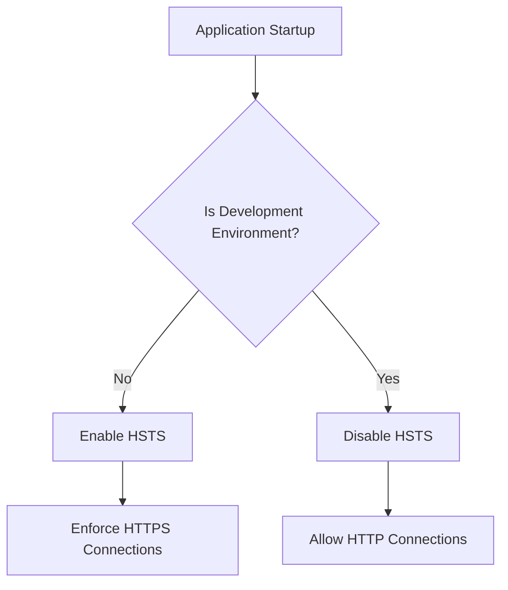
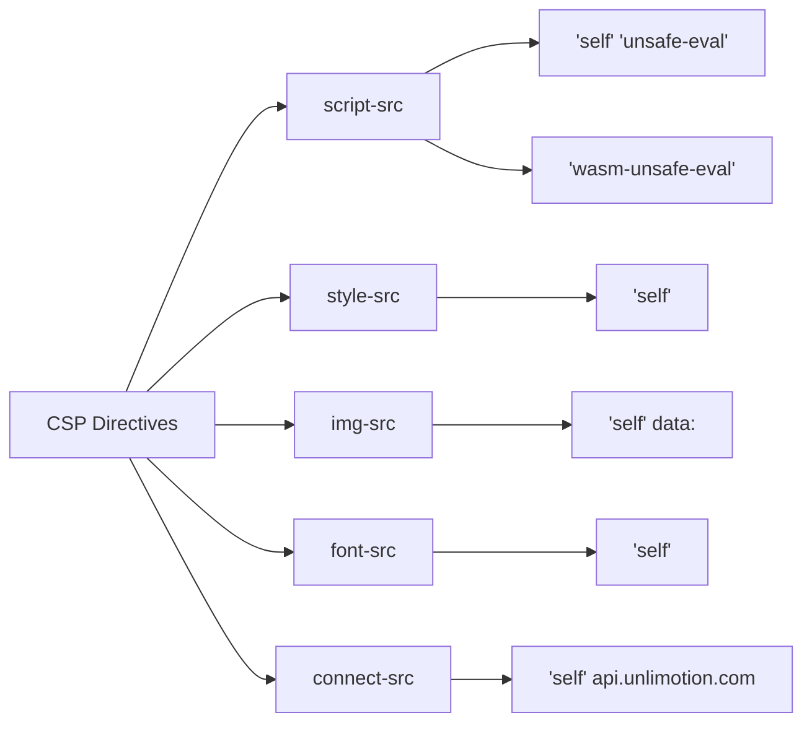
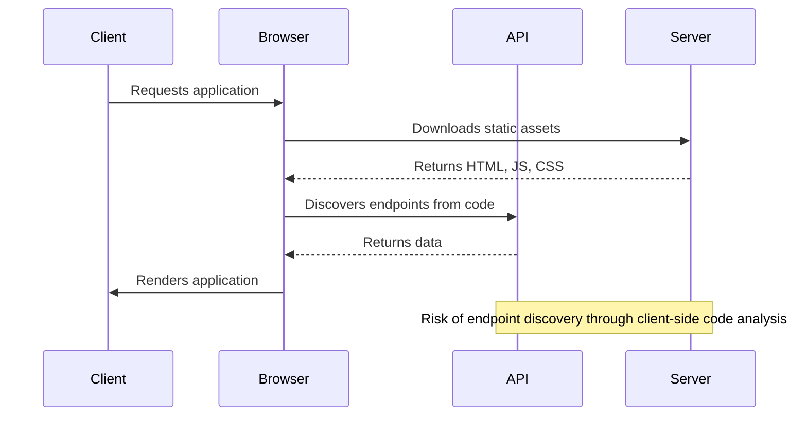
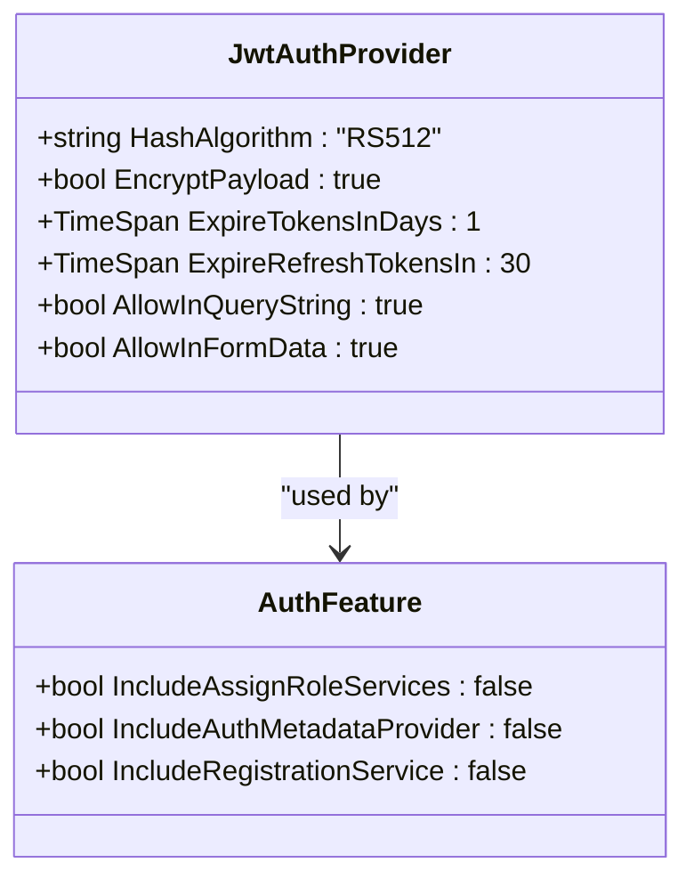

# Security Configuration

<cite>
**Referenced Files in This Document**   
- [index.html](file://src/Unlimotion.Browser/wwwroot/index.html)
- [index.html](file://src/Unlimotion.Browser/AppBundle/index.html)
- [Startup.cs](file://src/Unlimotion.Server/Startup.cs)
- [AppHost.cs](file://src/Unlimotion.Server/AppHost.cs)
- [appsettings.json](file://src/Unlimotion.Server/appsettings.json)
- [launchSettings.json](file://src/Unlimotion.Server/Properties/launchSettings.json)
- [Dockerfile](file://src/Unlimotion.Server/Dockerfile)
- [Program.cs](file://src/Unlimotion.Server/Program.cs)
</cite>

## Table of Contents
1. [Introduction](#introduction)
2. [Security Headers Configuration](#security-headers-configuration)
3. [Content Security Policy for Blazor WebAssembly](#content-security-policy-for-blazor-webassembly)
4. [Client-Side Security Risks](#client-side-security-risks)
5. [Secure Server Configuration](#secure-server-configuration)
6. [Web Server Configuration Templates](#web-server-configuration-templates)
7. [Security Audits and Maintenance](#security-audits-and-maintenance)
8. [Conclusion](#conclusion)

## Introduction
The Unlimotion web application is a Blazor WebAssembly application that requires comprehensive security configuration to protect against common web vulnerabilities. This document provides detailed guidance on implementing essential security headers, configuring Content Security Policy (CSP) for the Blazor runtime, addressing client-side security risks, and establishing secure server configurations. The application uses ServiceStack for authentication with JWT tokens and RavenDB for data storage, with specific security considerations for both development and production environments.

## Security Headers Configuration
The Unlimotion server implements several critical security headers to enhance application security. The configuration is primarily managed through the Startup.cs and AppHost.cs files, with specific security features enabled based on the environment.

The server automatically applies HTTP Strict Transport Security (HSTS) in non-development environments, ensuring that browsers only connect via HTTPS after the initial visit. This is implemented in the Configure method of Startup.cs:



**Diagram sources**
- [Startup.cs](file://src/Unlimotion.Server/Startup.cs#L45-L50)

The application also implements CORS (Cross-Origin Resource Sharing) through the ServiceStack CorsFeature, allowing specific headers while restricting unauthorized cross-origin requests. The configured allowed headers include "Content-Type,Authorization,x-client-version", which are essential for API communication while minimizing exposure to unnecessary headers that could be exploited.

Additional security measures include:
- X-Content-Type-Options: Prevents MIME type sniffing by instructing browsers to use the declared content type
- Automatic exception handling that prevents detailed error information from being exposed to clients
- JWT token encryption with RS512 algorithm and payload encryption

**Section sources**
- [Startup.cs](file://src/Unlimotion.Server/Startup.cs#L45-L50)
- [AppHost.cs](file://src/Unlimotion.Server/AppHost.cs#L69-L78)

## Content Security Policy for Blazor WebAssembly
Configuring Content Security Policy (CSP) for the Unlimotion Blazor WebAssembly application requires careful consideration to balance security with the framework's requirements. The application's index.html files in both the AppBundle and wwwroot directories provide insight into the necessary CSP configuration.

The Blazor WebAssembly runtime requires specific permissions that must be included in the CSP header:



Key CSP directives required for Unlimotion:
- **script-src**: Must include 'self', 'unsafe-eval', and 'wasm-unsafe-eval' to allow the Blazor WebAssembly runtime to function properly
- **style-src**: 'self' to allow local CSS files
- **img-src**: 'self' and data: to allow local images and data URLs
- **font-src**: 'self' for local fonts
- **connect-src**: 'self' and API endpoints for backend communication

The application preload modules in the AppBundle index.html indicate that module preloading is used, which should be reflected in the CSP configuration with appropriate module-src directives.

To prevent XSS attacks while maintaining functionality:
1. Avoid inline scripts and styles in HTML templates
2. Use external JavaScript files instead of inline event handlers
3. Implement proper input validation and output encoding
4. Configure CSP to block unsafe-inline and unsafe-hashes where possible

The current implementation uses modulepreload links for main.js, dotnet.js, and avalonia.js, which should be accounted for in the CSP policy.

**Section sources**
- [index.html](file://src/Unlimotion.Browser/AppBundle/index.html#L7-L10)
- [index.html](file://src/Unlimotion.Browser/wwwroot/index.html#L27)

## Client-Side Security Risks
The Unlimotion Blazor WebAssembly application faces several client-side security risks that require specific mitigation strategies.

### Data Exposure in Static Files
Static files in the wwwroot directory, including configuration files and application assets, may contain sensitive information. The current implementation exposes:
- Application structure through file names and directory organization
- Third-party library versions in script references
- Potential configuration details in HTML files

Mitigation strategies:
- Implement file integrity checks for critical assets
- Use environment-specific configurations that don't expose sensitive data
- Minify and obfuscate client-side code in production
- Implement proper access controls for static files

### API Endpoint Leakage
The application's client-side code may inadvertently expose API endpoints and their structure. The ServiceStack integration with OpenApiFeature enables API documentation, which should be properly secured:



**Diagram sources**
- [AppHost.cs](file://src/Unlimotion.Server/AppHost.cs#L104-L121)
- [Startup.cs](file://src/Unlimotion.Server/Startup.cs#L58-L62)

### Dependency Vulnerabilities
The application relies on several third-party dependencies that may introduce security vulnerabilities:
- ServiceStack for API services and authentication
- RavenDB for data storage
- Avalonia UI framework components
- .NET 8.0 runtime

Regular dependency updates are critical to address known vulnerabilities. The Dockerfile specifies the use of .NET 8.0 images, which should be regularly updated to include security patches.

Additional client-side risks include:
- JWT token storage in browser storage (potential XSS theft)
- Insecure token transmission if HTTPS is not enforced
- Insufficient input validation on client-side forms
- Information disclosure through error messages

**Section sources**
- [AppHost.cs](file://src/Unlimotion.Server/AppHost.cs#L80-L102)
- [appsettings.json](file://src/Unlimotion.Server/appsettings.json#L15-L25)
- [Dockerfile](file://src/Unlimotion.Server/Dockerfile#L1-L5)

## Secure Server Configuration
The Unlimotion server implementation includes several security configurations that must be properly maintained in production environments.

### Authentication and Authorization
The application uses JWT-based authentication with the following security characteristics:
- RS512 algorithm for token signing
- Encrypted token payloads
- 1-day expiration for access tokens
- 30-day expiration for refresh tokens
- Support for token transmission in query strings and form data

The private key for JWT signing is stored in appsettings.json, which represents a security risk if the file is exposed. In production, this should be moved to a secure key management system.



**Diagram sources**
- [AppHost.cs](file://src/Unlimotion.Server/AppHost.cs#L80-L102)
- [AppHost.cs](file://src/Unlimotion.Server/AppHost.cs#L104-L121)

### Environment-Specific Security
The application differentiates security settings between development and production environments:
- HSTS is disabled in development but enabled in production
- JWT secure connection requirement is disabled in development
- Detailed error pages are shown in development but not in production

The launchSettings.json file reveals that development environments allow unsecured access to RavenDB with the RAVEN_Security_UnsecuredAccessAllowed environment variable set to "PublicNetwork". This setting must be removed in production.

### Data Protection
The application uses RavenDB with revision tracking enabled, retaining document revisions for 7 days. This provides some protection against data tampering but should be supplemented with additional backup and audit mechanisms.

**Section sources**
- [AppHost.cs](file://src/Unlimotion.Server/AppHost.cs#L80-L102)
- [appsettings.json](file://src/Unlimotion.Server/appsettings.json#L15-L25)
- [launchSettings.json](file://src/Unlimotion.Server/Properties/launchSettings.json#L20-L23)

## Web Server Configuration Templates
The following configuration templates provide secure hosting options for the Unlimotion application on major web servers and platforms.

### Nginx Configuration
```nginx
server {
    listen 443 ssl http2;
    server_name unlimotion.example.com;
    
    ssl_certificate /path/to/certificate.crt;
    ssl_certificate_key /path/to/private.key;
    
    # Security headers
    add_header Strict-Transport-Security "max-age=31536000; includeSubDomains" always;
    add_header X-Content-Type-Options "nosniff" always;
    add_header X-Frame-Options "DENY" always;
    add_header X-XSS-Protection "1; mode=block" always;
    
    # Content Security Policy for Blazor WebAssembly
    add_header Content-Security-Policy "default-src 'self'; script-src 'self' 'unsafe-eval' 'wasm-unsafe-eval'; style-src 'self'; img-src 'self' data:; font-src 'self'; connect-src 'self'; object-src 'none'; base-uri 'self'; frame-ancestors 'none';";
    
    location / {
        root /var/www/unlimotion;
        try_files $uri $uri/ /index.html;
    }
    
    # API proxy
    location /api/ {
        proxy_pass http://localhost:5004;
        proxy_http_version 1.1;
        proxy_set_header Upgrade $http_upgrade;
        proxy_set_header Connection 'upgrade';
        proxy_set_header Host $host;
        proxy_set_header X-Real-IP $remote_addr;
        proxy_set_header X-Forwarded-For $proxy_add_x_forwarded_for;
        proxy_set_header X-Forwarded-Proto $scheme;
        proxy_cache_bypass $http_upgrade;
    }
}
```

### Apache Configuration
```apache
<VirtualHost *:443>
    ServerName unlimotion.example.com
    
    SSLEngine on
    SSLCertificateFile /path/to/certificate.crt
    SSLCertificateKeyFile /path/to/private.key
    
    # Security headers
    Header always set Strict-Transport-Security "max-age=31536000; includeSubDomains"
    Header always set X-Content-Type-Options "nosniff"
    Header always set X-Frame-Options "DENY"
    Header always set X-XSS-Protection "1; mode=block"
    
    # Content Security Policy for Blazor WebAssembly
    Header always set Content-Security-Policy "default-src 'self'; script-src 'self' 'unsafe-eval' 'wasm-unsafe-eval'; style-src 'self'; img-src 'self' data:; font-src 'self'; connect-src 'self'; object-src 'none'; base-uri 'self'; frame-ancestors 'none';"
    
    DocumentRoot /var/www/unlimotion
    
    <Directory "/var/www/unlimotion">
        AllowOverride None
        Require all granted
        Options FollowSymLinks
        DirectoryIndex index.html
        
        RewriteEngine On
        RewriteCond %{REQUEST_FILENAME} !-f
        RewriteCond %{REQUEST_FILENAME} !-d
        RewriteRule ^ index.html [L]
    </Directory>
    
    # API proxy
    ProxyPreserveHost On
    ProxyPass /api/ http://localhost:5004/
    ProxyPassReverse /api/ http://localhost:5004/
</VirtualHost>
```

### Docker Configuration
The existing Dockerfile should be enhanced with security best practices:

```dockerfile
# Use minimal base image
FROM mcr.microsoft.com/dotnet/aspnet:8.0-alpine AS base
WORKDIR /app
EXPOSE 5004
EXPOSE 5005

# Build stage
FROM mcr.microsoft.com/dotnet/sdk:8.0 AS build
WORKDIR /src
COPY ["Unlimotion.Server/Unlimotion.Server.csproj", "Unlimotion.Server/"]
COPY ["Unlimotion.Interface/Unlimotion.Interface.csproj", "Unlimotion.Interface/"]
COPY ["Unlimotion.Server.ServiceInterface/Unlimotion.Server.ServiceInterface.csproj", "Unlimotion.Server.ServiceInterface/"]
COPY ["Unlimotion.Server.ServiceModel/Unlimotion.Server.ServiceModel.csproj", "Unlimotion.Server.ServiceModel/"]
COPY ["Unlimotion.Server.Domain/Unlimotion.Server.Domain.csproj", "Unlimotion.Server.Domain/"]
RUN dotnet restore "Unlimotion.Server/Unlimotion.Server.csproj"
COPY . .
WORKDIR "/src/Unlimotion.Server"
RUN dotnet build "Unlimotion.Server.csproj" -c Release -o /app/build

# Publish stage
FROM build AS publish
RUN dotnet publish "Unlimotion.Server.csproj" -c Release -o /app/publish

# Final stage
FROM base AS final
WORKDIR /app
COPY --from=publish /app/publish .

# Create non-root user
RUN addgroup -g 1001 -S appuser && \
    adduser -u 1001 -S appuser -G appuser
USER appuser

ENTRYPOINT ["dotnet", "Unlimotion.Server.dll"]
```

### Azure App Service Configuration
For Azure App Service deployment:
1. Enable HTTPS-only connections
2. Configure custom domain with TLS/SSL
3. Set application settings:
   - ASPNETCORE_ENVIRONMENT: Production
   - Security:RequireSecureConnection: true
4. Enable authentication/authorization with Azure AD if needed
5. Configure application insights for monitoring

**Section sources**
- [Dockerfile](file://src/Unlimotion.Server/Dockerfile#L1-L28)
- [appsettings.json](file://src/Unlimotion.Server/appsettings.json#L15-L25)

## Security Audits and Maintenance
Regular security audits and maintenance are essential for maintaining the security posture of the Unlimotion application.

### Regular Security Audits
Conduct comprehensive security audits quarterly with the following components:
- Static code analysis using security-focused tools
- Dynamic application security testing (DAST)
- Dependency vulnerability scanning
- Configuration review against security benchmarks
- Penetration testing by external security experts

Specific audit checklist:
- Verify all endpoints require authentication where appropriate
- Test for common OWASP Top 10 vulnerabilities
- Validate input validation and output encoding
- Check for sensitive data exposure in client-side code
- Review JWT token handling and storage
- Verify proper error handling that doesn't leak information

### Dependency Updates
Implement a regular dependency update process:
1. Monitor for security advisories in all dependencies
2. Update .NET runtime and framework components monthly
3. Update ServiceStack, RavenDB, and other third-party libraries promptly when security patches are released
4. Use automated tools like Dependabot or Renovate to track dependency updates

### Penetration Testing
Schedule annual penetration testing with the following focus areas:
- Authentication and session management
- API security and authorization bypass
- XSS and injection vulnerabilities
- File upload and processing security
- Business logic vulnerabilities
- Data exposure risks

Additional maintenance tasks:
- Rotate JWT signing keys annually
- Review and update security headers as browser standards evolve
- Monitor security logs for suspicious activity
- Conduct security training for development team members
- Maintain an incident response plan for security breaches

**Section sources**
- [AppHost.cs](file://src/Unlimotion.Server/AppHost.cs#L80-L102)
- [appsettings.json](file://src/Unlimotion.Server/appsettings.json#L15-L25)
- [Program.cs](file://src/Unlimotion.Server/Program.cs#L1-L50)

## Conclusion
The Unlimotion web application requires comprehensive security configuration to protect against modern web threats. By implementing the recommended security headers, properly configuring Content Security Policy for the Blazor WebAssembly runtime, addressing client-side security risks, and maintaining secure server configurations, the application can achieve a strong security posture. Regular security audits, dependency updates, and penetration testing are essential for maintaining security over time. The configuration templates provided offer secure hosting options for various platforms, ensuring consistent security across deployment environments.