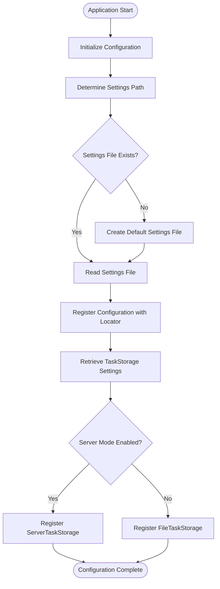
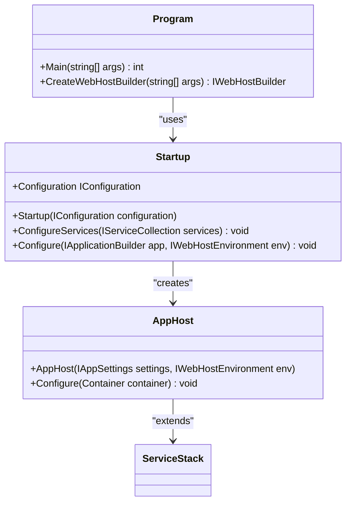
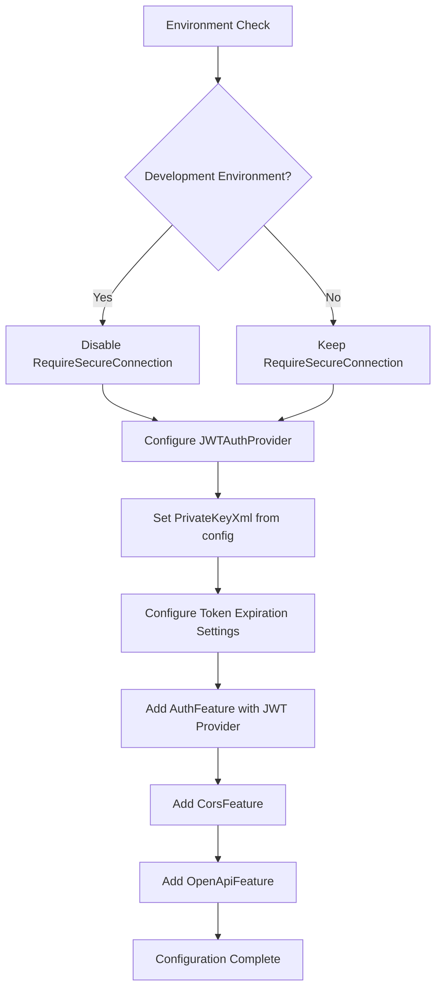
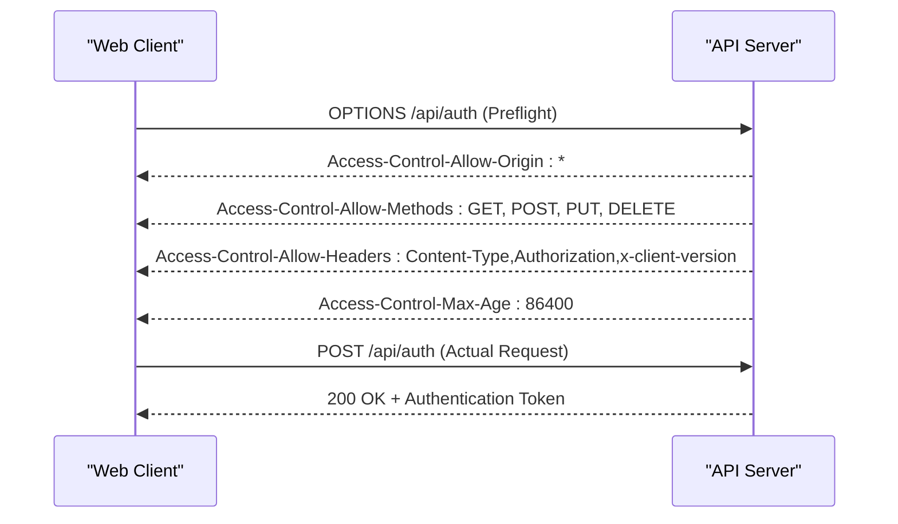
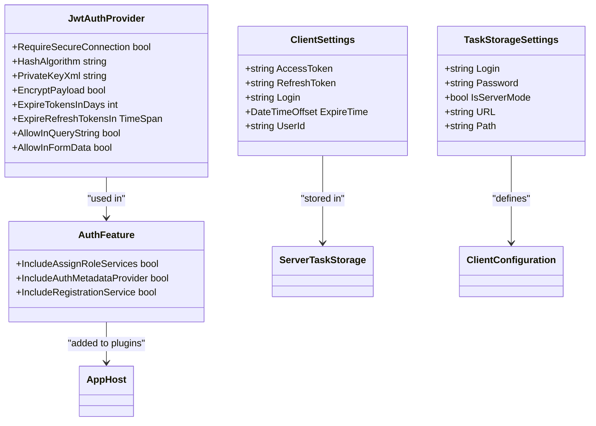
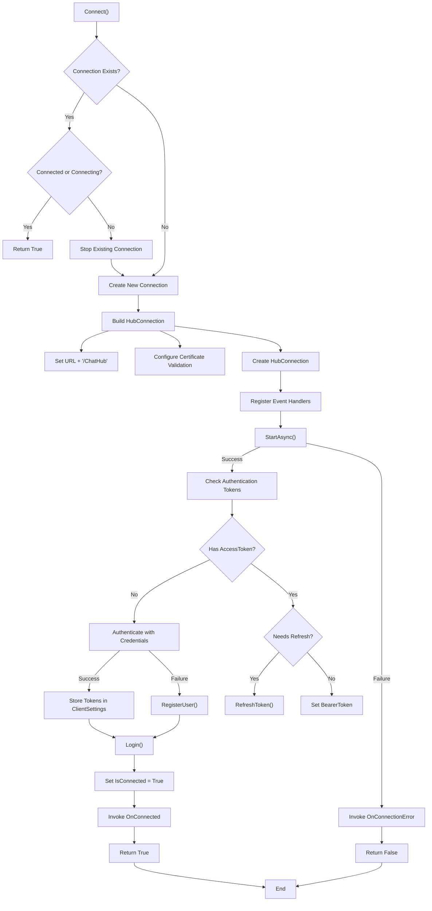
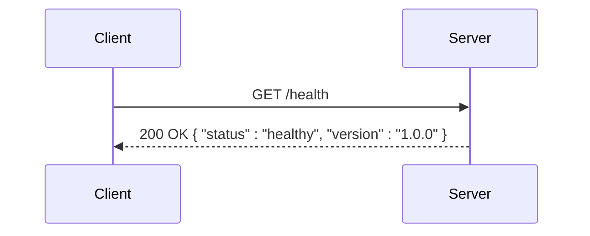
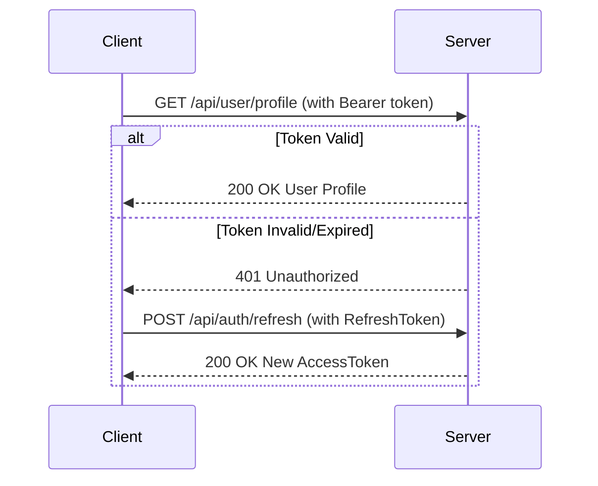
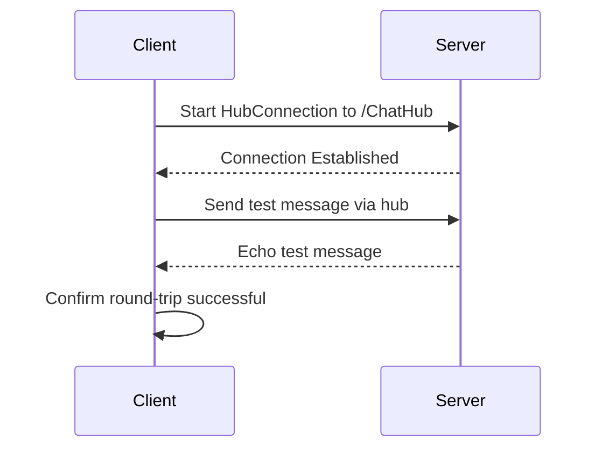

# Server API Connection

<cite>
**Referenced Files in This Document**   
- [Program.cs](file://src/Unlimotion.Browser/Program.cs)
- [Program.cs](file://src/Unlimotion.Desktop/Program.cs)
- [Program.cs](file://src/Unlimotion.Server/Program.cs)
- [Startup.cs](file://src/Unlimotion.Server/Startup.cs)
- [AppHost.cs](file://src/Unlimotion.Server/AppHost.cs)
- [AppSettings.cs](file://src/Unlimotion.Server/AppSettings.cs)
- [ServerTaskStorage.cs](file://src/Unlimotion/ServerTaskStorage.cs)
- [TaskStorages.cs](file://src/Unlimotion/TaskStorages.cs)
- [TaskStorageSettings.cs](file://src/Unlimotion.ViewModel/TaskStorageSettings.cs)
- [ClientSettings.cs](file://src/Unlimotion/ClientSettings.cs)
- [appsettings.json](file://src/Unlimotion.Server/appsettings.json)
- [appsettings.Development.json](file://src/Unlimotion.Server/appsettings.Development.json)
</cite>

## Table of Contents
1. [Introduction](#introduction)
2. [Client Configuration Process](#client-configuration-process)
3. [Server API Configuration](#server-api-configuration)
4. [Environment-Specific Configuration](#environment-specific-configuration)
5. [CORS Configuration](#cors-configuration)
6. [Authentication and Security](#authentication-and-security)
7. [Connection Flow and Error Handling](#connection-flow-and-error-handling)
8. [Troubleshooting Common Issues](#troubleshooting-common-issues)
9. [API Connection Testing](#api-connection-testing)
10. [Conclusion](#conclusion)

## Introduction
This document details the configuration and connection process between the Unlimotion web client and server API. It explains how the client reads configuration to determine the API endpoint URL and authentication settings, covers environment-specific configurations for development, staging, and production deployments, and provides guidance on CORS configuration, authentication, and troubleshooting common connection issues.

**Section sources**
- [Program.cs](file://src/Unlimotion.Browser/Program.cs#L1-L52)
- [Program.cs](file://src/Unlimotion.Desktop/Program.cs#L1-L94)

## Client Configuration Process

The Unlimotion client applications (both browser and desktop versions) follow a standardized configuration process to establish connections with the server API. The configuration is primarily managed through JSON configuration files and programmatic initialization in the `Program.cs` files.

In the browser client, the `Program.cs` file initializes the application by creating a writable JSON configuration from a settings file stored in the user's application data directory. The configuration is registered with the service locator for dependency injection throughout the application.

**Diagram sources**
- [Program.cs](file://src/Unlimotion.Browser/Program.cs#L1-L52)
- [TaskStorages.cs](file://src/Unlimotion/TaskStorages.cs#L129-L163)

The `TaskStorageSettings` class defines the configuration structure for both file-based and server-based storage, including properties for the storage path, URL, login credentials, and mode selection.

**Section sources**
- [TaskStorageSettings.cs](file://src/Unlimotion.ViewModel/TaskStorageSettings.cs#L1-L34)
- [TaskStorages.cs](file://src/Unlimotion/TaskStorages.cs#L129-L163)

## Server API Configuration

The Unlimotion server API is configured through the `Program.cs` and `Startup.cs` files, which follow the ASP.NET Core hosting model. The server configuration includes setting up the web host, configuring services, and establishing the application pipeline.

The `Program.cs` file in the server project creates a web host builder that uses the `Startup` class for configuration and adds a writable JSON configuration source for the `appsettings.json` file. This allows runtime modifications to the configuration.

**Diagram sources**
- [Program.cs](file://src/Unlimotion.Server/Program.cs#L1-L50)
- [Startup.cs](file://src/Unlimotion.Server/Startup.cs#L1-L63)
- [AppHost.cs](file://src/Unlimotion.Server/AppHost.cs#L1-L122)

The `Startup` class configures essential services including RavenDB, SignalR, and AutoMapper, while the `AppHost` class (from ServiceStack) handles authentication, CORS, and other API features.

**Section sources**
- [Program.cs](file://src/Unlimotion.Server/Program.cs#L1-L50)
- [Startup.cs](file://src/Unlimotion.Server/Startup.cs#L1-L63)

## Environment-Specific Configuration

Unlimotion supports environment-specific configuration through multiple configuration files and conditional logic. The primary configuration file `appsettings.json` contains default settings, while `appsettings.Development.json` provides overrides for development environments.

The server configuration includes environment-specific settings for logging, security requirements, and authentication. In development mode, the JWT authentication provider disables the requirement for secure connections, allowing HTTP connections for easier debugging.

**Diagram sources**
- [AppHost.cs](file://src/Unlimotion.Server/AppHost.cs#L69-L121)
- [appsettings.json](file://src/Unlimotion.Server/appsettings.json#L1-L45)
- [appsettings.Development.json](file://src/Unlimotion.Server/appsettings.Development.json#L1-L9)

The client applications also support environment-specific behavior, with different default storage paths and configuration locations for debug and release builds.

**Section sources**
- [AppHost.cs](file://src/Unlimotion.Server/AppHost.cs#L69-L121)
- [appsettings.json](file://src/Unlimotion.Server/appsettings.json#L1-L45)
- [appsettings.Development.json](file://src/Unlimotion.Server/appsettings.Development.json#L1-L9)

## CORS Configuration

Cross-Origin Resource Sharing (CORS) is configured on the Unlimotion server to allow secure cross-origin requests from client applications. The CORS settings are implemented using ServiceStack's `CorsFeature` plugin, which is added to the application plugins in the `AppHost` class.

The CORS configuration allows specific headers including "Content-Type", "Authorization", and "x-client-version", enabling the client to send authentication tokens and version information with requests. This configuration is essential for the web client to communicate with the server API when hosted on different domains or ports.

**Diagram sources**
- [AppHost.cs](file://src/Unlimotion.Server/AppHost.cs#L69-L78)
- [Startup.cs](file://src/Unlimotion.Server/Startup.cs#L45-L62)

The server allows all hosts ("*") through the "AllowedHosts" setting in `appsettings.json`, making it accessible from any origin. This setting should be restricted in production environments to specific trusted domains for enhanced security.

**Section sources**
- [AppHost.cs](file://src/Unlimotion.Server/AppHost.cs#L69-L78)
- [appsettings.json](file://src/Unlimotion.Server/appsettings.json#L44-L45)

## Authentication and Security

Unlimotion implements JWT-based authentication with RSA512 encryption for secure API access. The authentication system is configured in the `AppHost` class, which sets up a `JwtAuthProvider` with specific security parameters.

The server uses asymmetric encryption with a private key defined in the configuration to sign JWT tokens. The private key is stored in XML format within the `appsettings.json` file under the "Security:PrivateKeyXml" path. This key should be rotated and protected in production environments.

**Diagram sources**
- [AppHost.cs](file://src/Unlimotion.Server/AppHost.cs#L80-L102)
- [ServerTaskStorage.cs](file://src/Unlimotion/ServerTaskStorage.cs#L20-L41)
- [TaskStorageSettings.cs](file://src/Unlimotion.ViewModel/TaskStorageSettings.cs#L1-L34)

Client authentication follows a token-based workflow where the client first attempts to use stored access and refresh tokens. If these are unavailable or expired, the client authenticates with username and password credentials stored in the configuration.

**Section sources**
- [AppHost.cs](file://src/Unlimotion.Server/AppHost.cs#L80-L102)
- [ServerTaskStorage.cs](file://src/Unlimotion/ServerTaskStorage.cs#L206-L236)

## Connection Flow and Error Handling

The connection process between the Unlimotion client and server follows a well-defined flow with comprehensive error handling and automatic reconnection capabilities. The `ServerTaskStorage` class manages the connection lifecycle, including initialization, authentication, and reconnection logic.

When the client connects to the server, it follows this sequence:
1. Establish a SignalR hub connection to the server
2. Check for existing authentication tokens
3. Refresh expired tokens if needed
4. Authenticate with credentials if no valid tokens exist
5. Register event handlers for real-time updates

**Diagram sources**
- [ServerTaskStorage.cs](file://src/Unlimotion/ServerTaskStorage.cs#L200-L399)
- [TaskStorages.cs](file://src/Unlimotion/TaskStorages.cs#L129-L163)

The connection implementation includes automatic reconnection logic that triggers when the connection is lost. The client attempts to reconnect with random delays between 2-6 seconds, preventing thundering herd problems during network outages.

**Section sources**
- [ServerTaskStorage.cs](file://src/Unlimotion/ServerTaskStorage.cs#L200-L399)

## Troubleshooting Common Issues

This section provides guidance for diagnosing and resolving common connection issues between the Unlimotion client and server.

### CORS Errors
CORS (Cross-Origin Resource Sharing) errors typically manifest as browser console errors when the client cannot access the server API. Common symptoms include:
- "Access to fetch at 'http://localhost:5000/api' from origin 'http://localhost:8080' has been blocked by CORS policy"
- "No 'Access-Control-Allow-Origin' header is present on the requested resource"

To resolve CORS issues:
1. Verify the server is running and accessible
2. Check that the `CorsFeature` is properly configured in `AppHost.cs`
3. Ensure the client is sending allowed headers (Content-Type, Authorization, x-client-version)
4. Confirm the server's "AllowedHosts" setting permits the client origin

### Network Timeouts
Network timeout issues may occur due to server unavailability, network connectivity problems, or firewall restrictions. Symptoms include:
- "A connection attempt failed because the connected party did not properly respond"
- "The operation was canceled" exceptions
- Long delays before connection failure

To troubleshoot network timeouts:
1. Verify the server URL in the client configuration
2. Check that the server is running on the expected port
3. Test connectivity using tools like ping or curl
4. Ensure firewalls are not blocking the connection
5. Verify the server's RavenDB instance is accessible

### Authentication Failures
Authentication failures can occur due to incorrect credentials, expired tokens, or server-side authentication issues. Common error patterns:
- "Unauthorized" (401) responses
- "Invalid credentials" messages
- Repeated authentication loops

To resolve authentication issues:
1. Verify login credentials in the TaskStorage settings
2. Clear stored tokens by deleting the ClientSettings section in the configuration
3. Check server logs for authentication errors
4. Ensure the server's private key is correctly configured
5. Verify the JWT token expiration settings match client expectations

**Section sources**
- [ServerTaskStorage.cs](file://src/Unlimotion/ServerTaskStorage.cs#L200-L399)
- [AppHost.cs](file://src/Unlimotion.Server/AppHost.cs#L80-L102)

## API Connection Testing

To test the API connection and monitor API health from the client side, developers can implement several approaches:

### Connection Health Check
Implement a simple endpoint test to verify server connectivity:

### Token Validation Test
Test authentication by attempting to access a protected endpoint:

### Real-time Connection Test
Verify SignalR connectivity by sending a test message:

These tests can be automated as part of client initialization or implemented as manual diagnostic tools in the application settings.

**Section sources**
- [ServerTaskStorage.cs](file://src/Unlimotion/ServerTaskStorage.cs#L200-L399)
- [AppHost.cs](file://src/Unlimotion.Server/AppHost.cs#L42-L121)

## Conclusion
The Unlimotion client-server connection architecture provides a robust framework for secure, real-time communication between the web client and server API. The configuration system allows flexible deployment across different environments, while the authentication and error handling mechanisms ensure reliable operation even under adverse network conditions.

Key aspects of the connection system include:
- Environment-specific configuration through JSON files
- JWT-based authentication with RSA512 encryption
- Comprehensive CORS configuration for cross-origin access
- Automatic reconnection and error recovery
- Centralized configuration management through dependency injection

For production deployments, it is recommended to:
1. Restrict CORS to specific trusted domains
2. Use HTTPS for all connections
3. Regularly rotate the JWT private key
4. Monitor server logs for authentication failures
5. Implement client-side connection health monitoring

By following these guidelines and understanding the connection architecture, developers can effectively deploy and maintain Unlimotion instances across various environments.