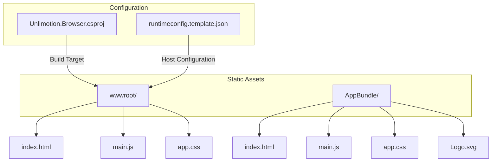
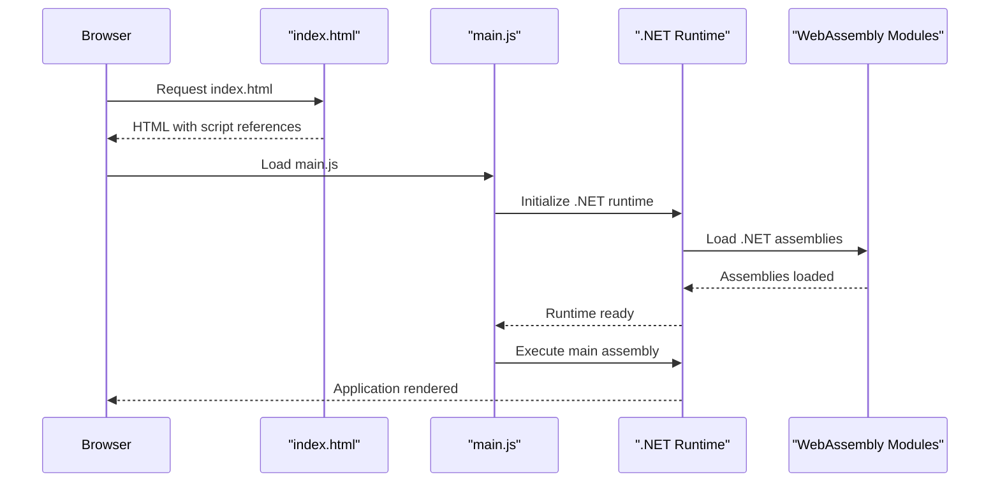
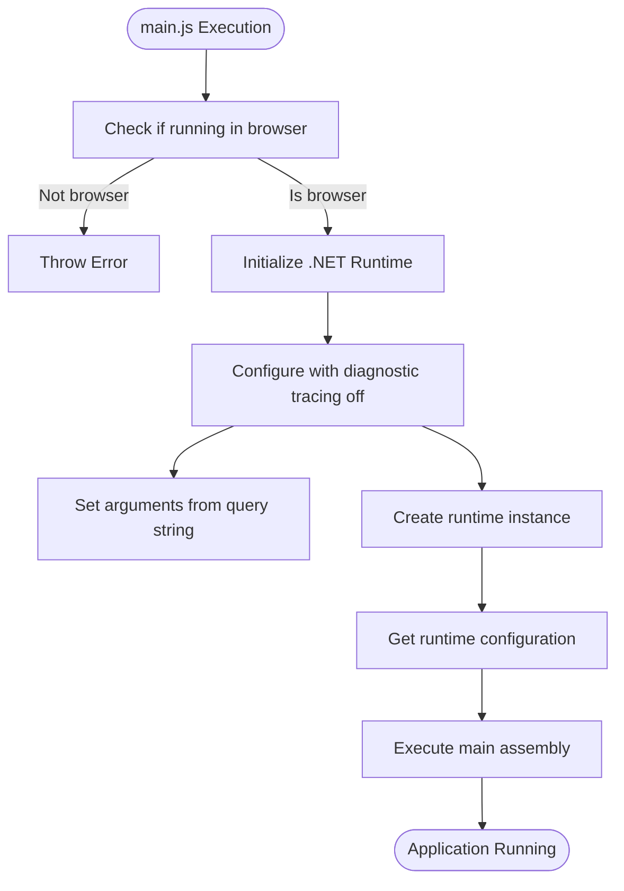
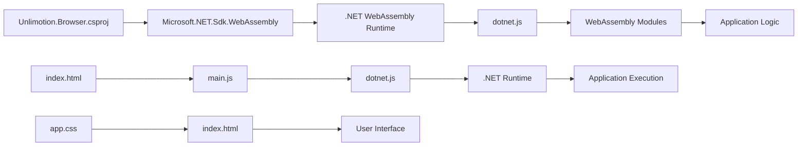

# Static File Hosting

<cite>
**Referenced Files in This Document**   
- [index.html](file://src/Unlimotion.Browser/wwwroot/index.html)
- [main.js](file://src/Unlimotion.Browser/wwwroot/main.js)
- [app.css](file://src/Unlimotion.Browser/wwwroot/app.css)
- [index.html](file://src/Unlimotion.Browser/AppBundle/index.html)
- [main.js](file://src/Unlimotion.Browser/AppBundle/main.js)
- [app.css](file://src/Unlimotion.Browser/AppBundle/app.css)
- [Unlimotion.Browser.csproj](file://src/Unlimotion.Browser/Unlimotion.Browser.csproj)
- [runtimeconfig.template.json](file://src/Unlimotion.Browser/runtimeconfig.template.json)
</cite>

## Table of Contents
1. [Introduction](#introduction)
2. [Project Structure](#project-structure)
3. [Core Components](#core-components)
4. [Architecture Overview](#architecture-overview)
5. [Detailed Component Analysis](#detailed-component-analysis)
6. [Dependency Analysis](#dependency-analysis)
7. [Performance Considerations](#performance-considerations)
8. [Troubleshooting Guide](#troubleshooting-guide)
9. [Conclusion](#conclusion)

## Introduction
This document provides comprehensive guidance for hosting static assets of the Unlimotion Blazor WebAssembly application. It details the structure and purpose of files in both wwwroot and AppBundle directories, explains the role of key components like index.html, main.js, and app.css, and provides best practices for serving WebAssembly applications in production environments.

## Project Structure

The Unlimotion Blazor WebAssembly application contains two primary directories for static assets: `wwwroot` and `AppBundle`. Both directories contain the essential files needed to bootstrap and style the application, with slight variations in their configuration and purpose.



**Diagram sources**
- [Unlimotion.Browser.csproj](file://src/Unlimotion.Browser/Unlimotion.Browser.csproj)
- [wwwroot](file://src/Unlimotion.Browser/wwwroot)
- [AppBundle](file://src/Unlimotion.Browser/AppBundle)

**Section sources**
- [Unlimotion.Browser.csproj](file://src/Unlimotion.Browser/Unlimotion.Browser.csproj#L1-L17)
- [runtimeconfig.template.json](file://src/Unlimotion.Browser/runtimeconfig.template.json#L1-L10)

## Core Components

The static asset structure of the Unlimotion Blazor WebAssembly application consists of three core components: the HTML entry point (index.html), the JavaScript bootstrapper (main.js), and the styling layer (app.css). These components work together to initialize the .NET runtime, load the WebAssembly application, and provide the initial user interface.

**Section sources**
- [index.html](file://src/Unlimotion.Browser/wwwroot/index.html#L1-L37)
- [main.js](file://src/Unlimotion.Browser/wwwroot/main.js#L1-L14)
- [app.css](file://src/Unlimotion.Browser/wwwroot/app.css#L1-L59)

## Architecture Overview

The Unlimotion Blazor WebAssembly application follows a client-side architecture where the browser downloads and executes .NET code via WebAssembly. The static assets serve as the entry point for this process, with index.html providing the structure, main.js bootstrapping the .NET runtime, and app.css styling the initial loading experience.



**Diagram sources**
- [index.html](file://src/Unlimotion.Browser/wwwroot/index.html#L1-L37)
- [main.js](file://src/Unlimotion.Browser/wwwroot/main.js#L1-L14)

## Detailed Component Analysis

### Entry Point Analysis: index.html

The index.html file serves as the entry point for the Unlimotion Blazor WebAssembly application. It contains the basic HTML structure, meta tags for responsive design, and references to the application's CSS and JavaScript files. The file initializes the splash screen that displays while the .NET runtime is loading.

In the wwwroot directory, index.html includes a simple splash screen with Avalonia UI branding, while the AppBundle version includes additional module preload directives and a different splash screen design with a logo overlay.

```mermaid
classDiagram
class index_html {
+<!DOCTYPE html>
+<title>Unlimotion.Browser</title>
+<meta charset="UTF-8">
+<meta name="viewport">
+<link rel="stylesheet" href="./app.css">
+<script type='module' src="./main.js">
}
note right of index_html
Entry point for the Blazor WebAssembly
application. Contains the DOM structure
and references to CSS/JS assets.
end note
```

**Diagram sources**
- [index.html](file://src/Unlimotion.Browser/wwwroot/index.html#L1-L37)
- [index.html](file://src/Unlimotion.Browser/AppBundle/index.html#L1-L30)

**Section sources**
- [index.html](file://src/Unlimotion.Browser/wwwroot/index.html#L1-L37)
- [index.html](file://src/Unlimotion.Browser/AppBundle/index.html#L1-L30)

### Runtime Bootstrapping: main.js

The main.js file is responsible for bootstrapping the .NET runtime in the browser environment. It imports the dotnet.js module from the .NET WebAssembly framework and initializes the runtime with diagnostic tracing disabled and application arguments from the query string.

The wwwroot version of main.js calls `runMain()` to start the application, while the AppBundle version calls `runMainAndExit()`, indicating a different execution model for the bundled application. Both versions verify they are running in a browser environment before proceeding with initialization.



**Diagram sources**
- [main.js](file://src/Unlimotion.Browser/wwwroot/main.js#L1-L14)
- [main.js](file://src/Unlimotion.Browser/AppBundle/main.js#L1-L13)

**Section sources**
- [main.js](file://src/Unlimotion.Browser/wwwroot/main.js#L1-L14)
- [main.js](file://src/Unlimotion.Browser/AppBundle/main.js#L1-L13)

### Styling Implementation: app.css

The app.css file provides styling for the application's splash screen and initial loading state. The wwwroot version includes responsive design for different color schemes (light/dark) using CSS media queries, while the AppBundle version uses CSS custom properties for safe area insets and includes additional styling for the logo overlay.

Both versions define styles for the splash screen container, text elements, and transition effects for hiding the splash screen once the application is ready. The styling ensures a consistent user experience during the application loading phase.

```mermaid
classDiagram
class app_css {
+.avalonia-splash
+.splash-close
+@media (prefers-color-scheme)
+.center
+.highlight
+.purple
+.icon
+@keyframes fadeout
}
note right of app_css
CSS styles for the splash screen and
loading state. Includes responsive
design for different color schemes
and device types.
end note
```

**Diagram sources**
- [app.css](file://src/Unlimotion.Browser/wwwroot/app.css#L1-L59)
- [app.css](file://src/Unlimotion.Browser/AppBundle/app.css#L1-L75)

**Section sources**
- [app.css](file://src/Unlimotion.Browser/wwwroot/app.css#L1-L59)
- [app.css](file://src/Unlimotion.Browser/AppBundle/app.css#L1-L75)

## Dependency Analysis

The static assets in the Unlimotion Blazor WebAssembly application have specific dependencies that must be properly configured for optimal performance. The project configuration in Unlimotion.Browser.csproj specifies the WebAssembly SDK target, which determines how the static assets are processed and served.



**Diagram sources**
- [Unlimotion.Browser.csproj](file://src/Unlimotion.Browser/Unlimotion.Browser.csproj#L1-L17)
- [index.html](file://src/Unlimotion.Browser/wwwroot/index.html#L1-L37)
- [main.js](file://src/Unlimotion.Browser/wwwroot/main.js#L1-L14)

**Section sources**
- [Unlimotion.Browser.csproj](file://src/Unlimotion.Browser/Unlimotion.Browser.csproj#L1-L17)
- [runtimeconfig.template.json](file://src/Unlimotion.Browser/runtimeconfig.template.json#L1-L10)

## Performance Considerations

For optimal performance when hosting the Unlimotion Blazor WebAssembly application, several best practices should be followed:

1. **MIME Type Configuration**: Ensure proper MIME types are configured for WebAssembly files:
   - `.wasm` files should be served with `application/wasm` MIME type
   - `.dat` files should be served with `application/octet-stream` MIME type
   - JavaScript files should be served with `application/javascript` MIME type

2. **Compression**: Enable Brotli and Gzip compression for all static assets:
   - Brotli provides better compression ratios for text-based assets
   - Gzip is widely supported and should be used as a fallback
   - WebAssembly binary files benefit significantly from compression

3. **Caching Strategy**: Implement appropriate caching headers:
   - Cache static assets (CSS, JS, images) with long expiration times
   - Use cache busting via filename hashing for versioned assets
   - Configure the service worker for offline support and cache invalidation

4. **Server Configuration Examples**:

**Nginx Configuration:**
```
location ~ \.wasm$ {
    add_header Content-Type application/wasm;
    add_header Cache-Control "public, max-age=31536000, immutable";
    gzip on;
    brotli on;
}

location ~ \.js$ {
    add_header Content-Type application/javascript;
    add_header Cache-Control "public, max-age=31536000, immutable";
    gzip on;
    brotli on;
}
```

**Apache Configuration:**
```
<FilesMatch "\.wasm$">
    Header set Content-Type "application/wasm"
    Header set Cache-Control "public, max-age=31536000, immutable"
</FilesMatch>

<FilesMatch "\.js$">
    Header set Content-Type "application/javascript"
    Header set Cache-Control "public, max-age=31536000, immutable"
</FilesMatch>
```

**IIS Configuration:**
```xml
<staticContent>
    <mimeMap fileExtension=".wasm" mimeType="application/wasm" />
    <mimeMap fileExtension=".dat" mimeType="application/octet-stream" />
</staticContent>
<httpCompression>
    <dynamicTypes>
        <add mimeType="application/wasm" enabled="true" />
    </dynamicTypes>
</httpCompression>
```

**Section sources**
- [Unlimotion.Browser.csproj](file://src/Unlimotion.Browser/Unlimotion.Browser.csproj#L1-L17)
- [wwwroot](file://src/Unlimotion.Browser/wwwroot)

## Troubleshooting Guide

When hosting the Unlimotion Blazor WebAssembly application, several common issues may arise:

1. **MIME Type Errors**: If the browser fails to load .wasm files, verify that the server is configured with the correct MIME types (application/wasm for .wasm files).

2. **CORS Issues**: When serving from a different domain than the API, ensure proper CORS headers are configured on the server.

3. **Service Worker Problems**: If updates are not being applied, check the service worker registration and cache invalidation logic.

4. **Compression Issues**: If the application loads slowly, verify that Brotli/Gzip compression is enabled and working correctly.

5. **Path Resolution**: Ensure that the base href in index.html is correctly set for the deployment environment.

**Section sources**
- [index.html](file://src/Unlimotion.Browser/wwwroot/index.html#L1-L37)
- [main.js](file://src/Unlimotion.Browser/wwwroot/main.js#L1-L14)
- [Unlimotion.Browser.csproj](file://src/Unlimotion.Browser/Unlimotion.Browser.csproj#L1-L17)

## Conclusion

The Unlimotion Blazor WebAssembly application's static assets are structured to provide an optimal loading experience while maintaining flexibility for different deployment scenarios. The wwwroot and AppBundle directories serve similar purposes but with slight variations in their configuration, likely targeting different deployment environments or use cases.

Proper hosting of these static assets requires attention to MIME type configuration, compression settings, caching strategies, and server configuration. By following the best practices outlined in this document, administrators can ensure optimal performance and reliability when deploying the Unlimotion application in production environments.