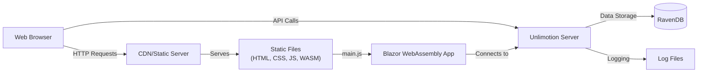
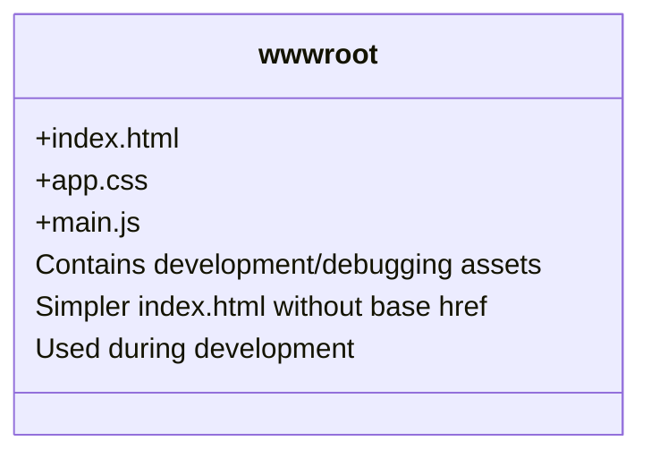
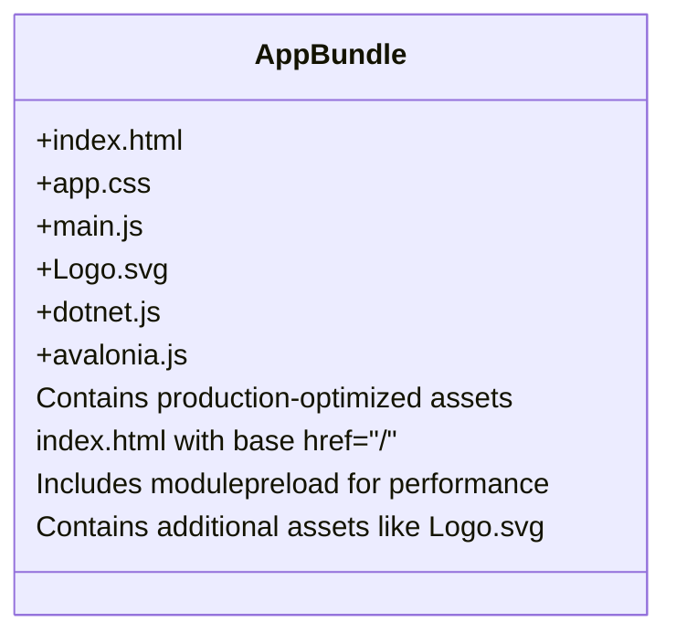
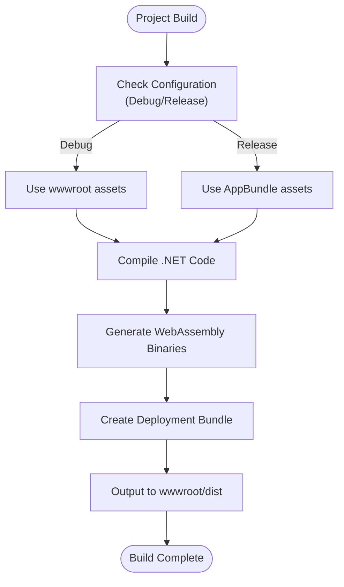
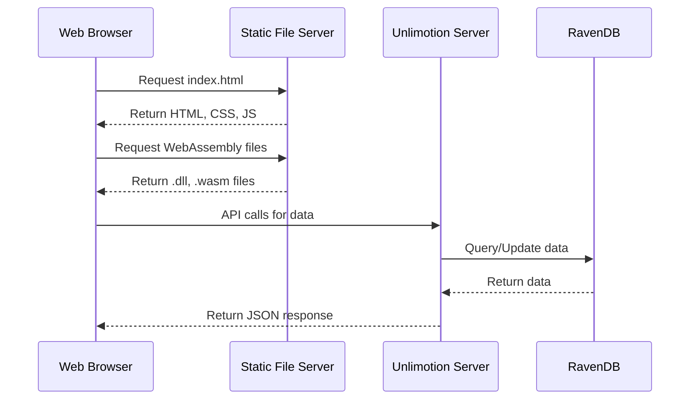
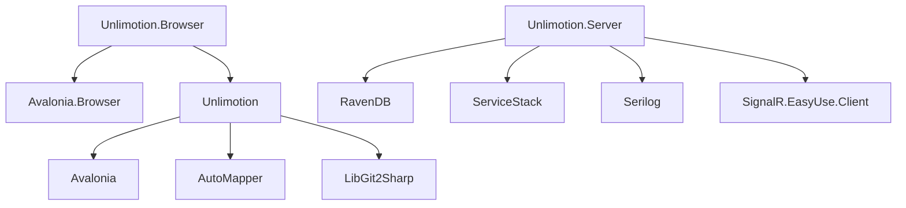

# Web Application Hosting

<cite>
**Referenced Files in This Document**   
- [index.html](file://src/Unlimotion.Browser/wwwroot/index.html)
- [app.css](file://src/Unlimotion.Browser/wwwroot/app.css)
- [main.js](file://src/Unlimotion.Browser/wwwroot/main.js)
- [index.html](file://src/Unlimotion.Browser/AppBundle/index.html)
- [app.css](file://src/Unlimotion.Browser/AppBundle/app.css)
- [main.js](file://src/Unlimotion.Browser/AppBundle/main.js)
- [Unlimotion.Browser.csproj](file://src/Unlimotion.Browser/Unlimotion.Browser.csproj)
- [launchSettings.json](file://src/Unlimotion.Browser/Properties/launchSettings.json)
- [runtimeconfig.template.json](file://src/Unlimotion.Browser/runtimeconfig.template.json)
- [Program.cs](file://src/Unlimotion.Server/Program.cs)
- [appsettings.json](file://src/Unlimotion.Server/appsettings.json)
</cite>

## Table of Contents
1. [Introduction](#introduction)
2. [Project Structure](#project-structure)
3. [Core Components](#core-components)
4. [Architecture Overview](#architecture-overview)
5. [Detailed Component Analysis](#detailed-component-analysis)
6. [Dependency Analysis](#dependency-analysis)
7. [Performance Considerations](#performance-considerations)
8. [Troubleshooting Guide](#troubleshooting-guide)
9. [Conclusion](#conclusion)

## Introduction
This document provides comprehensive hosting documentation for the Unlimotion web application, a Blazor WebAssembly application built with Avalonia UI. The documentation covers the static file structure, build outputs, server configuration, and deployment strategies for hosting the application on various platforms.

## Project Structure
The Unlimotion application follows a multi-project structure with distinct components for different platforms. The web client is implemented in the Unlimotion.Browser project, which contains the static assets in both the wwwroot and AppBundle directories. These directories contain the essential files for the web application: index.html, app.css, and main.js.

```mermaid
graph TB
subgraph "Unlimotion.Browser"
wwwroot[wwwroot/]
AppBundle[AppBundle/]
wwwroot --> index1["index.html"]
wwwroot --> appcss1["app.css"]
wwwroot --> mainjs1["main.js"]
AppBundle --> index2["index.html"]
AppBundle --> appcss2["app.css"]
AppBundle --> mainjs2["main.js"]
end
subgraph "Configuration"
csproj["Unlimotion.Browser.csproj"]
launchSettings["launchSettings.json"]
runtimeconfig["runtimeconfig.template.json"]
end
subgraph "Server"
Server["Unlimotion.Server"]
Program["Program.cs"]
appsettings["appsettings.json"]
end
csproj --> |Build Configuration| wwwroot
csproj --> |Build Output| AppBundle
Server --> |API Endpoint| Unlimotion.Browser
```

**Diagram sources**
- [Unlimotion.Browser.csproj](file://src/Unlimotion.Browser/Unlimotion.Browser.csproj)
- [wwwroot](file://src/Unlimotion.Browser/wwwroot/)
- [AppBundle](file://src/Unlimotion.Browser/AppBundle/)

**Section sources**
- [Unlimotion.Browser.csproj](file://src/Unlimotion.Browser/Unlimotion.Browser.csproj)
- [wwwroot](file://src/Unlimotion.Browser/wwwroot/)
- [AppBundle](file://src/Unlimotion.Browser/AppBundle/)

## Core Components
The core components of the Unlimotion web application hosting structure include the static asset files in both wwwroot and AppBundle directories, the project configuration in Unlimotion.Browser.csproj, and the server configuration files. These components work together to enable the Blazor WebAssembly application to be hosted and served correctly.

**Section sources**
- [index.html](file://src/Unlimotion.Browser/wwwroot/index.html)
- [app.css](file://src/Unlimotion.Browser/wwwroot/app.css)
- [main.js](file://src/Unlimotion.Browser/wwwroot/main.js)
- [Unlimotion.Browser.csproj](file://src/Unlimotion.Browser/Unlimotion.Browser.csproj)

## Architecture Overview
The Unlimotion application follows a client-server architecture where the Blazor WebAssembly client is served as static files, while the backend server provides API endpoints for data storage and retrieval. The client is built using the .NET WebAssembly SDK with Avalonia UI framework, enabling rich client-side functionality.



**Diagram sources**
- [Unlimotion.Browser.csproj](file://src/Unlimotion.Browser/Unlimotion.Browser.csproj)
- [Program.cs](file://src/Unlimotion.Server/Program.cs)
- [appsettings.json](file://src/Unlimotion.Server/appsettings.json)

## Detailed Component Analysis

### Static Asset Structure
The Unlimotion.Browser project contains two directories for static assets: wwwroot and AppBundle. Both directories contain the same set of core files (index.html, app.css, and main.js) but with different configurations for different deployment scenarios.

#### wwwroot Directory
The wwwroot directory contains the development and debugging version of the application files. The index.html file in this directory is simpler and does not include the base href attribute, making it suitable for development environments.



**Diagram sources**
- [index.html](file://src/Unlimotion.Browser/wwwroot/index.html)
- [app.css](file://src/Unlimotion.Browser/wwwroot/app.css)
- [main.js](file://src/Unlimotion.Browser/wwwroot/main.js)

#### AppBundle Directory
The AppBundle directory contains the production-optimized version of the application files. The index.html file includes the base href="/" attribute and modulepreload links for better performance in production environments.



**Diagram sources**
- [index.html](file://src/Unlimotion.Browser/AppBundle/index.html)
- [app.css](file://src/Unlimotion.Browser/AppBundle/app.css)
- [main.js](file://src/Unlimotion.Browser/AppBundle/main.js)

**Section sources**
- [index.html](file://src/Unlimotion.Browser/AppBundle/index.html)
- [app.css](file://src/Unlimotion.Browser/AppBundle/app.css)
- [main.js](file://src/Unlimotion.Browser/AppBundle/main.js)

### Build Configuration
The Unlimotion.Browser.csproj file defines the project configuration for the Blazor WebAssembly application. It specifies the target framework as net9.0-browser and includes the necessary package references for Avalonia.Browser.



**Diagram sources**
- [Unlimotion.Browser.csproj](file://src/Unlimotion.Browser/Unlimotion.Browser.csproj)
- [runtimeconfig.template.json](file://src/Unlimotion.Browser/runtimeconfig.template.json)

**Section sources**
- [Unlimotion.Browser.csproj](file://src/Unlimotion.Browser/Unlimotion.Browser.csproj)
- [runtimeconfig.template.json](file://src/Unlimotion.Browser/runtimeconfig.template.json)

### Server Configuration
The Unlimotion server component is configured through the Program.cs file and appsettings.json configuration file. The server uses ASP.NET Core with RavenDB as the document database and Serilog for logging.



**Diagram sources**
- [Program.cs](file://src/Unlimotion.Server/Program.cs)
- [appsettings.json](file://src/Unlimotion.Server/appsettings.json)

**Section sources**
- [Program.cs](file://src/Unlimotion.Server/Program.cs)
- [appsettings.json](file://src/Unlimotion.Server/appsettings.json)

## Dependency Analysis
The Unlimotion application has a clear dependency structure with the browser client depending on the Avalonia.Browser package and the core Unlimotion library. The server component depends on RavenDB for data storage and ServiceStack for API functionality.



**Diagram sources**
- [Unlimotion.Browser.csproj](file://src/Unlimotion.Browser/Unlimotion.Browser.csproj)
- [Unlimotion.csproj](file://src/Unlimotion/Unlimotion.csproj)
- [Unlimotion.Server.csproj](file://src/Unlimotion.Server/Unlimotion.Server.csproj)

**Section sources**
- [Unlimotion.Browser.csproj](file://src/Unlimotion.Browser/Unlimotion.Browser.csproj)
- [Unlimotion.csproj](file://src/Unlimotion/Unlimotion.csproj)
- [Unlimotion.Server.csproj](file://src/Unlimotion.Server/Unlimotion.Server.csproj)

## Performance Considerations
For optimal performance, the Unlimotion web application should be served with appropriate MIME types for WebAssembly files, compression (Brotli/Gzip), and caching strategies. The service worker setup enables offline functionality, and cache invalidation strategies should be implemented to ensure users receive updated versions after deployments.

## Troubleshooting Guide
When hosting the Unlimotion application, ensure that the web server is configured to serve WebAssembly MIME types (.wasm files as application/wasm), and that the routing is configured to fallback to index.html for client-side navigation to work with deep links. The API endpoint configuration should be verified in production environments to ensure the client can connect to the server.

**Section sources**
- [launchSettings.json](file://src/Unlimotion.Browser/Properties/launchSettings.json)
- [appsettings.json](file://src/Unlimotion.Server/appsettings.json)

## Conclusion
The Unlimotion web application is a Blazor WebAssembly application that can be hosted on various platforms including Nginx, Apache, IIS, and CDNs. The application's static files are organized in the wwwroot and AppBundle directories, with the build process generating the necessary assets for deployment. Proper server configuration, including MIME types, compression, and caching, is essential for optimal performance. The application connects to the Unlimotion server API for data storage and retrieval, with the API endpoint configurable in production environments.