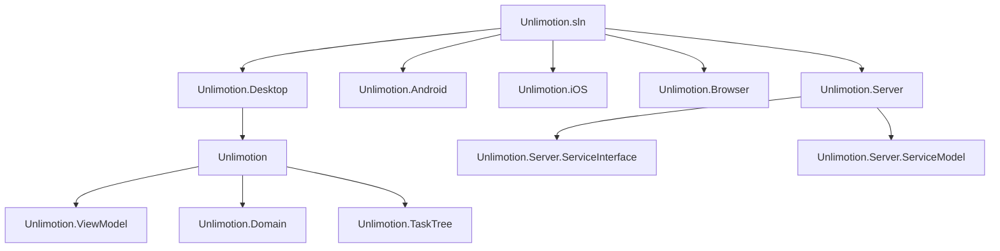
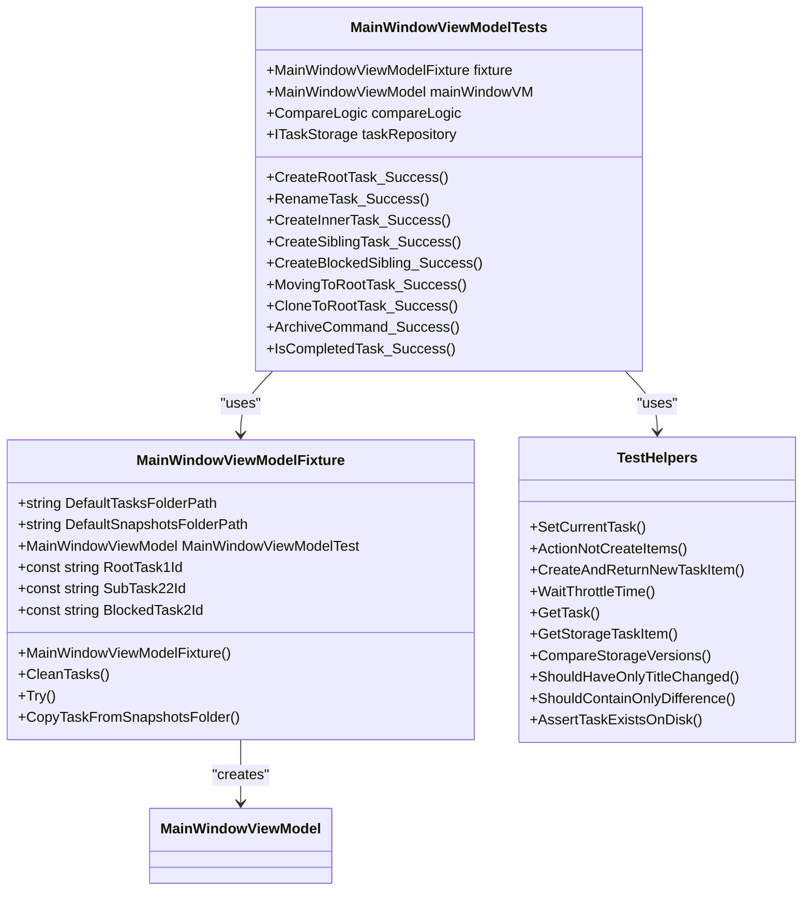
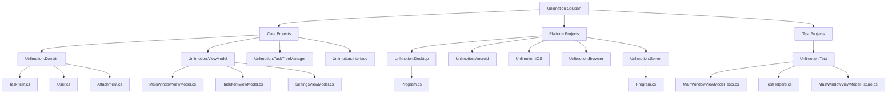
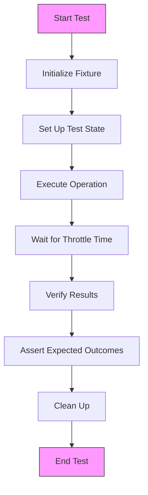
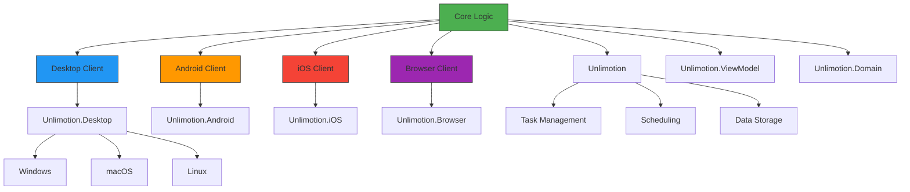

# Development Guide

<cite>
**Referenced Files in This Document**   
- [Unlimotion.sln](file://src/Unlimotion.sln)
- [Unlimotion.Test.csproj](file://src/Unlimotion.Test/Unlimotion.Test.csproj)
- [MainWindowViewModelTests.cs](file://src/Unlimotion.Test/MainWindowViewModelTests.cs)
- [TestHelpers.cs](file://src/Unlimotion.Test/TestHelpers.cs)
- [MainWindowViewModelFixture.cs](file://src/Unlimotion.Test/MainWindowViewModelFixture.cs)
- [TestSettings.json](file://src/Unlimotion.Test/TestSettings.json)
- [Unlimotion.Desktop.csproj](file://src/Unlimotion.Desktop/Unlimotion.Desktop.csproj)
- [Unlimotion.Desktop.ForMacBuild.csproj](file://src/Unlimotion.Desktop/Unlimotion.Desktop.ForMacBuild.csproj)
- [Unlimotion.Desktop.ForDebianBuild.csproj](file://src/Unlimotion.Desktop/Unlimotion.Desktop.ForDebianBuild.csproj)
- [Program.cs](file://src/Unlimotion.Desktop/Program.cs)
- [Unlimotion.csproj](file://src/Unlimotion/Unlimotion.csproj)
- [Directory.Build.props](file://src/Directory.Build.props)
- [run.windows.cmd](file://run.windows.cmd)
- [run.macos.sh](file://run.macos.sh)
- [run.linux.sh](file://run.linux.sh)
- [Unlimotion.sln.startup.json](file://src/Unlimotion.sln.startup.json)
- [CODE_OF_CONDUCT.md](file://CODE_OF_CONDUCT.md)
</cite>

## Table of Contents
1. [Development Environment Setup](#development-environment-setup)
2. [Building the Solution](#building-the-solution)
3. [Testing Strategy](#testing-strategy)
4. [Contribution Guidelines](#contribution-guidelines)
5. [Code Organization Principles](#code-organization-principles)
6. [Branching Strategy](#branching-strategy)
7. [Adding New Features](#adding-new-features)
8. [Writing Unit Tests](#writing-unit-tests)
9. [Debugging Common Issues](#debugging-common-issues)
10. [Cross-Platform Development](#cross-platform-development)

## Development Environment Setup

To set up the development environment for Unlimotion, you need to install the .NET 9.0 SDK for your operating system. The application uses Avalonia UI framework for cross-platform development, which is configured in the Directory.Build.props file with version 11.*. The solution contains multiple projects targeting different platforms including Desktop, Android, iOS, and Browser clients. Development dependencies include AutoMapper, LibGit2Sharp, Quartz, ServiceStack.Client, and SignalR.EasyUse.Client as specified in the Unlimotion.csproj file. Configuration files such as Settings.json and TestSettings.json manage application settings and paths for task storage.

**Section sources**
- [Unlimotion.csproj](file://src/Unlimotion/Unlimotion.csproj#L1-L45)
- [Directory.Build.props](file://src/Directory.Build.props#L1-L7)
- [TestSettings.json](file://src/Unlimotion.Test/TestSettings.json#L1-L30)

## Building the Solution

The Unlimotion solution (Unlimotion.sln) can be built using the .NET CLI or Visual Studio. The solution contains multiple platform-specific projects that share core functionality through common libraries. For desktop development, use the Unlimotion.Desktop project, while platform-specific builds use specialized project files: Unlimotion.Desktop.ForDebianBuild.csproj for Linux, Unlimotion.Desktop.ForMacBuild.csproj for macOS, and the standard Unlimotion.Desktop.csproj for Windows. The build process is facilitated by platform-specific run scripts (run.windows.cmd, run.macos.sh, run.linux.sh) that execute the appropriate project file using "dotnet run". The solution startup configuration in Unlimotion.sln.startup.json defines a "Server + Client" multi-project configuration that launches both the server and desktop client simultaneously for integrated development and testing.

**Diagram sources**
- [Unlimotion.sln](file://src/Unlimotion.sln)
- [Unlimotion.Desktop.csproj](file://src/Unlimotion.Desktop/Unlimotion.Desktop.csproj)
- [Unlimotion.csproj](file://src/Unlimotion/Unlimotion.csproj)

**Section sources**
- [Unlimotion.sln](file://src/Unlimotion.sln)
- [run.windows.cmd](file://run.windows.cmd#L1)
- [run.macos.sh](file://run.macos.sh#L1)
- [run.linux.sh](file://run.linux.sh#L1)
- [Unlimotion.sln.startup.json](file://src/Unlimotion.sln.startup.json#L1-L63)

## Testing Strategy

The Unlimotion application employs a comprehensive testing strategy centered around the Unlimotion.Test project, which uses xUnit as the testing framework with FluentAssertions for assertions and CompareNETObjects for object comparison. The testing architecture includes fixture classes like MainWindowViewModelFixture that set up test environments with predefined task data from snapshot files. TestHelpers provides utility methods for common testing operations such as creating tasks, waiting for throttle times, and comparing storage versions. The test suite validates core functionality including task creation, modification, deletion, archiving, completion, and complex operations like cloning and blocking relationships between tasks.

**Diagram sources**
- [MainWindowViewModelTests.cs](file://src/Unlimotion.Test/MainWindowViewModelTests.cs#L1-L956)
- [MainWindowViewModelFixture.cs](file://src/Unlimotion.Test/MainWindowViewModelFixture.cs#L1-L116)
- [TestHelpers.cs](file://src/Unlimotion.Test/TestHelpers.cs#L1-L123)

**Section sources**
- [Unlimotion.Test.csproj](file://src/Unlimotion.Test/Unlimotion.Test.csproj#L1-L142)
- [MainWindowViewModelTests.cs](file://src/Unlimotion.Test/MainWindowViewModelTests.cs#L1-L956)
- [TestHelpers.cs](file://src/Unlimotion.Test/TestHelpers.cs#L1-L123)
- [MainWindowViewModelFixture.cs](file://src/Unlimotion.Test/MainWindowViewModelFixture.cs#L1-L116)

## Contribution Guidelines

Contributors to the Unlimotion project must adhere to the Contributor Covenant Code of Conduct, which establishes standards for respectful and inclusive behavior. The code of conduct prohibits harassment, discrimination, and unprofessional conduct while promoting empathy, respect for differing viewpoints, and constructive feedback. Community leaders have the authority to enforce these standards through corrective actions ranging from private warnings to permanent bans based on the severity of violations. All contributions should align with the project's architecture and coding standards, with particular attention to the MVVM pattern implemented in the application. Contributors are expected to write comprehensive tests for new features and ensure backward compatibility where applicable.

**Section sources**
- [CODE_OF_CONDUCT.md](file://CODE_OF_CONDUCT.md#L1-L129)

## Code Organization Principles

The Unlimotion application follows a well-structured code organization with clear separation of concerns. The solution is divided into multiple projects based on functionality and platform targets. The core logic resides in shared projects like Unlimotion.Domain (data models), Unlimotion.ViewModel (presentation logic), and Unlimotion.TaskTreeManager (task tree operations). Platform-specific UI implementations are separated into Unlimotion.Desktop, Unlimotion.Android, Unlimotion.iOS, and Unlimotion.Browser projects. The application uses the MVVM pattern extensively, with ViewModels in the Unlimotion.ViewModel project containing the bulk of the business logic. Configuration is managed through JSON files, and dependency injection is implemented using Splat. The codebase leverages AutoMapper for object mapping and ReactiveUI for reactive programming patterns.

**Diagram sources**
- [Unlimotion.sln](file://src/Unlimotion.sln)
- [Unlimotion.Domain.csproj](file://src/Unlimotion.Domain/Unlimotion.Domain.csproj)
- [Unlimotion.ViewModel.csproj](file://src/Unlimotion.ViewModel/Unlimotion.ViewModel.csproj)

**Section sources**
- [Unlimotion.sln](file://src/Unlimotion.sln)
- [Unlimotion.Domain](file://src/Unlimotion.Domain)
- [Unlimotion.ViewModel](file://src/Unlimotion.ViewModel)
- [Unlimotion.TaskTreeManager](file://src/Unlimotion.TaskTreeManager)

## Branching Strategy

The Unlimotion project follows a standard Git branching model with the main branch serving as the primary development branch. Feature development should be conducted on feature branches created from main, with regular synchronization to avoid merge conflicts. The repository includes a GitPullJob and GitPushJob in the Scheduling/Jobs directory, indicating automated Git operations for backup purposes. The TestSettings.json file contains Git configuration options such as backup intervals, remote URLs, and branch names, suggesting a development workflow that incorporates regular Git synchronization. Pull requests should be created for all feature branches, with thorough code review before merging into main. The project's run scripts and solution configuration support a development workflow that emphasizes frequent testing and integration.

**Section sources**
- [GitPullJob.cs](file://src/Unlimotion/Scheduling/Jobs/GitPullJob.cs)
- [GitPushJob.cs](file://src/Unlimotion/Scheduling/Jobs/GitPushJob.cs)
- [TestSettings.json](file://src/Unlimotion.Test/TestSettings.json#L1-L30)

## Adding New Features

When adding new features to Unlimotion, developers should follow the existing architectural patterns and code organization. New functionality should be implemented in the appropriate project based on its scope: core features in Unlimotion.ViewModel or Unlimotion.Domain, platform-specific features in the respective platform project. The MVVM pattern should be maintained, with UI logic in ViewModels rather than code-behind files. New features require corresponding unit tests in the Unlimotion.Test project, following the existing testing patterns established in MainWindowViewModelTests. Configuration options for new features should be added to the Settings.json schema, with default values provided. The implementation should consider cross-platform compatibility, especially for features that interact with system resources or have platform-specific behaviors.

**Section sources**
- [Unlimotion.csproj](file://src/Unlimotion/Unlimotion.csproj#L1-L45)
- [Unlimotion.ViewModel](file://src/Unlimotion.ViewModel)
- [Unlimotion.Domain](file://src/Unlimotion.Domain)

## Writing Unit Tests

Unit tests in Unlimotion are written using xUnit and should follow the patterns established in the MainWindowViewModelTests class. Each test method should be clearly named to describe the scenario being tested, using the naming convention "MethodName_StateUnderTest_ExpectedBehavior". The MainWindowViewModelFixture provides a consistent test environment with predefined test data, and TestHelpers offers utility methods for common testing operations. Tests should be isolated and deterministic, using the fixture's cleanup mechanisms to ensure test independence. When testing asynchronous operations, use the appropriate async/await patterns and ensure proper timing with WaitThrottleTime. Assertions should be comprehensive but focused, verifying only the expected outcomes of the specific test scenario.

**Diagram sources**
- [MainWindowViewModelTests.cs](file://src/Unlimotion.Test/MainWindowViewModelTests.cs#L1-L956)
- [TestHelpers.cs](file://src/Unlimotion.Test/TestHelpers.cs#L1-L123)
- [MainWindowViewModelFixture.cs](file://src/Unlimotion.Test/MainWindowViewModelFixture.cs#L1-L116)

**Section sources**
- [MainWindowViewModelTests.cs](file://src/Unlimotion.Test/MainWindowViewModelTests.cs#L1-L956)
- [TestHelpers.cs](file://src/Unlimotion.Test/TestHelpers.cs#L1-L123)

## Debugging Common Issues

Common issues in Unlimotion development often relate to data binding, asynchronous operations, and cross-platform compatibility. The application uses Avalonia's compiled bindings, which can be debugged using the built-in logging capabilities enabled in the BuildAvaloniaApp method. For issues with task state changes or property updates, verify that INotifyPropertyChanged is properly implemented and that property change notifications are being raised. Throttling is implemented in TaskItemViewModel with a DefaultThrottleTime, which may affect the timing of operations and should be considered when debugging. The NotificationManagerWrapperMock in tests can be used to simulate user interactions during debugging. When encountering issues with file operations or task persistence, check the task storage path configuration and file permissions, especially on macOS where additional permission steps may be required.

**Section sources**
- [Program.cs](file://src/Unlimotion.Desktop/Program.cs#L1-L94)
- [Unlimotion.csproj](file://src/Unlimotion/Unlimotion.csproj#L1-L45)
- [MainWindowViewModelTests.cs](file://src/Unlimotion.Test/MainWindowViewModelTests.cs#L1-L956)

## Cross-Platform Development

Unlimotion is designed as a cross-platform application supporting Desktop (Windows, macOS, Linux), Android, iOS, and Browser clients. The core application logic is shared across platforms through the Unlimotion, Unlimotion.ViewModel, and Unlimotion.Domain projects, while platform-specific implementations are handled in separate projects. The Avalonia UI framework enables consistent UI rendering across platforms, with platform-specific adaptations as needed. The build system uses different project files for different platforms (Unlimotion.Desktop.ForDebianBuild.csproj, Unlimotion.Desktop.ForMacBuild.csproj) to handle platform-specific requirements. Configuration is managed through JSON files that can be customized for different environments. Developers should test new features on all target platforms and be aware of platform-specific limitations or requirements, such as the additional permission step needed on macOS for unsigned applications.

**Diagram sources**
- [Unlimotion.sln](file://src/Unlimotion.sln)
- [Unlimotion.Desktop.csproj](file://src/Unlimotion.Desktop/Unlimotion.Desktop.csproj)
- [Unlimotion.Android.csproj](file://src/Unlimotion.Android/Unlimotion.Android.csproj)
- [Unlimotion.iOS.csproj](file://src/Unlimotion.iOS/Unlimotion.iOS.csproj)
- [Unlimotion.Browser.csproj](file://src/Unlimotion.Browser/Unlimotion.Browser.csproj)

**Section sources**
- [Unlimotion.sln](file://src/Unlimotion.sln)
- [Unlimotion.Desktop](file://src/Unlimotion.Desktop)
- [Unlimotion.Android](file://src/Unlimotion.Android)
- [Unlimotion.iOS](file://src/Unlimotion.iOS)
- [Unlimotion.Browser](file://src/Unlimotion.Browser)