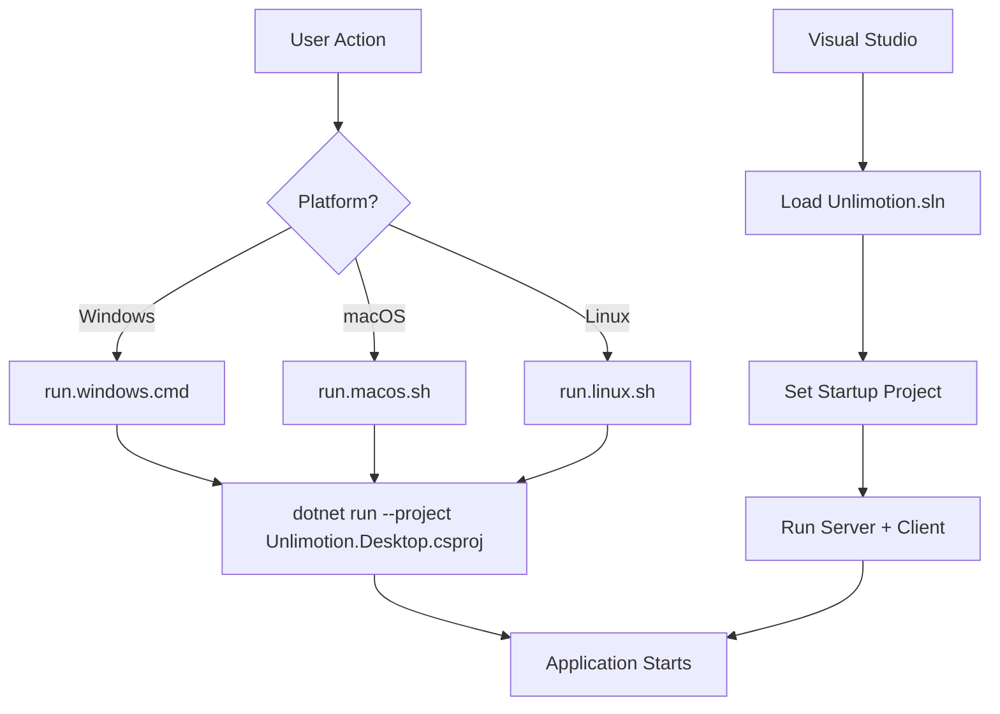
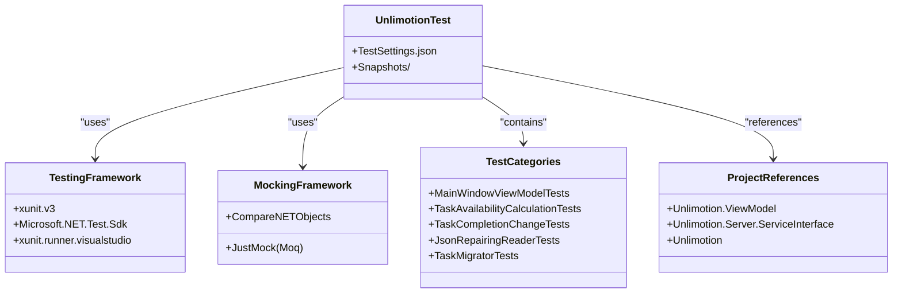

# Development Guide

<cite>
**Referenced Files in This Document**   
- [README.md](file://README.md)
- [run.windows.cmd](file://run.windows.cmd)
- [run.macos.sh](file://run.macos.sh)
- [run.linux.sh](file://run.linux.sh)
- [.env](file://src/.env)
- [Unlimotion.sln.startup.json](file://src/Unlimotion.sln.startup.json)
- [Directory.Build.props](file://src/Directory.Build.props)
- [nuget.config](file://src/nuget.config)
- [Unlimotion.Test.csproj](file://src/Unlimotion.Test/Unlimotion.Test.csproj)
- [TestSettings.json](file://src/Unlimotion.Test/TestSettings.json)
- [appsettings.json](file://src/Unlimotion.Server/appsettings.json)
- [appsettings.Development.json](file://src/Unlimotion.Server/appsettings.Development.json)
- [Program.cs](file://src/Unlimotion.Desktop/Program.cs)
- [launchSettings.json](file://src/Unlimotion.Desktop/Properties/launchSettings.json)
- [start-client.cmd](file://src/start-client.cmd)
- [start-server.cmd](file://src/start-server.cmd)
</cite>

## Table of Contents
1. [Prerequisites](#prerequisites)
2. [Repository Setup](#repository-setup)
3. [Build and Run Process](#build-and-run-process)
4. [Configuration Management](#configuration-management)
5. [Testing Strategy](#testing-strategy)
6. [Debugging Common Issues](#debugging-common-issues)
7. [Contribution Workflow](#contribution-workflow)
8. [Performance Profiling](#performance-profiling)
9. [Mobile Development Considerations](#mobile-development-considerations)

## Prerequisites

Before setting up the Unlimotion development environment, ensure the following prerequisites are installed:

- **.NET 9.0 SDK**: Required for building and running the application. Available for Windows, macOS, and Linux from the official [.NET downloads page](https://dotnet.microsoft.com/en-us/download).
- **Git**: Version control system for cloning the repository and managing source code. Install from [git-scm.com](https://git-scm.com/).
- **Platform-specific tools**:
  - **Android**: Android SDK and Android Studio for mobile development and debugging.
  - **iOS**: Xcode and Apple Developer account for iOS builds and device testing.
  - **Desktop**: No additional tools required beyond .NET SDK for Windows, macOS, and Linux platforms.

The project uses Avalonia UI framework with ReactiveUI for cross-platform desktop and mobile applications, requiring the .NET 9.0 runtime for all platforms.

**Section sources**
- [README.md](file://README.md#L1-L186)
- [Directory.Build.props](file://src/Directory.Build.props#L1-L5)

## Repository Setup

To set up the Unlimotion repository for development:

1. Clone the repository using Git:
```bash
git clone https://github.com/Kibnet/Unlimotion.git
```

2. Alternatively, download the source code as a ZIP archive from the GitHub repository and extract it to a local directory.

3. Navigate to the root directory of the extracted/cloned repository.

4. Restore NuGet packages automatically through the build process. The solution uses standard NuGet package management with dependencies defined in individual project files.

The repository structure follows a modular architecture with separate projects for desktop, mobile, server, and shared components, enabling independent development and testing.

**Section sources**
- [README.md](file://README.md#L1-L186)
- [nuget.config](file://src/nuget.config#L1-L11)

## Build and Run Process

The Unlimotion application can be built and run using platform-specific startup scripts or through Visual Studio:

### Using Startup Scripts
- **Windows**: Execute `run.windows.cmd` which runs:
```bash
dotnet run --project src\Unlimotion.Desktop\Unlimotion.Desktop.csproj
```

- **macOS**: Execute `run.macos.sh` which runs:
```bash
dotnet run --project src/Unlimotion.Desktop/Unlimotion.Desktop.ForMacBuild.csproj
```

- **Linux**: Execute `run.linux.sh` which runs:
```bash
dotnet run --project src/Unlimotion.Desktop/Unlimotion.Desktop.ForDebianBuild.csproj
```

### Using Visual Studio
1. Open the solution file in Visual Studio.
2. Set startup projects using the SwitchStartupProject extension configuration in `Unlimotion.sln.startup.json`.
3. The "Server + Client" configuration allows running both `Unlimotion.Server` and `Unlimotion.Desktop` projects simultaneously.

### Alternative Commands
- Start client only: `dotnet run -p Unlimotion.Desktop\Unlimotion.Desktop.csproj`
- Start server only: `dotnet run -p Unlimotion.Server\Unlimotion.Server.csproj`

The build process automatically restores NuGet packages and compiles all required components.



**Diagram sources**
- [run.windows.cmd](file://run.windows.cmd#L1)
- [run.macos.sh](file://run.macos.sh#L1)
- [run.linux.sh](file://run.linux.sh#L1)
- [Unlimotion.sln.startup.json](file://src/Unlimotion.sln.startup.json#L1-L62)
- [start-client.cmd](file://src/start-client.cmd#L1)
- [start-server.cmd](file://src/start-server.cmd#L1)

**Section sources**
- [run.windows.cmd](file://run.windows.cmd#L1)
- [run.macos.sh](file://run.macos.sh#L1)
- [run.linux.sh](file://run.linux.sh#L1)
- [Unlimotion.sln.startup.json](file://src/Unlimotion.sln.startup.json#L1-L62)

## Configuration Management

Unlimotion uses multiple configuration files for different environments and components:

### Environment Configuration
The `.env` file in the src directory contains environment variables:
```
COMPOSE_PROJECT_NAME=unlimotion
```

### Application Settings
- **Client Configuration**: Managed through `Settings.json` (not included in repository, created at runtime).
- **Server Configuration**: 
  - `appsettings.json`: Main configuration file with Serilog logging, RavenDB settings, ServiceStack license, and file paths.
  - `appsettings.Development.json`: Development-specific logging configuration with Debug level logging.

### Test Configuration
The `TestSettings.json` file in the test project contains configuration for testing environments:
- TaskStorage settings (path, URL, authentication)
- Git backup settings (intervals, credentials, repository information)
- UI display preferences for testing

### Launch Settings
The `launchSettings.json` file in the Unlimotion.Desktop project specifies:
- Command line arguments (e.g., `-config=Settings.Refactor.json`)
- Profile configurations for different execution environments

Configuration is loaded at application startup in `Program.cs`, with different paths used for DEBUG and release builds.

**Section sources**
- [.env](file://src/.env#L1)
- [appsettings.json](file://src/Unlimotion.Server/appsettings.json#L1-L44)
- [appsettings.Development.json](file://src/Unlimotion.Server/appsettings.Development.json#L1-L9)
- [TestSettings.json](file://src/Unlimotion.Test/TestSettings.json#L1-L29)
- [launchSettings.json](file://src/Unlimotion.Desktop/Properties/launchSettings.json#L1-L11)
- [Program.cs](file://src/Unlimotion.Desktop/Program.cs#L1-L93)

## Testing Strategy

The Unlimotion project uses xUnit as the primary testing framework with Moq for mocking dependencies.

### Test Project Structure
The `Unlimotion.Test` project (Unlimotion.Test.csproj) contains:
- Unit tests for core functionality
- Integration tests for service components
- ViewModel tests with mocking
- Snapshot testing for UI state verification

### Testing Dependencies
The test project references:
- **xunit.v3**: Core testing framework
- **xunit.runner.visualstudio**: Test runner integration
- **Microsoft.NET.Test.Sdk**: .NET test SDK
- **Moq**: Mocking framework (via JustMock package)
- **CompareNETObjects**: Object comparison for assertions

### Running Tests
Tests can be executed through:
1. Visual Studio Test Explorer
2. Command line: `dotnet test`
3. IDE integrated test runners

### Test Organization
Key test files include:
- `MainWindowViewModelTests.cs`: Tests for main window functionality
- `TaskAvailabilityCalculationTests.cs`: Business logic for task availability
- `TaskCompletionChangeTests.cs`: State transition logic
- `JsonRepairingReaderTests.cs`: Data persistence and repair functionality

The test project references core projects including Unlimotion.ViewModel, Unlimotion.Server.ServiceInterface, and the main Unlimotion project for comprehensive testing coverage.



**Diagram sources**
- [Unlimotion.Test.csproj](file://src/Unlimotion.Test/Unlimotion.Test.csproj#L1-L140)
- [TestSettings.json](file://src/Unlimotion.Test/TestSettings.json#L1-L29)

**Section sources**
- [Unlimotion.Test.csproj](file://src/Unlimotion.Test/Unlimotion.Test.csproj#L1-L140)
- [TestSettings.json](file://src/Unlimotion.Test/TestSettings.json#L1-L29)

## Debugging Common Issues

### Dependency Injection Failures
- Ensure all services are properly registered in the application startup.
- Verify interface implementations are correctly mapped.
- Check for circular dependencies in service registrations.
- Use the built-in logging to trace service resolution issues.

### UI Binding Errors
- Enable binding diagnostics in DEBUG mode:
```csharp
#if DEBUG
.LogToTrace(LogEventLevel.Debug, LogArea.Binding)
#endif
```
- Verify DataContext is properly set for views.
- Check property names in bindings match ViewModel properties.
- Ensure INotifyPropertyChanged is properly implemented.

### Database Connection Problems
- Verify RavenDB server is running on `http://localhost:8080`.
- Check `appsettings.json` for correct ServerUrl and DataDirectory.
- Ensure the `RavenDB` directory exists and is writable.
- Validate database name is set to "Unlimotion" in configuration.

### General Debugging Tips
- Use the DEBUG build configuration for enhanced logging.
- Check the `Log` directory for application and RavenDB logs.
- Verify file permissions, especially on macOS where unsigned applications have restricted access.
- Ensure the Tasks directory exists and is accessible.

**Section sources**
- [Program.cs](file://src/Unlimotion.Desktop/Program.cs#L1-L93)
- [appsettings.json](file://src/Unlimotion.Server/appsettings.json#L1-L44)
- [Unlimotion.sln.startup.json](file://src/Unlimotion.sln.startup.json#L1-L62)

## Contribution Workflow

### Branching Strategy
- Main development occurs on the `main` branch.
- Feature branches should be created for new functionality.
- Bug fixes should use hotfix branches from main.
- Pull requests require review before merging.

### Code Formatting Rules
- Follow .NET naming conventions.
- Use nullable reference types (enabled in Directory.Build.props).
- Maintain consistent code style with existing codebase.
- Include unit tests for new functionality.

### Pull Request Requirements
- Clear description of changes and motivation.
- Reference related issues when applicable.
- Pass all automated tests.
- Include appropriate documentation updates.
- Minimal, focused changes (avoid large, sweeping changes).

### Development Practices
- Write tests for all new functionality.
- Use descriptive commit messages.
- Keep pull requests small and focused.
- Address review feedback promptly.

The project uses standard .NET development practices with a focus on test-driven development and maintainable code structure.

**Section sources**
- [Directory.Build.props](file://src/Directory.Build.props#L1-L5)
- [Unlimotion.Test.csproj](file://src/Unlimotion.Test/Unlimotion.Test.csproj#L1-L140)

## Performance Profiling

### Avalonia-Specific Profiling
- Monitor UI thread performance to avoid blocking operations.
- Use Avalonia's built-in performance tracing for layout and rendering.
- Minimize unnecessary property change notifications.
- Optimize data templates for large collections.

### Memory Leak Detection
- Monitor for event handler leaks, especially with ReactiveUI components.
- Check for proper disposal of subscriptions and observables.
- Use weak event patterns where appropriate.
- Profile memory usage during long-running operations.

### ReactiveUI Optimization
- Avoid excessive reactive chains that can impact performance.
- Use Throttle and Sample operators to limit update frequency.
- Implement proper error handling in reactive streams.
- Monitor for memory retention in observable sequences.

### General Performance Techniques
- Profile startup time and optimize initialization sequences.
- Monitor garbage collection patterns and memory allocation.
- Use asynchronous operations for I/O bound tasks.
- Cache expensive computations when appropriate.

Performance should be regularly monitored, especially when implementing new features that affect UI rendering or data processing.

**Section sources**
- [Program.cs](file://src/Unlimotion.Desktop/Program.cs#L1-L93)
- [Unlimotion.Test.csproj](file://src/Unlimotion.Test/Unlimotion.Test.csproj#L1-L140)

## Mobile Development Considerations

### Android Development
- The `Unlimotion.Android` project contains platform-specific code.
- Requires Android SDK and compatible emulator or device.
- Pay attention to file system permissions on Android.
- Test on multiple screen sizes and densities.
- Optimize for touch interactions and mobile navigation.

### iOS Development
- The `Unlimotion.iOS` project contains platform-specific code.
- Requires Xcode and Apple Developer account.
- Test on actual devices when possible, not just simulators.
- Consider iOS-specific UI guidelines and navigation patterns.
- Pay attention to memory constraints on mobile devices.

### Cross-Platform Mobile Issues
- Ensure consistent behavior across platforms.
- Test orientation changes and different screen sizes.
- Handle platform-specific back button/navigation.
- Optimize for battery usage and network connectivity.
- Consider offline functionality and data synchronization.

### Debugging Mobile Builds
- Use platform-specific debugging tools (Android Studio, Xcode).
- Monitor log output from both .NET and native layers.
- Test on physical devices to catch platform-specific issues.
- Pay attention to startup time and memory usage on mobile devices.

The mobile projects integrate with the shared codebase while providing platform-specific implementations where necessary.

**Section sources**
- [README.md](file://README.md#L1-L186)
- [Unlimotion.Android](file://src/Unlimotion.Android)
- [Unlimotion.iOS](file://src/Unlimotion.iOS)