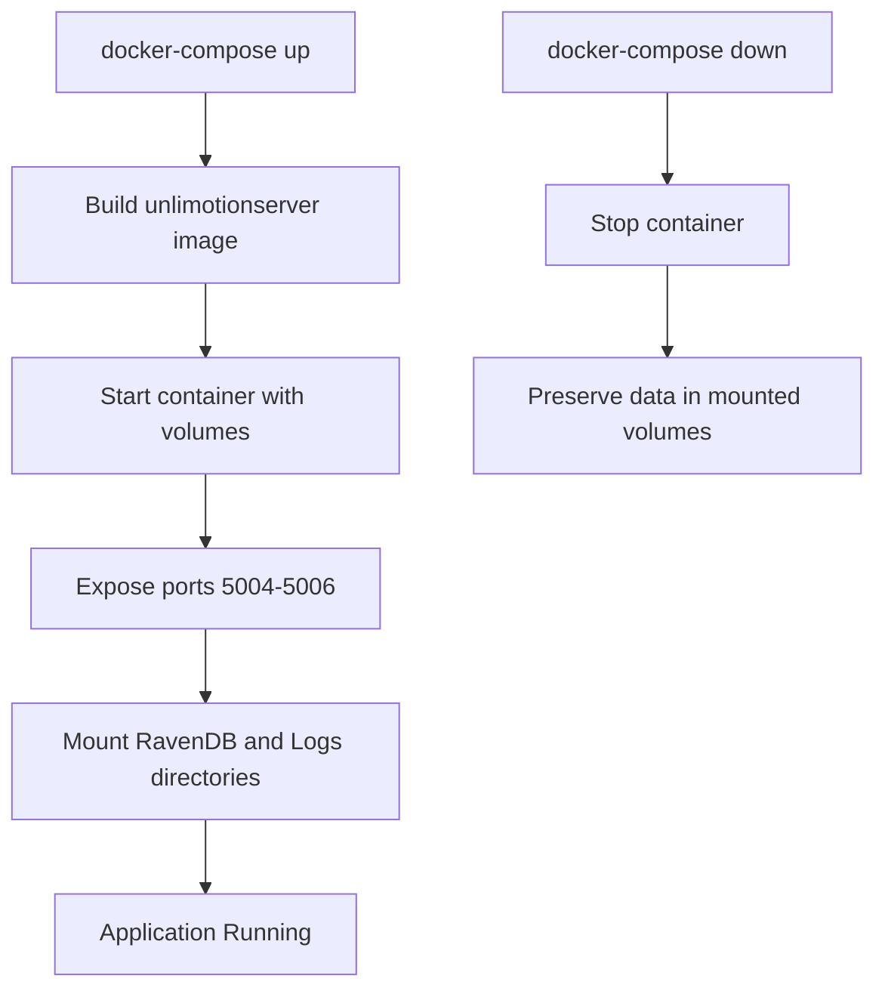

# Installation and Setup

<cite>
**Referenced Files in This Document**   
- [README.md](file://README.md)
- [run.windows.cmd](file://run.windows.cmd)
- [run.macos.sh](file://run.macos.sh)
- [run.linux.sh](file://run.linux.sh)
- [docker-compose.yml](file://src/docker-compose.yml)
- [docker-compose.override.yml](file://src/docker-compose.override.yml)
- [start-server.cmd](file://src/start-server.cmd)
- [start-client.cmd](file://src/start-client.cmd)
- [start-server-in-docker.cmd](file://src/start-server-in-docker.cmd)
- [stop-server-in-docker.cmd](file://src/stop-server-in-docker.cmd)
- [.env](file://src/.env)
- [Unlimotion.Desktop.csproj](file://src/Unlimotion.Desktop/Unlimotion.Desktop.csproj)
- [Unlimotion.Server.csproj](file://src/Unlimotion.Server/Unlimotion.Server.csproj)
</cite>

## Table of Contents
1. [Release-Based Installation](#release-based-installation)
2. [Source-Based Installation](#source-based-installation)
3. [Platform-Specific Execution Scripts](#platform-specific-execution-scripts)
4. [TaskStorage Path Configuration](#taskstorage-path-configuration)
5. [Docker-Based Setup](#docker-based-setup)
6. [Troubleshooting Common Issues](#troubleshooting-common-issues)
7. [Verification and Initial Launch](#verification-and-initial-launch)

## Release-Based Installation

Unlimotion provides pre-built releases for Windows, Debian, and macOS platforms, enabling users to quickly install and run the application without requiring development tools.

For **Windows** and **Debian** users, download the latest release from the project's releases page. After downloading, extract the package and execute the application directly. No additional configuration or permission adjustments are required for these platforms.

For **macOS** users, after installing the application, execute the following command in the terminal to grant necessary execution permissions:
```bash
sudo chmod -R 755 /Applications/Unlimotion.app
```
This step is required due to Apple's security policy for applications not signed with an official developer certificate. Without this permission adjustment, macOS may prevent the application from launching.

**Section sources**
- [README.md](file://README.md#L20-L25)

## Source-Based Installation

To install Unlimotion from source, follow these steps:

1. Install the **.NET 9.0 SDK** appropriate for your operating system from the official [.NET downloads page](https://dotnet.microsoft.com/en-us/download).
2. Obtain the source code by either:
   - Downloading the [source code as a ZIP archive](https://github.com/Kibnet/Unlimotion/archive/refs/heads/main.zip) and extracting it
   - Cloning the repository using Git: `git clone https://github.com/Kibnet/Unlimotion.git`
3. Navigate to the root directory of the extracted/cloned source code.

The application is built using .NET 9.0, and the main desktop project targets the `net9.0` framework, making it compatible across Windows, macOS, and Linux platforms.

**Section sources**
- [README.md](file://README.md#L27-L35)
- [Unlimotion.Desktop.csproj](file://src/Unlimotion.Desktop/Unlimotion.Desktop.csproj#L5-L10)

## Platform-Specific Execution Scripts

Unlimotion provides platform-specific scripts to simplify launching the application from source:

- **Windows**: Use `run.windows.cmd` which executes:
  ```cmd
  dotnet run --project src\Unlimotion.Desktop\Unlimotion.Desktop.csproj
  ```
- **macOS**: Use `run.macos.sh` which executes:
  ```bash
  dotnet run --project src/Unlimotion.Desktop/Unlimotion.Desktop.ForMacBuild.csproj
  ```
- **Linux**: Use `run.linux.sh` which executes:
  ```bash
  dotnet run --project src/Unlimotion.Desktop/Unlimotion.Desktop.ForDebianBuild.csproj
  ```

On macOS and Linux, ensure the script has execute permissions. If not, run:
```bash
chmod +x run.macos.sh
```
or
```bash
chmod +x run.linux.sh
```

These scripts abstract the complexity of directly invoking the .NET runtime with the correct project file.

**Section sources**
- [run.windows.cmd](file://run.windows.cmd)
- [run.macos.sh](file://run.macos.sh)
- [run.linux.sh](file://run.linux.sh)
- [README.md](file://README.md#L36-L42)

## TaskStorage Path Configuration

The **TaskStorage Path** determines where task data is stored on the filesystem. This can be configured in two ways:

1. **Via Settings Interface**: In the application's Settings window, specify the directory path where JSON task files should be saved. The path can be absolute or relative. If left unspecified, tasks are stored in a "Tasks" folder created in the application's working directory.

2. **Via Environment Variables**: The `.env` file in the project root can define environment-specific settings. Currently, it contains:
   ```
   COMPOSE_PROJECT_NAME=unlimotion
   ```
   This setting is primarily used in Docker-based deployments to identify the Docker Compose project.

The TaskStorage path is critical for data persistence and backup strategies, especially when using the Git-based backup service included in the application.

**Section sources**
- [README.md](file://README.md#L155-L165)
- [.env](file://src/.env)

## Docker-Based Setup

Unlimotion supports Docker-based deployment using Docker Compose for containerized execution. This setup is ideal for server deployments or isolated development environments.

The `docker-compose.yml` file defines the `unlimotion.server` service with the following configuration:
- Builds from the `Unlimotion.Server/Dockerfile`
- Maps persistent volumes for RavenDB data (`./RavenDB`) and logs (`./Logs`)
- Exposes ports 5004 (HTTP), 5005 (HTTPS), and 5006
- Uses environment variables to configure ASP.NET Core URLs and RavenDB security

The `docker-compose.override.yml` file provides development-specific overrides:
- Sets the environment to `Development`
- Mounts user secrets and HTTPS certificates for secure development
- Ensures consistent volume mappings for data persistence

To start the Docker-based server:
```bash
docker-compose up
```

To stop the server:
```bash
docker-compose down
```

Convenience scripts `start-server-in-docker.cmd` and `stop-server-in-docker.cmd` wrap these commands for Windows users.



**Diagram sources**
- [docker-compose.yml](file://src/docker-compose.yml#L1-L18)
- [docker-compose.override.yml](file://src/docker-compose.override.yml#L1-L15)
- [start-server-in-docker.cmd](file://src/start-server-in-docker.cmd)
- [stop-server-in-docker.cmd](file://src/stop-server-in-docker.cmd)

## Troubleshooting Common Issues

### .NET SDK Not Found
Ensure .NET 9.0 SDK is installed and available in PATH. Verify with:
```bash
dotnet --version
```

### Permission Denied on macOS
If the application fails to launch on macOS, ensure execution permissions are set:
```bash
sudo chmod -R 755 /Applications/Unlimotion.app
```

### Docker Build Failures
If `docker-compose up` fails:
1. Ensure Docker Desktop is running
2. Check that the `Unlimotion.Server/Dockerfile` exists and is accessible
3. Verify sufficient disk space for image building

### Missing Project Files
When running `dotnet run`, ensure the correct `.csproj` file path is specified. The main desktop project is located at `src/Unlimotion.Desktop/Unlimotion.Desktop.csproj`.

### Port Conflicts
The server uses ports 5004-5006. If these are in use, either stop conflicting services or modify the `docker-compose.yml` file to use alternative ports.

**Section sources**
- [README.md](file://README.md#L20-L25)
- [run.macos.sh](file://run.macos.sh)
- [docker-compose.yml](file://src/docker-compose.yml#L10-L15)

## Verification and Initial Launch

After installation, verify the setup by launching the application and confirming the following:

1. **Successful Launch**: The application window should appear with the main interface containing the breadcrumb navigation, task hierarchy panel, and task details panel.

2. **Task Creation**: Create a test task using **Ctrl+Enter** (sibling), **Shift+Enter** (blocked sibling), or **Ctrl+Tab** (inner task). Ensure the task appears in the hierarchy.

3. **Settings Persistence**: Change the TaskStorage Path in settings and restart the application. Verify that tasks are saved to the new location.

4. **Docker Server Status**: When using Docker, navigate to `https://localhost:5005` to access the server interface and confirm it is responsive.

5. **Data Integrity**: Check that JSON files are being created in the Tasks directory (or configured TaskStorage Path) as tasks are added.

For source-based installations, you can also run the client and server separately using:
- `start-server.cmd` - Launches the backend server
- `start-client.cmd` - Launches the desktop client

This separation allows for independent development and testing of client and server components.

**Section sources**
- [README.md](file://README.md#L44-L186)
- [start-server.cmd](file://src/start-server.cmd)
- [start-client.cmd](file://src/start-client.cmd)