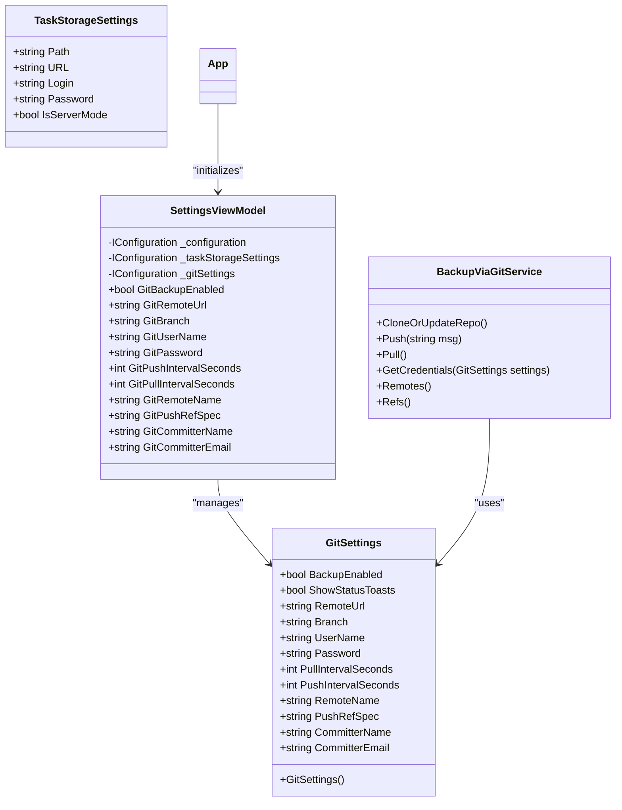
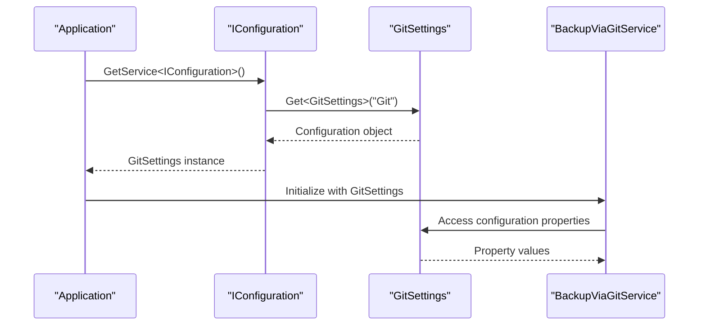
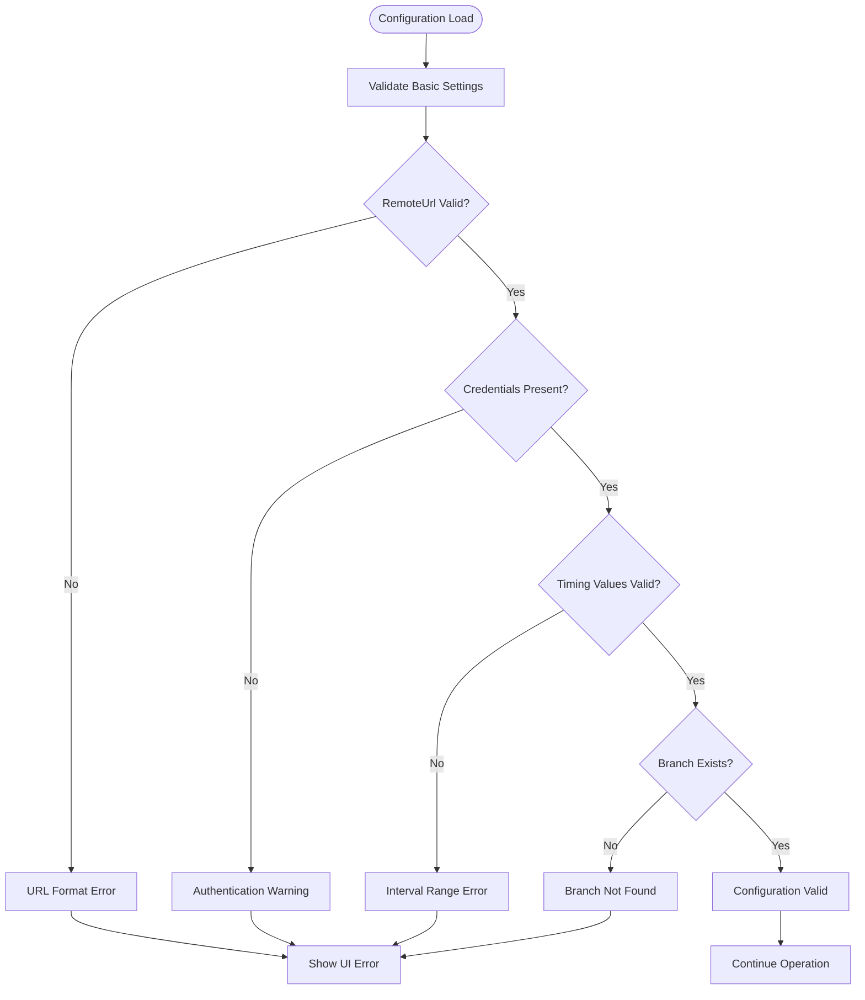

# Git Configuration System

<cite>
**Referenced Files in This Document**
- [TaskStorageSettings.cs](file://src/Unlimotion.ViewModel/TaskStorageSettings.cs)
- [BackupViaGitService.cs](file://src/Unlimotion\Services\BackupViaGitService.cs)
- [SettingsViewModel.cs](file://src\Unlimotion.ViewModel\SettingsViewModel.cs)
- [App.axaml.cs](file://src\Unlimotion\App.axaml.cs)
- [GitSettings.cs](file://src\Unlimotion.TelegramBot\GitSettings.cs)
- [appsettings.json](file://src\Unlimotion.TelegramBot\appsettings.json)
- [GitService.cs](file://src\Unlimotion.TelegramBot\GitService.cs)
- [Bot.cs](file://src\Unlimotion.TelegramBot\Bot.cs)
- [TaskStorages.cs](file://src\Unlimotion\TaskStorages.cs)
</cite>

## Table of Contents
1. [Introduction](#introduction)
2. [GitSettings Class Overview](#gitsettings-class-overview)
3. [Configuration Loading and Management](#configuration-loading-and-management)
4. [Core Configuration Properties](#core-configuration-properties)
5. [Security Considerations](#security-considerations)
6. [Common Configuration Patterns](#common-configuration-patterns)
7. [Error Handling and Validation](#error-handling-and-validation)
8. [Best Practices and Recommendations](#best-practices-and-recommendations)
9. [Troubleshooting Guide](#troubleshooting-guide)
10. [Implementation Examples](#implementation-examples)

## Introduction

The Git configuration system in Unlimotion provides a comprehensive framework for managing backup and synchronization operations using Git repositories. This system enables automatic backup of task data to remote Git repositories with configurable intervals, authentication mechanisms, and operational parameters. The configuration is managed through strongly-typed settings classes that integrate seamlessly with the .NET configuration system.

The system supports multiple deployment scenarios including desktop applications, server environments, and Telegram bots, each with slightly different configuration structures tailored to their specific needs. The core functionality revolves around the `GitSettings` class, which encapsulates all necessary parameters for Git operations, and the `BackupViaGitService` class, which orchestrates the actual backup processes.

## GitSettings Class Overview

The `GitSettings` class serves as the primary configuration container for Git-related operations in the Unlimotion application. It defines a comprehensive set of properties that control various aspects of Git backup functionality.



**Diagram sources**
- [TaskStorageSettings.cs](file://src\Unlimotion.ViewModel\TaskStorageSettings.cs#L16-L34)
- [SettingsViewModel.cs](file://src\Unlimotion.ViewModel\SettingsViewModel.cs#L10-L153)
- [BackupViaGitService.cs](file://src\Unlimotion\Services\BackupViaGitService.cs#L15-L356)

**Section sources**
- [TaskStorageSettings.cs](file://src\Unlimotion.ViewModel\TaskStorageSettings.cs#L16-L34)
- [SettingsViewModel.cs](file://src\Unlimotion.ViewModel\SettingsViewModel.cs#L10-L153)

## Configuration Loading and Management

The Git configuration system utilizes the .NET configuration infrastructure to load and manage settings. Configuration values are retrieved using the `IConfiguration` interface and deserialized into strongly-typed `GitSettings` objects.

### Configuration Retrieval Pattern

The system employs a consistent pattern for retrieving configuration values through the dependency injection container:



**Diagram sources**
- [App.axaml.cs](file://src\Unlimotion\App.axaml.cs#L135-L145)
- [BackupViaGitService.cs](file://src\Unlimotion\Services\BackupViaGitService.cs#L327-L331)

### Configuration Initialization Process

The application initializes Git settings during startup through a structured process:

1. **Configuration Creation**: Creates writable JSON configuration from file
2. **Service Registration**: Registers configuration and backup services
3. **Settings Validation**: Validates and initializes default values
4. **Scheduler Setup**: Configures automated backup jobs

**Section sources**
- [App.axaml.cs](file://src\Unlimotion\App.axaml.cs#L135-L190)

## Core Configuration Properties

### Backup Control Properties

#### BackupEnabled
- **Type**: `bool`
- **Default**: `false`
- **Purpose**: Enables or disables automatic backup operations
- **Usage**: Controls whether the system performs scheduled push/pull operations
- **Example**: Enable backups when connecting to a remote repository

#### ShowStatusToasts
- **Type**: `bool`
- **Default**: `true`
- **Purpose**: Controls display of status notifications
- **Usage**: Determines whether UI toast messages are shown for backup operations
- **Example**: Disable for headless server deployments

### Remote Repository Configuration

#### RemoteUrl
- **Type**: `string`
- **Required**: Yes
- **Purpose**: Specifies the remote Git repository URL
- **Supported Protocols**: HTTPS, SSH
- **Examples**:
  - HTTPS: `https://github.com/username/repository.git`
  - SSH: `git@github.com:username/repository.git`

#### Branch
- **Type**: `string`
- **Default**: `"master"`
- **Purpose**: Defines the target branch for backup operations
- **Usage**: Specifies which branch receives commits and updates
- **Example**: `"main"` for modern repositories

#### RemoteName
- **Type**: `string`
- **Default**: `"origin"`
- **Purpose**: Identifies the remote repository alias
- **Usage**: Used in Git commands to reference the remote
- **Example**: `"upstream"` for forked repositories

### Authentication Configuration

#### UserName
- **Type**: `string`
- **Default**: `"YourEmail"`
- **Purpose**: Provides authentication username
- **Usage**: Required for HTTPS authentication
- **Security Note**: Should be treated as sensitive data

#### Password
- **Type**: `string`
- **Default**: `"YourToken"`
- **Purpose**: Provides authentication credentials
- **Usage**: Supports both passwords and personal access tokens
- **Security Note**: Critical security consideration

### Timing Configuration

#### PullIntervalSeconds
- **Type**: `int`
- **Default**: `30`
- **Purpose**: Sets interval between pull operations
- **Range**: Minimum 10 seconds, typical values 30-300 seconds
- **Usage**: Controls how frequently local repository checks for remote updates

#### PushIntervalSeconds
- **Type**: `int`
- **Default**: `60`
- **Purpose**: Sets interval between push operations
- **Range**: Minimum 30 seconds, typical values 60-600 seconds
- **Usage**: Controls how frequently local changes are pushed to remote

### Reference Specification

#### PushRefSpec
- **Type**: `string`
- **Default**: `"refs/heads/master"`
- **Purpose**: Specifies the reference for push operations
- **Format**: Standard Git reference specification
- **Example**: `"refs/heads/main"` for GitHub main branch

### Committer Information

#### CommitterName
- **Type**: `string`
- **Default**: `"Backuper"`
- **Purpose**: Sets the author name for automated commits
- **Usage**: Appears in commit history for backup operations
- **Example**: `"Automated Backup System"`

#### CommitterEmail
- **Type**: `string`
- **Default**: `"Backuper@unlimotion.ru"`
- **Purpose**: Sets the author email for automated commits
- **Usage**: Required for Git commit operations
- **Example**: `"backup@company.com"`

**Section sources**
- [TaskStorageSettings.cs](file://src\Unlimotion.ViewModel\TaskStorageSettings.cs#L18-L34)
- [SettingsViewModel.cs](file://src\Unlimotion.ViewModel\SettingsViewModel.cs#L53-L152)

## Security Considerations

### Credential Storage and Management

The Git configuration system handles sensitive authentication information that requires careful security management. The current implementation stores credentials in plain text within configuration files, which presents several security concerns:

#### Current Security Implementation
- **Plain Text Storage**: Credentials are stored as-is in configuration files
- **Environment Variables**: No built-in support for environment variable substitution
- **Configuration Encryption**: No built-in encryption mechanisms
- **Credential Validation**: Basic validation for empty fields

#### Security Risks
1. **Configuration File Exposure**: Plain text credentials in version control
2. **Access Control**: No restrictions on who can read configuration files
3. **Memory Security**: Credentials remain in memory during application lifetime
4. **Network Transmission**: HTTPS credentials transmitted over network

### Recommended Security Practices

#### Personal Access Tokens vs Passwords
- **Personal Access Tokens**: Preferred over traditional passwords
- **Granular Permissions**: Can restrict access to specific repositories
- **Revocation**: Easier to revoke without changing primary account password
- **Expiration**: Can be configured with expiration dates

#### Environment Variable Configuration
```json
{
  "Git": {
    "UserName": "${GIT_USERNAME}",
    "Password": "${GIT_PASSWORD}"
  }
}
```

#### Secure Configuration Management
1. **Configuration Encryption**: Encrypt sensitive sections using AES or similar
2. **Secret Management Services**: Integrate with Azure Key Vault, AWS Secrets Manager
3. **Environment-Specific Configurations**: Separate development/staging/production configs
4. **Credential Rotation**: Implement automated credential rotation policies

**Section sources**
- [SettingsViewModel.cs](file://src\Unlimotion.ViewModel\SettingsViewModel.cs#L40-L45)
- [BackupViaGitService.cs](file://src\Unlimotion\Services\BackupViaGitService.cs#L327-L331)

## Common Configuration Patterns

### Desktop Application Configuration

Desktop applications typically use local configuration files with interactive credential prompts:

```json
{
  "Git": {
    "BackupEnabled": true,
    "ShowStatusToasts": true,
    "RemoteUrl": "https://github.com/username/tasks-backup.git",
    "Branch": "main",
    "UserName": "user@example.com",
    "Password": "personal-access-token",
    "PullIntervalSeconds": 60,
    "PushIntervalSeconds": 120,
    "RemoteName": "origin",
    "PushRefSpec": "refs/heads/main",
    "CommitterName": "User Name",
    "CommitterEmail": "user@example.com"
  }
}
```

### Server Deployment Configuration

Server deployments often require automated authentication and optimized timing:

```json
{
  "Git": {
    "BackupEnabled": true,
    "ShowStatusToasts": false,
    "RemoteUrl": "https://github.com/organization/tasks-server.git",
    "Branch": "main",
    "UserName": "bot-account",
    "Password": "${GITHUB_TOKEN}",
    "PullIntervalSeconds": 300,
    "PushIntervalSeconds": 600,
    "RemoteName": "origin",
    "PushRefSpec": "refs/heads/main",
    "CommitterName": "Server Backup Bot",
    "CommitterEmail": "bot@company.com"
  }
}
```

### Telegram Bot Configuration

Telegram bots use simplified configuration focused on basic Git operations:

```json
{
  "Git": {
    "RepositoryPath": "GitTasks",
    "RemoteUrl": "https://github.com/bot/tasks.git",
    "Branch": "master",
    "UserName": "",
    "Password": "",
    "PullIntervalSeconds": 300,
    "PushIntervalSeconds": 600
  }
}
```

**Section sources**
- [appsettings.json](file://src\Unlimotion.TelegramBot\appsettings.json#L4-L12)
- [App.axaml.cs](file://src\Unlimotion\App.axaml.cs#L168-L190)

## Error Handling and Validation

### Configuration Validation

The system implements several validation mechanisms to ensure configuration integrity:



**Diagram sources**
- [BackupViaGitService.cs](file://src\Unlimotion\Services\BackupViaGitService.cs#L327-L331)
- [BackupViaGitService.cs](file://src\Unlimotion\Services\BackupViaGitService.cs#L340-L356)

### Error Handling Mechanisms

#### Credential Validation
The system performs basic credential validation before attempting Git operations:

```csharp
private static void CheckGitSettings(string userName, string password)
{
    if (string.IsNullOrWhiteSpace(userName) || string.IsNullOrWhiteSpace(password))
        Debug.WriteLine("Can't push to the remote repository, because username or password is empty");
}
```

#### Exception Handling Patterns
- **Try-Catch Blocks**: Comprehensive exception handling around Git operations
- **Graceful Degradation**: Operations continue despite individual failures
- **User Notification**: UI feedback for configuration and operation errors
- **Logging**: Detailed logging for troubleshooting and monitoring

#### Common Error Scenarios
1. **Invalid Remote URL**: Malformed or unreachable repository URLs
2. **Authentication Failures**: Incorrect credentials or expired tokens
3. **Network Issues**: Connectivity problems or firewall restrictions
4. **Permission Denied**: Insufficient access rights to repository
5. **Branch Conflicts**: Local and remote branch divergence

**Section sources**
- [BackupViaGitService.cs](file://src\Unlimotion\Services\BackupViaGitService.cs#L327-L356)

## Best Practices and Recommendations

### Configuration Management

#### Environment-Specific Configuration
- **Separate Configurations**: Maintain distinct configurations for development, staging, and production
- **Environment Variables**: Use environment variables for sensitive data
- **Configuration Templates**: Provide template configurations with placeholders
- **Validation Scripts**: Implement configuration validation before deployment

#### Optimal Timing Configuration
- **Pull Intervals**: Shorter intervals (30-60 seconds) for frequently updated data
- **Push Intervals**: Longer intervals (5-10 minutes) to reduce network traffic
- **Conflict Resolution**: Configure appropriate merge strategies
- **Backup Frequency**: Balance between data safety and resource usage

### Authentication Best Practices

#### Personal Access Token Usage
- **Generate Tokens**: Create dedicated tokens for backup operations
- **Scope Limitation**: Grant minimal required permissions
- **Token Rotation**: Regularly rotate tokens and update configurations
- **Monitoring**: Monitor token usage and detect unauthorized access

#### Alternative Authentication Methods
- **SSH Keys**: Use SSH keys for enhanced security
- **OAuth Integration**: Leverage OAuth for third-party integrations
- **Service Accounts**: Create dedicated service accounts for automation

### Repository Organization

#### Repository Structure
- **Single Repository**: Use one repository per application instance
- **Branch Strategy**: Implement feature branches for development
- **Tagging Convention**: Use semantic versioning for releases
- **Commit Messages**: Standardize commit message formats

#### Data Organization
- **File Structure**: Organize tasks in logical directory structures
- **Backup Strategy**: Implement incremental and full backup strategies
- **Retention Policy**: Define data retention and archival policies
- **Disaster Recovery**: Plan for repository corruption or loss

**Section sources**
- [App.axaml.cs](file://src\Unlimotion\App.axaml.cs#L188-L232)
- [TaskStorages.cs](file://src\Unlimotion\TaskStorages.cs#L31-L57)

## Troubleshooting Guide

### Common Configuration Issues

#### Invalid Remote URL
**Symptoms**: Connection refused or repository not found errors
**Causes**: 
- Typographical errors in URL
- Repository moved or deleted
- Network connectivity issues
- Incorrect protocol specification

**Solutions**:
1. Verify URL format and accessibility
2. Test connection using Git CLI
3. Check repository existence and permissions
4. Validate network connectivity

#### Authentication Failures
**Symptoms**: 401 Unauthorized or permission denied errors
**Causes**:
- Incorrect username or password
- Expired personal access tokens
- Insufficient repository permissions
- Two-factor authentication blocking automated access

**Solutions**:
1. Verify credentials and regenerate tokens if necessary
2. Check repository access permissions
3. Enable two-factor authentication bypass for automation
4. Use SSH keys instead of HTTPS authentication

#### Timing Configuration Problems
**Symptoms**: Excessive network usage or missed backups
**Causes**:
- Intervals set too low or too high
- System clock synchronization issues
- Resource contention during backup operations

**Solutions**:
1. Adjust intervals based on usage patterns
2. Implement jitter to distribute load
3. Monitor system resources during backup operations
4. Use exponential backoff for retry mechanisms

### Diagnostic Procedures

#### Configuration Validation
1. **Verify Settings**: Check all configuration properties are properly set
2. **Test Connectivity**: Validate remote repository accessibility
3. **Authentication Test**: Verify credentials work with Git operations
4. **Timing Verification**: Confirm interval settings are reasonable

#### Operational Monitoring
1. **Log Analysis**: Review application logs for error patterns
2. **Performance Metrics**: Monitor backup operation performance
3. **Resource Usage**: Track CPU, memory, and network utilization
4. **Success Rates**: Measure backup success and failure rates

### Recovery Procedures

#### Configuration Reset
1. **Backup Current Config**: Save existing configuration
2. **Reset to Defaults**: Restore default configuration values
3. **Gradual Reconfiguration**: Incrementally restore custom settings
4. **Validation Testing**: Verify functionality after changes

#### Repository Recovery
1. **Local Repository Check**: Verify repository integrity locally
2. **Remote Repository Validation**: Confirm remote repository health
3. **Conflict Resolution**: Resolve any merge conflicts
4. **Backup Restoration**: Restore from previous backup if necessary

**Section sources**
- [BackupViaGitService.cs](file://src\Unlimotion\Services\BackupViaGitService.cs#L43-L94)
- [BackupViaGitService.cs](file://src\Unlimotion\Services\BackupViaGitService.cs#L115-L132)

## Implementation Examples

### Basic Configuration Setup

#### Desktop Application Example
```csharp
// Configuration setup in App.xaml.cs
var gitSettings = configuration.Get<GitSettings>("Git");
if (gitSettings == null)
{
    gitSettings = new GitSettings();
    var gitSection = configuration.GetSection("Git");
    
    // Set default values
    gitSection.GetSection(nameof(GitSettings.BackupEnabled)).Set(false);
    gitSection.GetSection(nameof(GitSettings.RemoteUrl)).Set("");
    gitSection.GetSection(nameof(GitSettings.Branch)).Set("master");
    gitSection.GetSection(nameof(GitSettings.UserName)).Set("YourEmail");
    gitSection.GetSection(nameof(GitSettings.Password)).Set("YourToken");
}
```

#### Settings ViewModel Integration
```csharp
// Settings binding in SettingsViewModel
public string GitRemoteUrl
{
    get => _gitSettings.GetSection(nameof(GitSettings.RemoteUrl)).Get<string>();
    set => _gitSettings.GetSection(nameof(GitSettings.RemoteUrl)).Set(value);
}

public string GitUserName
{
    get => _gitSettings.GetSection(nameof(GitSettings.UserName)).Get<string>();
    set => _gitSettings.GetSection(nameof(GitSettings.UserName)).Set(value);
}

public string GitPassword
{
    get => _gitSettings.GetSection(nameof(GitSettings.Password)).Get<string>();
    set => _gitSettings.GetSection(nameof(GitSettings.Password)).Set(value);
}
```

### Advanced Configuration Patterns

#### Environment-Based Configuration
```csharp
// Environment-specific configuration loading
public static void LoadEnvironmentConfiguration(IConfigurationBuilder builder)
{
    var environment = Environment.GetEnvironmentVariable("ASPNETCORE_ENVIRONMENT");
    builder.AddJsonFile("appsettings.json", optional: true, reloadOnChange: true)
           .AddJsonFile($"appsettings.{environment}.json", optional: true, reloadOnChange: true)
           .AddEnvironmentVariables();
}
```

#### Configuration Validation
```csharp
// Configuration validation service
public class GitConfigurationValidator
{
    public ValidationResult Validate(GitSettings settings)
    {
        var result = new ValidationResult();
        
        if (string.IsNullOrWhiteSpace(settings.RemoteUrl))
            result.Errors.Add("RemoteUrl is required");
            
        if (string.IsNullOrWhiteSpace(settings.UserName))
            result.Errors.Add("Username is required for authentication");
            
        if (settings.PullIntervalSeconds < 10)
            result.Warnings.Add("Pull interval is very short, may cause excessive network usage");
            
        return result;
    }
}
```

### Error Handling Implementation

#### Graceful Error Recovery
```csharp
// Error handling in backup operations
public void SafePush(string message)
{
    try
    {
        Push(message);
    }
    catch (LibGit2SharpException ex)
    {
        // Handle Git-specific errors
        LogError("Git operation failed", ex);
        ScheduleRetry();
    }
    catch (Exception ex)
    {
        // Handle unexpected errors
        LogError("Unexpected error during backup", ex);
        NotifyUser("Backup operation failed");
    }
}
```

**Section sources**
- [App.axaml.cs](file://src\Unlimotion\App.axaml.cs#L145-L190)
- [SettingsViewModel.cs](file://src\Unlimotion.ViewModel\SettingsViewModel.cs#L77-L114)
- [BackupViaGitService.cs](file://src\Unlimotion\Services\BackupViaGitService.cs#L115-L132)