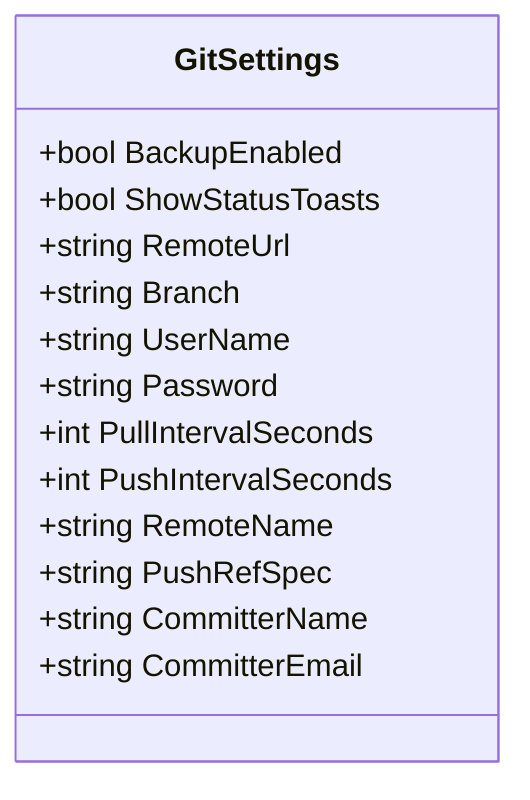
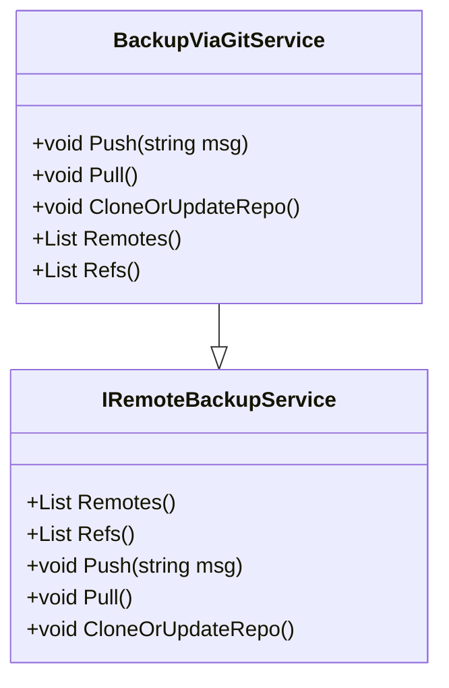
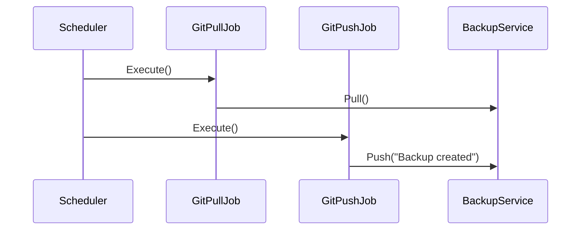
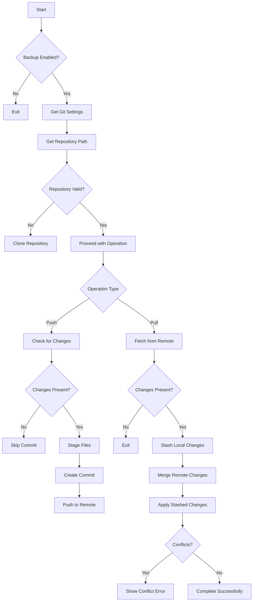
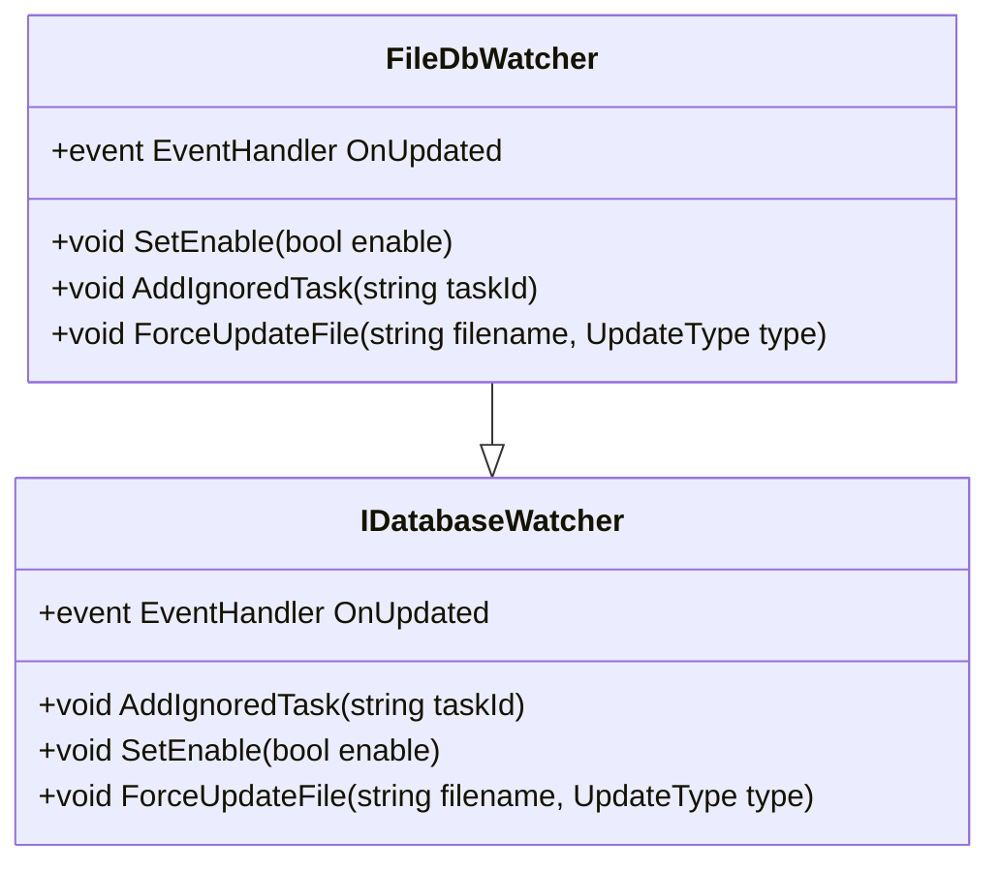
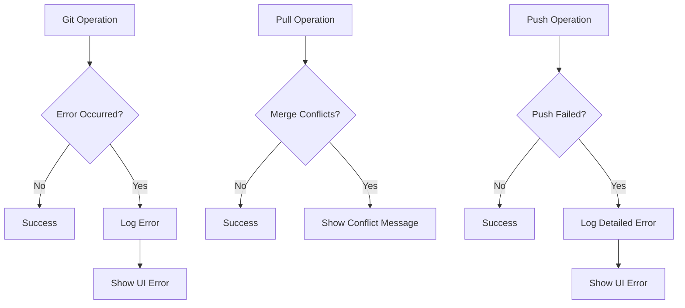
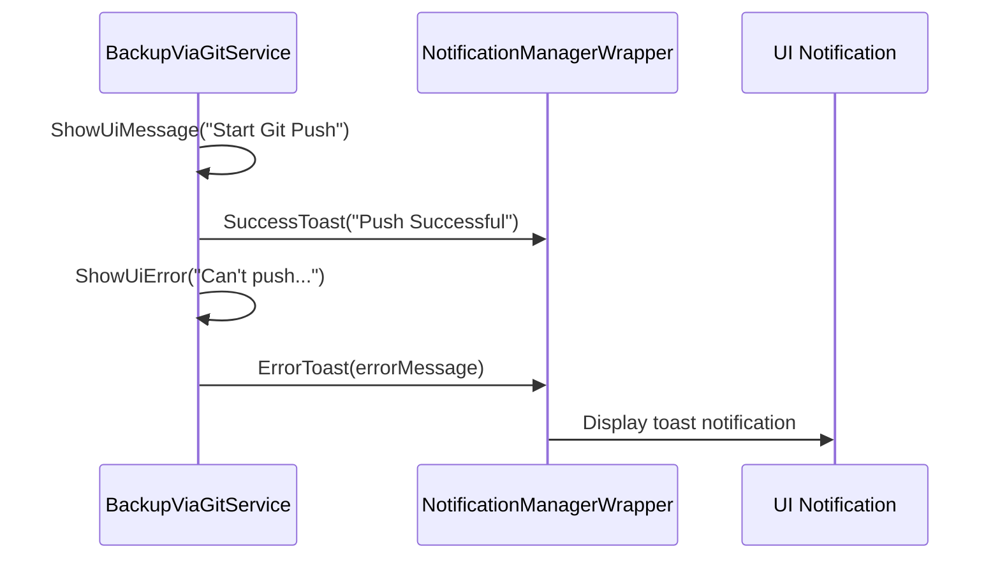

# Git Integration

<cite>
**Referenced Files in This Document**   
- [BackupViaGitService.cs](file://src/Unlimotion/Services/BackupViaGitService.cs)
- [GitSettings.cs](file://src/Unlimotion/ViewModel/TaskStorageSettings.cs)
- [GitPullJob.cs](file://src/Unlimotion/Scheduling/Jobs/GitPullJob.cs)
- [GitPushJob.cs](file://src/Unlimotion/Scheduling/Jobs/GitPushJob.cs)
- [FileDbWatcher.cs](file://src/Unlimotion/ViewModel/FileDbWatcher.cs)
- [SettingsViewModel.cs](file://src/Unlimotion/ViewModel/SettingsViewModel.cs)
- [TaskStorages.cs](file://src/Unlimotion/TaskStorages.cs)
- [INotificationManagerWrapper.cs](file://src/Unlimotion/ViewModel/INotificationManagerWrapper.cs)
- [NotificationManagerWrapper.cs](file://src/Unlimotion/NotificationManagerWrapper.cs)
</cite>

## Table of Contents
1. [Introduction](#introduction)
2. [Git Settings Configuration](#git-settings-configuration)
3. [BackupViaGitService Implementation](#backupviagitservice-implementation)
4. [Scheduling with Quartz.NET](#scheduling-with-quartznet)
5. [Git Operations Workflow](#git-operations-workflow)
6. [File Change Detection](#file-change-detection)
7. [Conflict Resolution and Error Handling](#conflict-resolution-and-error-handling)
8. [UI Notifications](#ui-notifications)
9. [Security Considerations](#security-considerations)
10. [Setup Instructions](#setup-instructions)
11. [Troubleshooting](#troubleshooting)

## Introduction
Unlimotion's Git integration system provides automated backup and synchronization of task data using Git repositories. This documentation details the implementation of the BackupViaGitService, which enables periodic synchronization of task data with remote Git repositories through pull and push operations. The system uses Quartz.NET for scheduling, LibGit2Sharp for Git operations, and a file watcher to detect changes in the local task storage.

**Section sources**
- [BackupViaGitService.cs](file://src/Unlimotion/Services/BackupViaGitService.cs#L1-L50)

## Git Settings Configuration
The Git integration is configured through the GitSettings class, which contains various properties for repository configuration and synchronization behavior.

**Diagram sources**
- [GitSettings.cs](file://src/Unlimotion/ViewModel/TaskStorageSettings.cs#L16-L34)

**Section sources**
- [GitSettings.cs](file://src/Unlimotion/ViewModel/TaskStorageSettings.cs#L16-L34)
- [SettingsViewModel.cs](file://src/Unlimotion/ViewModel/SettingsViewModel.cs#L40-L114)

### Configuration Parameters
- **RemoteUrl**: The URL of the remote Git repository
- **Branch**: The branch name to work with (default: "master")
- **UserName/Password**: Credentials for authentication (supports token-based authentication)
- **PullIntervalSeconds/PushIntervalSeconds**: Scheduling intervals for pull and push operations
- **CommitterName/Email**: Identity used for commit metadata
- **RemoteName**: Name of the remote (default: "origin")
- **PushRefSpec**: Reference specification for push operations
- **BackupEnabled**: Flag to enable/disable Git backup functionality
- **ShowStatusToasts**: Flag to control UI notifications

## BackupViaGitService Implementation
The BackupViaGitService class implements the IRemoteBackupService interface and provides the core functionality for Git operations.

**Diagram sources**
- [BackupViaGitService.cs](file://src/Unlimotion/Services/BackupViaGitService.cs#L1-L50)
- [IRemoteBackupService.cs](file://src/Unlimotion/ViewModel/IRemoteBackupService.cs#L1-L11)

**Section sources**
- [BackupViaGitService.cs](file://src/Unlimotion/Services/BackupViaGitService.cs#L1-L50)
- [IRemoteBackupService.cs](file://src/Unlimotion/ViewModel/IRemoteBackupService.cs#L1-L11)

### Key Methods
- **Push(msg)**: Commits local changes and pushes to the remote repository
- **Pull()**: Fetches changes from the remote repository and merges them locally
- **CloneOrUpdateRepo()**: Clones the repository if it doesn't exist, otherwise ensures it's properly configured
- **Remotes()**: Returns a list of configured remotes
- **Refs()**: Returns a list of available references in the repository

## Scheduling with Quartz.NET
The Git synchronization is managed by Quartz.NET scheduler with two dedicated jobs for pull and push operations.

**Diagram sources**
- [GitPullJob.cs](file://src/Unlimotion/Scheduling/Jobs/GitPullJob.cs#L1-L20)
- [GitPushJob.cs](file://src/Unlimotion/Scheduling/Jobs/GitPushJob.cs#L1-L21)
- [BackupViaGitService.cs](file://src/Unlimotion/Services/BackupViaGitService.cs#L1-L50)

**Section sources**
- [GitPullJob.cs](file://src/Unlimotion/Scheduling/Jobs/GitPullJob.cs#L1-L20)
- [GitPushJob.cs](file://src/Unlimotion/Scheduling/Jobs/GitPushJob.cs#L1-L21)
- [TaskStorages.cs](file://src/Unlimotion/TaskStorages.cs#L31-L57)

### Job Implementation
The GitPullJob and GitPushJob classes implement the IJob interface from Quartz.NET:

- **GitPullJob**: Checks if backup is enabled and calls the Pull method on the IRemoteBackupService
- **GitPushJob**: Checks if backup is enabled and calls the Push method with a default message on the IRemoteBackupService

The scheduling intervals are dynamically configurable through the SettingsViewModel, which updates the Quartz scheduler when the GitPullIntervalSeconds or GitPushIntervalSeconds properties change.

## Git Operations Workflow
The Git integration follows a specific workflow for both pull and push operations, with proper handling of repository state and conflicts.

**Diagram sources**
- [BackupViaGitService.cs](file://src/Unlimotion/Services/BackupViaGitService.cs#L129-L282)

**Section sources**
- [BackupViaGitService.cs](file://src/Unlimotion/Services/BackupViaGitService.cs#L129-L282)

### Push Workflow
1. Disable the database watcher to prevent event processing during the operation
2. Check if the repository has uncommitted changes (is dirty)
3. If changes are present:
   - Checkout the specified branch
   - Stage all changes
   - Create a commit with the provided message and configured committer information
4. Configure push options with credentials provider
5. Push to the remote repository
6. Re-enable the database watcher

### Pull Workflow
1. Disable the database watcher and task storage
2. Fetch changes from the remote repository
3. Check if there are differences between local and remote branches
4. If changes are present:
   - Stash any local uncommitted changes
   - Merge the remote changes into the local branch
   - Force update the file watcher for each changed file
   - Apply the stashed changes back
   - Check for merge conflicts
5. Re-enable the database watcher and task storage

## File Change Detection
The system uses a file watcher to detect changes in the task storage directory and trigger appropriate UI updates.

**Diagram sources**
- [FileDbWatcher.cs](file://src/Unlimotion/ViewModel/FileDbWatcher.cs#L1-L36)
- [IDatabaseWatcher.cs](file://src/Unlimotion/ViewModel/IDatabaseWatcher.cs#L1-L10)

**Section sources**
- [FileDbWatcher.cs](file://src/Unlimotion/ViewModel/FileDbWatcher.cs#L1-L152)
- [IDatabaseWatcher.cs](file://src/Unlimotion/ViewModel/IDatabaseWatcher.cs#L1-L10)
- [TaskStorages.cs](file://src/Unlimotion/TaskStorages.cs#L160-L196)

### Key Features
- **Throttling**: Uses a cache-based throttling mechanism to prevent excessive event firing
- **Filtering**: Ignores files related to Git operations (files with .lock or .orig extensions, files in .git directory)
- **Ignored Tasks**: Supports temporarily ignoring specific tasks from triggering updates
- **Event Types**: Emits events for file creation/changes (UpdateType.Saved) and deletions (UpdateType.Removed)

## Conflict Resolution and Error Handling
The Git integration includes comprehensive error handling and conflict resolution mechanisms.

**Diagram sources**
- [BackupViaGitService.cs](file://src/Unlimotion/Services/BackupViaGitService.cs#L129-L323)

**Section sources**
- [BackupViaGitService.cs](file://src/Unlimotion/Services/BackupViaGitService.cs#L129-L323)

### Conflict Resolution Strategy
- **Stashing**: Before pulling changes, any local uncommitted changes are stashed to prevent conflicts
- **Merge**: After fetching, the remote branch is merged into the local branch
- **Reapplication**: After merging, stashed changes are applied back to the working directory
- **Conflict Detection**: After applying stashed changes, the system checks for conflicts in the index
- **User Notification**: If conflicts are detected, a specific error message is shown instructing the user to resolve conflicts manually

### Error Handling
- All Git operations are wrapped in try-catch blocks
- Errors are logged to the debug output
- User-friendly error messages are displayed through the notification system
- Database watcher is always re-enabled in finally blocks to ensure proper state

## UI Notifications
The system provides feedback to users through toast notifications for Git operations.

**Diagram sources**
- [BackupViaGitService.cs](file://src/Unlimotion/Services/BackupViaGitService.cs#L129-L203)
- [NotificationManagerWrapper.cs](file://src/Unlimotion/NotificationManagerWrapper.cs#L1-L46)
- [INotificationManagerWrapper.cs](file://src/Unlimotion/ViewModel/INotificationManagerWrapper.cs#L1-L11)

**Section sources**
- [BackupViaGitService.cs](file://src/Unlimotion/Services/BackupViaGitService.cs#L129-L203)
- [NotificationManagerWrapper.cs](file://src/Unlimotion/NotificationManagerWrapper.cs#L1-L46)
- [INotificationManagerWrapper.cs](file://src/Unlimotion/ViewModel/INotificationManagerWrapper.cs#L1-L11)

### Notification Types
- **Success Toasts**: Shown for successful operations like "Push Successful" or "Merge Successful"
- **Error Toasts**: Shown for failed operations with descriptive error messages
- **Status Messages**: Shown at the beginning of operations like "Start Git Push"

The ShowStatusToasts setting controls whether these notifications are displayed.

## Security Considerations
The Git integration includes several security considerations, particularly around credential management.

### Credential Storage
- Git credentials (UserName and Password) are stored in the application configuration
- The code includes a TODO comment about encrypted storage, indicating that credentials are currently stored in plain text
- Password field in TaskStorageSettings has a TODO comment about encrypted storage

### Authentication Methods
- Supports standard username/password authentication
- Designed to work with token-based authentication (as indicated by default Password value "YourToken")
- Credentials are provided to Git operations through a CredentialsProvider callback

### Best Practices
- Use personal access tokens instead of passwords when possible
- Ensure the repository URL uses HTTPS for secure transmission
- Regularly rotate access tokens
- Limit repository permissions to only what's necessary for backup operations

## Setup Instructions
Follow these steps to configure Git backup for Unlimotion:

### 1. Configure Git Settings
Access the settings interface and configure the following:
- **RemoteUrl**: Enter the HTTPS or SSH URL of your Git repository
- **UserName**: Your Git username or email
- **Password**: Your Git password or personal access token
- **Branch**: The branch to use (typically "main" or "master")
- **CommitterName/Email**: Your identity for commit metadata

### 2. Enable Backup
- Set BackupEnabled to true
- Configure PullIntervalSeconds and PushIntervalSeconds according to your needs
- Set ShowStatusToasts to control notification visibility

### 3. Initialize Repository
- Click the "Clone" button to initialize the local repository
- Or ensure your local task data is already in a Git repository

### 4. Test Connection
- Use the "Pull" and "Push" buttons to test the connection
- Verify that operations complete successfully and notifications appear

**Section sources**
- [SettingsViewModel.cs](file://src/Unlimotion/ViewModel/SettingsViewModel.cs#L40-L114)
- [BackupViaGitService.cs](file://src/Unlimotion/Services/BackupViaGitService.cs#L1-L50)

## Troubleshooting
This section addresses common issues with the Git integration.

### Authentication Failures
**Symptoms**: "Can't push the remote repository" or similar errors
**Solutions**:
- Verify username and password/token are correct
- Ensure the token has appropriate permissions (read/write)
- For GitHub, use a personal access token instead of password
- Check that the repository URL is correct and accessible

### Merge Conflicts
**Symptoms**: "Fix conflicts and then commit the result" error
**Solutions**:
- Manually resolve conflicts in the local repository
- Use a Git client to commit the resolution
- After resolving, the synchronization should resume normally

### Network Connectivity Problems
**Symptoms**: Timeout errors or inability to reach the remote repository
**Solutions**:
- Check internet connection
- Verify the repository URL is accessible
- For corporate networks, ensure Git ports are not blocked
- Consider increasing timeout settings if available

### Repository Initialization Issues
**Symptoms**: Clone operation fails or repository not recognized
**Solutions**:
- Ensure the local path is writable
- Verify the remote URL is correct
- Check that Git is properly installed if using system Git

### Performance Issues
**Symptoms**: UI freezing during Git operations
**Solutions**:
- Increase synchronization intervals to reduce frequency
- Ensure the task database is not excessively large
- Consider excluding large files from the repository

**Section sources**
- [BackupViaGitService.cs](file://src/Unlimotion/Services/BackupViaGitService.cs#L129-L323)
- [FileDbWatcher.cs](file://src/Unlimotion/ViewModel/FileDbWatcher.cs#L1-L152)