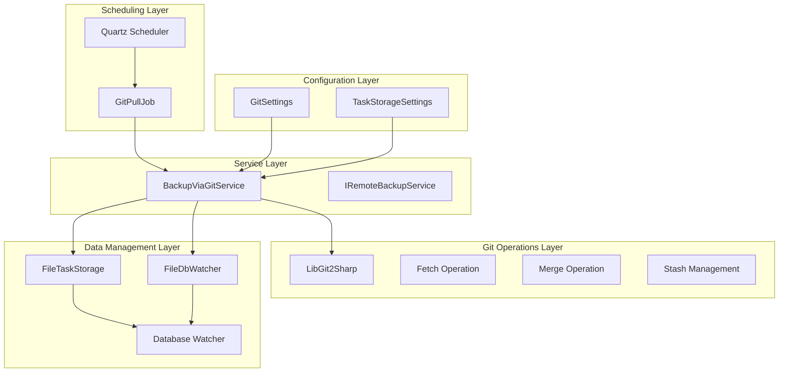
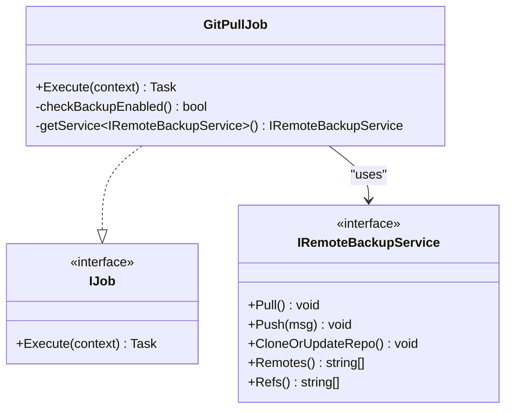
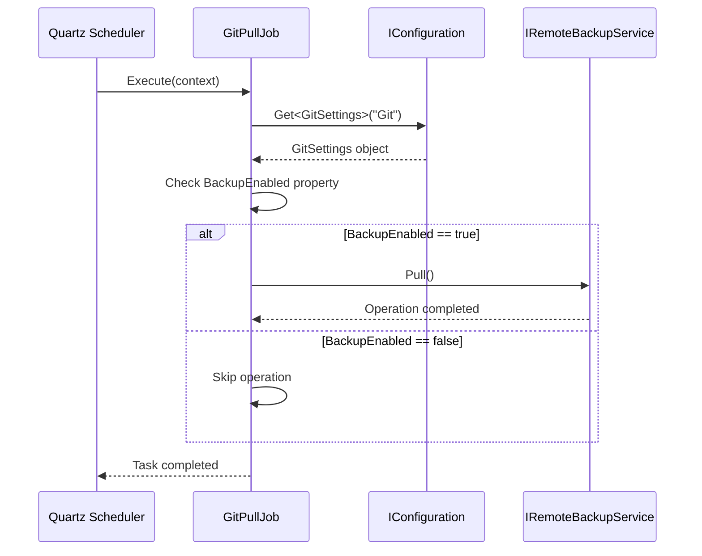
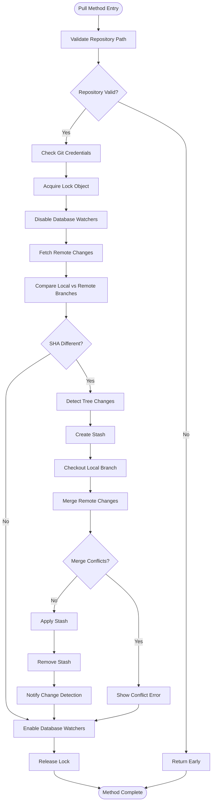
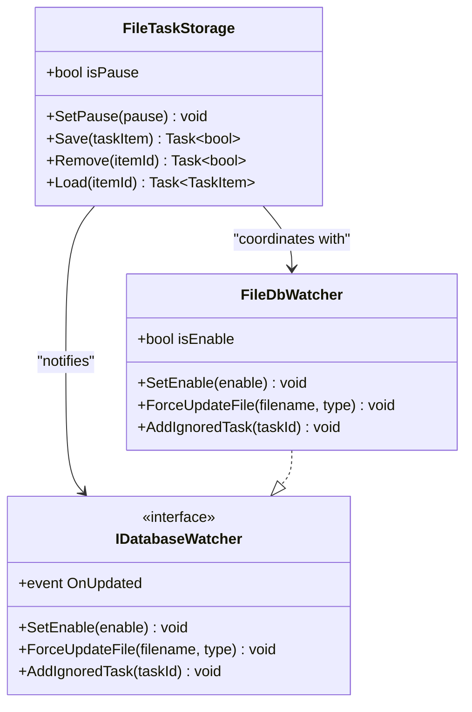
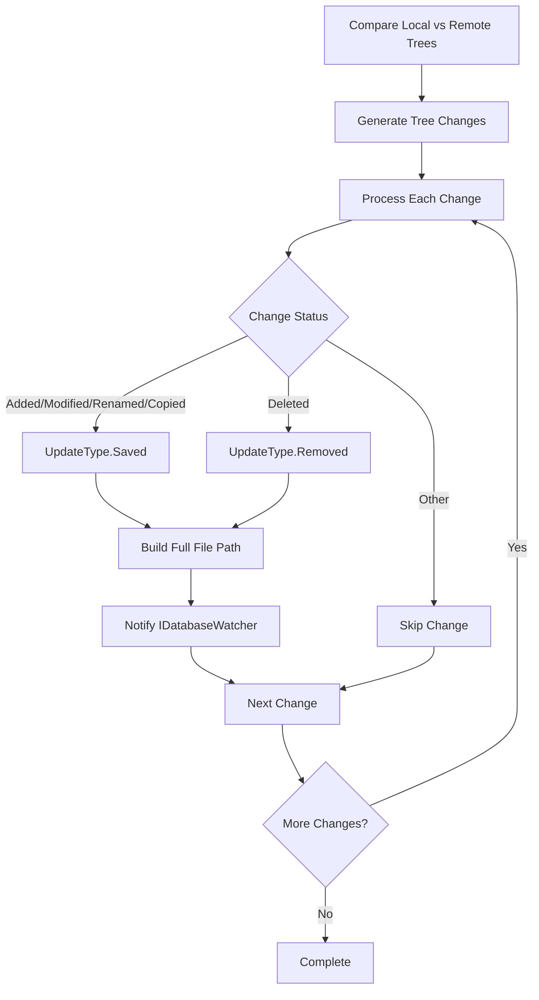
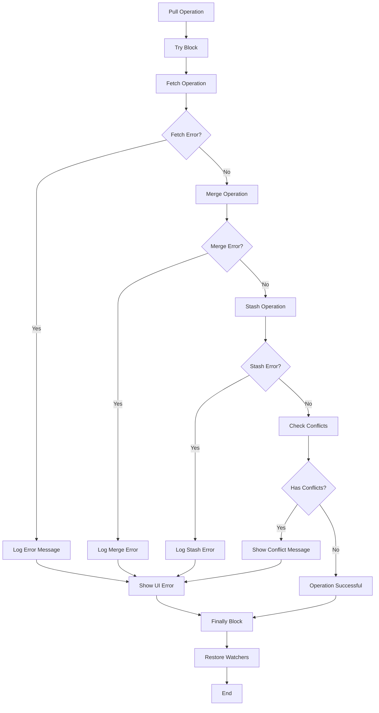

# Pull Operations

<cite>
**Referenced Files in This Document**
- [GitPullJob.cs](file://src/Unlimotion/Scheduling/Jobs/GitPullJob.cs)
- [BackupViaGitService.cs](file://src/Unlimotion/Services/BackupViaGitService.cs)
- [UpdateType.cs](file://src/Unlimotion.ViewModel/Models/UpdateType.cs)
- [IDatabaseWatcher.cs](file://src/Unlimotion.ViewModel/IDatabaseWatcher.cs)
- [FileTaskStorage.cs](file://src/Unlimotion/FileTaskStorage.cs)
- [FileDbWatcher.cs](file://src/Unlimotion.ViewModel/FileDbWatcher.cs)
- [IRemoteBackupService.cs](file://src/Unlimotion.ViewModel/IRemoteBackupService.cs)
- [App.axaml.cs](file://src/Unlimotion/App.axaml.cs)
- [GitSettings.cs](file://src/Unlimotion.TelegramBot/GitSettings.cs)
</cite>

## Table of Contents
1. [Introduction](#introduction)
2. [System Architecture](#system-architecture)
3. [Quartz.NET Scheduled Job Implementation](#quartznet-scheduled-job-implementation)
4. [GitPullJob Execution Flow](#gitpulljob-execution-flow)
5. [BackupViaGitService Pull Method](#backupviagitervice-pull-method)
6. [Database Watching and Task Storage Management](#database-watching-and-task-storage-management)
7. [Change Detection and UpdateType Mapping](#change-detection-and-updatetype-mapping)
8. [Error Handling Strategy](#error-handling-strategy)
9. [LibGit2Sharp API Usage](#libgit2sharp-api-usage)
10. [Performance Considerations](#performance-considerations)
11. [Conflict Resolution Strategies](#conflict-resolution-strategies)
12. [Configuration and Settings](#configuration-and-settings)

## Introduction

Unlimotion implements a sophisticated Git-based backup system that enables automatic synchronization of task data between local storage and remote Git repositories. The pull operation is a critical component that ensures local data remains synchronized with remote changes, handling complex scenarios such as merge conflicts, concurrent modifications, and race condition prevention.

The system employs a multi-layered approach combining Quartz.NET scheduled jobs, LibGit2Sharp for Git operations, and reactive database watching to create a robust synchronization mechanism that maintains data consistency while providing real-time feedback to users.

## System Architecture

The Git pull operation system in Unlimotion follows a layered architecture that separates concerns between scheduling, Git operations, database management, and user interface coordination.

**Diagram sources**
- [GitPullJob.cs](file://src/Unlimotion/Scheduling/Jobs/GitPullJob.cs#L1-L20)
- [BackupViaGitService.cs](file://src/Unlimotion/Services/BackupViaGitService.cs#L1-L50)
- [FileTaskStorage.cs](file://src/Unlimotion/FileTaskStorage.cs#L1-L50)
- [FileDbWatcher.cs](file://src/Unlimotion.ViewModel/FileDbWatcher.cs#L1-L50)

## Quartz.NET Scheduled Job Implementation

The Git pull operation is orchestrated through a Quartz.NET scheduled job that executes periodically according to configurable intervals. The job serves as the entry point for the synchronization process and ensures that pull operations occur automatically without user intervention.

**Diagram sources**
- [GitPullJob.cs](file://src/Unlimotion/Scheduling/Jobs/GitPullJob.cs#L10-L20)
- [IRemoteBackupService.cs](file://src/Unlimotion.ViewModel/IRemoteBackupService.cs#L5-L11)

The job implementation demonstrates a clean separation of concerns, focusing solely on triggering the pull operation when conditions permit. The actual Git operations are delegated to the service layer, ensuring maintainable and testable code.

**Section sources**
- [GitPullJob.cs](file://src/Unlimotion/Scheduling/Jobs/GitPullJob.cs#L1-L20)

## GitPullJob Execution Flow

The GitPullJob follows a straightforward execution pattern that validates configuration and delegates to the appropriate service method. The job includes built-in safety checks to prevent unnecessary operations when backup functionality is disabled.

**Diagram sources**
- [GitPullJob.cs](file://src/Unlimotion/Scheduling/Jobs/GitPullJob.cs#L12-L18)

The job's simplicity ensures reliability while maintaining flexibility for configuration-driven behavior. The use of dependency injection allows for easy testing and extension of the pull operation functionality.

**Section sources**
- [GitPullJob.cs](file://src/Unlimotion/Scheduling/Jobs/GitPullJob.cs#L12-L18)

## BackupViaGitService Pull Method

The core pull operation is implemented in the `Pull()` method of the `BackupViaGitService` class. This method orchestrates the entire synchronization process, from credential validation to conflict resolution, ensuring data consistency across local and remote repositories.

**Diagram sources**
- [BackupViaGitService.cs](file://src/Unlimotion/Services/BackupViaGitService.cs#L180-L320)

The pull method implements a comprehensive workflow that handles various edge cases and ensures system stability during synchronization operations.

**Section sources**
- [BackupViaGitService.cs](file://src/Unlimotion/Services/BackupViaGitService.cs#L180-L320)

## Database Watching and Task Storage Management

During pull operations, the system temporarily disables database watching and task storage to prevent race conditions and ensure data consistency. This coordination is crucial for maintaining synchronization integrity when multiple operations modify the same data concurrently.

**Diagram sources**
- [FileTaskStorage.cs](file://src/Unlimotion/FileTaskStorage.cs#L278-L280)
- [FileDbWatcher.cs](file://src/Unlimotion.ViewModel/FileDbWatcher.cs#L20-L30)
- [IDatabaseWatcher.cs](file://src/Unlimotion.ViewModel/IDatabaseWatcher.cs#L5-L10)

The temporary disablement of watchers prevents duplicate notifications and ensures that change events are processed consistently during the pull operation. The `SetPause` method in `FileTaskStorage` provides a simple yet effective mechanism for suspending normal operations during critical sections.

**Section sources**
- [FileTaskStorage.cs](file://src/Unlimotion/FileTaskStorage.cs#L278-L280)
- [BackupViaGitService.cs](file://src/Unlimotion/Services/BackupViaGitService.cs#L208-L212)

## Change Detection and UpdateType Mapping

The system implements sophisticated change detection that maps Git tree changes to `UpdateType` enumerations, enabling precise notification of modifications to the database watcher. This mapping ensures that the UI and underlying data structures remain synchronized with Git repository state changes.

**Diagram sources**
- [BackupViaGitService.cs](file://src/Unlimotion/Services/BackupViaGitService.cs#L240-L260)

The change detection mechanism handles various Git change types and maps them appropriately to maintain consistency between the file system and application state. This approach ensures that deletions, additions, modifications, and renamings are all handled correctly.

**Section sources**
- [BackupViaGitService.cs](file://src/Unlimotion/Services/BackupViaGitService.cs#L240-L260)
- [UpdateType.cs](file://src/Unlimotion.ViewModel\Models/UpdateType.cs#L3-L7)

## Error Handling Strategy

The pull operation implements a comprehensive error handling strategy that addresses various failure scenarios, from network issues to merge conflicts. The system provides meaningful error messages and maintains system stability even when operations fail.

**Diagram sources**
- [BackupViaGitService.cs](file://src/Unlimotion/Services/BackupViaGitService.cs#L215-L290)

The error handling strategy ensures that users receive appropriate feedback while maintaining system stability. Error messages are logged for debugging purposes and presented to users in a way that facilitates resolution.

**Section sources**
- [BackupViaGitService.cs](file://src/Unlimotion/Services/BackupViaGitService.cs#L215-L290)

## LibGit2Sharp API Usage

The pull operation extensively uses LibGit2Sharp APIs to perform Git operations safely and efficiently. The implementation demonstrates proper resource management and error handling patterns that ensure reliable Git operations.

### Fetch Operations with Credentials

The fetch operation uses configured credentials to authenticate with remote repositories, supporting both username/password authentication and token-based authentication for secure access.

### Stash Management

The stash operation creates temporary snapshots of local changes before attempting merges, preserving user work and enabling safe integration of remote changes.

### Merge Operations

The merge operation attempts to integrate remote changes with local modifications, handling conflicts gracefully and providing mechanisms for conflict resolution.

**Section sources**
- [BackupViaGitService.cs](file://src/Unlimotion/Services/BackupViaGitService.cs#L200-L230)
- [BackupViaGitService.cs](file://src/Unlimotion/Services/BackupViaGitService.cs#L232-L240)

## Performance Considerations

For large repositories, the pull operation implements several performance optimization strategies to minimize impact on system responsiveness and resource utilization.

### Lock-Based Synchronization

The use of a static lock object ensures that only one pull operation can execute at a time, preventing resource contention and ensuring data consistency.

### Temporary Watcher Disablement

Disabling database watchers during pull operations reduces overhead and prevents unnecessary notifications that could slow down the synchronization process.

### Efficient Change Detection

The change detection algorithm processes only modified files, avoiding unnecessary work when repositories have minimal changes.

### Asynchronous Operations

Critical operations are performed asynchronously to maintain UI responsiveness while Git operations execute in the background.

**Section sources**
- [BackupViaGitService.cs](file://src/Unlimotion/Services/BackupViaGitService.cs#L182-L184)
- [FileTaskStorage.cs](file://src/Unlimotion/FileTaskStorage.cs#L278-L280)

## Conflict Resolution Strategies

When merge conflicts occur, the system provides clear guidance to users while preserving their work through stash operations. The conflict resolution strategy balances automation with user control.

### Automatic Conflict Detection

The system automatically detects conflicts by examining the merge results and identifying files with unresolved conflicts.

### Stash Preservation

Local changes are preserved in stashes before attempting merges, ensuring that user work is not lost during synchronization attempts.

### Manual Resolution Guidance

Users receive clear instructions on how to resolve conflicts manually, including steps for committing resolved changes.

### Graceful Degradation

Even when conflicts cannot be resolved automatically, the system continues to operate with reduced functionality rather than failing catastrophically.

**Section sources**
- [BackupViaGitService.cs](file://src/Unlimotion/Services/BackupViaGitService.cs#L285-L290)

## Configuration and Settings

The Git pull operation relies on comprehensive configuration settings that control behavior, timing, and authentication. These settings enable flexible deployment across different environments and use cases.

### Timing Configuration

Pull intervals are configurable in seconds, allowing fine-tuning of synchronization frequency based on usage patterns and network conditions.

### Authentication Settings

Support for both username/password and token-based authentication provides flexibility for different Git hosting platforms and security requirements.

### Repository Configuration

Settings control repository paths, branch names, and remote configurations, enabling support for complex repository structures and workflows.

### User Interface Settings

Options control whether status messages are displayed to users, providing flexibility for different deployment scenarios.

**Section sources**
- [App.axaml.cs](file://src/Unlimotion/App.axaml.cs#L188-L232)
- [GitSettings.cs](file://src/Unlimotion.TelegramBot/GitSettings.cs#L3-L18)