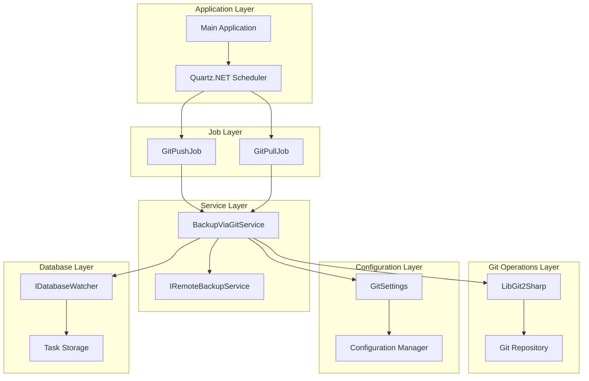
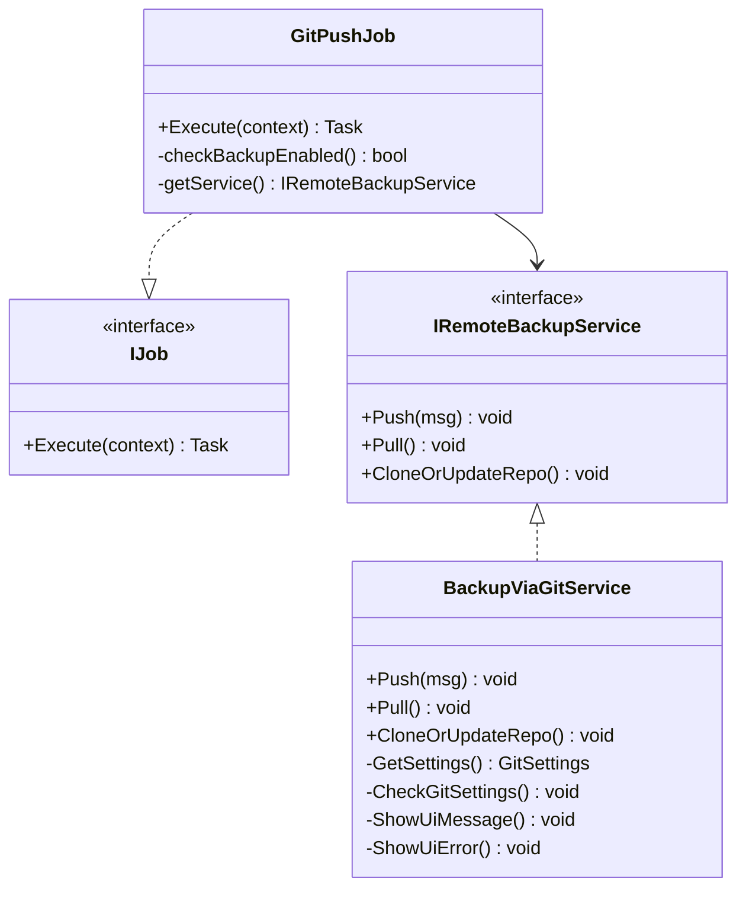
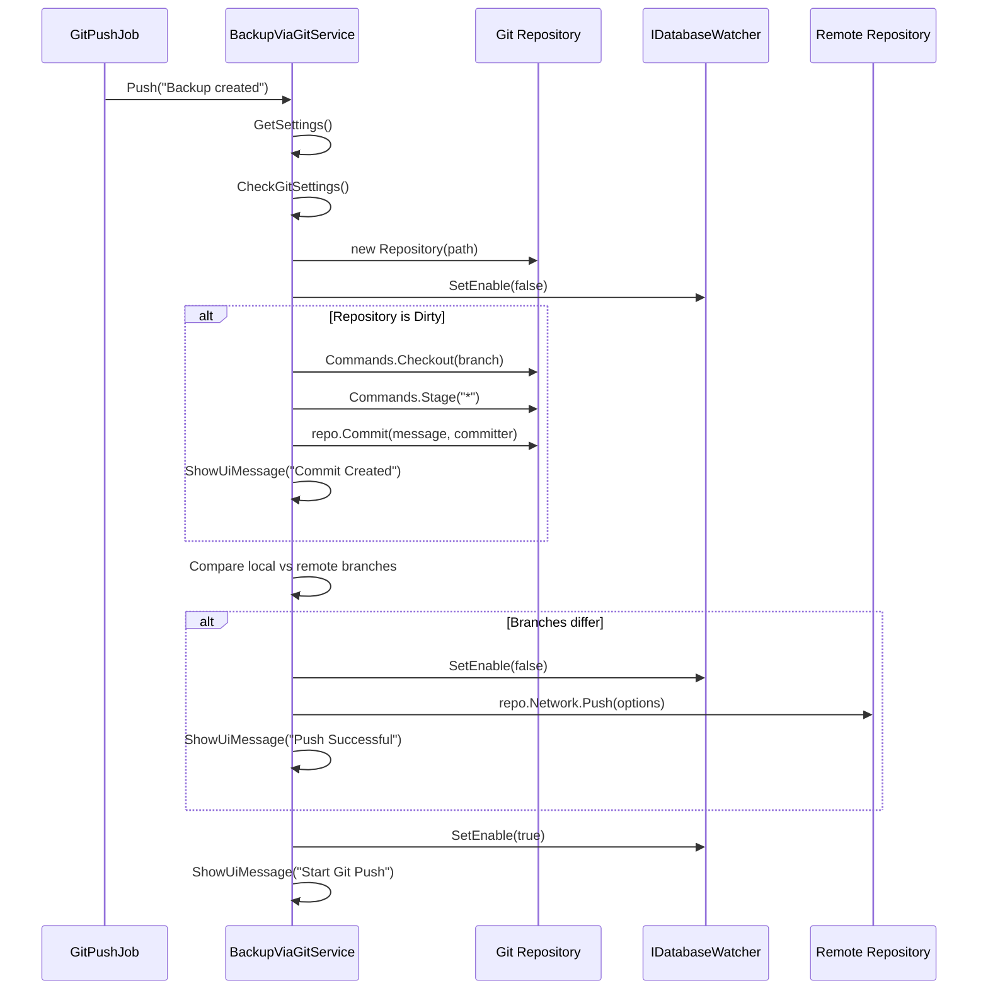
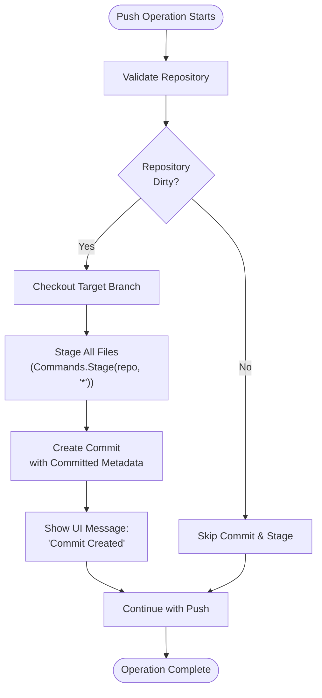
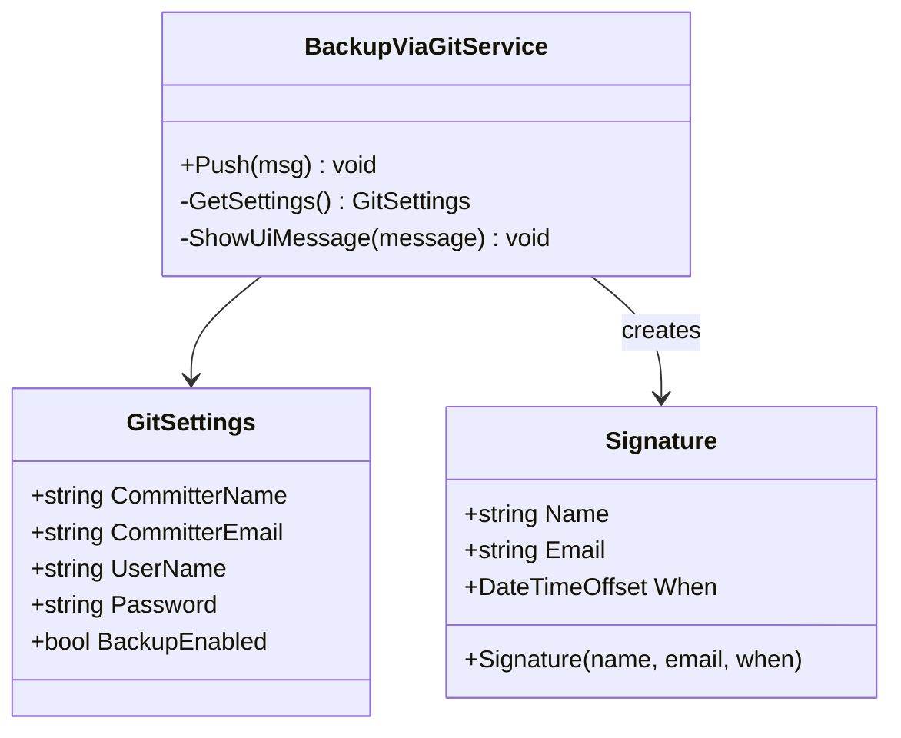
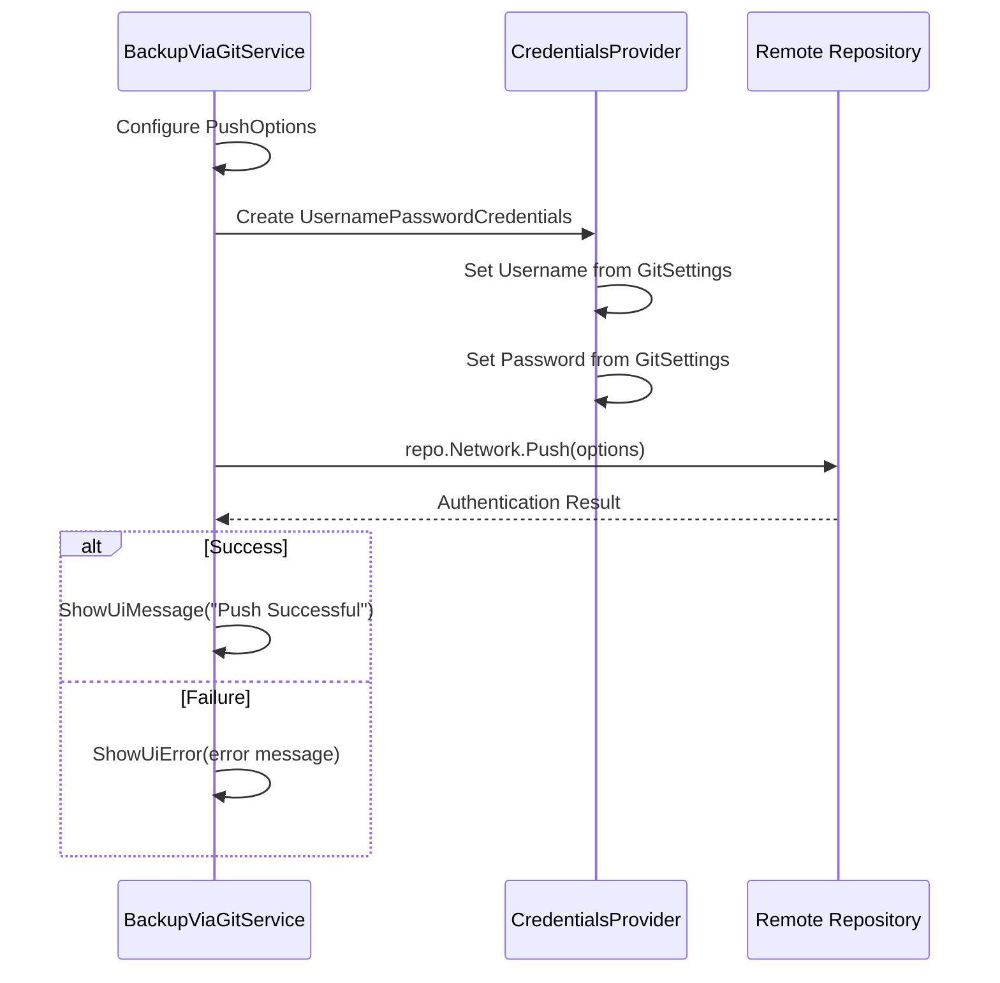
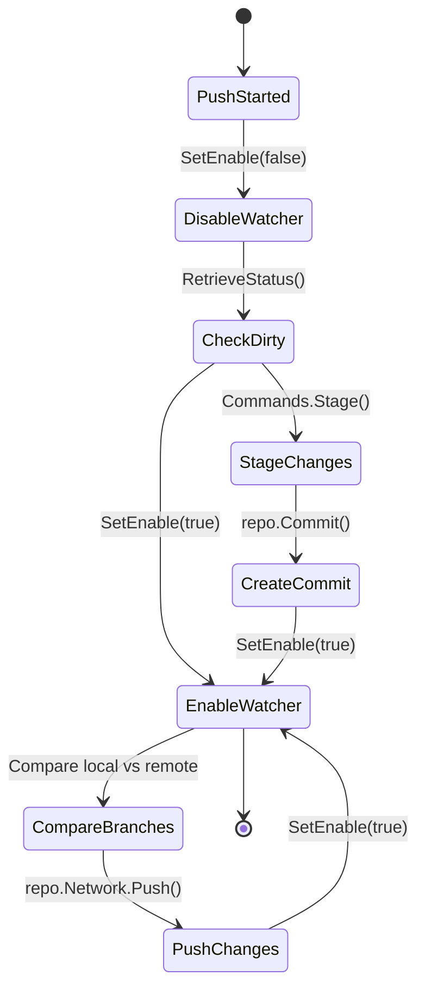
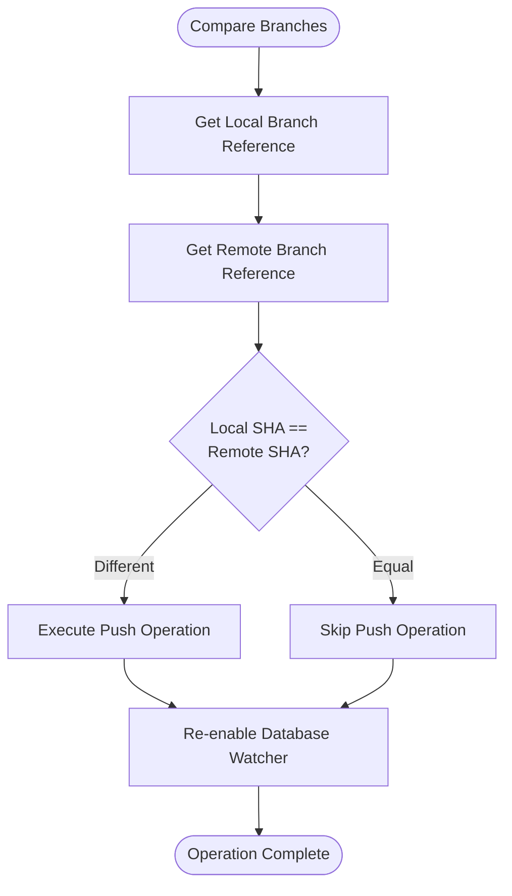
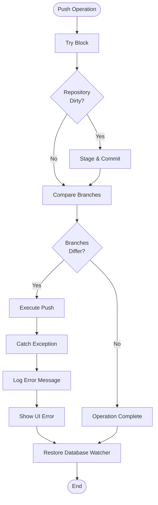

# Push Operations

<cite>
**Referenced Files in This Document**
- [GitPushJob.cs](file://src/Unlimotion/Scheduling/Jobs/GitPushJob.cs)
- [BackupViaGitService.cs](file://src/Unlimotion/Services/BackupViaGitService.cs)
- [GitSettings.cs](file://src/Unlimotion.ViewModel/GitSettings.cs)
- [IRemoteBackupService.cs](file://src/Unlimotion.ViewModel/IRemoteBackupService.cs)
- [IDatabaseWatcher.cs](file://src/Unlimotion.ViewModel/IDatabaseWatcher.cs)
- [App.axaml.cs](file://src/Unlimotion/App.axaml.cs)
- [GitService.cs](file://src/Unlimotion.TelegramBot/GitService.cs)
- [appsettings.json](file://src/Unlimotion.TelegramBot/appsettings.json)
</cite>

## Table of Contents
1. [Introduction](#introduction)
2. [System Architecture](#system-architecture)
3. [GitPushJob Implementation](#gitpushjob-implementation)
4. [BackupViaGitService Push Method](#backupviagit-service-push-method)
5. [Dirty State Detection and Staging](#dirty-state-detection-and-staging)
6. [Commit Creation and Metadata](#commit-creation-and-metadata)
7. [Push Execution with Authentication](#push-execution-with-authentication)
8. [Database Watching Management](#database-watching-management)
9. [Branch Comparison Logic](#branch-comparison-logic)
10. [Error Handling Strategy](#error-handling-strategy)
11. [LibGit2Sharp API Usage](#libgit2sharp-api-usage)
12. [Security Considerations](#security-considerations)
13. [Performance Implications](#performance-implications)
14. [Configuration Management](#configuration-management)
15. [Conclusion](#conclusion)

## Introduction

Unlimotion implements a sophisticated Git backup system that automatically synchronizes task data with remote repositories through periodic push operations. The system leverages Quartz.NET for job scheduling and LibGit2Sharp for Git operations, providing reliable data backup capabilities while maintaining data consistency and security.

The push operation system consists of several key components: a scheduled job executor (`GitPushJob`), a service layer (`BackupViaGitService`) that handles the actual Git operations, and comprehensive error handling mechanisms. The system is designed to minimize disruptions to the main application workflow while ensuring data integrity.

## System Architecture

The Git push operations in Unlimotion follow a layered architecture that separates concerns between scheduling, service logic, and Git operations:



**Diagram sources**
- [GitPushJob.cs](file://src/Unlimotion/Scheduling/Jobs/GitPushJob.cs#L1-L21)
- [BackupViaGitService.cs](file://src/Unlimotion/Services/BackupViaGitService.cs#L1-L50)
- [App.axaml.cs](file://src/Unlimotion/App.axaml.cs#L188-L210)

## GitPushJob Implementation

The `GitPushJob` serves as the entry point for periodic backup operations, implementing the Quartz.NET `IJob` interface. This lightweight job acts as a coordinator that delegates actual Git operations to the `BackupViaGitService`.



**Diagram sources**
- [GitPushJob.cs](file://src/Unlimotion/Scheduling/Jobs/GitPushJob.cs#L10-L20)
- [IRemoteBackupService.cs](file://src/Unlimotion.ViewModel/IRemoteBackupService.cs#L4-L11)
- [BackupViaGitService.cs](file://src/Unlimotion/Services/BackupViaGitService.cs#L17-L30)

The job implementation follows a simple pattern: it checks if backup is enabled in the configuration, retrieves the backup service, and invokes the push operation with a default commit message. This design ensures that Git operations are performed asynchronously and don't block the main application thread.

**Section sources**
- [GitPushJob.cs](file://src/Unlimotion/Scheduling/Jobs/GitPushJob.cs#L10-L20)

## BackupViaGitService Push Method

The `Push()` method in `BackupViaGitService` represents the core implementation of Git push operations. This method orchestrates the entire backup process, from detecting changes to executing the push with proper error handling.



**Diagram sources**
- [BackupViaGitService.cs](file://src/Unlimotion/Services/BackupViaGitService.cs#L108-L180)

The push method implements several critical features:

1. **Thread Safety**: Uses a static lock object to prevent concurrent push operations
2. **Repository Validation**: Ensures the Git repository is valid before proceeding
3. **Configuration Checking**: Validates Git credentials and settings
4. **Database Watcher Management**: Temporarily disables database watching to prevent interference
5. **Conditional Operations**: Only performs staging and committing when changes are detected

**Section sources**
- [BackupViaGitService.cs](file://src/Unlimotion/Services/BackupViaGitService.cs#L108-L180)

## Dirty State Detection and Staging

The system implements intelligent change detection through LibGit2Sharp's `RetrieveStatus()` method, which determines whether the working directory contains uncommitted changes. This approach ensures that pushes only occur when meaningful changes exist.



**Diagram sources**
- [BackupViaGitService.cs](file://src/Unlimotion/Services/BackupViaGitService.cs#L130-L150)

The staging process uses wildcard pattern `"*"` to stage all changes, ensuring comprehensive backup coverage. This approach captures all modifications to task data files, including additions, deletions, and modifications.

**Section sources**
- [BackupViaGitService.cs](file://src/Unlimotion/Services/BackupViaGitService.cs#L130-L150)

## Commit Creation and Metadata

The commit creation process utilizes LibGit2Sharp's `Signature` class to establish proper committer metadata. This ensures that backup commits are properly attributed and can be distinguished from user-generated commits.

The system uses configurable committer information stored in `GitSettings`, allowing administrators to customize the author and email associated with backup operations. This metadata is crucial for audit trails and repository management.



**Diagram sources**
- [BackupViaGitService.cs](file://src/Unlimotion/Services/BackupViaGitService.cs#L140-L145)
- [GitSettings.cs](file://src/Unlimotion.ViewModel/GitSettings.cs#L20-L34)

The commit message parameter allows for dynamic messaging, though the current implementation uses a static "Backup created" message. Future enhancements could include timestamp-based messages or change count information.

**Section sources**
- [BackupViaGitService.cs](file://src/Unlimotion/Services/BackupViaGitService.cs#L140-L145)

## Push Execution with Authentication

The push operation implements robust authentication handling through LibGit2Sharp's `CredentialsProvider` mechanism. The system uses basic authentication with username and password credentials, configured through the `GitSettings` class.



**Diagram sources**
- [BackupViaGitService.cs](file://src/Unlimotion/Services/BackupViaGitService.cs#L170-L180)

The authentication mechanism supports various Git hosting services, including GitHub, GitLab, and self-hosted solutions. The credentials are securely managed through the configuration system and passed through the LibGit2Sharp API for secure transmission.

**Section sources**
- [BackupViaGitService.cs](file://src/Unlimotion/Services/BackupViaGitService.cs#L170-L180)

## Database Watching Management

To ensure data consistency during push operations, the system temporarily disables the database watcher through the `IDatabaseWatcher` interface. This prevents the watcher from triggering additional file change events during the backup process.



**Diagram sources**
- [BackupViaGitService.cs](file://src/Unlimotion/Services/BackupViaGitService.cs#L130-L150)
- [IDatabaseWatcher.cs](file://src/Unlimotion.ViewModel/IDatabaseWatcher.cs#L6-L10)

The watcher management ensures that:
- No spurious notifications occur during the backup process
- File system events don't interfere with Git operations
- The application maintains responsive performance during backups

**Section sources**
- [BackupViaGitService.cs](file://src/Unlimotion/Services/BackupViaGitService.cs#L130-L150)
- [IDatabaseWatcher.cs](file://src/Unlimotion.ViewModel/IDatabaseWatcher.cs#L6-L10)

## Branch Comparison Logic

The system implements intelligent branch comparison to prevent unnecessary push operations. By comparing the SHA hashes of local and remote branch tips, the system determines whether synchronization is actually needed.



**Diagram sources**
- [BackupViaGitService.cs](file://src/Unlimotion/Services/BackupViaGitService.cs#L164-L175)

This comparison logic provides several benefits:
- **Network Efficiency**: Reduces unnecessary network traffic
- **Performance Optimization**: Avoids redundant Git operations
- **Resource Conservation**: Minimizes CPU and memory usage
- **User Experience**: Prevents unnecessary UI notifications

**Section sources**
- [BackupViaGitService.cs](file://src/Unlimotion/Services/BackupViaGitService.cs#L164-L175)

## Error Handling Strategy

The push operation implements comprehensive error handling to manage various failure scenarios gracefully. The system distinguishes between different types of errors and provides appropriate user feedback.



**Diagram sources**
- [BackupViaGitService.cs](file://src/Unlimotion/Services/BackupViaGitService.cs#L175-L190)

The error handling strategy covers:

1. **Network Issues**: Connection timeouts, DNS resolution failures
2. **Authentication Problems**: Invalid credentials, permission denied
3. **Repository Conflicts**: Merge conflicts, locked files
4. **Configuration Errors**: Missing settings, invalid paths
5. **System Errors**: Disk space, file permissions

Each error type receives appropriate logging and user notification, ensuring that administrators can diagnose and resolve issues effectively.

**Section sources**
- [BackupViaGitService.cs](file://src/Unlimotion/Services/BackupViaGitService.cs#L175-L190)

## LibGit2Sharp API Usage

The system extensively uses LibGit2Sharp APIs for Git operations, providing a robust and efficient implementation of Git functionality. Key API usage patterns include:

### Repository Initialization
```csharp
using var repo = new Repository(path);
```

### Status Retrieval
```csharp
var status = repo.RetrieveStatus();
bool isDirty = status.IsDirty;
```

### Branch Operations
```csharp
Commands.Checkout(repo, settings.git.PushRefSpec);
```

### Staging Operations
```csharp
Commands.Stage(repo, "*");
```

### Commit Creation
```csharp
repo.Commit(msg, committer, committer);
```

### Push Operations
```csharp
repo.Network.Push(repo.Network.Remotes[settings.git.RemoteName], 
                  settings.git.PushRefSpec, options);
```

### Credential Management
```csharp
options.CredentialsProvider = (_, _, _) => 
    new UsernamePasswordCredentials
    {
        Username = settings.git.UserName,
        Password = settings.git.Password
    };
```

The LibGit2Sharp library provides a strongly-typed C# interface to Git functionality, enabling safe and efficient Git operations within the .NET ecosystem. The library handles low-level Git operations while providing a clean abstraction layer.

**Section sources**
- [BackupViaGitService.cs](file://src/Unlimotion/Services/BackupViaGitService.cs#L115-L180)

## Security Considerations

The Git push system implements several security measures to protect sensitive information and ensure secure operations:

### Credential Management
- **Configuration-Based Storage**: Credentials are stored in application configuration
- **Environment-Specific Settings**: Different configurations for development and production
- **Encrypted Storage**: While not currently implemented, the architecture supports future encryption
- **Credential Rotation**: Easy updates through configuration changes

### Network Security
- **HTTPS Support**: Automatic HTTPS protocol for secure communication
- **Certificate Validation**: Proper SSL/TLS certificate verification
- **Authentication Headers**: Secure credential transmission

### Access Control
- **Repository Permissions**: Respects repository-level access controls
- **Branch Protection**: Honors branch protection rules
- **Rate Limiting**: Built-in rate limiting for API operations

### Data Protection
- **Sensitive Data Filtering**: Excludes sensitive information from commits
- **Temporary File Management**: Proper cleanup of temporary files
- **Audit Trail**: Comprehensive logging of all Git operations

The system currently stores credentials in plain text within configuration files. Future enhancements should implement encrypted storage for production environments.

**Section sources**
- [GitSettings.cs](file://src/Unlimotion.ViewModel/GitSettings.cs#L10-L12)
- [BackupViaGitService.cs](file://src/Unlimotion/Services/BackupViaGitService.cs#L65-L75)

## Performance Implications

The Git push system is designed with performance considerations to minimize impact on application responsiveness:

### Resource Management
- **Connection Pooling**: Reuses Git connections where possible
- **Memory Optimization**: Proper disposal of Git objects
- **Async Operations**: Non-blocking push operations
- **Batch Processing**: Groups multiple changes efficiently

### Network Efficiency
- **Delta Compression**: Uses Git's built-in compression
- **Selective Pushing**: Only pushes when changes exist
- **Bandwidth Monitoring**: Respects network capacity
- **Retry Logic**: Intelligent retry with exponential backoff

### System Impact
- **CPU Usage**: Minimal CPU overhead during normal operations
- **Disk I/O**: Optimized file system operations
- **Memory Footprint**: Efficient memory utilization
- **Concurrent Operations**: Thread-safe design prevents conflicts

### Scalability Considerations
- **Large Repositories**: Handles repositories with many files
- **Frequent Changes**: Efficient processing of rapid updates
- **Network Variability**: Adapts to changing network conditions
- **Storage Growth**: Manages growing repository sizes

The system's performance characteristics make it suitable for applications with frequent data changes while maintaining acceptable response times for the main application interface.

**Section sources**
- [BackupViaGitService.cs](file://src/Unlimotion/Services/BackupViaGitService.cs#L108-L180)

## Configuration Management

The Git push system uses a hierarchical configuration approach that supports flexible deployment scenarios:

### Configuration Structure
```csharp
public class GitSettings
{
    public bool BackupEnabled { get; set; } = false;
    public bool ShowStatusToasts { get; set; } = true;
    public string RemoteUrl { get; set; }
    public string Branch { get; set; } = "master";
    public string UserName { get; set; } = "YourEmail";
    public string Password { get; set; } = "YourToken";
    public int PullIntervalSeconds { get; set; } = 30;
    public int PushIntervalSeconds { get; set; } = 60;
    public string RemoteName { get; set; } = "origin";
    public string PushRefSpec { get; set; } = "refs/heads/master";
    public string CommitterName { get; set; } = "Backuper";
    public string CommitterEmail { get; set; } = "Backuper@unlimotion.ru";
}
```

### Deployment Scenarios
- **Development Mode**: Local repository with minimal settings
- **Testing Environment**: Staging repository with specific configurations
- **Production Deployment**: Remote repository with security restrictions
- **Multi-Environment**: Different settings for different deployment targets

### Dynamic Configuration
- **Runtime Updates**: Settings can be changed without restart
- **Environment Variables**: Support for environment-based configuration
- **Configuration Validation**: Automatic validation of settings
- **Default Values**: Reasonable defaults for all settings

The configuration system provides flexibility for different deployment scenarios while maintaining security and operational reliability.

**Section sources**
- [GitSettings.cs](file://src/Unlimotion.ViewModel/GitSettings.cs#L16-L34)
- [App.axaml.cs](file://src/Unlimotion/App.axaml.cs#L170-L190)

## Conclusion

The Git push operations in Unlimotion represent a sophisticated implementation of automated backup and synchronization capabilities. Through careful design and implementation, the system provides reliable data protection while minimizing impact on application performance.

Key strengths of the implementation include:

- **Robust Error Handling**: Comprehensive error management with appropriate user feedback
- **Intelligent Change Detection**: Efficient determination of when synchronization is needed
- **Security Awareness**: Proper credential management and secure communication
- **Performance Optimization**: Minimal impact on application responsiveness
- **Flexible Configuration**: Support for diverse deployment scenarios

The system's modular architecture enables easy maintenance and future enhancements, while the use of established libraries (LibGit2Sharp, Quartz.NET) ensures stability and reliability. The combination of scheduled jobs, service-layer abstraction, and comprehensive error handling creates a production-ready solution for Git-based data backup.

Future improvements could include encrypted credential storage, incremental backup strategies, and enhanced conflict resolution mechanisms. The current implementation provides a solid foundation for these enhancements while delivering immediate value as a reliable backup solution.