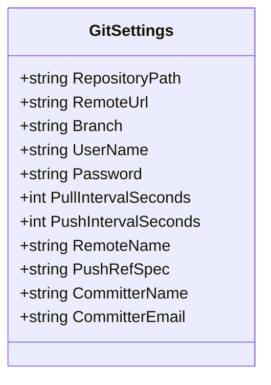
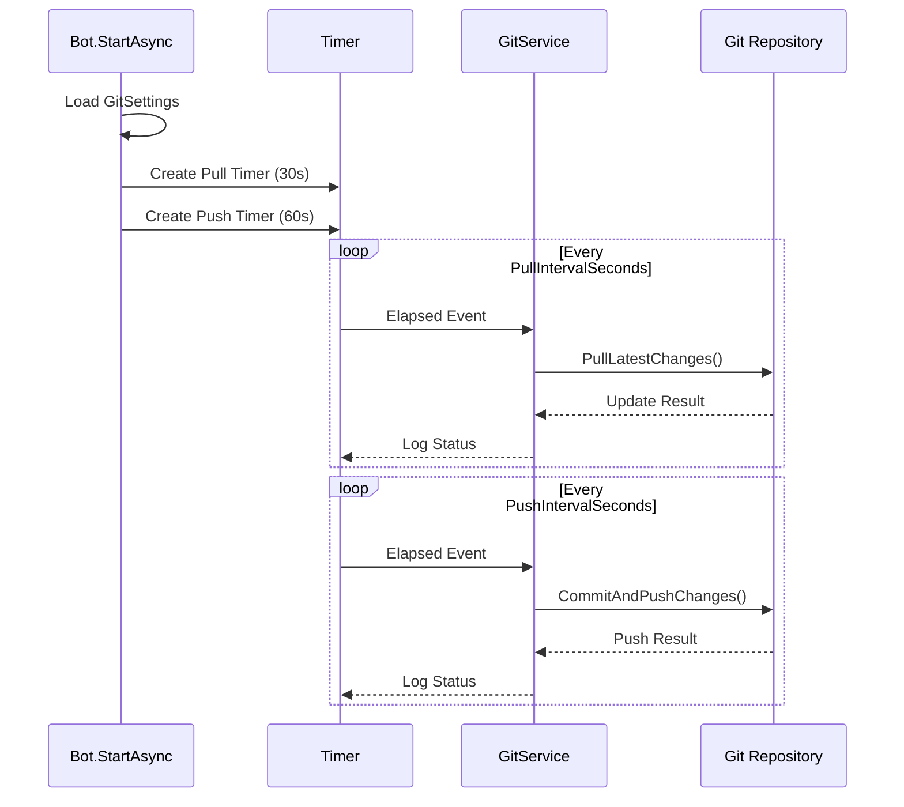
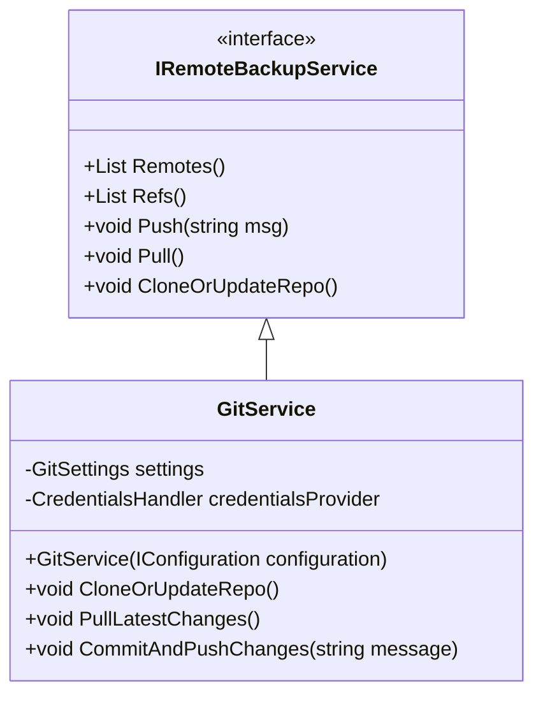

# Git Synchronization Integration

<cite>
**Referenced Files in This Document**   
- [GitSettings.cs](file://src/Unlimotion.TelegramBot/GitSettings.cs)
- [Bot.cs](file://src/Unlimotion.TelegramBot/Bot.cs)
- [GitService.cs](file://src/Unlimotion.TelegramBot/GitService.cs)
- [IRemoteBackupService.cs](file://src/Unlimotion.ViewModel/IRemoteBackupService.cs)
- [TaskService.cs](file://src/Unlimotion.TelegramBot/TaskService.cs)
- [appsettings.json](file://src/Unlimotion.TelegramBot/appsettings.json)
</cite>

## Table of Contents
1. [Introduction](#introduction)
2. [Git Settings Configuration](#git-settings-configuration)
3. [Repository Initialization and Automatic Clone-or-Update](#repository-initialization-and-automatic-clone-or-update)
4. [Timer-Driven Synchronization Mechanism](#timer-driven-synchronization-mechanism)
5. [GitPullJob and GitPushJob Implementation](#gitpulljob-and-gitpushjob-implementation)
6. [IRemoteBackupService Abstraction and GitService Implementation](#iremotebackupservice-abstraction-and-gitservice-implementation)
7. [Commit Message Strategy and Change Detection](#commit-message-strategy-and-change-detection)
8. [Error Handling and Network Operation Resilience](#error-handling-and-network-operation-resilience)
9. [Conflict Resolution and Branch Management](#conflict-resolution-and-branch-management)
10. [Security Considerations for Credentials Storage](#security-considerations-for-credentials-storage)
11. [Troubleshooting Common Synchronization Issues](#troubleshooting-common-synchronization-issues)
12. [Best Practices for Repository Management](#best-practices-for-repository-management)

## Introduction
The Git synchronization integration in Unlimotion enables automated backup and synchronization of task data through Git version control. This system leverages timer-based operations to periodically pull updates from a remote repository and push local changes, ensuring data consistency across distributed environments. The implementation uses LibGit2Sharp for Git operations and integrates with a Telegram bot interface for remote task management. The architecture follows a service-oriented pattern with clear separation between the synchronization logic, configuration management, and business operations.

**Section sources**
- [Bot.cs](file://src/Unlimotion.TelegramBot/Bot.cs#L1-L50)
- [GitService.cs](file://src/Unlimotion.TelegramBot/GitService.cs#L1-L20)

## Git Settings Configuration
The Git synchronization behavior is controlled through the GitSettings class, which defines all configurable parameters for repository interaction. These settings are loaded from the application configuration (appsettings.json) and include repository location, remote URL, authentication credentials, branch specifications, and interval controls for synchronization frequency.

### Configuration Options
- **RepositoryPath**: Local directory path where the Git repository is cloned or updated (default: "GitTasks")
- **RemoteUrl**: URL of the remote Git repository for synchronization
- **Branch**: Target branch for operations (default: "master")
- **UserName/Password**: Credentials for authenticating with the remote repository
- **PullIntervalSeconds**: Frequency (in seconds) for pull operations (default: 30)
- **PushIntervalSeconds**: Frequency (in seconds) for commit/push operations (default: 60)
- **RemoteName**: Name of the remote repository (default: "origin")
- **PushRefSpec**: Reference specification for push operations (default: "refs/heads/main")
- **CommitterName/Email**: Identity used for Git commits (default: "Backuper" <Backuper@unlimotion.ru>)

These settings enable flexible deployment scenarios, allowing administrators to configure synchronization intervals based on network conditions and data volatility requirements.

**Diagram sources**
- [GitSettings.cs](file://src/Unlimotion.TelegramBot/GitSettings.cs#L3-L18)

**Section sources**
- [GitSettings.cs](file://src/Unlimotion.TelegramBot/GitSettings.cs#L1-L18)
- [appsettings.json](file://src/Unlimotion.TelegramBot/appsettings.json#L5-L13)

## Repository Initialization and Automatic Clone-or-Update
The system implements an automatic repository initialization mechanism that handles both initial cloning and subsequent updates. During startup in Bot.StartAsync, the CloneOrUpdateRepo method checks whether a valid Git repository exists at the specified RepositoryPath. If no valid repository is found, it performs a fresh clone from the RemoteUrl using the configured branch and credentials. If a repository already exists, it proceeds with a pull operation to ensure the local copy is up-to-date.

This initialization strategy ensures that the application can be deployed in new environments without manual repository setup while maintaining data integrity in existing installations. The operation is wrapped in exception handling to gracefully manage network failures or authentication issues during the initial synchronization phase.

**Section sources**
- [Bot.cs](file://src/Unlimotion.TelegramBot/Bot.cs#L40-L45)
- [GitService.cs](file://src/Unlimotion.TelegramBot/GitService.cs#L20-L45)

## Timer-Driven Synchronization Mechanism
The synchronization system employs a timer-based approach to automate Git operations at configurable intervals. During Bot.StartAsync execution, two independent timers are created using System.Timers.Timer: one for pull operations and another for push operations. The pull timer triggers at the frequency defined by PullIntervalSeconds (default: 30 seconds), while the push timer operates according to PushIntervalSeconds (default: 60 seconds).

Each timer callback executes the corresponding Git operation through the GitService abstraction, with appropriate logging to track synchronization activity. This decoupled design allows for independent configuration of pull and push frequencies, accommodating different requirements for incoming updates versus outgoing changes. The continuous timer-based approach ensures near-real-time synchronization without requiring external scheduling mechanisms.

**Diagram sources**
- [Bot.cs](file://src/Unlimotion.TelegramBot/Bot.cs#L47-L65)
- [GitService.cs](file://src/Unlimotion.TelegramBot/GitService.cs#L47-L109)

**Section sources**
- [Bot.cs](file://src/Unlimotion.TelegramBot/Bot.cs#L47-L65)
- [GitService.cs](file://src/Unlimotion.TelegramBot/GitService.cs#L47-L109)

## GitPullJob and GitPushJob Implementation
Although the current implementation does not contain explicit GitPullJob and GitPushJob classes (as suggested by the project structure), the functionality is implemented through direct method calls within the timer callbacks. The PullLatestChanges method performs a checkout to the configured branch followed by a pull operation using the provided credentials. Similarly, the CommitAndPushChanges method stages all changes, creates a commit if modifications exist, and pushes to the remote repository.

The pull operation uses LibGit2Sharp's Commands.Pull method with a configured FetchOptions containing the credentials provider, while the push operation utilizes repo.Network.Push with equivalent authentication. Both operations include comprehensive error handling to prevent timer interruption due to transient failures. The implementation effectively serves as an inline equivalent to Quartz.NET jobs, providing scheduled execution without requiring an external scheduling framework.

**Section sources**
- [GitService.cs](file://src/Unlimotion.TelegramBot/GitService.cs#L47-L109)

## IRemoteBackupService Abstraction and GitService Implementation
The system defines an IRemoteBackupService interface in the ViewModel layer that specifies the contract for remote backup operations, including Remotes(), Refs(), Push(), Pull(), and CloneOrUpdateRepo() methods. The GitService class serves as the concrete implementation of this abstraction, providing Git-specific functionality while adhering to the interface contract.

This abstraction enables dependency inversion, allowing components to interact with the backup system through a well-defined API without direct knowledge of the underlying Git implementation. The separation supports potential future implementations for alternative backup mechanisms (e.g., cloud storage, database replication) while maintaining a consistent interface for the application logic.

**Diagram sources**
- [IRemoteBackupService.cs](file://src/Unlimotion.ViewModel/IRemoteBackupService.cs#L3-L11)
- [GitService.cs](file://src/Unlimotion.TelegramBot/GitService.cs#L7-L15)

**Section sources**
- [IRemoteBackupService.cs](file://src/Unlimotion.ViewModel/IRemoteBackupService.cs#L1-L11)
- [GitService.cs](file://src/Unlimotion.TelegramBot/GitService.cs#L1-L15)

## Commit Message Strategy and Change Detection
The system employs a consistent commit message strategy with configurable messages passed to the CommitAndPushChanges method. The default message "Автоматический коммит изменений." (Automatic commit of changes) provides clear audit trail information. The implementation includes change detection logic that only creates commits when the repository is dirty (contains modified, added, or deleted files), preventing unnecessary empty commits.

Before committing, the system stages all changes using Commands.Stage with a wildcard pattern ("*"), ensuring comprehensive capture of modifications. The commit authorship is configured through the CommitterName and CommitterEmail settings, providing proper attribution in the Git history. This approach maintains a clean and meaningful revision history while minimizing repository bloat from redundant commits.

**Section sources**
- [GitService.cs](file://src/Unlimotion.TelegramBot/GitService.cs#L85-L95)

## Error Handling and Network Operation Resilience
The Git synchronization implementation incorporates comprehensive error handling to ensure resilience during network operations. All Git operations are wrapped in try-catch blocks that log exceptions using Serilog without interrupting the timer-based execution cycle. This fault-tolerant design allows transient network issues, authentication failures, or temporary repository inconsistencies to be logged and retried in subsequent cycles.

The error handling strategy follows a fail-safe approach: when a pull or push operation fails, the system continues to attempt synchronization at the next timer interval rather than terminating the process. Detailed error logging captures exception information for diagnostic purposes, enabling administrators to identify and resolve persistent issues. This resilience is critical for maintaining continuous operation in potentially unstable network environments.

**Section sources**
- [GitService.cs](file://src/Unlimotion.TelegramBot/GitService.cs#L23-L25)
- [GitService.cs](file://src/Unlimotion.TelegramBot/GitService.cs#L50-L52)
- [GitService.cs](file://src/Unlimotion.TelegramBot/GitService.cs#L80-L82)

## Conflict Resolution and Branch Management
The current implementation follows a simple linear workflow that assumes a single active branch (configured via the Branch setting). The system checks out the specified branch before both pull and push operations, ensuring operations occur on the correct branch. However, the implementation does not include explicit conflict resolution strategies beyond Git's default merge behavior.

When pull operations encounter conflicts, LibGit2Sharp will throw an exception that is logged but not programmatically resolved. This design assumes that the repository is primarily used for backup purposes with minimal concurrent modifications, reducing the likelihood of conflicts. For production deployments with multiple modification sources, additional conflict detection and resolution logic would be recommended, potentially including automated merge strategies or notification mechanisms.

**Section sources**
- [GitService.cs](file://src/Unlimotion.TelegramBot/GitService.cs#L54-L56)
- [GitService.cs](file://src/Unlimotion.TelegramBot/GitService.cs#L87-L88)

## Security Considerations for Credentials Storage
The system currently stores Git credentials (UserName and Password) in plain text within the appsettings.json configuration file. This approach presents security risks, particularly the password/token which provides access to the remote repository. The configuration pattern follows a straightforward design but lacks encryption or secure credential management features.

Best practice recommendations include using environment variables instead of configuration files for sensitive data, implementing credential encryption, or leveraging platform-specific secret management services. For GitHub and similar platforms, personal access tokens should have limited scope and expiration rather than using primary account passwords. The current implementation should be enhanced with proper credential protection mechanisms in production environments.

**Section sources**
- [GitSettings.cs](file://src/Unlimotion.TelegramBot/GitSettings.cs#L8-L9)
- [appsettings.json](file://src/Unlimotion.TelegramBot/appsettings.json#L9-L10)

## Troubleshooting Common Synchronization Issues
### Authentication Failures
Authentication issues typically manifest as LibGit2Sharp exceptions during clone, pull, or push operations. Verify that the UserName and Password in appsettings.json match the requirements of the Git hosting service. For services like GitHub, ensure a personal access token with appropriate repository permissions is used instead of a password.

### Merge Conflicts
Merge conflicts occur when simultaneous changes are made to the same files. Check application logs for pull operation failures and manually resolve conflicts by accessing the repository directly. Consider implementing a pre-push validation step to detect potential conflicts earlier.

### Network Timeouts
Network timeouts may occur with large repositories or unstable connections. Increase the timeout settings in LibGit2Sharp if available, or consider optimizing the repository size through Git garbage collection. Ensure the application has consistent network connectivity to the Git server.

### Incorrect Repository Paths
Path-related issues can prevent repository initialization. Verify that the RepositoryPath exists and is writable by the application process. Use absolute paths when possible to avoid resolution issues. Check that the path doesn't contain invalid characters for the operating system.

### Missing Remote URL
Ensure the RemoteUrl setting is properly configured with a valid Git repository URL. Test the URL connectivity independently using Git command-line tools to verify accessibility.

**Section sources**
- [GitService.cs](file://src/Unlimotion.TelegramBot/GitService.cs#L20-L45)
- [GitService.cs](file://src/Unlimotion.TelegramBot/GitService.cs#L50-L52)
- [GitService.cs](file://src/Unlimotion.TelegramBot/GitService.cs#L80-L82)

## Best Practices for Repository Management
1. **Regular Repository Maintenance**: Perform periodic Git garbage collection to optimize repository size and performance.
2. **Backup Strategy**: Treat the Git repository as a backup rather than the primary data store, maintaining additional backup mechanisms.
3. **Access Control**: Restrict repository access to authorized users and use read-only permissions when possible.
4. **Monitoring**: Implement monitoring of synchronization success rates and latency to detect issues early.
5. **Testing**: Regularly test the restore process to ensure backup integrity and recovery capability.
6. **Documentation**: Maintain clear documentation of the synchronization configuration and procedures.
7. **Version Compatibility**: Ensure LibGit2Sharp version compatibility with target Git servers and protocols.

**Section sources**
- [GitSettings.cs](file://src/Unlimotion.TelegramBot/GitSettings.cs#L1-L18)
- [GitService.cs](file://src/Unlimotion.TelegramBot/GitService.cs#L1-L15)