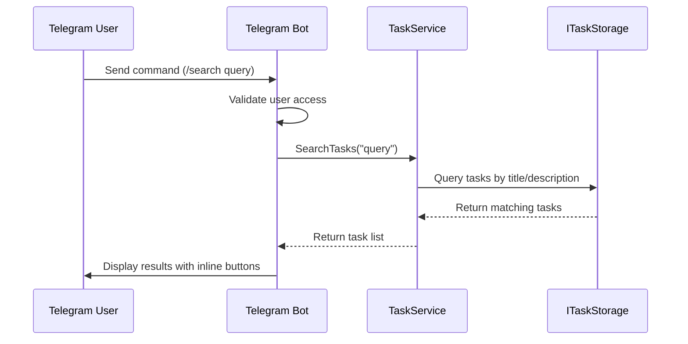
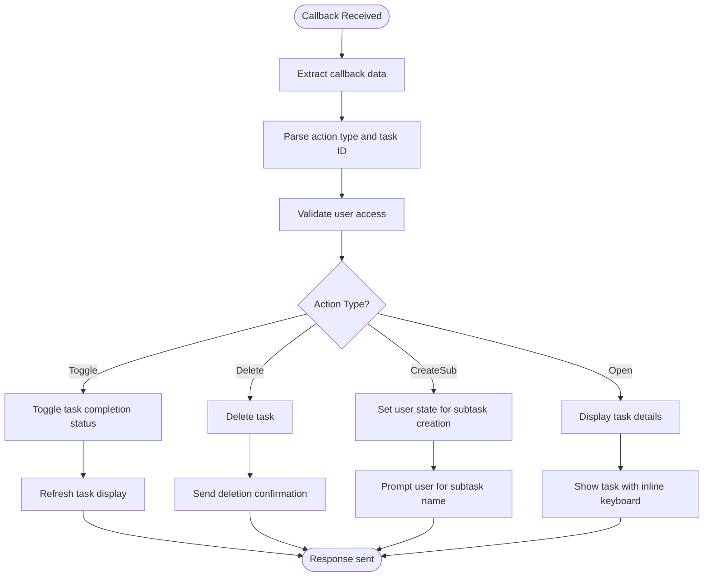
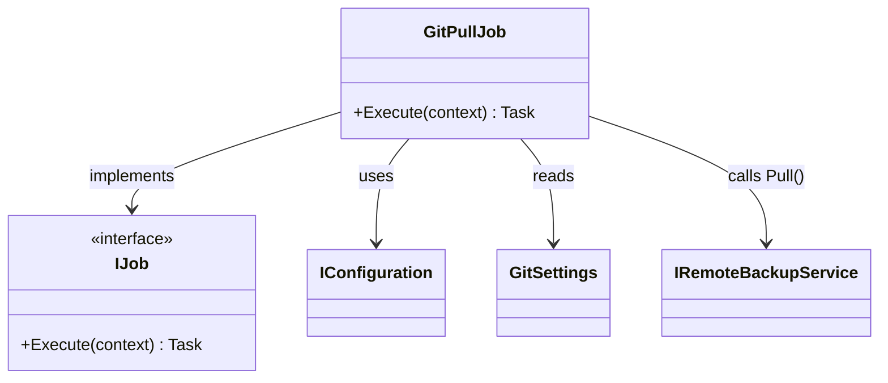
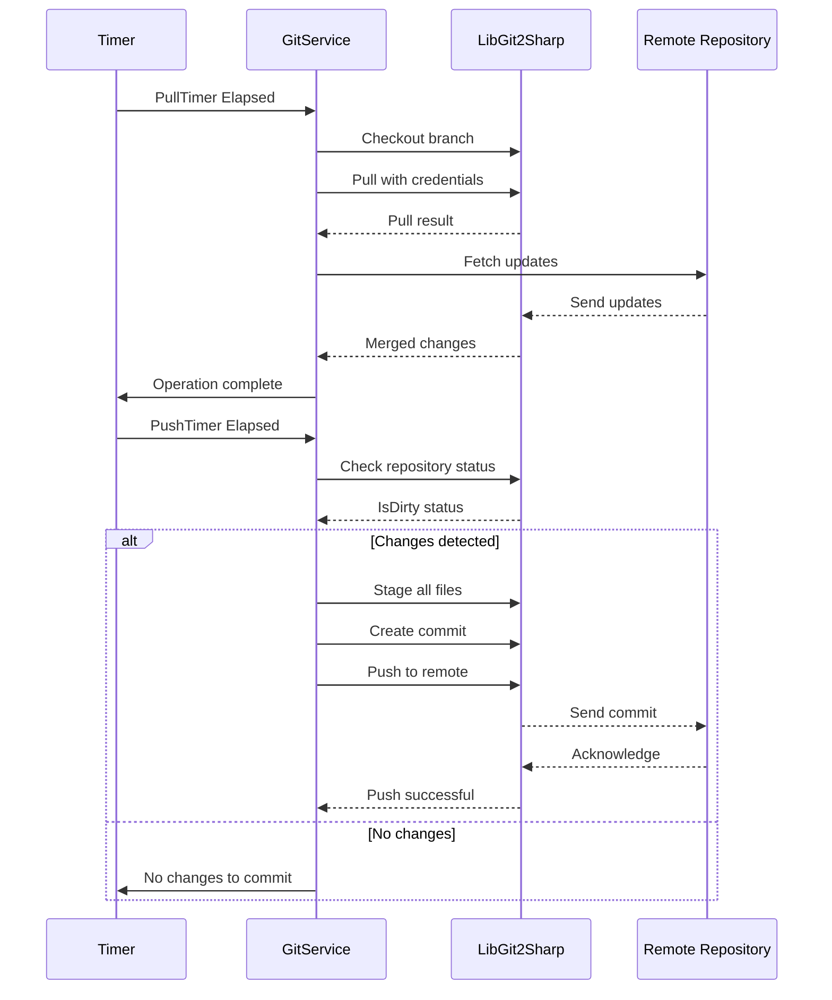
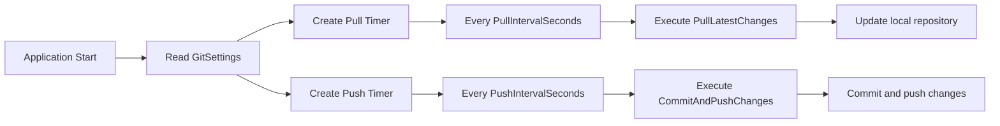
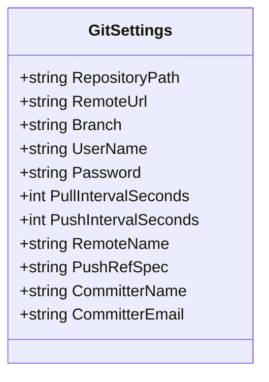
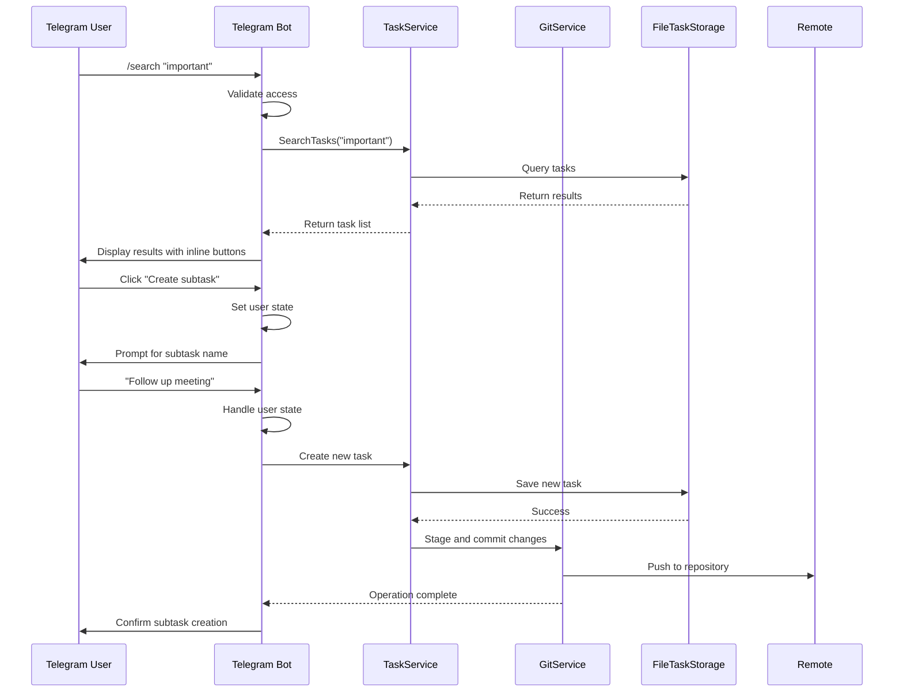

# Integration Guide

<cite>
**Referenced Files in This Document**   
- [Bot.cs](file://src/Unlimotion.TelegramBot/Bot.cs)
- [GitService.cs](file://src/Unlimotion.TelegramBot/GitService.cs)
- [GitSettings.cs](file://src/Unlimotion.TelegramBot/GitSettings.cs)
- [TaskService.cs](file://src/Unlimotion.TelegramBot/TaskService.cs)
- [Program.cs](file://src/Unlimotion.TelegramBot/Program.cs)
- [appsettings.json](file://src/Unlimotion.TelegramBot/appsettings.json)
- [GitPullJob.cs](file://src/Unlimotion/Scheduling/Jobs/GitPullJob.cs)
- [GitPushJob.cs](file://src/Unlimotion/Scheduling/Jobs/GitPushJob.cs)
- [BackupViaGitService.cs](file://src/Unlimotion/Services/BackupViaGitService.cs)
</cite>

## Table of Contents
1. [Telegram Bot Integration](#telegram-bot-integration)
2. [Git Synchronization](#git-synchronization)
3. [Configuration Options](#configuration-options)
4. [Integration Workflows](#integration-workflows)
5. [Common Issues and Solutions](#common-issues-and-solutions)

## Telegram Bot Integration

The Telegram Bot integration enables users to interact with the Unlimotion task management system through Telegram commands and interactive messages. The core functionality is implemented in the `Bot` class, which handles message processing, command execution, callback queries, and user state management.

### Command Handling

The bot supports several commands for task interaction:
- `/search [query]`: Searches tasks by title or description
- `/task [ID]`: Displays detailed information about a specific task
- `/root`: Lists all root-level tasks (tasks without parents)

The command processing is implemented in the `OnMessageReceived` method of the `Bot` class. When a message is received, the bot first validates user access, then routes the command to the appropriate handler. The `TaskService` is used to retrieve and search tasks from the local storage.



**Diagram sources**
- [Bot.cs](file://src/Unlimotion.TelegramBot/Bot.cs#L100-L150)
- [TaskService.cs](file://src/Unlimotion.TelegramBot/TaskService.cs#L45-L65)

### Callback Query Processing

The bot uses inline keyboard buttons to provide interactive task management. When a user interacts with these buttons, callback queries are sent to the bot. The `OnCallbackQueryReceived` method handles these interactions, supporting operations such as:
- Toggling task completion status
- Deleting tasks
- Creating subtasks and sibling tasks
- Navigating task relationships (parents, children, blockers)

Each callback data is prefixed with identifiers like `toggle_`, `delete_`, or `createSub_` followed by the task ID, enabling the bot to route the callback to the appropriate handler.



**Diagram sources**
- [Bot.cs](file://src/Unlimotion.TelegramBot/Bot.cs#L300-L450)

### Message Processing and User State Management

The bot maintains user states to handle multi-step interactions, such as creating new subtasks. When a user selects "Create subtask" from a task's inline keyboard, the bot stores the parent task ID in `_userStates` and waits for the user to provide a title for the new subtask.

The `HandleUserState` method processes these intermediate states, creating new tasks with the provided title and establishing the parent-child relationship in the task hierarchy.

**Section sources**
- [Bot.cs](file://src/Unlimotion.TelegramBot/Bot.cs#L150-L250)
- [TaskService.cs](file://src/Unlimotion.TelegramBot/TaskService.cs#L15-L30)

## Git Synchronization

The Git synchronization system provides automatic backup and synchronization of task data through Git operations. Two implementations exist: one for the Telegram Bot service and another for the main application, both using similar patterns but different scheduling mechanisms.

### GitPullJob and GitPushJob Implementation

The Quartz.NET job scheduler powers the Git synchronization in the main application. Two jobs handle the synchronization:

**GitPullJob**: Executes periodic pull operations to synchronize with the remote repository.



**Diagram sources**
- [GitPullJob.cs](file://src/Unlimotion/Scheduling/Jobs/GitPullJob.cs)

**GitPushJob**: Executes periodic commit and push operations to back up local changes.


**Diagram sources**
- [GitPushJob.cs](file://src/Unlimotion/Scheduling/Jobs/GitPushJob.cs)

Both jobs check if Git backup is enabled via the `BackupEnabled` configuration flag before executing their operations, ensuring that synchronization only occurs when properly configured.

### GitService Implementation

The `GitService` class in the Telegram Bot project provides the core Git functionality, including repository cloning, pulling, and committing/pushing changes.



**Diagram sources**
- [GitService.cs](file://src/Unlimotion.TelegramBot/GitService.cs)
- [GitSettings.cs](file://src/Unlimotion.TelegramBot/GitSettings.cs)

The service uses LibGit2Sharp for all Git operations and handles authentication through username and password credentials stored in the configuration.

### Automatic Commit/Push Intervals

The synchronization intervals are configurable through the `GitSettings` class, which defines:

- `PullIntervalSeconds`: Interval between automatic pull operations (default: 30 seconds)
- `PushIntervalSeconds`: Interval between automatic commit/push operations (default: 60 seconds)

These intervals are used by the timer-based synchronization system in the Telegram Bot, which starts two timers in the `StartTimers` method:



**Section sources**
- [Bot.cs](file://src/Unlimotion.TelegramBot/Bot.cs#L80-L100)
- [GitSettings.cs](file://src/Unlimotion.TelegramBot/GitSettings.cs#L10-L12)

## Configuration Options

The integration features are configured through JSON configuration files and settings classes that define behavior, access control, and synchronization parameters.

### GitSettings Configuration

The `GitSettings` class defines all configurable parameters for Git synchronization:



**Diagram sources**
- [GitSettings.cs](file://src/Unlimotion.TelegramBot/GitSettings.cs)

Key configuration options include:
- **RepositoryPath**: Local path where the Git repository is cloned (default: "GitTasks")
- **RemoteUrl**: URL of the remote Git repository
- **Branch**: Git branch to work with (default: "master")
- **PullIntervalSeconds**: Frequency of pull operations in seconds
- **PushIntervalSeconds**: Frequency of commit/push operations in seconds
- **CommitterName/Email**: Identity used for Git commits

### Telegram Bot Configuration

The `appsettings.json` file configures the Telegram Bot with essential parameters:

```json
{
  "BotToken": "",
  "AllowedUsers": [],
  "Git": {
    "RepositoryPath": "GitTasks",
    "RemoteUrl": "",
    "Branch": "master",
    "UserName": "",
    "Password": ""
  }
}
```

The configuration includes:
- **BotToken**: Telegram Bot API token for authentication
- **AllowedUsers**: List of Telegram user IDs permitted to access the bot
- **Git**: Nested Git configuration object with repository settings

Access control is enforced in the `CheckAccess` method, which verifies that the user ID is in the `AllowedUsers` list before processing any requests.

**Section sources**
- [appsettings.json](file://src/Unlimotion.TelegramBot/appsettings.json)
- [Bot.cs](file://src/Unlimotion.TelegramBot/Bot.cs#L400-L420)

## Integration Workflows

### Telegram Bot Interaction Workflow

The complete workflow for interacting with tasks through the Telegram Bot:



**Diagram sources**
- [Bot.cs](file://src/Unlimotion.TelegramBot/Bot.cs)
- [TaskService.cs](file://src/Unlimotion.TelegramBot/TaskService.cs)
- [GitService.cs](file://src/Unlimotion.TelegramBot/GitService.cs)

### Git Synchronization Workflow

The automatic synchronization workflow between local changes and remote repository:

```mermaid
flowchart TD
A[Start Application] --> B[Clone or Update Repository]
B --> C[Start Pull Timer]
B --> D[Start Push Timer]
C --> E[Every 30 seconds]
E --> F[Pull Latest Changes]
F --> G[Checkout Branch]
G --> H[Pull with Credentials]
H --> I[Merge Remote Changes]
I --> J[Update Local Tasks]
D --> K[Every 60 seconds]
K --> L[Check for Changes]
L --> M{Changes Detected?}
M --> |Yes| N[Stage All Files]
M --> |No| O[Log "No changes"]
N --> P[Create Commit]
P --> Q[Push to Remote]
Q --> R[Log Success]
O --> R
R --> K
```

**Diagram sources**
- [Bot.cs](file://src/Unlimotion.TelegramBot/Bot.cs#L80-L100)
- [GitService.cs](file://src/Unlimotion.TelegramBot/GitService.cs)

## Common Issues and Solutions

### Access Control Issues

**Problem**: Users cannot access the Telegram Bot despite correct configuration.

**Solution**: Verify that:
1. The user's Telegram ID is included in the `AllowedUsers` array in `appsettings.json`
2. The BotToken is correctly configured
3. The user has started a conversation with the bot on Telegram

The access control mechanism in `CheckAccess` method only allows users whose IDs are explicitly listed in the configuration.

**Section sources**
- [Bot.cs](file://src/Unlimotion.TelegramBot/Bot.cs#L400-L420)

### Synchronization Timing Conflicts

**Problem**: Conflicts occur when multiple instances try to synchronize simultaneously.

**Solution**: The system implements several safeguards:
1. **Locking mechanism**: The `BackupViaGitService` uses a static lock object to prevent concurrent operations
2. **Database watcher coordination**: The service temporarily disables the database watcher during synchronization to prevent race conditions
3. **Stash before merge**: Changes are stashed before pulling to protect local modifications

For the Telegram Bot implementation, the simpler timer-based approach relies on the atomicity of Git operations and proper error handling.

### Git Authentication Failures

**Problem**: Push/pull operations fail due to authentication errors.

**Solution**: Ensure that:
1. The Git username and password/token are correctly configured
2. For GitHub repositories, use a personal access token instead of password
3. The repository URL is accessible from the deployment environment

The `GitService` uses basic authentication with username and password, which should be stored securely in the configuration.

**Section sources**
- [GitService.cs](file://src/Unlimotion.TelegramBot/GitService.cs#L15-L25)
- [BackupViaGitService.cs](file://src/Unlimotion/Services/BackupViaGitService.cs#L50-L70)

### Repository Initialization Issues

**Problem**: The application fails to initialize the Git repository.

**Solution**: The `CloneOrUpdateRepo` method handles both cloning new repositories and updating existing ones:
1. Check if the repository path is valid using `Repository.IsValid`
2. If invalid, clone from the remote URL
3. If valid, perform a pull operation to update

Ensure that the `RepositoryPath` points to a writable directory and that the application has sufficient permissions.

**Section sources**
- [GitService.cs](file://src/Unlimotion.TelegramBot/GitService.cs#L30-L50)
- [BackupViaGitService.cs](file://src/Unlimotion/Services/BackupViaGitService.cs#L75-L95)