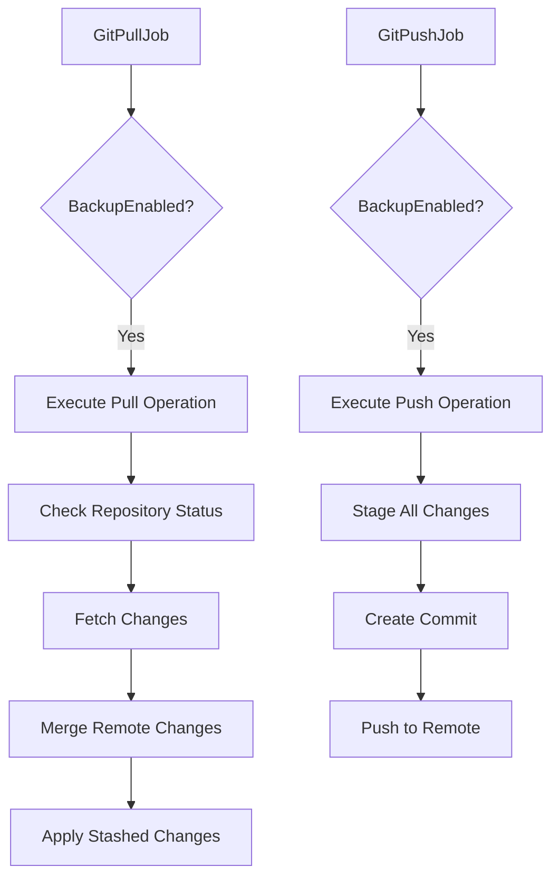
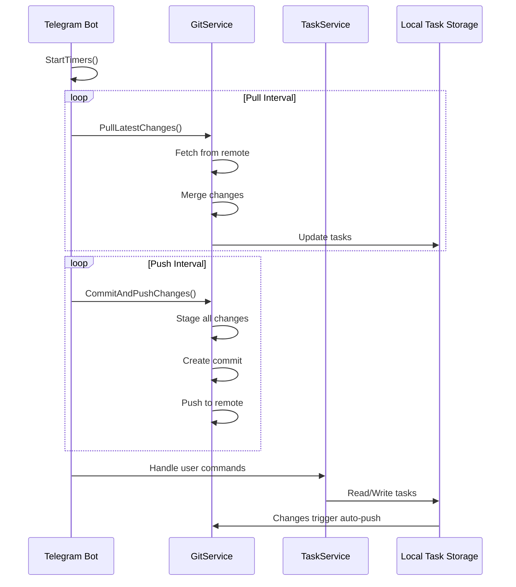
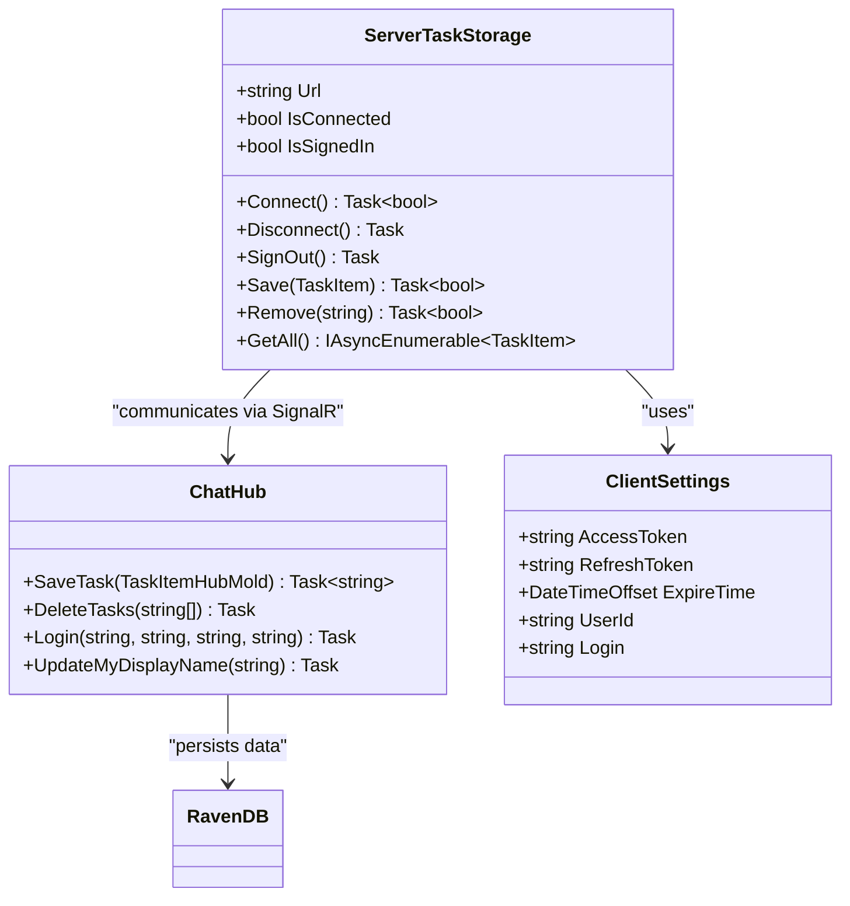
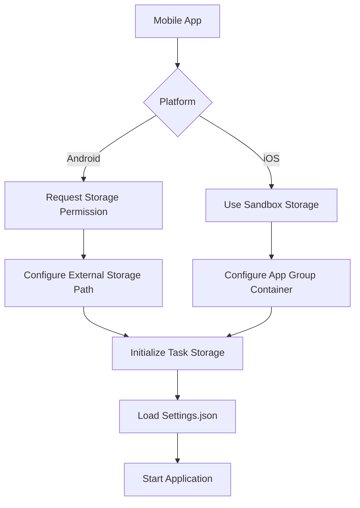
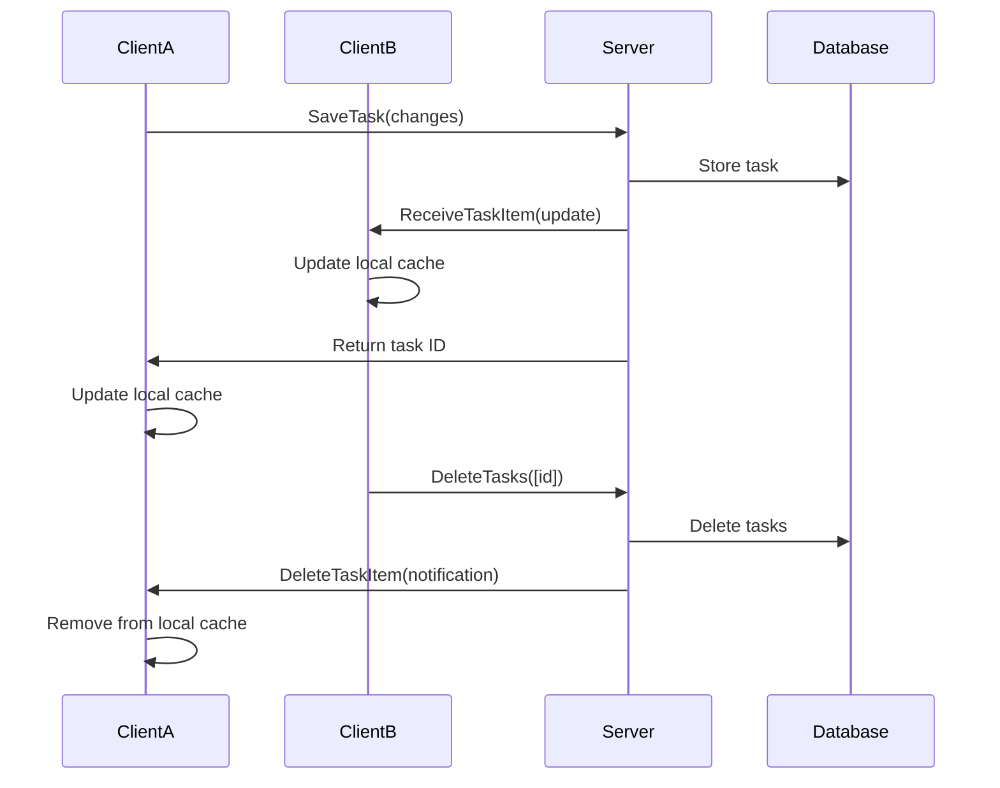
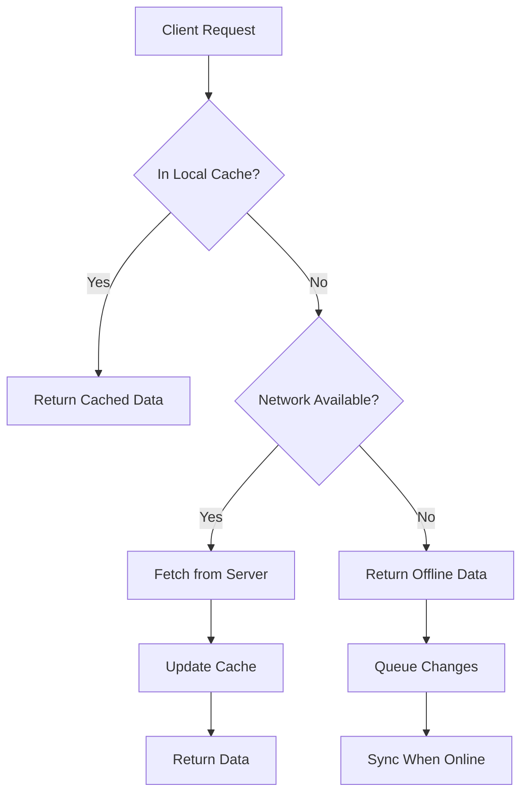

# Integration Guide

<cite>
**Referenced Files in This Document**   
- [GitSettings.cs](file://src/Unlimotion.TelegramBot/GitSettings.cs)
- [appsettings.json](file://src/Unlimotion.TelegramBot/appsettings.json)
- [GitPullJob.cs](file://src/Unlimotion/Scheduling/Jobs/GitPullJob.cs)
- [GitPushJob.cs](file://src/Unlimotion/Scheduling/Jobs/GitPushJob.cs)
- [BackupViaGitService.cs](file://src/Unlimotion/Services/BackupViaGitService.cs)
- [appsettings.json](file://src/Unlimotion.Server/appsettings.json)
- [RavenDBLicense.json](file://src/Unlimotion.Server/RavenDBLicense.json)
- [MainActivity.cs](file://src/Unlimotion.Android/MainActivity.cs)
- [AppDelegate.cs](file://src/Unlimotion.iOS/AppDelegate.cs)
- [Bot.cs](file://src/Unlimotion.TelegramBot/Bot.cs)
- [ChatHub.cs](file://src/Unlimotion.Server/hubs/ChatHub.cs)
- [ClientSettings.cs](file://src/Unlimotion/ClientSettings.cs)
- [ServerTaskStorage.cs](file://src/Unlimotion/ServerTaskStorage.cs)
- [TaskStorages.cs](file://src/Unlimotion/TaskStorages.cs)
</cite>

## Table of Contents
1. [Introduction](#introduction)
2. [Git Repository Integration](#git-repository-integration)
3. [Telegram Bot Integration](#telegram-bot-integration)
4. [Server Configuration with RavenDB](#server-configuration-with-ravendb)
5. [Mobile App Configuration](#mobile-app-configuration)
6. [Multi-Client Collaboration](#multi-client-collaboration)
7. [Troubleshooting Guide](#troubleshooting-guide)
8. [Performance Optimization](#performance-optimization)

## Introduction
This integration guide provides comprehensive documentation for connecting Unlimotion's external services. The system enables task management synchronization across multiple platforms through Git repository backups, Telegram bot integration, centralized RavenDB storage, and mobile application support. This document details the configuration process for each integration point, including step-by-step setup instructions, configuration examples, and troubleshooting guidance for common issues.

## Git Repository Integration

Unlimotion supports automated Git repository integration for task backup and synchronization. The system uses GitPullJob and GitPushJob to automate synchronization at configurable intervals.

### Git Settings Configuration
The Git integration is configured through the GitSettings class which contains properties for repository connection and authentication:

- RepositoryPath: Local path for Git repository (default: "GitTasks")
- RemoteUrl: URL of the remote Git repository
- Branch: Target branch name (default: "master")
- UserName: Git username or email for authentication
- Password: Git personal access token or password
- PullIntervalSeconds: Interval between pull operations (default: 30 seconds)
- PushIntervalSeconds: Interval between push operations (default: 60 seconds)
- RemoteName: Remote repository name (default: "origin")
- PushRefSpec: Reference specification for push operations (default: "refs/heads/main")
- CommitterName and CommitterEmail: Identity for Git commits

Configuration is typically stored in appsettings.json under the "Git" section, allowing for environment-specific settings.

### Automated Backup Scheduling
The system implements automated backups through two Quartz.NET jobs:



**Diagram sources**
- [GitPullJob.cs](file://src/Unlimotion/Scheduling/Jobs/GitPullJob.cs#L1-L20)
- [GitPushJob.cs](file://src/Unlimotion/Scheduling/Jobs/GitPushJob.cs#L1-L21)

The jobs are triggered based on the configured intervals and only execute when BackupEnabled is set to true in the Git settings. The BackupViaGitService handles the actual Git operations, implementing proper locking mechanisms to prevent race conditions during concurrent access.

### BackupViaGitService Implementation
The BackupViaGitService class implements the IRemoteBackupService interface and provides the core functionality for Git operations:

- CloneOrUpdateRepo: Initializes the repository by cloning from remote or updating existing repository
- Push: Commits local changes and pushes to the remote repository
- Pull: Fetches remote changes and merges them with local changes
- Refs and Remotes: Utility methods to retrieve repository references and remote configurations

The service implements conflict resolution by stashing local changes before merging, then reapplying them afterward. It also integrates with the application's notification system to provide status updates and error reporting.

**Section sources**
- [GitSettings.cs](file://src/Unlimotion.TelegramBot/GitSettings.cs#L1-L19)
- [BackupViaGitService.cs](file://src/Unlimotion/Services/BackupViaGitService.cs#L1-L357)

## Telegram Bot Integration

The Telegram bot integration enables remote task management through Telegram commands and interactive messages.

### Bot Configuration
The bot is configured through appsettings.json with the following key settings:

- BotToken: Authentication token for the Telegram bot
- AllowedUsers: List of user IDs permitted to interact with the bot
- Git: Git repository configuration (same as GitSettings)
- Logging: Configuration for log file output

```json
{
  "BotToken": "",
  "AllowedUsers": [],
  "Git": {
    "RepositoryPath": "GitTasks",
    "RemoteUrl": "",
    "Branch": "master",
    "UserName": "",
    "Password": ""
  },
  "Logging": {
    "LogFilePath": "logs/log-.txt",
    "RollingInterval": "Day"
  }
}
```

### Command Handling
The bot supports several commands for task management:

- /start: Displays welcome message
- /help: Shows available commands
- /search [query]: Searches tasks by title or content
- /task [ID]: Displays detailed information about a specific task
- /root: Lists root-level tasks

The bot also supports interactive operations through callback queries, allowing users to:
- Toggle task completion status
- Delete tasks
- Create subtasks and sibling tasks
- Navigate task relationships (parents, blocking tasks, etc.)

### Synchronization Process
The bot automatically synchronizes with the task database through periodic timers:



**Diagram sources**
- [Bot.cs](file://src/Unlimotion.TelegramBot/Bot.cs#L1-L479)
- [appsettings.json](file://src/Unlimotion.TelegramBot/appsettings.json#L1-L15)

The synchronization process ensures that all changes made through the Telegram interface are automatically pushed to the Git repository, while incoming changes from other sources are pulled at regular intervals.

**Section sources**
- [Bot.cs](file://src/Unlimotion.TelegramBot/Bot.cs#L1-L479)
- [appsettings.json](file://src/Unlimotion.TelegramBot/appsettings.json#L1-L15)

## Server Configuration with RavenDB

Unlimotion uses RavenDB as its centralized task storage solution, providing robust document database capabilities for task management.

### Connection String Setup
The RavenDB connection is configured in appsettings.json under the "RavenDb" section:

```json
{
  "RavenDb": {
    "DatabaseRecord": {
      "DatabaseName": "Unlimotion"
    },
    "ServerOptions": {
      "ServerUrl": "http://localhost:8080",
      "DataDirectory": "RavenDB",
      "LogsPath": "Log\\RavenDB"
    }
  }
}
```

Key configuration parameters include:
- DatabaseName: Name of the RavenDB database
- ServerUrl: Address of the RavenDB server
- DataDirectory: Local path for database files
- LogsPath: Directory for server logs

### User Authentication
User authentication is implemented through JWT tokens and SignalR hubs. The ChatHub class handles client connections and authentication:

- Clients authenticate using JWT tokens obtained during login
- The hub validates tokens and extracts user information (UID, login, session)
- Connection-specific user data is stored in Context.Items
- Login audit information is recorded in the database
- SignalR groups are used to manage user-specific message routing

The ServerTaskStorage class manages the client-side connection to the server, handling:
- Connection establishment and reconnection logic
- Token refresh and authentication renewal
- Error handling and connection state management
- Task synchronization between client and server



**Diagram sources**
- [appsettings.json](file://src/Unlimotion.Server/appsettings.json#L1-L45)
- [ChatHub.cs](file://src/Unlimotion.Server/hubs/ChatHub.cs#L1-L239)
- [ClientSettings.cs](file://src/Unlimotion/ClientSettings.cs#L1-L16)
- [ServerTaskStorage.cs](file://src/Unlimotion/ServerTaskStorage.cs#L1-L722)

The RavenDB license is provided in RavenDBLicense.json, containing the license ID, name, and encryption keys required for server operation.

**Section sources**
- [appsettings.json](file://src/Unlimotion.Server/appsettings.json#L1-L45)
- [RavenDBLicense.json](file://src/Unlimotion.Server/RavenDBLicense.json#L1-L24)

## Mobile App Configuration

Unlimotion provides native mobile applications for both Android and iOS platforms, with platform-specific configuration requirements.

### Android Configuration
The Android application is configured in MainActivity.cs with the following key aspects:

- Storage permissions: The app requests WRITE_EXTERNAL_STORAGE permission at runtime
- Data directory configuration: Uses external files directory when permission is granted, otherwise falls back to internal storage
- Path resolution: Configures BackupViaGitService.GetAbsolutePath to resolve relative paths against the data directory
- Task storage path: Sets the default storage path to "Tasks" folder within the data directory
- Configuration file: Initializes settings in "Settings.json" within the data directory

The application handles permission requests through the OnRequestPermissionsResult callback, providing appropriate user feedback when permissions are denied.

### iOS Configuration
The iOS application configuration in AppDelegate.cs is more minimal, primarily focusing on:

- Platform initialization: Inherits from AvaloniaAppDelegate to initialize the Avalonia UI framework
- App builder customization: Configures custom fonts and ReactiveUI support
- Lifecycle management: Handles application startup and shutdown through standard iOS lifecycle methods

Both mobile platforms use the same core Unlimotion functionality but adapt the storage and permission models to their respective platform requirements.



**Diagram sources**
- [MainActivity.cs](file://src/Unlimotion.Android/MainActivity.cs#L1-L113)
- [AppDelegate.cs](file://src/Unlimotion.iOS/AppDelegate.cs#L1-L26)

**Section sources**
- [MainActivity.cs](file://src/Unlimotion.Android/MainActivity.cs#L1-L113)
- [AppDelegate.cs](file://src/Unlimotion.iOS/AppDelegate.cs#L1-L26)

## Multi-Client Collaboration

Unlimotion supports multiple clients connecting to the same server instance for collaborative task management.

### Connection Architecture
The system uses SignalR hubs to facilitate real-time communication between clients and the server:

- ChatHub provides the primary communication channel
- Clients connect via WebSocket connections
- Each client is assigned to user-specific groups (User_{uid})
- The "Logined" group tracks all connected clients
- Message broadcasting ensures all clients receive updates

When a task is modified by one client, the change is:
1. Sent to the server via SaveTask method
2. Persisted in RavenDB
3. Broadcast to all other connected clients via SignalR
4. Applied locally by each client's ServerTaskStorage

### Synchronization Mechanism
The ServerTaskStorage class implements a robust synchronization mechanism:

- Maintains a local cache of tasks using SourceCache
- Subscribes to server events (ReceiveTaskItem, DeleteTaskItem)
- Updates the local cache when changes are received
- Handles connection interruptions with automatic reconnection
- Implements retry logic for failed operations
- Manages task relationships (parents, children, blocking) through the TaskTreeManager

Clients can operate in both online and offline modes, with changes queued for synchronization when connectivity is restored.



**Diagram sources**
- [ChatHub.cs](file://src/Unlimotion.Server/hubs/ChatHub.cs#L1-L239)
- [ServerTaskStorage.cs](file://src/Unlimotion/ServerTaskStorage.cs#L1-L722)

**Section sources**
- [ServerTaskStorage.cs](file://src/Unlimotion/ServerTaskStorage.cs#L1-L722)
- [ChatHub.cs](file://src/Unlimotion.Server/hubs/ChatHub.cs#L1-L239)

## Troubleshooting Guide

This section addresses common integration issues and provides solutions for each integration point.

### Authentication Failures
**Git Authentication Issues:**
- Ensure the username and password/token are correctly configured
- Verify the personal access token has the required permissions
- Check that the repository URL uses the correct protocol (HTTPS/SSH)
- Confirm the credentials are not expired

**Server Authentication Issues:**
- Verify the JWT token is valid and not expired
- Check that the user exists in the database
- Ensure the ServiceStack license key is valid
- Confirm the client is using the correct server URL

### Network Connectivity Problems
**General Connectivity Issues:**
- Verify the server is running and accessible at the configured URL
- Check firewall settings to ensure the required ports are open
- Test network connectivity using ping or telnet
- Ensure SSL/TLS certificates are properly configured

**Mobile-Specific Issues:**
- Android: Ensure the app has network permissions in AndroidManifest.xml
- iOS: Verify App Transport Security settings allow connections to the server
- Both platforms: Implement proper error handling for network interruptions

### Data Synchronization Conflicts
**Git Merge Conflicts:**
- The system automatically detects conflicts after merge operations
- Conflicting files must be resolved manually before committing
- Use the stash mechanism to preserve local changes during conflict resolution
- Pull changes before making local modifications to minimize conflicts

**Task Synchronization Conflicts:**
- The server uses optimistic concurrency control
- When conflicts occur, the latest change overwrites previous ones
- Clients receive updates to ensure consistency
- Implement client-side conflict detection for critical operations

**Common Error Messages and Solutions:**
- "Can't push the remote repository": Check credentials and network connectivity
- "Can't merge remote branch": Resolve merge conflicts manually
- "User not found": Register the user on the server
- "Token is expired": Refresh the authentication token
- "Connection closed": Implement reconnection logic with exponential backoff

**Section sources**
- [BackupViaGitService.cs](file://src/Unlimotion/Services/BackupViaGitService.cs#L1-L357)
- [ServerTaskStorage.cs](file://src/Unlimotion/ServerTaskStorage.cs#L1-L722)
- [ChatHub.cs](file://src/Unlimotion.Server/hubs/ChatHub.cs#L1-L239)

## Performance Optimization

This section provides recommendations for optimizing performance, particularly for high-latency connections.

### Connection Optimization
**For High-Latency Networks:**
- Increase the heartbeat interval to reduce unnecessary traffic
- Implement connection pooling where possible
- Use compression for data transfer
- Batch multiple operations into single requests
- Implement intelligent reconnection with exponential backoff

**SignalR Configuration:**
- Adjust the transport fallback order based on network conditions
- Configure appropriate timeout values for operations
- Implement client-side caching to reduce server requests
- Use message filtering to receive only relevant updates

### Data Synchronization Optimization
**Git Synchronization:**
- Adjust pull and push intervals based on usage patterns
- For low-activity periods, increase intervals to reduce network traffic
- For high-activity periods, decrease intervals to ensure timely synchronization
- Consider using shallow clones for large repositories
- Implement selective synchronization for specific task categories

**Task Management:**
- Implement pagination for large task lists
- Use filtering and searching on the server side
- Cache frequently accessed tasks locally
- Implement lazy loading for task relationships
- Optimize database queries through proper indexing

### Mobile Performance
**Android and iOS:**
- Minimize background network operations to conserve battery
- Implement efficient data serialization
- Use local storage effectively to reduce network dependency
- Optimize UI rendering for smooth performance
- Implement proper memory management to prevent leaks

**Caching Strategy:**


**Diagram sources**
- [ServerTaskStorage.cs](file://src/Unlimotion/ServerTaskStorage.cs#L1-L722)
- [BackupViaGitService.cs](file://src/Unlimotion/Services/BackupViaGitService.cs#L1-L357)

The system's architecture supports various optimization strategies that can be configured based on specific deployment requirements and network conditions.

**Section sources**
- [ServerTaskStorage.cs](file://src/Unlimotion/ServerTaskStorage.cs#L1-L722)
- [BackupViaGitService.cs](file://src/Unlimotion/Services/BackupViaGitService.cs#L1-L357)