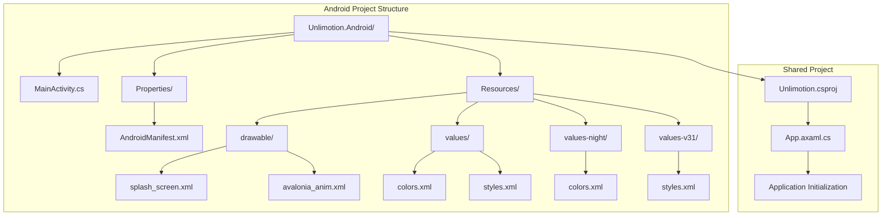
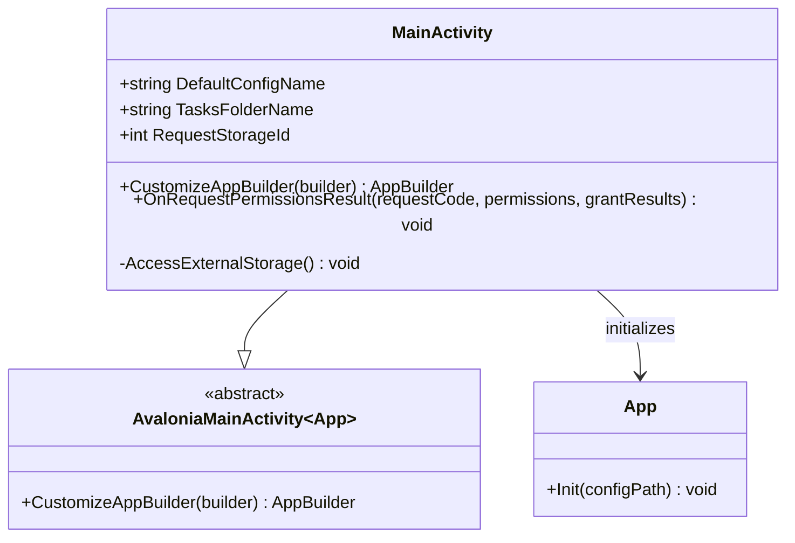
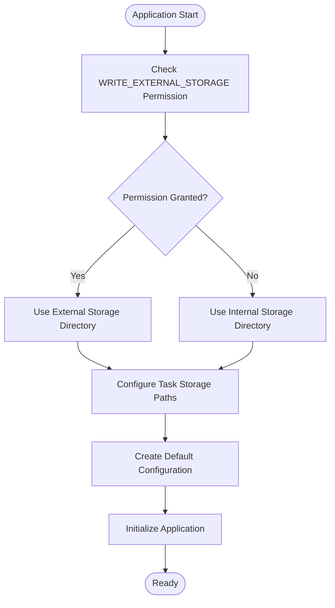
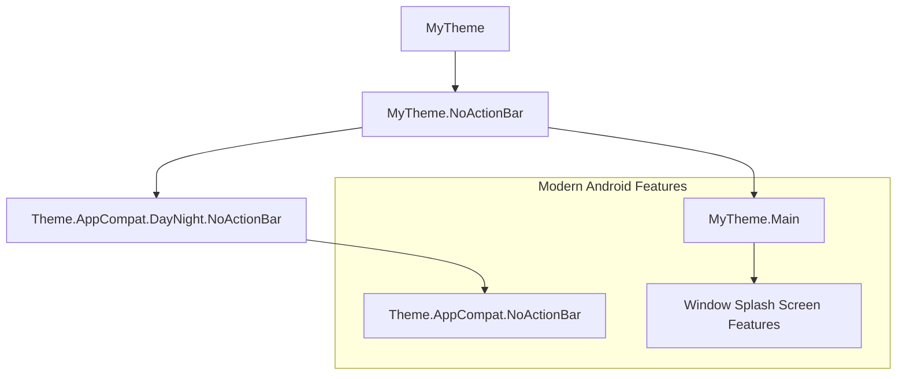
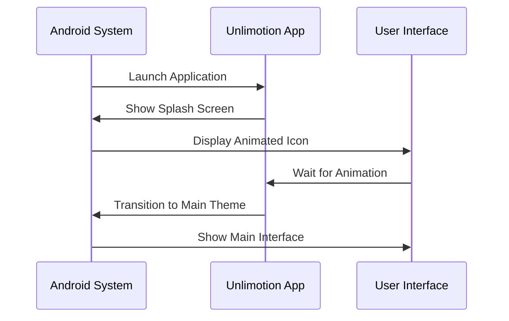
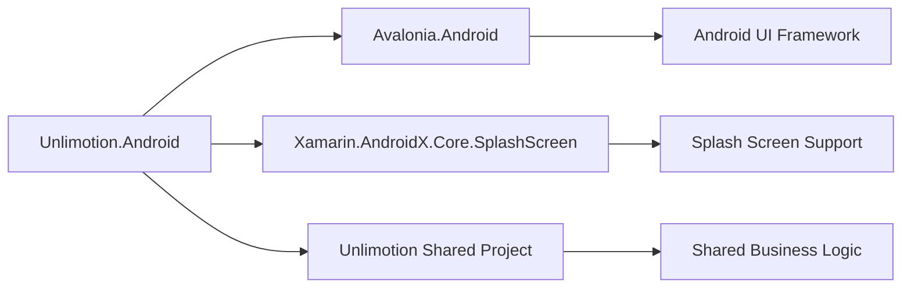
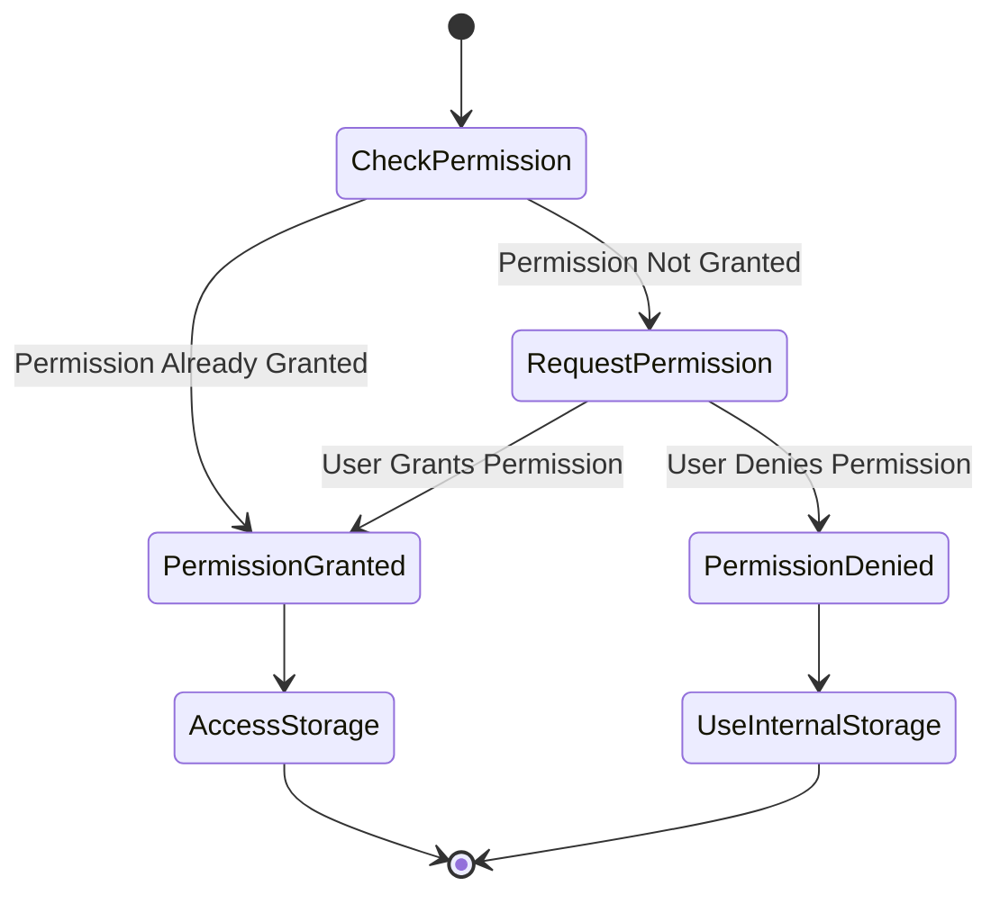
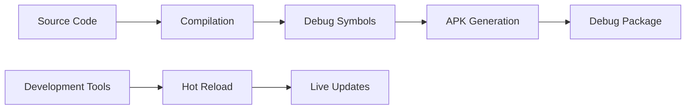
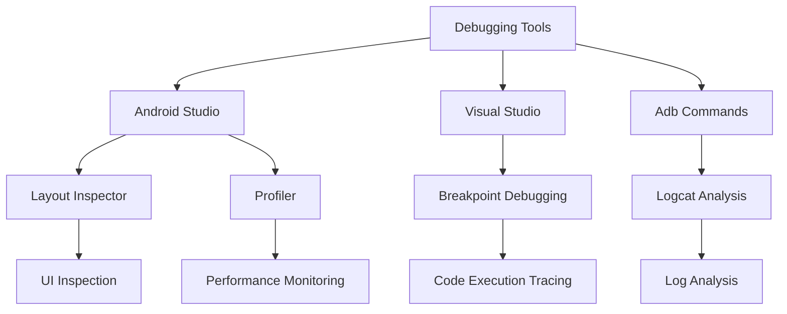
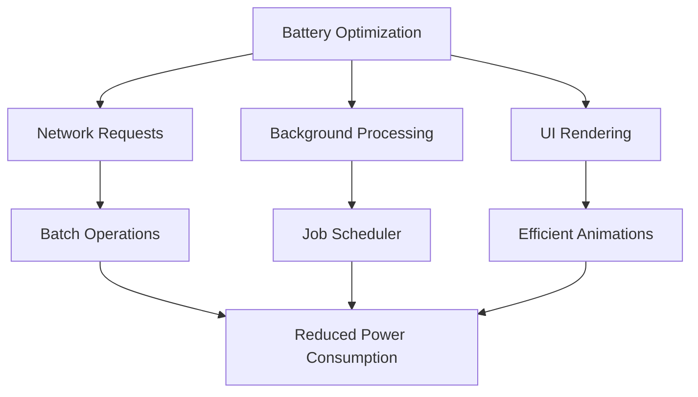

# Android Configuration

<cite>
**Referenced Files in This Document**
- [MainActivity.cs](file://src/Unlimotion.Android/MainActivity.cs)
- [AndroidManifest.xml](file://src/Unlimotion.Android/Properties/AndroidManifest.xml)
- [Unlimotion.Android.csproj](file://src/Unlimotion.Android/Unlimotion.Android.csproj)
- [styles.xml](file://src/Unlimotion.Android/Resources/values/styles.xml)
- [colors.xml](file://src/Unlimotion.Android/Resources/values/colors.xml)
- [splash_screen.xml](file://src/Unlimotion.Android/Resources/drawable/splash_screen.xml)
- [styles-v31.xml](file://src/Unlimotion.Android/Resources/values-v31/styles.xml)
- [colors-night.xml](file://src/Unlimotion.Android/Resources/values-night/colors.xml)
- [App.axaml.cs](file://src/Unlimotion/App.axaml.cs)
- [Unlimotion.csproj](file://src/Unlimotion/Unlimotion.csproj)
</cite>

## Table of Contents
1. [Introduction](#introduction)
2. [Project Structure](#project-structure)
3. [MainActivity Configuration](#mainactivity-configuration)
4. [AndroidManifest.xml Setup](#androidmanifestxml-setup)
5. [Resource Configuration](#resource-configuration)
6. [Build Configuration](#build-configuration)
7. [Permission Management](#permission-management)
8. [Launch Experience](#launch-experience)
9. [Build Process](#build-process)
10. [Deployment Instructions](#deployment-instructions)
11. [Debugging and Troubleshooting](#debugging-and-troubleshooting)
12. [Performance Optimization](#performance-optimization)
13. [Conclusion](#conclusion)

## Introduction

Unlimotion's Android implementation leverages the Avalonia UI framework to deliver a cross-platform task management application. The Android configuration encompasses several critical components including the MainActivity initialization, manifest permissions, resource customization, and build pipeline configuration. This documentation provides comprehensive guidance for configuring, building, and deploying the Android version of Unlimotion.

The Android implementation utilizes .NET 9.0 with targeted Android platform support, implementing modern Android development practices including permission management, splash screen configuration, and performance optimization techniques suitable for diverse Android device ecosystems.

## Project Structure

The Android-specific configuration is organized within the `src/Unlimotion.Android` directory, containing all platform-specific files and resources:



**Diagram sources**
- [MainActivity.cs](file://src/Unlimotion.Android/MainActivity.cs#L1-L113)
- [AndroidManifest.xml](file://src/Unlimotion.Android/Properties/AndroidManifest.xml#L1-L8)
- [Unlimotion.Android.csproj](file://src/Unlimotion.Android/Unlimotion.Android.csproj#L1-L30)

**Section sources**
- [MainActivity.cs](file://src/Unlimotion.Android/MainActivity.cs#L1-L113)
- [Unlimotion.Android.csproj](file://src/Unlimotion.Android/Unlimotion.Android.csproj#L1-L30)

## MainActivity Configuration

The MainActivity serves as the primary entry point for the Android application, inheriting from Avalonia's `AvaloniaMainActivity<App>` and implementing essential Android lifecycle management and platform-specific initialization logic.

### Core Activity Definition

The MainActivity is decorated with Android activity attributes that define its behavior and appearance:



**Diagram sources**
- [MainActivity.cs](file://src/Unlimotion.Android/MainActivity.cs#L25-L113)

### Platform-Specific Initialization

The `CustomizeAppBuilder` method handles critical Android-specific initialization including permission checking, storage path configuration, and application setup:

| Initialization Phase | Purpose | Implementation Details |
|---------------------|---------|----------------------|
| Permission Validation | Check external storage access | Uses `ContextCompat.CheckSelfPermission()` |
| Storage Path Resolution | Determine optimal data directory | Falls back to internal storage if permission denied |
| Configuration Setup | Initialize JSON configuration | Creates default settings file if missing |
| Application Bootstrap | Launch Avalonia framework | Calls `App.Init()` with configuration path |

### Storage Management

The MainActivity implements sophisticated storage management that adapts to permission availability:



**Diagram sources**
- [MainActivity.cs](file://src/Unlimotion.Android/MainActivity.cs#L35-L85)

**Section sources**
- [MainActivity.cs](file://src/Unlimotion.Android/MainActivity.cs#L25-L113)

## AndroidManifest.xml Setup

The AndroidManifest.xml defines the application's fundamental capabilities, permissions, and metadata essential for Android system integration.

### Permission Configuration

The manifest declares three critical permissions required for the application's functionality:

| Permission | Purpose | Rationale |
|------------|---------|-----------|
| `INTERNET` | Network connectivity | Enables cloud synchronization and updates |
| `READ_EXTERNAL_STORAGE` | File system access | Allows backup and import of task data |
| `WRITE_EXTERNAL_STORAGE` | File modification | Enables saving tasks and configuration files |

### Application Metadata

The application element specifies core metadata:

```xml
<application android:label="Unlimotion" android:icon="@drawable/icon" />
```

This configuration establishes the human-readable application name and associates it with the application icon resource.

**Section sources**
- [AndroidManifest.xml](file://src/Unlimotion.Android/Properties/AndroidManifest.xml#L1-L8)

## Resource Configuration

The Android resources system provides comprehensive customization capabilities for visual appearance, themes, and user experience elements.

### Theme Configuration

The theme system implements a hierarchical structure supporting both light and dark modes:



**Diagram sources**
- [styles.xml](file://src/Unlimotion.Android/Resources/values/styles.xml#L1-L13)
- [styles-v31.xml](file://src/Unlimotion.Android/Resources/values-v31/styles.xml#L1-L22)

### Color Resources

Color definitions support adaptive theming across different Android versions and user preferences:

| Resource File | Purpose | Color Definition |
|---------------|---------|------------------|
| `values/colors.xml` | Base theme colors | `splash_background` (#000000) |
| `values-night/colors.xml` | Dark theme colors | Same black background |
| `values-v31/styles.xml` | Android 12+ features | Enhanced splash screen colors |

### Splash Screen Configuration

The splash screen implementation provides a smooth transition from app launch to main interface:



**Diagram sources**
- [splash_screen.xml](file://src/Unlimotion.Android/Resources/drawable/splash_screen.xml#L1-L14)
- [styles-v31.xml](file://src/Unlimotion.Android/Resources/values-v31/styles.xml#L6-L12)

**Section sources**
- [styles.xml](file://src/Unlimotion.Android/Resources/values/styles.xml#L1-L13)
- [colors.xml](file://src/Unlimotion.Android/Resources/values/colors.xml#L1-L5)
- [splash_screen.xml](file://src/Unlimotion.Android/Resources/drawable/splash_screen.xml#L1-L14)
- [styles-v31.xml](file://src/Unlimotion.Android/Resources/values-v31/styles.xml#L1-L22)

## Build Configuration

The Android build configuration manages compilation targets, dependencies, and packaging options through the project file structure.

### Target Platform Configuration

The project targets .NET 9.0 with Android-specific platform requirements:

| Property | Value | Purpose |
|----------|-------|---------|
| `TargetFramework` | `net9.0-android` | Specifies Android target framework |
| `SupportedOSPlatformVersion` | `21` | Minimum Android API level (Android 5.0) |
| `ApplicationId` | `com.Kibnet.Unlimotion` | Unique package identifier |
| `ApplicationVersion` | `1` | Internal version number |
| `ApplicationDisplayVersion` | `1.0` | User-visible version string |

### Package Format and Optimization

The build configuration supports both APK and AAB packaging formats with optimization settings:

| Setting | Value | Impact |
|---------|-------|--------|
| `AndroidPackageFormat` | `apk` | Produces Android Package file |
| `AndroidEnableProfiledAot` | `false` | Disables ahead-of-time compilation |

### Dependencies and References

The project maintains strict dependency management through NuGet packages and project references:



**Diagram sources**
- [Unlimotion.Android.csproj](file://src/Unlimotion.Android/Unlimotion.Android.csproj#L18-L28)

**Section sources**
- [Unlimotion.Android.csproj](file://src/Unlimotion.Android/Unlimotion.Android.csproj#L1-L30)

## Permission Management

The Android implementation implements robust permission management for external storage access, handling both permission requests and fallback scenarios gracefully.

### Runtime Permission Handling

The permission system follows Android's runtime permission model:



**Diagram sources**
- [MainActivity.cs](file://src/Unlimotion.Android/MainActivity.cs#L35-L85)

### Permission Request Implementation

The permission request process includes user feedback and graceful degradation:

| Scenario | Action | User Feedback |
|----------|--------|---------------|
| Permission Granted | Proceed with external storage access | No notification |
| Permission Denied | Fall back to internal storage | Toast notification |
| First-time Request | Request permission from user | Permission dialog |

**Section sources**
- [MainActivity.cs](file://src/Unlimotion.Android/MainActivity.cs#L87-L113)

## Launch Experience

The application launch experience combines traditional splash screens with modern Android 12+ animated splash screen features for optimal user experience.

### Traditional Splash Screen

The legacy splash screen implementation provides basic branding during application startup:

```xml
<style name="MyTheme.NoActionBar" parent="@style/Theme.AppCompat.DayNight.NoActionBar">
    <item name="android:windowBackground">@drawable/splash_screen</item>
</style>
```

### Modern Android 12+ Features

For devices running Android 12 or later, the application leverages enhanced splash screen capabilities:

| Feature | Configuration | Benefit |
|---------|---------------|---------|
| Background Color | `@color/splash_background` | Consistent visual appearance |
| Animated Icon | `@drawable/avalonia_anim` | Engaging loading experience |
| Animation Duration | `1000` ms | Smooth transition timing |
| Post-Splash Theme | `@style/MyTheme.Main` | Immediate theme application |

**Section sources**
- [styles.xml](file://src/Unlimotion.Android/Resources/values/styles.xml#L6-L11)
- [styles-v31.xml](file://src/Unlimotion.Android/Resources/values-v31/styles.xml#L6-L12)

## Build Process

The Android build process involves multiple stages from source compilation to package generation, supporting both debug and release configurations.

### Debug Build Configuration

Debug builds prioritize development efficiency and debugging capabilities:



### Release Build Configuration

Release builds focus on performance optimization and distribution readiness:

| Optimization | Impact | Configuration |
|--------------|--------|---------------|
| Ahead-of-Time Compilation | Reduced startup time | Disabled (`false`) |
| Code Stripping | Smaller package size | Automatic |
| Resource Optimization | Efficient asset usage | Built-in |

### Build Commands

The build process can be initiated through various development environments:

```bash
# Using Visual Studio
dotnet build src/Unlimotion.Android/Unlimotion.Android.csproj

# Using command line
dotnet publish -c Release -p:AndroidPackageFormat=aab
```

**Section sources**
- [Unlimotion.Android.csproj](file://src/Unlimotion.Android/Unlimotion.Android.csproj#L1-L30)

## Deployment Instructions

Deploying Unlimotion to Android devices requires preparation of the application package and connection to target devices or emulators.

### Prerequisites

Before deployment, ensure the following requirements are met:

| Requirement | Specification | Verification Method |
|-------------|---------------|-------------------|
| Android SDK | API level 21+ | `SupportedOSPlatformVersion` |
| .NET SDK | .NET 9.0+ | `TargetFramework` |
| Development Environment | Visual Studio or VS Code | IDE installation |
| Device/Emulator | USB debugging enabled | Developer options |

### Physical Device Deployment

For physical device deployment:

1. **Enable Developer Options**: Navigate to Settings → About phone → Tap Build number 7 times
2. **Enable USB Debugging**: Settings → System → Developer options → USB debugging
3. **Connect Device**: Use USB cable to connect device to development machine
4. **Deploy Application**: Use Visual Studio deploy option or command line

### Emulator Deployment

For emulator deployment:

1. **Create Virtual Device**: Use Android Studio AVD Manager
2. **Start Emulator**: Launch configured virtual device
3. **Deploy Application**: Use emulator as target device

### Package Distribution

The application supports multiple distribution formats:

| Format | Use Case | Advantages |
|--------|----------|------------|
| APK | Direct installation | Simple distribution |
| AAB | Google Play Store | Optimized for Play Store |

## Debugging and Troubleshooting

Android-specific debugging requires understanding of platform limitations, lifecycle management, and common integration issues.

### Common Issues and Solutions

| Issue Category | Symptoms | Solution Approach |
|----------------|----------|-------------------|
| Permission Failures | Storage access errors | Verify manifest permissions |
| Lifecycle Events | App crashes on rotation | Implement proper lifecycle handling |
| Memory Constraints | OutOfMemory exceptions | Optimize resource usage |
| Network Connectivity | Sync failures | Check internet permission |

### Debugging Tools and Techniques

Effective debugging utilizes multiple Android development tools:



### Lifecycle Management

Understanding Android lifecycle events is crucial for proper application behavior:

| Lifecycle Event | Purpose | Implementation |
|-----------------|---------|----------------|
| `OnCreate` | Initial setup | MainActivity initialization |
| `OnRequestPermissionsResult` | Permission response | Permission handling logic |
| Configuration Changes | Screen rotation | Theme and layout adaptation |

**Section sources**
- [MainActivity.cs](file://src/Unlimotion.Android/MainActivity.cs#L87-L113)

## Performance Optimization

Optimizing Unlimotion for Android involves addressing platform-specific constraints while maintaining application functionality across diverse device capabilities.

### Memory Management

Android applications must handle varying memory constraints effectively:

| Constraint Type | Impact | Mitigation Strategy |
|-----------------|--------|-------------------|
| Low-end Devices | Limited RAM | Implement lazy loading |
| Memory Pressure | Garbage collection pauses | Optimize object allocation |
| Background Restrictions | App termination | Implement efficient background tasks |

### Battery Efficiency

Battery optimization focuses on minimizing power consumption:



### Device Compatibility

The application targets Android 5.0 (API level 21) with considerations for older devices:

| Optimization Area | Technique | Benefit |
|-------------------|-----------|---------|
| Resource Loading | Adaptive bitmap scaling | Reduced memory usage |
| Animation Performance | Hardware acceleration | Smooth UI transitions |
| Storage Access | Efficient file operations | Faster data access |

### Performance Monitoring

Continuous performance monitoring helps identify optimization opportunities:

| Metric | Measurement | Optimization Target |
|--------|-------------|-------------------|
| Startup Time | App launch duration | < 2 seconds |
| Memory Usage | Peak allocation | < 50MB baseline |
| Battery Drain | Power consumption | Minimal impact |

## Conclusion

The Unlimotion Android configuration demonstrates comprehensive implementation of modern Android development practices, combining the Avalonia UI framework with platform-specific optimizations. The configuration supports both traditional Android devices and newer Android 12+ features, providing a consistent user experience across the Android ecosystem.

Key achievements of this configuration include robust permission management, adaptive theming support, efficient resource utilization, and comprehensive build pipeline integration. The modular approach enables easy maintenance and future enhancements while maintaining backward compatibility with older Android versions.

The implementation serves as a foundation for cross-platform development using Avalonia, showcasing best practices for Android integration, performance optimization, and user experience design. Future enhancements could include additional Android 12+ features, improved accessibility support, and expanded device compatibility testing.