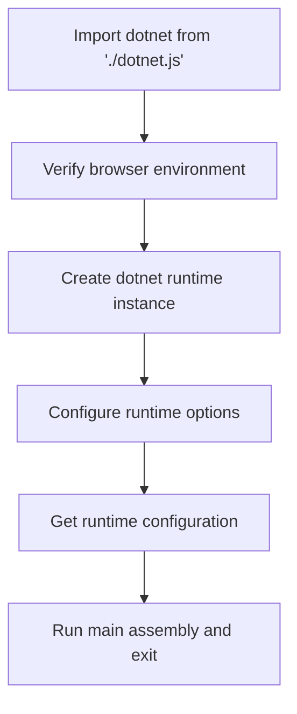
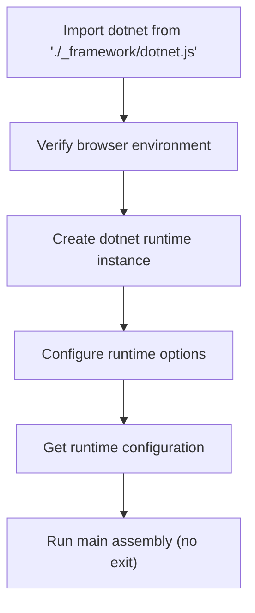
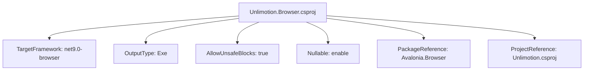

# Browser Deployment

<cite>
**Referenced Files in This Document**   
- [Program.cs](file://src/Unlimotion.Browser/Program.cs)
- [Unlimotion.Browser.csproj](file://src/Unlimotion.Browser/Unlimotion.Browser.csproj)
- [AppBundle/index.html](file://src/Unlimotion.Browser/AppBundle/index.html)
- [wwwroot/index.html](file://src/Unlimotion.Browser/wwwroot/index.html)
- [AppBundle/main.js](file://src/Unlimotion.Browser/AppBundle/main.js)
- [wwwroot/main.js](file://src/Unlimotion.Browser/wwwroot/main.js)
- [AppBundle/app.css](file://src/Unlimotion.Browser/AppBundle/app.css)
- [wwwroot/app.css](file://src/Unlimotion.Browser/wwwroot/app.css)
- [runtimeconfig.template.json](file://src/Unlimotion.Browser/runtimeconfig.template.json)
- [App.axaml.cs](file://src/Unlimotion/App.axaml.cs)
</cite>

## Table of Contents
1. [Introduction](#introduction)
2. [Program.cs Initialization](#programcs-initialization)
3. [Index HTML Structure](#index-html-structure)
4. [Main JavaScript Implementation](#main-javascript-implementation)
5. [Build Configuration](#build-configuration)
6. [Deployment Strategies](#deployment-strategies)
7. [Browser Compatibility](#browser-compatibility)
8. [Debugging and Offline Support](#debugging-and-offline-support)
9. [Conclusion](#conclusion)

## Introduction
Unlimotion is a cross-platform application built with Avalonia UI that can be deployed as a web application using WebAssembly. This document details the deployment architecture for the browser environment, focusing on the initialization process, file structure, build configuration, and deployment considerations. The web deployment leverages .NET WebAssembly to run the application directly in the browser while maintaining the same codebase used for desktop applications.

## Program.cs Initialization

The Program.cs file in the Unlimotion.Browser project serves as the entry point for the web application, responsible for initializing the Avalonia web runtime and bootstrapping the application within the browser environment. The initialization process follows a structured approach to configure the application builder with necessary services and dependencies.

The `Main` method uses an asynchronous approach to build and start the Avalonia application specifically configured for browser execution. It calls `BuildAvaloniaApp()` to create the application builder, then applies custom font configuration and ReactiveUI integration before starting the application with `StartBrowserAppAsync("out")`. The parameter "out" specifies the DOM element ID where the application will be mounted.

The `BuildAvaloniaApp` method performs several critical initialization tasks:
- Sets the default storage path for task data using the browser's application data directory
- Creates and configures a JSON-based configuration system for settings persistence
- Registers essential services in the Splat dependency injection container, including configuration, dialogs, and AutoMapper
- Configures task storage based on application settings
- Registers the notification manager wrapper
- Returns an AppBuilder instance configured with the main App class

This initialization process ensures that the application is properly configured with all necessary services before the UI framework is loaded, providing a consistent experience across different deployment targets.

**Section sources**
- [Program.cs](file://src/Unlimotion.Browser/Program.cs#L1-L52)
- [App.axaml.cs](file://src/Unlimotion/App.axaml.cs#L1-L233)

## Index HTML Structure

The Unlimotion web application includes two index.html files: one in the AppBundle directory and another in the wwwroot directory. These files serve as the entry points for the web application and are structured to properly load the WebAssembly runtime and initialize the application.

### AppBundle/index.html

The AppBundle/index.html file provides the basic HTML structure for the application with a custom splash screen design. It includes several key elements:

- **Meta tags** for character encoding, viewport settings, and base URL configuration
- **Module preload links** for critical JavaScript files (main.js, dotnet.js, and avalonia.js) to optimize loading performance
- **CSS link** for app.css which contains styling for the splash screen and application container
- **DOM structure** with a div element with ID "out" serving as the mounting point for the Avalonia application
- **Custom splash screen** with Avalonia UI branding and a purple color scheme
- **Script tag** that loads main.js as a module to initialize the WebAssembly runtime

The splash screen is styled with a dark background (#1b2a4e) and white text, featuring the Avalonia UI logo with low opacity positioned in the bottom-right corner. The splash screen provides visual feedback during application loading.

### wwwroot/index.html

The wwwroot/index.html file serves a similar purpose but with a different design approach that supports light and dark themes. Key differences include:

- **Simpler splash screen design** with a white background in light mode and dark blue (#1b2a4e) in dark mode
- **SVG-based Avalonia UI logo** instead of an image file
- **CSS media queries** that detect the user's preferred color scheme and adjust the splash screen colors accordingly
- **No base href tag**, which affects how relative URLs are resolved

Both index.html files share the same fundamental structure with a div element with ID "out" as the application mounting point and a script tag that loads main.js. The duplication of these files in different directories supports different deployment scenarios and build configurations.

**Section sources**
- [AppBundle/index.html](file://src/Unlimotion.Browser/AppBundle/index.html#L1-L30)
- [wwwroot/index.html](file://src/Unlimotion.Browser/wwwroot/index.html#L1-L37)

## Main JavaScript Implementation

The main.js files in both the AppBundle and wwwroot directories are responsible for initializing the WebAssembly runtime and enabling JavaScript interop. These files are critical for bridging the gap between the .NET WebAssembly environment and the browser's JavaScript runtime.

### AppBundle/main.js

The AppBundle/main.js implementation follows a straightforward initialization process:
1. Imports the dotnet module from dotnet.js
2. Verifies that the code is running in a browser environment
3. Creates a dotnet runtime instance with diagnostic tracing disabled
4. Configures the runtime to use application arguments from the query string
5. Retrieves the runtime configuration
6. Executes the main assembly with the current URL as an argument and exits

### wwwroot/main.js

The wwwroot/main.js implementation is similar but with key differences:
- Imports dotnet.js from the _framework directory, which is the standard location for Blazor WebAssembly applications
- Uses `runMain` instead of `runMainAndExit`, allowing the application to continue running after startup
- Passes `globalThis.location.href` as the argument instead of `window.location.search`

The JavaScript interop capabilities enable communication between the .NET WebAssembly code and JavaScript, allowing the application to access browser APIs, handle DOM events, and integrate with other web technologies. This interop layer is essential for features like URL routing, local storage access, and browser-specific functionality.

**Diagram sources**
- [AppBundle/main.js](file://src/Unlimotion.Browser/AppBundle/main.js#L1-L13)
- [wwwroot/main.js](file://src/Unlimotion.Browser/wwwroot/main.js#L1-L14)

**Section sources**
- [AppBundle/main.js](file://src/Unlimotion.Browser/AppBundle/main.js#L1-L13)
- [wwwroot/main.js](file://src/Unlimotion.Browser/wwwroot/main.js#L1-L14)

## Build Configuration

The build process for the Unlimotion web application is defined in the Unlimotion.Browser.csproj project file, which specifies the target framework, runtime identifier, and publish settings necessary for web deployment.

The project configuration includes several important settings:

- **TargetFramework**: net9.0-browser, which specifies that the application targets .NET 9.0 with browser-specific APIs and WebAssembly support
- **OutputType**: Exe, indicating that the output is an executable assembly rather than a library
- **AllowUnsafeBlocks**: Enabled to allow unsafe code, which may be necessary for certain performance-critical operations or interop scenarios
- **Nullable**: Enabled to support nullable reference types, improving code safety and reducing null reference exceptions

The project includes a PackageReference to Avalonia.Browser, which provides the necessary components to run Avalonia applications in the browser using WebAssembly. It also references the main Unlimotion project, ensuring that the core application logic is included in the build.

The runtime configuration is further customized through the runtimeconfig.template.json file, which defines host properties for the WebAssembly runtime. This file specifies browser-specific configuration options that control how the .NET runtime operates within the browser environment.

**Diagram sources**
- [Unlimotion.Browser.csproj](file://src/Unlimotion.Browser/Unlimotion.Browser.csproj#L1-L17)
- [runtimeconfig.template.json](file://src/Unlimotion.Browser/runtimeconfig.template.json#L1-L10)

**Section sources**
- [Unlimotion.Browser.csproj](file://src/Unlimotion.Browser/Unlimotion.Browser.csproj#L1-L17)
- [runtimeconfig.template.json](file://src/Unlimotion.Browser/runtimeconfig.template.json#L1-L10)

## Deployment Strategies

Deploying Unlimotion as a web application requires careful consideration of hosting options, CDN configurations, and reverse proxy setups to ensure optimal performance and reliability.

### Static Web Server Hosting

Unlimotion can be hosted on any static web server that serves HTML, CSS, JavaScript, and WebAssembly files. The application's static nature makes it compatible with services like:
- GitHub Pages
- Netlify
- Vercel
- AWS S3 with CloudFront
- Azure Blob Storage with CDN

When deploying to static servers, ensure that the server is configured to serve .wasm files with the appropriate MIME type (application/wasm) and that caching headers are properly set for optimal performance.

### CDN Configuration

Content Delivery Networks (CDNs) can significantly improve the loading performance of the web application by distributing files across multiple geographic locations. Key CDN configuration considerations include:

- **Caching strategy**: Static assets (CSS, JS, WASM) should have long cache durations (e.g., 1 year) with content hashing for cache busting
- **Compression**: Enable Brotli and Gzip compression for all text-based assets
- **HTTP/2 or HTTP/3**: Enable modern HTTP protocols for improved loading performance
- **Preloading**: Configure the CDN to support module preloading for critical JavaScript files

### Reverse Proxy Integration

For applications that require integration with backend services, a reverse proxy can be used to route requests appropriately. Common reverse proxy configurations include:

- **API routing**: Forward API requests to the Unlimotion server while serving static files directly
- **Authentication**: Implement authentication at the proxy level before requests reach the application
- **SSL termination**: Handle HTTPS at the proxy level while communicating with backend services over HTTP
- **Load balancing**: Distribute traffic across multiple instances of the application or backend services

The base href configuration in index.html may need to be adjusted when using reverse proxies to ensure that relative URLs are resolved correctly.

## Browser Compatibility

Unlimotion's web deployment supports modern browsers with WebAssembly capabilities. The application has been tested and verified to work across major browser platforms with specific considerations for each.

### Supported Browsers

- **Chrome**: Full support for WebAssembly and modern JavaScript features
- **Firefox**: Full support with excellent WebAssembly performance
- **Safari**: Full support with some limitations on older iOS versions
- **Edge**: Full support leveraging Chromium's WebAssembly implementation

### WebAssembly Support Requirements

The application requires the following WebAssembly features:
- WebAssembly 1.0 (MVP) support
- JavaScript ES6 module support
- Fetch API for resource loading
- Web Workers (for background operations)

### Performance Considerations

Browser performance varies based on several factors:

- **Download size**: The initial download includes the .NET runtime, application assemblies, and dependencies (typically 5-10MB compressed)
- **Startup time**: WebAssembly compilation and runtime initialization can take 2-5 seconds on modern devices
- **Memory usage**: The application typically uses 100-200MB of RAM, depending on data size
- **CPU utilization**: Initial startup is CPU-intensive due to WebAssembly compilation

To optimize performance:
- Implement lazy loading for non-critical components
- Use code splitting to reduce initial download size
- Optimize asset compression (Brotli for text assets)
- Consider pre-warming the application for frequently accessed pages

## Debugging and Offline Support

Effective debugging and offline support are critical for maintaining a high-quality user experience in the web deployment of Unlimotion.

### Browser Developer Tools

The application can be debugged using standard browser developer tools:

- **Console**: Monitor application logs and JavaScript interop messages
- **Network tab**: Analyze asset loading performance and API calls
- **Memory tab**: Monitor WebAssembly memory usage and detect potential leaks
- **Sources tab**: Debug JavaScript code, though .NET code debugging requires additional tools

For .NET code debugging, Visual Studio and Visual Studio Code support debugging WebAssembly applications with source mapping, allowing developers to set breakpoints and inspect variables in C# code.

### Client-Side Debugging

Common client issues and their debugging approaches:

- **Application fails to start**: Check console for WebAssembly loading errors and verify that all required files are served with correct MIME types
- **Slow startup**: Analyze network tab to identify slow-loading resources and optimize compression
- **JavaScript interop failures**: Verify that interop methods are properly decorated and that JavaScript code is loaded in the correct order
- **Layout issues**: Use browser developer tools to inspect the DOM structure and CSS styles applied by Avalonia

### Offline Scenarios

The current implementation has limited offline capabilities:
- The application requires an internet connection for initial loading of WebAssembly files
- Once loaded, the application can function offline if no server communication is required
- Browser caching can be leveraged to improve subsequent load times

To enhance offline support:
- Implement a service worker for caching critical assets
- Consider Progressive Web App (PWA) enhancements for offline functionality
- Store user data locally using IndexedDB or localStorage
- Implement graceful degradation when network connectivity is lost

## Conclusion

Deploying Unlimotion as a web application leverages the power of Avalonia UI and .NET WebAssembly to deliver a rich desktop-like experience in the browser. The deployment architecture is well-structured with clear separation between the initialization logic, HTML structure, JavaScript interop, and build configuration. By understanding the role of each component and following best practices for hosting and optimization, the application can be successfully deployed to various web environments while maintaining performance and reliability across different browsers and network conditions.