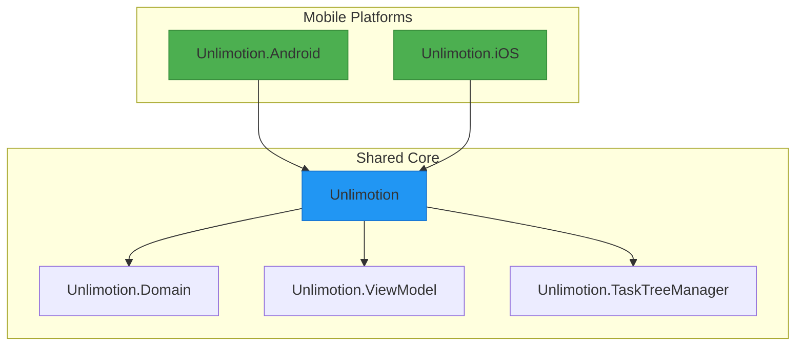
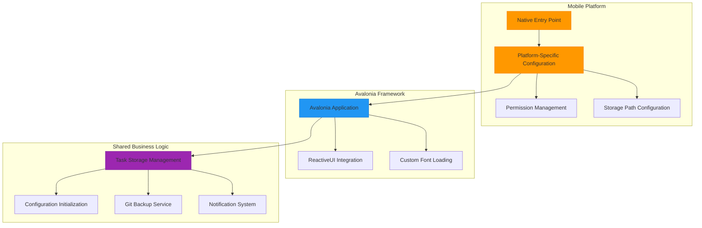
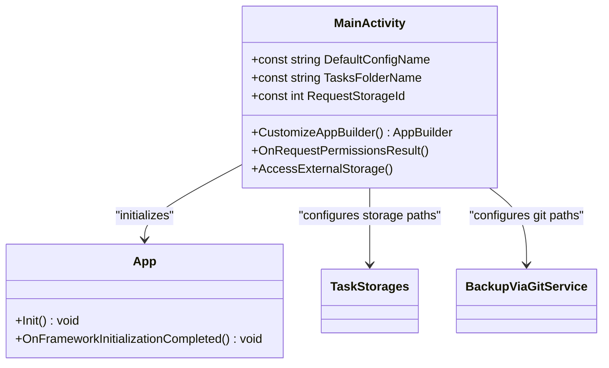
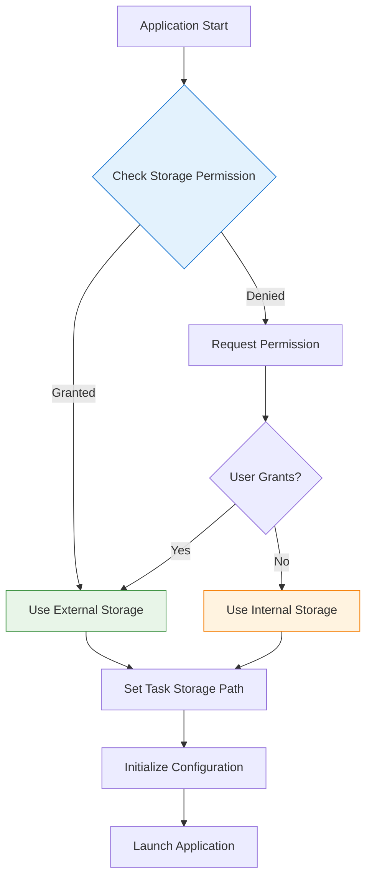
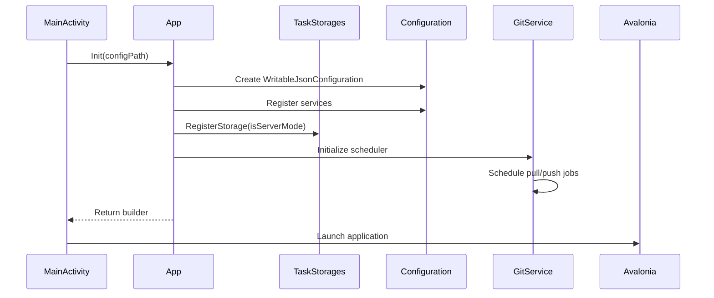
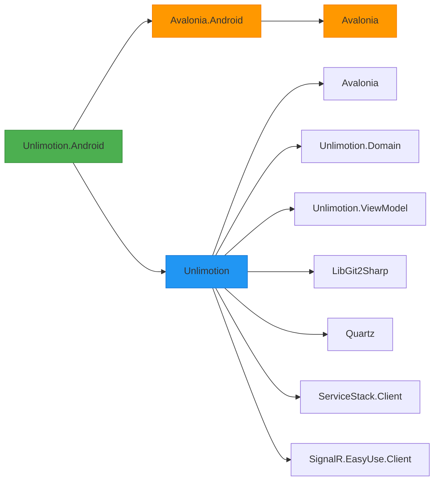

# Mobile Configuration

<cite>
**Referenced Files in This Document**   
- [Unlimotion.Android.csproj](file://src/Unlimotion.Android/Unlimotion.Android.csproj)
- [Unlimotion.iOS.csproj](file://src/Unlimotion.iOS/Unlimotion.iOS.csproj)
- [AndroidManifest.xml](file://src/Unlimotion.Android/Properties/AndroidManifest.xml)
- [MainActivity.cs](file://src/Unlimotion.Android/MainActivity.cs)
- [AppDelegate.cs](file://src/Unlimotion.iOS/AppDelegate.cs)
- [Unlimotion.csproj](file://src/Unlimotion/Unlimotion.csproj)
- [App.axaml.cs](file://src/Unlimotion/App.axaml.cs)
- [TaskStorages.cs](file://src/Unlimotion/TaskStorages.cs)
- [FileTaskStorage.cs](file://src/Unlimotion/FileTaskStorage.cs)
- [ServerTaskStorage.cs](file://src/Unlimotion/ServerTaskStorage.cs)
- [colors.xml](file://src/Unlimotion.Android/Resources/values/colors.xml)
- [styles.xml](file://src/Unlimotion.Android/Resources/values/styles.xml)
- [splash_screen.xml](file://src/Unlimotion.Android/Resources/drawable/splash_screen.xml)
</cite>

## Table of Contents
1. [Introduction](#introduction)
2. [Project Structure](#project-structure)
3. [Core Components](#core-components)
4. [Architecture Overview](#architecture-overview)
5. [Detailed Component Analysis](#detailed-component-analysis)
6. [Dependency Analysis](#dependency-analysis)
7. [Performance Considerations](#performance-considerations)
8. [Troubleshooting Guide](#troubleshooting-guide)
9. [Conclusion](#conclusion)

## Introduction
Unlimotion is a cross-platform task management application built using Avalonia UI framework, enabling deployment across desktop and mobile platforms. This document provides comprehensive guidance for configuring and deploying Unlimotion on Android and iOS platforms. The mobile implementation leverages Avalonia's native mobile support to deliver consistent functionality while adapting to platform-specific requirements for storage, permissions, and user interface interactions.

## Project Structure



**Diagram sources**
- [Unlimotion.Android.csproj](file://src/Unlimotion.Android/Unlimotion.Android.csproj)
- [Unlimotion.iOS.csproj](file://src/Unlimotion.iOS/Unlimotion.iOS.csproj)
- [Unlimotion.csproj](file://src/Unlimotion/Unlimotion.csproj)

**Section sources**
- [Unlimotion.Android.csproj](file://src/Unlimotion.Android/Unlimotion.Android.csproj)
- [Unlimotion.iOS.csproj](file://src/Unlimotion.iOS/Unlimotion.iOS.csproj)

## Core Components

The mobile configuration of Unlimotion centers around platform-specific entry points that initialize the shared codebase while handling mobile-specific requirements such as permissions, storage paths, and application lifecycle events. The Android and iOS projects serve as thin native wrappers that bootstrap the Avalonia application and configure platform-specific settings before delegating to the shared logic.

**Section sources**
- [MainActivity.cs](file://src/Unlimotion.Android/MainActivity.cs)
- [AppDelegate.cs](file://src/Unlimotion.iOS/AppDelegate.cs)

## Architecture Overview



**Diagram sources**
- [MainActivity.cs](file://src/Unlimotion.Android/MainActivity.cs)
- [AppDelegate.cs](file://src/Unlimotion.iOS/AppDelegate.cs)
- [App.axaml.cs](file://src/Unlimotion/App.axaml.cs)

## Detailed Component Analysis

### Android Configuration Analysis

The Android implementation of Unlimotion is configured through several key components that handle platform-specific requirements.

#### Build Configuration
The Android project is configured with specific build settings that target Android 14 (API level 34) while maintaining compatibility with Android 5.0 (API level 21) as the minimum supported version. The application is packaged as an APK with the package identifier `com.Kibnet.Unlimotion`.



**Diagram sources**
- [Unlimotion.Android.csproj](file://src/Unlimotion.Android/Unlimotion.Android.csproj)
- [MainActivity.cs](file://src/Unlimotion.Android/MainActivity.cs)

#### Manifest and Permissions
The Android application requires specific permissions to function properly, particularly for external storage access and network connectivity. The manifest configuration requests permissions for internet access and external storage read/write operations, which are essential for syncing tasks with remote servers and storing task data.



**Diagram sources**
- [AndroidManifest.xml](file://src/Unlimotion.Android/Properties/AndroidManifest.xml)
- [MainActivity.cs](file://src/Unlimotion.Android/MainActivity.cs)

### iOS Configuration Analysis

The iOS implementation follows a similar pattern to Android but with platform-appropriate configurations and fewer permission requirements due to iOS's sandboxed storage model.

```mermaid
classDiagram
class AppDelegate {
+CustomizeAppBuilder() AppBuilder
}
AppDelegate --> App : "initializes"
AppDelegate --> AvaloniaApplication : "extends"
note right of AppDelegate
iOS implementation is minimal
as Avalonia handles most
platform integration
end
```

**Diagram sources**
- [Unlimotion.iOS.csproj](file://src/Unlimotion.iOS/Unlimotion.iOS.csproj)
- [AppDelegate.cs](file://src/Unlimotion.iOS/AppDelegate.cs)

### Shared Initialization Process

The initialization process for mobile clients follows a consistent pattern across platforms, with the shared codebase handling the core functionality.



**Diagram sources**
- [App.axaml.cs](file://src/Unlimotion/App.axaml.cs)
- [TaskStorages.cs](file://src/Unlimotion/TaskStorages.cs)

### Task Storage Architecture

Unlimotion supports both local file-based storage and server-based storage, with the ability to switch between modes and synchronize data via Git.

```mermaid
classDiagram
class ITaskStorage {
<<interface>>
+Connect() Task~bool~
+Disconnect() Task
+Save(item) Task~bool~
+Remove(itemId) Task~bool~
+GetAll() IAsyncEnumerable~TaskItem~
}
class FileTaskStorage {
+Path string
+Tasks SourceCache
+GetStoragePath() string
}
class ServerTaskStorage {
+Url string
+IsConnected bool
+IsSignedIn bool
}
class TaskStorages {
+RegisterStorage() void
+SetSettingsCommands() void
+DefaultStoragePath string
}
ITaskStorage <|-- FileTaskStorage
ITaskStorage <|-- ServerTaskStorage
TaskStorages --> FileTaskStorage : "creates"
TaskStorages --> ServerTaskStorage : "creates"
TaskStorages --> ITaskStorage : "registers"
note right of FileTaskStorage
Stores tasks in JSON files
in designated directory
Uses FileDbWatcher for
change detection
end
note right of ServerTaskStorage
Connects to Unlimotion server
via SignalR and ServiceStack
Uses JWT authentication
with refresh tokens
end
```

**Diagram sources**
- [FileTaskStorage.cs](file://src/Unlimotion/FileTaskStorage.cs)
- [ServerTaskStorage.cs](file://src/Unlimotion/ServerTaskStorage.cs)
- [TaskStorages.cs](file://src/Unlimotion/TaskStorages.cs)

**Section sources**
- [FileTaskStorage.cs](file://src/Unlimotion/FileTaskStorage.cs)
- [ServerTaskStorage.cs](file://src/Unlimotion/ServerTaskStorage.cs)
- [TaskStorages.cs](file://src/Unlimotion/TaskStorages.cs)

## Dependency Analysis



**Diagram sources**
- [Unlimotion.Android.csproj](file://src/Unlimotion.Android/Unlimotion.Android.csproj)
- [Unlimotion.csproj](file://src/Unlimotion/Unlimotion.csproj)

**Section sources**
- [Unlimotion.Android.csproj](file://src/Unlimotion.Android/Unlimotion.Android.csproj)
- [Unlimotion.csproj](file://src/Unlimotion/Unlimotion.csproj)

## Performance Considerations

The mobile implementation of Unlimotion includes several performance considerations:

1. **Storage Access**: On Android, the application requests external storage permissions to store task data in a location accessible to the user. If denied, it falls back to internal storage.
2. **Background Operations**: Git synchronization operations are scheduled using Quartz.NET, allowing for periodic background sync without blocking the UI thread.
3. **Memory Management**: The application uses ReactiveUI and DynamicData to efficiently manage task collections and updates, minimizing memory allocations.
4. **Connection Resilience**: The server connection includes automatic reconnection logic with exponential backoff to handle intermittent network connectivity.

The application also implements a pause mechanism in the FileTaskStorage to prevent concurrent write operations, ensuring data integrity during high-frequency update scenarios.

**Section sources**
- [MainActivity.cs](file://src/Unlimotion.Android/MainActivity.cs)
- [FileTaskStorage.cs](file://src/Unlimotion/FileTaskStorage.cs)
- [ServerTaskStorage.cs](file://src/Unlimotion/ServerTaskStorage.cs)

## Troubleshooting Guide

Common mobile deployment issues and their solutions:

1. **Permission Errors (Android)**: If the application fails to access external storage, ensure that the user has granted the storage permission. The application will fall back to internal storage if permission is denied.

2. **Build Failures**: Ensure that the Android SDK and iOS development tools are properly installed and configured. The projects target .NET 9.0, so ensure the appropriate SDK is installed.

3. **Connectivity Problems**: For server mode, verify that the server URL is correctly configured and accessible. The application will attempt to reconnect automatically if the connection is lost.

4. **Splash Screen Issues**: The splash screen is configured through styles.xml and splash_screen.xml. Ensure that the icon.png file exists in the drawable directory.

5. **Configuration Initialization**: The application creates a default Settings.json file if none exists. Verify that the configuration file is being created in the expected location (external storage on Android, app sandbox on iOS).

**Section sources**
- [MainActivity.cs](file://src/Unlimotion.Android/MainActivity.cs)
- [App.axaml.cs](file://src/Unlimotion/App.axaml.cs)
- [TaskStorages.cs](file://src/Unlimotion/TaskStorages.cs)

## Conclusion

Unlimotion's mobile configuration demonstrates a well-structured approach to cross-platform development using Avalonia UI. The architecture effectively separates platform-specific concerns from shared business logic, allowing for consistent functionality across Android and iOS while accommodating platform-specific requirements. The task storage system provides flexibility with both local and server-based options, and the Git integration enables robust data synchronization. The initialization process is carefully designed to handle mobile-specific constraints such as permissions and storage paths, ensuring a smooth user experience across different devices and configurations.