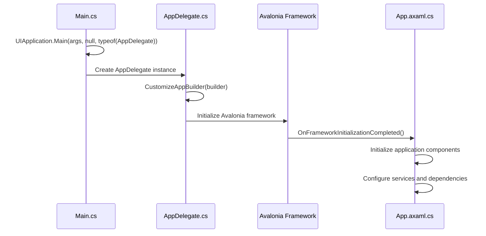
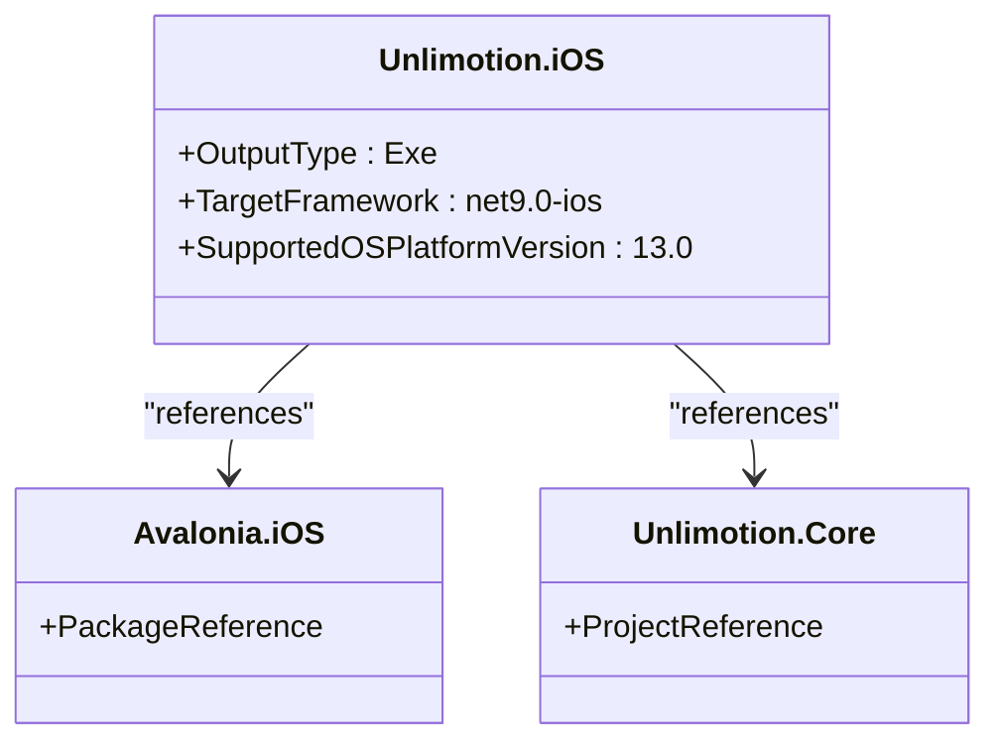
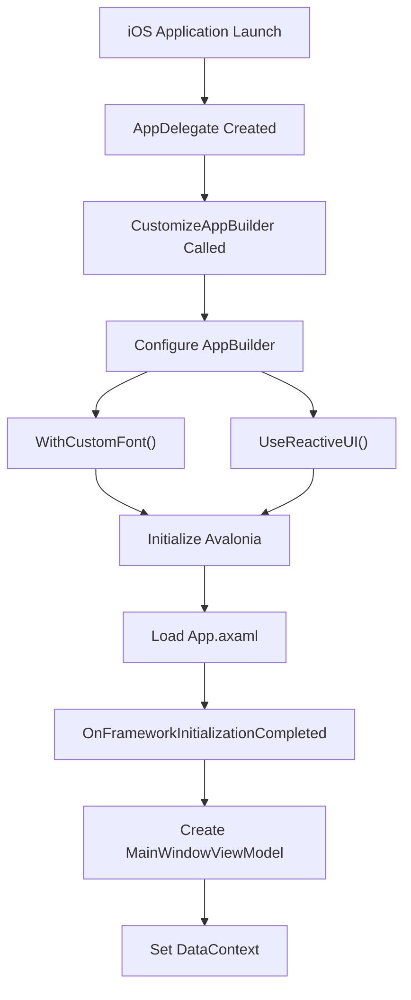
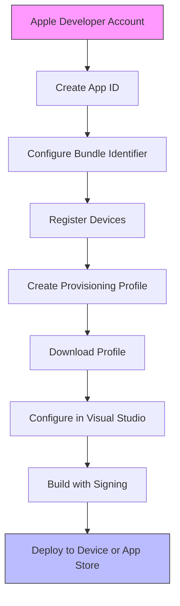
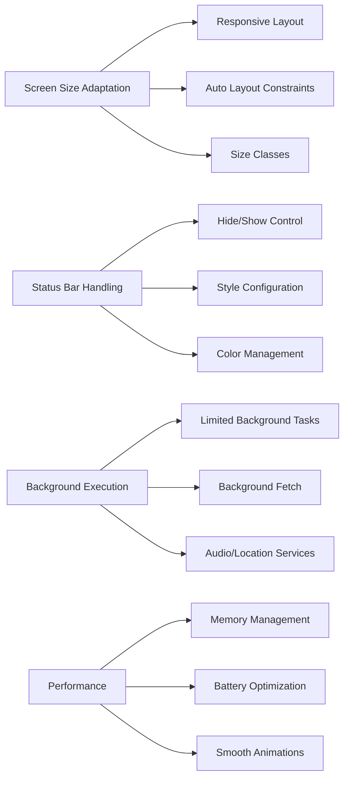
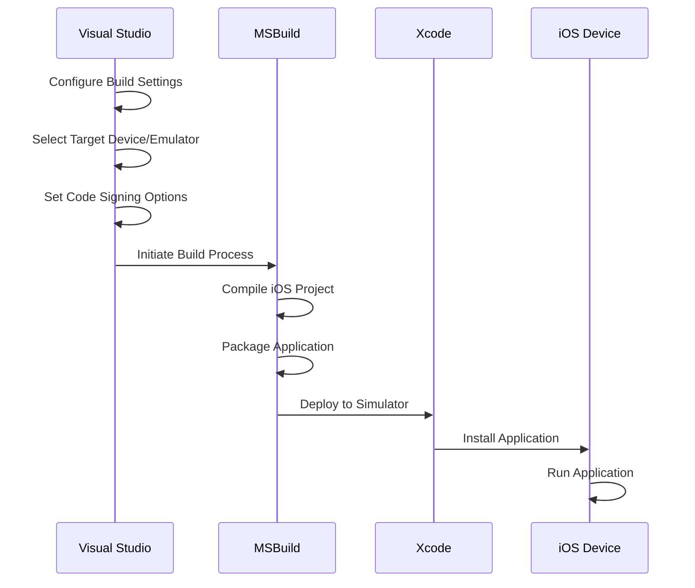
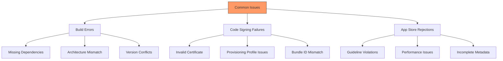
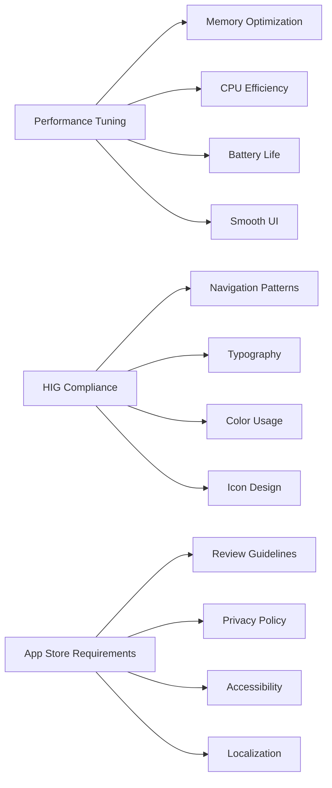

# iOS Configuration

<cite>
**Referenced Files in This Document**   
- [Main.cs](file://src/Unlimotion.iOS/Main.cs)
- [AppDelegate.cs](file://src/Unlimotion.iOS/AppDelegate.cs)
- [Unlimotion.iOS.csproj](file://src/Unlimotion.iOS/Unlimotion.iOS.csproj)
- [App.axaml.cs](file://src/Unlimotion/App.axaml.cs)
- [Info.plist](file://src/Unlimotion.iOS/Info.plist)
- [Entitlements.plist](file://src/Unlimotion.iOS/Entitlements.plist)
- [Unlimotion.csproj](file://src/Unlimotion/Unlimotion.csproj)
</cite>

## Table of Contents
1. [Introduction](#introduction)
2. [Initialization Sequence](#initialization-sequence)
3. [Project Configuration](#project-configuration)
4. [Avalonia Framework Integration](#avalonia-framework-integration)
5. [iOS Build Settings](#ios-build-settings)
6. [Code Signing and Provisioning](#code-signing-and-provisioning)
7. [Platform-Specific Considerations](#platform-specific-considerations)
8. [Build and Deployment](#build-and-deployment)
9. [Troubleshooting](#troubleshooting)
10. [Performance and Compliance](#performance-and-compliance)

## Introduction
This document provides comprehensive guidance for configuring Unlimotion on iOS devices. It covers the initialization process, project configuration, build settings, and deployment procedures for the iOS application. The documentation focuses on the integration between the Avalonia framework and iOS application lifecycle events, as well as platform-specific considerations for optimal performance and compliance with Apple's guidelines.

## Initialization Sequence

The iOS application initialization begins with the Main.cs file, which serves as the entry point for the application. The execution flow follows a specific sequence that integrates the Avalonia framework with iOS lifecycle events.



**Diagram sources**
- [Main.cs](file://src/Unlimotion.iOS/Main.cs#L1-L13)
- [AppDelegate.cs](file://src/Unlimotion.iOS/AppDelegate.cs#L1-L24)
- [App.axaml.cs](file://src/Unlimotion/App.axaml.cs#L1-L232)

**Section sources**
- [Main.cs](file://src/Unlimotion.iOS/Main.cs#L1-L13)
- [AppDelegate.cs](file://src/Unlimotion.iOS/AppDelegate.cs#L1-L24)

## Project Configuration

The Unlimotion.iOS project is configured through the Unlimotion.iOS.csproj file, which defines the target framework, supported iOS versions, and package dependencies. The project references the core Unlimotion library and includes the Avalonia.iOS package for platform-specific functionality.



**Diagram sources**
- [Unlimotion.iOS.csproj](file://src/Unlimotion.iOS/Unlimotion.iOS.csproj#L1-L16)

**Section sources**
- [Unlimotion.iOS.csproj](file://src/Unlimotion.iOS/Unlimotion.iOS.csproj#L1-L16)
- [Directory.Build.props](file://src/Directory.Build.props#L1-L5)

## Avalonia Framework Integration

The integration between Avalonia and iOS is managed through the AppDelegate class, which inherits from AvaloniaAppDelegate<App>. This base class handles the mapping between iOS application lifecycle events and Avalonia framework initialization. The CustomizeAppBuilder method configures the application builder with custom font support and ReactiveUI integration.



**Diagram sources**
- [AppDelegate.cs](file://src/Unlimotion.iOS/AppDelegate.cs#L1-L24)
- [App.axaml.cs](file://src/Unlimotion/App.axaml.cs#L1-L232)

**Section sources**
- [AppDelegate.cs](file://src/Unlimotion.iOS/AppDelegate.cs#L1-L24)
- [App.axaml.cs](file://src/Unlimotion/App.axaml.cs#L1-L232)

## iOS Build Settings

The iOS build configuration is defined in the project file and Info.plist. Key settings include the target framework version, supported iOS version, and platform-specific properties. The application is configured to support iOS 13.0 and later versions, ensuring compatibility with a wide range of devices.

```mermaid
erDiagram
BUILD_SETTINGS {
string TargetFramework PK
string SupportedOSPlatformVersion
bool Nullable
string OutputType
}
INFO_PLIST_SETTINGS {
string CFBundleIdentifier PK
string CFBundleVersion
string CFBundleShortVersionString
string UILaunchStoryboardName
string UIRequiredDeviceCapabilities
string UISupportedInterfaceOrientations
}
ENTITLEMENTS {
string com.apple.developer.team-identifier PK
bool get-task-allow
bool application-identifier
}
BUILD_SETTINGS ||--o{ INFO_PLIST_SETTINGS : "configures"
BUILD_SETTINGS ||--o{ ENTITLEMENTS : "requires"
```

**Section sources**
- [Unlimotion.iOS.csproj](file://src/Unlimotion.iOS/Unlimotion.iOS.csproj#L1-L16)
- [Info.plist](file://src/Unlimotion.iOS/Info.plist)
- [Entitlements.plist](file://src/Unlimotion.iOS/Entitlements.plist)

## Code Signing and Provisioning

Code signing and provisioning for iOS deployment require proper configuration of certificates, identifiers, and profiles. The application must be signed with a valid Apple Developer certificate and provisioned with an appropriate provisioning profile that matches the bundle identifier and device requirements.



**Section sources**
- [Info.plist](file://src/Unlimotion.iOS/Info.plist)
- [Entitlements.plist](file://src/Unlimotion.iOS/Entitlements.plist)

## Platform-Specific Considerations

When developing for iOS, several platform-specific considerations must be addressed to ensure optimal user experience and compliance with Apple's guidelines. These include screen size adaptation, status bar handling, and background execution limitations.



**Section sources**
- [AppDelegate.cs](file://src/Unlimotion.iOS/AppDelegate.cs#L1-L24)
- [App.axaml.cs](file://src/Unlimotion/App.axaml.cs#L1-L232)

## Build and Deployment

The process of building and deploying Unlimotion to iOS devices involves several steps, including configuration in Visual Studio, code signing, and deployment through Xcode or Visual Studio tools. Developers can target both iOS simulators and physical devices for testing and distribution.



**Section sources**
- [Unlimotion.iOS.csproj](file://src/Unlimotion.iOS/Unlimotion.iOS.csproj#L1-L16)
- [Main.cs](file://src/Unlimotion.iOS/Main.cs#L1-L13)

## Troubleshooting

Common issues encountered during iOS development and deployment include build errors, code signing failures, and App Store submission rejections. Understanding these issues and their solutions is critical for successful application delivery.



**Section sources**
- [AppDelegate.cs](file://src/Unlimotion.iOS/AppDelegate.cs#L1-L24)
- [Unlimotion.iOS.csproj](file://src/Unlimotion.iOS/Unlimotion.iOS.csproj#L1-L16)

## Performance and Compliance

Optimizing performance for iOS hardware and ensuring compliance with Apple's human interface guidelines are essential for delivering a high-quality user experience. This includes considerations for memory usage, battery efficiency, and adherence to design principles.



**Section sources**
- [App.axaml.cs](file://src/Unlimotion/App.axaml.cs#L1-L232)
- [AppDelegate.cs](file://src/Unlimotion.iOS/AppDelegate.cs#L1-L24)