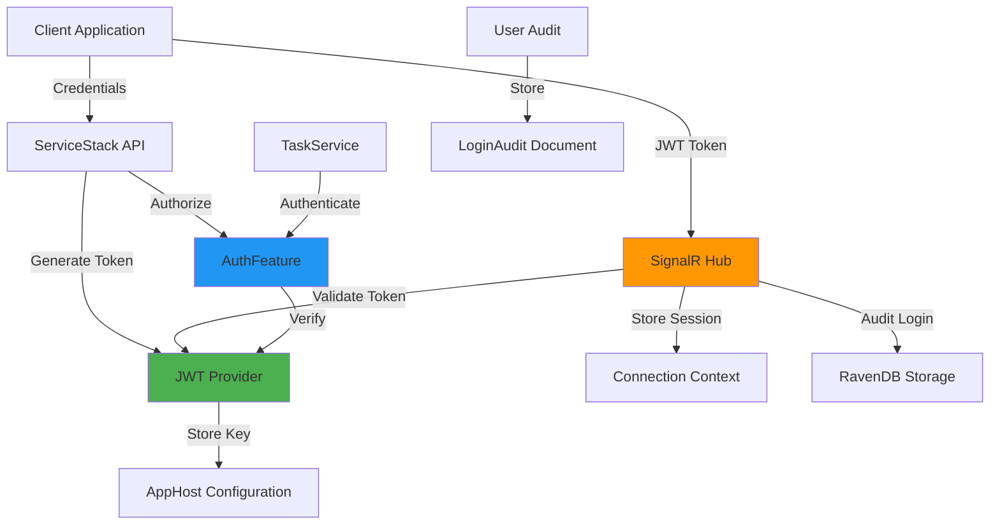
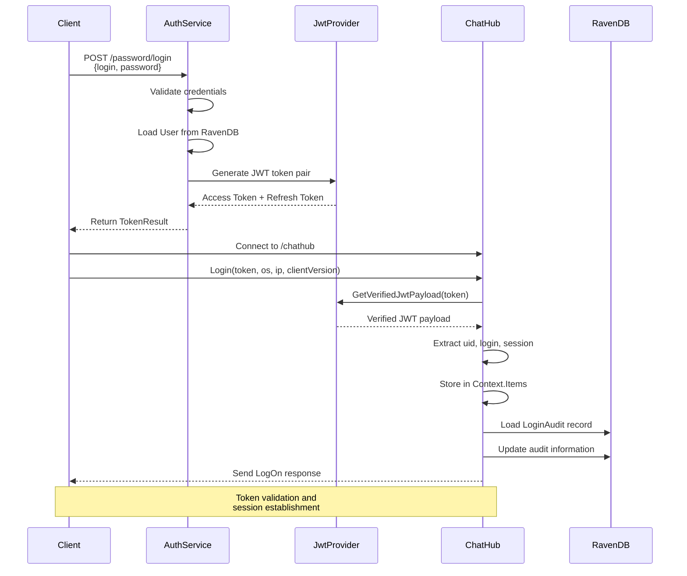
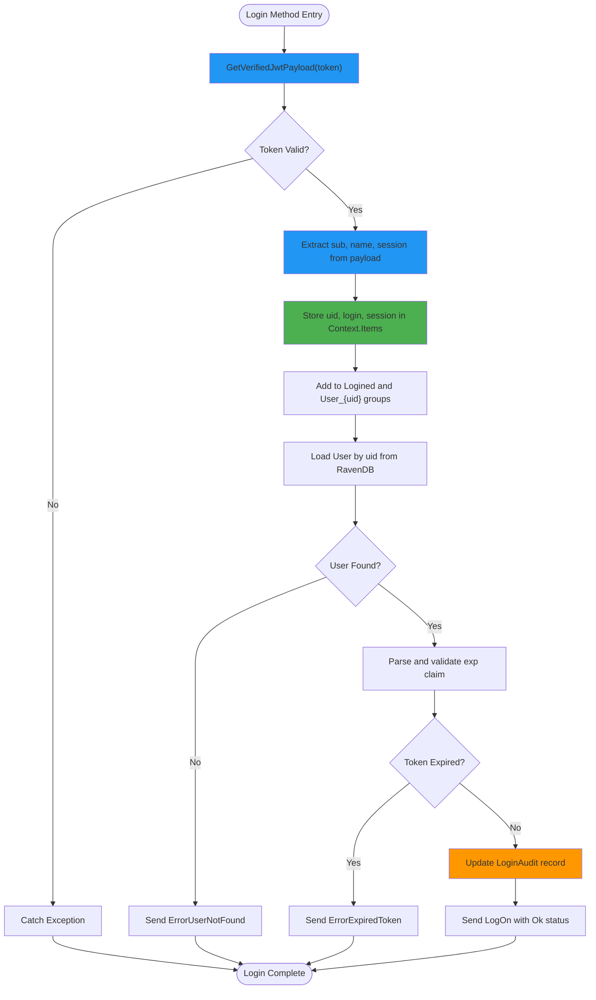
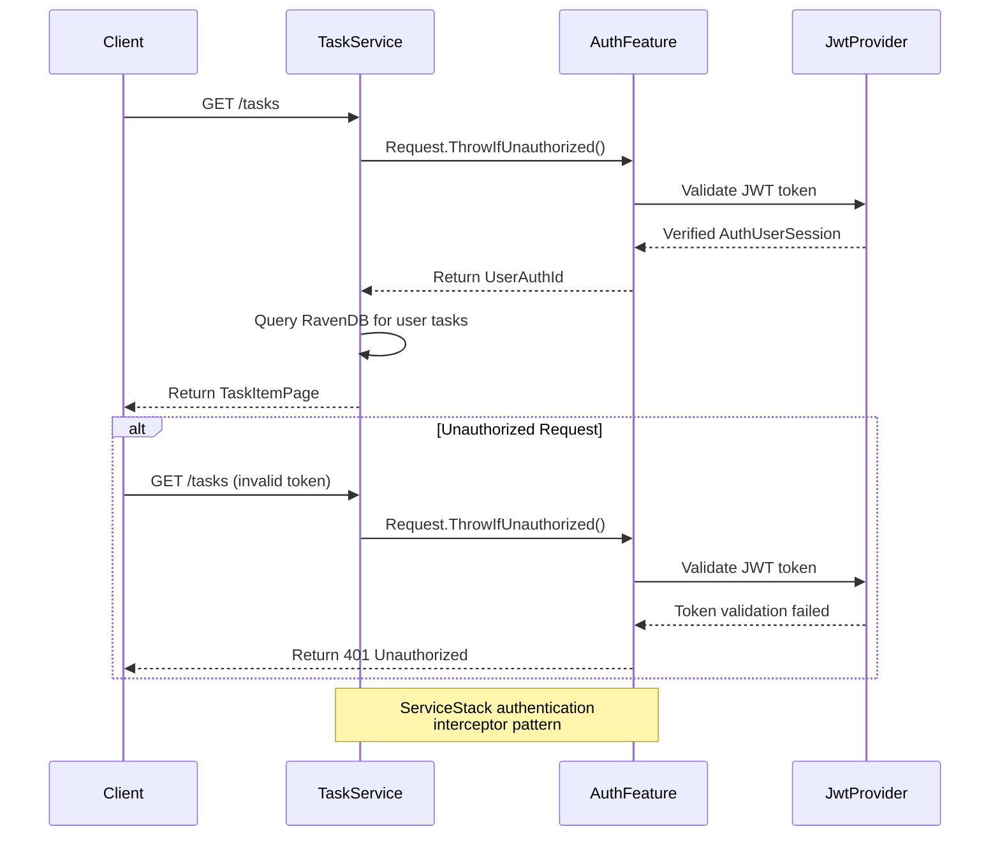
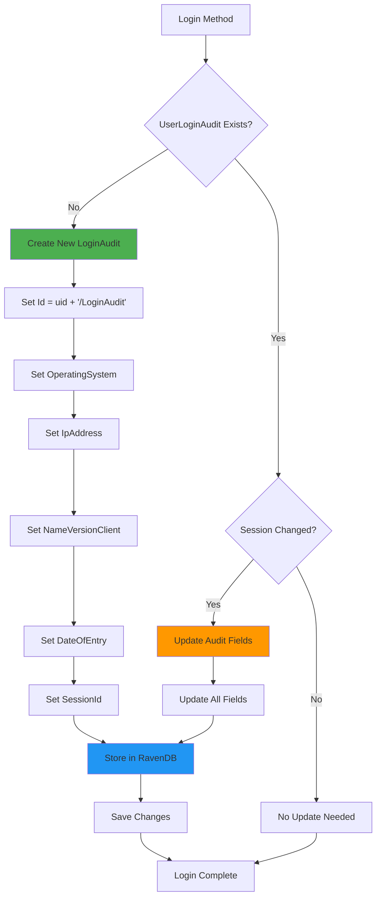
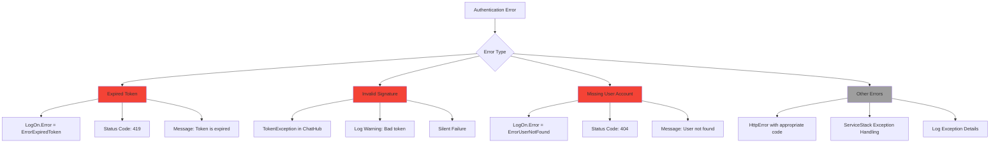
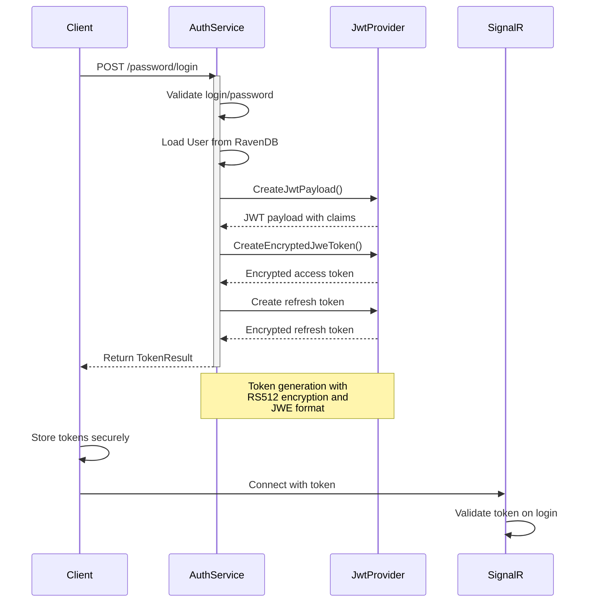

# Authentication

<cite>
**Referenced Files in This Document**   
- [ChatHub.cs](file://src/Unlimotion.Server/hubs/ChatHub.cs)
- [AppHost.cs](file://src/Unlimotion.Server/AppHost.cs)
- [AuthService.cs](file://src/Unlimotion.Server.ServiceInterface/AuthService.cs)
- [Auth.cs](file://src/Unlimotion.Server.ServiceModel/Auth.cs)
- [TaskService.cs](file://src/Unlimotion.Server.ServiceInterface/TaskService.cs)
- [LoginHistory.cs](file://src/Unlimotion.Server.ServiceModel/Molds/LoginHistory.cs)
- [UserLoginAudit.cs](file://src/Unlimotion.Server.ServiceModel/Molds/UserLoginAudit.cs)
- [LoginAudit.cs](file://src/Unlimotion.Server.ServiceModel/LoginAudit.cs)
- [User.cs](file://src/Unlimotion.Domain/User.cs)
- [IChatHub.cs](file://src/Unlimotion.Interface/IChatHub.cs)
- [LogOn.cs](file://src/Unlimotion.Interface/LogOn.cs)
- [TokenResult.cs](file://src/Unlimotion.Server.ServiceModel/Molds/TokenResult.cs)
</cite>

## Table of Contents
1. [Introduction](#introduction)
2. [Authentication Architecture](#authentication-architecture)
3. [JWT Token Workflow](#jwt-token-workflow)
4. [Login Process in ChatHub.Login](#login-process-in-chathublogin)
5. [User Session Management](#user-session-management)
6. [ServiceStack Integration](#servicestack-integration)
7. [User Audit Logging](#user-audit-logging)
8. [Error Handling](#error-handling)
9. [Token Generation and Client Implementation](#token-generation-and-client-implementation)
10. [Conclusion](#conclusion)

## Introduction
This document provides comprehensive documentation for Unlimotion's authentication system using JWT tokens. The system implements a secure authentication mechanism that integrates SignalR for real-time communication, ServiceStack for service endpoints, and RavenDB for data persistence. The authentication flow centers around JWT token validation, user session management, and comprehensive audit logging. This documentation details the complete authentication workflow, from token generation to session validation and error handling.

## Authentication Architecture
The Unlimotion authentication system follows a layered architecture that integrates multiple components to provide secure user authentication and authorization. The system leverages JWT tokens for stateless authentication, SignalR for real-time communication, and ServiceStack's authentication framework for service-level security.



**Diagram sources**
- [AppHost.cs](file://src/Unlimotion.Server/AppHost.cs)
- [ChatHub.cs](file://src/Unlimotion.Server/hubs/ChatHub.cs)
- [AuthService.cs](file://src/Unlimotion.Server.ServiceInterface/AuthService.cs)

**Section sources**
- [AppHost.cs](file://src/Unlimotion.Server/AppHost.cs)
- [ChatHub.cs](file://src/Unlimotion.Server/hubs/ChatHub.cs)
- [AuthService.cs](file://src/Unlimotion.Server.ServiceInterface/AuthService.cs)

## JWT Token Workflow
The JWT token workflow in Unlimotion follows a standard security pattern with additional encryption and session management features. The system generates encrypted JWT tokens (JWE) using RS512 algorithm and stores critical user information in the token payload.



**Diagram sources**
- [AuthService.cs](file://src/Unlimotion.Server.ServiceInterface/AuthService.cs#L157-L217)
- [ChatHub.cs](file://src/Unlimotion.Server/hubs/ChatHub.cs#L131-L162)

**Section sources**
- [AuthService.cs](file://src/Unlimotion.Server.ServiceInterface/AuthService.cs)
- [ChatHub.cs](file://src/Unlimotion.Server/hubs/ChatHub.cs)

## Login Process in ChatHub.Login
The ChatHub.Login method implements the core authentication workflow for SignalR connections. This method validates the JWT token, extracts user identity information, establishes the user session, and performs audit logging.



**Diagram sources**
- [ChatHub.cs](file://src/Unlimotion.Server/hubs/ChatHub.cs#L131-L220)

**Section sources**
- [ChatHub.cs](file://src/Unlimotion.Server/hubs/ChatHub.cs#L131-L220)

## User Session Management
User session information is stored in the SignalR connection context and used for authorization throughout the user's session. The system maintains user identity and session data in memory for the duration of the connection.

```mermaid
classDiagram
class ChatHub {
+Login(token, os, ip, clientVersion)
+OnDisconnectedAsync(exception)
+SaveTask(hubTask)
+UpdateMyDisplayName(name)
+DeleteTasks(idTasks)
}
class ConnectionContext {
+Items : Dictionary[string, object]
+ConnectionId : string
}
class SessionData {
+uid : string
+login : string
+session : string
+nickname : string
}
ChatHub --> ConnectionContext : "uses"
ConnectionContext --> SessionData : "contains"
note right of ChatHub
Manages SignalR hub methods
Validates JWT tokens
Establishes user sessions
end
note right of ConnectionContext
Stores session data in Items dictionary
Persists for connection duration
Accessible to all hub methods
end
note right of SessionData
uid : User ID from JWT sub claim
login : Username from JWT name claim
session : Unique session ID
nickname : Display name from User entity
end
```

**Diagram sources**
- [ChatHub.cs](file://src/Unlimotion.Server/hubs/ChatHub.cs#L131-L162)
- [IChatHub.cs](file://src/Unlimotion.Interface/IChatHub.cs)

**Section sources**
- [ChatHub.cs](file://src/Unlimotion.Server/hubs/ChatHub.cs)
- [IChatHub.cs](file://src/Unlimotion.Interface/IChatHub.cs)

## ServiceStack Integration
The authentication system integrates with ServiceStack's authentication framework to provide consistent security across HTTP API endpoints. The [Authenticate] attribute is used to protect service methods and ensure only authorized users can access them.



**Diagram sources**
- [TaskService.cs](file://src/Unlimotion.Server.ServiceInterface/TaskService.cs#L20-L30)
- [AuthService.cs](file://src/Unlimotion.Server.ServiceInterface/AuthService.cs#L61-L90)

**Section sources**
- [TaskService.cs](file://src/Unlimotion.Server.ServiceInterface/TaskService.cs)
- [AuthService.cs](file://src/Unlimotion.Server.ServiceInterface/AuthService.cs)

## User Audit Logging
The system implements comprehensive user audit logging that records operating system, IP address, client version, and session information upon each login. This information is stored in RavenDB for security monitoring and analysis.



**Diagram sources**
- [ChatHub.cs](file://src/Unlimotion.Server/hubs/ChatHub.cs#L191-L220)
- [UserLoginAudit.cs](file://src/Unlimotion.Server.ServiceModel/Molds/UserLoginAudit.cs)

**Section sources**
- [ChatHub.cs](file://src/Unlimotion.Server/hubs/ChatHub.cs#L191-L220)
- [UserLoginAudit.cs](file://src/Unlimotion.Server.ServiceModel/Molds/UserLoginAudit.cs)

## Error Handling
The authentication system implements comprehensive error handling for common authentication failures, including expired tokens, invalid signatures, and missing user accounts. Errors are communicated to clients through appropriate status codes and error messages.



**Diagram sources**
- [ChatHub.cs](file://src/Unlimotion.Server/hubs/ChatHub.cs#L191-L220)
- [LogOn.cs](file://src/Unlimotion.Interface/LogOn.cs)
- [AuthService.cs](file://src/Unlimotion.Server.ServiceInterface/AuthService.cs)

**Section sources**
- [ChatHub.cs](file://src/Unlimotion.Server/hubs/ChatHub.cs)
- [LogOn.cs](file://src/Unlimotion.Interface/LogOn.cs)
- [AuthService.cs](file://src/Unlimotion.Server.ServiceInterface/AuthService.cs)

## Token Generation and Client Implementation
The token generation process creates encrypted JWT tokens with appropriate claims and expiration times. Client applications must implement proper token management to maintain user sessions.



**Diagram sources**
- [AuthService.cs](file://src/Unlimotion.Server.ServiceInterface/AuthService.cs#L157-L217)
- [TokenResult.cs](file://src/Unlimotion.Server.ServiceModel/Molds/TokenResult.cs)

**Section sources**
- [AuthService.cs](file://src/Unlimotion.Server.ServiceInterface/AuthService.cs)
- [TokenResult.cs](file://src/Unlimotion.Server.ServiceModel/Molds/TokenResult.cs)

## Conclusion
The Unlimotion authentication system provides a robust and secure mechanism for user authentication using JWT tokens. The system integrates SignalR for real-time communication, ServiceStack for service-level security, and RavenDB for persistent storage of user and audit data. Key features include encrypted JWT tokens, comprehensive session management, detailed audit logging, and consistent error handling. The architecture ensures that user identity is securely maintained throughout the application, with proper authorization enforced at both the SignalR hub and service endpoint levels. This documentation provides a comprehensive overview of the authentication workflow, from token generation to session validation and error handling.