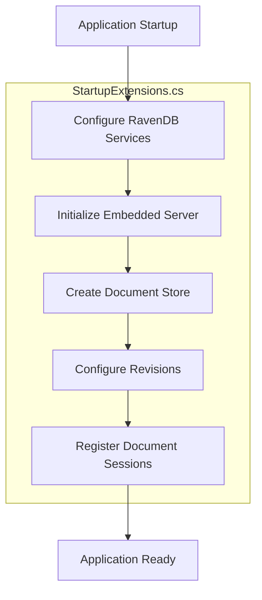
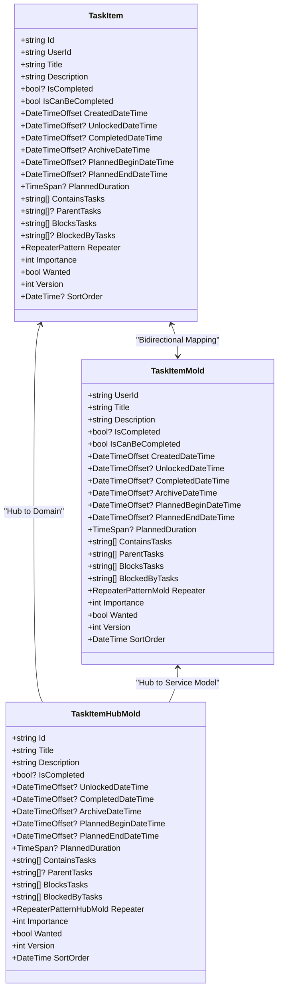
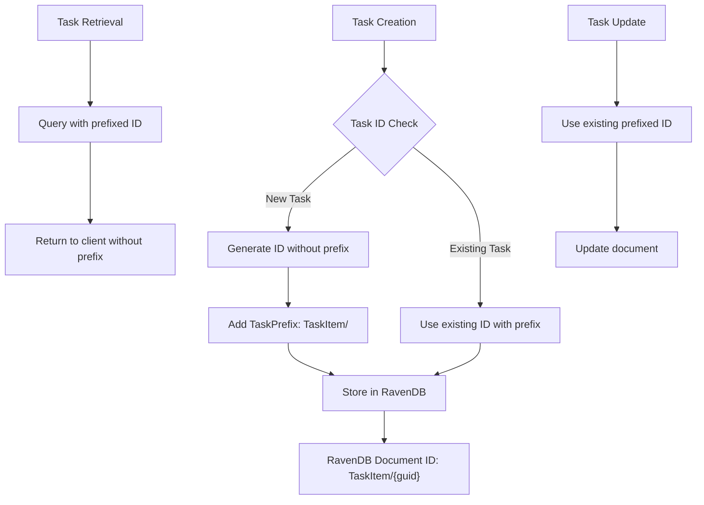
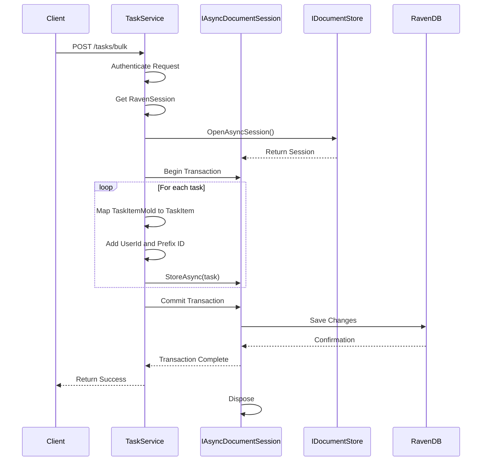
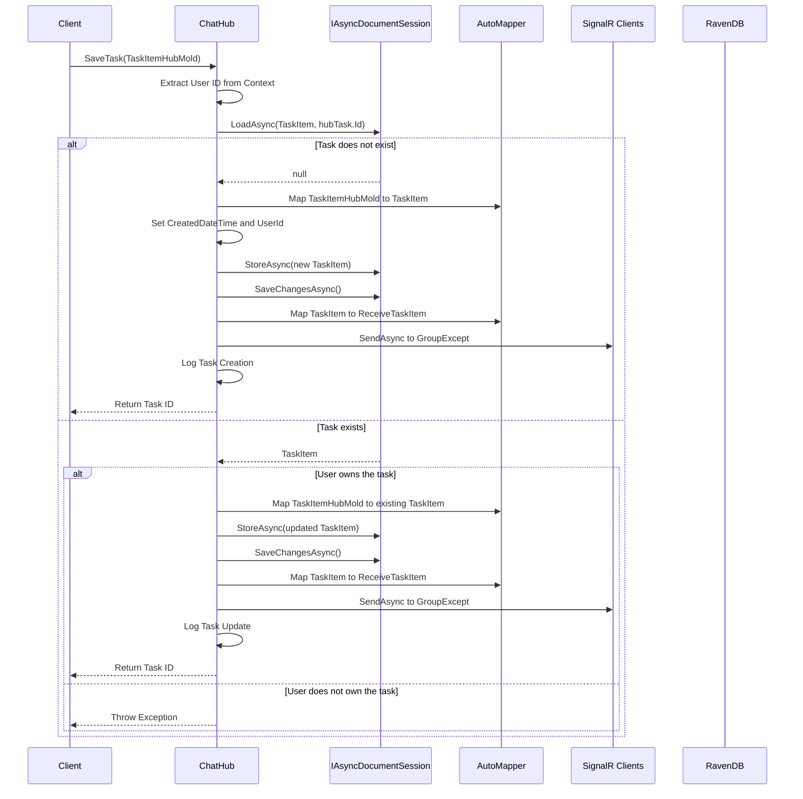
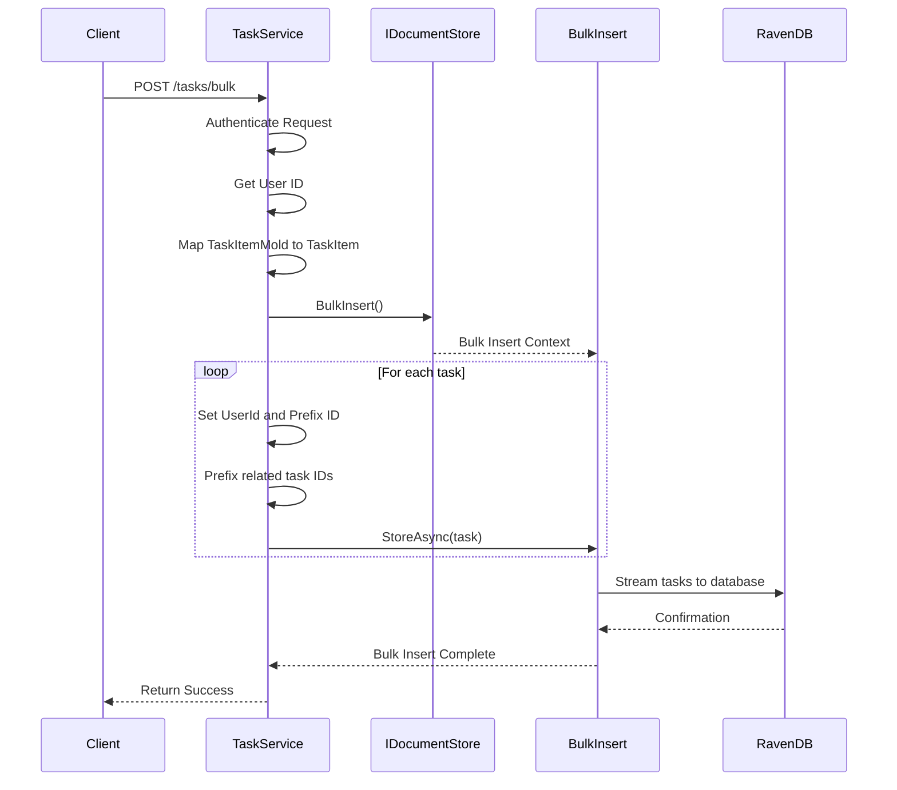
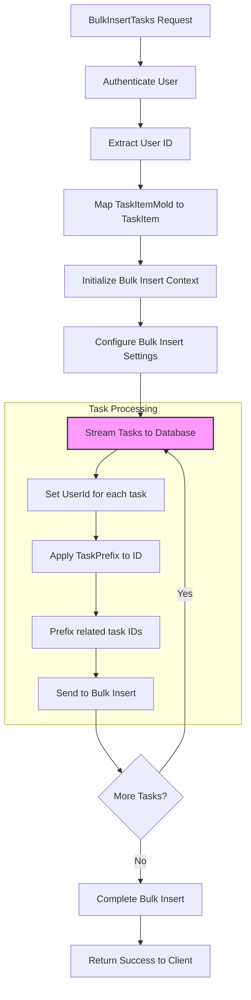
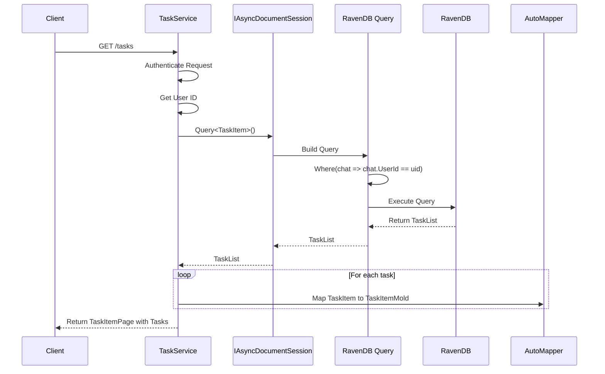
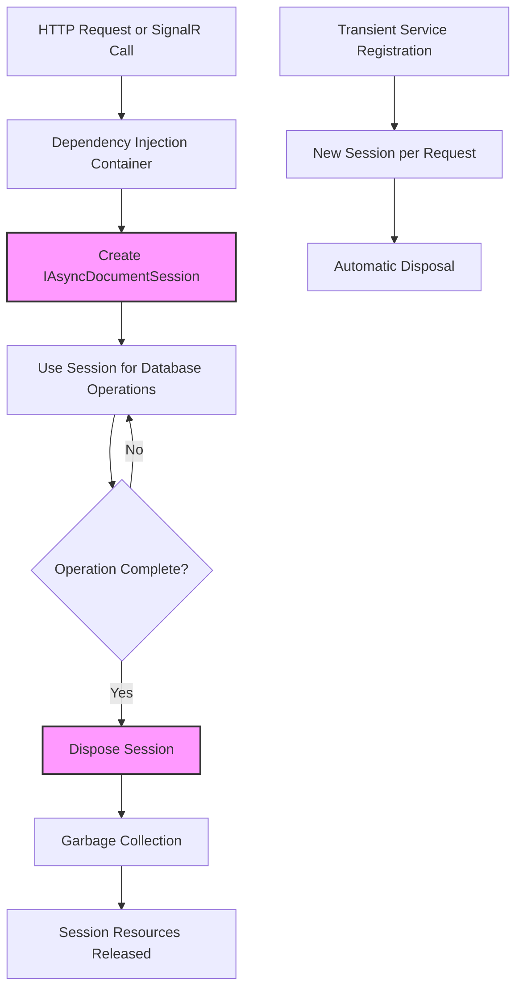
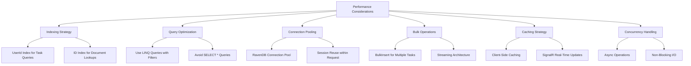

# Data Persistence

<cite>
**Referenced Files in This Document**   
- [ChatHub.cs](file://src/Unlimotion.Server/hubs/ChatHub.cs)
- [TaskService.cs](file://src/Unlimotion.Server.ServiceInterface/TaskService.cs)
- [TaskItem.cs](file://src/Unlimotion.Domain/TaskItem.cs)
- [TaskItemHubMold.cs](file://src/Unlimotion.Interface/TaskItemHubMold.cs)
- [TaskItemMold.cs](file://src/Unlimotion.Server.ServiceModel/Molds/Tasks/TaskItemMold.cs)
- [AppModelMapping.cs](file://src/Unlimotion.Server/AppModelMapping.cs)
- [StartupExtensions.cs](file://src/Unlimotion.Server/StartupExtensions.cs)
- [appsettings.json](file://src/Unlimotion.Server/appsettings.json)
</cite>

## Table of Contents
1. [Introduction](#introduction)
2. [RavenDB Configuration and Initialization](#ravendb-configuration-and-initialization)
3. [Data Model Mapping](#data-model-mapping)
4. [Task ID Prefixing Strategy](#task-id-prefixing-strategy)
5. [Document Session Management](#document-session-management)
6. [ChatHub.SaveTask Implementation](#chathubsavetask-implementation)
7. [TaskService.Post Implementation](#taskservicepost-implementation)
8. [Bulk Insert Operation](#bulk-insert-operation)
9. [Query Patterns in TaskService.Get](#query-patterns-in-taskserviceget)
10. [Transaction Management and Change Tracking](#transaction-management-and-change-tracking)
11. [Session Disposal Patterns](#session-disposal-patterns)
12. [Performance Considerations](#performance-considerations)
13. [Conclusion](#conclusion)

## Introduction
This document provides comprehensive documentation of the data persistence implementation in Unlimotion's server component, focusing on the RavenDB integration. The system employs a sophisticated data persistence architecture that handles task management through SignalR hubs and ServiceStack services. The documentation details the implementation of data persistence operations in the ChatHub.SaveTask and TaskService.Post methods, including document session management, asynchronous operations, and data model mapping between different representations of task entities. The system uses RavenDB as an embedded document database with specific patterns for task ID management, bulk operations, and query optimization. This documentation covers the complete data persistence workflow, from entity modeling and mapping to database operations and performance considerations.

## RavenDB Configuration and Initialization



**Diagram sources**
- [StartupExtensions.cs](file://src/Unlimotion.Server/StartupExtensions.cs#L0-L135)

**Section sources**
- [StartupExtensions.cs](file://src/Unlimotion.Server/StartupExtensions.cs#L0-L135)
- [appsettings.json](file://src/Unlimotion.Server/appsettings.json#L0-L45)
- [Program.cs](file://src/Unlimotion.Server/Program.cs#L0-L50)

The RavenDB configuration in Unlimotion is implemented through the StartupExtensions class, which sets up the embedded RavenDB server instance and configures the document store. The system uses RavenDB in embedded mode, allowing the database to run within the same process as the application without requiring a separate server installation. The configuration is initialized through the AddRavenDbServices extension method, which registers the necessary services in the dependency injection container. The database settings, including the database name, server URL, data directory, and logs path, are read from the appsettings.json configuration file. The system automatically creates the database if it doesn't exist and configures document revisions to maintain a history of changes with a minimum retention period of seven days. The document store is initialized during application startup, and both synchronous and asynchronous document sessions are registered as transient services, ensuring that each request gets a fresh session instance.

## Data Model Mapping



**Diagram sources**
- [TaskItem.cs](file://src/Unlimotion.Domain/TaskItem.cs#L0-L33)
- [TaskItemMold.cs](file://src/Unlimotion.Server.ServiceModel/Molds/Tasks/TaskItemMold.cs#L6-L53)
- [TaskItemHubMold.cs](file://src/Unlimotion.Interface/TaskItemHubMold.cs#L6-L27)
- [AppModelMapping.cs](file://src/Unlimotion.Server/AppModelMapping.cs#L0-L52)

**Section sources**
- [TaskItem.cs](file://src/Unlimotion.Domain/TaskItem.cs#L0-L33)
- [TaskItemMold.cs](file://src/Unlimotion.Server.ServiceModel/Molds/Tasks/TaskItemMold.cs#L6-L53)
- [TaskItemHubMold.cs](file://src/Unlimotion.Interface/TaskItemHubMold.cs#L6-L27)
- [AppModelMapping.cs](file://src/Unlimotion.Server/AppModelMapping.cs#L0-L52)

The Unlimotion system implements a layered data model architecture with three distinct representations of task entities: TaskItem (domain model), TaskItemMold (service model), and TaskItemHubMold (hub model). The domain model (TaskItem) represents the entity as it is stored in the RavenDB database, containing all properties including the UserId and CreatedDateTime. The service model (TaskItemMold) is used for API communication through ServiceStack, providing a structured representation of tasks with descriptive attributes. The hub model (TaskItemHubMold) is optimized for SignalR communication, containing properties relevant to real-time updates. AutoMapper is used to handle the mapping between these models, configured in the AppModelMapping class. The mapping configuration establishes bidirectional mapping between TaskItem and TaskItemMold, while the mapping from TaskItemHubMold to TaskItem ignores the UserId and CreatedDateTime properties, as these are set during the persistence operation. This layered approach allows for separation of concerns between data storage, API contracts, and real-time communication.

## Task ID Prefixing Strategy



**Diagram sources**
- [TaskService.cs](file://src/Unlimotion.Server.ServiceInterface/TaskService.cs#L0-L71)
- [TaskItem.cs](file://src/Unlimotion.Domain/TaskItem.cs#L0-L33)

**Section sources**
- [TaskService.cs](file://src/Unlimotion.Server.ServiceInterface/TaskService.cs#L0-L71)

The Unlimotion system implements a task ID prefixing strategy to organize documents within the RavenDB database. All task documents are stored with an ID that begins with the prefix "TaskItem/", followed by the actual task identifier. This prefixing strategy serves multiple purposes: it provides a clear namespace for task documents, enables efficient querying and indexing, and follows RavenDB's convention for document identification. When creating new tasks through the TaskService.Post method, the system automatically adds the "TaskItem/" prefix to each task ID before storing it in the database. For existing tasks, the system maintains the prefixed ID format. When retrieving tasks, the system queries using the prefixed ID format but returns the task to the client without the prefix for cleaner API responses. This strategy ensures that all task documents are consistently organized within the database while maintaining a clean interface for clients. The prefix is defined as a constant in the TaskService class, ensuring consistency across all operations.

## Document Session Management



**Diagram sources**
- [TaskService.cs](file://src/Unlimotion.Server.ServiceInterface/TaskService.cs#L0-L71)
- [StartupExtensions.cs](file://src/Unlimotion.Server/StartupExtensions.cs#L101-L104)

**Section sources**
- [TaskService.cs](file://src/Unlimotion.Server.ServiceInterface/TaskService.cs#L0-L71)
- [StartupExtensions.cs](file://src/Unlimotion.Server/StartupExtensions.cs#L74-L104)

Document session management in Unlimotion follows RavenDB's recommended patterns for efficient and safe database operations. The system uses IAsyncDocumentSession for all database operations, enabling non-blocking asynchronous calls that improve scalability and responsiveness. The document sessions are registered as transient services in the dependency injection container, ensuring that each request receives a new session instance. This approach prevents session state from leaking between requests and ensures proper isolation of database operations. The IAsyncDocumentSession is injected into services like TaskService and ChatHub through constructor injection, following the dependency inversion principle. Each session represents a unit of work, tracking changes to loaded entities and managing transactions implicitly. When SaveChangesAsync is called, the session commits all pending operations in a single transaction, ensuring data consistency. The session automatically handles connection pooling and manages the lifecycle of database connections, optimizing resource usage in high-concurrency scenarios.

## ChatHub.SaveTask Implementation



**Diagram sources**
- [ChatHub.cs](file://src/Unlimotion.Server/hubs/ChatHub.cs#L0-L238)

**Section sources**
- [ChatHub.cs](file://src/Unlimotion.Server/hubs/ChatHub.cs#L0-L238)

The ChatHub.SaveTask method implements the logic for creating and updating tasks through SignalR real-time communication. When a client calls SaveTask with a TaskItemHubMold object, the method first extracts the user ID from the SignalR context, which is set during the authentication process. The method then attempts to load the existing task from the RavenDB database using the provided task ID. If the task does not exist, a new TaskItem entity is created by mapping the TaskItemHubMold to the domain model, with the CreatedDateTime set to the current UTC time and the UserId set to the authenticated user's ID. The new task is then stored in the database within a transaction. If the task already exists, the method checks whether the authenticated user owns the task by comparing the UserId fields. If ownership is confirmed, the existing task is updated with the new values from the TaskItemHubMold, and the changes are saved to the database. After successfully saving the task, the method maps the TaskItem back to a ReceiveTaskItem object and broadcasts the update to all connected clients except the sender, enabling real-time synchronization across multiple clients. The method includes comprehensive error handling and logging to ensure reliability and traceability.

## TaskService.Post Implementation



**Diagram sources**
- [TaskService.cs](file://src/Unlimotion.Server.ServiceInterface/TaskService.cs#L0-L71)

**Section sources**
- [TaskService.cs](file://src/Unlimotion.Server.ServiceInterface/TaskService.cs#L0-L71)

The TaskService.Post method handles the bulk creation of tasks through the ServiceStack framework. This method is designed to efficiently process multiple task creations in a single request, optimizing performance for scenarios where many tasks need to be created simultaneously. The method is protected by the [Authenticate] attribute, ensuring that only authenticated users can create tasks. When invoked, the method first validates the user's authentication and extracts the user ID from the session. It then maps the collection of TaskItemMold objects from the request to TaskItem domain entities using AutoMapper. The core of the implementation uses RavenDB's BulkInsert functionality, which is specifically designed for high-performance insertion of large numbers of documents. The method creates a bulk insert context from the document store and streams each task to the database, setting the UserId and applying the "TaskItem/" prefix to each task ID. For tasks that have relationships with other tasks (via ContainsTasks or BlocksTasks), the method also prefixes the related task IDs to maintain consistency in the database. This approach minimizes the number of round-trips to the database and optimizes memory usage by streaming the data rather than holding all documents in memory simultaneously.

## Bulk Insert Operation



**Diagram sources**
- [TaskService.cs](file://src/Unlimotion.Server.ServiceInterface/TaskService.cs#L0-L71)

**Section sources**
- [TaskService.cs](file://src/Unlimotion.Server.ServiceInterface/TaskService.cs#L0-L71)

The bulk insert operation in TaskService.Post leverages RavenDB's BulkInsert API to efficiently handle the creation of multiple tasks in a single operation. This approach is significantly more performant than individual document inserts, especially when dealing with large numbers of tasks. The bulk insert process begins by creating a bulk insert context from the IDocumentStore, which establishes a direct streaming connection to the database. Each task from the request is processed individually: the UserId is set to the authenticated user's ID, the "TaskItem/" prefix is applied to the task's ID, and any related task IDs in the ContainsTasks and BlocksTasks collections are also prefixed to maintain referential integrity. The tasks are then streamed to the database one by one, with RavenDB buffering and optimizing the insertion process. This streaming approach minimizes memory consumption on the server, as tasks do not need to be held in memory simultaneously. The bulk insert operation is atomic at the database level, meaning that either all tasks are successfully inserted or the operation fails, ensuring data consistency. This implementation is particularly well-suited for scenarios such as importing tasks from external sources or synchronizing large task lists across devices.

## Query Patterns in TaskService.Get



**Diagram sources**
- [TaskService.cs](file://src/Unlimotion.Server.ServiceInterface/TaskService.cs#L0-L71)

**Section sources**
- [TaskService.cs](file://src/Unlimotion.Server.ServiceInterface/TaskService.cs#L0-L71)

The query patterns used in TaskService.Get follow RavenDB's LINQ-based querying approach to retrieve user-specific tasks efficiently. When a client requests tasks through the GetAllTasks endpoint, the method first authenticates the request and extracts the user ID from the session. It then constructs a LINQ query against the TaskItem collection, filtering results to include only tasks where the UserId matches the authenticated user's ID. This query pattern leverages RavenDB's indexing capabilities to quickly locate relevant documents without scanning the entire database. The query is executed asynchronously using FirstAsync or ToListAsync methods, ensuring that the operation does not block the server thread. The retrieved TaskItem entities are then mapped to TaskItemMold objects using AutoMapper, transforming the domain model into the service model suitable for API responses. The results are wrapped in a TaskItemPage object, which can be extended to support pagination in the future. This query pattern ensures data isolation between users, as each user can only access their own tasks, and leverages RavenDB's optimized query execution for high performance even with large datasets.

## Transaction Management and Change Tracking

```mermaid
classDiagram
class IAsyncDocumentSession {
+Task StoreAsync(T entity)
+Task Delete(T entity)
+Task SaveChangesAsync()
+T LoadAsync(string id)
+IAsyncDocumentQuery~T~ Query~T~()
}
class ChangeTracker {
+Entity[] AddedEntities
+Entity[] UpdatedEntities
+Entity[] DeletedEntities
+TrackEntity(Entity entity)
+DetectChanges()
}
class UnitOfWork {
+BeginTransaction()
+Commit()
+Rollback()
}
IAsyncDocumentSession --> ChangeTracker : "Implements"
IAsyncDocumentSession --> UnitOfWork : "Implements"
note right of IAsyncDocumentSession
RavenDB session automatically
tracks changes to loaded entities
and manages transactions
end
```

**Diagram sources**
- [ChatHub.cs](file://src/Unlimotion.Server/hubs/ChatHub.cs#L0-L238)
- [TaskService.cs](file://src/Unlimotion.Server.ServiceInterface/TaskService.cs#L0-L71)

**Section sources**
- [ChatHub.cs](file://src/Unlimotion.Server/hubs/ChatHub.cs#L0-L238)
- [TaskService.cs](file://src/Unlimotion.Server.ServiceInterface/TaskService.cs#L0-L71)

Transaction management and change tracking in Unlimotion are handled automatically by RavenDB's document session. The IAsyncDocumentSession implements a unit of work pattern, tracking all changes to entities loaded through the session and managing transactions implicitly. When entities are loaded using LoadAsync, the session begins tracking their state. Any modifications to these entities are detected when SaveChangesAsync is called, and the session automatically generates the appropriate database commands to persist the changes. The session ensures that all operations within a single SaveChangesAsync call are executed within a single transaction, providing atomicity and consistency. For new entities, the StoreAsync method marks them for insertion, while modifications to existing entities are detected through change tracking. The session also handles referential integrity and cascade operations as configured in the document store conventions. In the case of bulk operations, the BulkInsert API provides its own transaction semantics, ensuring that either all documents are inserted or the operation fails completely. This automatic transaction management reduces the complexity of data persistence code and helps prevent common data consistency issues.

## Session Disposal Patterns



**Diagram sources**
- [StartupExtensions.cs](file://src/Unlimotion.Server/StartupExtensions.cs#L101-L104)
- [ChatHub.cs](file://src/Unlimotion.Server/hubs/ChatHub.cs#L0-L238)
- [TaskService.cs](file://src/Unlimotion.Server.ServiceInterface/TaskService.cs#L0-L71)

**Section sources**
- [StartupExtensions.cs](file://src/Unlimotion.Server/StartupExtensions.cs#L101-L104)

The session disposal patterns in Unlimotion leverage the dependency injection container to manage the lifecycle of document sessions. The IAsyncDocumentSession is registered as a transient service, which means that a new instance is created for each request or SignalR invocation. This pattern ensures proper isolation between operations and prevents session state from leaking between requests. The dependency injection container automatically disposes of transient services at the end of each request scope, which triggers the disposal of the document session and releases associated resources such as database connections. In the case of the bulk insert operation, the using statement ensures that the bulk insert context is properly disposed even if an exception occurs, preventing resource leaks. This disposal pattern is critical for maintaining system stability and performance, especially in high-concurrency scenarios where many simultaneous operations might be accessing the database. The automatic disposal mechanism reduces the risk of memory leaks and ensures that database connections are returned to the pool promptly, maximizing the efficiency of connection reuse.

## Performance Considerations



**Diagram sources**
- [TaskService.cs](file://src/Unlimotion.Server.ServiceInterface/TaskService.cs#L0-L71)
- [ChatHub.cs](file://src/Unlimotion.Server/hubs/ChatHub.cs#L0-L238)
- [StartupExtensions.cs](file://src/Unlimotion.Server/StartupExtensions.cs#L0-L135)

**Section sources**
- [TaskService.cs](file://src/Unlimotion.Server.ServiceInterface/TaskService.cs#L0-L71)
- [ChatHub.cs](file://src/Unlimotion.Server/hubs/ChatHub.cs#L0-L238)
- [StartupExtensions.cs](file://src/Unlimotion.Server/StartupExtensions.cs#L0-L135)

The Unlimotion system incorporates several performance considerations to ensure efficient data persistence in high-concurrency scenarios. RavenDB's indexing capabilities are leveraged to optimize query performance, with automatic indexes created for commonly queried fields such as UserId and ID. The query patterns use targeted filtering to minimize the amount of data retrieved from the database, avoiding expensive full-collection scans. Connection pooling is handled automatically by RavenDB, reusing database connections to reduce the overhead of establishing new connections for each operation. The system uses asynchronous operations throughout, allowing the server to handle multiple requests concurrently without blocking threads on I/O operations. For bulk operations, the BulkInsert API streams data directly to the database, minimizing memory usage and maximizing throughput. The combination of SignalR for real-time updates and efficient querying reduces the need for frequent polling, lowering overall database load. These performance optimizations work together to ensure that the system can scale effectively to support many concurrent users while maintaining responsive performance.

## Conclusion
The data persistence implementation in Unlimotion's server component demonstrates a well-architected approach to managing task data using RavenDB as an embedded document database. The system effectively leverages RavenDB's features for document storage, indexing, and querying while implementing appropriate patterns for data modeling, mapping, and transaction management. The layered data model with TaskItem, TaskItemMold, and TaskItemHubMold provides clear separation of concerns between storage, API, and real-time communication layers. The use of AutoMapper for model transformation simplifies the code and reduces the potential for errors in data conversion. The task ID prefixing strategy organizes documents within the database namespace while maintaining clean client interfaces. Document session management follows best practices with proper lifecycle handling through dependency injection. The ChatHub.SaveTask and TaskService.Post methods demonstrate different approaches to data persistence—one optimized for real-time updates and the other for bulk operations—showcasing the flexibility of the architecture. The bulk insert operation using RavenDB's BulkInsert API provides high-performance data ingestion capabilities. Query patterns are optimized for user-specific data retrieval with proper filtering to ensure data isolation and performance. Transaction management and change tracking are handled automatically by RavenDB, reducing complexity in the application code. The session disposal patterns ensure proper resource management and prevent memory leaks. Performance considerations are addressed through indexing, asynchronous operations, connection pooling, and efficient bulk operations. Overall, the data persistence architecture in Unlimotion provides a robust, scalable, and maintainable foundation for task management with strong support for real-time collaboration and high-concurrency scenarios.