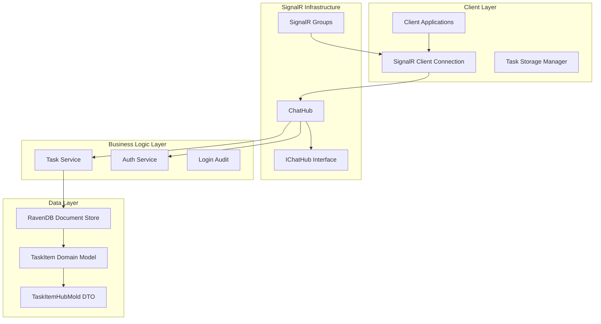
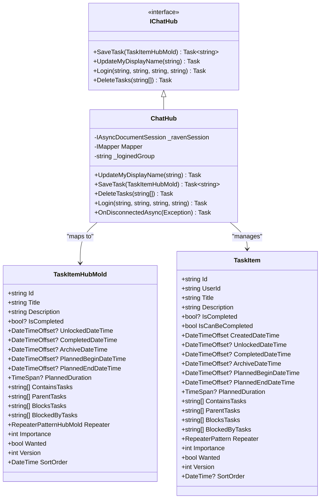
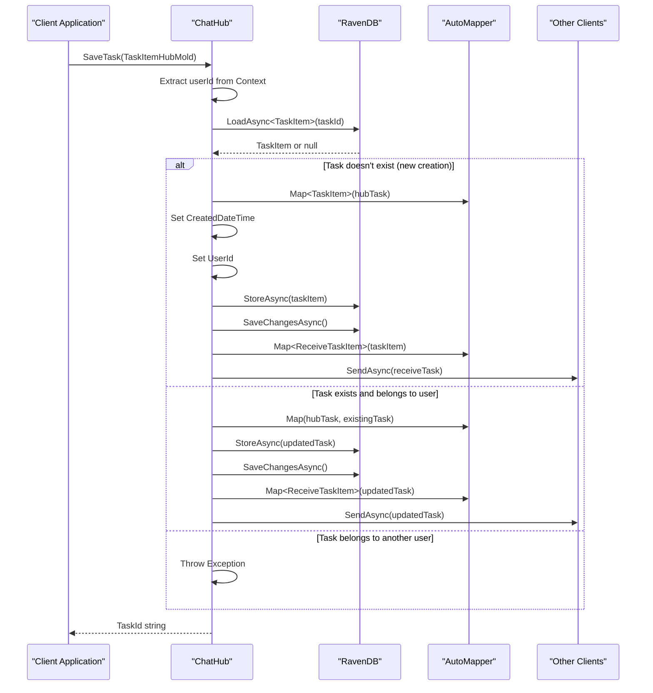
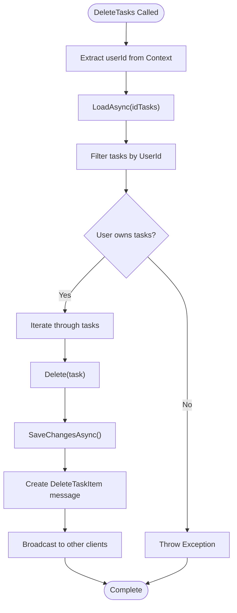
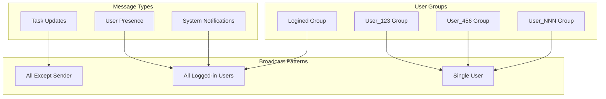
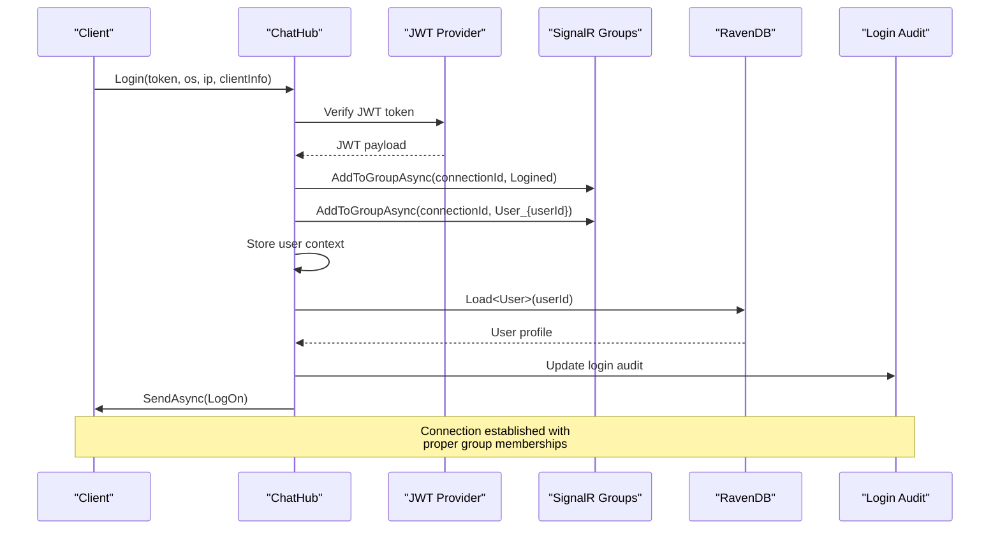
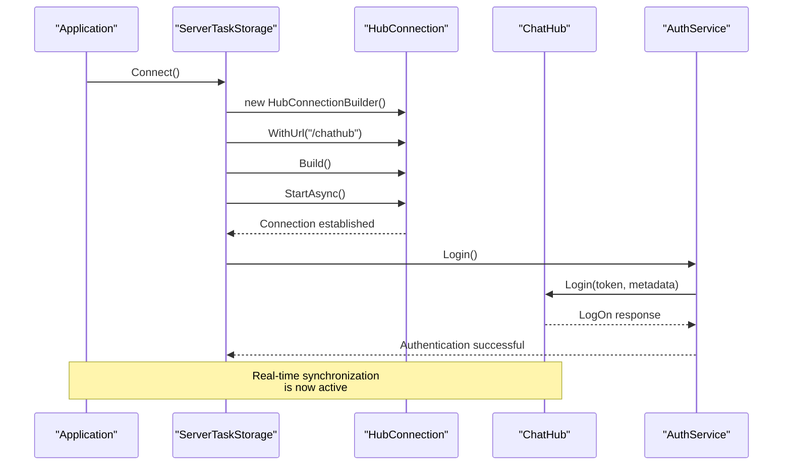
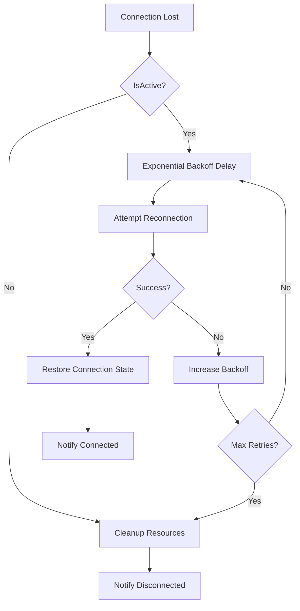

# Real-time Synchronization

<cite>
**Referenced Files in This Document**
- [IChatHub.cs](file://src/Unlimotion.Interface/IChatHub.cs)
- [ChatHub.cs](file://src/Unlimotion.Server/hubs/ChatHub.cs)
- [TaskItemHubMold.cs](file://src/Unlimotion.Interface/TaskItemHubMold.cs)
- [TaskItem.cs](file://src/Unlimotion.Domain/TaskItem.cs)
- [ReceiveTaskItem.cs](file://src/Unlimotion.Interface/ReceiveTaskItem.cs)
- [UpdateUserDisplayName.cs](file://src/Unlimotion.Interface/UpdateUserDisplayName.cs)
- [LogOn.cs](file://src/Unlimotion.Interface/LogOn.cs)
- [AppModelMapping.cs](file://src/Unlimotion.Server/AppModelMapping.cs)
- [Startup.cs](file://src/Unlimotion.Server/Startup.cs)
- [Program.cs](file://src/Unlimotion.Server/Program.cs)
- [ServerTaskStorage.cs](file://src/Unlimotion/ServerTaskStorage.cs)
- [TaskStorages.cs](file://src/Unlimotion/TaskStorages.cs)
</cite>

## Table of Contents
1. [Introduction](#introduction)
2. [System Architecture](#system-architecture)
3. [SignalR Hub Implementation](#signalr-hub-implementation)
4. [Data Model Mapping](#data-model-mapping)
5. [Real-time Operations](#real-time-operations)
6. [Connection Lifecycle Management](#connection-lifecycle-management)
7. [Client Subscription Patterns](#client-subscription-patterns)
8. [Error Handling and Resilience](#error-handling-and-resilience)
9. [Performance Considerations](#performance-considerations)
10. [Best Practices](#best-practices)

## Introduction

Unlimotion implements a sophisticated real-time synchronization system using SignalR to enable bidirectional communication between server and clients. The system facilitates instant updates across distributed clients through a centralized ChatHub that manages task synchronization, user presence, and real-time notifications.

The real-time synchronization architecture consists of:
- **SignalR ChatHub**: Centralized hub for bidirectional communication
- **Hub Models**: Lightweight DTOs for network transmission
- **Domain Models**: Rich domain objects for business logic
- **AutoMapper**: Seamless transformation between model layers
- **Group-based Messaging**: Targeted message delivery to specific user groups

## System Architecture

The real-time synchronization system follows a layered architecture that separates concerns between presentation, business logic, and data persistence:

**Diagram sources**
- [ChatHub.cs](file://src/Unlimotion.Server/hubs/ChatHub.cs#L18-L239)
- [IChatHub.cs](file://src/Unlimotion.Interface/IChatHub.cs#L7-L14)
- [Startup.cs](file://src/Unlimotion.Server/Startup.cs#L25-L35)

**Section sources**
- [ChatHub.cs](file://src/Unlimotion.Server/hubs/ChatHub.cs#L1-L239)
- [IChatHub.cs](file://src/Unlimotion.Interface/IChatHub.cs#L1-L15)

## SignalR Hub Implementation

### ChatHub Core Architecture

The ChatHub serves as the central coordinator for real-time communication, implementing the IChatHub interface to provide standardized methods for client-server interaction.

**Diagram sources**
- [IChatHub.cs](file://src/Unlimotion.Interface/IChatHub.cs#L7-L14)
- [ChatHub.cs](file://src/Unlimotion.Server/hubs/ChatHub.cs#L18-L239)
- [TaskItemHubMold.cs](file://src/Unlimotion.Interface/TaskItemHubMold.cs#L5-L29)
- [TaskItem.cs](file://src/Unlimotion.Domain/TaskItem.cs#L5-L32)

### SaveTask Method Implementation

The SaveTask method demonstrates the core real-time synchronization pattern, handling both creation and updates of task items while maintaining consistency across all connected clients.

**Diagram sources**
- [ChatHub.cs](file://src/Unlimotion.Server/hubs/ChatHub.cs#L44-L85)

The SaveTask implementation ensures:
- **Atomic Operations**: Database operations are wrapped in transaction-like semantics
- **Consistency**: Changes are propagated to all clients except the originating connection
- **Security**: User ownership verification prevents unauthorized modifications
- **Versioning**: Automatic version increment for conflict resolution

**Section sources**
- [ChatHub.cs](file://src/Unlimotion.Server/hubs/ChatHub.cs#L44-L85)

### DeleteTasks Method Implementation

The DeleteTasks method maintains system consistency by removing task references from both the database and client caches, ensuring all clients receive deletion notifications.

**Diagram sources**
- [ChatHub.cs](file://src/Unlimotion.Server/hubs/ChatHub.cs#L87-L120)

**Section sources**
- [ChatHub.cs](file://src/Unlimotion.Server/hubs/ChatHub.cs#L87-L120)

## Data Model Mapping

### AutoMapper Configuration

The system employs AutoMapper for seamless transformation between hub models and domain models, maintaining data integrity while enabling efficient serialization.

| Model Transformation | Direction | Purpose |
|---------------------|-----------|---------|
| TaskItemHubMold → TaskItem | Create/Update | Network transmission to domain conversion |
| TaskItem → TaskItemHubMold | Read/Query | Domain to network transmission conversion |
| TaskItem → ReceiveTaskItem | Real-time Updates | Server to client notification format |
| TaskItemHubMold → TaskItemMold | Service Layer | Service to domain model conversion |

The mapping configuration specifically handles:
- **Ignored Properties**: `UserId` and `CreatedDateTime` are excluded from hub-to-domain mapping
- **Reverse Mapping**: Bidirectional transformations for read/write operations
- **Collection Handling**: Proper collection initialization and management
- **Null Safety**: Graceful handling of nullable properties

**Section sources**
- [AppModelMapping.cs](file://src/Unlimotion.Server/AppModelMapping.cs#L25-L45)

### Hub Model Structure

TaskItemHubMold serves as the primary data transfer object for real-time synchronization, containing essential task properties optimized for network transmission:

- **Identification**: Unique task identifier and user association
- **Content**: Title, description, and completion status
- **Timeline**: Planning dates, duration, and temporal states
- **Hierarchy**: Parent-child relationships and containment links
- **Behavior**: Repeating patterns and importance indicators
- **Metadata**: Version tracking and sorting capabilities

**Section sources**
- [TaskItemHubMold.cs](file://src/Unlimotion.Interface/TaskItemHubMold.cs#L5-L29)

## Real-time Operations

### Group-Based Message Distribution

The system utilizes SignalR's grouping mechanism to enable targeted message delivery, reducing network overhead and improving scalability.

**Diagram sources**
- [ChatHub.cs](file://src/Unlimotion.Server/hubs/ChatHub.cs#L25-L26)
- [ChatHub.cs](file://src/Unlimotion.Server/hubs/ChatHub.cs#L133-L140)

### Message Broadcasting Patterns

The system implements several broadcasting patterns for different scenarios:

| Pattern | Use Case | Implementation |
|---------|----------|----------------|
| `Clients.GroupExcept()` | Task updates excluding sender | Prevents echo-back of own actions |
| `Clients.Group()` | User presence and system messages | Broadcasts to all logged-in users |
| `Clients.Users()` | Direct user notifications | Targeted messaging to specific connections |

**Section sources**
- [ChatHub.cs](file://src/Unlimotion.Server/hubs/ChatHub.cs#L70-L75)
- [ChatHub.cs](file://src/Unlimotion.Server/hubs/ChatHub.cs#L35-L42)

## Connection Lifecycle Management

### Authentication and Group Assignment

The Login method orchestrates the complete connection lifecycle, establishing user identity and appropriate group memberships.

**Diagram sources**
- [ChatHub.cs](file://src/Unlimotion.Server/hubs/ChatHub.cs#L142-L208)

### Connection Disconnection Handling

The OnDisconnectedAsync method ensures proper cleanup of group memberships and resource management when clients disconnect.

**Section sources**
- [ChatHub.cs](file://src/Unlimotion.Server/hubs/ChatHub.cs#L133-L140)
- [ChatHub.cs](file://src/Unlimotion.Server/hubs/ChatHub.cs#L142-L208)

## Client Subscription Patterns

### Connection Establishment

The client-side implementation demonstrates robust SignalR connection management with automatic reconnection and error handling.

**Diagram sources**
- [ServerTaskStorage.cs](file://src/Unlimotion/ServerTaskStorage.cs#L150-L250)

### Event Handler Registration

The RegisterHandlers method establishes subscription patterns for different message types, enabling reactive updates to the client interface.

| Message Type | Handler Purpose | Update Mechanism |
|-------------|----------------|------------------|
| `LogOn` | Authentication status | Connection state management |
| `ReceiveTaskItem` | Task updates | Real-time task synchronization |
| `DeleteTaskItem` | Task deletions | Local cache cleanup |

**Section sources**
- [ServerTaskStorage.cs](file://src/Unlimotion/ServerTaskStorage.cs#L290-L350)

### Client-Side Event Handling

The client implements comprehensive event handling for real-time updates:

- **Task Creation/Updates**: Immediate UI reflection of server changes
- **Task Deletions**: Automatic removal from local task collections
- **User Presence**: Real-time display of online users
- **Connection Status**: Graceful handling of connectivity issues

**Section sources**
- [ServerTaskStorage.cs](file://src/Unlimotion/ServerTaskStorage.cs#L290-L350)

## Error Handling and Resilience

### Connection Resilience

The system implements automatic reconnection mechanisms with exponential backoff and circuit breaker patterns to handle transient failures gracefully.

**Diagram sources**
- [ServerTaskStorage.cs](file://src/Unlimotion/ServerTaskStorage.cs#L270-L290)

### Error Recovery Strategies

The system employs multiple error recovery strategies:

- **Token Refresh**: Automatic JWT token renewal during connection establishment
- **Graceful Degradation**: Fallback to cached data when server is unavailable
- **State Synchronization**: Full state refresh upon reconnection
- **Conflict Resolution**: Version-based conflict detection and resolution

**Section sources**
- [ServerTaskStorage.cs](file://src/Unlimotion/ServerTaskStorage.cs#L350-L400)

## Performance Considerations

### Scalability Optimizations

The real-time synchronization system incorporates several performance optimizations:

- **Group-based Broadcasting**: Reduces message overhead by targeting specific user subsets
- **Selective Updates**: Uses `GroupsExcept` to prevent unnecessary message propagation
- **Connection Pooling**: Efficient management of SignalR connections
- **Lazy Loading**: Deferred loading of task dependencies

### Memory Management

- **Weak References**: Proper disposal of event handlers and subscriptions
- **Connection Caching**: Reuse of established connections when possible
- **Garbage Collection**: Explicit cleanup of disconnected resources

### Network Efficiency

- **Compression**: Automatic compression of large message payloads
- **Batching**: Grouping of related operations for reduced round trips
- **Heartbeat Monitoring**: Proactive detection of stale connections

## Best Practices

### Security Considerations

- **User Ownership Verification**: All operations validate user ownership before execution
- **JWT Token Validation**: Comprehensive token verification and expiration checking
- **Secure Communication**: TLS encryption for all SignalR communications
- **Rate Limiting**: Protection against abuse through connection limits

### Development Guidelines

- **Interface Segregation**: Clear separation between hub methods and implementation
- **Dependency Injection**: Proper service registration and lifecycle management
- **Unit Testing**: Comprehensive test coverage for hub methods and client handlers
- **Documentation**: Inline documentation for complex business logic

### Operational Excellence

- **Monitoring**: Comprehensive logging and metrics collection
- **Health Checks**: Regular connection health monitoring
- **Alerting**: Proactive notification of connection issues
- **Maintenance**: Scheduled cleanup of stale connections and groups

The Unlimotion real-time synchronization system demonstrates enterprise-grade architecture with robust error handling, efficient resource utilization, and seamless user experience across distributed clients.