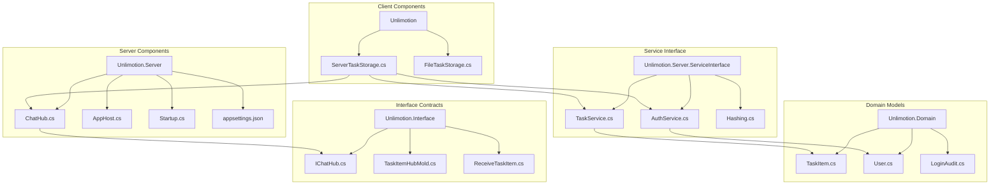
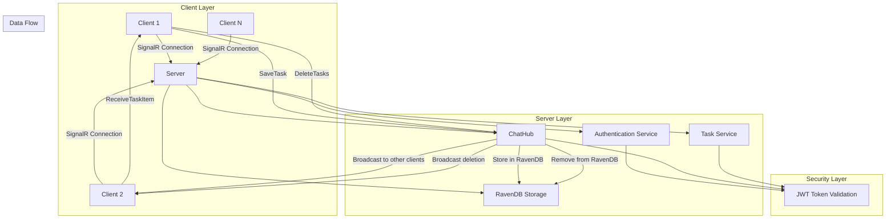
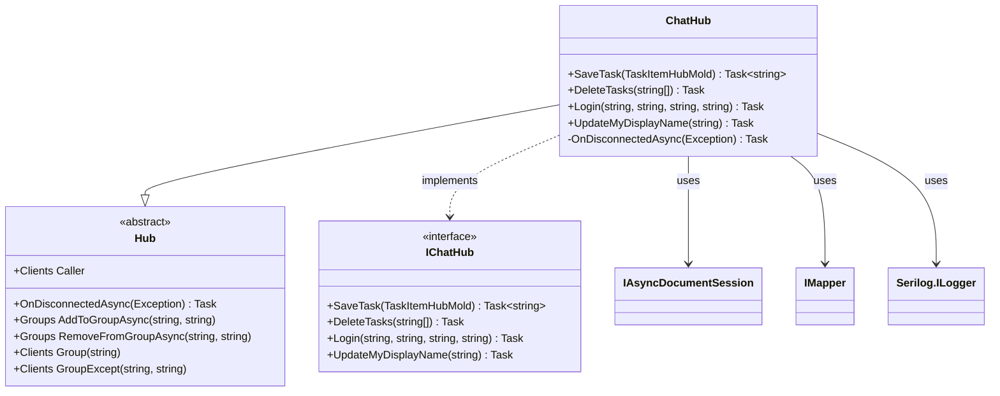
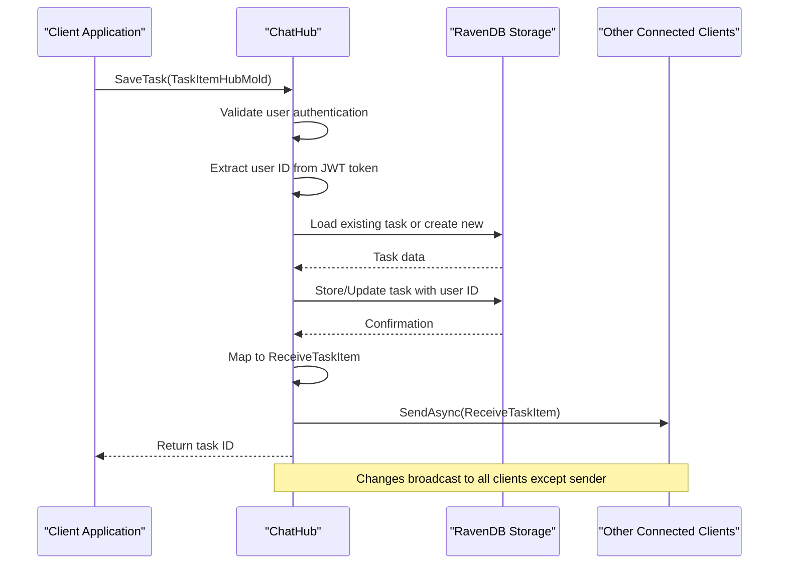
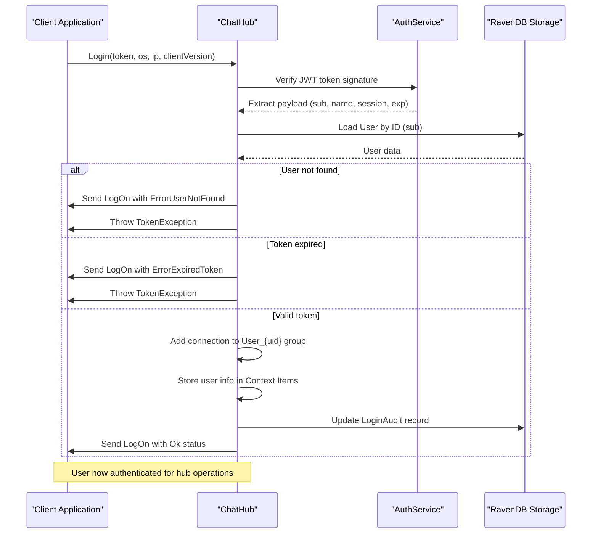
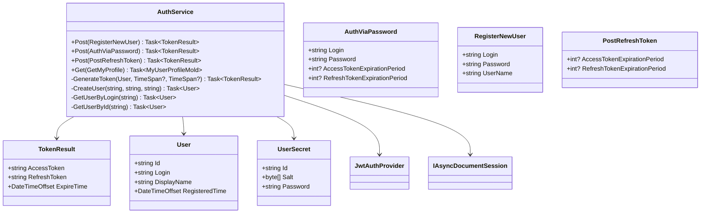
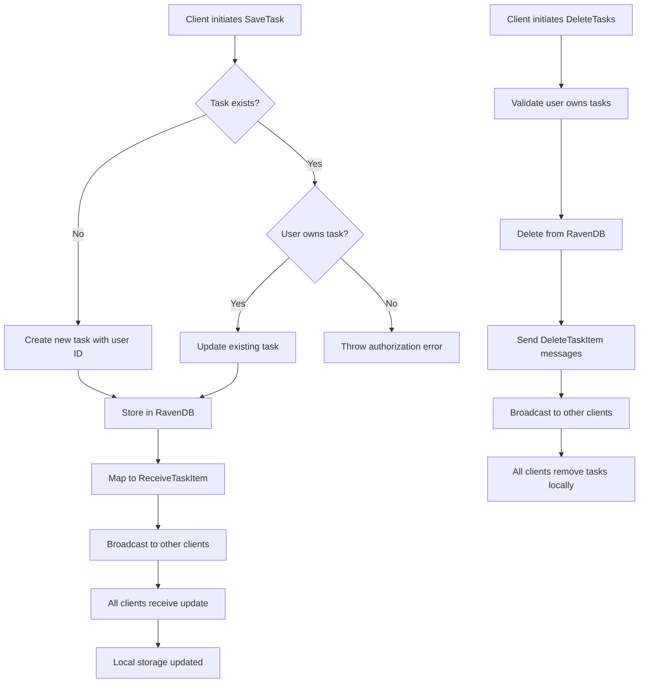
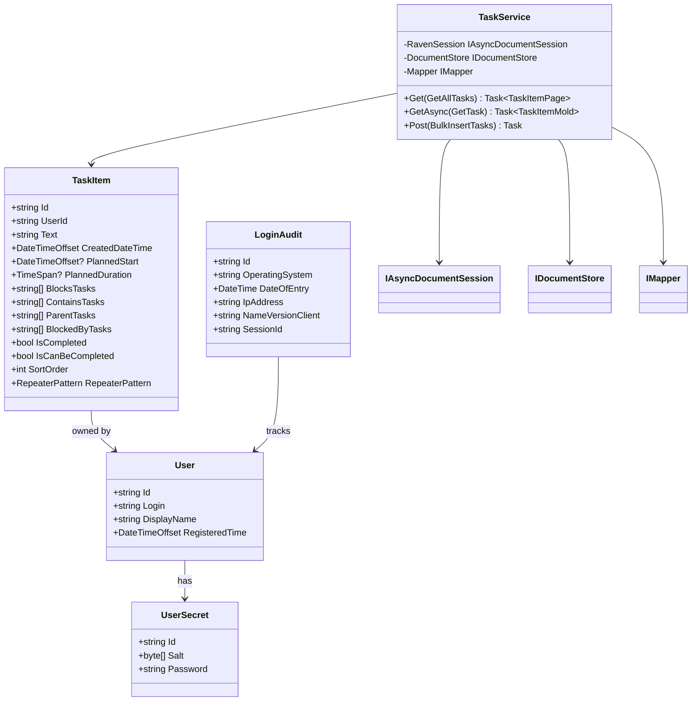
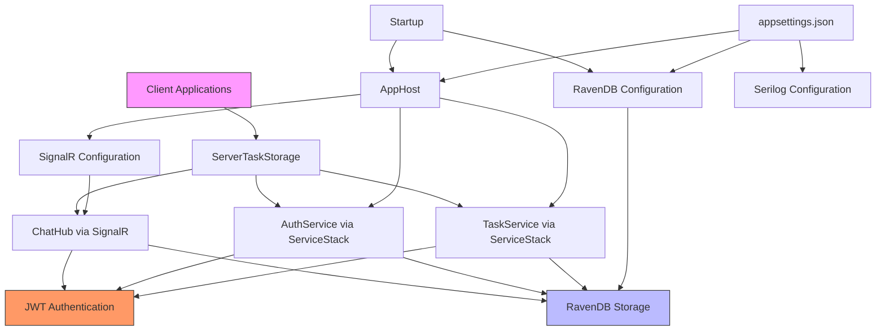

# Server Connection

<cite>
**Referenced Files in This Document**   
- [ChatHub.cs](file://src/Unlimotion.Server/hubs/ChatHub.cs)
- [IChatHub.cs](file://src/Unlimotion.Interface/IChatHub.cs)
- [AuthService.cs](file://src/Unlimotion.Server.ServiceInterface/AuthService.cs)
- [TaskService.cs](file://src/Unlimotion.Server.ServiceInterface/TaskService.cs)
- [ServerTaskStorage.cs](file://src/Unlimotion/ServerTaskStorage.cs)
- [AppHost.cs](file://src/Unlimotion.Server/AppHost.cs)
- [Startup.cs](file://src/Unlimotion.Server/Startup.cs)
- [appsettings.json](file://src/Unlimotion.Server/appsettings.json)
- [TaskItem.cs](file://src/Unlimotion.Domain/TaskItem.cs)
- [User.cs](file://src/Unlimotion.Domain/User.cs)
</cite>

## Table of Contents
1. [Introduction](#introduction)
2. [Project Structure](#project-structure)
3. [Core Components](#core-components)
4. [Architecture Overview](#architecture-overview)
5. [Detailed Component Analysis](#detailed-component-analysis)
6. [Dependency Analysis](#dependency-analysis)
7. [Performance Considerations](#performance-considerations)
8. [Troubleshooting Guide](#troubleshooting-guide)
9. [Conclusion](#conclusion)

## Introduction
This document provides comprehensive documentation for Unlimotion's server connection and centralized storage capabilities. It explains how the SignalR-based ChatHub facilitates real-time synchronization between multiple clients using the IChatHub interface. The document details the authentication process using JWT tokens, including login workflow, session management, and user identification. It covers the task synchronization mechanism where SaveTask and DeleteTasks methods propagate changes across connected clients, the RavenDB backend storage implementation, and data persistence patterns. The document also explains how client-server communication is secured and how connection state is managed during network interruptions.

## Project Structure
The Unlimotion project follows a modular architecture with distinct components for server, client, domain models, and services. The server component is implemented using ASP.NET Core with SignalR for real-time communication, while the client components are built using Avalonia UI framework. The solution is organized into multiple projects that separate concerns and enable independent development and testing.

**Diagram sources**
- [ChatHub.cs](file://src/Unlimotion.Server/hubs/ChatHub.cs)
- [AuthService.cs](file://src/Unlimotion.Server.ServiceInterface/AuthService.cs)
- [TaskService.cs](file://src/Unlimotion.Server.ServiceInterface/TaskService.cs)
- [ServerTaskStorage.cs](file://src/Unlimotion/ServerTaskStorage.cs)
- [TaskItem.cs](file://src/Unlimotion.Domain/TaskItem.cs)
- [User.cs](file://src/Unlimotion.Domain/User.cs)

**Section sources**
- [ChatHub.cs](file://src/Unlimotion.Server/hubs/ChatHub.cs)
- [AuthService.cs](file://src/Unlimotion.Server.ServiceInterface/AuthService.cs)
- [TaskService.cs](file://src/Unlimotion.Server.ServiceInterface/TaskService.cs)
- [ServerTaskStorage.cs](file://src/Unlimotion/ServerTaskStorage.cs)

## Core Components
The core components of Unlimotion's server connection system include the ChatHub for real-time communication, AuthService for user authentication, TaskService for task management, and ServerTaskStorage for client-side task storage operations. These components work together to provide a seamless real-time synchronization experience across multiple clients connected to the same server instance.

The system uses SignalR for bidirectional communication between clients and server, with RavenDB serving as the persistent storage backend. JWT tokens are used for secure authentication and authorization, ensuring that only authorized users can access and modify their data.

**Section sources**
- [ChatHub.cs](file://src/Unlimotion.Server/hubs/ChatHub.cs)
- [AuthService.cs](file://src/Unlimotion.Server.ServiceInterface/AuthService.cs)
- [TaskService.cs](file://src/Unlimotion.Server.ServiceInterface/TaskService.cs)
- [ServerTaskStorage.cs](file://src/Unlimotion/ServerTaskStorage.cs)

## Architecture Overview
Unlimotion's architecture follows a client-server model with real-time synchronization capabilities. The server acts as the central hub for data storage and synchronization, while clients connect to the server to retrieve and update data. The architecture is designed to support multiple concurrent clients, with changes made by one client being immediately propagated to all other connected clients.

**Diagram sources**
- [ChatHub.cs](file://src/Unlimotion.Server/hubs/ChatHub.cs)
- [AuthService.cs](file://src/Unlimotion.Server.ServiceInterface/AuthService.cs)
- [TaskService.cs](file://src/Unlimotion.Server.ServiceInterface/TaskService.cs)
- [appsettings.json](file://src/Unlimotion.Server/appsettings.json)

## Detailed Component Analysis

### ChatHub Analysis
The ChatHub component is the central piece of Unlimotion's real-time synchronization system. It implements the IChatHub interface and extends the SignalR Hub class to provide real-time communication capabilities between the server and connected clients.

#### SignalR Hub Implementation

**Diagram sources**
- [ChatHub.cs](file://src/Unlimotion.Server/hubs/ChatHub.cs)
- [IChatHub.cs](file://src/Unlimotion.Interface/IChatHub.cs)

#### Real-time Synchronization Flow

**Diagram sources**
- [ChatHub.cs](file://src/Unlimotion.Server/hubs/ChatHub.cs)

### Authentication Process Analysis
The authentication system in Unlimotion is built on JWT tokens and ServiceStack's authentication framework. It provides secure user identification and session management for both the API endpoints and SignalR hub connections.

#### Authentication Workflow

**Diagram sources**
- [ChatHub.cs](file://src/Unlimotion.Server/hubs/ChatHub.cs)
- [AuthService.cs](file://src/Unlimotion.Server.ServiceInterface/AuthService.cs)

#### JWT Token Management

**Diagram sources**
- [AuthService.cs](file://src/Unlimotion.Server.ServiceInterface/AuthService.cs)
- [User.cs](file://src/Unlimotion.Domain/User.cs)

### Task Synchronization Mechanism
The task synchronization system ensures that changes made by one client are immediately propagated to all other connected clients, maintaining data consistency across the distributed system.

#### Task Synchronization Flow

**Diagram sources**
- [ChatHub.cs](file://src/Unlimotion.Server/hubs/ChatHub.cs)

### RavenDB Backend Storage
The RavenDB implementation provides persistent storage for all application data, including tasks, users, and audit logs. The embedded server configuration allows for easy deployment and management.

#### Data Persistence Pattern

**Diagram sources**
- [TaskService.cs](file://src/Unlimotion.Server.ServiceInterface/TaskService.cs)
- [TaskItem.cs](file://src/Unlimotion.Domain/TaskItem.cs)
- [User.cs](file://src/Unlimotion.Domain/User.cs)

## Dependency Analysis
The Unlimotion server connection system has a well-defined dependency structure that separates concerns and enables modular development and testing.

**Diagram sources**
- [AppHost.cs](file://src/Unlimotion.Server/AppHost.cs)
- [Startup.cs](file://src/Unlimotion.Server/Startup.cs)
- [appsettings.json](file://src/Unlimotion.Server/appsettings.json)

**Section sources**
- [AppHost.cs](file://src/Unlimotion.Server/AppHost.cs)
- [Startup.cs](file://src/Unlimotion.Server/Startup.cs)
- [appsettings.json](file://src/Unlimotion.Server/appsettings.json)

## Performance Considerations
The Unlimotion server connection system is designed with performance and scalability in mind. The use of RavenDB as an embedded document database provides efficient data storage and retrieval, while SignalR enables real-time communication with minimal latency.

The system implements connection grouping to optimize message broadcasting, ensuring that updates are only sent to relevant clients. The JWT-based authentication system minimizes database queries during the authentication process by validating tokens cryptographically.

The task synchronization mechanism is optimized to reduce database round-trips by batching operations where possible. The client-side ServerTaskStorage implements connection resilience with automatic reconnection logic, ensuring that temporary network interruptions do not disrupt the user experience.

## Troubleshooting Guide
This section provides guidance for common issues that may occur when connecting to the Unlimotion server or using its synchronization features.

### Authentication Failures
Authentication failures can occur due to several reasons:
- Invalid or expired JWT tokens
- User not found in the database
- Incorrect token signature
- Network issues during token validation

When authentication fails, clients should implement retry logic with token refresh capabilities. The ServerTaskStorage class includes built-in handling for token expiration by automatically requesting new tokens when the current one expires.

### Network Timeouts
Network timeouts can occur during periods of high latency or server unavailability. The client implementation includes connection resilience features:
- Automatic reconnection attempts with exponential backoff
- Connection state monitoring
- Error event propagation for application-level handling

Clients should listen to the OnConnectionError and OnDisconnected events to provide appropriate user feedback during network issues.

### Data Consistency Problems
Data consistency issues may arise when multiple clients attempt to modify the same task simultaneously. The server implementation includes basic conflict detection by verifying that the user owns the task before allowing modifications.

To minimize conflicts:
- Ensure proper user authentication and authorization
- Implement client-side optimistic concurrency control
- Use the task's UserId field to verify ownership
- Handle exceptions gracefully when conflicts occur

### Configuration Issues
Common configuration problems include:
- Incorrect server URL in client settings
- Missing or invalid JWT private key in server configuration
- RavenDB storage path permissions
- Firewall blocking SignalR connections

Ensure that the appsettings.json file contains valid configuration values, particularly for the Security:PrivateKeyXml and RavenDb sections.

**Section sources**
- [ServerTaskStorage.cs](file://src/Unlimotion/ServerTaskStorage.cs)
- [ChatHub.cs](file://src/Unlimotion.Server/hubs/ChatHub.cs)
- [AuthService.cs](file://src/Unlimotion.Server.ServiceInterface/AuthService.cs)
- [appsettings.json](file://src/Unlimotion.Server/appsettings.json)

## Conclusion
Unlimotion's server connection and centralized storage system provides a robust foundation for real-time task synchronization across multiple clients. The architecture combines SignalR for real-time communication, RavenDB for persistent storage, and JWT for secure authentication, creating a scalable and reliable system.

The system's design emphasizes connection resilience, data consistency, and security, making it suitable for collaborative task management applications. The clear separation of concerns between client and server components enables independent development and testing, while the well-defined interfaces ensure compatibility across different client implementations.

By following the patterns and practices documented here, developers can effectively implement, maintain, and troubleshoot the Unlimotion server connection system, ensuring a seamless user experience across all connected clients.