# Telegram Bot Integration

<cite>
**Referenced Files in This Document**   
- [Bot.cs](file://src/Unlimotion.TelegramBot/Bot.cs)
- [Program.cs](file://src/Unlimotion.TelegramBot/Program.cs)
- [appsettings.json](file://src/Unlimotion.TelegramBot/appsettings.json)
- [TaskService.cs](file://src/Unlimotion.TelegramBot/TaskService.cs)
- [GitService.cs](file://src/Unlimotion.TelegramBot/GitService.cs)
- [GitSettings.cs](file://src/Unlimotion.TelegramBot/GitSettings.cs)
</cite>

## Table of Contents
1. [Introduction](#introduction)
2. [Project Structure](#project-structure)
3. [Core Components](#core-components)
4. [Architecture Overview](#architecture-overview)
5. [Detailed Component Analysis](#detailed-component-analysis)
6. [Dependency Analysis](#dependency-analysis)
7. [Performance Considerations](#performance-considerations)
8. [Troubleshooting Guide](#troubleshooting-guide)
9. [Conclusion](#conclusion)

## Introduction
The Telegram Bot integration in the Unlimotion system provides a messaging interface for task management through Telegram. Users can search, view, and manage tasks using simple commands. The bot integrates with a Git-based backup system for data persistence and synchronization. This documentation details the implementation of command handling, callback processing, message routing, configuration management, and interaction with core services.

## Project Structure
The Telegram Bot functionality is contained within the `Unlimotion.TelegramBot` project, which includes the main Bot class, supporting services, and configuration files. The bot operates as a standalone application that connects to the main Unlimotion task storage system.


**Diagram sources**
- [Bot.cs](file://src/Unlimotion.TelegramBot/Bot.cs)
- [Program.cs](file://src/Unlimotion.TelegramBot/Program.cs)
- [appsettings.json](file://src/Unlimotion.TelegramBot/appsettings.json)

**Section sources**
- [Bot.cs](file://src/Unlimotion.TelegramBot/Bot.cs)
- [Program.cs](file://src/Unlimotion.TelegramBot/Program.cs)

## Core Components
The Telegram Bot system consists of several core components that work together to provide task management functionality through Telegram. The main components include the Bot class for handling Telegram interactions, TaskService for accessing task data, GitService for version control integration, and configuration management through appsettings.json.

**Section sources**
- [Bot.cs](file://src/Unlimotion.TelegramBot/Bot.cs)
- [TaskService.cs](file://src/Unlimotion.TelegramBot/TaskService.cs)
- [GitService.cs](file://src/Unlimotion.TelegramBot/GitService.cs)

## Architecture Overview
The Telegram Bot architecture follows a service-oriented design with clear separation of concerns. The Bot class handles all Telegram API interactions, delegating data operations to specialized services. The system uses event-driven programming for message and callback handling, with periodic timers for automated Git synchronization.


**Diagram sources**
- [Bot.cs](file://src/Unlimotion.TelegramBot/Bot.cs)
- [TaskService.cs](file://src/Unlimotion.TelegramBot/TaskService.cs)
- [GitService.cs](file://src/Unlimotion.TelegramBot/GitService.cs)

## Detailed Component Analysis

### Bot Class Analysis
The Bot class is the central component of the Telegram integration, responsible for handling all interactions with the Telegram API. It processes incoming messages and callback queries, manages user states, and coordinates with other services.

#### Command Handling Implementation
The bot implements a command-based interface with specific handlers for different commands. The command processing flow is implemented in the `OnMessageReceived` method, which parses incoming text messages and routes them to appropriate handlers.


**Diagram sources**
- [Bot.cs](file://src/Unlimotion.TelegramBot/Bot.cs#L150-L250)

#### Callback Query Processing
The bot uses callback queries to handle interactions with inline keyboards. The `OnCallbackQueryReceived` method processes these callbacks, enabling users to navigate task hierarchies, toggle task states, and perform other actions without typing commands.


**Diagram sources**
- [Bot.cs](file://src/Unlimotion.TelegramBot/Bot.cs#L350-L450)

#### Message Routing and State Management
The bot implements a state management system to handle multi-step operations like task creation. User states are stored in a dictionary keyed by user ID, allowing the bot to remember context between messages.

```mermaid
classDiagram
class Bot {
-Dictionary<long, string> _userStates
-const string CreateSub = "createSub_"
-const string CreateSib = "createSib_"
+static async Task StartAsync(IConfigurationRoot)
+private static async void OnMessageReceived(object, MessageEventArgs)
+private static async Task<bool> HandleUserState(Message)
+private static async void OnCallbackQueryReceived(object, CallbackQueryEventArgs)
}
class TaskService {
-ITaskStorage storage
+TaskItemViewModel GetTask(string)
+List<TaskItemViewModel> SearchTasks(string)
+IEnumerable<TaskItemViewModel> RootTasks()
+void DeleteTask(string)
}
class GitService {
-GitSettings settings
-CredentialsHandler credentialsProvider
+void CloneOrUpdateRepo()
+void PullLatestChanges()
+void CommitAndPushChanges(string)
}
Bot --> TaskService : "uses"
Bot --> GitService : "uses"
Bot --> "Configuration" : "reads"
```

**Diagram sources**
- [Bot.cs](file://src/Unlimotion.TelegramBot/Bot.cs)
- [TaskService.cs](file://src/Unlimotion.TelegramBot/TaskService.cs)
- [GitService.cs](file://src/Unlimotion.TelegramBot/GitService.cs)

**Section sources**
- [Bot.cs](file://src/Unlimotion.TelegramBot/Bot.cs)
- [TaskService.cs](file://src/Unlimotion.TelegramBot/TaskService.cs)
- [GitService.cs](file://src/Unlimotion.TelegramBot/GitService.cs)

### Initialization Process Analysis
The bot initialization process sets up all required components and starts the message processing loop. The `StartAsync` method handles configuration loading, service initialization, and timer setup.

#### Startup Sequence
The startup sequence ensures all components are properly initialized before the bot begins receiving messages.


**Diagram sources**
- [Bot.cs](file://src/Unlimotion.TelegramBot/Bot.cs#L50-L100)
- [Program.cs](file://src/Unlimotion.TelegramBot/Program.cs)

**Section sources**
- [Bot.cs](file://src/Unlimotion.TelegramBot/Bot.cs#L50-L150)
- [Program.cs](file://src/Unlimotion.TelegramBot/Program.cs)

### Task Display and Interaction
The bot provides rich task displays with emoji indicators and interactive inline keyboards. Task information is formatted with status indicators and relationships.

#### Task Display Formatting
Tasks are displayed with visual indicators for status, completion ability, and importance. The formatting includes emoji indicators for task state.

```mermaid
flowchart TD
Start[ShowTask Execution] --> FormatTitle["Format Title with Emoji"]
FormatTitle --> CheckLock{"IsCanBeCompleted?"}
CheckLock --> |No| AddLock["Prefix with 🔒"]
CheckLock --> |Yes| NoLock["No prefix"]
AddLock --> AddStatus["Add Status Emoji"]
NoLock --> AddStatus
AddStatus --> AddWanted["Add Wanted indicators (*)"]
AddWanted --> AddMetadata["Add ID, Dates, Duration"]
AddMetadata --> BuildKeyboard["Create Inline Keyboard"]
BuildKeyboard --> AddToggle["Add Toggle Button"]
BuildKeyboard --> AddDelete["Add Delete Button"]
BuildKeyboard --> AddCreate["Add Create Sub/Sib"]
BuildKeyboard --> AddRelations["Add Relation Buttons"]
BuildKeyboard --> Send["Send Message with Keyboard"]
Send --> End([Task Displayed])
```



**Diagram sources**
- [Bot.cs](file://src/Unlimotion.TelegramBot/Bot.cs#L250-L350)

**Section sources**
- [Bot.cs](file://src/Unlimotion.TelegramBot/Bot.cs#L250-L350)

## Dependency Analysis
The Telegram Bot has dependencies on several external services and libraries, creating a clear separation between messaging functionality and data management.


**Diagram sources**
- [Bot.cs](file://src/Unlimotion.TelegramBot/Bot.cs)
- [TaskService.cs](file://src/Unlimotion.TelegramBot/TaskService.cs)
- [GitService.cs](file://src/Unlimotion.TelegramBot/GitService.cs)

**Section sources**
- [Bot.cs](file://src/Unlimotion.TelegramBot/Bot.cs)
- [TaskService.cs](file://src/Unlimotion.TelegramBot/TaskService.cs)
- [GitService.cs](file://src/Unlimotion.TelegramBot/GitService.cs)

## Performance Considerations
The bot implementation includes several performance considerations, particularly around message handling and Git operations. The use of asynchronous methods ensures the bot remains responsive, while periodic timers handle background synchronization without blocking the main message processing loop. Error handling is implemented throughout to ensure the bot continues running even when individual operations fail.

## Troubleshooting Guide
This section provides guidance for common issues encountered when running or configuring the Telegram Bot.

### Authentication Failures
Authentication failures typically occur when user access is denied or Git credentials are incorrect.

**Common Causes:**
- User ID not in AllowedUsers list
- Invalid Telegram bot token
- Incorrect Git username or password
- Network connectivity issues

**Resolution Steps:**
1. Verify the BotToken in appsettings.json is correct
2. Ensure the user's Telegram ID is in the AllowedUsers array
3. Check Git credentials (UserName and Password) in the Git section
4. Verify network connectivity to both Telegram and Git servers

### Message Delivery Errors
Message delivery errors may occur due to API limitations or network issues.

**Common Causes:**
- Telegram API rate limiting
- Network connectivity problems
- Invalid chat IDs
- Message formatting issues

**Resolution Steps:**
1. Check bot logs for specific error messages
2. Verify the recipient chat ID is valid
3. Ensure message content adheres to Telegram's formatting rules
4. Implement retry logic for transient failures

### Synchronization Conflicts
Git synchronization conflicts can occur when multiple sources modify the repository simultaneously.

**Common Causes:**
- Concurrent modifications from different clients
- Network interruptions during push/pull operations
- Repository permission issues
- Branch conflicts

**Resolution Steps:**
1. Check Git service logs for specific error details
2. Verify repository URL and branch settings
3. Ensure proper credentials with write access
4. Manually resolve conflicts if automatic merge fails
5. Consider increasing pull/push intervals to reduce conflict likelihood

**Section sources**
- [Bot.cs](file://src/Unlimotion.TelegramBot/Bot.cs)
- [GitService.cs](file://src/Unlimotion.TelegramBot/GitService.cs)
- [appsettings.json](file://src/Unlimotion.TelegramBot/appsettings.json)

## Conclusion
The Telegram Bot integration provides a powerful interface for task management within the Unlimotion system. By leveraging Telegram's messaging platform, users can interact with their tasks through a familiar interface. The implementation demonstrates a clean separation of concerns, with the Bot class focusing on Telegram interactions while delegating data operations to specialized services. The integration with Git provides reliable data persistence and synchronization across devices. With proper configuration and error handling, the bot offers a robust solution for task management through messaging.