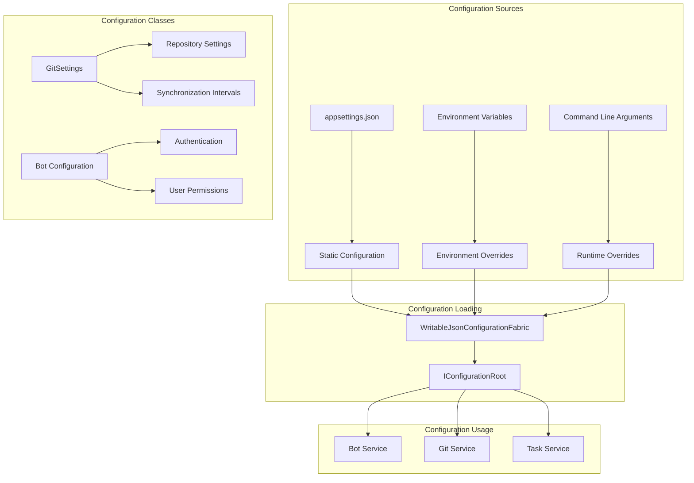
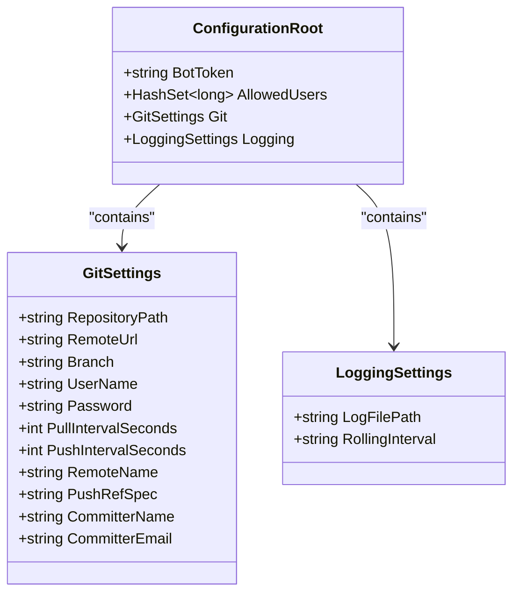
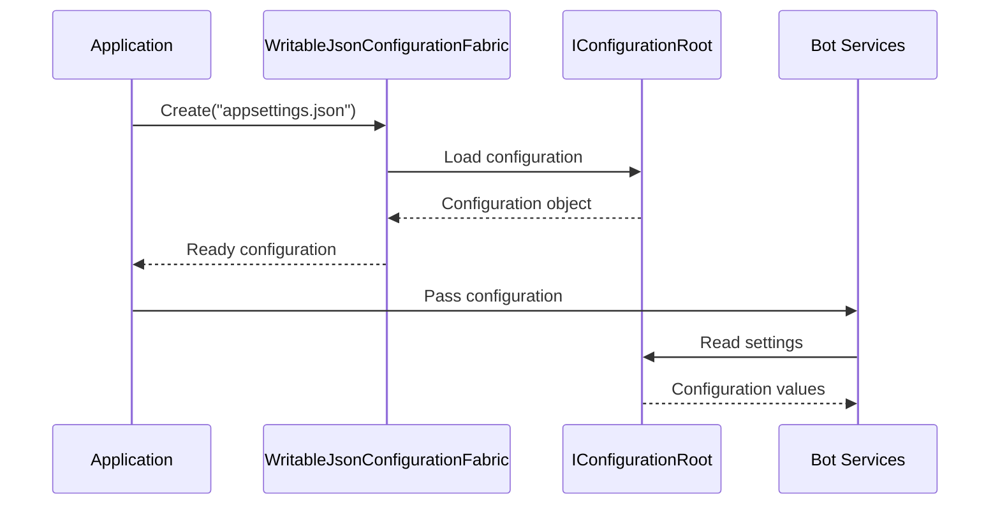

# Bot Configuration

<cite>
**Referenced Files in This Document**
- [appsettings.json](file://src/Unlimotion.TelegramBot/appsettings.json)
- [Bot.cs](file://src/Unlimotion.TelegramBot/Bot.cs)
- [GitService.cs](file://src/Unlimotion.TelegramBot/GitService.cs)
- [GitSettings.cs](file://src/Unlimotion.TelegramBot/GitSettings.cs)
- [Program.cs](file://src/Unlimotion.TelegramBot/Program.cs)
- [TaskService.cs](file://src/Unlimotion.TelegramBot/TaskService.cs)
- [GitPullJob.cs](file://src/Unlimotion.Scheduling/Jobs/GitPullJob.cs)
- [GitPushJob.cs](file://src/Unlimotion.Scheduling/Jobs/GitPushJob.cs)
- [appsettings.json](file://src/Unlimotion.Server/appsettings.json)
- [appsettings.Development.json](file://src/Unlimotion.Server/appsettings.Development.json)
</cite>

## Table of Contents
1. [Introduction](#introduction)
2. [Configuration Overview](#configuration-overview)
3. [Core Configuration Structure](#core-configuration-structure)
4. [Bot Configuration Settings](#bot-configuration-settings)
5. [Git Configuration Settings](#git-configuration-settings)
6. [Environment-Specific Configuration](#environment-specific-configuration)
7. [Configuration Loading and Management](#configuration-loading-and-management)
8. [Security Considerations](#security-considerations)
9. [Common Configuration Issues](#common-configuration-issues)
10. [Best Practices](#best-practices)
11. [Troubleshooting Guide](#troubleshooting-guide)

## Introduction

The Unlimotion Telegram Bot is configured through a structured JSON configuration system that manages bot tokens, user permissions, Git repository settings, and synchronization intervals. This documentation provides comprehensive guidance for setting up and managing the bot's configuration in various environments.

The bot operates with two primary configuration areas:
- **Telegram Bot Configuration**: Handles bot authentication and user access control
- **Git Repository Configuration**: Manages automated synchronization with remote repositories

## Configuration Overview

The bot's configuration is managed through a hierarchical JSON structure that supports both static and dynamic configuration updates. The configuration system integrates with .NET's built-in configuration providers and includes specialized handling for sensitive data.



**Diagram sources**
- [Program.cs](file://src/Unlimotion.TelegramBot/Program.cs#L10-L12)
- [Bot.cs](file://src/Unlimotion.TelegramBot/Bot.cs#L35-L45)
- [GitService.cs](file://src/Unlimotion.TelegramBot/GitService.cs#L12-L22)

## Core Configuration Structure

The bot's configuration follows a standardized JSON structure with clear separation of concerns:



**Diagram sources**
- [GitSettings.cs](file://src/Unlimotion.TelegramBot/GitSettings.cs#L3-L18)
- [appsettings.json](file://src/Unlimotion.TelegramBot/appsettings.json#L1-L15)

**Section sources**
- [appsettings.json](file://src/Unlimotion.TelegramBot/appsettings.json#L1-L15)
- [GitSettings.cs](file://src/Unlimotion.TelegramBot/GitSettings.cs#L3-L18)

## Bot Configuration Settings

### BotToken Configuration

The `BotToken` setting is essential for authenticating the Telegram bot with the Telegram Bot API. This token is obtained from the BotFather during bot registration.

**Configuration Example:**
```json
{
  "BotToken": "123456789:ABCDefGhIJKlmNoPQRstuVWXYZabcdefg123456789"
}
```

**Security Notes:**
- Never commit bot tokens to version control
- Use environment variables or secure vaults for production deployments
- Rotate tokens regularly as part of security maintenance

### AllowedUsers Configuration

The `AllowedUsers` array defines which Telegram user IDs can interact with the bot. This provides basic access control for the bot.

**Configuration Example:**
```json
{
  "AllowedUsers": [123456789, 987654321, 111222333]
}
```

**Implementation Details:**
- User IDs are numeric identifiers from Telegram
- Empty arrays allow no users access
- Add user IDs as integers without quotes
- Use the `/start` command to log user IDs for access control

**Section sources**
- [Bot.cs](file://src/Unlimotion.TelegramBot/Bot.cs#L35-L45)
- [appsettings.json](file://src/Unlimotion.TelegramBot/appsettings.json#L2-L3)

## Git Configuration Settings

### Repository Configuration

The Git section manages the connection to remote repositories and local storage:

| Setting | Type | Default | Description |
|---------|------|---------|-------------|
| `RepositoryPath` | string | "GitTasks" | Local directory for Git operations |
| `RemoteUrl` | string | - | Full URL to remote Git repository |
| `Branch` | string | "master" | Git branch to synchronize |
| `UserName` | string | "YourEmail" | Git authentication username |
| `Password` | string | "YourToken" | Git authentication password/token |

**Configuration Example:**
```json
{
  "Git": {
    "RepositoryPath": "GitTasks",
    "RemoteUrl": "https://github.com/username/repo.git",
    "Branch": "main",
    "UserName": "your.email@example.com",
    "Password": "ghp_xxxxxxxxxxxxxxxxxxxxxxxx"
  }
}
```

### Authentication Credentials

**GitHub Personal Access Token:**
- Generate from GitHub Settings > Developer Settings > Personal Access Tokens
- Use fine-grained tokens for better security
- Set appropriate repository permissions
- Enable expiration dates for tokens

**SSH Key Authentication:**
- Configure SSH keys in your Git client
- Use SSH URLs (e.g., `git@github.com:user/repo.git`)
- Store private keys securely on the server

### Synchronization Intervals

The bot uses configurable intervals for automatic Git operations:

| Setting | Type | Default | Description |
|---------|------|---------|-------------|
| `PullIntervalSeconds` | int | 30 | Seconds between automatic pull operations |
| `PushIntervalSeconds` | int | 60 | Seconds between automatic push operations |

**Configuration Impact:**
- **Low values (15-30 seconds)**: Frequent synchronization, higher resource usage
- **Medium values (60-300 seconds)**: Balanced synchronization and performance
- **High values (600+ seconds)**: Reduced synchronization, lower resource usage

**Implementation Details:**
- Configured through `StartTimers()` method in Bot class
- Uses System.Timers.Timer for background operations
- Logs synchronization activities for monitoring

**Section sources**
- [GitSettings.cs](file://src/Unlimotion.TelegramBot/GitSettings.cs#L8-L12)
- [Bot.cs](file://src/Unlimotion.TelegramBot/Bot.cs#L50-L65)
- [GitService.cs](file://src/Unlimotion.TelegramBot/GitService.cs#L24-L35)

## Environment-Specific Configuration

### Development vs Production Settings

The application supports environment-specific configurations through multiple JSON files:

**Development Configuration:**
```json
{
  "Logging": {
    "LogLevel": {
      "Default": "Debug",
      "System": "Information",
      "Microsoft": "Information"
    }
  }
}
```

**Production Configuration:**
```json
{
  "Logging": {
    "LogFilePath": "logs/log-.txt",
    "RollingInterval": "Day"
  }
}
```

### Environment Variable Configuration

**Supported Environment Variables:**
- `BOT_TOKEN`: Override bot token
- `ALLOWED_USERS`: Comma-separated user IDs
- `GIT_REMOTE_URL`: Remote repository URL
- `GIT_USERNAME`: Git authentication username
- `GIT_PASSWORD`: Git authentication password/token

### Configuration Precedence

The configuration system follows this precedence order (highest to lowest):
1. Command-line arguments
2. Environment variables
3. Environment-specific JSON files
4. Default values in code

**Section sources**
- [appsettings.Development.json](file://src/Unlimotion.Server/appsettings.Development.json#L1-L9)
- [appsettings.json](file://src/Unlimotion.Server/appsettings.json#L1-L44)

## Configuration Loading and Management

### WritableJsonConfigurationFabric

The bot uses a specialized configuration loader that supports runtime modifications:



**Diagram sources**
- [Program.cs](file://src/Unlimotion.TelegramBot/Program.cs#L10-L12)

### Configuration Initialization

The configuration loading process involves several key steps:

1. **File Loading**: Reads the JSON configuration file
2. **Validation**: Validates required settings
3. **Type Conversion**: Converts JSON values to appropriate .NET types
4. **Service Registration**: Makes configuration available to services

**Section sources**
- [Program.cs](file://src/Unlimotion.TelegramBot/Program.cs#L10-L12)
- [Bot.cs](file://src/Unlimotion.TelegramBot/Bot.cs#L35-L45)

## Security Considerations

### Sensitive Data Protection

**Bot Token Security:**
- Store tokens in secure configuration stores
- Use environment variables in production
- Implement token rotation policies
- Monitor unauthorized access attempts

**Git Credentials Security:**
- Use personal access tokens instead of passwords
- Limit token permissions to required repositories
- Enable two-factor authentication for Git accounts
- Regularly audit access permissions

### Configuration Hardening

**Recommended Security Practices:**
- Encrypt sensitive configuration data in production
- Use Azure Key Vault, AWS Secrets Manager, or similar services
- Implement configuration access logging
- Regular security audits of configuration files

**Access Control:**
- Restrict file system permissions to configuration files
- Use dedicated service accounts for bot operations
- Implement network-level access controls
- Monitor configuration file changes

## Common Configuration Issues

### Authentication Failures

**Symptoms:**
- Bot fails to start with authentication errors
- Git operations fail with credential errors
- Users receive access denied messages

**Solutions:**
1. Verify bot token validity with BotFather
2. Check user ID format (must be integers)
3. Validate Git credentials and repository access
4. Ensure network connectivity to Telegram and Git servers

### Repository Access Errors

**Common Issues:**
- Incorrect remote URL format
- Insufficient repository permissions
- Network connectivity problems
- SSH key authentication failures

**Troubleshooting Steps:**
1. Test repository URL manually
2. Verify Git credentials work independently
3. Check firewall and proxy settings
4. Review repository access permissions

### Synchronization Problems

**Pull/Push Operation Failures:**
- Conflicting changes in remote repository
- Insufficient disk space for Git operations
- Network timeouts during large operations
- Branch protection rules blocking pushes

**Resolution Strategies:**
- Implement conflict resolution strategies
- Monitor disk space usage
- Adjust timeout values for slow networks
- Work with repository administrators for protection rules

**Section sources**
- [GitService.cs](file://src/Unlimotion.TelegramBot/GitService.cs#L24-L35)
- [Bot.cs](file://src/Unlimotion.TelegramBot/Bot.cs#L420-L430)

## Best Practices

### Configuration Management

**Development Environment:**
- Use separate configuration files for different environments
- Store configuration templates in version control
- Document all configuration parameters
- Implement configuration validation

**Production Environment:**
- Use encrypted configuration stores
- Implement configuration backup procedures
- Monitor configuration changes
- Establish configuration change approval processes

### Monitoring and Logging

**Configuration Monitoring:**
- Log configuration loading events
- Monitor configuration validation results
- Track configuration change timestamps
- Alert on configuration anomalies

**Performance Monitoring:**
- Monitor Git synchronization performance
- Track bot response times
- Monitor resource usage patterns
- Implement capacity planning alerts

### Maintenance Procedures

**Regular Maintenance Tasks:**
- Review and update configuration periodically
- Audit access permissions and user lists
- Monitor log files for configuration-related errors
- Test configuration changes in staging environments

## Troubleshooting Guide

### Diagnostic Commands

**Configuration Validation:**
```bash
# Test bot token validity
curl -X GET "https://api.telegram.org/bot<TOKEN>/getMe"

# Test Git repository access
git ls-remote <REMOTE_URL>
```

**Log Analysis:**
- Check application logs for configuration loading errors
- Monitor Git operation logs for sync failures
- Review user access logs for permission issues
- Examine system logs for resource constraints

### Common Error Messages

**Bot Startup Errors:**
- "Invalid bot token": Verify token format and validity
- "Missing required configuration": Check all mandatory settings
- "Failed to load configuration": Validate JSON syntax

**Git Operation Errors:**
- "Authentication failed": Verify credentials and permissions
- "Repository not found": Check remote URL and access rights
- "Network timeout": Investigate network connectivity

### Recovery Procedures

**Configuration Recovery:**
1. Restore from backup configuration files
2. Reset to default configuration values
3. Recreate configuration from documented templates
4. Gradually reintroduce custom settings

**Service Recovery:**
1. Restart the bot service
2. Clear cached configuration data
3. Reinitialize Git repository connections
4. Verify all dependencies are available

**Section sources**
- [GitService.cs](file://src/Unlimotion.TelegramBot/GitService.cs#L24-L35)
- [Bot.cs](file://src/Unlimotion.TelegramBot/Bot.cs#L420-L430)