# Command Interface

<cite>
**Referenced Files in This Document**
- [Bot.cs](file://src/Unlimotion.TelegramBot/Bot.cs)
- [TaskService.cs](file://src/Unlimotion.TelegramBot/TaskService.cs)
- [Program.cs](file://src/Unlimotion.TelegramBot/Program.cs)
- [appsettings.json](file://src/Unlimotion.TelegramBot/appsettings.json)
- [GitSettings.cs](file://src/Unlimotion.TelegramBot/GitSettings.cs)
- [GitService.cs](file://src/Unlimotion.TelegramBot/GitService.cs)
- [TaskItem.cs](file://src/Unlimotion.Domain/TaskItem.cs)
- [TaskItemViewModel.cs](file://src/Unlimotion.ViewModel/TaskItemViewModel.cs)
</cite>

## Table of Contents
1. [Introduction](#introduction)
2. [Command Overview](#command-overview)
3. [Available Commands](#available-commands)
4. [Command Processing Architecture](#command-processing-architecture)
5. [Task Service Integration](#task-service-integration)
6. [Inline Keyboard Callbacks](#inline-keyboard-callbacks)
7. [State Management](#state-management)
8. [Text Matching and Search](#text-matching-and-search)
9. [Pagination and Display Logic](#pagination-and-display-logic)
10. [Error Handling](#error-handling)
11. [Command Workflows](#command-workflows)
12. [Configuration](#configuration)

## Introduction

The Unlimotion Telegram Bot provides a comprehensive command interface for task management through Telegram messaging. The bot processes text commands and inline keyboard interactions to enable users to search, view, and manage tasks stored in a Git-based file system. The command interface is built around a stateless message processing architecture with persistent state management through user sessions.

## Command Overview

The bot recognizes five primary commands that trigger different functionalities:

- **/start** - Initializes the bot session and welcomes users
- **/help** - Displays available commands and their syntax
- **/search [query]** - Performs case-insensitive text matching across task titles and descriptions
- **/task [ID]** - Retrieves and displays a specific task by ID
- **/root** - Lists all root-level tasks in the hierarchy


**Diagram sources**
- [Bot.cs](file://src/Unlimotion.TelegramBot/Bot.cs#L68-L154)

## Available Commands

### /start Command
**Syntax:** `/start`
**Purpose:** Initializes the bot session and provides basic navigation guidance.

**Implementation Details:**
- Responds with a welcome message: "Добро пожаловать! Введите /help для просмотра доступных команд."
- No parameters required
- Immediate response without task service interaction

**Expected Response:**
```
Добро пожаловать! Введите /help для просмотра доступных команд。
```

### /help Command
**Syntax:** `/help`
**Purpose:** Displays available commands and their syntax.

**Implementation Details:**
- Provides formatted help text with command descriptions
- Uses string concatenation for help message construction
- No parameters required

**Help Text Content:**
```
/search [запрос] - поиск задач
/task [ID] - просмотр задачи
/root - корневые задачи
```

**Expected Response:**
Formatted help text with command descriptions.

### /search Command
**Syntax:** `/search [query]`
**Purpose:** Performs case-insensitive text matching across task titles and descriptions.

**Implementation Details:**
- Extracts query parameter using `SplitOnFirst(' ')[1].Trim()`
- Calls `TaskService.SearchTasks(query)`
- Handles empty results with "Задачи не найдены." response
- Implements case-insensitive matching using `StringComparison.OrdinalIgnoreCase`

**Search Algorithm:**


**Diagram sources**
- [Bot.cs](file://src/Unlimotion.TelegramBot/Bot.cs#L110-L122)
- [TaskService.cs](file://src/Unlimotion.TelegramBot/TaskService.cs#L56-L75)

### /task Command
**Syntax:** `/task [ID]`
**Purpose:** Retrieves and displays a specific task by its unique identifier.

**Implementation Details:**
- Extracts task ID using `SplitOnFirst(' ')[1].Trim()`
- Calls `TaskService.GetTask(id)`
- Handles missing tasks with "Задача не найдена" response
- Displays full task details with interactive inline keyboard

**Expected Response:**
Task details with interactive buttons for task manipulation.

### /root Command
**Syntax:** `/root`
**Purpose:** Lists all root-level tasks in the task hierarchy.

**Implementation Details:**
- Calls `TaskService.RootTasks()`
- Converts results to list for processing
- Handles empty results with "Задачи не найдены." response
- Displays task list with numbering and status indicators

**Expected Response:**
List of root tasks with interactive buttons for task selection.

**Section sources**
- [Bot.cs](file://src/Unlimotion.TelegramBot/Bot.cs#L98-L154)

## Command Processing Architecture

The bot's command processing follows a centralized message handling architecture implemented in the `OnMessageReceived` method.


**Diagram sources**
- [Bot.cs](file://src/Unlimotion.TelegramBot/Bot.cs#L68-L154)

### Message Processing Pipeline

1. **Message Validation**: Ensures message type is text and extracts user information
2. **Access Control**: Validates user permissions against allowed users list
3. **State Management**: Checks for ongoing user interactions
4. **Command Parsing**: Identifies command type and extracts parameters
5. **Service Integration**: Delegates to appropriate service methods
6. **Response Generation**: Formats and sends responses to Telegram

**Section sources**
- [Bot.cs](file://src/Unlimotion.TelegramBot/Bot.cs#L68-L154)

## Task Service Integration

The TaskService acts as the intermediary between the Telegram bot and the underlying task storage system.

### TaskService Methods

| Method | Purpose | Parameters | Return Type |
|--------|---------|------------|-------------|
| `GetTask(string id)` | Retrieve specific task | Task ID | `TaskItemViewModel` |
| `SearchTasks(string query)` | Search tasks by text | Search query | `List<TaskItemViewModel>` |
| `RootTasks()` | Get root tasks | None | `IEnumerable<TaskItemViewModel>` |

### Search Implementation

The search functionality implements case-insensitive text matching across task attributes:


**Diagram sources**
- [TaskService.cs](file://src/Unlimotion.TelegramBot/TaskService.cs#L56-L75)

### Error Handling in TaskService

The TaskService implements robust error handling with logging for all operations:

- **GetTask**: Logs exceptions with task ID context
- **SearchTasks**: Handles empty queries and logs search failures
- **RootTasks**: Manages storage connection errors

**Section sources**
- [TaskService.cs](file://src/Unlimotion.TelegramBot/TaskService.cs#L20-L96)

## Inline Keyboard Callbacks

The bot utilizes inline keyboards for interactive task management through callback queries.

### Callback Types and Prefixes

| Prefix | Purpose | Example |
|--------|---------|---------|
| `open_` | Open task details | `open_taskId` |
| `toggle_` | Toggle task completion | `toggle_taskId` |
| `delete_` | Delete task | `delete_taskId` |
| `createSub_` | Create subtask | `createSub_parentId` |
| `createSib_` | Create sibling task | `createSib_siblingId` |
| `parents_` | Show parent tasks | `parents_taskId` |
| `blocking_` | Show blocking tasks | `blocking_taskId` |
| `containing_` | Show contained tasks | `containing_taskId` |
| `blocked_` | Show blocked tasks | `blocked_taskId` |

### Callback Processing Flow


**Diagram sources**
- [Bot.cs](file://src/Unlimotion.TelegramBot/Bot.cs#L346-L464)

### Interactive Task Operations

Each callback type triggers specific actions:

- **Toggle Completion**: Changes task completion status and updates display
- **Delete Task**: Removes task from storage and clears message
- **Create Subtask/Sibling**: Sets user state for name input
- **Show Related Tasks**: Displays hierarchical task relationships

**Section sources**
- [Bot.cs](file://src/Unlimotion.TelegramBot/Bot.cs#L346-L464)

## State Management

The bot maintains user interaction state through the `_userStates` dictionary.

### State Management Architecture


**Diagram sources**
- [Bot.cs](file://src/Unlimotion.TelegramBot/Bot.cs#L25-L26)

### State Types

| State Type | Purpose | Activation |
|------------|---------|------------|
| `createSub_[parentId]` | Creating subtask under parent | Click "Create Subtask" |
| `createSib_[siblingId]` | Creating sibling task | Click "Create Sibling" |

### State Lifecycle

1. **Activation**: User clicks "Create Subtask" or "Create Sibling" button
2. **State Setting**: Bot stores state in `_userStates` dictionary
3. **Input Collection**: Bot waits for user text input
4. **Processing**: Bot creates new task and resets state
5. **Cleanup**: State removed from dictionary after completion

**Section sources**
- [Bot.cs](file://src/Unlimotion.TelegramBot/Bot.cs#L189-L258)

## Text Matching and Search

The search functionality implements sophisticated text matching across task attributes.

### Search Algorithm

The search method performs case-insensitive matching using `StringComparison.OrdinalIgnoreCase`:


**Diagram sources**
- [TaskService.cs](file://src/Unlimotion.TelegramBot/TaskService.cs#L56-L75)

### Search Optimization

- **Early Termination**: Empty queries immediately return empty results
- **Null Safety**: Handles null Title and Description fields gracefully
- **Case Insensitivity**: Uses ordinal comparison for consistent matching
- **Performance**: Processes all tasks in memory for simplicity

**Section sources**
- [TaskService.cs](file://src/Unlimotion.TelegramBot/TaskService.cs#L56-L75)

## Pagination and Display Logic

The `ShowTaskList` method implements efficient task list display with pagination-like organization.

### Display Architecture


**Diagram sources**
- [Bot.cs](file://src/Unlimotion.TelegramBot/Bot.cs#L154-L188)

### Button Organization

| Feature | Implementation | Purpose |
|---------|---------------|---------|
| **Numbering** | Sequential index counter | Task identification |
| **Status Indicators** | Lock emoji for unavailable tasks | Availability indication |
| **Button Limit** | 5 buttons per row | Telegram keyboard constraints |
| **Callback Data** | `open_taskId` format | Task identification in callbacks |

### Message Formatting

Task list messages include:
- Sequential numbering (1., 2., 3., ...)
- Status emojis (✅, 🔒, 🗄️)
- Task titles
- Interactive open buttons

**Section sources**
- [Bot.cs](file://src/Unlimotion.TelegramBot/Bot.cs#L154-L188)

## Error Handling

The bot implements comprehensive error handling at multiple levels.

### Exception Handling Strategy


**Diagram sources**
- [Bot.cs](file://src/Unlimotion.TelegramBot/Bot.cs#L145-L154)

### Error Categories

| Error Type | Handling | User Response |
|------------|----------|---------------|
| **Invalid Command** | "Неизвестная команда. Введите /help для просмотра доступных команд." | Help guidance |
| **Missing Parameters** | Exception caught, generic error message | Retry with correct format |
| **Task Not Found** | Specific "Задача не найдена" message | Verify task ID |
| **Search No Results** | Specific "Задачи не найдены." message | Try different query |
| **System Error** | Generic "Произошла ошибка при обработке вашего запроса." | Contact support |

### Logging Strategy

- **Access Denied**: Logs warning with user ID and username
- **Command Processing**: Logs informational messages with user and text
- **Service Errors**: Logs errors with context information
- **Callback Processing**: Logs callback data and user information

**Section sources**
- [Bot.cs](file://src/Unlimotion.TelegramBot/Bot.cs#L145-L154)
- [Bot.cs](file://src/Unlimotion.TelegramBot/Bot.cs#L465-L478)

## Command Workflows

### Typical User Interaction Workflow

```mermaid
sequenceDiagram
participant User
participant Bot
participant TaskService
participant Storage
User->>Bot : /search project
Bot->>TaskService : SearchTasks("project")
TaskService->>Storage : Query tasks
Storage-->>TaskService : Return matching tasks
TaskService-->>Bot : Task list
Bot->>User : Show task list with buttons
User->>Bot : Click task button
Bot->>TaskService : GetTask(taskId)
TaskService-->>Bot : Task details
Bot->>User : Show task with interactive buttons
User->>Bot : Click "Create Subtask"
Bot->>User : "Введите название подзадачи"
User->>Bot : "New subtask"
Bot->>TaskService : Create new task
TaskService-->>Bot : Task saved
Bot->>User : Confirm creation
```



**Diagram sources**
- [Bot.cs](file://src/Unlimotion.TelegramBot/Bot.cs#L68-L154)
- [TaskService.cs](file://src/Unlimotion.TelegramBot/TaskService.cs#L20-L96)

### Edge Case Scenarios

1. **Empty Search Results**
   - Command: `/search nonexistentquery`
   - Response: "Задачи не найдены."

2. **Non-existent Task ID**
   - Command: `/task nonexistingid`
   - Response: "Задача не найдена"

3. **Empty Root Tasks**
   - Command: `/root`
   - Response: "Задачи не найдены."

4. **Invalid User Access**
   - Response: Warning logged, no command processed

**Section sources**
- [Bot.cs](file://src/Unlimotion.TelegramBot/Bot.cs#L118-L122)
- [Bot.cs](file://src/Unlimotion.TelegramBot/Bot.cs#L267-L269)

## Configuration

### Bot Configuration

The bot requires configuration through `appsettings.json`:

| Setting | Purpose | Example |
|---------|---------|---------|
| `BotToken` | Telegram bot authentication token | `"your-bot-token"` |
| `AllowedUsers` | Authorized user IDs | `[123456789, 987654321]` |
| `RepositoryPath` | Local Git repository path | `"GitTasks"` |
| `RemoteUrl` | Remote Git repository URL | `"https://github.com/user/repo.git"` |
| `Branch` | Git branch name | `"master"` |

### Git Service Configuration

The Git service handles automatic synchronization:

- **Pull Interval**: Default 30 seconds
- **Push Interval**: Default 60 seconds
- **Committer Information**: Configurable name and email
- **Authentication**: Username/password credentials

**Section sources**
- [appsettings.json](file://src/Unlimotion.TelegramBot/appsettings.json#L1-L15)
- [GitSettings.cs](file://src/Unlimotion.TelegramBot/GitSettings.cs#L3-L18)
- [GitService.cs](file://src/Unlimotion.TelegramBot/GitService.cs#L15-L109)