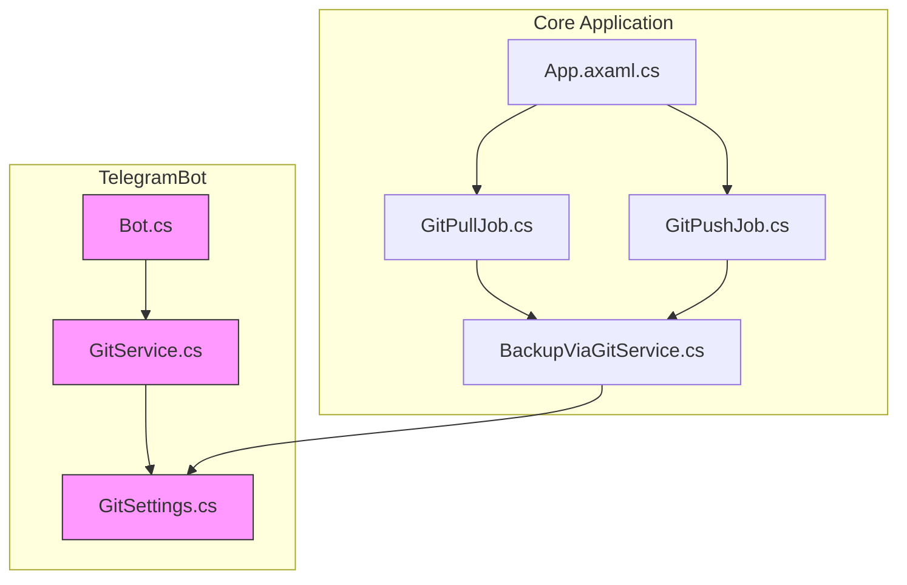
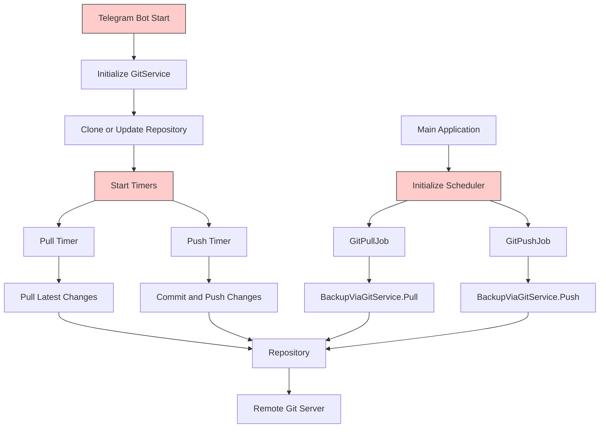
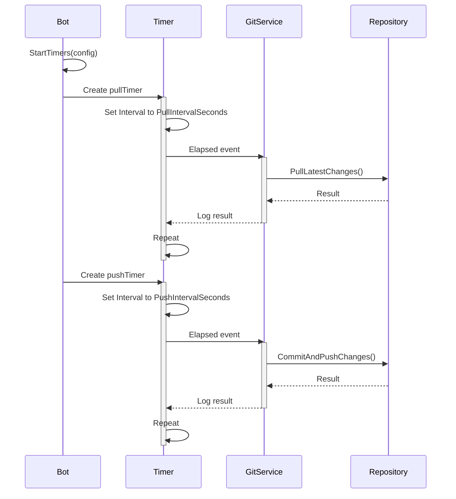
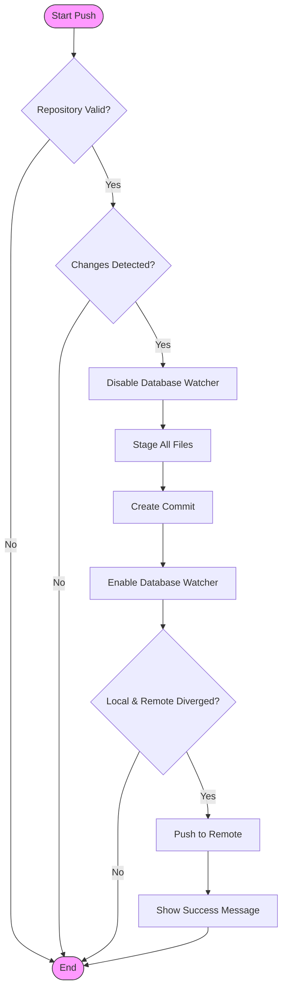
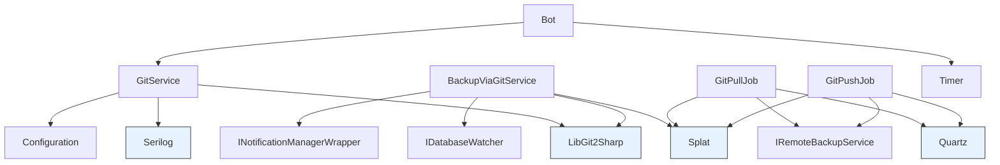

# Git Synchronization Integration

<cite>
**Referenced Files in This Document**   
- [GitService.cs](file://src/Unlimotion.TelegramBot/GitService.cs)
- [GitSettings.cs](file://src/Unlimotion.TelegramBot/GitSettings.cs)
- [Bot.cs](file://src/Unlimotion.TelegramBot/Bot.cs)
- [appsettings.json](file://src/Unlimotion.TelegramBot/appsettings.json)
- [GitPullJob.cs](file://src/Unlimotion/Scheduling/Jobs/GitPullJob.cs)
- [GitPushJob.cs](file://src/Unlimotion/Scheduling/Jobs/GitPushJob.cs)
- [App.axaml.cs](file://src/Unlimotion/App.axaml.cs)
- [BackupViaGitService.cs](file://src/Unlimotion.Services/BackupViaGitService.cs)
</cite>

## Table of Contents
1. [Introduction](#introduction)
2. [Project Structure](#project-structure)
3. [Core Components](#core-components)
4. [Architecture Overview](#architecture-overview)
5. [Detailed Component Analysis](#detailed-component-analysis)
6. [Dependency Analysis](#dependency-analysis)
7. [Performance Considerations](#performance-considerations)
8. [Troubleshooting Guide](#troubleshooting-guide)
9. [Conclusion](#conclusion)

## Introduction
This document provides comprehensive documentation for the Git synchronization functionality in the Unlimotion Telegram Bot. The system enables automatic backup and synchronization of task data through Git operations, allowing users to maintain version-controlled backups of their task repository. The documentation covers the initialization of synchronization timers, implementation of Git operations, configuration options, error handling mechanisms, and strategies for managing concurrent modifications. The system is designed to operate in the background with minimal user intervention, ensuring continuous data protection and synchronization.

## Project Structure
The Git synchronization functionality is distributed across multiple components in the Unlimotion application, with the core implementation residing in the TelegramBot module and shared services. The system integrates with the main application through dependency injection and scheduling mechanisms.



**Diagram sources**
- [GitService.cs](file://src/Unlimotion.TelegramBot/GitService.cs)
- [GitSettings.cs](file://src/Unlimotion.TelegramBot/GitSettings.cs)
- [Bot.cs](file://src/Unlimotion.TelegramBot/Bot.cs)
- [GitPullJob.cs](file://src/Unlimotion/Scheduling/Jobs/GitPullJob.cs)
- [GitPushJob.cs](file://src/Unlimotion/Scheduling/Jobs/GitPushJob.cs)
- [App.axaml.cs](file://src/Unlimotion/App.axaml.cs)
- [BackupViaGitService.cs](file://src/Unlimotion.Services/BackupViaGitService.cs)

**Section sources**
- [GitService.cs](file://src/Unlimotion.TelegramBot/GitService.cs)
- [GitSettings.cs](file://src/Unlimotion.TelegramBot/GitSettings.cs)
- [Bot.cs](file://src/Unlimotion.TelegramBot/Bot.cs)

## Core Components
The Git synchronization system consists of several core components that work together to provide automated repository management. The GitService class handles direct Git operations such as cloning, pulling, and pushing changes. The GitSettings class defines configurable parameters for the synchronization process. The Bot class initializes and manages the timing of synchronization operations. Additionally, the BackupViaGitService provides a more comprehensive implementation of Git operations with enhanced error handling and UI integration. The system also includes Quartz.NET jobs (GitPullJob and GitPushJob) that can be scheduled through the main application's scheduler.

**Section sources**
- [GitService.cs](file://src/Unlimotion.TelegramBot/GitService.cs)
- [GitSettings.cs](file://src/Unlimotion.TelegramBot/GitSettings.cs)
- [Bot.cs](file://src/Unlimotion.TelegramBot/Bot.cs)
- [BackupViaGitService.cs](file://src/Unlimotion.Services/BackupViaGitService.cs)
- [GitPullJob.cs](file://src/Unlimotion.Scheduling/Jobs/GitPullJob.cs)
- [GitPushJob.cs](file://src/Unlimotion.Scheduling/Jobs/GitPushJob.cs)

## Architecture Overview
The Git synchronization architecture follows a layered approach with clear separation of concerns. The system is initialized through the Bot.StartAsync method, which configures the GitService and starts synchronization timers. The architecture integrates with the main Unlimotion application through the Splat dependency injection framework, allowing shared access to the IRemoteBackupService implementation. The system supports two operational modes: timer-based synchronization in the Telegram bot and Quartz.NET scheduled jobs in the main application. Both approaches use the same underlying Git operations but differ in their triggering mechanisms and error reporting strategies.



**Diagram sources**
- [Bot.cs](file://src/Unlimotion.TelegramBot/Bot.cs)
- [GitService.cs](file://src/Unlimotion.TelegramBot/GitService.cs)
- [App.axaml.cs](file://src/Unlimotion/App.axaml.cs)
- [BackupViaGitService.cs](file://src/Unlimotion.Services/BackupViaGitService.cs)

## Detailed Component Analysis

### GitService Analysis
The GitService class provides the core functionality for Git operations within the Telegram bot context. It uses LibGit2Sharp to perform repository operations and integrates with the application's configuration system to obtain Git settings.

```mermaid
classDiagram
class GitService {
-GitSettings settings
-CredentialsHandler credentialsProvider
+GitService(IConfiguration configuration)
+CloneOrUpdateRepo() void
+PullLatestChanges() void
+CommitAndPushChanges(string message) void
}
class GitSettings {
+string RepositoryPath
+string RemoteUrl
+string Branch
+string UserName
+string Password
+int PullIntervalSeconds
+int PushIntervalSeconds
+string RemoteName
+string PushRefSpec
+string CommitterName
+string CommitterEmail
}
GitService --> GitSettings : "uses"
GitService --> "LibGit2Sharp.Repository" : "uses"
GitService --> "Serilog.Log" : "uses"
```

**Diagram sources**
- [GitService.cs](file://src/Unlimotion.TelegramBot/GitService.cs)
- [GitSettings.cs](file://src/Unlimotion.TelegramBot/GitSettings.cs)

**Section sources**
- [GitService.cs](file://src/Unlimotion.TelegramBot/GitService.cs)
- [GitSettings.cs](file://src/Unlimotion.TelegramBot/GitSettings.cs)

### Timer Initialization Analysis
The StartTimers method in the Bot class initializes automatic synchronization operations at configurable intervals. This method creates System.Timers.Timer instances for pull and push operations, with intervals defined in the GitSettings configuration.



**Diagram sources**
- [Bot.cs](file://src/Unlimotion.TelegramBot/Bot.cs)
- [GitService.cs](file://src/Unlimotion.TelegramBot/GitService.cs)

**Section sources**
- [Bot.cs](file://src/Unlimotion.TelegramBot/Bot.cs)

### BackupViaGitService Analysis
The BackupViaGitService provides a more comprehensive implementation of Git operations with additional features such as UI notifications and database watcher integration. This service implements the IRemoteBackupService interface and is registered with the Splat dependency injection framework.



**Diagram sources**
- [BackupViaGitService.cs](file://src/Unlimotion.Services/BackupViaGitService.cs)

**Section sources**
- [BackupViaGitService.cs](file://src/Unlimotion.Services/BackupViaGitService.cs)

## Dependency Analysis
The Git synchronization functionality has dependencies on several external libraries and internal components. The system relies on LibGit2Sharp for Git operations, Serilog for logging, and Quartz.NET for job scheduling in the main application. The Telegram bot implementation uses System.Timers for periodic operations. The components are connected through the Splat dependency injection framework, which allows for shared services across the application.



**Diagram sources**
- [GitService.cs](file://src/Unlimotion.TelegramBot/GitService.cs)
- [BackupViaGitService.cs](file://src/Unlimotion.Services/BackupViaGitService.cs)
- [GitPullJob.cs](file://src/Unlimotion.Scheduling/Jobs/GitPullJob.cs)
- [GitPushJob.cs](file://src/Unlimotion.Scheduling/Jobs/GitPushJob.cs)
- [Bot.cs](file://src/Unlimotion.TelegramBot/Bot.cs)

**Section sources**
- [GitService.cs](file://src/Unlimotion.TelegramBot/GitService.cs)
- [BackupViaGitService.cs](file://src/Unlimotion.Services/BackupViaGitService.cs)
- [GitPullJob.cs](file://src/Unlimotion.Scheduling/Jobs/GitPullJob.cs)
- [GitPushJob.cs](file://src/Unlimotion.Scheduling/Jobs/GitPushJob.cs)

## Performance Considerations
The Git synchronization system is designed to minimize performance impact on the main application. Operations are performed in the background using timers or scheduled jobs, preventing UI blocking. The system includes several performance optimizations:

- **File watching integration**: The BackupViaGitService temporarily disables the database watcher during Git operations to prevent conflicts and unnecessary processing.
- **Change detection**: Both implementations check for repository dirtiness before committing, avoiding unnecessary operations.
- **Staging efficiency**: All changes are staged with a single wildcard pattern ("*"), reducing filesystem operations.
- **Error resilience**: Operations are wrapped in try-catch blocks to prevent failures from affecting the main application flow.
- **Resource management**: Repository instances are properly disposed using the 'using' statement to prevent memory leaks.

The system's performance characteristics are primarily determined by the size of the repository and network latency when communicating with the remote Git server. For large repositories, the pull and push operations may take significant time, during which the database watcher remains disabled.

## Troubleshooting Guide
The Git synchronization system includes comprehensive error handling and logging mechanisms to assist with troubleshooting. All operations are wrapped in try-catch blocks that log errors using Serilog. The BackupViaGitService additionally provides UI notifications for critical errors.

Common issues and their solutions:

1. **Authentication failures**: Ensure that the UserName and Password in GitSettings are correctly configured. For GitHub repositories, use a personal access token instead of a password.

2. **Repository initialization errors**: Verify that the RepositoryPath exists and is writable. The system will attempt to clone the repository automatically if it doesn't exist.

3. **Merge conflicts**: The system uses a stash-based approach to handle concurrent modifications. If conflicts occur, the user must resolve them manually and commit the result.

4. **Network connectivity issues**: Check that the RemoteUrl is accessible from the application environment. Firewalls or network policies may block Git operations.

5. **Permission denied errors**: Ensure that the application has sufficient permissions to read and write to the repository directory.

6. **SSL certificate errors**: For self-hosted Git servers with self-signed certificates, additional configuration may be required in LibGit2Sharp.

The system logs all Git operations at the Information level, making it easy to trace the synchronization process. Errors are logged with full exception details to aid in diagnosis.

**Section sources**
- [GitService.cs](file://src/Unlimotion.TelegramBot/GitService.cs)
- [BackupViaGitService.cs](file://src/Unlimotion.Services/BackupViaGitService.cs)
- [Bot.cs](file://src/Unlimotion.TelegramBot/Bot.cs)

## Conclusion
The Git synchronization functionality in Unlimotion provides a robust mechanism for automatically backing up and synchronizing task data. The system offers flexible configuration options through the GitSettings class, allowing users to customize repository paths, branch specifications, and synchronization intervals. Two complementary implementations exist: a timer-based approach in the Telegram bot and a Quartz.NET job-based approach in the main application. Both implementations share common Git operation logic while adapting to their respective environments. The system includes comprehensive error handling, logging, and conflict resolution strategies to ensure reliable operation. By maintaining continuous synchronization with a remote Git repository, the system provides version control, data protection, and multi-device access to task information.