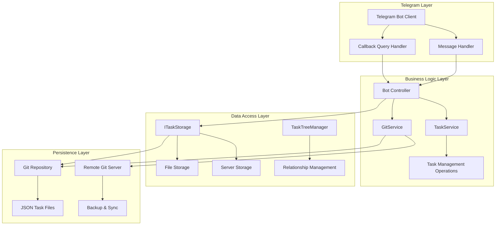
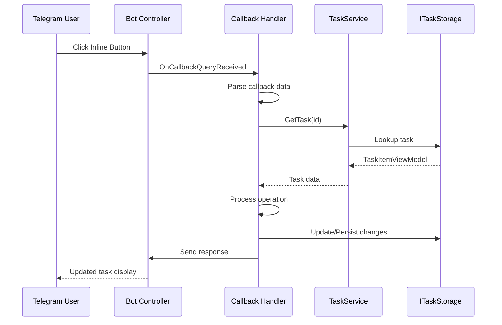
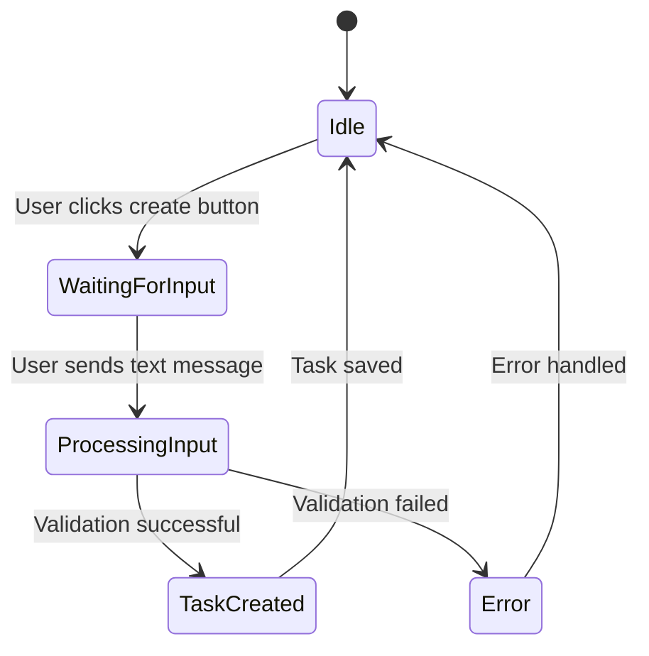
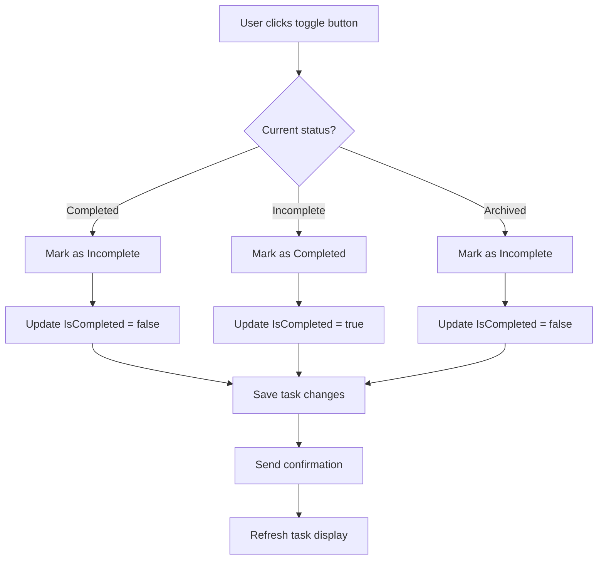
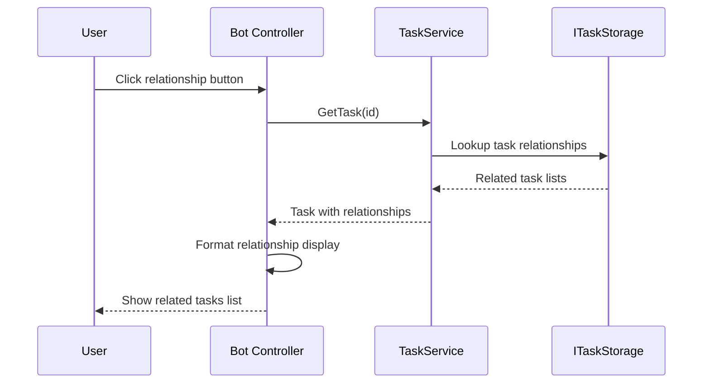
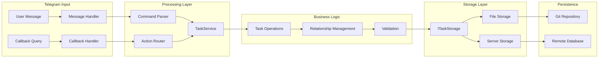
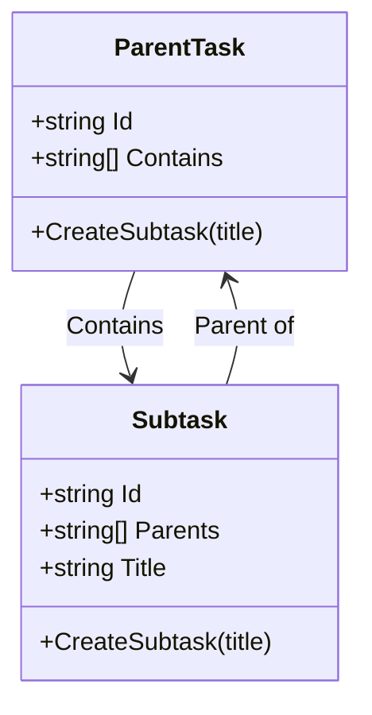
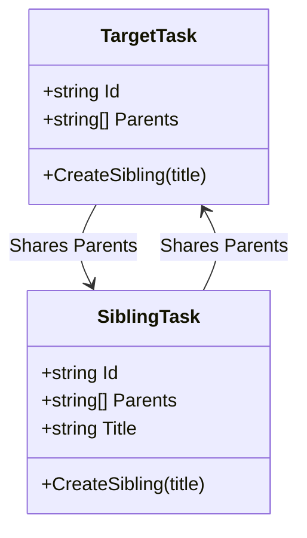

# Task Management Operations

<cite>
**Referenced Files in This Document**
- [Bot.cs](file://src/Unlimotion.TelegramBot/Bot.cs)
- [TaskService.cs](file://src/Unlimotion.TelegramBot/TaskService.cs)
- [GitService.cs](file://src/Unlimotion.TelegramBot/GitService.cs)
- [appsettings.json](file://src/Unlimotion.TelegramBot/appsettings.json)
- [TaskItem.cs](file://src/Unlimotion.Domain/TaskItem.cs)
- [TaskItemViewModel.cs](file://src/Unlimotion.ViewModel/TaskItemViewModel.cs)
- [ITaskStorage.cs](file://src/Unlimotion.ViewModel/ITaskStorage.cs)
- [GitSettings.cs](file://src/Unlimotion.TelegramBot/GitSettings.cs)
- [TaskStorageSettings.cs](file://src/Unlimotion.ViewModel/TaskStorageSettings.cs)
</cite>

## Table of Contents
1. [Introduction](#introduction)
2. [System Architecture](#system-architecture)
3. [Interactive Callback System](#interactive-callback-system)
4. [State Management Pattern](#state-management-pattern)
5. [Task Modification Operations](#task-modification-operations)
6. [Task Relationship Navigation](#task-relationship-navigation)
7. [Data Flow Architecture](#data-flow-architecture)
8. [Task Creation and Relationships](#task-creation-and-relationships)
9. [Visual Indicators and Status Representation](#visual-indicators-and-status-representation)
10. [Performance Considerations](#performance-considerations)
11. [Common Workflows](#common-workflows)
12. [Limitations and Best Practices](#limitations-and-best-practices)

## Introduction

The Unlimotion Telegram Bot provides a comprehensive task management system that enables users to create, modify, and navigate through hierarchical task structures using an interactive callback-based interface. The system implements sophisticated state management patterns to capture user input after button presses and maintains persistent storage through a Git-based synchronization mechanism.

The bot operates as a bridge between Telegram's messaging platform and the Unlimotion task management domain, offering intuitive operations for task creation, modification, and relationship management through inline keyboard interactions.

## System Architecture

The Telegram Bot task management system follows a layered architecture with clear separation of concerns:



**Diagram sources**
- [Bot.cs](file://src/Unlimotion.TelegramBot/Bot.cs#L17-L36)
- [TaskService.cs](file://src/Unlimotion.TelegramBot/TaskService.cs#L8-L15)
- [GitService.cs](file://src/Unlimotion.TelegramBot/GitService.cs#L8-L25)

**Section sources**
- [Bot.cs](file://src/Unlimotion.TelegramBot/Bot.cs#L17-L36)
- [TaskService.cs](file://src/Unlimotion.TelegramBot/TaskService.cs#L8-L15)

## Interactive Callback System

The bot implements a sophisticated callback system using Telegram's InlineKeyboardButtons to provide interactive task management operations. Each button action triggers specific callback handlers that process user interactions asynchronously.

### Button Action Types

The system defines seven primary callback action types:

| Action Type | Prefix | Purpose | Example Usage |
|-------------|--------|---------|---------------|
| Open Task | `open_` | Navigate to task details | `open_task123` |
| Create Subtask | `createSub_` | Create child task | `createSub_parent123` |
| Create Sibling | `createSib_` | Create sibling task | `createSib_sibling123` |
| Toggle Completion | `toggle_` | Mark task as completed/incomplete | `toggle_task123` |
| Delete Task | `delete_` | Remove task from system | `delete_task123` |
| View Parents | `parents_` | Show parent relationships | `parents_task123` |
| View Blocking | `blocking_` | Show blocking relationships | `blocking_task123` |
| View Containing | `containing_` | Show child relationships | `containing_task123` |
| View Blocked | `blocked_` | Show blocked relationships | `blocked_task123` |

### Callback Processing Flow



**Diagram sources**
- [Bot.cs](file://src/Unlimotion.TelegramBot/Bot.cs#L342-L460)

**Section sources**
- [Bot.cs](file://src/Unlimotion.TelegramBot/Bot.cs#L17-L36)
- [Bot.cs](file://src/Unlimotion.TelegramBot/Bot.cs#L342-L460)

## State Management Pattern

The bot employs a state management pattern to capture user input after button presses, particularly for task creation operations. This pattern maintains user context through a dictionary-based state tracking system.

### State Tracking Implementation



**Diagram sources**
- [Bot.cs](file://src/Unlimotion.TelegramBot/Bot.cs#L176-L209)

### State Management Workflow

The state management system operates through several key mechanisms:

1. **State Initialization**: When a user initiates a task creation operation, the bot stores the current task ID in the user state dictionary
2. **Input Capture**: Subsequent messages from the user are captured and processed as task titles
3. **Validation**: The system validates the stored state and ensures the original task still exists
4. **Task Creation**: New tasks are instantiated with appropriate relationships and saved to storage
5. **State Cleanup**: User states are cleared after successful operations

**Section sources**
- [Bot.cs](file://src/Unlimotion.TelegramBot/Bot.cs#L176-L209)

## Task Modification Operations

The bot provides comprehensive task modification capabilities through inline keyboard buttons, enabling users to toggle completion status, delete tasks, and manage task relationships.

### Completion Toggle Operation

The completion toggle operation allows users to mark tasks as completed or incomplete:



**Diagram sources**
- [Bot.cs](file://src/Unlimotion.TelegramBot/Bot.cs#L348-L365)

### Task Deletion Operation

Task deletion removes tasks from the system while maintaining referential integrity:

1. **Validation**: Verify task exists and user has permission
2. **Removal**: Delete task from storage
3. **Confirmation**: Send deletion confirmation
4. **Cleanup**: Remove message display

**Section sources**
- [Bot.cs](file://src/Unlimotion.TelegramBot/Bot.cs#L363-L375)

## Task Relationship Navigation

The bot provides intuitive navigation through task relationships, allowing users to explore parent-child hierarchies and blocking relationships.

### Relationship Types

| Relationship Type | Direction | Navigation Button | Purpose |
|-------------------|-----------|-------------------|---------|
| Parents | Upward | `Parents X` | Navigate to parent tasks |
| Blocking | Upward | `Blocking Y` | Show tasks blocking this task |
| Containing | Downward | `Containing Z` | Show child/subtasks |
| Blocked | Downward | `Blocked W` | Show tasks this task blocks |

### Navigation Flow



**Diagram sources**
- [Bot.cs](file://src/Unlimotion.TelegramBot/Bot.cs#L390-L460)

**Section sources**
- [Bot.cs](file://src/Unlimotion.TelegramBot/Bot.cs#L390-L460)

## Data Flow Architecture

The data flow from Telegram interactions to the underlying storage system follows a well-defined pipeline:



**Diagram sources**
- [Bot.cs](file://src/Unlimotion.TelegramBot/Bot.cs#L33-L66)
- [TaskService.cs](file://src/Unlimotion.TelegramBot/TaskService.cs#L8-L96)

### Data Transformation Pipeline

1. **Input Processing**: Telegram messages and callbacks are parsed into structured operations
2. **Service Layer**: TaskService handles business logic and coordinates with storage
3. **Storage Abstraction**: ITaskStorage provides unified access to different storage backends
4. **Persistence**: Changes are persisted through Git synchronization or direct storage

**Section sources**
- [Bot.cs](file://src/Unlimotion.TelegramBot/Bot.cs#L33-L66)
- [TaskService.cs](file://src/Unlimotion.TelegramBot/TaskService.cs#L8-L96)

## Task Creation and Relationships

The bot supports two primary task creation patterns: subtasks and sibling tasks, each with distinct relationship semantics.

### Subtask Creation

Subtasks inherit the parent task's relationships and become part of its containment hierarchy:



**Diagram sources**
- [Bot.cs](file://src/Unlimotion.TelegramBot/Bot.cs#L188-L209)

### Sibling Task Creation

Sibling tasks share the same parent relationships as the target task:



**Diagram sources**
- [Bot.cs](file://src/Unlimotion.TelegramBot/Bot.cs#L211-L235)

### Task Instantiation Process

New tasks are instantiated with the following characteristics:

1. **Unique Identifier**: Generated using GUID for global uniqueness
2. **Basic Properties**: Title and empty description initially
3. **Relationship Setup**: Appropriate parent-child relationships established
4. **Storage Persistence**: Tasks are immediately saved to the storage system

**Section sources**
- [Bot.cs](file://src/Unlimotion.TelegramBot/Bot.cs#L188-L235)

## Visual Indicators and Status Representation

The bot uses a comprehensive system of emojis and visual indicators to represent task states and relationships:

### Status Emojis

| Status | Emoji | Unicode | Description |
|--------|-------|---------|-------------|
| Completed | ✅ | `\u2705` | Task marked as completed |
| Incomplete | 🟡 | `\uD83D\uDFE9` | Task pending completion |
| Archived | 🗃️ | `\U0001F5C3` | Task archived and inactive |
| Locked | 🔒 | `\U0001F512` | Task cannot be completed |

### Status Display Format

Task display combines visual indicators with textual descriptions:

```
🔒✅ *Task Title*
✅ Wanted | Importance 5
Id: task12345
Description text...
Created: 2024.01.15 10:30 Unlocked: 2024.01.15 10:30
Completed: 2024.01.15 11:00 Archive: 2024.01.15 12:00
Begin: 2024.01.15 Duration: 1h 30m End: 2024.01.15
```

### Relationship Counts

Each task displays relationship counts in button form:
- `Parents 2`: Number of parent tasks
- `Blocking 1`: Number of blocking tasks  
- `Containing 3`: Number of child tasks
- `Blocked 0`: Number of blocked tasks

**Section sources**
- [Bot.cs](file://src/Unlimotion.TelegramBot/Bot.cs#L310-L343)
- [Bot.cs](file://src/Unlimotion.TelegramBot/Bot.cs#L267-L287)

## Performance Considerations

Managing large numbers of tasks through the Telegram bot interface requires careful consideration of several performance factors:

### Memory Management

1. **State Dictionary Size**: User states are maintained in memory, potentially growing with concurrent users
2. **Task Caching**: Task relationships are cached using ReactiveUI bindings for efficient updates
3. **Collection Synchronization**: Large task collections are synchronized efficiently using observable collections

### Network and Storage Performance

1. **Git Operations**: Automatic pull/push operations occur at configurable intervals (default: 30s pull, 60s push)
2. **Batch Operations**: Bulk operations are supported for migration and backup scenarios
3. **Connection Pooling**: Database connections are managed through connection pooling

### Scalability Limits

1. **Telegram Rate Limits**: The bot respects Telegram's rate limits for message sending and callback responses
2. **Storage Backend**: Performance scales with the underlying storage system (local files vs. remote database)
3. **Memory Constraints**: Large task hierarchies may consume significant memory for relationship caching

### Optimization Strategies

1. **Lazy Loading**: Task relationships are loaded on-demand rather than preloaded
2. **Incremental Updates**: Only changed tasks are synchronized with storage
3. **Background Processing**: Long-running operations (Git sync) are performed asynchronously

**Section sources**
- [GitService.cs](file://src/Unlimotion.TelegramBot/GitService.cs#L45-L65)
- [TaskStorageSettings.cs](file://src/Unlimotion.ViewModel/TaskStorageSettings.cs#L17-L25)

## Common Workflows

### Creating a Hierarchical Task Structure

1. **Start with Root Task**: Create a main task that serves as the root
2. **Add Subtasks**: Use "Create subtask" to build nested hierarchy
3. **Organize with Siblings**: Use "Create sibling" to add parallel tasks
4. **Navigate Relationships**: Explore parent-child relationships using navigation buttons

### Managing Task Dependencies

1. **Identify Blocking Tasks**: Use "Blocking" button to find tasks preventing progress
2. **Set Dependencies**: Create blocking relationships through task creation
3. **Monitor Progress**: Track completion status across related tasks
4. **Resolve Dependencies**: Complete blocking tasks to enable dependent work

### Task Maintenance Operations

1. **Quick Completion**: Toggle completion status with single button press
2. **Bulk Operations**: Use relationship navigation for batch operations
3. **Task Deletion**: Remove tasks safely with confirmation prompts
4. **Status Tracking**: Monitor task lifecycle through visual indicators

## Limitations and Best Practices

### Current Limitations

1. **Concurrent User Limits**: State management may struggle with very high concurrent user counts
2. **Large Hierarchy Depth**: Deep task hierarchies may impact navigation performance
3. **Storage Backend**: Local file storage may not scale for enterprise deployments
4. **Real-time Updates**: Changes are not immediately reflected across all clients

### Best Practices

1. **Task Organization**: Structure tasks in logical hierarchies for better navigation
2. **Naming Conventions**: Use descriptive task titles for easier identification
3. **Relationship Management**: Maintain clear parent-child relationships
4. **Backup Strategy**: Rely on Git-based backup for data protection
5. **User Access Control**: Configure allowed users appropriately for security

### Error Handling

The system implements comprehensive error handling:

1. **Validation Errors**: Input validation prevents invalid task creation
2. **Storage Errors**: Graceful degradation when storage operations fail
3. **Network Errors**: Retry mechanisms for transient network issues
4. **User Feedback**: Clear error messages and status updates

**Section sources**
- [Bot.cs](file://src/Unlimotion.TelegramBot/Bot.cs#L145-L174)
- [TaskService.cs](file://src/Unlimotion.TelegramBot/TaskService.cs#L25-L96)