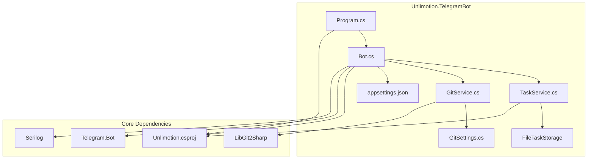
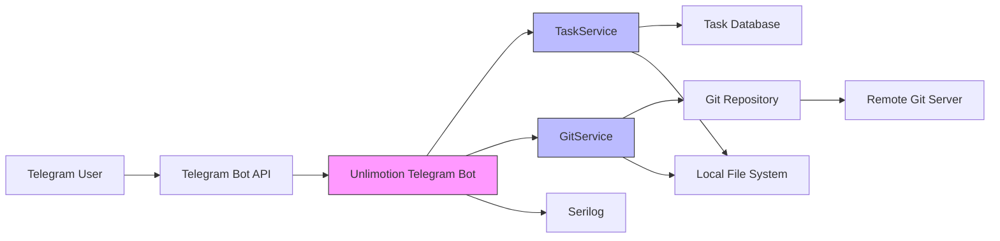
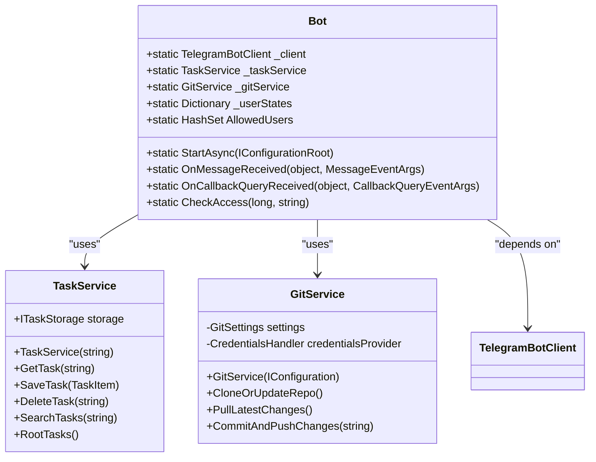
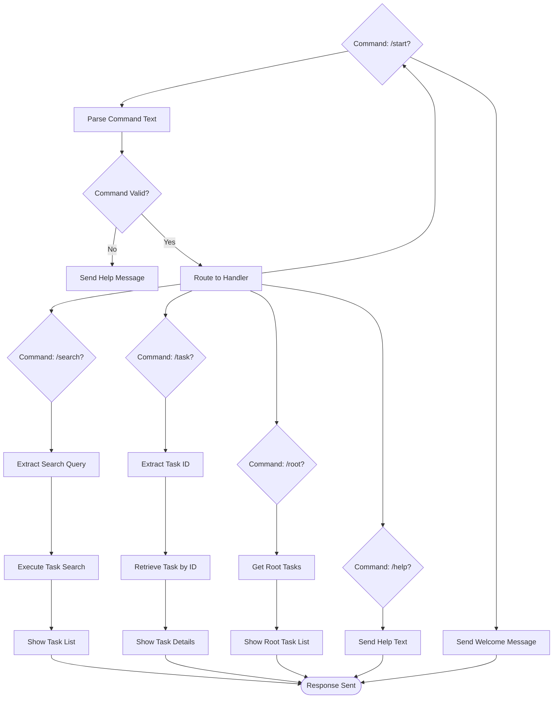
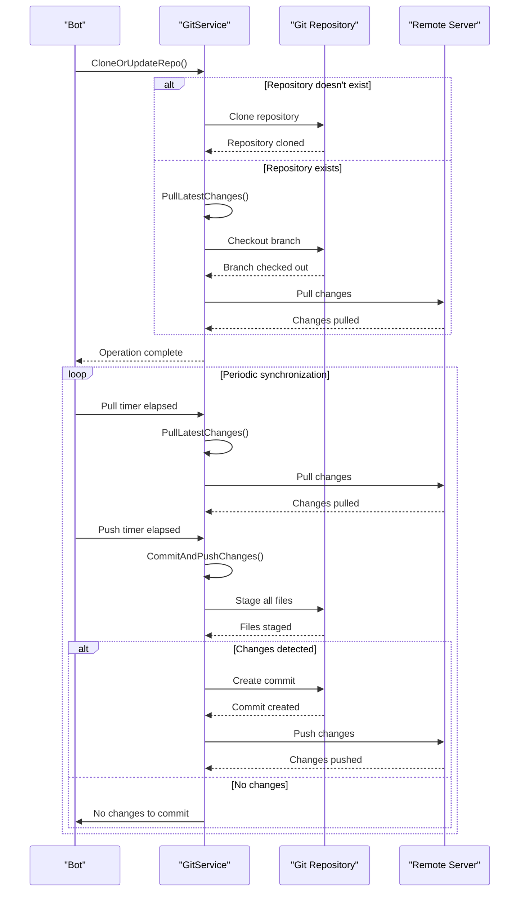
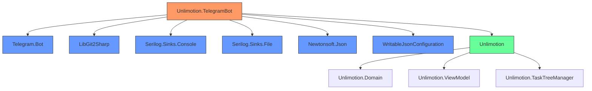

# Telegram Bot Integration

<cite>
**Referenced Files in This Document**   
- [Bot.cs](file://src/Unlimotion.TelegramBot/Bot.cs) - *Updated in recent commit*
- [TaskService.cs](file://src/Unlimotion.TelegramBot/TaskService.cs) - *Added in recent commit*
- [GitService.cs](file://src/Unlimotion.TelegramBot/GitService.cs) - *Added in recent commit*
- [GitSettings.cs](file://src/Unlimotion.TelegramBot/GitSettings.cs) - *Added in recent commit*
- [appsettings.json](file://src/Unlimotion.TelegramBot/appsettings.json) - *Updated in recent commit*
- [Program.cs](file://src/Unlimotion.TelegramBot/Program.cs) - *Added in recent commit*
- [Unlimotion.TelegramBot.csproj](file://src/Unlimotion.TelegramBot/Unlimotion.TelegramBot.csproj) - *Added in recent commit*
</cite>

## Update Summary
**Changes Made**   
- Updated documentation to reflect the new Telegram bot integration with remote task management capabilities
- Added detailed information about command handlers for task creation, status updates, and list retrieval
- Documented Git backup integration allowing synchronization via Telegram commands
- Added authentication mechanism and user identification system details
- Included setup instructions for bot deployment and webhook configuration
- Added examples of supported commands and their syntax
- Updated performance considerations for large task databases

## Table of Contents
1. [Introduction](#introduction)
2. [Project Structure](#project-structure)
3. [Core Components](#core-components)
4. [Architecture Overview](#architecture-overview)
5. [Detailed Component Analysis](#detailed-component-analysis)
6. [Dependency Analysis](#dependency-analysis)
7. [Performance Considerations](#performance-considerations)
8. [Troubleshooting Guide](#troubleshooting-guide)
9. [Conclusion](#conclusion)

## Introduction
The Unlimotion Telegram Bot integration provides a remote interface for task management through Telegram commands. This documentation details how users can interact with their task database via Telegram, including configuration, command implementation, Git integration, authentication, and deployment. The bot enables users to perform common task operations, synchronize data via Git, and manage their tasks from any location using the Telegram messaging platform.

## Project Structure
The Telegram bot is implemented as a separate project within the Unlimotion solution, located in the `src/Unlimotion.TelegramBot` directory. This project is a .NET 9.0 console application that integrates with the core Unlimotion functionality through project references. The bot uses the Telegram.Bot library to handle messaging and LibGit2Sharp for Git operations, with configuration managed through appsettings.json.

**Diagram sources**
- [Unlimotion.TelegramBot.csproj](file://src/Unlimotion.TelegramBot/Unlimotion.TelegramBot.csproj)
- [Program.cs](file://src/Unlimotion.TelegramBot/Program.cs)

**Section sources**
- [Unlimotion.TelegramBot.csproj](file://src/Unlimotion.TelegramBot/Unlimotion.TelegramBot.csproj)

## Core Components
The Telegram bot integration consists of several core components that work together to provide remote task management functionality. These include the main Bot class that handles Telegram interactions, the TaskService that interfaces with the task database, the GitService that manages version control synchronization, and the configuration system that controls bot behavior. The components are designed to work together seamlessly, allowing users to manage their tasks through Telegram commands while maintaining data integrity through automated Git operations.

**Section sources**
- [Bot.cs](file://src/Unlimotion.TelegramBot/Bot.cs)
- [TaskService.cs](file://src/Unlimotion.TelegramBot/TaskService.cs)
- [GitService.cs](file://src/Unlimotion.TelegramBot/GitService.cs)

## Architecture Overview
The Unlimotion Telegram Bot follows a modular architecture with clear separation of concerns. The bot acts as a bridge between Telegram's messaging platform and the Unlimotion task management system. When a user sends a command, the bot processes the request, interacts with the local task database, and returns the results via Telegram. The architecture includes automatic Git synchronization to ensure data consistency across devices, with periodic pull and push operations configured through settings.

**Diagram sources**
- [Bot.cs](file://src/Unlimotion.TelegramBot/Bot.cs)
- [TaskService.cs](file://src/Unlimotion.TelegramBot/TaskService.cs)
- [GitService.cs](file://src/Unlimotion.TelegramBot/GitService.cs)

## Detailed Component Analysis

### Bot Implementation
The Bot class is the central component of the Telegram integration, responsible for handling all incoming messages and callback queries from Telegram users. It establishes a connection with the Telegram Bot API using a token configured in appsettings.json and sets up event handlers for message reception and callback processing. The bot implements a state management system to handle multi-step operations like task creation, where user input is collected across multiple messages.

**Diagram sources**
- [Bot.cs](file://src/Unlimotion.TelegramBot/Bot.cs#L15-L478)
- [TaskService.cs](file://src/Unlimotion.TelegramBot/TaskService.cs#L3-L96)
- [GitService.cs](file://src/Unlimotion.TelegramBot/GitService.cs#L3-L109)

**Section sources**
- [Bot.cs](file://src/Unlimotion.TelegramBot/Bot.cs#L1-L478)

### Command Handler Implementation
The bot implements a comprehensive command handling system that supports various task management operations through Telegram commands. The command handlers are structured to provide a consistent user experience with appropriate error handling and feedback. Commands are processed in the OnMessageReceived method, which routes incoming messages to the appropriate handler based on the command prefix.

**Diagram sources**
- [Bot.cs](file://src/Unlimotion.TelegramBot/Bot.cs#L100-L200)

**Section sources**
- [Bot.cs](file://src/Unlimotion.TelegramBot/Bot.cs#L70-L250)

### Git Integration
The Git integration component enables automatic synchronization of task data with a remote Git repository. This functionality allows users to maintain version control over their task database and synchronize changes across multiple devices. The GitService class handles all Git operations, including repository cloning, pulling latest changes, and committing/pushing changes.

**Diagram sources**
- [GitService.cs](file://src/Unlimotion.TelegramBot/GitService.cs#L30-L109)
- [Bot.cs](file://src/Unlimotion.TelegramBot/Bot.cs#L60-L75)

**Section sources**
- [GitService.cs](file://src/Unlimotion.TelegramBot/GitService.cs#L1-L109)

## Dependency Analysis
The Telegram bot has dependencies on several external libraries and internal components. The primary external dependencies include the Telegram.Bot library for Telegram API integration, LibGit2Sharp for Git operations, Serilog for logging, and WritableJsonConfiguration for configuration management. The bot also references the core Unlimotion project to access task storage and domain models.

**Diagram sources**
- [Unlimotion.TelegramBot.csproj](file://src/Unlimotion.TelegramBot/Unlimotion.TelegramBot.csproj)
- [Bot.cs](file://src/Unlimotion.TelegramBot/Bot.cs)

**Section sources**
- [Unlimotion.TelegramBot.csproj](file://src/Unlimotion.TelegramBot/Unlimotion.TelegramBot.csproj)

## Performance Considerations
The Telegram bot implementation includes several performance considerations to ensure responsive operation and efficient resource usage. The bot uses asynchronous programming patterns throughout to prevent blocking operations, particularly for I/O operations like database access and network requests. The Git synchronization is handled by background timers that operate independently of the main message processing loop, preventing delays in user interactions.

For large task databases, the search functionality may experience performance degradation as it performs in-memory filtering of all tasks. The current implementation loads all tasks into memory for searching, which could lead to high memory usage with large datasets. The periodic Git operations are designed to be lightweight, with pull operations occurring every 30 seconds and push operations every 60 seconds by default, but these intervals can be adjusted based on performance requirements.

The bot maintains a user state dictionary to handle multi-step operations, which has minimal memory overhead as it only stores user IDs and state information. Error handling is implemented throughout the codebase to ensure that any issues with task retrieval, Git operations, or Telegram API calls do not crash the bot, allowing it to continue processing other requests.

## Troubleshooting Guide
When encountering issues with the Unlimotion Telegram Bot, consider the following common problems and solutions:

1. **Bot not responding to commands**: Verify that the bot token in appsettings.json is correct and that your user ID is included in the AllowedUsers list. Check the logs in the logs/ directory for any startup errors.

2. **Git synchronization failures**: Ensure that the Git repository URL, username, and password in appsettings.json are correct. Verify that the repository path exists and is accessible. Check that the Git credentials have the necessary permissions to read from and write to the repository.

3. **Task data not updating**: Confirm that the RepositoryPath in the Git settings points to the correct location of your task database. Verify that the automatic push interval is set appropriately for your needs.

4. **Authentication issues**: If users are denied access, double-check that their Telegram user ID is correctly added to the AllowedUsers array in appsettings.json. User IDs can be obtained by sending a message to the @userinfobot Telegram bot.

5. **Performance issues with large databases**: For large task databases, consider increasing the Git pull and push intervals to reduce the frequency of repository operations. Monitor memory usage as the current implementation loads all tasks into memory for searching.

**Section sources**
- [Bot.cs](file://src/Unlimotion.TelegramBot/Bot.cs#L450-L477)
- [GitService.cs](file://src/Unlimotion.TelegramBot/GitService.cs#L20-L109)
- [appsettings.json](file://src/Unlimotion.TelegramBot/appsettings.json)

## Conclusion
The Unlimotion Telegram Bot integration provides a powerful remote interface for task management, allowing users to interact with their task database through familiar Telegram commands. The integration is well-structured with clear separation of concerns between message handling, task management, and Git synchronization components. The configuration system makes it easy to set up and customize the bot's behavior, while the automatic Git integration ensures data consistency across devices.

The bot supports essential task operations including task creation, status updates, and list retrieval, with a user-friendly interface that leverages Telegram's inline keyboard functionality. The authentication system based on user IDs provides basic access control, while the comprehensive error handling ensures reliable operation. For users who rely on Git for backup and synchronization, the bot offers seamless integration that keeps their task data up-to-date across all platforms.